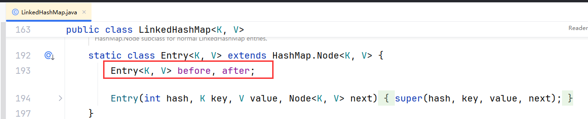
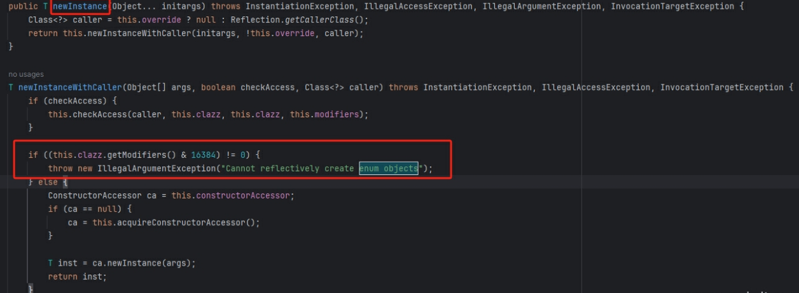

# 2025最新突击学员面经

## 一、Object对象方法有哪些？（高御科技）

非常常规的问题，打开IDEA直接瞧一眼

+ getClass() - 获取运行是的Class对象，属于反射的内一套，获取运行是的一些数据。
+ hashCode() - 返回对象的hash值。目的是为了更好的支持哈希表，比如基于Java中的HashMap使用
+ equals() - 比较两个对象是否相等，默认 ==
+ clone() - 创建对象的副本。深拷贝和浅拷贝的内容
  + 默认是浅拷贝，将当前对象复制一份，其中的基本数据类型直接复用值，引用数据类型是复用地址值。
  + 深拷贝，将当前对象复制一份，其中的基本数据类型直接复用值，引用数据类型会重新的创建一个，不会复制之前的地址。 深拷贝要自己编写克隆内部的引用类型对象。
+ toString - 返回一个以字符串形式表示当前对象的信息。
+ wait - 当某个线程持有当前对象锁时，可以执行对象锁.wait，将持有对象锁的线程挂起等待。
+ notify - 当某个线程持有当前对象锁时，可以执行对象锁.notify，唤醒之前基于wait挂起的一个线程。
+ notifyAll - 当某个线程持有当前对象锁时，可以执行对象锁.notifyAll方法，唤醒之前所有基于wait挂起的线程。
+ finalize - 当触发垃圾回收时，如果当前对象无法基于可达性分析定位到，就会被垃圾回收器回收掉，在回收之前，如果这个对象重写了finalize，那就会触发finalize方法执行。可以执行一些其他的清理工作。（Finalize在JVM中，他不保证一定执行，他用的守护线程）

## 二、创建对象的方式？（高御科技）

首先，这个问题意义不大，更多的跟前面的Object类似，是一个引导向的问题。

+ new 关键字。
+ Construct，利用Construct的newInstance去构建对象。**（引导Spring~）**
+ 反序列化方式：
  + 流反序列化。
  + JSON字符串反序列化等等……
+ clone，克隆也是ok的。
+ 工厂模式去构建对象。**（引导Spring~）**

## 三、为啥要有clone？(深/浅拷贝)（高御科技）

Java中提供的clone方法主要是允许将一个对象进行copy，做到快速的复制一个对象。

而不需要new一个空对象，然后自己慢慢导入数据，开发效率太低。

这可以减少内存分配和垃圾回收的压力，尤其是在创建大量对象时。

默认的 `clone` 方法实现是浅拷贝。如果需要深拷贝，必须重写 `clone` 方法，并在其中实现深拷贝的逻辑。

如果再问clone，基本就是聊聊深拷贝，和浅拷贝。

+ 默认是浅拷贝，将当前对象复制一份，其中的基本数据类型直接复用值，引用数据类型是复用地址值。
+ 深拷贝，将当前对象复制一份，其中的基本数据类型直接复用值，引用数据类型会重新的创建一个，不会复制之前的地址。 深拷贝要自己编写克隆内部的引用类型对象。

## 四、构造器是否可以被重写？（弘玑）

这个问题明显就是在问方法重载和方法重写的问题。

构造器是不可以重写的，每个类的构造方法都是当前类名。

但是构造器是可以重载的。你写的内些有参，我无参不都是方法重载么~~

+ 重写（Overrides）：是指子类提供父类中声明的方法的具体实现。也可以覆盖父类中提供好的实现内容。 **要求是：方法声明都完全一致，除了访问修饰符不能更低。**
+ 重载：是指一个类中，定义多个名字相同的方法，但是方法的参数不一样，与返回结果无关。

## 五、跳出循环？如何在内层循环跳出外层循环？（上海天正）

很基础的问题：

+ continue：结束当次循环，继续下次循环。
+ break：结束循环。

在内层跳出外层，专业点就加锚点，加标签，其实就是起个名字。

咱们可以break或者continue的时候，指定要你要跳出的名字。就可以了，如下。

```java
public static void main(String[] args) {
    outter: for(;;){
        inner: for(;;){
            break outter;
        }
    }
    xxx: if(true){
        //111
        //222
        break xxx;
    }
    yyy: while(true){
        break yyy;
    }
}
```

## 六、什么是泛型，怎么使用？（鸿盛天极）

比如List集合啥的，都定义了一个泛型，咱们可以在new的时候，将泛型具体化。

Java中的泛型就是一种规避类型错误的一种安全机制。

ClassCastException

当你在声明一个集合并且指定泛型的类型后，你存储的数据类型就会有限制了，存储的不允许的类型，在编译时期就会直接报错了。

+ 类型的安全，前面可以看出来。
+ 减少强制类型转换的操作

---

后面一半会衍生出来 **泛型擦除** 的问题。

泛型擦出去是编译器在编译是的一种机制，你编写的Java代码变为class文件后，他就没有泛型这个东西了，底层都是最顶级的Object。所以泛型只是在编写时加上，其次底层运行时，压根就没泛型这个东西。

就比如`List<String>`运行后，他就是List。

---

**泛型擦除有什么影响嘛？**

反射的时候，获取一些实例的时候，需要手动强转一下，满不爽的。。。

## 七、Java类的加载顺序？（老虎证券）

我在听录音听到这个问题的时候我懵了。

这个问题问的很奇怪，具体想聊的估计只有两个

+ **类加载过程**
  + 加载： 先找到字节码文件（.class文件），加载到JVM内存中的方法区里。 然后在内存中的体现就是一个Class对象。
  + 验证： 验证加载到内存里的.class文件是否被篡改过，确认没有安全问题，以及符合JVM规范。
  + 准备： 为类中的一些变量分配内存空间，并且设置一下默认值。
  + 解析： 将常量池内的符号引用转为直接引用。
    + 符号引用：符号引用是一种泛指，com/mashibing/A-findAll()void
    + 直接引用：直接指向的内库的具体位置，直接就是内存偏移量。后面调用会更快。
  + 初始化：对所有静态变量复制，执行静态代码块，初始化好父类~~
  + 前面走完，到这，这个.class就可以在Java程序中使用了，new一个对象，类名.静态方法都可以了
+ **双亲委派**
  + 他其实就是加载这个过程的细节，需要先掌握一下Java中默认的三种类加载器
    + BootstrapClassLoader：负责加载jdk/jre/lib/rt.jar
    + ExtensionClassLoader：负责加载jdk/jre/lib/ext目录下的jar文件
    + ApplicationClassLoader：负责加载classpath目录下的各种class文件。 所谓的classpath，其实就是编译后的classes目录。
    + 其实还有一个自定义的，你自己去继承ClassLoader，重新他的方法，指定你要加载的位置。
  + 双亲委派的过程。当需要用到某个class文件时，撇掉自定义类加载器，他会按照这个方式去加载
    + 先调度AppClassLoader，先查看AppClassLoader加载过么？没加载过，往上问。
    + 问到ExtClassLoader，先查看ExtClassLoader加载过么？没加载过，网上问。
    + 最终问到BootstrapClassLoader，先查看BootstrapClassLoader加载过么？没加载过，尝试加载！如果rt.jar里没有这个.class文件可以加载，往下分配。
    + 分配到ExtClassLoader，他去尝试在ext目录下去加载，如果也没加载到，往下分配。
    + 最终分配到AppClassLoader，他尝试去classpath目录下找这个.class文件加载。
    + 如果没找到，也没加载到，抛一个异常，ClassNotFoundException。
  + 双亲委派解决了什么问题，搞的这么麻烦？？
    + 防止类的重复加载……
    + 防止你破坏JDK的结构……
      + 比如现在我要加载一个java.lang.String这个类！

## 八、两个List的交集元素？（闪送）

首先，Java中就提供了一个API，让咱们可以直接使用的。

提供的方式叫retainAll方法。

可以直接 list1.retainAll(list2)，他会将list1中的数据，只保留list1和list2的交集结果。

他内部**采用的机制是双指针**。

+ 指针A：初始在0位置，如果有交集元素，赋值，然后向后移动一个位置
+ 指针B：每次都会往后移动一个位置指向一个元素，同时利用contains判断元素是否存在，存在，在指针A的位置赋值，然后指针A移动，指针B也移动。如果不存在交集情况，A不动，B动。

---

如果不让用Java中提供的API，那就**自己搞**个Hash表，比如HashMap似的东西，利用计数器的方式去解决这个问题。

遍历list1，在哈希表里存储key = 值，value = 1。

遍历list2，直接哈希表里去get，如果拿到的是1，证明存在，是交集数据，存到一个临时的集合中。

临时的集合，放着所有交集的数据。

O(m + n)

## 九、解释什么是面向对象编程（OOP），并讨论Java中封装、继承和多态的实现方式及其应用场景（百度AI）

这个问题，没有什么标准的答案，一般就是根据自己的技术储备和你项目中实际涉及到的点去聊。

其实面向对象的思想底层还是面向过程，只不过把一些复杂的操作封装成类，方便咱们操作。

就比如你们的项目中实际涉及到了什么事情，这个事情本质的行为逻辑市面上已经有很多成熟的方案。

比如我们的短信平台里，需要和运营商去交互，运行商对外提供了一套CMPP（中国移动）的协议，咱们需要根据他的协议去完成一套实现。但是市面上有很多开源框架都对接了CMPP2.0，还是CMPP3.0，我不需要自己再去造一套轮子，我可以拿过来稍微改一改直接应用到项目中。

当然，想要将一些封装好的工具，经过一些润色，从而更贴近咱们本身的业务方向，其实这个事情还是要究其底层的实现过程。

---

**封装：** 封装其实非常常见，比如映射数据库表的ORM的实体类，或者是响应给前端数据时，封装一个VO，或者传输对象数据时，也会涉及到DTO之类的内容，这些都是封装的具体体现。而这些类内部都是将 **属性进行私有化** ，不允许直接修改，但是会对外提供 **set、get的公共方法** 去操作，而在方法中就可以直接很多限制，来 **保证数据的安全** 。

**继承：** 这个更好办， **继承就是站在巨人的肩膀上** ，可以直接继承一个功能强大的类，直接使用他提供的各种功能。 这个强大的类，可以是前人种树留下来的，也可以是后续基于多个类似的类，向上抽取出来的一个公共的类。比如JUC包下的AQS，提供了响应的state属性，同步队列以及单向链表来给JUC包下的其他并发工具类来继承。。。。

**多态：** 多态在平时写代码的时候，用的非常之频繁，同一个动作，可以有多种实现，代码最直观的体现，就是使用 **父类接口指向子类的实现** 。 比如Controller注入Service，都是声明Service接口，然后基于Spring注入一个实现类。 比如CacheService，是一个提供缓存的功能接口，可以给CacheService提供多种实现，比如MemcacheServiceImpl，比如RedisServiceImpl，再比如CoffeineServiceImpl，提供多种缓存策略的实现，可以基于不同的注入方式，使用不同的缓存实现。

## 十、数组和链表区别（国人通）

这个问题，约等于问了ArrayList和LinkedList的区别

数组和链表核心的区别就三个东西：

+ 查询效率
  + 数组：可以通过索引直接访问数组上任意位置的元素，时间复杂度直接O1，效率嘎嘎快。
  + 链表：只能顺序访问，要么从头开始找，要么从尾巴开始找到目标元素，时间复杂度On。
+ 增删效率：
  + 数组：在数组中间插入或者删除元素，会导致需要移动其他元素，这个本身就是一个比较耗时的操作。
  + 链表：插入和删除操作，只需要更改相邻的两个节点的指针就可以了，其他元素不需要动。
+ 内存使用
  + 数组： 数组申请时，需要一片连续的内存空间，而且要提前指定好长度。或多或少可能会浪费一些空间，而且预计的大小不够，扩容还需要再构建一波新的数组。特别是如果你的JVM中有内存碎片的问题，在申请一个比较长的数组时，可能时间导致执行GC甚至是OOM。
  + 链表：不需要提前申请很大一片内存空间，但是链表的每个节点需要额外的存储空间来保存指针。链表他不需要扩容。

---

+ 如果你需要快速的随机访问元素，并且可以大致预估出需要的数据个数，那么数组更合适。
+ 如果你的业务是频繁的增删数据，很明显，链表更合适。

线程池 -- 阻塞队列 -- ArrayBlockingQueue， LinkedBlockingQueue，明显链表好，可以望这拐。

## 十一、讨论Java集合框架的主要接口（如List、Set、Map）的特点，举例说明在什么场景下使用它们（美团地图、众安保险）

这种问题，就是会是应该的，不会就回家等通知。。

List：

+ 特点：List是有序集合（存取有序），允许元素重复，并且可以存储null值。
+ 适用场景：
  + 当你需要维护元素的插入顺序时，比如实现一个队列可以上List
  + 当你需要遍历整个元素时，可以采用List
+ 扩展：List下有ArrayList，LinkedList，聊数组和链表的问题…………还有一个Vector，这哥们线程安全的，但是用的synchronized，效率不好…………

Set：

+ 特点：Set不允许存储重复的元素，也不能保证元素的顺序（存取有序，除了LinkedHashSet），能存储Null，但是只能存一个
+ 适用场景
  + 当你需要保证元素的唯一性时，比如用户手机号，用户的ID。
  + 当你需要做去重操作时，Set是一个很好的工具。
+ 扩展：Set本质是基于HashMap的key去实现的。基于哈希表做到的去重效果。但是HashMap线程不安全。。。。。。。

Map：

+ Map建议就直接点一嘴，他是双列集合。有key-value结构。底层就是哈希表，结构是数组 + 链表实现的，在JDK1.8之后，优化了一波红黑树来提升HashMap的查询效率。。。。

## 十二、HashSet底层怎么实现的？（高御科技）Map和Set区别（江苏探路者国际物流）LinkedHashSet是怎么保证存储有序的（图灵教育）

**HashSet底层怎么实现的？**

这还用问么，前面说了，HashSet底层就是HashMap的key。

**Map和Set区别？**

没有所谓的区别，Set是基于Map的key实现的。

**LinkedHashSet是怎么保证存储有序的？**

你也可以理解为LinkedHashMap是怎么保证存取有序的。。所以他还是基于哈希表去存的。而哈希表有个特点，必然是基于key的hash运算跟数组做一些操作，得到要存储的索引位置，顺序必然是随机的，但是LinkedHashSet就是有序的，怎么保证的？

其实没啥难的，就是对HashMap里的Node又包装了一层，搞了个before和after，来记录存取顺序

**当插入重复元素时，内部流程怎么走的？**

将之前Node的value做了个替换。。

## 十三、JDK8的新特性（众安保险，美团地图等等）

给方向

**interface的新特性：（不需要说太细，点一嘴，他没啥扩展的。）**

+ default关键字：可以规避接口中必须要重写的这点，一些不必要的方法，不常用的方法，可以来个default给予默认的实现。
+ static关键字：可以在接口中提供直接访问的方法，给予接口名.方法，去调用。

**时间类新特性：**

+ 支持时区，ZonedDateTime类，允许你方便的处理不同时区的信息。不需要三方依赖库。
+ 线程安全性，他一旦创建是不可变的，线程安全，可以在并发环境中用！
+ 更丰富的API，之前Date需要配置Calender去做一些时间处理，而现在，java.time包下的时间类，API嘎嘎丰富。
+ 但是注意一点，在使用time包下的时间时，注意指定好序列化JSON的序列化格式。。。。。

**lanbda，Stream**

+ lambda

```plain
一个语法糖，让代码看着更舒服，比如匿名内部类，不需要再去new 接口，重新抽象方法了。
提高一些可读性，看着更舒服，并且利用它支持函数式编程和stream
```

+ Stream

```plain
链式调用，舒服的一批，还提供了各种丰富的中间操作，map，filter等等，然后可以可以上一个collect结束整个流操作。
而且操作结果时，过滤，映射，规约，排序，匹配等等，嘎嘎好用。
但是需要一定的学习成本。
```

hashMap的红黑树问题。。

## 十四、使用Stream流的坑及解决方案（美团地图）

Stream最出名，最大的坑，就是他的parallel，并行流。

用了并行流，将相当于上了线程池，做并行操作，你会天真的以为，性能提升了。

首先parallel这个东西的核心问题，就是他默认所有的parallel都会用ForkJoinPool的线程池，默认的线程数是CPU内核 - 1（我记得是）。每个parallel任务都用他，如果自己没有主动的根据业务去设置一个参数合理的线程池的话，反而不会提升性能，会让处理速度变低。。。。。

比如你把大量的IO密集的操作用parallel并行流去玩，结果线程个数没有达到IO密集的要求，前几个任务还好，后几个任务就需要等待前面的任务完成，才有线程用，反而会让多个请求变成了一个串行处理的套路。甚至不如不用。。。

解决方案，就是必须自己设置一个合理的线程池，建议，及其建议，上ThreadPoolExecutor

---

把数据转成Map，因为获取的数据有重复，导致的错误（不算坑，完全因为不熟悉导致的）

在将List数据转成Map，方便基于get去查询数据时，如果转换时，List中数据作为key的如果有重复，会导致转换时出现错误。

其实不算是坑，就是单纯的stream不是所有API都熟练！！！

## 十五、JDK1.8的数据结构的优化（美团地图）

问到这个，就是在HashMap。。。

HashMap在JDK1.8的时候，织入了红黑树结构来提升HashMap的查询效率。。。

聊到这，还得在说一点，比如什么时候转红黑树？ 不啥不用别的树？？

**数组 >= 64，链表 > 8（链表插入第9个元素时）**

在treeifyBin转红黑树的逻辑中，会先判断数组长度是否达到64，没达到会先扩容数组。

因为红黑树的目的是为了提升查询的性能，如果数组长度太短，导致出现了红黑树，那反而会导致写入的性能和查询的性能都收到影响。在数组长度太短时，会优先考虑扩容，而不是转红黑树。

链表大于8怎么来的，源码写的，数据添加到链表下后，会判断binCount是否达到了插入第9个元素的时候。

**链表长度为啥是大于8。不是10，不是7，不是6？？凭啥。**

泊松分布，基于泊松分布，得出，在链表长度为9的时候，概率贼低。

但是也不是说非9不可，其实降一降，或者升一升也没啥毛病，概率依然很低，、

所以核心就是源码就这么写的。。。（不建议在面试的时候说。）

## 十六:为什么 ArrayList 的 elementData 加上 transient 修饰？（京东）

`transient` 用来修饰类的成员变量，表示该成员变量在序列化时不会被持久化存储。也就是说，当对象被序列化时，`transient` 修饰的字段会被忽略，不会写入到序列化的字节流中。

所以这里是确保**ArrayList反序列化时不会被破坏里面的elementData**(不丢失原先的元素) . 进入ArrayList源码可见

ArrayList 实现了 Serializable 接口，这意味着 ArrayList 支持序列化。

transient 的作用是说不希望 elementData 数组被 序列化，重写了 writeObject 方法。每次序列化时，先调用 defaultWriteObject() 方法 序列化 ArrayList 中的非 transient 元素，然后遍历 elementData，只序列化已存入的元素，这样既加快了序列化的速度，又减小了序列化之后的文件大小

追问：

## 十七：单列模式是否会被序列化反序列化破坏？（京东）

类似面试题：spring IOC容器用的什么存储对象？

ConcurrentHashMap如何做到不被**序列化反序列化**破坏单列？是否被**反射**破坏？

**简答**：推荐枚举型单列不会被序列化和反序列化破坏且不会被反射破坏。原因在于

ObjectInputStrean类会调用readObject来读取对象。对于枚举类型readObject会调用readEnum，根据名称和类型找到已存在的枚举常量：Enum.valueOf()所以不会被序列化和反序列化破坏。并且通过反射newInstance()来创建一个枚举实例时，会抛IllegalArgumentException异常并提示并指出 `"Cannot reflectively create enum objects"`。其他单列实现需要加上readResolve()方法，反序列化时会检查有没有这个方法，如果有可以调用这个方法返回对象。

**前置基础：**

产生原因：对象序列化再反序列化时，会生成一个新的对象，从而破坏单例：

```java
public static void normalSingletonDeserializeProblem() throws IOException, ClassNotFoundException {
    StaticInnerclassSingleton o1 = StaticInnerclassSingleton.getInstance();
    //通过writeObject将对象序列化到文件
    ObjectOutputStream oos = new ObjectOutputStream(new FileOutputStream("tempFile"));
    oos.writeObject(o1);

    //读取文件，反序列化
    File file = new File("tempFile");
    ObjectInputStream ois = new ObjectInputStream(new FileInputStream(file));
    StaticInnerclassSingleton newInstance = (StaticInnerclassSingleton) ois.readObject();

    System.out.println(o1);
    System.out.println(newInstance);
    System.out.println(StaticInnerclassSingleton.getInstance());
}
```

运行结果：

```plain
//反序列化之后，生成了一个新的对象，单例被破坏
design.Singleton.StaticInnerclassSingleton@63947c6b
design.Singleton.StaticInnerclassSingleton@34a245ab
design.Singleton.StaticInnerclassSingleton@63947c6b
Process finished with exit code 0
```

**单列模式**：（创造型）

1饿汉式： （类初始化就生成对象），可以是 1-1 静态成员变量 也可以是 1-2 静态代码块

2懒汉式：2-1 方法锁

2-2 双重检查锁 2-3 java内部类

3注册式：3-1 容器 3-2 枚举(**推荐**) 属于懒汉式

**推荐枚举型不会被反射破坏的原因**在于对象被反序列化时，ObjectInputStrean类会调用readObject来读取对象。对于枚举类型readObject会调用readEnum，根据名称和类型找到已存在的枚举常量：Enum.valueOf()所以不会被破坏。

并且枚举型单列还不会被反射破坏。通过**反射**newInstance()来创建一个枚举实例时

```java
public static void enumReflection() throws NoSuchMethodException, IllegalAccessException, InvocationTargetException, InstantiationException {
    Constructor c = EnumSingleton.class.getDeclaredConstructor(String.class, int.class);
    c.setAccessible(true);
    EnumSingleton o1 = (EnumSingleton) c.newInstance();
    EnumSingleton o2 = EnumSingleton.getInstance();
    System.out.println(o1);
    System.out.println(o2);

}
```

会抛IllegalArgumentException异常并提示并指出 `"Cannot reflectively create enum objects"`

```plain
Exception in thread "main" java.lang.IllegalArgumentException: Cannot reflectively create enum objects
    at java.lang.reflect.Constructor.newInstance(Constructor.java:417)
    at design.Singleton.Reflection.enumReflection(Reflection.java:22)
    at design.Singleton.Reflection.main(Reflection.java:30)
Process finished with exit code 1
```

源码可见：



其他实现单例方式在反序列化后，要确保唯一实列，需要定义**readResolve**方法

```java
class NoProblemSingleton implements Serializable {
    private NoProblemSingleton() {}

    public static NoProblemSingleton getInstance() {
        return InnerHolder.INSTANCE;
    }

    private static class InnerHolder {
        private static final NoProblemSingleton INSTANCE = new NoProblemSingleton();
    }

    //实现readResolve方法可以解决反序列化攻击，反序列化时会检查有没有这个方法，如果有可以调用这个方法返回对象
    private Object readResolve() {
        return InnerHolder.INSTANCE;
    }
}
```

运行结果：

```plain
design.Singleton.NoProblemSingleton@63947c6b
design.Singleton.NoProblemSingleton@63947c6b
design.Singleton.NoProblemSingleton@63947c6b
true
Process finished with exit code 0
```

既然重写就能避免破坏为何推荐枚举呢？

原因在于：调用readResolve方法并最终用readResolve方法返回的对象替换反序列化出来的对象。不过替换是发生在反序列化之后的，也就是说反序列化的对象还是生成了，只不过无法被访问只能等待GC回收。

但是容器式单例（**ConcurrentHashMap**）虽然implements 了Serializable接口，但我没看到类里面有定义readResolve方法，它是怎么防止反序列化的破坏的？

通过关键字transient 或者 实现Serializable+定义readObject控制反序列化逻辑。

在内存中map存放这个对象，就算序列到本地，反序列也是找到map中拿到原来的。

具体逻辑如下：

序列化：把内存中 对象的状态转换成字节码 ， 再把字节码通过IO输出流写到磁盘上，持久化

反序列化：将持久化的字节码内容，通过IO输入流读取到内存中来，转换成Java对象

是通过重组字节码来生成对象。 可测试 构造函数是否打印多次。

```java
/**
 * @Auth:TianMing
 * @Description： TODO
 */
public class SeriableSingleton  implements Serializable {
    //序列化就是说把内存中的状态通过转换成字节码的形式
    //从而转换一个 IO 流，写入到其他地方(可以是磁盘、网络 IO)
    //内存中状态给永久保存下来了

    //反序列化
    //将已经持久化的字节码内容，转换为 IO 流
    //通过 IO 流的读取，进而将读取的内容转换为 Java 对象
    //在转换过程中会重新创建对象 new
    public final static SeriableSingleton INSTANCE = new SeriableSingleton();
    private SeriableSingleton(){}
    public static SeriableSingleton getInstance(){
        return INSTANCE;
    }
    //    //针对反序列化破话单例的问题
    //    private Object readResolve(){
    //        return INSTANCE;
    //    }

    public static void main(String[] args) {
        //序列化 反序列化  在内存中map存放这个对象，就算序列到本地，反序列也是从map中拿到原来的。
        SeriableSingleton s1 = null;
        SeriableSingleton s2 = SeriableSingleton.getInstance();
        FileOutputStream fos = null;
        try {
            //序列化
            fos = new FileOutputStream("SeriableSingleton.obj");
            ObjectOutputStream oos = new ObjectOutputStream(fos);
            oos.writeObject(s2);
            oos.flush();
            oos.close();
            //反序列化
            FileInputStream fis = new FileInputStream("SeriableSingleton.obj");
            ObjectInputStream ois = new ObjectInputStream(fis);
            s1 = (SeriableSingleton)ois.readObject();
            ois.close();
            System.out.println(s1);
            System.out.println(s2);
            System.out.println(s1 == s2);
        }catch (Exception e ){
            e.printStackTrace();
        }
    }
}
```

跟进源码 readObject（）， 进入 V v = s.readObject()

```java
s1 = (SeriableSingleton)ois.readObject();
//入 调用   
Object obj = this.readObject0(false);
//中判断监测
return checkResolve(readOrdinaryObject(unshared));   
//进入： 
readOrdinaryObject()
//可见985行判断 是否有 
desc.hasReadResolveMethod())
// 有则会调用 你的 
invokeReadResolve(Object obj) 方法
//   可以进入看看怎么调的  里面通过反射机制 调用此方法
return readResolveMethod.invoke(obj, (Object[]) null); 
//   最后返回这个对象 ，就不会去重写创建了。

//有的话就会去调用  newInstance方法
//码 看 readOrdinaryObject()  方法
//在判断之前 的  obj = new Instance() 方法去创建。
```

 **更多细节翻看面试突击宝典，或留言**
