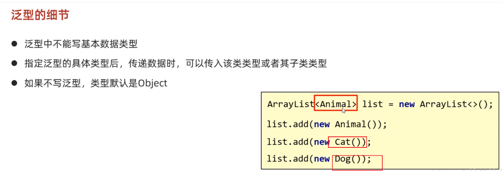
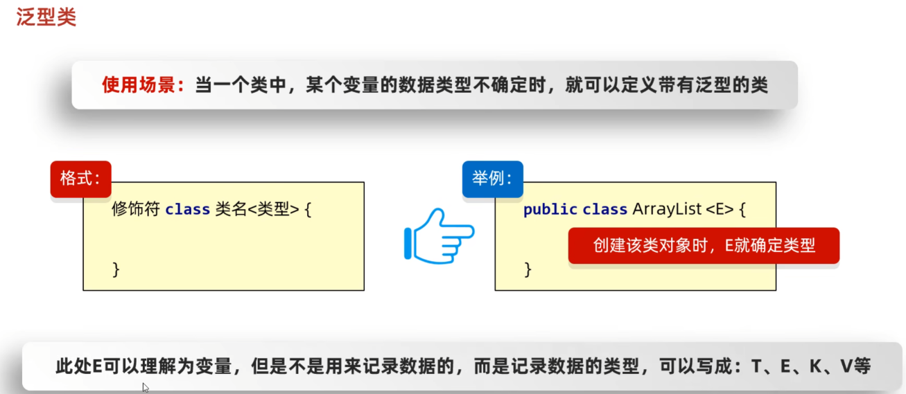
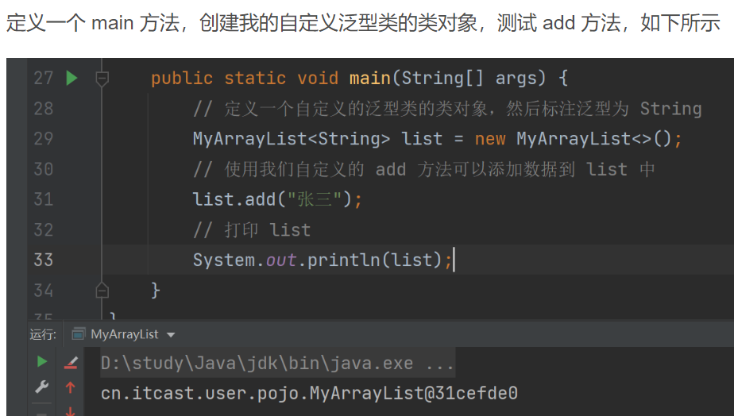
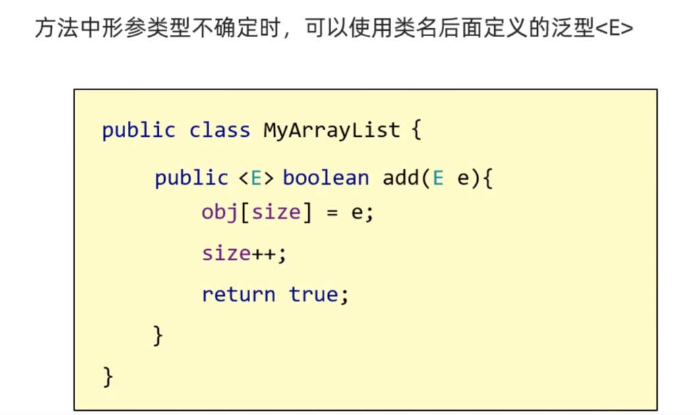
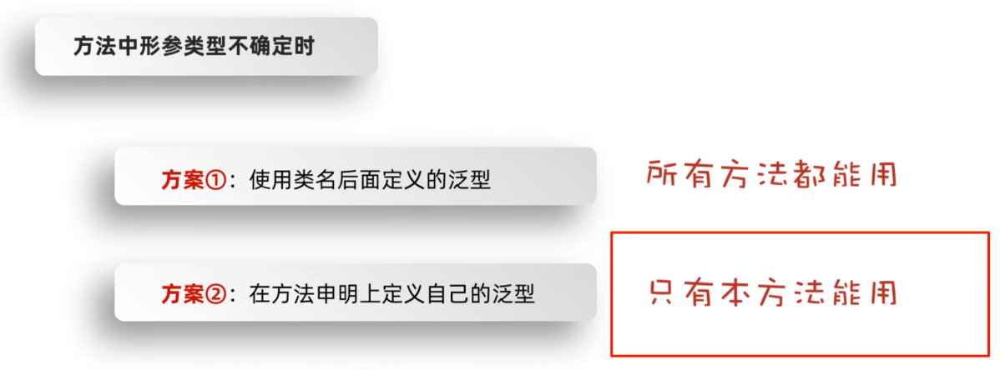
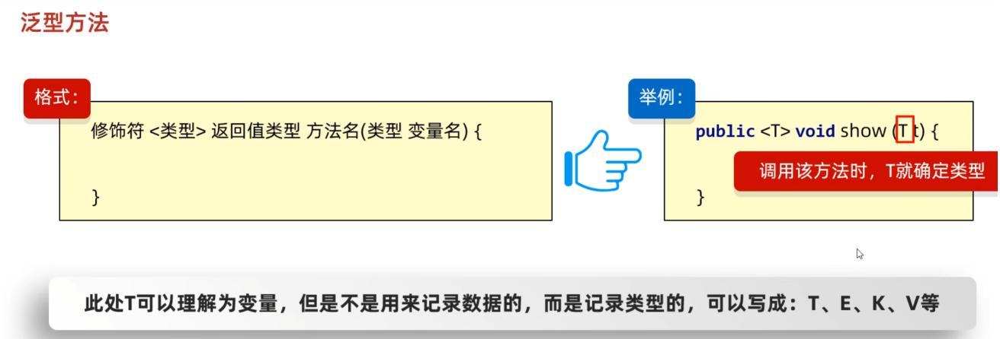
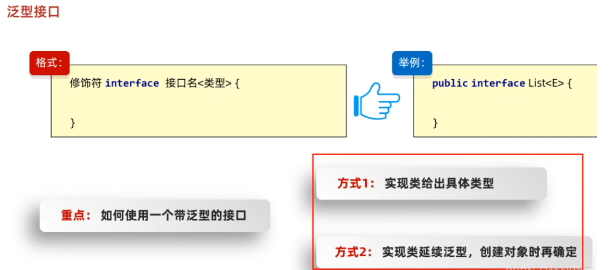

# 说说你对泛型的理解

## 简答

泛型是Java中的一个特性，它允许我们在定义类、接口或方法时使用类型参数，以实现代码的通用性和安全性。泛型的目的是在编译时进行类型检查，并提供编译期间的类型安全。

泛型的理解包括以下几个方面：

**首先，**泛型提供了代码重用和通用性。通过使用泛型，我们可以编写可重用的代码，可以在不同的数据类型上执行相同的操作。这样，我们可以避免重复编写类似的代码，提高了开发效率。

**其次，**泛型强调类型安全。编译器可以在编译时进行类型检查，阻止不符合类型约束的操作。这样可以避免在运行时出现类型错误的可能，增加了程序的稳定性和可靠性。

**另外，**使用泛型可以避免大量的类型转换和强制类型转换操作。在使用泛型集合类时，不需要进行强制类型转换，可以直接获取正确的数据类型，提高了代码的可读性和维护性。

**此外，**泛型还可以在编译时进行类型检查，提前发现潜在的类型错误。这种类型检查是在编译时进行的，避免了一些常见的运行时类型异常，减少了错误的可能性。

**最后，**泛型可以增加代码的可读性和可维护性。通过使用泛型，我们可以明确指定数据类型，并在代码中表达清晰，使得其他开发人员更容易理解代码的意图和功能。

应粉丝要求，还得上点强度。

## 一、泛型概述

### 什么是泛型？为什么要使用泛型？
  
泛型，即“参数化类型”。一提到参数，最熟悉的就是定义方法时有形参列表，普通方法的形参列表中，每个形参的数据类型是确定的，而变量是一个参数。在调用普通方法时需要传入对应形参数据类型的变量（实参），若传入的实参与形参定义的数据类型不匹配，则会报错

那参数化类型是什么？以方法的定义为例，在方法定义时，将方法签名中的形参的数据类型也设置为参数（也可称之为类型参数），在调用该方法时再从外部传入一个具体的数据类型和变量。

泛型的本质是为了将类型参数化， 也就是说在泛型使用过程中，数据类型被设置为一个参数，在使用时再从外部传入一个数据类型；而一旦传入了具体的数据类型后，传入变量（实参）的数据类型如果不匹配，编译器就会直接报错。这种参数化类型可以用在类、接口和方法中，分别被称为泛型类、泛型接口、泛型方法。

### 2. 泛型使用场景  

在 ArrayList 集合中，可以放入所有类型的对象，假设现在需要一个只存储了 String 类型对象的 ArrayList 集合。

```java
/**
 * @Auth:TianMing
 * @Description： 基本应用
 */
public class demo1 {
    public static void main(String[] args) {
        ArrayList<String> list=new ArrayList<>();
        list.add("a");
        list.add("b");
        list.add("c");
        for(String s:list){
            System.out.println(s);
        }
    }
} 
//上面代码没有任何问题，在遍历 ArrayList 集合时，只需将 Object 对象进行向下转型成 String 类型即可得到 String 类型对象。
// 但如果在添加 String 对象时，不小心添加了一个 Integer 对象，会发生什么？看下面代码：
public static void main(String[] args) {
    ArrayList list = new ArrayList();
    list.add("aaa");
    list.add("bbb");
    list.add("ccc");
    list.add(666);
    for (int i = 0; i < list.size(); i++) {
        System.out.println((String)list.get(i));
    }
}
```


上述代码在编译时没有报错，但在运行时却抛出了一个 ClassCastException 异常，其原因是 Integer 对象不能强转为 String 类型。  
那如何可以避免上述异常的出现？即我们希望当我们向集合中添加了不符合类型要求的对象时，编译器能直接给我们报错，而不是在程序运行后才产生异常。这个时候便可以使用泛型了。

使用泛型代码如下：

```java
/**
 * @Auth:TianMing
 * @Description： 基本应用
 */
public static void main(String[] args) {
    ArrayList<String> list = new ArrayList();      
    list.add("aaa");       
    list.add("bbb");       
    list.add("ccc");        
    //list.add(666);// 在编译阶段，编译器会报错
    for (int i = 0; i < list.size(); i++) {
        System.out.println(list.get(i));
    }
}
```

< String > 是一个泛型，其限制了 ArrayList 集合中存放对象的数据类型只能是 String，当添加一个非 String 对象时，编译器会直接报错。这样，我们便解决了上面产生的 ClassCastException 异常的问题（这样体现了泛型的类型安全检测机制）。

###

3.总结

#### 泛型的好处

简单总结出泛型的几点好处

（1）统一数据类型，对于后续业务层中取出数据有很强的统一规范性，方便对数据的管理；

（2）把运行时期的问题提前到了编译期，避免了强转类型转换可能出现的异常，降低了程序出错的概率；  
泛型的出现就是为了统一集合当中数据类型的



## 泛型高级篇

泛型的使用方法非常多，这里来简单说一下泛型类的使用；泛型类，就是把泛型定义在类上。

### 二、泛型类  

泛型类的使用场景：当一个类中，某个变量的数据不确定时，就可以定义带有泛型的类。

我们平常所用的ArrayList类，就是一个泛型类，我们看如下源码


ArrayList 源码上显示，在ArrayList类的后面，便是 `<E>`泛型，定义了这样的泛型，就可以让使用者在创建ArrayList对象时自主定义要存放的数据类型。

这里的 E 可以理解成变量，它不是用来记录数据的，而是记录数据的类型的。可以写成很多字母，T，V，K都可以，通常这些字母都是英文单词的首字母，V表示 value，K表示 key，E表示   element，T表示 type；如果你想，自己练习的时候写成ABCDEFG都可以，但建议养成好习惯，用专业名词的首字母，便于理解。



尖括号 `<>` 中的 泛型标识被称作是类型参数，用于指代任何数据类型。

泛型标识是任意设置的（如果你想可以设置为 Hello都行），Java 常见的泛型标识以及其代表含义如下：

  T ：代表一般的任何类。  
  E ：代表 Element 元素的意思，或者 Exception 异常的意思。  
  K ：代表 Key 的意思。  
  V ：代表 Value 的意思，通常与 K 一起配合使用。  
  S ：代表 Subtype 的意思，文章后面部分会讲解示意。

 自己实现集合

代码如下：

```java

/**
 * @Auth:TianMing
 * @Description：  自定义泛型类
 */
public class MyArrayList<T> {
    // 给出该数组的默认长度为10
    Object[] obj = new Object[10];
 
    // 定义一个指针,默认为0
    int size;
 
    // 写一个泛型类中添加元素的方法
    public boolean add(T t){
        // size默认为0，刚好指向数组的第一个位置，添加元素，将要添加的元素t赋值给到obj数组的第一个位置
        obj[size] = t;
        // size指针加一，指向下一个位置，下次元素添加到size指向的位置
        size++;
        // 添加完成并size加一之后，操作完成，返回成功true
        return true;
    }
 
    // 写一个泛型类中取出元素的方法,index索引可以取出指定位置的元素
    public T get(int index){
        // 取出元素后，强转为我们泛型所指定的类型
        return (T)obj[index];
    }
} 
```



这里打印出来的是 list 的内存地址，说明我们自定义的 泛型类没有问题。

其实 ArrayList 底层源码就是这样写的，这里我只是简单的写了两个方法，有兴趣的可以把删除方法和修改方法也写出来，动手测试一下。

### 三、泛型方法

我们什么时候会用到泛型方法呢？

通常情况下，当一个方法的形参不确定的情况下，我们会使用到泛型方法。

泛型方法其实与泛型类有着紧密的联系，通过上面我写的自定义泛型类不难看出，在泛型类中，所有方法都可以使用类上定义的泛型。

但是，泛型方法却可以脱离泛型类单独存在，泛型方法上定义的泛型只有本方法上可以使用，其他方法不可用。





格式




```java
package tuling.edu;
import java.util.ArrayList;
import java.util.Arrays;
import java.util.List;
/**
 * @Auth:TianMing
 * @Description：  集合工具类
 */
public class ListUtil {
    private ListUtil() {
    }
    /*
参数一：集合
参数二： 最后要添加的元素
 */
    public static <E> void addAll(ArrayList<E> list, E e1, E e2) {
        list.add(e1);
        list.add(e2);
    }
}


package fangxing;
import java.util.ArrayList;
public class demo4 {
    public static void main(String[] args) {
        ArrayListlist=new ArrayList<>();    
        ListUtil.addAll(list,"zhangsan","lisi"); 
        System.out.println(list);//[zhangsan, lisi]
    }
}
```

添加很多元素

```java
public static <E> void addAll(ArrayList<E> list, E ...e1) {
        for (E e : e1) {
          list.add(e);
        }
}
```

### 四、泛型接口

泛型接口与泛型方法相似，当我们的接口中，参数类型不确定的时候，就可以使用泛型。




泛型接口的格式虽然简单，但这不是我们要学习的重点。

我们的重点是：如何使用一个带有泛型的接口？

通常情况下，我们有两种方式

方式一：实现类给出具体的类型。

方式二：实现类延续泛型，在创建对象时再指定泛型类型。

相比于方式一，方式二的扩展性更强。

Java中 List 的实现类 ArrayList 就是采用的第二种方式，延续泛型，我们看源码即可得知

 

别的不用看，只看我画红线的部分，ArrayList 实现了list接口，但后面还是泛型`<E>`，延续了泛型，是方式二。

那么我再给各位演示一下方式一，如下我自己定义的一个泛型接口

```java

/**
 * @Auth:TianMing
 * @Description：  定义一个泛型接口
 */
public interface MyList<E> {
    
    // 定义一个方法做简单测试
    public boolean add(E e);
}

//再定义一个类实现该接口，

// 定义MyArrayList类实现MyList接口,并在实现时就指定泛型类型
public class MyArrayList implements MyList<String> {
 
    // 定义一个长度为十的默认数组
    Object[] object = new Object[10];
 
    // 定义一个size作为指针
    int size;
 
    @Override
    public boolean add(String s) {
        /**
         * size初始化为零，刚好指向数组的第一个位置，添加第一个元素时，我们默认将元素添加到数组的第一个位置
         */
        object[size] = s;
        // size则合理可以作为指针，当添加第一个元素之后，size++，向后移动一位，下一次就会添加到第二个元素的位置，循环往复
        size++;
        return true;
    }
}
```

可以看到，在实现类中重写add方法，方法的参数就已经确定，就是我们在实现它时指定的String类型。

然后我们写一个main方法测试是否成功

 

创建对象，添加元素，打印结果，运行发现成功

但这里是一个内存地址，因为我这里只是简单的定义了一个接口，在Java中ArrayList的源码上千行，里面定义了很多方法，我这里只做简单测试验证一下方式一是如何完成的，很多东西都没有写，大家明白即可。

### 五、类型擦除

#### 什么是类型擦除

编译器编译带类型说明的集合时会去掉类型信息

泛型的本质是将数据类型参数化，它通过擦除的方式来实现，即编译器会在编译期间擦除代码中的所有泛型语法并相应的做出一些类型转换动作。

换而言之，泛型信息只存在于代码编译阶段，在代码编译结束后，与泛型相关的信息会被擦除掉，专业术语叫做类型擦除。也就是说，成功编译过后的 class 文件中不包含任何泛型信息，泛型信息不会进入到运行时阶段。

其实Java中的泛型本质是伪泛型

当把集合定义为string类型的时候,当数据添加在集合当中的时候,仅仅在门口检查了一下数据是否符合String类型,  如果是String类型,就添加成功,当添加成功以后,集合还是会把这些数据当做Object类型处理,当往外获取的时候,集合在把他强转String类型

 当**代码编译到class文件的时候,泛型就消失,叫泛型的擦除**

看一个例子，假如我们给 ArrayList 集合传入两种不同的数据类型，并比较它们的类信息。

```java

/**
 * @Auth:TianMing
 * @Description： 泛型擦除
 */
public class GenericType {
    public static void main(String[] args) {
        ArrayList arrayString = new ArrayList()< String >;       
        ArrayList arrayInteger = new ArrayList()< Integer >;  
        System.out.println(arrayString.getClass() == arrayInteger.getClass());// true  
    } 
} 
```

在这个例子中，我们定义了两个 ArrayList 集合，不过一个是 ArrayList< String>，只能存储字符串。一个是 ArrayList< Integer>，只能存储整型对象。我们通过 arrayString 对象和 arrayInteger 对象的 getClass() 方法获取它们的类信息并比较，发现结果为true。

明明我们在 `<>` 中传入了两种不同的数据类型，那为什么它们的类信息还是相同呢？ 这是因为，在编译期间，所有的泛型信息都会被擦除， `ArrayList< Integer >` 和 `ArrayList< String >`类型，**在编译后都会变成`ArrayList< Objec t>`类型**。

**那么是不是所有的类型参数被擦除后都以 Object 类进行替换呢**？

答案是否定的，大部分情况下，类型参数 T 被擦除后都会以 Object 类进行替换；而有一种情况则不是，那就是**使用到了 extends 和 super 语法的有界类型参数**（上界（`T extends Something`）或下界（`T super Something`）)

#### 类型擦除的原理
  
假如我们定义了一个 ArrayList< Integer > 泛型集合，若向该集合中插入 String 类型的对象，不需要运行程序，编译器就会直接报错。这里可能有小伙伴就产生了疑问：

不是说泛型信息在编译的时候就会被擦除掉吗？那既然泛型信息被擦除了，如何保证我们在集合中只添加指定的数据类型的对象呢？

换而言之，我们虽然定义了 ArrayList< Integer > 泛型集合，但其泛型信息最终被擦除后就变成了 ArrayList< Object > 集合，那为什么不允许向其中插入 String 对象呢？

Java 是如何解决这个问题的？

其实在创建一个泛型类的对象时， Java 编译器是先检查代码中传入 < T > 的数据类型，并记录下来，然后再对代码进行编译，编译的同时进行类型擦除；如果需要对被擦除了泛型信息的对象进行操作，编译器会自动将对象进行类型转换。

可以把泛型的类型安全检查机制和类型擦除想象成演唱会的验票机制：以 ArrayList< Integer> 泛型集合为例。

当我们在创建一个 ArrayList< Integer > 泛型集合的时候，ArrayList 可以看作是演唱会场馆，而< T >就是场馆的验票系统，Integer 是验票系统设置的门票类型；  
当验票系统设置好为< Integer >后，只有持有 Integer 门票的人才可以通过验票系统，进入演唱会场馆（集合）中；若是未持有 Integer 门票的人想进场，则验票系统会发出警告（编译器报错）。  
在通过验票系统时，门票会被收掉（类型擦除），但场馆后台（JVM）会记录下观众信息（泛型信息）。  
进场后的观众变成了没有门票的普通人（原始数据类型）。但是，在需要查看观众的信息时（操作对象），场馆后台可以找到记录的观众信息（编译器会自动将对象进行类型转换）。

举例如下：

```java

/**
 * @Auth:TianMing
 * @Description：  擦除原理
 */
public class GenericType {
    public static void main(String[] args) {
        
        ArrayList arrayInteger = new ArrayList();
        // 设置验票系统   
        arrayInteger.add(111);
        // 观众进场，验票系统验票，门票会被收走（类型擦除） 
        Integer n = arrayInteger.get(0);
        // 获取观众信息，编译器会进行强制类型转换   
        System.out.println(n);  
    }
} 
```

擦除 ArrayList< Integer > 的泛型信息后，get() 方法的返回值将返回 Object 类型，但编译器会自动插入 Integer 的强制类型转换。也就是说，编译器把 get() 方法调用翻译为两条字节码指令：

对原始方法 get() 的调用，返回的是 Object 类型；  
将返回的 Object 类型强制转换为 Integer 类型；

代码如下：

```java
Integer n = arrayInteger.get(0);// 这条代码底层如下：

//（1）get() 方法的返回值返回的是 Object 类型
Object object = arrayInteger.get(0);
//（2）编译器自动插入 Integer 的强制类型转换
Integer n = (Integer) object;
```

#### 类型擦除小结

1.泛型信息（包括泛型类、接口、方法）只在代码编译阶段存在，在代码成功编译后，其内的所有泛型信息都会被擦除，并且类型参数 T 会被统一替换为其原始类型（默认是 Object 类，若有 extends 或者 super 则另外分析）；

2.在泛型信息被擦除后，若还需要使用到对象相关的泛型信息，编译器底层会自动进行类型转换（从原始类型转换为未擦除前的数据类型）。

### 六、泛型通配符

1. 泛型的继承  
泛型不具备继承性,但是数据具备继承性  
  此时,泛型里面写的什么类型,那么就传递什么类型的数据

泛型不具备继承性举例

```java
package tuling.edu;
 
import java.util.ArrayList;
 
/**
 * @Auth:TianMing
 * @Description： 泛型通配符
 */
public class demo5 {
    public static void main(String[] args) {
        /*
        泛型不具备继承性,但是数据具备继承性
         */
        ArrayList<Ye> list1=new ArrayList<>();
        ArrayList<Fu> list2=new ArrayList<>();
        ArrayList<Zi> list3=new ArrayList<>();
        //调用method方法
        method(list1);
        //method(list2);//编译错误
//method(list3);//编译错误
    }
    /*
    此时,泛型里面写的什么类型,那么就传递什么类型的数据
     */
    public static  void method(ArrayList<Ye> list){
    }
}
class Ye{
}
class Fu extends Ye{
}
class Zi extends Fu{
} 
```

数据具备继承性

   //数据具备继承性

        list1.add(new Ye());//添加爷爷的对象等

        list1.add(new Fu());

        list1.add(new Zi());

定义一个方法，形参是一个集合，但是集合中的数据类型不确定。

应用场景：

*      1.如果我们在定义类、方法、接口的时候，如果类型不确定，就可以定义泛型类、泛型方法、泛型接口。

*      2.如果类型不确定，但是能知道以后只能传递某个继承体系中的，就可以泛型的通配符

* 泛型的通配符：

*      关键点：可以限定类型的范围。

测试类

```java
package lx;
import java.util.ArrayList;
/**
 * @Auth:TianMing
 * @Description： 泛型测试
 */
public class demo1 {
    /*
          需求：
              定义一个继承结构：
                                  动物
                       |                           |
                       猫                          狗
                    |      |                    |      |
                 波斯猫   狸花猫                泰迪   哈士奇
               属性：名字，年龄
               行为：吃东西
                     波斯猫方法体打印：一只叫做XXX的，X岁的波斯猫，正在吃小饼干
                     狸花猫方法体打印：一只叫做XXX的，X岁的狸花猫，正在吃鱼
                     泰迪方法体打印：一只叫做XXX的，X岁的泰迪，正在吃骨头，边吃边蹭
                     哈士奇方法体打印：一只叫做XXX的，X岁的哈士奇，正在吃骨头，边吃边拆家
          测试类中定义一个方法用于饲养动物
              public static void keepPet(ArrayList list){
                  //遍历集合，调用动物的eat方法
              }
          要求1：该方法能养所有品种的猫，但是不能养狗
          要求2：该方法能养所有品种的狗，但是不能养猫
          要求3：该方法能养所有的动物，但是不能传递其他类型
       */
    public static void main(String[] args) {
        HuskyDog h = new HuskyDog("哈士奇", 1);
        LihuaCat l = new LihuaCat("狸花猫", 2);
        PersianCat p = new PersianCat("波斯猫", 3);
        TeddyDog t = new TeddyDog("泰迪", 4);
        ArrayList list1 = new ArrayList<>();         ArrayList list2 = new ArrayList<>();        
        // 向列表中添加一些猫的实例        
        list1.add(l);    
        list2.add(p);        
        //调用方法       
        keepPet1(list1);     
        keepPet1(list2);      
        System.out.println("-------------------------------------------");   
        ArrayList list3 = new ArrayList<>();     
        ArrayList list4 = new ArrayList<>();    
        // 向列表中添加一些狗的实例       
        list3.add(h);     
        list4.add(t);  
        //调用方法      
        keepPet2(list3);   
        keepPet2(list4);  
        System.out.println("-------------------------------------------");  
        list1.add(l);     
        list2.add(p);    
        list3.add(h);    
        list4.add(t);  
        keepPet3(list1);  
        keepPet3(list2);     
        keepPet3(list3);        
        keepPet3(list4);     
    }
    /*
此时我们就可以使用泛型的通配符：
  ?也表示不确定的类型
  他可以进行类型的限定
  ? extends E: 表示可以传递E或者E所有的子类类型
 ? super E:表示可以传递E或者E所有的父类类型
 */
    //  要求1：该方法能养所有品种的猫，但是不能养狗
    public static void keepPet1(ArrayList<? extends Cat> list) {
        //遍历集合，调用动物的eat方法
        for (Cat cat : list) {
            cat.eat();
        }
    }
    //  要求2：该方法能养所有品种的狗，但是不能养猫
    public static void keepPet2(ArrayList<? extends Dog> list) {
        //遍历集合，调用动物的eat方法
        for (Dog dog : list) {
            dog.eat();
        }
    }
    //  要求3：该方法能养所有的动物，但是不能传递其他类型
    public static void keepPet3(ArrayList<? extends Animal> list) {
        //遍历集合，调用动物的eat方法
        for (Animal animal : list) {
            animal.eat();
        }
    }
}
```

Animal类

```java
package lx;
public abstract class Animal {
    private String name;
    private int age;
    public Animal() {
    }

    public Animal(String name, int age) {
        this.name = name;
        this.age = age;
    }

    /**
 * 获取
 * @return name
 */
    public String getName() {
        return name;
    }

    /**
 * 设置
 * @param name
 */
    public void setName(String name) {
        this.name = name;
    }

    /**
 * 获取
 * @return age
 */
    public int getAge() {
        return age;
    }

    /**
 * 设置
 * @param age
 */
    public void setAge(int age) {
        this.age = age;
    }

    public String toString() {
        return "Animal{name = " + name + ", age = " + age + "}";
    }
    public abstract  void eat();
}
```

cat类型

```java
package lx;
public abstract class Cat extends Animal{
    public Cat() {
    }

    public Cat(String name, int age) {
        super(name, age);
    }
}
```

Dog类

```java
package lx;
public abstract class Dog extends Animal{
    public Dog() {
    }
    public Dog(String name, int age) {
        super(name, age);
    }
}
```

哈士奇类

```java
package lx;
public class HuskyDog extends Dog{
    @Override
    public void eat() {
        System.out.println("一只叫做"+getName()+"的，"+getAge()+"岁的哈士奇，正在吃骨头，边吃边拆家");
    }

    public HuskyDog() {
    }

    public HuskyDog(String name, int age) {
        super(name, age);
    }
}
```

狸花猫类

```java
package lx;
public class LihuaCat extends Cat {
    @Override
    public void eat() {
        System.out.println("一只叫做" + getName() + "的，" + getAge() + "岁的狸花猫，正在吃鱼");
    }
    public LihuaCat() {
    }

    public LihuaCat(String name, int age) {
        super(name, age);
    }
}
```

波斯猫类

```java
package lx;
public class PersianCat extends Cat{
    @Override
    public void eat() {
        System.out.println("一只叫做"+getName()+"的，"+getAge()+"岁的波斯猫，正在吃小饼干");
    }
    public PersianCat() {
    }

    public PersianCat(String name, int age) {
        super(name, age);
    }
}
```

泰迪猫类

```java
package lx;
public class TeddyDog extends Dog{
    @Override
    public void eat() {
        System.out.println("一只叫做"+getName()+"的，"+getAge()+"岁泰迪，正在吃骨头，边吃边蹭");
    }
    public TeddyDog() {
    }

    public TeddyDog(String name, int age) {
        super(name, age);
    }
}
```
