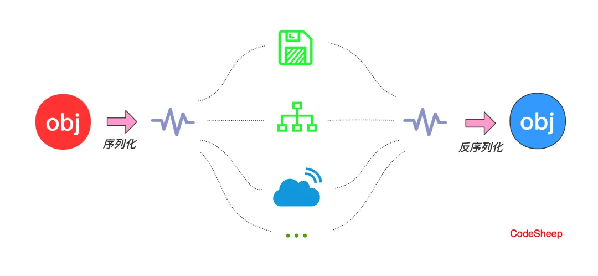

# 谈谈你对Java序列化的理解

### 1. 什么是序列化和反序列化？

+ **序列化**：将 Java 对象转换为字节流（如保存到文件或通过网络传输）。
+ **反序列化**：将字节流还原为 Java 对象。

序列化的核心是让对象能够在非 Java 环境（如文件、数据库、网络）中存储或传输。

**Java的序列化是指将Java对象转换为字节流的过程，可以将这些字节流保存到文件中或通过网络传输。反序列化则是指将字节流恢复成对象的过程。**



序列化的主要目的是**实现对象的持久化存储和传输**，让对象可以在不同的计算机或不同的时间点被重建和使用。通过序列化，可以将对象的状态以字节的形式保存下来，并且在需要的时候进行恢复，从而实现了对象的跨平台传输和持久化存储。

在Java中，要使一个类可序列化，需要满足以下条件：

1. 实现java.io.Serializable接口，该接口是一个标记接口，没有任何方法。
2. 所有的非静态、非瞬态的字段都可以被序列化。

使用Java的序列化机制，可以通过ObjectOutputStream将对象转换为字节流并写入文件或网络流中。反之，通过ObjectInputStream可以从字节流中读取数据并还原为对象。

需要注意的是，在进行序列化和反序列化时，对象的类和字段的定义必须保持一致，否则可能会导致序列化版本不匹配或字段丢失的问题。

应粉丝要求，补充更多追问

面试官通常会从以下几个方面 继续追问：

1. 序列化和反序列化的基本概念。
2. 序列化和反序列化的应用场景。
3. 序列化和反序列化需要注意的细节（如 `transient`、`serialVersionUID` 等）。
4. 序列化和反序列化的安全性问题。
5. 序列化和反序列化的性能优化。

### 2. **如何实现序列化和反序列化？**

Java 提供了 `Serializable` 接口，用于标记需要序列化的类。

#### 示例代码

```java
/**
 * @Auth:TianMing
 * @Description： 基本应用
 */
import java.io.*;

public class SerializationExample implements Serializable {
    private static final long serialVersionUID = 1L; // 序列化版本号
    private String name;
    private transient int age; // transient 关键字表示该字段不参与序列化

    // 构造方法、getter 和 setter 略

    public static void main(String[] args) {
        SerializationExample obj = new SerializationExample();
        obj.setName("张三");
        obj.setAge(25);

        // 序列化
        try (ObjectOutputStream oos = new ObjectOutputStream(new FileOutputStream("object.ser"))) {
            oos.writeObject(obj);
            System.out.println("对象已序列化");
        } catch (IOException e) {
            e.printStackTrace();
        }

        // 反序列化
        try (ObjectInputStream ois = new ObjectInputStream(new FileInputStream("object.ser"))) {
            SerializationExample newObj = (SerializationExample) ois.readObject();
            System.out.println("对象已反序列化: " + newObj.getName());
            // 注意：transient 字段会被还原为默认值（这里是 0）
            System.out.println("年龄: " + newObj.getAge());
        } catch (IOException | ClassNotFoundException e) {
            e.printStackTrace();
        }
    }
}
```

序列化底层原理：ObjectStreamClass类中可以看到writeObjectMethod属性，值来自对象**writeObject**方法

反序列化底层原理：ObjectStreamClass类中可以看到readObjectMethod属性，值来自对象**readObject**方法

自行编写readObject()函数，用于对象的反序列化构造，从而提供约束性。可以自定义反序列化对象的校验信息

### 3. **序列化和反序列化的注意事项**

#### 3.1 `transient` 关键字

+ `transient` 修饰的字段不会被序列化。
+ 反序列化时，`transient` 字段会被还原为默认值（如 `int` 为 `0`，`String` 为 `null`）。

#### 3.2 `serialVersionUID`

+ `serialVersionUID` 是序列化版本号，用于标识类的版本。
+ 如果类的结构发生变化（如新增字段或修改字段类型），`serialVersionUID` 不匹配会导致反序列化失败。
+ 最好显式声明 `serialVersionUID`，否则编译器会自动生成一个，但容易导致版本不一致。

#### 3.3 静态字段

+ 静态字段不会被序列化，因为它们属于类而不是对象。

### 4. **序列化和反序列化的安全性问题**

序列化和反序列化存在安全风险，尤其是反序列化时：

+ 反序列化恶意数据可能导致代码执行或数据泄露。
+ 面试官可能会问你如何避免这些问题。

#### 解决方法

1. **自定义 **`**readObject**`** 和 **`**writeObject**`** 方法**：
    + 在类中覆盖 `readObject` 和 `writeObject` 方法，验证数据的合法性。
2.

```java
/**
 * @Auth:TianMing
 * @Description： 安全性
 */
private void readObject(ObjectInputStream ois) throws IOException, ClassNotFoundException {
    ois.defaultReadObject();
    // 验证数据
    if (name == null) {
        throw new InvalidObjectException("name 不能为空");
    }
}
```

3. **使用安全的序列化框架**：
    + 避免使用 Java 默认的序列化机制，改用更安全的框架（如 Protobuf、Kryo）。
4. **避免敏感数据参与序列化**：
    + 使用 `transient` 修饰敏感字段，确保它们不被序列化。

### 5. **序列化和反序列化的性能优化**

Java 的默认序列化机制效率较低，可以通过以下方式优化：

1. **使用 **`**Externalizable**`** 接口**：
    + `Externalizable` 是 `Serializable` 的子接口，允许自定义序列化逻辑。
    + 通过实现 `writeExternal` 和 `readExternal` 方法，可以减少序列化数据的大小。
2. **使用高效的序列化库**：
    + **Protobuf**：Google 开发的高效序列化框架，支持跨语言。
    + **Kryo**：轻量级、高性能的序列化框架。
    + **FST**：快速、紧凑的序列化库。

### 6. **面试常见问题**

#### 问题 1：为什么需要序列化？

+ 答案：序列化可以将对象转换为字节流，方便存储或传输。例如，将对象保存到文件、通过网络发送对象、在分布式系统中传递对象。

#### 问题 2：`transient` 和 `static` 字段为什么不参与序列化？

+ 答案：`transient` 表示字段不参与序列化，`static` 字段属于类而不是对象，因此也不参与序列化。

#### 问题 3：`serialVersionUID` 的作用是什么？

+ 答案：`serialVersionUID` 用于标识类的版本。如果类的结构发生变化，`serialVersionUID` 不匹配会导致反序列化失败。

#### 问题 4：如何提高序列化的性能？

+ 答案：可以使用 `Externalizable` 接口自定义序列化逻辑，或者使用高效的序列化库（如 Protobuf、Kryo）。

#### 问题 5：序列化和反序列化有哪些安全问题？

+ 答案：反序列化恶意数据可能导致代码执行或数据泄露。
+ 如何防止反序列化破坏单例模式的对象呢？ 可以通过重写 `**readObject**` 方法 或者 **readResolve** 方法、使用安全的序列化框架、避免敏感数据参与序列化来解决。

#### 问题 6：追问又来了，上面的readObject和 readResolve方法有啥区别呢？

+ `**readObject**`**方法**：适合用来阻止反序列化或验证对象状态。
+ `**readResolve()**`**方法**：适合用来确保反序列化后返回的是单例的唯一实例。

两种方法的区别

+ `**readObject**`**方法**：
  + 是 `ObjectInputStream` 的方法，用于自定义反序列化逻辑。
  + 适合用来验证对象的状态或直接阻止反序列化。
+ `**readResolve()**`**方法**：
  + 是一个特殊的钩子方法，用于在反序列化完成后返回一个对象。
  + 适合用来确保返回的是单例的唯一实例。

### 7. **总结**

+ **序列化**：将对象转换为字节流。
+ **反序列化**：将字节流还原为对象。
+ **注意事项**：`transient`、`serialVersionUID`、静态字段。
+ **安全性**：避免反序列化恶意数据，使用安全的序列化框架。
+ **性能优化**：使用 `Externalizable` 或高效的序列化库。

掌握这些知识点后，你可以在面试中自信地回答序列化和反序列化相关的问题！如果还有其他疑问，可以继续提问。

### 附问题6代码

#### 示例 1：重写 `readObject` 方法

```java
import java.io.*;
/**
 * @Auth:TianMing
 * @Description： readObject
 */
public class Singleton implements Serializable {
    private static final long serialVersionUID = 1L;
    private static final Singleton INSTANCE = new Singleton();

    // 私有构造方法，防止外部实例化
    private Singleton() {
        // 防止反射破坏单例
        if (INSTANCE != null) {
            throw new IllegalStateException("Already instantiated");
        }
    }

    // 提供获取实例的方法
    public static Singleton getInstance() {
        return INSTANCE;
    }

    // 重写 readObject 方法，阻止反序列化
    private void readObject(ObjectInputStream ois) throws IOException, ClassNotFoundException {
        throw new IOException("Singleton cannot be deserialized");
    }

    public static void main(String[] args) {
        Singleton instance1 = Singleton.getInstance();

        // 尝试序列化和反序列化
        try (ObjectOutputStream oos = new ObjectOutputStream(new FileOutputStream("singleton.ser"))) {
            oos.writeObject(instance1);
        } catch (IOException e) {
            e.printStackTrace();
        }

        try (ObjectInputStream ois = new ObjectInputStream(new FileInputStream("singleton.ser"))) {
            Singleton instance2 = (Singleton) ois.readObject();
            System.out.println(instance1 == instance2); // false，因为 readObject 抛出了异常
        } catch (IOException | ClassNotFoundException e) {
            e.printStackTrace();
        }
    }
}
```

#### 示例 2：使用 `readResolve()` 方法

```java
import java.io.*;
/**
 * @Auth:TianMing
 * @Description： readResolve
 */
public class Singleton implements Serializable {
    private static final long serialVersionUID = 1L;
    private static final Singleton INSTANCE = new Singleton();

    // 私有构造方法，防止外部实例化
    private Singleton() {
        // 防止反射破坏单例
        if (INSTANCE != null) {
            throw new IllegalStateException("Already instantiated");
        }
    }

    // 提供获取实例的方法
    public static Singleton getInstance() {
        return INSTANCE;
    }

    // 使用 readResolve 方法，确保返回的是单例的唯一实例
    private Object readResolve() {
        return INSTANCE;
    }

    public static void main(String[] args) {
        Singleton instance1 = Singleton.getInstance();

        // 尝试序列化和反序列化
        try (ObjectOutputStream oos = new ObjectOutputStream(new FileOutputStream("singleton.ser"))) {
            oos.writeObject(instance1);
        } catch (IOException e) {
            e.printStackTrace();
        }

        try (ObjectInputStream ois = new ObjectInputStream(new FileInputStream("singleton.ser"))) {
            Singleton instance2 = (Singleton) ois.readObject();
            System.out.println(instance1 == instance2); // true，因为 readResolve 返回了 INSTANCE
        } catch (IOException | ClassNotFoundException e) {
            e.printStackTrace();
        }
    }
}
```
