# Kafka消费者分区策略

### 消费者分区策略

可以通过消费者参数

**partition.assignment.strategy**

设置分区分配给消费者的策略。默认为Range。允许自定义策略。

#### **Range（范围）**

把主题的连续分区分配给消费者。（如果分区数量无法被消费者整除、第一个消费者会分到更多分区）

**对每个Topic进行独立的分区分配**，首先对分区按照分区ID进行排序，然后订阅这个Topic的消费组的消费者再进行排序，尽量均衡地将分区分配给消费者。这里的“尽量均衡”是因为分区数可能无法被消费者数量整除，导致某些消费者可能会多分配到一些分区

它的特点是以topic为主进行划分的，通过partition数/consumer数来决定每个消费者消费几个分区。如果有余则交给消费者1

假设消费者数量为N，主题分区数量为M，则有当前主题分配数量 = M%N==0? M/N +1 : M/N ;

简单来说就是将主题中的分区除以group中订阅此主题的消费者，除数有余则一号多分配。

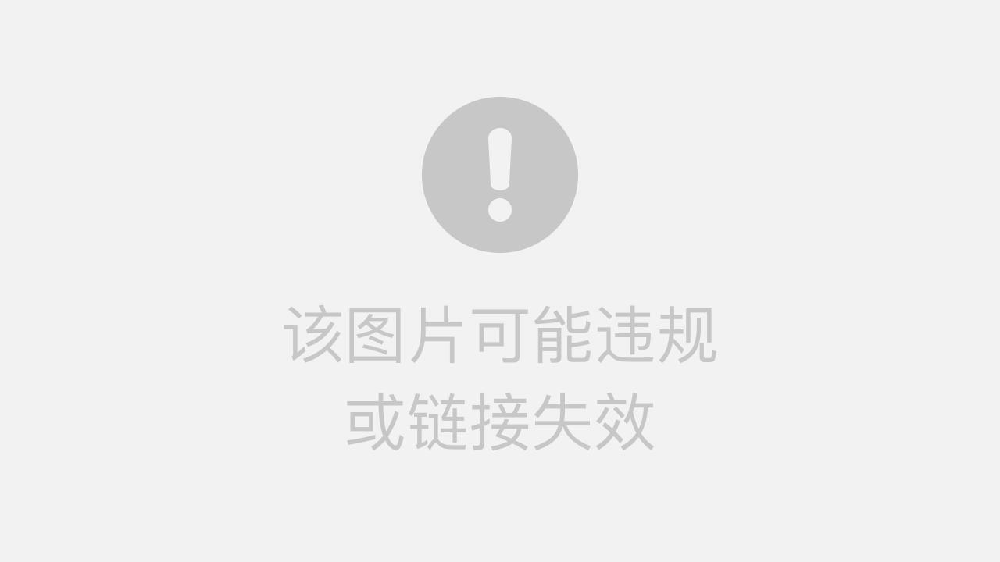

Range策略的缺点在于如果Topic足够多、且分区数量不能被平均分配时，会出现消费过载的情景，举一个例子

可以看到此种情况已经相差3个分区，如果主题进一步扩大差距会愈发明显。

#### **RoundRobin（轮询）**

把主题的分区循环分配给消费者。

一种轮询式的分配策略，即每个人都会得到一个分区，顺序取决于他们注册时的顺序。这有助于确保所有消费者都能访问到所有数据。

简单来说就是把所有partition和所有consumer列出来，然后按照hashcode排序，最后进行轮询算法分配。

如果主题中分区不一样的时候如下：

不难看出轮询策略是将partition当做最小分配单位，将所有topic的partition都看作一个整体。然后为消费者轮询分配partition。当然得到此结果的前提是Consumer Group种的消费者订阅信息是一致的，如果订阅信息不一致，得到的结果也不均匀，下面举个例子：

如图，Consumer0订阅Topic-A、B，Consumer1订阅Topic-B、C

顺序注意图中的Seq，先分配TopicA

第一轮 : Consumer-0: Topic-A-Partition0

由于Consumer-1没有订阅Topic-A，所以只能找到Topic-B给Consumer-1分配

于是 Consumer-1: Topic-B-Partition0

---

第二轮: Consumer-0: Topic-A-Partition0,**Topic-A-Partition1**

Consumer-1: Topic-B-Partition0,**Topic-B-Partition1**

---

第三轮: Consumer-0: Topic-A-Partition0,Topic-A-Partition1，**Topic-A-Partition2**

Consumer-1: Topic-B-Partition0,Topic-B-Partition1，**Topic-B-Partition2**

---

第四、五、六轮：

Consumer-0: Topic-A-Partition0,Topic-A-Partition1，Topic-A-Partition2

Consumer-1: Topic-B-Partition0,Topic-B-Partition1，Topic-B-Partition2,**Topic-C-Partition-0,Topic-C-Partition-1,Topic-C-Partition-2**

可以看到Consumer-1多消费了3个分区。所以在Consumer Group有订阅消息不一致的情况下，我们尽量不要选用RoundRobin。

注意：上面介绍的两种分区分配方式,多多少少都会有一些分配上的偏差, 而且每次**重新分配**的时候都是把所有的都**重新来计算并分配**一遍, 那么每次分配的结果都会偏差很多, 如果我们在计算的时候能够考虑上一次的分配情况,来尽量的减少分配的变动,这样我们将尽可能地撤销更少的分区，因为撤销过程是昂贵的

#### StickyAssignor(粘性)

粘性分区：每一次分配变更相对上一次分配做最少的变动.

当某个消费者的某个分区出现故障或不可用时，它会尝试保留它已经分配但尚未处理的分区。如果其他消费者也出现了问题，则会尽力维持原先的分区分配。这意味着一旦某个分区被分配给了某个消费者，除非该消费者退出或者分区不可用，否则不会重新分配给其他消费者。

目标：

1、**分区的分配尽量的均衡，分配给消费者者的主题分区数最多相差一个；**

2、**每一次重分配的结果尽量与上一次分配结果保持一致**

当这两个目标发生冲突时，优先保证第一个目标

首先, **StickyAssignor粘性分区**在进行分配的时候,是以**RoundRobin的分配逻辑来计算的,但是它又弥补了RoundRobinAssignor的一些可能造成不均衡的弊端。

比如在讲RoundRobin弊端的那种case, 但是在StickyAssignor中就是下图的分配情况

把RoundRobinAssignor的弊端给优化了

此时的结果明显非常不均衡，如果使用Sticky策略的话结果应该是如此：

在这里我给出实际测试结果参考

比如有3个消费者（C0、C1、C2）、4个topic(T0、T1、T2、T3)，每个topic有2个分区（P1、P2）

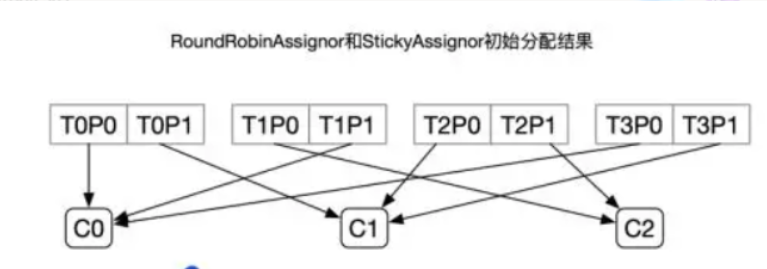

**C0:****T0P0、T1P1、T3P0**

**C1: T0P1、T2P0、T3P1**

**C2: T1P0、T2P1**

如果C1下线 、如果按照RoundRobin

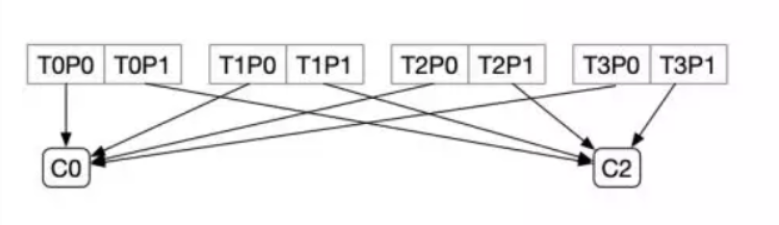

**C0:****T0P0、T1P0、T2P0、T3P0**

**C2: T0P1、T1P1、T2P1、T3P1**

对比之前

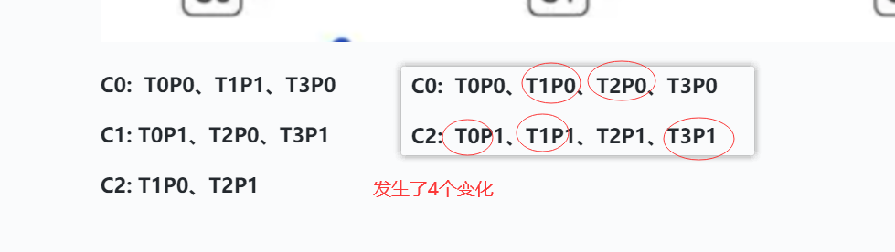

如果C1下线 、如果按照StickyAssignor

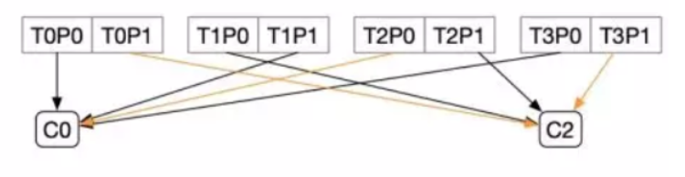

**C0:****T0P0、T1P1、T2P0、T3P0**

**C2: T0P1、T1P0、T2P1、T3P1**

对比之前

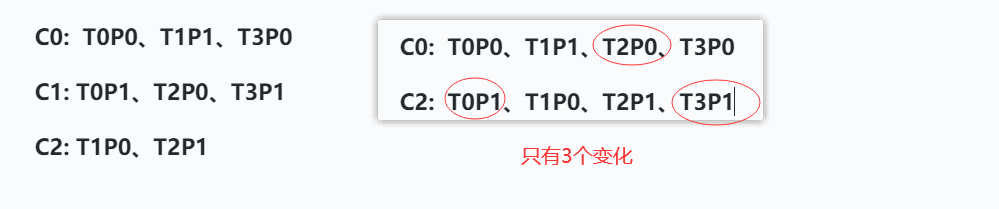

#### 自定义策略

extends 类AbstractPartitionAssignor，然后在消费者端增加参数：

properties.put(ConsumerConfig.PARTITION_ASSIGNMENT_STRATEGY_CONFIG,类.class.getName());

即可。

### 消费者分区策略源码分析

接着上个章节的代码。

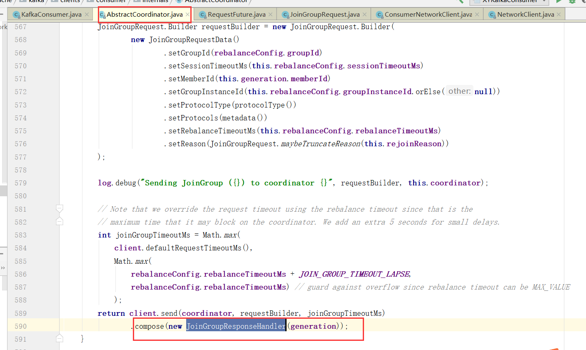

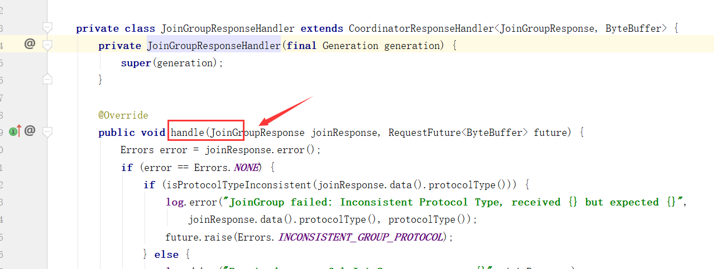

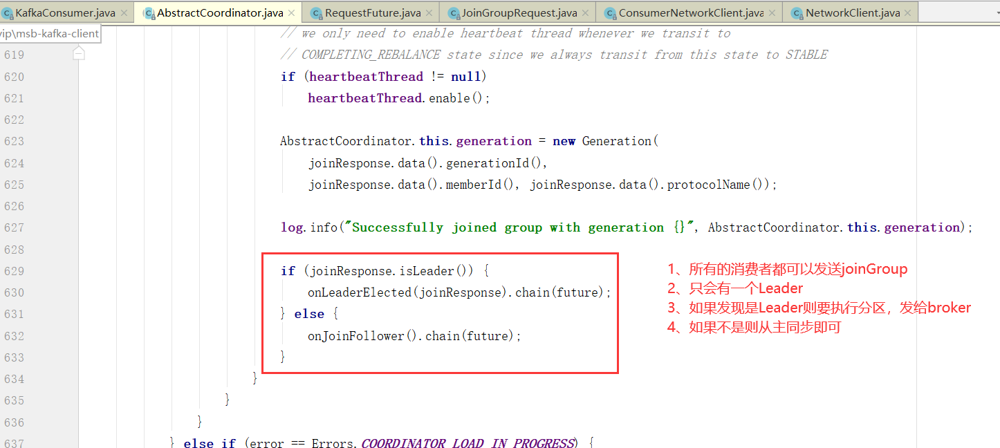

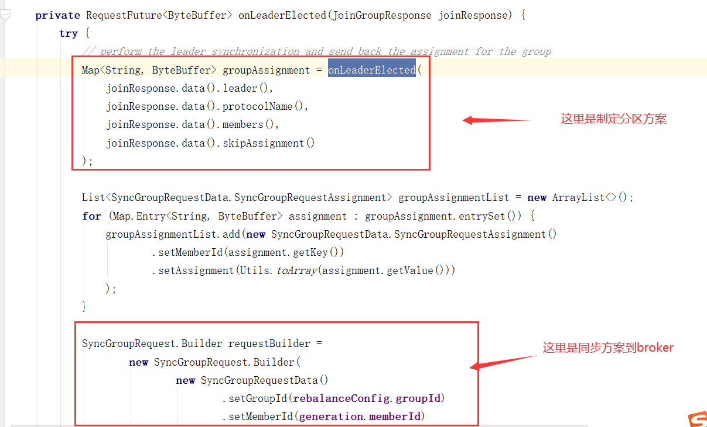

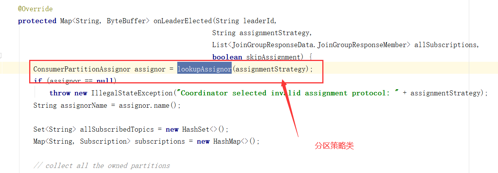

## Consumer拉取数据

这里就是拉取数据，核心Fetch类

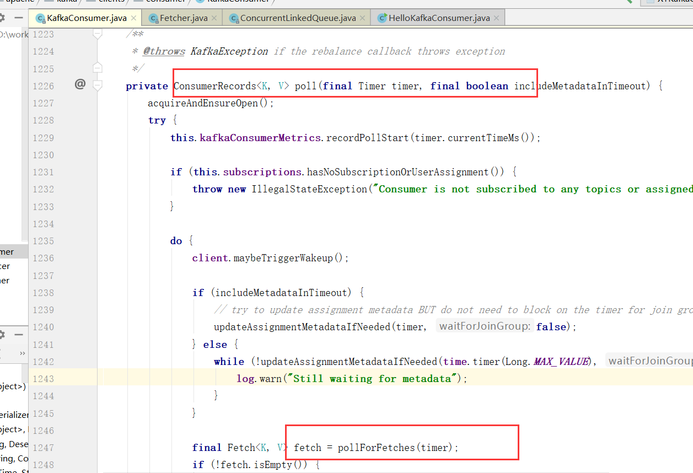

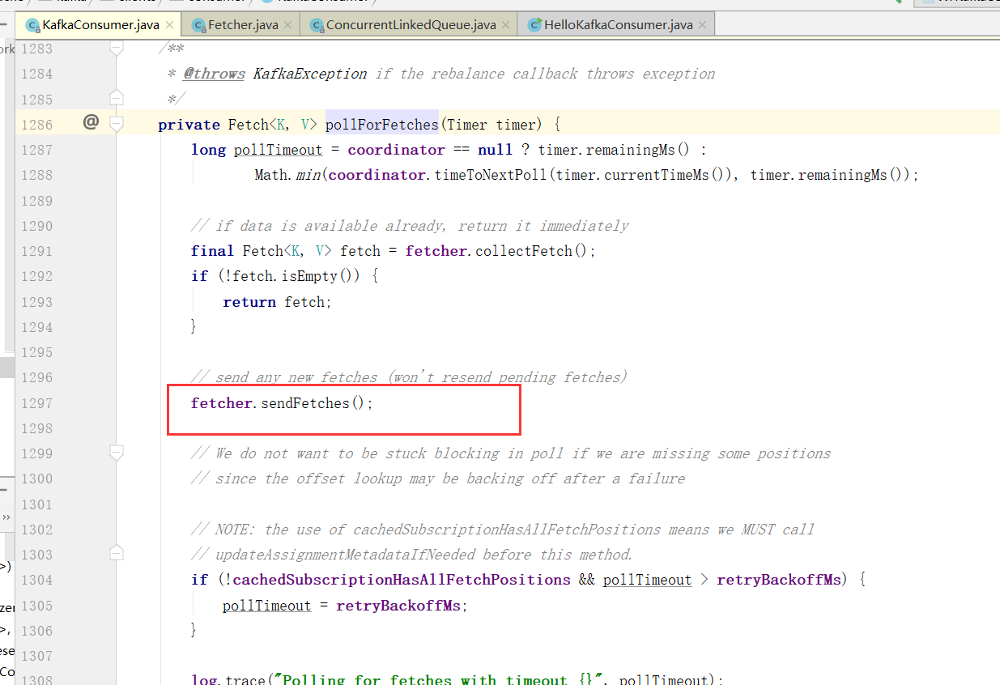

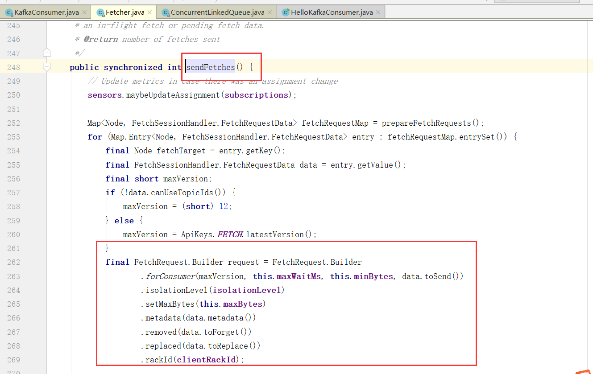

## 自动提交偏移量

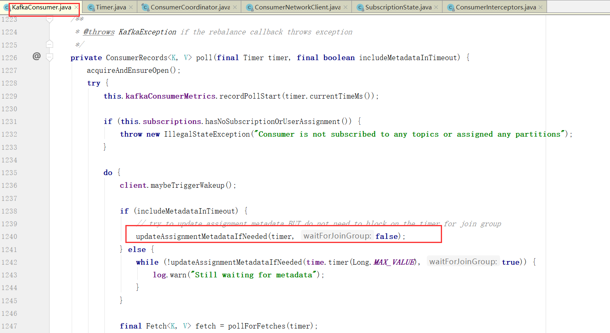

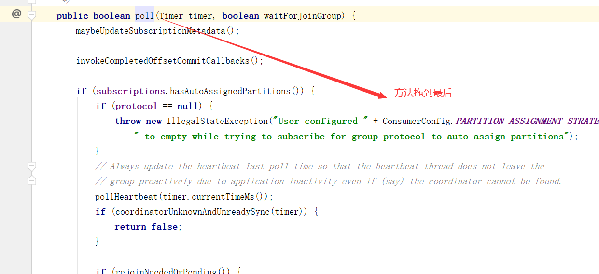

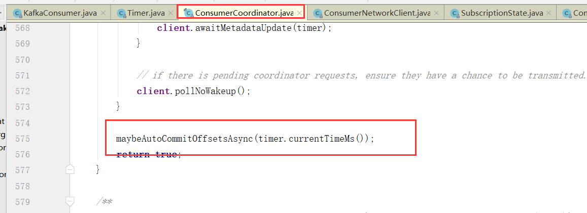

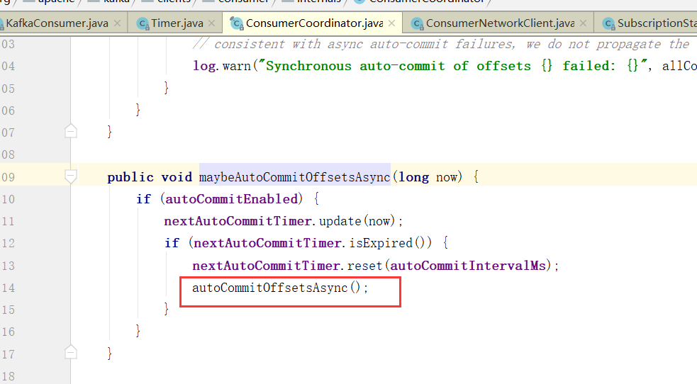

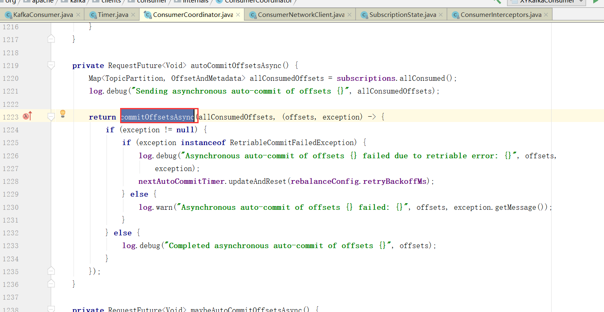

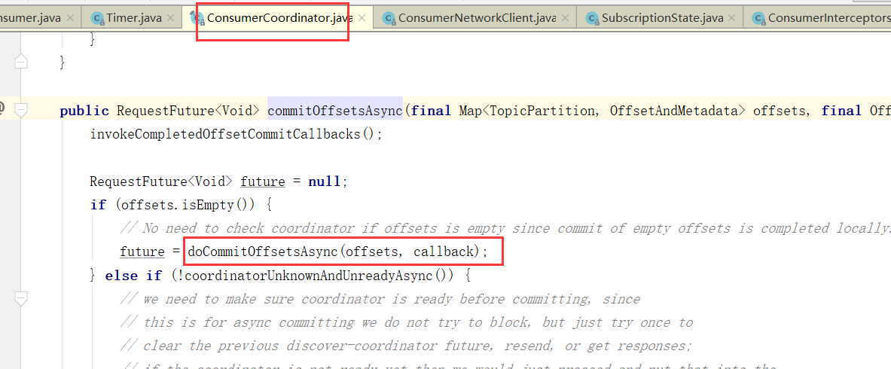

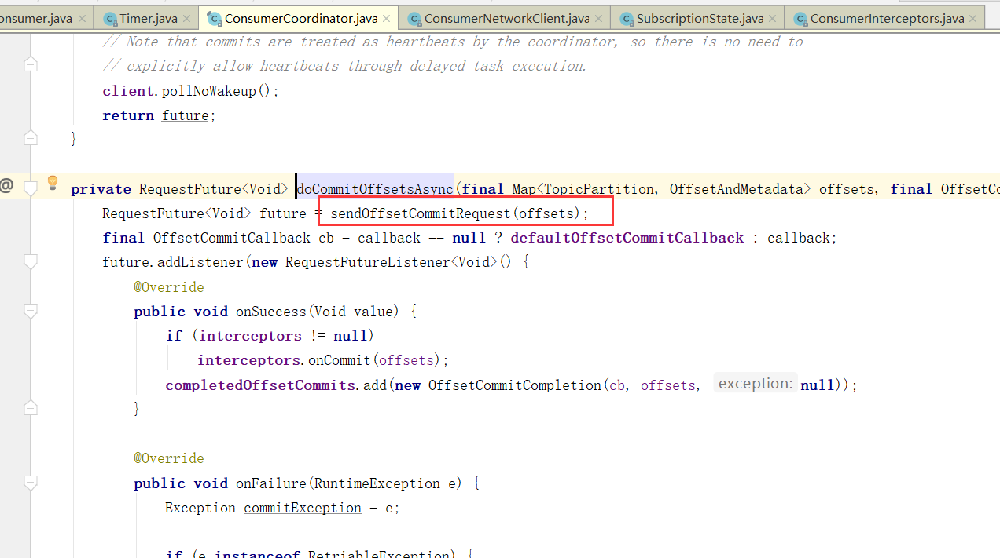

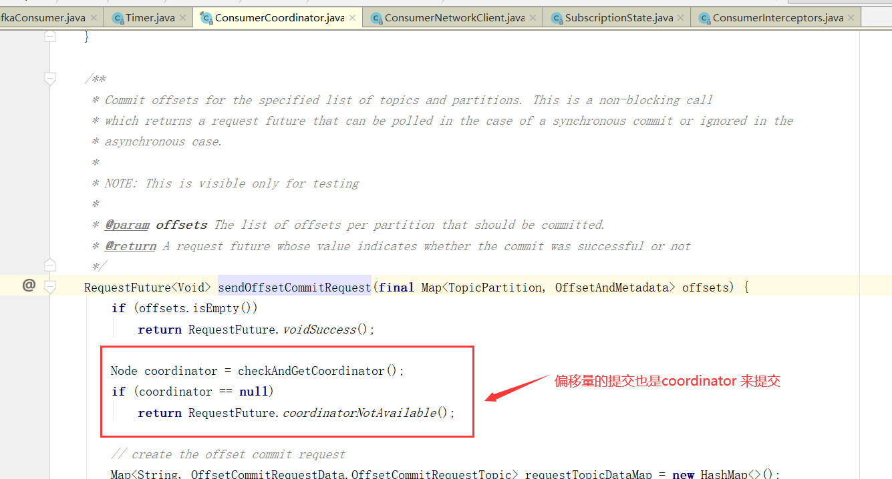

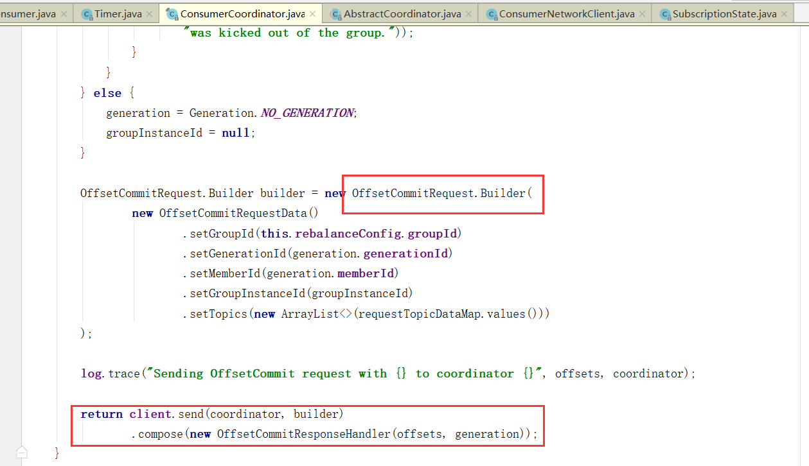

当然，自动提交auto.commit.interval.ms

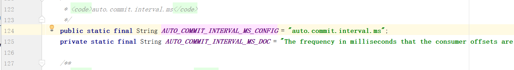

默认5s

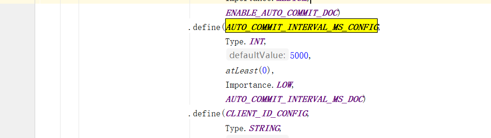

从源码上也可以看出

maybeAutoCommitOffsetsAsync 最后这个就是poll的时候会自动提交，而且没到auto.commit.interval.ms间隔时间也不会提交，如果没到下次自动提交的时间也不会提交。

这个autoCommitIntervalMs就是auto.commit.interval.ms设置的
