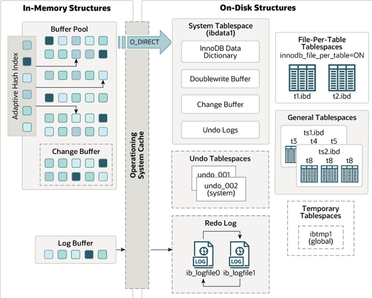
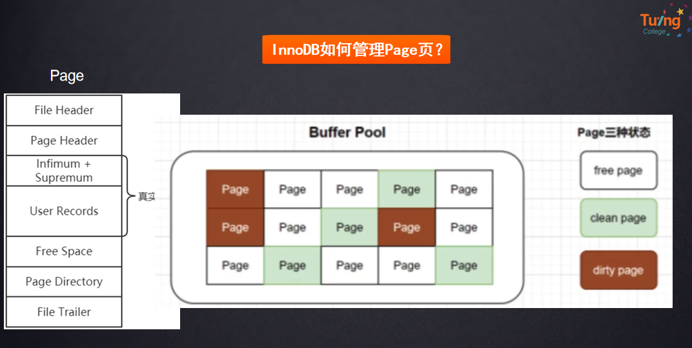
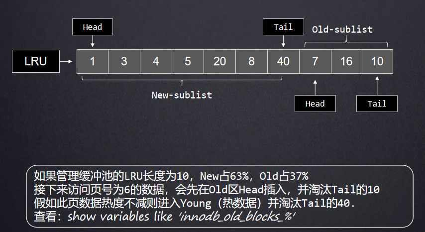
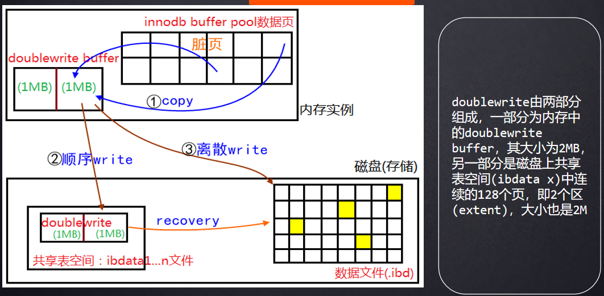

# InnoDB存储引擎三大特性

### Buffer Pool

+ **原理**：Buffer Pool是InnoDB存储引擎用于缓存数据页和索引页的内存区域。它提高了数据库的读写性能，因为数据页和索引页在内存中读写比在磁盘上快得多。当需要访问数据时，InnoDB会先在Buffer Pool中查找，如果找不到，才会从磁盘读取。
+ **工作方式**：Buffer Pool采用LRU（最近最少使用）算法来管理内存中的页。当Buffer Pool满时，最近最少使用的页会被淘汰，以便为新的页腾出空间。
+ **配置参数**：
  + `innodb_buffer_pool_size`：设置Buffer Pool的大小，通常建议设置为物理内存的70%左右，以平衡数据库和其他系统的需求。
  + `innodb_buffer_pool_instances`：设置Buffer Pool的实例数量，用于减少锁竞争，提高并发性能。
+ **应用场景**：适用于需要频繁读写数据的场景，如事务处理、查询优化等。

### Adaptive Hash Index

+ **原理**：Adaptive Hash Index（AHI）是InnoDB存储引擎的一种内存结构，用于加速等值查询。InnoDB会自动监控索引的使用情况，如果发现某个索引频繁被访问，就会在内存中为该索引创建哈希索引，以减少查询时间。
+ **工作方式**：AHI是一个哈希表结构，键是索引键值，值是该键值对应的页面位置。需二级索 频繁查询（固定时间内连续多次等值查询==号,>=等不行，orderby 无效）成为热点数据会建立hash index 带来速度的提升。可通过 %hash_index% 查询
+ **配置参数**：
  + `innodb_adaptive_hash_index`：控制是否启用AHI，默认启用。在高并发场景下，如果CPU资源紧张，可以考虑禁用。
  + `innodb_adaptive_hash_index_partitions`：设置AHI的分区数量，增加分区数量可以减少哈希冲突，但也会增加内存消耗。
+ **应用场景**：适用于频繁的等值查询，如主键查询或唯一索引查询。在高并发读取的场景下，AHI可以减少磁盘I/O，提高查询响应速度。
+ **限制**：
  + 只能用于等值比较，如`=`、`<=>`、`IN`等。
  + 无法用于排序。
  + 存在哈希冲突的可能性，可能导致性能下降。
  + 维护AHI需要额外的内存和CPU资源。

### Double Write

+ **原理**：Double Write是InnoDB存储引擎用于提高数据完整性和可靠性的机制。它通过在将数据页写入数据文件之前，先将它们写入一个称为Double Write Buffer的连续存储区域，确保数据的一致性。如果在写入过程中发生崩溃，InnoDB可以从Double Write Buffer中恢复数据。
+ **工作方式**：数据页首先被写入Double Write Buffer，然后通过两次写入操作（顺序写）将数据页写入数据文件的适当位置。这种方式可以减少I/O开销，因为数据是连续写入的。
+ **配置参数**：
  + `innodb_doublewrite`：控制是否启用Double Write功能。默认启用，但在某些性能测试场景下可以禁用。
  + `innodb_doublewrite_dir`：设置Double Write文件的存储目录。
  + `innodb_doublewrite_files`：定义Double Write文件的数量。
  + `innodb_doublewrite_pages`：控制每个线程的最大Double Write页数。
+ **应用场景**：适用于需要高可靠性和数据一致性的场景，如生产环境中的数据库系统。

以上是关于InnoDB存储引擎的三大特性：Buffer Pool、Adaptive Hash Index和Double Write的详细解释。这些特性在不同的场景下各有优势，可以根据具体需求进行配置和优化。

**图解：**

API设计图：

BufferPool设计

淘汰策略

doublewrite双写机制

