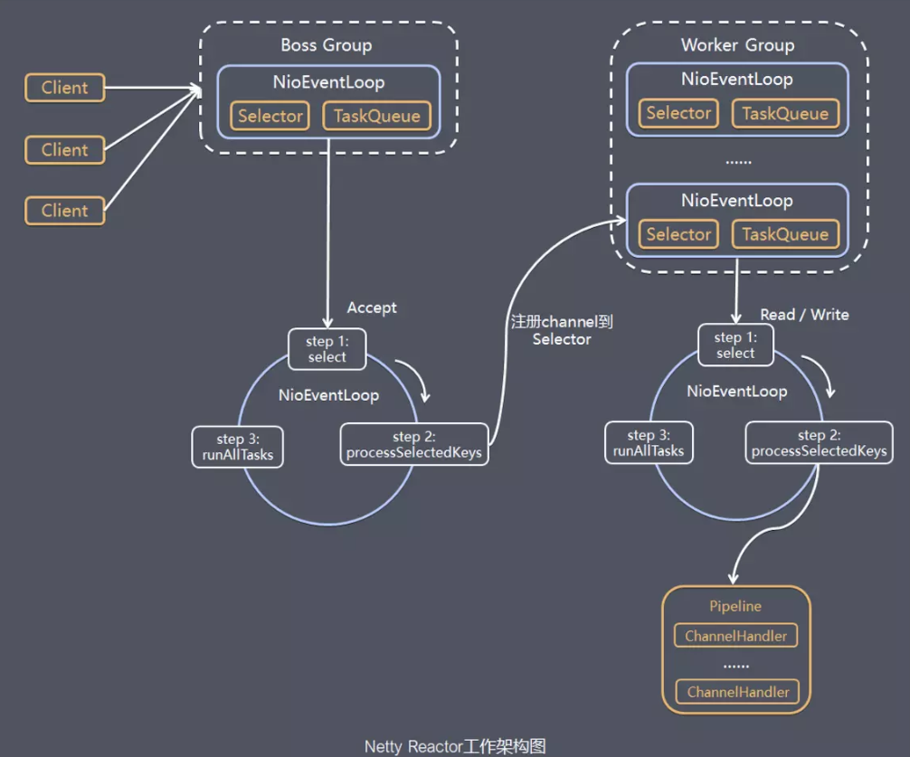

# Netty的线程模型怎么设计的

Netty 的线程模型旨在高效地处理并发连接和请求，以优化网络应用程序的性能。其线程模型包括了多种优化技术，例如 **Reactor 模式、线程池和事件循环**等，用于在高负载下保持高效稳定的性能。下面详细介绍 Netty 的线程模型及其提升性能的方法。

### Netty 线程模型概述



### Netty 的线程模型

Netty 的线程模型由三类主要的线程组成：

1. **Boss 线程池（或 BossGroup）**
2. **Worker 线程池（或 WorkerGroup）**
3. **用户自定义线程**

#### 1. Boss 线程**池**

+ **职责**：主要负责监听请求（如接收新连接）并将这些连接分发给 Worker 线程进行处理。
+ **数量**：通常 Boss 线程组（`NioEventLoopGroup`）的线程数量为一个，处理所有的监听端口。

#### 2. Worker 线程**池**

+ **职责**：负责处理 I/O 操作（如读写操作）的多线程池。Worker 线程从 Boss 线程那里接收到新的连接后，处理实际的数据读写、解码、编码等操作。
+ **数量**：通常为 CPU 核心数的 2 倍，可以通过配置来调整。

#### 3. 用户自定义线程

+ **职责**：用户可以根据需要定义自己的线程来处理业务逻辑，这些线程通常在 Handler 中异步执行耗时操作，以避免阻塞 Worker 线程。

### 示例代码：简单的 Netty 服务器线程模型

以下是一个简单的 Netty 服务器示例，展示了如何配置线程模型：

```java
public class NettyServer {  

    public static void main(String[] args) throws InterruptedException {  
        // 创建两个线程组：bossGroup 和 workerGroup  
        EventLoopGroup bossGroup = new NioEventLoopGroup(1); // 接受连接请求  
        EventLoopGroup workerGroup = new NioEventLoopGroup(); // 处理读写操作  
        try {  
            ServerBootstrap b = new ServerBootstrap(); // 服务端引导程序  
            b.group(bossGroup, workerGroup)  
            .channel(NioServerSocketChannel.class) // 使用 NIO 传输  
            .childHandler(new ChannelInitializer<SocketChannel>() {  
                @Override  
                public void initChannel(SocketChannel ch) {  
                    ch.pipeline().addLast(new SimpleChannelInboundHandler<ByteBuf>() {  
                        @Override  
                        protected void channelRead0(ChannelHandlerContext ctx, ByteBuf msg) {  
                            System.out.println("Received data: " + msg.toString(CharsetUtil.UTF_8));  
                            ctx.writeAndFlush(Unpooled.copiedBuffer("Hello, client!", CharsetUtil.UTF_8));  
                        }  
                    });  
                }  
            });  

            // 绑定端口并启动服务器  
            ChannelFuture f = b.bind(8080).sync();  
            // 等待服务器套接字关闭  
            f.channel().closeFuture().sync();  
        } finally {  
            // 优雅退出，释放线程池资源  
            bossGroup.shutdownGracefully();  
            workerGroup.shutdownGracefully();  
        }  
    }  
}
```

在这个示例中：

+ `bossGroup` 负责接受新连接。
+ `workerGroup` 负责处理读写操作。
+ `ServerBootstrap` 配置了通道类型、事件循环组和通道处理器。

### 提高性能的方法

Netty 通过以下方法来提高性能和扩展性：

1. **非阻塞 I/O 和事件驱动：**
    + Netty 基于 NIO（基于 NIO 的 `Selector`）实现非阻塞 I/O，通过事件驱动的方式来高效处理 I/O 事件。
    + 线程不会因为等待 I/O 操作完成而被阻塞，而是由事件循环（event loop）轮询 I/O 事件。
2. **事件循环（Event Loop）：**
    + Netty 的事件循环由一个或多个线程组成，当事件循环线程处理某一个连接时，不会被 I/O 操作阻塞。
    + 每个事件循环线程通过不断循环检查事件队列并执行相应的 I/O 操作，最大化 CPU 使用率。
3. **线程与通道的绑定：**
    + Netty 将每个 `Channel` 绑定到一个特定的事件循环线程上，这样避免了多线程竞争问题，简化了并发控制，降低了锁的使用，从而提高了性能。
4. **线程池复用：**
    + 通过线程池复用线程，避免了频繁创建销毁线程的开销，尤其是在高并发场景下，降低了系统资源的消耗，提高了响应速度。
5. **工作线程分离：**
    + 通过将连接管理和 I/O 操作分离到不同的线程中，使得各个部分能够独立伸缩和优化，避免单一线程成为系统瓶颈。

### 总结

Netty 的线程模型通过以下方式提高了性能：

+ 利用 Reactor 模式进行异步和非阻塞 I/O 操作。
+ 使用事件循环减少线程上下文切换和阻塞时间。
+ 通过线程池复用、通道线程绑定等方式减少资源消耗和锁竞争。

这些机制使 Netty 能够高效处理大规模并发连接和请求，是其在高性能网络编程中广泛应用的基础。
