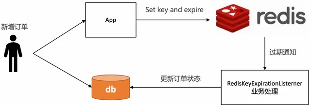
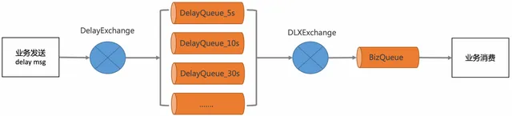
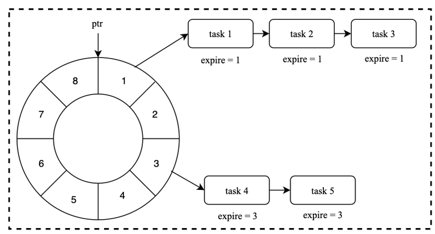
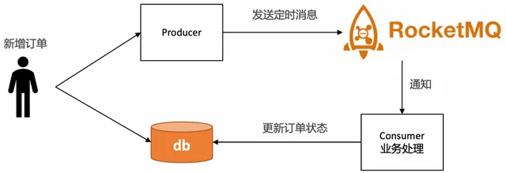
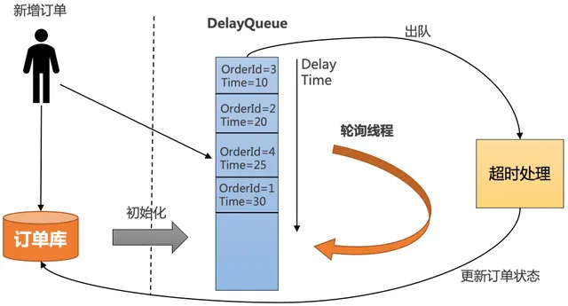

# 领导：谁再用Redis处理过期订单，立马走人

## 引言

在电商和支付场景中，处理用户订单的延时关闭是至关重要的。然而，有些方案看似简单却潜藏危险，尤其是使用 **Redis** 做过期订单关闭。身为团队的一员，切记：**谁再用Redis处理过期订单，立马走人！**

## 不推荐的方案

### 1. Redis 过期监听

Redis的过期监听机制并不可靠。官方说明指出，过期事件是在Redis删除键时生成的，而非在TTL到达时立即触发。因此，您可能遇到以下问题：

+ **过期延迟**：过期通知的触发时间会延迟，可能延迟数分钟。
+ **“发送即忘”策略**：无法保证消息送达，当客户端断线时会丢失所有分发的事件。

这种不可靠的机制，绝对不适合用于过期订单的管理。

### 2. RabbitMQ 死信队列

RabbitMQ提供死信机制，要让消息成为死信，必须满足特定条件，例如消息过期或被否定确认。然而，这同样存在时间上的不确定性：

+ **不保证投递时间**：消息在成为死信之前，如果有更早的消息未被处理，则后面的消息无法及时处理。

虽然可以用来排查消息，但它并不理想。

### 3. 时间轮

时间轮是一种良好的定时任务实现，但大多数实现是纯内存的，没有持久化：

+ **任务丢失风险**：一旦进程崩溃，所有的定时任务都会消失。

在使用时间轮之前，请务必考虑其风险性。

## 推荐方案

### 使用专业消息队列

对于延时任务，推荐使用 **RocketMQ** 或 **Pulsar** 等具有定时投递功能的专业消息队列。这些系统设计上为高并发和可靠性做了优化，确保消息的准确投递。

### Redisson DelayedQueue

如果在特定场景下无法使用专业队列，**Redisson DelayQueue** 是基于Redis ZSet的一种可选方案。虽然在Redis崩溃时依然可能丢失消息，但在Redis运行稳定的情况下，DelayQueue可以有效避免消息丢失。

同时，请设计补偿机制以应对潜在的Redis崩溃。

## 方案比较

| **方案** | **优点** | **缺点** |
| --- | --- | --- |
| 消息队列 | 可靠性高，支持高并发 | 需要额外的基础设施 |
| Redisson DelayedQueue | 简单易用，基于 Redis | 依赖于 Redis 的稳定性 |
| Redis 过期监听 | 实现简单，易于上手 | 不可靠，可能会延迟，缺乏一致性 |
| RabbitMQ 死信队列 | 可用于排查和重新投递 | 不保证投递时间，依赖于消息的状态 |
| 时间轮 | 高效的定时任务管理 | 无持久化，进程崩溃后任务丢失 |

## 结论

对于延时任务的实现，推荐使用 **RocketMQ**、**Pulsar** 等专业消息队列，它们提供了可靠的延时投递功能。

在无法使用专业消息队列的情况下，可以考虑使用 **Redisson DelayedQueue**，但需设计补偿机制以应对 Redis 崩溃等情况。

如果没有其他选择，可以使用 **时间轮**，但需注意其重启频率和持久化问题。

**注意：永远不要使用 Redis 的过期监听来实现定时任务**，因为它不具备可靠性和一致性保障，容易导致任务丢失。

希望这篇文章能帮助你更好地理解延时任务的实现方式及其最佳实践！如有疑问，欢迎交流讨论。
