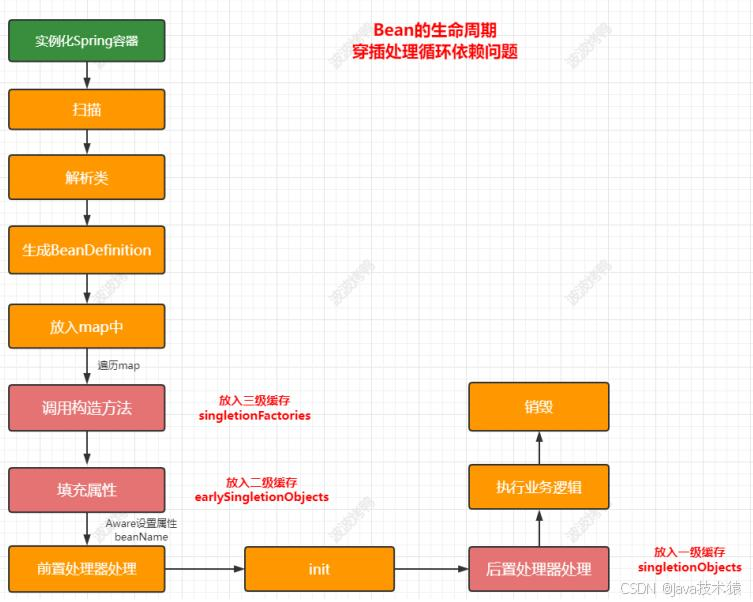
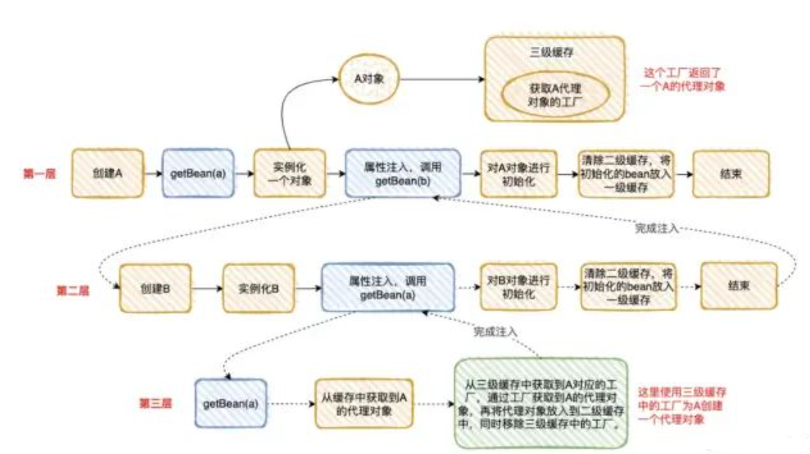

# Spring是如何解决Bean的循环依赖？

## 引入：循环依赖的场景

假设有两个Bean **A** 和 **B**，彼此依赖：

+ **A** 依赖 **B**（通过`@Autowired`注入）
+ **B** 依赖 **A**（通过`@Autowired`注入）

此时，Spring在创建Bean时会陷入“鸡生蛋、蛋生鸡”的问题。传统单线程构造方法无法解决此问题，但Spring通过 **三级缓存** 机制打破僵局。当然处理此相互依赖你还能想到另外两种循环依赖的情况吗？（自，三）

#### 简答

Spring是如何解决的循环依赖： 采用三级缓存解决的 就是三个Map ； 关键： 一定要有一个缓存保存它的早期对象作为死循环的出口

1. 1、一级缓存**singletonObjects**存**完整**单例bean。  
2、二级缓存**earlySingletonObjects**存放的是早期的bean，即**半成品**，此时还无法使用（只用于循环依赖提供的临时bean对象）。  
3、三级缓存**singletonFactories** (循环依赖的出口，解决了循环依赖)。它存的是一个**对象工厂**，用于创建对象并放入二级缓存中。同时，如果对象有Aop代理，则对象工厂返回代理对象。

配合Bean生命周期图答：



## 面试官还可能问

### 二级缓存能不能解决循环依赖？

    1.  如果只是循环依赖导致的死循环的问题： 一级缓存就可以解决 ，但是无法解决在并发下获取不完整的Bean。
    2. 二级可以完全解决循环依赖：  只是需要在实例化后就创建动态代理，导致逻辑复杂且性能下降，不符合spring生命周期规范。
    3. 故而需要三级缓存+工厂：通过延迟代理对象的生成，只有在真正发生循环依赖时才创建代理，避免不必要的代理生成

### 既然二级缓存解决不了的需要三级缓存，那能不能不要二级缓存呢？

 假定套娃逻辑：A 需要找 B 和 C，但是 B 需要找 A，C 也需要找 A。

假如 A 需要进⾏ AOP，因为代理对象每次都是⽣成不同的对象，如果⼲掉第⼆级缓存，只有第⼀、三级缓存：

B 找到 A 时，直接通过三级缓存的⼯⼚的代理对象，⽣成对象 A1。

C 找到 A 时，直接通过三级缓存的⼯⼚的代理对象，⽣成对象 A2。

**看到问题没**？你通过 A 的⼯⼚的代理对象，⽣成了两个不同的对象 A1 和 A2，所以为了避免这种问题的出现，我们搞个⼆级缓存，把 A1 存下来，下次再获取时，直接从⼆级缓存获取，⽆需再⽣成新的代理对象。

所以“⼆级缓存”的⽬的是为了避免因为 AOP 创建多个对象，其中存储的是半成品的 AOP 的单例 bean。

如果没有 AOP 的话，我们其实只要 1、3 级缓存，就可以满⾜要求。

### Spring有没有解决多例Bean/原型Bean的循环依赖？

**（**@Scope(ConfigurableBeanFactory.SCOPE_PROTOTYPE)**）**

    4. 多例不会使用缓存进行存储（多例Bean每次使用都需要重新创建）
    5. 不缓存早期对象就无法解决循环
    6. 解决方案：避免原型bean的循环依赖，使用工厂方法延迟依赖注入或者使用@Lazy注解

### Spring有没有解决构造函数参数Bean的循环依赖？

    7. 构造函数的循环依赖也是会报错（BeanCurrentlyInCreationException）。原因：构造器注入在 **实例化阶段** 就需要依赖对象，但此时Bean尚未放入三级缓存，无法提前暴露半成品对象
    8. 可以通过人工进行解决：@Lazy 
        1. 就不会立即创建依赖的bean了
        2. 而是等到用到才通过动态代理进行创建
    9. 使用setter/Field注入代替构造器注入

### 更多细节深入

#### **循环依赖与AOP代理的交互**

**问题**：当Bean被AOP代理（如`@Transactional`、`@Async`）时，Spring如何解决循环依赖？  
**答案**：

+ **代理生成的时机**：  
若Bean需要被代理（如通过JDK动态代理或CGLib），Spring在 **三级缓存** 的`ObjectFactory`中生成代理对象，而非原始对象。

```java

// 示例：A和B均被@Transactional标记
@Service
public class A {
    @Autowired
    private B b;
}

@Service
public class B {
    @Autowired
    private A a;
}
```

    - **流程变化**：当`A`的半成品对象被放入三级缓存后，后续获取`A`时，`ObjectFactory`会通过`getEarlyBeanReference()`生成代理对象，而非原始对象。
    - **关键点**：代理对象的依赖注入仍能正确完成，但开发者需注意**代理对象的方法调用是否触发额外逻辑**（如事务传播）。

**陷阱**：

+ **自调用问题**：若A的方法内部调用自己的另一个方法（未被AOP增强），由于代理对象的存在，可能无法触发预期切面（需通过`AopContext.currentProxy()`解决）。

#### **不同作用域Bean的组合循环依赖**

**场景**：单例Bean依赖原型Bean，原型Bean又依赖单例Bean。  
**示例**：

```java
@Scope(ConfigurableBeanFactory.SCOPE_PROTOTYPE)
@Component
public class PrototypeA {
    @Autowired
    private SingletonB b;  // 依赖单例Bean
}

@Component
public class SingletonB {
    @Autowired
    private PrototypeA a;  // 依赖原型Bean
}
```

**能否解决**？

+ **否**：当`SingletonB`初始化时，尝试注入`PrototypeA`的新实例，而每个`PrototypeA`又需要注入`SingletonB`，导致无限递归。
+ **根源**：原型Bean无法通过缓存暴露半成品，即使依赖的单例Bean已存在，原型Bean每次仍需完整初始化。

**解决方案**：

+ 使用`@Lazy`延迟加载原型Bean：

```java

@Component
public class SingletonB {
    @Lazy
    @Autowired
    private PrototypeA a;  // 延迟创建PrototypeA
}
```

---

#### **Spring Boot中的自动配置与循环依赖**

**问题**：Spring Boot的自动配置是否更容易引入循环依赖？  
**分析**：

+ 自动配置通过`@Conditional`按需加载Bean，若多个自动配置类隐式依赖彼此，可能意外引入循环依赖。
+ **调试方法**：
  + 启用`debug`日志：`spring.main.log-startup-info=true`，查看Bean创建顺序。
  + 使用`@AutoConfigureAfter`或`@AutoConfigureBefore`显式控制自动配置类的加载顺序。

**示例**：

```java


@Configuration
@AutoConfigureBefore(DataSourceAutoConfiguration.class)  // 强制在当前配置前加载
public class MyCustomAutoConfig {
    // 依赖其他自动配置的Bean
}
```

---

#### **循环依赖对启动性能的影响**

**影响**：

+ **额外缓存操作**：三级缓存的读写、工厂对象的生成会增加少量开销。
+ **代理生成成本**：若涉及AOP，循环依赖可能触发多次代理生成检查。

**优化建议**：

+ **避免不必要的循环依赖**：重构代码，使用Setter注入替代字段注入，降低耦合。
+ **延迟加载**：对非关键依赖使用`@Lazy`，减少启动时初始化的Bean数量。

---

#### **替代设计模式避免循环依赖**

**推荐实践**：

1. **依赖倒置（DIP）**：通过接口解耦具体实现。

```java


public interface ServiceA {
    void doSomething();
}

public interface ServiceB {
    void doSomething();
}

@Component
public class ServiceAImpl implements ServiceA {
    private final ServiceB serviceB;
    public ServiceAImpl(ServiceB serviceB) { this.serviceB = serviceB; }
}

@Component
public class ServiceBImpl implements ServiceB {
    private final ServiceA serviceA;
    public ServiceBImpl(ServiceA serviceA) { this.serviceA = serviceA; }
}
```

    - **仍会循环依赖**：需结合事件驱动或回调机制进一步解耦。
2. **事件发布-订阅模型**：

```java


@Component
public class ServiceA {
    @Autowired
    private ApplicationEventPublisher publisher;

    public void init() {
        publisher.publishEvent(new ServiceAReadyEvent(this));
    }
}

@Component
public class ServiceB {
    @EventListener
    public void handleServiceAReady(ServiceAReadyEvent event) {
        // 在ServiceA就绪后执行逻辑
    }
}
```

---

#### **Spring源码中的循环依赖处理（关键方法解析）**

**核心类**：`AbstractAutowireCapableBeanFactory`  
**关键方法**：

+ `doCreateBean()`：创建Bean实例，并调用`addSingletonFactory()`将工厂对象加入三级缓存。
+ `getSingleton()`：尝试从缓存获取Bean，若不存在则触发创建流程。
+ `populateBean()`：填充属性时检测循环依赖，递归解析依赖Bean。

**源码片段**：

```java


// AbstractAutowireCapableBeanFactory.java
protected Object doCreateBean(..., RootBeanDefinition mbd, Object[] args) {
    // 1. 实例化Bean
    BeanWrapper instanceWrapper = createBeanInstance(beanName, mbd, args);
    Object bean = instanceWrapper.getWrappedInstance();

    // 2. 将Bean工厂加入三级缓存（解决循环依赖）
    addSingletonFactory(beanName, () -> getEarlyBeanReference(beanName, mbd, bean));

    // 3. 填充属性（可能触发依赖Bean的创建）
    populateBean(beanName, mbd, instanceWrapper);

    // 4. 初始化Bean（调用PostConstruct等）
    exposedObject = initializeBean(beanName, exposedObject, mbd);
    return exposedObject;
}
```

---

#### **Spring版本差异与循环依赖处理**

**Spring 5.x的改进**：

+ **优化代理生成逻辑**：减少不必要的代理检查，提升性能。
+ **更清晰的错误提示**：循环依赖链在异常信息中完整展示，便于调试。
+ **构造函数注入的优化**：通过`Objenesis`库支持部分构造器注入场景（非所有情况）。

---

#### **单元测试中的循环依赖模拟**

**测试场景**：验证存在循环依赖时Spring能否正确处理。  
**工具**：

+ `**@SpringBootTest**`：启动完整上下文，触发Bean初始化。
+ `**@MockBean**`：模拟依赖的Bean，打破实际循环。

**示例**：

```java


@SpringBootTest
public class CircularDependencyTest {
    @MockBean
    private ServiceB serviceB;  // 模拟ServiceB，避免真实依赖

    @Autowired
    private ServiceA serviceA;

    @Test
    public void testServiceA() {
        assertNotNull(serviceA);
    }
}
```

---

### **总结**

循环依赖的深入问题涵盖代理交互、作用域组合、性能影响、设计模式替代方案及源码机制。理解这些细节有助于：

1. 高效排查启动错误。
2. 优化应用设计，降低耦合。
3. 在复杂场景下合理使用Spring特性。  
实际开发中，**优先通过代码重构避免循环依赖**，而非过度依赖框架机制。

### tips:应部分学员要求继续加深到源码解读

不具备相关基础可忽略此部分

#### **1. 核心类与关键方法**

Spring 解决循环依赖的核心逻辑位于以下类中：

+ `**DefaultSingletonBeanRegistry**`：管理单例Bean的注册、缓存（三级缓存的核心实现）。
+ `**AbstractAutowireCapableBeanFactory**`：负责Bean的创建、属性填充、初始化。
+ `**AbstractBeanFactory**`：定义Bean的获取流程（`getBean` 方法的入口）。

---

#### **2. 源码流程拆解**

以下以 **单例Bean A → 依赖 B → 单例Bean B → 依赖 A** 的循环依赖场景为例，分析源码执行流程：

---

##### **步骤1：获取Bean A（**`**getBean("A")**`**）**

+ **入口方法**：`AbstractBeanFactory.getBean(String name)`

```java
public Object getBean(String name) throws BeansException {
    return doGetBean(name, null, null, false);
}
```

+ **核心逻辑**：调用 `doGetBean`，检查缓存中是否存在已初始化的Bean。

---

##### **步骤2：检查三级缓存（**`**DefaultSingletonBeanRegistry.getSingleton**`**）**

+ **方法**：`DefaultSingletonBeanRegistry.getSingleton(String beanName, boolean allowEarlyReference)`

```java
protected Object getSingleton(String beanName, boolean allowEarlyReference) {
    // 1. 检查一级缓存（完全初始化的Bean）
    Object singletonObject = this.singletonObjects.get(beanName);
    if (singletonObject == null && isSingletonCurrentlyInCreation(beanName)) {
        // 2. 检查二级缓存（半成品Bean）
        singletonObject = this.earlySingletonObjects.get(beanName);
        if (singletonObject == null && allowEarlyReference) {
            synchronized (this.singletonObjects) {
                singletonObject = this.singletonObjects.get(beanName);
                if (singletonObject == null) {
                    singletonObject = this.earlySingletonObjects.get(beanName);
                    if (singletonObject == null) {
                        // 3. 检查三级缓存（Bean工厂）
                        ObjectFactory<?> singletonFactory = this.singletonFactories.get(beanName);
                        if (singletonFactory != null) {
                            // 通过工厂获取半成品Bean，并升级到二级缓存
                            singletonObject = singletonFactory.getObject();
                            this.earlySingletonObjects.put(beanName, singletonObject);
                            this.singletonFactories.remove(beanName);
                        }
                    }
                }
            }
        }
    }
    return singletonObject;
}
```

**关键点**：

    - 一级缓存（`singletonObjects`）存储完全初始化的Bean。
    - 二级缓存（`earlySingletonObjects`）存储提前暴露的半成品Bean。
    - 三级缓存（`singletonFactories`）存储生成半成品Bean的工厂。

---

##### **步骤3：创建Bean A（**`**createBean**`******→**** **`**doCreateBean**`**）**

若缓存中无Bean A，进入创建流程：

+ **方法**：`AbstractAutowireCapableBeanFactory.doCreateBean(String beanName, RootBeanDefinition mbd, Object[] args)`

```java
protected Object doCreateBean(String beanName, RootBeanDefinition mbd, Object[] args) {
    // 1. 实例化Bean（此时对象尚未填充属性）
    BeanWrapper instanceWrapper = createBeanInstance(beanName, mbd, args);
    Object bean = instanceWrapper.getWrappedInstance();

    // 2. 将Bean的工厂对象加入三级缓存（关键步骤！）
    boolean earlySingletonExposure = (mbd.isSingleton() && 
                                      this.allowCircularReferences && 
                                      isSingletonCurrentlyInCreation(beanName));
    if (earlySingletonExposure) {
        // 添加ObjectFactory到三级缓存
        addSingletonFactory(beanName, () -> getEarlyBeanReference(beanName, mbd, bean));
    }

    // 3. 填充Bean属性（可能触发依赖Bean的创建）
    populateBean(beanName, mbd, instanceWrapper);

    // 4. 初始化Bean（执行PostConstruct、InitializingBean等）
    exposedObject = initializeBean(beanName, bean, mbd);

    return exposedObject;
}
```

**关键操作**：

    - `addSingletonFactory` 将Bean A的工厂加入三级缓存。
    - `getEarlyBeanReference` 的触发时机：当发生循环依赖时，通过此工厂生成半成品Bean（可能为代理对象）。

---

##### **步骤4：填充属性时触发Bean B的创建（**`**populateBean**`**）**

+ **方法**：`AbstractAutowireCapableBeanFactory.populateBean`

```java
protected void populateBean(String beanName, RootBeanDefinition mbd, BeanWrapper bw) {
    // 通过后置处理器进行属性注入（如@Autowired）
    for (BeanPostProcessor bp : getBeanPostProcessors()) {
        if (bp instanceof InstantiationAwareBeanPostProcessor) {
            // 触发依赖解析（可能调用getBean("B")）
            InstantiationAwareBeanPostProcessor ibp = (InstantiationAwareBeanPostProcessor) bp;
            ibp.postProcessProperties(pvs, bw.getWrappedInstance(), beanName);
        }
    }
}
```

**此时流程**：

    - 填充Bean A的属性时发现依赖Bean B，触发 `getBean("B")`。
    - Bean B的创建流程与Bean A类似，当填充B的属性时，再次触发 `getBean("A")`。

---

##### **步骤5：再次获取Bean A（触发三级缓存）**

当 `getBean("A")` 再次被调用时：

1. 一级缓存中无Bean A。
2. 检查到Bean A正在创建中（`isSingletonCurrentlyInCreation("A")` 返回 `true`）。
3. 从三级缓存中获取Bean A的工厂，生成半成品Bean A，并升级到二级缓存。
4. 将半成品Bean A注入Bean B，完成Bean B的初始化。
5. Bean B实例化完成后，回到Bean A的 `populateBean` 流程，将Bean B注入Bean A。
6. 最后完成Bean A的初始化，将其放入一级缓存。

---

#### **3. 源码中的关键设计**

##### **设计1：三级缓存的必要性**

+ **三级缓存（**`**singletonFactories**`**）**：存储 `ObjectFactory`，允许在需要时才生成半成品Bean（处理AOP代理时尤为重要）。
+ **延迟代理生成**：若Bean需要AOP代理，通过 `getEarlyBeanReference()` 生成代理对象，避免重复生成。

##### **设计2：循环依赖检测**

+ **记录创建中的Bean**：通过 `singletonsCurrentlyInCreation` 集合（`Set<String>`）记录当前正在创建的Bean名称。
+ **异常抛出**：当检测到循环依赖无法解决时（如构造器注入），抛出 `BeanCurrentlyInCreationException`。

---

#### **4. 构造器注入为何无法解决循环依赖？**

**源码证据**：

+ 构造器注入在实例化阶段（`createBeanInstance`）就需要完成依赖注入：

```java
protected BeanWrapper createBeanInstance(String beanName, RootBeanDefinition mbd, Object[] args) {
    // 解析构造器参数（可能触发依赖Bean的创建）
    Constructor<?> constructorToUse = determineConstructor(beanName, mbd);
    return instantiateBean(beanName, mbd, constructorToUse, args);
}
```

**问题**：此时Bean尚未放入三级缓存，导致依赖的Bean无法获取半成品对象，最终抛出异常。

---

#### **5. AOP代理与循环依赖的结合**

**核心方法**：`AbstractAutowireCapableBeanFactory.getEarlyBeanReference()`

```java
protected Object getEarlyBeanReference(String beanName, RootBeanDefinition mbd, Object bean) {
    Object exposedObject = bean;
    // 通过后置处理器生成代理对象（如需要）
    for (BeanPostProcessor bp : getBeanPostProcessors()) {
        if (bp instanceof SmartInstantiationAwareBeanPostProcessor) {
            SmartInstantiationAwareBeanPostProcessor ibp = (SmartInstantiationAwareBeanPostProcessor) bp;
            exposedObject = ibp.getEarlyBeanReference(exposedObject, beanName);
        }
    }
    return exposedObject;
}
```

**流程**：

+ 若Bean需要代理（如标记了 `@Transactional`），此处会返回代理对象。
+ 注入到其他Bean中的是代理对象，而非原始Bean。

---

### **图解总结**



Spring通过三级缓存和**提前暴露半成品Bean**的机制解决单例Bean的循环依赖，源码核心逻辑集中在：

### **关键源码节点标注**

| **步骤** | **对应源码方法/类** |
| :---: | :---: |
| 检查三级缓存 | `DefaultSingletonBeanRegistry.getSingleton()` |
| 创建实例 | `AbstractAutowireCapableBeanFactory.createBeanInstance()` |
| 加入三级缓存 | `DefaultSingletonBeanRegistry.addSingletonFactory()` |
| 填充属性 | `AbstractAutowireCapableBeanFactory.populateBean()` |
| 生成半成品代理 | `AbstractAutowireCapableBeanFactory.getEarlyBeanReference()` |

**避坑指南**：

+ 避免构造器注入的循环依赖。
+ 原型Bean的循环依赖无法解决，需通过设计重构或 `@Lazy` 注解规避。
+ 理解源码后，可更高效地调试循环依赖问题，优化应用设计。
