# 💎Redis 面试题集合

# <font style="color:#01B2BC;">全面解析Redis-RDB与AOF持久化机制</font>
Redis之所以能够提供高速读写操作是因为数据存储在内存中，但这也带来了一个风险，即在服务器宕机或断电的情况下，内存中的数据会丢失。为了解决这个问题，Redis提供了持久化机制来确保数据的持久性和可靠性。

## Redis持久化机制：
+ RDB(Redis Data Base) ：内存快照
+ AOF(Append Only File)： 增量日志
+ 混合持久化：RDB + AOF

## RDB持久化
在指定的时间间隔内将内存中的数据集快照写入磁盘，RDB是内存快照（内存数据的二进制序列化形式）的方式持久化，每次都是从Redis中生成一个快照进行数据的全量备份。

### RDB持久化流程：
### 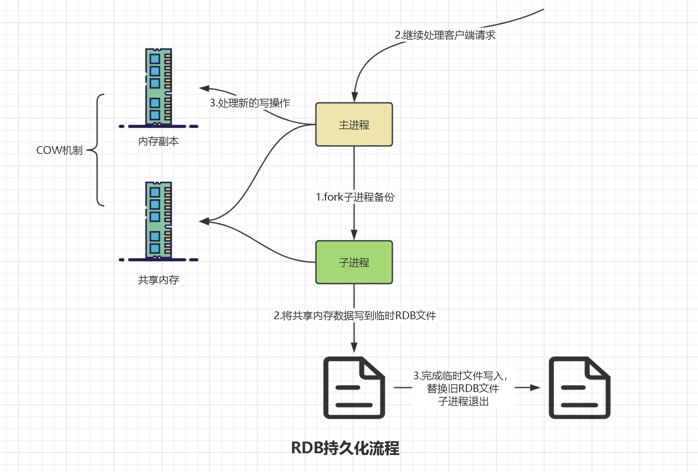
RDB持久化方案进行备份时，Redis会单独fork一个子进程来进行持久化，会将数据写入一个临时文件中，持久化完成后替换旧的RDB文件。

在整个持久化过程中，主进程（为客户端提供服务的进程）不参与IO操作，这样能确保Redis服务的高性能，RDB持久化机制适合对数据完整性要求不高但追求高效恢复的使用场景。

### <font style="color:#01B2BC;">RDB触发规则</font>
#### 手动触发
##### <font style="color:#01B2BC;">save：</font>
阻塞当前 Redis进程，直到RDB持久化过程完成，如果内存实例比较大会造成长时间阻塞，尽量不要使用这方式

##### <font style="color:#01B2BC;">bgsave：</font>
Redis主进程fork创建子进程，由子进程完成持久化，阻塞时间很短（微秒级）

#### 自动触发
##### 配置触发：
+ 在Redis安装目录下的redis.conf配置文件中搜索 /snapshot即可快速定位，配置文件默认注释了下面三行数据，通过配置规则来触发RDB的持久化，需要开启或者根据自己的需求按照规则来配置。


<font style="color:#01B2BC;">save 3600 1</font> -- 3600 秒内有1个key被修改，触发RDB  
<font style="color:#01B2BC;">save 300 100</font> -- 300 秒内有100个key被修改，触发RDB  
<font style="color:#01B2BC;">save 60 10000</font> -- 60 秒内有10000个key被修改，触发RDB

##### shutdown触发：
+ shutdown触发Redis的RDB持久化机制非常简单，我们在客户端执行shutdown即可。

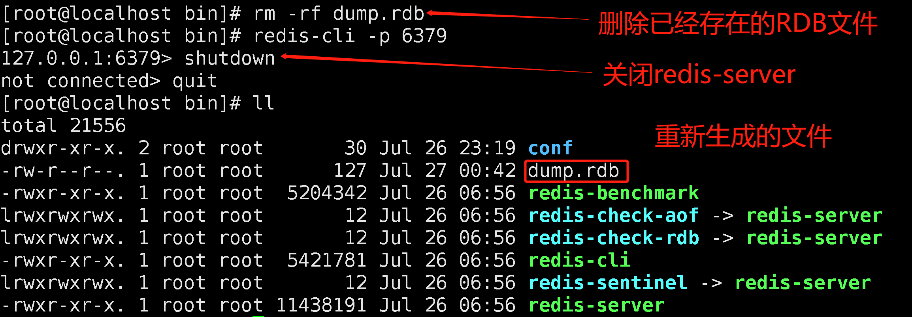

##### flushall触发:
+ flushall清空Redis所有数据库的数据（16个库数据都会被删除）（<font style="color:#DF2A3F;">等同于删库跑路</font>）

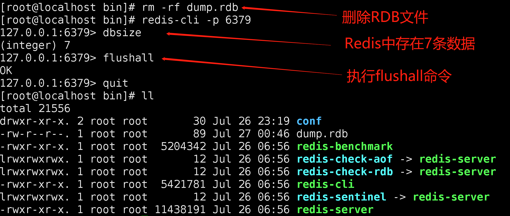

### 优点：
+ 性能高：RDB持久化是通过生成一个快照文件来保存数据，因此在恢复数据时速度非常快。
+ 文件紧凑：RDB文件是二进制格式的数据库文件，相对于AOF文件来说，文件体积较小。

### 缺点：
+ 可能丢失数据：由于RDB是定期生成的快照文件，如果Redis意外宕机，最近一次的修改可能会丢失。

### TIPS
Redis持久化默认开启为<font style="color:#01B2BC;">RDB持久化</font>

## AOF持久化
AOF持久化需要手动修改conf配置开启。

### AOF持久化流程：
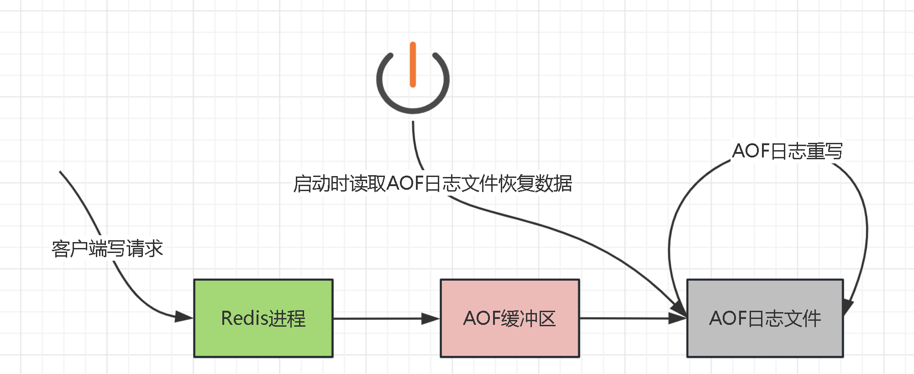

AOF持久化方案进行备份时，客户端所有请求的写命令都会被追加到AOF缓冲区中，缓冲区中的数据会根据Redis配置文件中配置的同步策略来同步到磁盘上的AOF文件中，同时当AOF的文件达到重写策略配置的阈值时，Redis会对AOF日志文件进行重写，给AOF日志文件瘦身。Redis服务重启的时候，通过加载AOF日志文件来恢复数据。

### AOF配置：
AOF默认不开启，默认为appendonly no，开启则需要修改为appendonly yes


关闭AOF+RDB混合模式，设为no：


### AOF同步策略：


#### appendfsync always：
    - 每次Redis写操作，都写入AOF日志，非常耗性能的。

#### appendfsync everysec
    - 每秒刷新一次缓冲区中的数据到AOF文件，这个Redis配置文件中默认的策略，兼容了性能和数据完整性的折中方案，这种配置，理论上丢失的数据在一秒钟左右

#### appendfsync no
    - Redis进程不会主动的去刷新缓冲区中的数据到AOF文件中，而是直接交给操作系统去判断，这种操作也是不推荐的，丢失数据的可能性非常大。

### AOF修复功能：
redis 7版本，AOF文件存储在appendonlydir文件下，base是基准文件，incr是追加数据。


先存入三条数据，然后破坏incr结尾的文件内容，末尾加上baili


重新启动报错：


使用redis-check-aof --fix appendonlydir/appendonly.aof.1.incr.aof 对AOF日志文件进行修复


观察数据可以知道，丢失了cc-key值。这种丢失是被允许的。

### AOF重写
重写其实是针对AOF存储的重复性冗余指令进行整理，比如有些key反复修改，又或者key反复修改后最终被删除，这些过程中的指令都是冗余且不需要存储的。

#### 自动重写：
当AOF日志文件达到阈值时会触发自动重写。

##### 重写阈值配置：


+ auto-aof-rewrite-percentage 100：当AOF文件体积达到上次重写之后的体积的100%时，会触发AOF重写。
+ auto-aof-rewrite-min-size 64mb：当AOF文件体积超过这个阈值时，会触发AOF重写。

当AOF文件的体积达到或超过上次重写之后的比例，并且超过了最小体积阈值时，Redis会自动触发AOF重写操作，生成一个新的AOF文件。

#### 手动重写：bgrewriteaof
正常启动后存在三个文件：


通过set命令存储三条数据，最后在修改aa数据，然后手动重写：

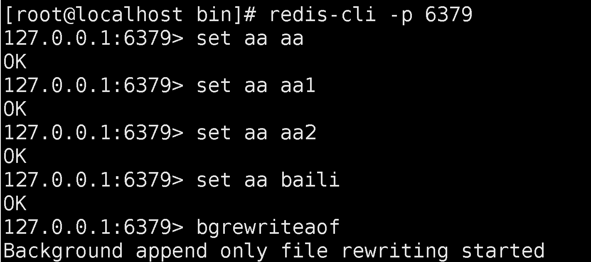

观察结果可以得知key值aa历史轨迹已经被删除

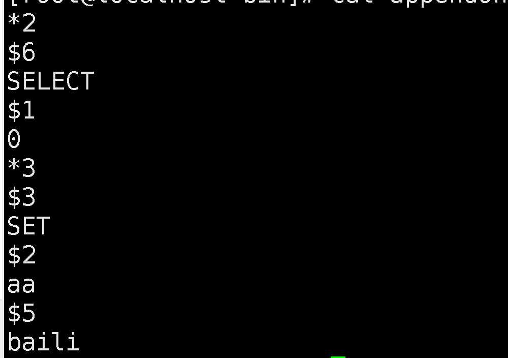

### 优点：
+ 数据更加可靠：AOF持久化记录了每个写命令的操作，因此在出现故障时，可以通过重新执行AOF文件来保证数据的完整性。
+ 可以保留写命令历史：AOF文件是一个追加日志文件，可以用于回放过去的写操作。

### 缺点：
+ 文件较大：由于记录了每个写命令，AOF文件体积通常比RDB文件要大。
+ 恢复速度较慢：当AOF文件较大时，Redis重启时需要重新执行整个AOF文件，恢复速度相对较慢。

## 混合持久化
Redis4.0版本开始支持混合持久化，因为RDB虽然加载快但是存在数据丢失，AOF数据安全但是加载缓慢。

混合持久化通过aof-use-rdb-preamble yes开启，Redis 4.0以上版本默认开启


开启混合持久化之后：appendonlydir文件下存在一个rdb文件与一个aof文件


存入数据，然后执行bgrewriteaof重写文件。

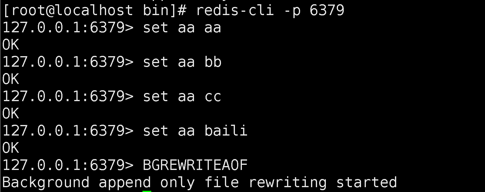


## 总结
+ 推荐两者均开启
+ 如果对数据不敏感，可以选单独用RDB
+ 不建议单独用AOF，因为可能会出现Bug
+ 如果只是做纯内存缓存，可以都不用

# <font style="color:#01B2BC;">Redis的过期策略</font>
## <font style="color:#2F4BDA;">Redis的过期策略</font>
### <font style="color:#74B602;">惰性删除（Lazy expiration）</font>
+ 当客户端尝试访问某个键时，Redis会先检查该键是否设置了过期时间，并判断是否过期。
+ 如果键已过期，则Redis会立即将其删除。这就是惰性删除策略。

该策略可以最大化地节省CPU资源，却对内存非常不友好。极端情况可能出现大量的过期key没有再次被访问，从而不会被清除，占用大量内存。

### <font style="color:#74B602;">定期删除（Active expiration）</font>
+ Redis会每隔一段时间（默认100毫秒）随机检查一部分设置了过期时间的键。
+ 定期过期策略通过使用循环遍历方式，逐个检查键是否过期，并删除已过期的键值对。

通过调整定时扫描的时间间隔和每次扫描的限定耗时，可以在不同情况下使得CPU和内存资源达到最优的平衡效果

## Redis中同时使用了<font style="color:#DF2A3F;">惰性过期</font>和<font style="color:#DF2A3F;">定期过期</font>两种过期策略。
+ 假设Redis当前存放20万个key，并且都设置了过期时间，如果你每隔100ms就去检查这全部的key，CPU负载会特别高，最后可能会挂掉。
+ 因此redis采取的是定期过期，每隔100ms就随机抽取一定数量的key来检查和删除的。
+ 但是呢，最后可能会有很多已经过期的key没被删除。这时候，redis采用惰性删除。在你获取某个key的时候，redis会检查一下，这个key如果设置了过期时间并且已经过期了，此时就会删除。

需要注意如果定期删除漏掉了很多过期的key，然后也没走惰性删除。就会有很多过期key积在内存中，可能会导致内存溢出，或者是业务量太大，内存不够用然后溢出了，为了应对这个问题，Redis引入了内存淘汰策略进行优化。

# <font style="color:#01B2BC;">Redis的内存淘汰策略</font>
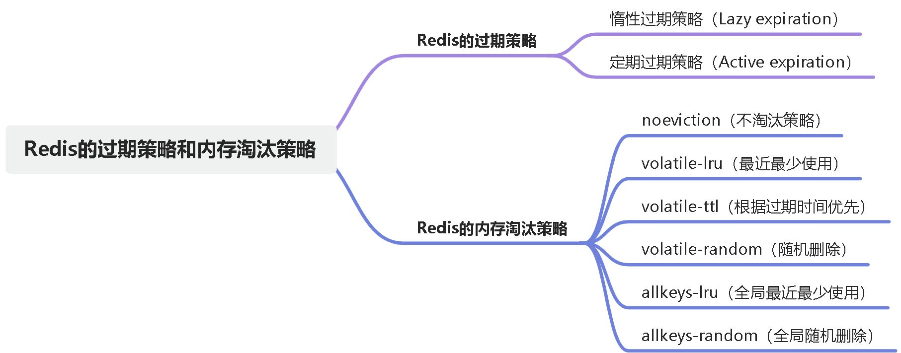

## <font style="color:#2F4BDA;">Redis的内存淘汰策略</font>
内存淘汰策略允许Redis在内存资源紧张时，根据一定的策略主动删除一些键值对，以释放内存空间并保持系统的稳定性。

### <font style="color:#74B602;">noeviction（不淘汰策略）</font>
当内存不足以容纳新写入数据时，Redis 将新写入的命令返回错误。这个策略确保数据的完整性，但会导致写入操作失败。

### <font style="color:#74B602;">volatile-lru（最近最少使用）</font>
从设置了过期时间的键中选择最少使用的键进行删除。该策略优先删除最久未被访问的键，保留最常用的键。

### <font style="color:#74B602;">volatile-ttl（根据过期时间优先）</font>
从设置了过期时间的键中选择剩余时间最短的键进行删除。该策略优先删除剩余时间较短的键，以尽量保留剩余时间更长的键。

### <font style="color:#74B602;">volatile-random（随机删除）</font>
从设置了过期时间的键中随机选择一个键进行删除。

### <font style="color:#74B602;">allkeys-lru（全局最近最少使用）</font>
从所有键中选择最少使用的键进行删除。无论键是否设置了过期时间，都将参与淘汰。

### <font style="color:#74B602;">allkeys-random（全局随机删除）</font>
从所有键中随机选择一个键进行删除。

# <font style="color:#01B2BC;">缓存击穿、缓存穿透、缓存雪崩</font>
缓存击穿、缓存雪崩和缓存穿透是我们在<font style="color:rgba(251,11,138,0.44);">日常开发</font>与<font style="color:rgba(251,11,138,0.44);">手撕面试官</font>过程中<font style="color:rgba(251,11,138,0.44);">必须battle的常见问题</font>，下面我会解释它们的含义与解决方案。

## <font style="color:#2F4BDA;">缓存击穿（Cache Miss） </font>
### <font style="color:#ECAA04;">什么是缓存击穿？</font>
缓存击穿是指在高并发访问下，一个<font style="color:rgba(251,11,138,0.44);">热点数据失效</font>时，大量请求会直接绕过缓存，<font style="color:rgba(251,11,138,0.44);">直接查询数据库</font>，导致数据库压力剧增。

通常情况下，缓存是为了减轻数据库的负载，提高读取性能而设置的。当某个特定的缓存键（key）失效后，在下一次请求该缓存时，由于缓存中没有对应的数据，因此会去数据库中查询，这就是缓存击穿。

### <font style="color:#ECAA04;">解决方案：</font>
+ <font style="color:#5C8D07;">合理的过期时间：</font>设置热点数据<font style="color:rgba(251,11,138,0.44);">永不过期</font>，或者设置<font style="color:rgba(251,11,138,0.44);">较长的过期时间</font>，以免频繁失效。
+ <font style="color:#5C8D07;">使用互斥锁：</font>保证同一时间只有一个线程来查询数据库，其他线程等待查询结果。

## <font style="color:#2F4BDA;">缓存雪崩（Cache Avalanche） </font>
### <font style="color:#ECAA04;">什么是缓存雪崩？</font>
缓存雪崩是指在<font style="color:rgba(251,11,138,0.44);">大规模缓存失效</font>或者<font style="color:rgba(251,11,138,0.44);">缓存宕机</font>的情况下，<font style="color:rgba(251,11,138,0.44);">大量请求同时涌入数据库</font>，导致数据库负载过大甚至崩溃的情况。

正常情况下，缓存中的数据会根据过期时间进行更新，当大量数据同时失效时，下一次请求就会直接访问数据库，给数据库带来巨大压力。

### <font style="color:#ECAA04;">解决方案：</font>
+ <font style="color:#5C8D07;">合理的过期时间：</font>为缓存的过期时间引入随机值，分散缓存过期时间，避免大规模同时失效。或者是粗暴的设置热点数据永不过期
+ <font style="color:#5C8D07;">多级缓存：</font>使用多级缓存架构，如本地缓存 + 分布式缓存，提高系统的容错能力。
+ <font style="color:#5C8D07;">使用互斥锁：</font>保证同一时间只有一个线程来查询数据库，其他线程等待查询结果。
+ <font style="color:#5C8D07;">高可用架构：</font>使用Redis主从复制或者集群来增加缓存的可用性，避免单点故障导致整个系统无法使用。

## <font style="color:#2F4BDA;">缓存穿透（Cache Penetration） </font>
### <font style="color:#ECAA04;">什么是缓存穿透？</font>
缓存穿透是指恶意请求<font style="color:rgba(251,11,138,0.44);">查询</font>一个<font style="color:rgba(251,11,138,0.44);">不存在于缓存和数据库中的数据</font>，导致每次请求都<font style="color:rgba(251,11,138,0.44);">直接访问数据库</font>，从而增加数据库的负载。

攻击者可以通过故意构造不存在的 Key 来进行缓存穿透攻击。

### <font style="color:#ECAA04;">解决方案：</font>
+ <font style="color:#5C8D07;">缓存空对象：</font>对于查询结果为空的情况，也将其缓存起来，但使用较短的过期时间，防止攻击者利用同样的 key 进行频繁攻击。
+ <font style="color:#5C8D07;">参数校验：</font>在接收到请求之前进行参数校验，判断请求参数是否合法。
+ <font style="color:#5C8D07;">布隆过滤器：</font>判断请求的参数是否存在于缓存或数据库中。

# <font style="color:#01B2BC;">Redis哨兵机制</font>
## <font style="color:#ECAA04;">为什么需要哨兵机制？</font>
Redis的主从复制主要用于实现数据的冗余备份和读分担，并不是为了提供高可用性。因此在系统高可用方面，单纯的主从架构无法很好的保证整个系统高可用。比如说：


+ <font style="color:#DF2A3F;">需要人工介入：</font><font style="color:#74B602;">需要人工介入进行主节点切换。</font>当主节点发生故障时，主从复制无法自动进行主节点的切换。需要管理员手动干预，修改配置将一个从节点提升为新的主节点。这增加了人工操作的复杂性和潜在的延迟。
+ <font style="color:#DF2A3F;">主节点写能力有限：</font><font style="color:#74B602;">主节点的写能力受限于单个节点。</font>在主从复制中，所有写操作都必须发送给主节点处理，然后再同步到从节点。这导致主节点成为写入瓶颈，其写能力受限于单个节点的硬件和性能。如果负载过大，主节点的响应时间可能会增加，影响整体性能。
+ <font style="color:#DF2A3F;">单机节点存储能力有限：</font><font style="color:#74B602;">存储能力受限于主节点的容量。</font>在主从复制中，所有数据都存储在主节点上，从节点仅用于提供读服务。这限制了整个系统的存储能力，因为主节点的存储容量有限。如果数据量增长过快或存储需求增加，主节点的存储容量可能会成为瓶颈。

因此通常是使用<font style="color:#74B602;">Redis哨兵机制</font>或<font style="color:#74B602;">Redis集群模式</font>来提高整个系统的可用性、扩展性和负载均衡能力。

## <font style="color:#ECAA04;">哨兵机制(sentinel)的原理</font>
Redis哨兵机制是通过在独立的哨兵节点上运行特定的哨兵进程来实现的。这些哨兵进程监控主从节点的状态，并在发现故障时<font style="color:#74B602;">自动完成故障发现和转移，并通知应用方，实现高可用性</font><font style="color:rgb(37, 41, 51);">。</font>

以下是哨兵机制的工作原理：

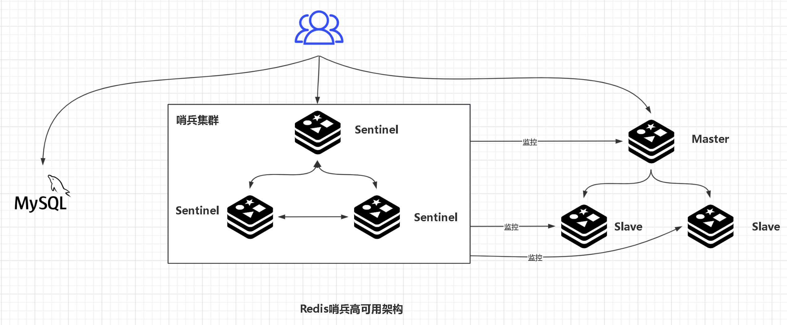

### <font style="color:#DF2A3F;">哨兵选举：</font>
在启动时，每个哨兵节点会执行选举过程，其中一个哨兵节点被选为领导者（leader），负责协调其他哨兵节点。

#### 选举过程：
+ <font style="color:rgb(37, 41, 51);">每个在线的哨兵节点都可以成为领导者，</font><font style="color:#74B602;">每个哨兵节点</font><font style="color:rgb(37, 41, 51);">会向其它哨兵发is-master-down-by-addr命令，征求判断并要求将自己设置为领导者；</font>
+ <font style="color:rgb(37, 41, 51);">当其它哨兵收到此命令时，可以同意或者拒绝它成为领导者；</font>
+ <font style="color:rgb(37, 41, 51);">如果哨兵发现自己在选举的票数大于等于num(sentinels)/2+1时，将成为领导者，如果没有超过，继续选举。</font>

### <font style="color:#DF2A3F;">监控主从节点：</font>
哨兵节点通过发送命令周期性地检查主从节点的健康状态，包括主节点是否在线、从节点是否同步等。如果哨兵节点发现主节点不可用，它会触发一次故障转移。

### <font style="color:#DF2A3F;">故障转移：</font>
一旦主节点被判定为不可用，哨兵节点会执行故障转移操作。它会从当前的从节点中选出一个新的主节点，并将其他从节点切换到新的主节点。这样，系统可以继续提供服务而无需人工介入。

#### 故障转移过程：
    - <font style="color:#DF2A3F;">由Sentinel节点定期监控发现主节点是否出现了故障：</font> sentinel会向master发送心跳PING来确认master是否存活，如果master在“一定时间范围”内不回应PONG 或者是回复了一个错误消息，那么这个sentinel会主观地(单方面地)认为这个master已经不可用了。
    - <font style="color:#DF2A3F;">确认主节点：</font>
        * 过滤掉不健康的（下线或断线），没有回复过哨兵ping响应的从节点
        * 选择从节点优先级最高的
        * 选择复制偏移量最大，此指复制最完整的从节点

<font style="color:#74B602;">当主节点出现故障， 由领导者负责处理主节点的故障转移</font>。

### <font style="color:#DF2A3F;">客户端重定向：</font>
哨兵节点会通知客户端新的主节点的位置，使其能够与新的主节点建立连接并发送请求。这确保了客户端可以无缝切换到新的主节点，继续进行操作。

此外，哨兵节点还负责监控从节点的状态。如果从节点出现故障，哨兵节点可以将其下线，并在从节点恢复正常后重新将其加入集群。

## 客观下线
当主观下线的节点是主节点时，此时该哨兵3节点会通过指令sentinel is-masterdown-by-addr寻求其它哨兵节点对主节点的判断，当超过quorum（选举）个数，此时哨兵节点则认为该主节点确实有问题，这样就客观下线了，大部分哨兵节点都同意下线操作，也就说是客观下线。

## <font style="color:rgb(37, 41, 51);">总结</font>
redis哨兵的作用:

+ 监控主数据库和从数据库是否正常运行。
+ 主数据库出现故障时，可以自动将从数据库转换为主数据库，实现自动切换。

# <font style="color:#01B2BC;">数据库和缓存一致性问题</font>
## 问题来源
使用redis做一个缓冲操作，让请求先访问到redis，而不是直接访问MySQL等数据库：


读取缓存步骤一般没有什么问题，但是一旦涉及到数据更新：<font style="color:#DF2A3F;">数据库和缓存更新</font>，就容易出现缓存(Redis)和数据库（MySQL）间的数据一致性问题。

不管是先写MySQL数据库，再删除Redis缓存；还是先删除缓存，再写库，都有可能出现数据不一致的情况。

## 举一个例子：
+ <font style="color:#DF2A3F;">先更新Mysql，再更新Redis。</font>

   如果更新Redis失败，可能仍然不一致

+ <font style="color:#DF2A3F;">先删除Redis缓存数据，再更新Mysql。</font>

   再次查询的时候在将数据添加到缓存中，这种方案能解决1方案的问题，但是在高并发下性能较低，而且仍然会出现数据不一致的问题，比如线程1删除了Redis缓存数据，正在更新Mysql，此时另外一个查询再查询，那么就会把Mysql中老数据又查到Redis中

因为写和读是并发的，没法保证顺序,就会出现缓存和数据库的数据不一致的问题

## 解决方案：
### <font style="color:#DF2A3F;">延时双删</font>
   先删除Redis缓存数据，再更新Mysql，延迟几百毫秒再删除Redis缓存数据，这样就算在更新Mysql时，有其他线程读了Mysql，把老数据读到了Redis中，那么也会被删除掉，从而把数据保持一致。

### <font style="color:#DF2A3F;">队列 + 重试机制</font>
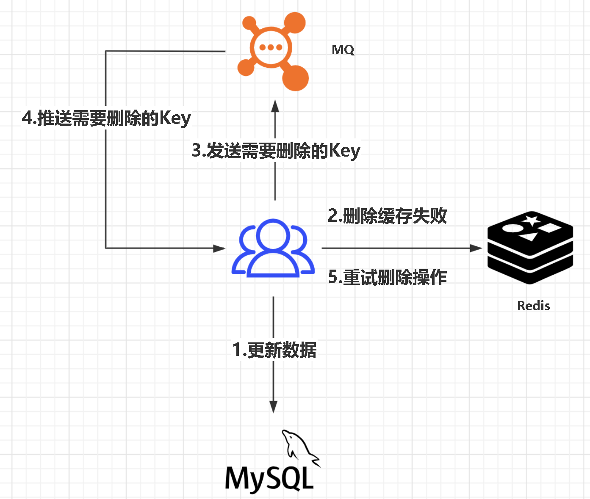

        * 更新数据库数据；
        * 缓存因为种种问题删除失败
        * 将需要删除的key发送至消息队列
        * 自己消费消息，获得需要删除的key
        * 继续重试删除操作，直到成功

####  缺陷
对业务线代码造成大量的侵入。

### <font style="color:#DF2A3F;">异步更新缓存(基于订阅binlog的同步机制)</font>


MySQL中产生了新的写入、更新、删除等操作，就可以把binlog相关的消息推送至Redis，Redis再根据binlog中的记录，对Redis进行更新。

其实这种机制，很类似MySQL的主从备份机制，因为MySQL的主备也是通过binlog来实现的数据一致性。

## 实际应用：
使用阿里的一款开源框架<font style="color:#DF2A3F;">canal</font>，通过该框架可以对MySQL的binlog进行订阅，而canal正是<font style="color:#DF2A3F;">模仿了mysql的slave数据库的备份请求</font>，使得Redis的数据更新达到了相同的效果。

MQ消息中间可以采用<font style="color:#DF2A3F;">RocketMQ</font>来实现推送。

# <font style="color:#01B2BC;">Redis实现分布式锁的6种方案，及正确使用姿势！</font>
<font style="color:rgb(51, 51, 51);">已经 2024 年了，如果还不会使用 Redis 实现分布式锁，那么请好好看看本篇文章。本文分享六种Redis分布式锁的正确使用方式，由易到难。</font>

+ <font style="color:rgb(51, 51, 51);">什么是分布式锁</font>
+ <font style="color:rgb(51, 51, 51);">方案一：SETNX + EXPIRE</font>
+ <font style="color:rgb(51, 51, 51);">方案二：SETNX + value值（系统时间+过期时间）</font>
+ <font style="color:rgb(51, 51, 51);">方案三：使用Lua脚本(包含SETNX + EXPIRE两条指令)</font>
+ <font style="color:rgb(51, 51, 51);">方案四：SET的扩展命令（SET EX PX NX）</font>
+ <font style="color:rgb(51, 51, 51);">方案五：开源框架~Redisson</font>
+ <font style="color:rgb(51, 51, 51);">方案六：多机实现的分布式锁Redlock</font>

## <font style="color:rgb(0, 0, 0);">什么是分布式锁</font>
分布式锁是一种机制，用于确保在分布式系统中，多个节点在同一时刻只能有一个节点对共享资源进行操作。它是解决分布式环境下并发控制和数据一致性问题的关键技术之一。

<font style="color:rgb(51, 51, 51);">分布式锁的特征：</font>

+ 「互斥性」: 任意时刻，只有一个客户端能持有锁。
+ 「锁超时释放」：持有锁超时，可以释放，防止不必要的资源浪费，也可以防止死锁。
+ 「可重入性」:一个线程如果获取了锁之后,可以再次对其请求加锁。
+ 「高性能和高可用」：加锁和解锁需要开销尽可能低，同时也要保证高可用，避免分布式锁失效。
+ 「安全性」：锁只能被持有的客户端删除，不能被其他客户端删除

## <font style="color:rgb(0, 0, 0);">Redis分布式锁方案一：SETNX + EXPIRE</font>
<font style="color:rgb(51, 51, 51);">提到Redis的分布式锁，很多小伙伴马上就会想到</font><font style="color:rgb(192, 52, 29);background-color:rgb(251, 229, 225);">setnx</font><font style="color:rgb(51, 51, 51);">+ </font><font style="color:rgb(192, 52, 29);background-color:rgb(251, 229, 225);">expire</font><font style="color:rgb(51, 51, 51);">命令。即先用</font><font style="color:rgb(192, 52, 29);background-color:rgb(251, 229, 225);">setnx</font><font style="color:rgb(51, 51, 51);">来抢锁，如果抢到之后，再用</font><font style="color:rgb(192, 52, 29);background-color:rgb(251, 229, 225);">expire</font><font style="color:rgb(51, 51, 51);">给锁设置一个过期时间，防止锁忘记了释放。</font>

`<font style="color:rgb(85, 85, 85);">SETNX 是SET IF NOT EXISTS的简写。日常命令格式是SETNX key value，如果 key不存在，则SETNX成功返回1，如果这个key已经存在了，则返回0。</font>`

<font style="color:rgb(51, 51, 51);">假设某电商网站的某商品做秒杀活动，key可以设置为key_resource_id,value设置任意值，伪代码如下：</font>

```java
if（jedis.setnx(key_resource_id,lock_value) == 1）{ //加锁
    expire（key_resource_id，100）; //设置过期时间
    try {
        do something  //业务请求
    }catch() {
        
    }finally {
       jedis.del(key_resource_id); //释放锁
    }
}
```

缺陷：加锁与设置过期时间是非原子操作，如果加锁后未来得及设置过期时间系统异常等，会导致其他线程永远获取不到锁。

## <font style="color:rgb(0, 0, 0);">Redis分布式锁方案二：SETNX + value值(系统时间+过期时间)</font>
<font style="color:rgb(51, 51, 51);">为了解决方案一，</font>**<font style="color:rgb(51, 51, 51);">「发生异常锁得不到释放的场景」</font>**<font style="color:rgb(51, 51, 51);">，有小伙伴认为，可以把过期时间放到</font><font style="color:rgb(192, 52, 29);background-color:rgb(251, 229, 225);">setnx</font><font style="color:rgb(51, 51, 51);">的value值里面。如果加锁失败，再拿出value值校验一下即可。加锁代码如下：</font>

```java
long expires = System.currentTimeMillis() + expireTime; //系统时间+设置的过期时间
String expiresStr = String.valueOf(expires);

// 如果当前锁不存在，返回加锁成功
if (jedis.setnx(key_resource_id, expiresStr) == 1) {
        return true;
} 
// 如果锁已经存在，获取锁的过期时间
String currentValueStr = jedis.get(key_resource_id);

// 如果获取到的过期时间，小于系统当前时间，表示已经过期
if (currentValueStr != null && Long.parseLong(currentValueStr) < System.currentTimeMillis()) {

     // 锁已过期，获取上一个锁的过期时间，并设置现在锁的过期时间
    String oldValueStr = jedis.getSet(key_resource_id, expiresStr);
    
    if (oldValueStr != null && oldValueStr.equals(currentValueStr)) {
         // 考虑多线程并发的情况，只有一个线程的设置值和当前值相同，它才可以加锁
         return true;
    }
}
        
//其他情况，均返回加锁失败
return false;
}
```

<font style="color:rgb(51, 51, 51);">这个方案的优点是，避免了 </font><font style="color:rgb(192, 52, 29);background-color:rgb(251, 229, 225);">expire </font><font style="color:rgb(51, 51, 51);">单独设置过期时间的操作，把</font>**<font style="color:rgb(51, 51, 51);">「过期时间放到setnx的value值」</font>**<font style="color:rgb(51, 51, 51);">里面来。解决了方案一发生异常，锁得不到释放的问题。但是这个方案还有别的缺点：</font>

+ <font style="color:rgb(85, 85, 85);">过期时间是客户端自己生成的（System.currentTimeMillis() 是当前系统的时间），必须要求分布式环境下，每个客户端的时间必须同步。</font>
+ <font style="color:rgb(85, 85, 85);">如果锁过期的时候，并发多个客户端同时请求过来，都执行jedis.getSet()，最终只能有一个客户端加锁成功，但是该客户端锁的过期时间，可能被别的客户端覆盖。</font>
+ <font style="color:rgb(85, 85, 85);">该锁没有保存持有者的唯一标识，可能被别的客户端释放/解锁。</font>

## <font style="color:rgb(0, 0, 0);">Redis分布式锁方案三：使用Lua脚本(包含SETNX + EXPIRE两条指令)</font>
<font style="color:rgb(51, 51, 51);">实际上，我们还可以使用Lua脚本来保证原子性（包含setnx和expire两条指令），lua脚本如下：</font>

```java
if redis.call('setnx',KEYS[1],ARGV[1]) == 1 then
   redis.call('expire',KEYS[1],ARGV[2])
else
   return 0
end;
```

<font style="color:rgb(51, 51, 51);">加锁代码如下：</font>

```java
 String lua_scripts = "if redis.call('setnx',KEYS[1],ARGV[1]) == 1 then" +
            " redis.call('expire',KEYS[1],ARGV[2]) return 1 else return 0 end";   
Object result = jedis.eval(lua_scripts, Collections.singletonList(key_resource_id), Collections.singletonList(values));
//判断是否成功
return result.equals(1L);
```

<font style="color:rgb(51, 51, 51);">这个方案，跟方案二对比，大家觉得哪个更好呢？</font>

## <font style="color:rgb(0, 0, 0);">Redis分布式锁方案四：SET的扩展命令（SET EX PX NX）</font>
<font style="color:rgb(51, 51, 51);">除了使用，使用Lua脚本，保证</font><font style="color:rgb(192, 52, 29);background-color:rgb(251, 229, 225);">SETNX + EXPIRE</font><font style="color:rgb(51, 51, 51);">两条指令的原子性，我们还可以巧用Redis的SET指令扩展参数！（</font><font style="color:rgb(192, 52, 29);background-color:rgb(251, 229, 225);">SET key value[EX seconds][PX milliseconds][NX|XX]</font><font style="color:rgb(51, 51, 51);">），它也是原子性的！</font>

`<font style="color:rgb(85, 85, 85);">SET key value[EX seconds][PX milliseconds][NX|XX]</font>`

`<font style="color:rgb(85, 85, 85);">NX :表示key不存在的时候，才能set成功，也即保证只有第一个客户端请求才能获得锁，而其他客户端请求只能等其释放锁，才能获取。</font>`

`<font style="color:rgb(85, 85, 85);">EX seconds :设定key的过期时间，时间单位是秒。</font>`

`<font style="color:rgb(85, 85, 85);">PX milliseconds: 设定key的过期时间，单位为毫秒。</font>`

`<font style="color:rgb(85, 85, 85);">XX: 仅当key存在时设置值。</font>`

<font style="color:rgb(51, 51, 51);">伪代码demo如下：</font>

```java
if（jedis.set(key_resource_id, lock_value, "NX", "EX", 100s) == 1）{ //加锁
    try {
        do something  //业务处理
    }catch() {
        
    }finally {
       jedis.del(key_resource_id); //释放锁
    }
}
```

<font style="color:rgb(51, 51, 51);">但是呢，这个方案还是可能会存在一些问题：</font>

+ <font style="color:rgb(51, 51, 51);">问题一：</font>**<font style="color:rgb(51, 51, 51);">「锁过期释放了，业务还没执行完」</font>**<font style="color:rgb(51, 51, 51);">。假设线程a获取锁成功，一直在执行临界区的代码。但是100s过去后，它还没执行完。但是，这时候锁已经过期了，此时线程b又请求过来。显然线程b就可以获得锁成功，也开始执行临界区的代码。那么问题就来了，临界区的业务代码都不是严格串行执行的啦。</font>
+ <font style="color:rgb(51, 51, 51);">问题二：</font>**<font style="color:rgb(51, 51, 51);">「锁被别的线程误删」</font>**<font style="color:rgb(51, 51, 51);">。假设线程a执行完后，去释放锁。但是它不知道当前的锁可能是线程b持有的（线程a去释放锁时，有可能过期时间已经到了，此时线程b进来占有了锁）。那线程a就把线程b的锁释放掉了，但是线程b临界区业务代码可能都还没执行完呢。</font>

<font style="color:rgb(51, 51, 51);">既然锁可能被别的线程误删，那我们给value值设置一个标记当前线程唯一的随机数，在删除的时候，校验一下，不就OK了嘛。伪代码如下：</font>

```java
if（jedis.set(key_resource_id, uni_request_id, "NX", "EX", 100s) == 1）{ //加锁
    try {
        do something  //业务处理
    }catch() {
        
    }finally {
        //判断是不是当前线程加的锁,是才释放
        if (uni_request_id.equals(jedis.get(key_resource_id))) {
            jedis.del(lockKey); //释放锁
        }
    }
}
```

<font style="color:rgb(51, 51, 51);">在这里，</font>**<font style="color:rgb(51, 51, 51);">「判断是不是当前线程加的锁」</font>**<font style="color:rgb(51, 51, 51);">和</font>**<font style="color:rgb(51, 51, 51);">「释放锁」</font>**<font style="color:rgb(51, 51, 51);">不是一个原子操作。如果调用jedis.del()释放锁的时候，可能这把锁已经不属于当前客户端，会解除他人加的锁。</font>

<font style="color:rgb(51, 51, 51);">为了更严谨，一般也是用lua脚本代替。lua脚本如下：</font>

```java
if redis.call('get',KEYS[1]) == ARGV[1] then 
   return redis.call('del',KEYS[1]) 
else
   return 0
end;
```

至于问题一可以将过期时间设置的相对长一点，当然也可以另开一个线程续期，不过这种就不用我们去实现了，利用 Redisson 进行处理，也就是方案五。

## <font style="color:rgb(0, 0, 0);">Redis分布式锁方案五：Redisson框架</font>
<font style="color:rgb(51, 51, 51);">方案四还是可能存在</font>**<font style="color:rgb(51, 51, 51);">「锁过期释放，业务没执行完」</font>**<font style="color:rgb(51, 51, 51);">的问题。有些小伙伴认为，稍微把锁过期时间设置长一些就可以啦。其实我们设想一下，是否可以给获得锁的线程，开启一个定时守护线程，每隔一段时间检查锁是否还存在，存在则对锁的过期时间延长，防止锁过期提前释放。</font>

<font style="color:rgb(51, 51, 51);">当前开源框架Redisson解决了这个问题。我们一起来看下Redisson底层原理图吧：</font>


<font style="color:rgb(51, 51, 51);">只要线程一加锁成功，就会启动一个</font><font style="color:rgb(192, 52, 29);background-color:rgb(251, 229, 225);">watch dog</font><font style="color:rgb(51, 51, 51);">看门狗，它是一个后台线程，会每隔10秒检查一下，如果线程1还持有锁，那么就会不断的延长锁key的生存时间。因此，Redisson就是使用Redisson解决了</font>**<font style="color:rgb(51, 51, 51);">「锁过期释放，业务没执行完」</font>**<font style="color:rgb(51, 51, 51);">问题。</font>

<font style="color:rgb(51, 51, 51);"></font>

**<font style="color:rgb(51, 51, 51);">前面五种方案都是基于单机版的讨论，那么集群部署该怎么处理？大家思考思考，把答案打到弹幕。</font>**

## <font style="color:rgb(0, 0, 0);">Redis分布式锁方案六：多机实现的分布式锁Redlock+Redisson</font>


<font style="color:rgb(51, 51, 51);">如果线程一在Redis的master节点上拿到了锁，但是加锁的key还没同步到slave节点。恰好这时，master节点发生故障，一个slave节点就会升级为master节点。线程二就可以获取同个key的锁啦，但线程一也已经拿到锁了，锁的安全性就没了。</font>

<font style="color:rgb(51, 51, 51);">为了解决这个问题，Redis作者 antirez提出一种高级的分布式锁算法：Redlock。Redlock核心思想是这样的：</font>

<font style="color:rgb(85, 85, 85);">搞多个Redis master部署，以保证它们不会同时宕掉。并且这些master节点是完全相互独立的，相互之间不存在数据同步。同时，需要确保在这多个master实例上，是与在Redis单实例，使用相同方法来获取和释放锁。</font>

<font style="color:rgb(51, 51, 51);">我们假设当前有5个Redis master节点，在5台服务器上面运行这些Redis实例。</font>

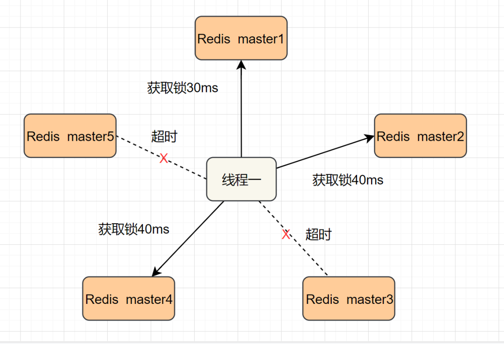

<font style="color:rgb(51, 51, 51);">RedLock的实现步骤:如下</font>

+ <font style="color:rgb(85, 85, 85);">1.获取当前时间，以毫秒为单位。</font>
+ <font style="color:rgb(85, 85, 85);">2.按顺序向5个master节点请求加锁。客户端设置网络连接和响应超时时间，并且超时时间要小于锁的失效时间。（假设锁自动失效时间为10秒，则超时时间一般在5-50毫秒之间,我们就假设超时时间是50ms吧）。如果超时，跳过该master节点，尽快去尝试下一个master节点。</font>
+ <font style="color:rgb(85, 85, 85);">3.客户端使用当前时间减去开始获取锁时间（即步骤1记录的时间），得到获取锁使用的时间。当且仅当超过一半（N/2+1，这里是5/2+1=3个节点）的Redis master节点都获得锁，并且使用的时间小于锁失效时间时，锁才算获取成功。（如上图，10s> 30ms+40ms+50ms+4m0s+50ms）</font>
+ <font style="color:rgb(85, 85, 85);">如果取到了锁，key的真正有效时间就变啦，需要减去获取锁所使用的时间。</font>
+ <font style="color:rgb(85, 85, 85);">如果获取锁失败（没有在至少N/2+1个master实例取到锁，有或者获取锁时间已经超过了有效时间），客户端要在所有的master节点上解锁（即便有些master节点根本就没有加锁成功，也需要解锁，以防止有些漏网之鱼）。</font>

<font style="color:rgb(51, 51, 51);">简化下步骤就是：</font>

+ <font style="color:rgb(51, 51, 51);">按顺序向5个master节点请求加锁</font>
+ <font style="color:rgb(51, 51, 51);">根据设置的超时时间来判断，是不是要跳过该master节点。</font>
+ <font style="color:rgb(51, 51, 51);">如果大于等于3个节点加锁成功，并且使用的时间小于锁的有效期，即可认定加锁成功啦。</font>
+ <font style="color:rgb(51, 51, 51);">如果获取锁失败，解锁！</font>

<font style="color:rgb(51, 51, 51);">Redisson实现了redLock版本的锁，有兴趣的小伙伴，可以去了解一下哈~</font>

# <font style="color:#01B2BC;">Redis大Key是什么东西啊？分分钟拿下</font>
经常在八股文里边看到 Redis 大 Key 问题，那么你知道以下几个问题的答案吗？又或者说是有关注过这几个问题吗？

+ 大Key的定义
+ 大Key引发的问题
+ 大Key产生的原因
+ 如何快速找出大Key
+ 大Key的优化方案

如果不知道也没关系，本文就以最简单的方式给大家讲解以上几个问题。

## 大Key的定义
Redis 没有显示定义大 Key，这是一个通用的术语，用来描述那些在存储和性能方面可能引起问题的键，通常指的是占用大量内存空间的键，可能是大型数据结构，如大型字符串、列表、哈希表或集合。

当然我们可以根据经验总结以下几点：

+ **Key本身的数据量过大**：一个String类型的Key它的值为5MB
+ **Key中的成员数过多**：一个ZSET类型的Key它的成员数量为1W人
+ **Key中成员的数据量过大**：一个Hash类型的Key成员数量虽然只有1K人但这些成员的Value总大小为100MB

## 大Key引发的问题
当Redis中存在大量的大 Key 时，会对性能和内存使用产生负面影响，如下：

+ **内存占用过高**

`大Key占用大量内存空间，可能导致Redis实例内存不足，影响其它键的存储和访问。`

+ **性能下降**

`对于大Key的操作，如读取、写入、删除等，都会消耗更多的CPU时间和内存资源，进一步降低系统性能。`

+ **阻塞其他操作**

`某些对大Key的操作可能会导致Redis实例阻塞。例如，使用DEL命令删除一个大Key时，可能会导致Redis实例在一段时间内无法响应其他客户端请求，从而影响系统的响应时间和吞吐量。`

+ **网络拥塞**

`每次获取大key产生的网络流量较大，可能造成机器或局域网的带宽被打满，同时波及其他服务。例如：一个大key占用空间是1MB，每秒访问1000次，就有1000MB的流量。`

+ **持久化问题**

`对大Key进行持久化可能会导致备份和恢复操作变得困难和耗时。`

+ **数据倾斜**

`在Redis集群中，大Key可能导致数据在节点之间不均匀分布，影响负载均衡和集群性能。`

## 大Key产生的原因
只有了解大 Key 产生的原因，才能从根源解决问题，常见的大key 原因有以下几种：

+ **大型数据结构存储**

`存储大型字符串、列表、哈希表或集合时，如果这些数据结构的大小超过了一定阈值，就会产生大Key。`

+ **缓存滥用**

`将大量数据作为单个键的值进行缓存，而不是按需进行分解或分割，导致某些键变得特别大。`

+ **数据导入**

`从外部数据源导入数据时，如果数据量较大且以单个键存储，可能会导致生成大Key。`

+ **应用设计不佳**

`应用程序设计中未考虑到Redis键的大小限制，或者没有有效地处理大型数据的情况，导致产生大Key。`

+ **数据累积**

`随着时间的推移，某些键可能会不断累积数据，导致其大小超出预期，从而成为大Key。`

## 如何快速找出大Key
要快速找出Redis中的大键，可以通过以下三种方式：

+ **SCAN命令**

通过使用Redis的SCAN命令，我们可以逐步遍历数据库中的所有Key。结合其他命令识别出大Key（如STRLEN、LLEN、SCARD、HLEN等）。

`SCAN命令的优势在于它可以在不阻塞Redis实例的情况下进行遍历。`

+ **bigkeys参数**

使用redis-cli命令客户端，连接Redis服务的时候，加上 —bigkeys 参数，可以扫描每种数据类型数量最大的key。

`redis-cli -h 127.0.0.1 -p 6379 —bigkeys`

+ **Redis RDB Tools工具**

使用开源工具Redis RDB Tools，分析RDB文件，扫描出Redis大key。

例如：输出占用内存大于1kb，排名前3的keys。

`rdb —commond memory —bytes 1024 —largest 3 dump.rbd`

## 大Key的优化方案
既然我们知道了大 key 带来的影响与产生原因

1. **拆分成多个小key：**这是最容易想到的办法，降低单key的大小，读取可以用mget批量读取。
2. **优化数据结构：**使用String类型的时候，使用压缩算法减少value大小。或者是使用Hash类型存储，因为Hash类型底层使用了压缩列表数据结构。
3. **设置合理的过期时间：**为每个key设置过期时间，并设置合理的过期时间，以便在数据失效后自动清理，避免长时间累积的大Key问题。
4. **启用内存淘汰策略：**启用Redis的内存淘汰策略，例如LRU（Least Recently Used，最近最少使用），以便在内存不足时自动淘汰最近最少使用的数据，防止大Key长时间占用内存。
5. **数据分片：**例如使用Redis Cluster将数据分散到多个Redis实例，以减轻单个实例的负担，降低大Key问题的风险。
6. **删除大key：**使用UNLINK命令删除大key，UNLINK命令是DEL命令的异步版本，它可以在后台删除Key，避免阻塞Redis实例。
7. **增加内存容量：**如果经过以上优化仍无法解决大Key导致的内存问题，可以考虑增加Redis实例的内存容量，提升整体性能和稳定性。

## 总结
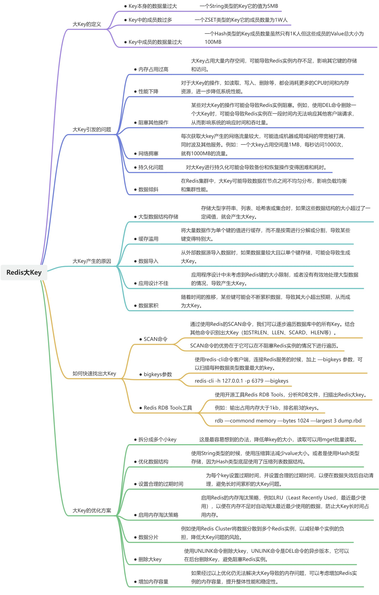

# <font style="color:#01B2BC;">Redis到底支不支持事务啊？</font>
先说答案：**redis 是支持事务的，****<font style="color:rgb(6, 6, 7);">但是它与传统的关系型数据库中的事务是有所不同的</font>**<font style="color:rgb(6, 6, 7);">。</font>

## 概述：
**概念：** 可以一次执行多个命令，本质是一组命令的集合。一个事务中的所有命令都会序列化，按顺序地串行化执行而不会被其它命令插入，不许加塞。

**常用命令：**

+ **multi：**开启一个事务，multi 执行之后，客户端可以继续向服务器发送任意多条命令，这些命令不会立即被执行，而是被放到一个队列中。
+ **exec：**执行队列中所有的命令
+ **discard：**中断当前事务，然后清空事务队列并放弃执行事务
+ **watch key1 key2 ...	**：监视一个(或多个) key ，如果在事务执行之前这个(或这些) key 被其他命令所改动，那么事务将被打断。

## 使用：
### 正常执行：
##### 
### 主动放弃事务：
使用 discard 主动中断 multi 操作，然后清空并放弃执行当前事务。


### 全部回滚：
开启 multi 之后，命令语法导致执行错误，会放弃当前所有队列中的命令。

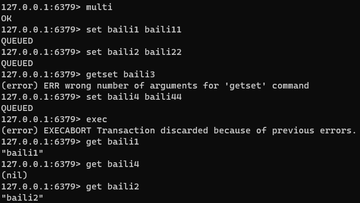

### 部分支持事务：
开启 multi 之后，命令逻辑执行错误，会主动忽略报错语句，继续执行后续命令。


### WATCH：
<font style="color:rgb(6, 6, 7);">Redis 的 watch 命令是一种乐观锁的实现方式。余额修改示例：</font>

#### 正常情况：


#### 并发修改情况：
#### 
在 <font style="color:rgb(6, 6, 7);">watch</font> 监控后，有人修改了balance，会导致事务会被打断，必须更新最新值，才能成功执行事务，类似于乐观锁的版本号机制。

### 事务三阶段：
1、开启：以 multi 开始一个事务

2、入队：将多个命令入队到事务中，接到这些命令并不会立即执行，而是放到等待执行的事务队列里面

3、执行：由 exec 命令触发事务

## 小结：
<font style="color:rgb(6, 6, 7);">Redis 事务区别于关系型数据库在于：</font>

1. **<font style="color:rgb(6, 6, 7);">原子性</font>**<font style="color:rgb(6, 6, 7);">：Redis 事务保证的是队列中的命令作为一个整体要么全部执行，要么全部不执行。但是，如果事务中的某个命令因为执行错误而失败，Redis 会继续执行事务中的其他命令，而不是回滚整个事务。</font>
2. **<font style="color:rgb(6, 6, 7);">无隔离级别</font>**<font style="color:rgb(6, 6, 7);">：Redis 事务中的命令在提交前不会被实际执行，因此不存在传统数据库中的事务隔离级别问题，如脏读、不可重复读或幻读。</font>
3. **<font style="color:rgb(6, 6, 7);">命令队列</font>**<font style="color:rgb(6, 6, 7);">：当客户端发送 multi 命令后，所有随后的命令都会被放入一个队列中，而不是立即执行。当 exec 命令被发送时，Redis 会尝试执行队列中的所有命令。</font>
4. **<font style="color:rgb(6, 6, 7);">乐观锁</font>**<font style="color:rgb(6, 6, 7);">：Redis 使用 watch 命令来实现乐观锁机制。客户端可以监控一个或多个键，如果在执行 exec 之前这些键的值被其他客户端改变，事务将不会执行。</font>
5. **<font style="color:rgb(6, 6, 7);">自动放弃</font>**<font style="color:rgb(6, 6, 7);">：如果事务因为监控键被修改而不能执行，exec 命令将放弃当前队列命令，返回 </font>null。
6. **<font style="color:rgb(6, 6, 7);">discard 命令</font>**<font style="color:rgb(6, 6, 7);">：如果客户端在发送 multi 之后决定放弃事务，可以使用 discard 命令来清空事务队列并退出事务状态。</font>
7. **<font style="color:rgb(6, 6, 7);">有限的回滚</font>**<font style="color:rgb(6, 6, 7);">：Redis 事务不支持命令级别的回滚。如果事务中的某个命令失败，Redis 会停止执行后续命令，而不是回滚到事务开始前的状态。</font>

# <font style="color:#01B2BC;">Redis相比memcached有哪些优势？</font>
这是一道非常常见的面试题，也是大家在工作中很容易忽略掉的点，大部分场景下redis确实更适合用于我们项目，但是我们可能答不上来它们都作为键值对数据库其中的区别是什么。

从数据结构侧来说，memcached仅支持value为string类型，而我们redis支持的类型是相当丰富的，有string、hash、list、set、sort set等等，所以在功能上redis是比我们memcached支持的更好的。还有就是memcached的单value值容量只有1M，而我们的redis则最大支持至512M。

从数据持久化来说，memcached只做缓存，没有可靠性的需求，所以是不支持的，只要断电或者服务关闭之后那么就会丢失内存中的数据，而redis更倾向于内存数据库，如果我们有持久化需求的话可以优先考虑redis。

同时我们的redis还支持lua脚本，脚本提交是原子执行的，我们在面对复杂业务场景中，需要保证按照我们所需的顺序一步步执行就可以通过我们的lua脚本来解决。

# <font style="color:#01B2BC;">Redis真的是单线程吗？</font>
所谓的redis单线程其实指的是在网络IO和键值对读写时是通过一个线程完成的。而其他的一些模块比如说持久化存储、集群支撑模块这些都是多线程的。

那为什么网络操作模块和数据存储模块不用多线程呢？

其实非常简单，首先网络IO模块的性能瓶颈就不在CPU上，而是要提升我们的IO利用率，虽然使用多线程能带来一些提升，但是多线程也是存在一定的弊端的，首先是多线程模型下的共享资源和并发控制非常复杂，线程的上线文切换也会带来一定的性能损耗，所以Redis在这块采用的是IO多路复用。

另一方面，Redis的绝大部分操作都是在内存中完成的，内存操作本来就比硬盘读写快了百倍以上，并且在数据结构上也进行了大量的优化，比如hash表和跳表。而使用单线程还能避免多线程下的锁竞争，省去了线程的时间和性能开销也不会存在锁竞争的问题。

# <font style="color:#01B2BC;">Redis6为何引入多线程？</font>
redis6中引入的多线程是正对于网络IO模块进行了多线程改造，因为多路复用的IO模型本质上来说还是同步阻塞型IO模型，在调用epoll的过程是阻塞的，并发量极高的场景就成为了性能瓶颈，那么在碰到这类问题上，就可以通过多线程来解决。它通过多线程解决了网络IO等待造成的影响，还可以充分利用CPU的多核优势。对于我们读写模块依旧还是采用的单线程模型，避免了多线程环境下并发访问带来的很多问题。在简单的get/set命令性能上多线程IO模型提升了有接近一倍。

# <font style="color:#01B2BC;">Redis是如何解决Hash冲突的？</font>
redis是通过我们的链式hash来解决我们的hash冲突问题，<font style="color:rgb(77, 77, 77);">哈希算法产生的哈希值的长度是固定并且是有限的，比如说我们通过MD5算法生成32位的散列值，那么它能生成出来的长度则是有限的，我们的数据如果大于32位是不是就可能存在不同数据生成同一个散列值，那么redis通过链式hash，以不扩容的前提下把有相同值的数据链接起来，但是如果链表变得很长就会导致性能下降，那么redis就采用了rehash的机制来解决，类似于hashmap里面的扩容机制，但是redis中的rehash并不是一次把hash表中的数据映射到另外一张表，而是通过了一种渐进式的方式来处理，将rehash分散到多次请求过程中，避免阻塞耗时。</font>

# <font style="color:#01B2BC;">MySQL里有2000w数据Redis中只存20w的数据，如何保证 redis 中的数据都是热点数据？</font>
首先我们可以看到Redis的空间时间上比我们MySQL少的多，那么Redis如何能够筛选出热点数据，这道题主要考察的是Redis的数据淘汰策略（这里有个误区，很多人容易混淆把数据淘汰策略当做数据过期策略），在Redis 4.0之后是为我们提供了8种淘汰策略，4.0之前则是提供的6种，主要是新增了LFU算法。其实说说是有8种，但是真正意义上是5种，针对random、lru、lfu是提供了两种不同数据范围的策略，一种是针对设置了过期时间的，一种是没有设置过期时间的。具体的五种策略分别为：

1. noeviction 选择这种策略则代表不进行数据淘汰，同时它也是redis中默认的淘汰策略，当缓存写满时redis就不再提供写服务了，写请求则直接返回失败。
2. random 随机策略这块则是分为两种，一种是volatile，这种是设置了过期时间得数据集，而另外一种是allkeys，这种是包含了所有的数据，当我们缓存满了的时候，选用这种策略就会在我们的数据集中进行随机删除。
3. volatile-ttl 这种策略是针对设置了过期时间的数据，并且按照过期时间的先后顺序进行删除，越早过期的越先被删除
4. lru 这里的lru策略和我们上面random策略一样也是提供了两种数据集进行处理，LRU算法全程为<font style="color:rgb(77, 77, 77);">（最近最少使用）简单一句话来概括就是“如果数据最近被访问过，那么将来被访问的几率也就越高”。这种算法其实已经比较符合我们的实际业务需求了，但是还是存在一些缺陷。</font>
5. <font style="color:rgb(77, 77, 77);">lfu 最后一种策略就是我们的LFU算法，它是在我么LRU算法基础上增加了请求数统计，这样能够更加精准的代表我们的热点数据。</font>

我们再回看我们的这个问题，我们能很清楚的知道，我们需要的策略是LFU算法。选择volatile还是allkeys就要根据具体的业务需求了。

# <font style="color:#01B2BC;">高并发场景下我们如何保证幂等性？</font>
首先普及下幂等的概念“<font style="color:rgb(89, 89, 89);">在计算机中编程中，一个幂等操作的特点是其任意多次执行所产生的影响均与一次执行的影响相同。</font>”

那么在我们的实际业务场景中幂等是一个非常高频的场景，比如：

+ 电商场景中用户因网络问题多次点击导致重复下单问题
+ MQ消息队列的重复消费
+ RPC中的超时重试机制
+ 等等

那么我们有那些方案可以解决我们的幂等性问题呢？

+ 数据库唯一主键实现幂等性<font style="color:#E8323C;"></font>
    - 其实现方式是使用分布式ID充当主键，不使用MySQL中的自增主键
+ 乐观锁实现幂等性
    - 在表中增加版本号标识，只有版本号标识一直才更新成功
+ 分布式锁
    - 简单来说就是分布式的排他锁，但是我们可以控制锁的粒度以提高程序的执行性能
+ 获取token
    1. 服务端提供获取 Token 的接口，请求前客户端调用接口获取 Token
    2. 然后将该串存入 Redis 数据库中，以该 Token 作为 Redis 的键（注意设置过期时间）。
    3. 将 Token 返回到客户端，在执行业务请求带上该 Token
    4. 服务端接收到请求后根据 Token 到 Redis 中查找该 key 是否存在（注意原子性），
    5. 如果存在就将该 key 删除，然后正常执行业务逻辑。如果不存在就抛异常，返回重复提交的错误信息。

# <font style="color:#01B2BC;">Redis 事务支持 ACID 么？</font>
**<font style="color:rgb(51, 51, 51);">原子性(Atomicity)：</font>**<font style="color:rgb(51, 51, 51);">一个事务的多个操作必须完成，或者都不完成。</font>

**<font style="color:rgb(51, 51, 51);">一致性(Consistency)：</font>**<font style="color:rgb(51, 51, 51);">事务执行结束后，数据库的完整性约束没有被破坏，事务执行的前后顺序都是合法数据状态。</font>

**<font style="color:rgb(51, 51, 51);">隔离性(Isolation)：</font>**<font style="color:rgb(51, 51, 51);">事务内部的操作与其他事务是隔离的，并发执行的各个事务之间不能互相干扰。</font>

**<font style="color:rgb(51, 51, 51);">持久性(Durability)：</font>**<font style="color:rgb(51, 51, 51);">事务一旦提交，所有的修改将永久的保存到数据库中，即使系统崩溃重启后数据也不会丢失。</font>

<font style="color:rgb(33, 37, 41);">redis事务功能是通过MULTI、EXEC、DISCARD和WATCH 四个原语实现的</font>

<font style="color:rgb(33, 37, 41);">Redis会将一个事务中的所有命令序列化，然后按顺序执行。</font>

单独的隔离操作

+ 事务中的所有命令都会序列化、按顺序地执行。事务在执行的过程中，不会被其他客户端发送来的命令请求所打断。

没有隔离级别的概念

+ 队列中的命令没有提交之前都不会实际被执行，因为事务提交前任何指令都不会被实际执行

不保证原子性

+ 事务中如果有一条命令执行失败，其后的命令仍然会被执行，没有回滚

<font style="color:rgb(33, 37, 41);">注：redis的discard只是结束本次事务,正确命令造成的影响仍然存在.</font>

<font style="color:rgb(33, 37, 41);">1）MULTI命令用于开启一个事务，它总是返回OK。MULTI执行之后，客户端可以继续向服务器发送任意多条命令，这些命令不会立即被执行，而是被放到一个队列中，当EXEC命令被调用时，所有队列中的命令才会被执行。</font>

<font style="color:rgb(33, 37, 41);">2）EXEC：执行所有事务块内的命令。返回事务块内所有命令的返回值，按命令执行的先后顺序排列。当操作被打断时，返回空值 nil 。</font>

<font style="color:rgb(33, 37, 41);">3）通过调用DISCARD，客户端可以清空事务队列，并放弃执行事务， 并且客户端会从事务状态中退出。</font>

<font style="color:rgb(33, 37, 41);">4）WATCH 命令可以为 Redis 事务提供 check-and-set （CAS）行为。可以监控一个或多个键，一旦其中有一个键被修改（或删除），之后的事务就不会执行，监控一直持续到EXEC命令。</font>


> 原文: <https://www.yuque.com/tulingzhouyu/db22bv/du5hpy6podycogxo>