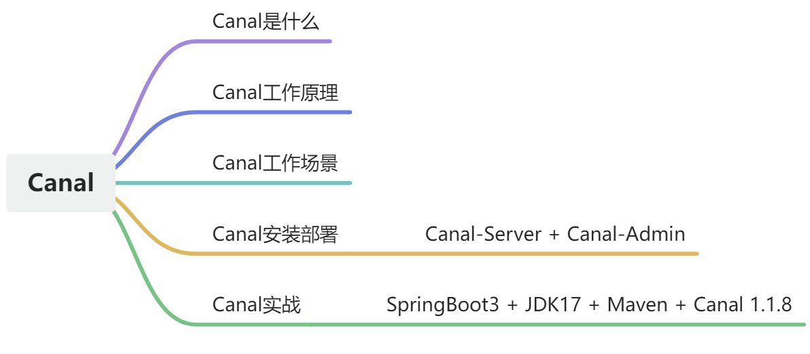
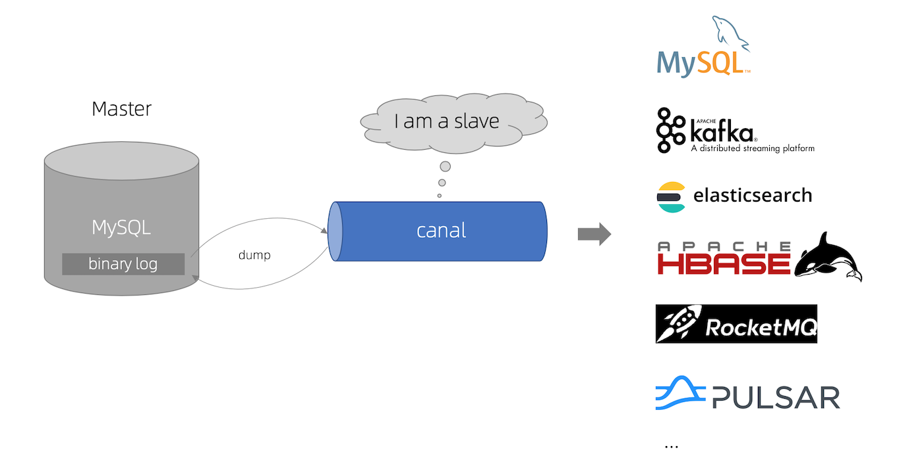
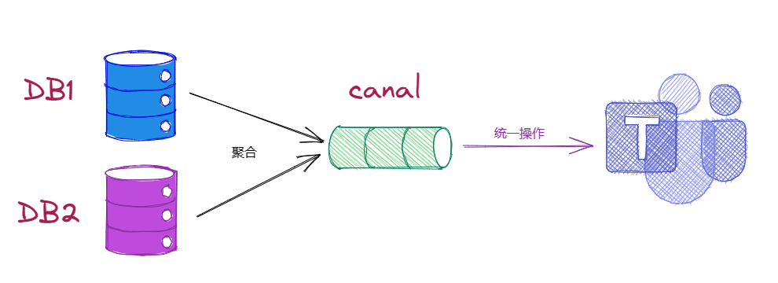
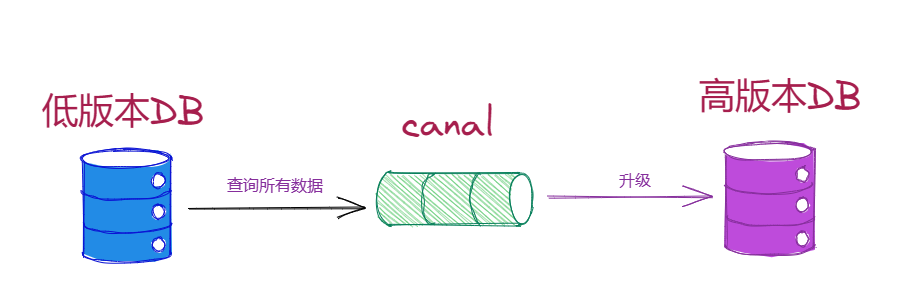
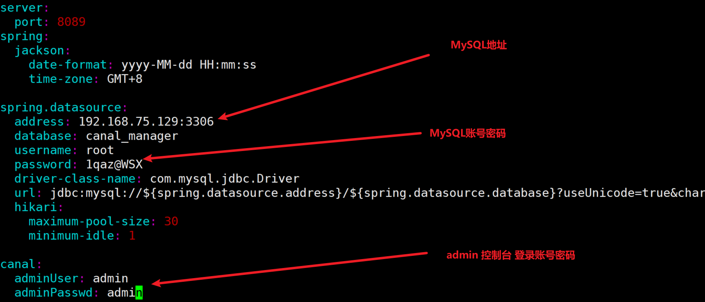
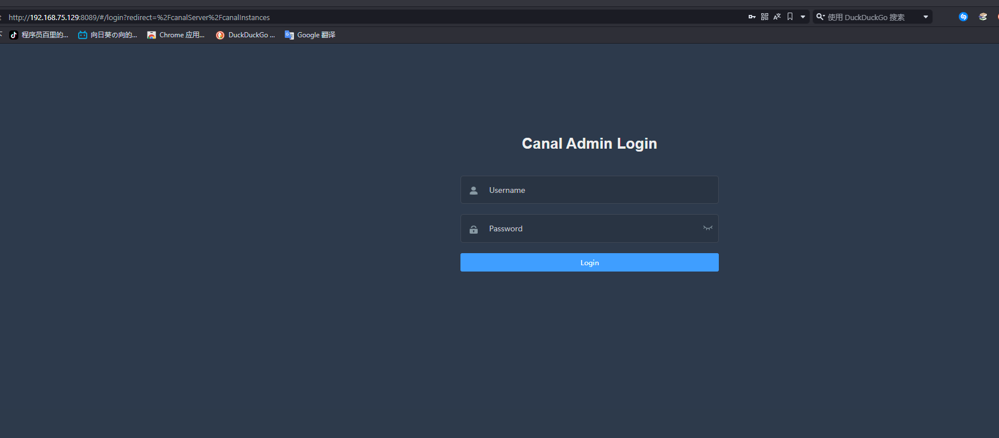
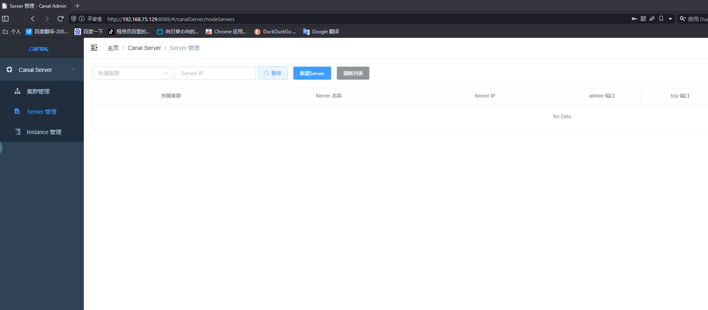
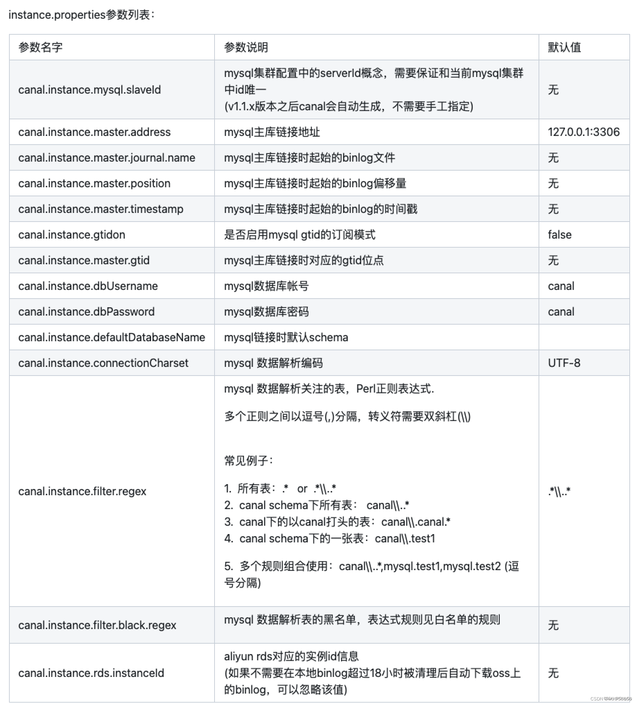
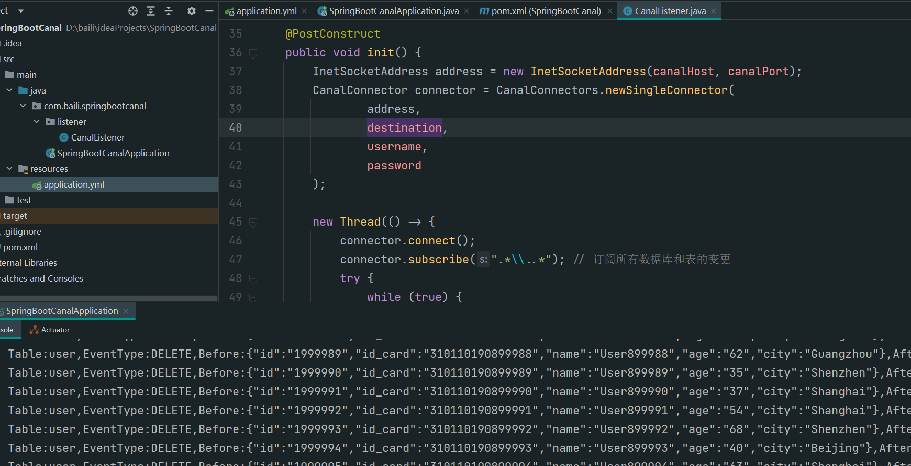

# 👍 一小时快速入门数据同步神器-Canal

# <font style="color:rgb(0, 0, 0);">前言</font>
<font style="color:rgb(36, 41, 46);">之前在讲解 Redis、MySQL 双写一致性问题的时候，提到我们可以采用 canal 组件，来</font><font style="color:rgb(38, 38, 38);">实现数据一致性，那本文就带大家快速上手 canal 组件的使用。</font>

<font style="color:rgb(38, 38, 38);">本文主要是从五个维度带大家快速上手 canal 组件。</font>



# <font style="color:rgb(0, 0, 0);">一、Canal是什么</font>
基友网地址：[https://github.com/alibaba/canal](https://github.com/alibaba/canal)

<font style="color:rgb(36, 41, 46);">官网的介绍</font>

:::tips
Canal，译意为水道/管道/沟渠，主要用途是基于 MySQL 数据库增量日志解析，提供增量数据订阅和消费。

:::

<font style="color:rgb(36, 41, 46);">这句介绍有几个关键字：</font>**<font style="color:rgb(36, 41, 46);">增量日志，增量数据订阅和消费</font>**<font style="color:rgb(36, 41, 46);">。</font>

<font style="color:rgb(36, 41, 46);">这里我们可以简单地把canal理解为一个用来</font>**<font style="color:rgb(36, 41, 46);">同步增量数据的一个工具</font>**<font style="color:rgb(36, 41, 46);">。</font>

<font style="color:rgb(36, 41, 46);">接下来我们看一张官网提供的示意图：</font>




# <font style="color:rgb(36, 41, 46);">二、Canal 工作原理</font>
在了解 Canal 工作原理之前，大家需要先对 MySQL 的主从复制原理有所了解，因为 Canal 就是借助 MySQL 的主从机制来工作滴。

## <font style="color:rgb(36, 41, 46);">MySQL主从复制原理</font>


+ <font style="color:rgb(36, 41, 46);">MySQL master 将数据变更写入二进制日志binary log，简称Binlog。</font>
+ <font style="color:rgb(36, 41, 46);">MySQL slave 将 master 的 binary log 拷贝到它的中继日志(relay log)</font>
+ <font style="color:rgb(36, 41, 46);">MySQL slave 重放 relay log 操作，将变更数据同步到最新。</font>

## Canal 工作原理


+ Canal 将自己伪装为 MySQL slave(从库) ，向 MySQL master (主库) 发送dump 协议
+ MySQL master (主库) 收到 dump 请求，开始推送 binary log 给 canal
+ Canal 接收并解析 Binlog 日志，得到变更数据，**<font style="color:rgb(36, 41, 46);">再发送到存储目的地</font>**<font style="color:rgb(36, 41, 46);">，比如MySQL，Kafka，Elastic Search等等</font>

## <font style="color:rgb(36, 41, 46);">MySQL Binlog日志</font>
<font style="color:rgb(36, 41, 46);">MySQL 的Binlog可以说 MySQL 最重要的日志，它记录了所有的 DDL 和 DML语句，以事件形式记录。</font>

<font style="color:rgb(36, 41, 46);">MySQL默认情况下是不开启Binlog，因为记录Binlog日志需要消耗时间，官方给出的数据是有1%的性能损耗。</font>

<font style="color:rgb(36, 41, 46);">具体开不开启，开发中需要根据实际情况做取舍。</font>

<font style="color:rgb(36, 41, 46);">一般来说，在下面两场景下会开启Binlog日志: </font>

+ <font style="color:rgb(36, 41, 46);">MySQL 主从集群部署时，需要将在 Master 端开启 Binlog，方便将数据同步到Slaves中。</font>
+ <font style="color:rgb(36, 41, 46);">数据恢复了，通过使用 MySQL Binlog 工具来使恢复数据。</font>

### <font style="color:rgb(36, 41, 46);">Binlog的分类</font>
<font style="color:rgb(36, 41, 46);">MySQL Binlog 的格式有三种，分别是 STATEMENT,MIXED,ROW。在配置文件中可以选择配</font>

<font style="color:rgb(36, 41, 46);">置 binlog_format= </font>**statement**<font style="color:rgb(36, 41, 46);">|</font>**mixed**<font style="color:rgb(36, 41, 46);">|</font>**row**<font style="color:rgb(36, 41, 46);">。</font>

| <font style="color:rgb(36, 41, 46);">分类</font> | <font style="color:rgb(36, 41, 46);">介绍</font> | <font style="color:rgb(36, 41, 46);">优点</font> | <font style="color:rgb(36, 41, 46);">缺点</font> |
| :---: | :--- | :---: | :---: |
| <font style="color:rgb(36, 41, 46);">STATEMENT</font> | <font style="color:rgb(36, 41, 46);">语句级别，记录每一次执行写操作的语句，相对于ROW模式节省了空间，但是可能产生数据不一致如update tt set create_date=now()，由于执行时间不同产生饿得数据就不同</font> | <font style="color:rgb(36, 41, 46);">节省空间</font> | <font style="color:rgb(36, 41, 46);">可能造成数据不一致</font> |
| <font style="color:rgb(36, 41, 46);">ROW</font> | <font style="color:rgb(36, 41, 46);">行级，记录每次操作后每行记录的变化。假如一个update的sql执行结果是1万行statement只存一条，如果是row的话会把这个1万行的结果存着。</font> | <font style="color:rgb(36, 41, 46);">保持数据的绝对一致性。因为不管sql是什么，引用了什么函数，他只记录执行后的效果</font> | <font style="color:rgb(36, 41, 46);">占用较大空间</font> |
| <font style="color:rgb(36, 41, 46);">MIXED</font> | <font style="color:rgb(36, 41, 46);">是对statement的升级，如当函数中包含 UUID() 时，包含 AUTO_INCREMENT 字段的表被更新时，执行 INSERT DELAYED 语句时，用 UDF 时，会按照 ROW的方式进行处理</font> | <font style="color:rgb(36, 41, 46);">节省空间，同时兼顾了一定的一致性</font> | <font style="color:rgb(36, 41, 46);">还有些极个别情况依旧会造成不一致，另外statement和mixed对于需要对binlog的监控的情况都不方便</font> |


**综合上面对比，Canal 想做监控分析，选择 row 格式比较合适。**

# <font style="color:rgb(0, 0, 0);">三、Canal 运用场景</font>
## 数据同步
<font style="color:rgb(51, 51, 51);">Canal 可以帮助用户进行多种数据同步操作，如实时同步 MySQL 数据到 Elasticsearch、Redis 等数据存储介质中。</font>


## <font style="color:rgb(51, 51, 51);">数据库实时监控</font>
<font style="color:rgb(51, 51, 51);">Canal 可以实时监控 MySQL 的更新操作，对于敏感数据的修改可以及时通知相关人员。</font>


## <font style="color:rgb(51, 51, 51);">数据分析和挖掘</font>
<font style="color:rgb(51, 51, 51);">Canal 可以将 MySQL 增量数据投递到 Kafka 等消息队列中，为数据分析和挖掘提供数据来源。</font>

<font style="color:rgb(51, 51, 51);"></font>

## <font style="color:rgb(51, 51, 51);">数据库备份</font>
<font style="color:rgb(51, 51, 51);">Canal 可以将 MySQL 主库上的数据增量日志复制到备库上，实现数据库备份。</font>


## <font style="color:rgb(51, 51, 51);">数据集成</font>
<font style="color:rgb(51, 51, 51);">Canal 可以将多个 MySQL 数据库中的数据进行集成，为数据处理提供更加高效可靠的解决方案。</font>



## <font style="color:rgb(51, 51, 51);">数据库迁移</font>
<font style="color:rgb(51, 51, 51);">Canal 可以协助完成 MySQL 数据库的版本升级及数据迁移任务。</font>



# <font style="color:rgb(0, 0, 0);">四、Canal安装部署</font>
## <font style="color:rgb(24, 24, 24) !important;">MySQL 配置</font>
首先我们需要一个 MySQL 的服务，如果没有 MySQL 服务，可以看下这个教程[入门+安装+面试题](https://www.yuque.com/tulingzhouyu/db22bv/bkgyx9eokguvv3tm?singleDoc# 《一小时快速入门MySQL》 密码：yk3o)

<font style="color:rgb(36, 41, 46);">当前的 canal 支持 MySQL 版本包括 5.1.x , 5.5.x , 5.6.x , 5.7.x , 8.0.x</font>

<font style="color:rgb(36, 41, 46);">我当前 Linux服务器安装的MySQL服务器是 8.x 版本。</font>

### <font style="color:rgb(36, 41, 46);">MySQL 服务器配置文件处理</font>
#### 检查配置是否正常
有了 MySQL 服务之后，大家可以执行下面的 SQL 查看 MySQL 的配置是否正常。

```plsql
-- 查看是否开启bin_log = ON
SHOW VARIABLES LIKE 'log_bin';
-- 查看bin_log日志文件
SHOW BINARY LOGS;
-- 查看bin_log写入状态
SHOW MASTER STATUS;
-- 查看bin_log存储格式 = row
SHOW VARIABLES LIKE 'binlog_format';
-- 查看数据库服务id = 1
SHOW VARIABLES LIKE 'server_id';
```

#### 配置不正常
##### 修改启动配置加载项
如果说没有上面的配置，与预期不符，大家需要修改配置文件 my.cnf（Linux）或者 my.ini（windows）

同时需要注意，Linux 环境下，需要检查服务是否加载了 my.cnf，如果没有需要修改启动加载配置文件。

<font style="color:rgb(36, 41, 46);">我们可以通过查看 MySQL 的状态获取到配置文件</font>

```powershell
systemctl status mysqld.service
```


找到之后我们看下当前启动时加载那个配置文件

```powershell
cat /usr/lib/systemd/system/mysqld.service
```


修改配置文件为 my.cnf，一般来说 my.cnf 会自动生成，我们可以直接根目录搜索，或者自己创建一个

```powershell
find -type f -name 'my.cnf'
```


找到之后将 /etc/my.cnf 路径配置到 environmentFile 属性上

```powershell
vim /usr/lib/systemd/system/mysqld.service
```


##### 修改 my.cnf 配置文件
```powershell
vim /etc/my.cnf
```

```powershell
log-bin=mysql-bin # 开启 binlog
binlog-format=ROW # 选择 ROW 模式
server_id=1 # 配置 MySQL replaction 需要定义，不要和 canal 的 slaveId 重复
```


配置完成之后，重启 MySQL 服务

```powershell
systemctl restart mysqld.service
```

<font style="color:rgb(36, 41, 46);">使用命令查看是否打开binlog模式：</font>


<font style="color:rgb(36, 41, 46);">查看binlog日志文件列表：</font>


<font style="color:rgb(36, 41, 46);">查看当前正在写入的binlog文件：</font>

<font style="color:rgb(36, 41, 46);">MySQL服务器这边基本上就搞定了，很简单。</font>

<font style="color:rgb(36, 41, 46);">如果说大家想用单独的账号给 Canal，单独创建一个用户并授权就可以了：</font>

```plsql
-- 使用命令登录：mysql -u root -p
-- 创建用户 用户名：canal 密码：Canal@123456
create user 'canal'@'%' identified by 'Canal@123456';
-- 授权 *.*表示所有库
grant SELECT, REPLICATION SLAVE, REPLICATION CLIENT on *.* to 'canal'@'%' identified by 'Canal@123456';
```

### MySQL 数据配置
创建测试库、表

```plsql
CREATE DATABASE test;

DROP TABLE test;

CREATE TABLE `test` (
  `id` INT(10) NOT NULL AUTO_INCREMENT,
  `full_name` VARCHAR(50) NULL DEFAULT NULL COLLATE 'utf8mb4_0900_ai_ci',
  `age` SMALLINT(5) NULL DEFAULT '18',
  PRIMARY KEY (`id`) USING BTREE
) COLLATE='utf8mb4_0900_ai_ci' ENGINE=InnoDB AUTO_INCREMENT=1;
```

准备好相应的测试数据

```plsql
INSERT IGNORE INTO `test` (`id`, `full_name`, `age`) VALUES (1, 'Alice Johnson', 40);
INSERT IGNORE INTO `test` (`id`, `full_name`, `age`) VALUES (2, 'John Doe', 30);
INSERT IGNORE INTO `test` (`id`, `full_name`, `age`) VALUES (3, 'Jane Smith', 25);
INSERT IGNORE INTO `test` (`id`, `full_name`, `age`) VALUES (4, 'Michael Johnson', 35);
INSERT IGNORE INTO `test` (`id`, `full_name`, `age`) VALUES (5, 'Emily Johnson', 28);
INSERT IGNORE INTO `test` (`id`, `full_name`, `age`) VALUES (6, 'David Lee', 35);
INSERT IGNORE INTO `test` (`id`, `full_name`, `age`) VALUES (7, 'Sophia Brown', 32);
INSERT IGNORE INTO `test` (`id`, `full_name`, `age`) VALUES (8, 'William Taylor', 35);
INSERT IGNORE INTO `test` (`id`, `full_name`, `age`) VALUES (9, 'Sophia Brown', 32);
INSERT IGNORE INTO `test` (`id`, `full_name`, `age`) VALUES (10, 'Sophia Brown', 32);
INSERT IGNORE INTO `test` (`id`, `full_name`, `age`) VALUES (11, 'Sophia Brown', 32);
INSERT IGNORE INTO `test` (`id`, `full_name`, `age`) VALUES (12, 'Sophia Brown', 32);
INSERT IGNORE INTO `test` (`id`, `full_name`, `age`) VALUES (13, 'William Taylor', 40);
INSERT IGNORE INTO `test` (`id`, `full_name`, `age`) VALUES (14, 'Olivia Wilson', 27);
INSERT IGNORE INTO `test` (`id`, `full_name`, `age`) VALUES (15, 'Michael Johnson', 32);
INSERT IGNORE INTO `test` (`id`, `full_name`, `age`) VALUES (16, 'Sophia Garcia', 25);
INSERT IGNORE INTO `test` (`id`, `full_name`, `age`) VALUES (17, 'Ethan Martinez', 38);
INSERT IGNORE INTO `test` (`id`, `full_name`, `age`) VALUES (18, 'Olivia Wilson', 27);

DELETE FROM test WHERE id = 1;
```

## <font style="color:rgb(24, 24, 24) !important;">安装 Canal</font>
<font style="color:rgb(36, 41, 46);">去官网下载页面进行下载：</font>[https://github.com/alibaba/canal/releases](https://github.com/alibaba/canal/releases)

<font style="color:rgb(36, 41, 46);">我这里下载的是1.1.8-alpha 版本（测试 1.1.8-alpha-2 有点问题）：</font>


上传文件到服务器，然后解压，先处理 deployer 包，**注意文件目录**

```plsql
# 创建应用目录
mkdir -p /opt/software/canal/canal-dev
mkdir -p /opt/software/canal/canal-admin
# 上传
rz  
# 解压
tar -zxvf canal.deployer-1.1.8-SNAPSHOT.tar.gz
# 删除无用的包
rm -rf canal.deployer-1.1.8-SNAPSHOT.tar.gz
```

<font style="color:rgb(36, 41, 46);">解压</font>**<font style="color:rgb(36, 41, 46);">canal.deployer-1.1.8.tar.gz</font>**<font style="color:rgb(36, 41, 46);">，我们可以看到里面有四个文件夹：</font>


<font style="color:rgb(36, 41, 46);">将 admin 包做同样的处理</font>

```plsql
# 上传
rz  
# 解压
tar -zxvf canal.deployer-1.1.8-SNAPSHOT.tar.gz
# 删除无用的包
rm -rf canal.admin-1.1.8-SNAPSHOT.tar.gz 
```


由于我们采用的 admin 来管理 Canal，因此我们只需要将 Canal 服务注册到 admin，然后通过 admin 来创建 instance 同步 MySQL 的变更。

### Canal-admin 服务
```plsql
# 切换到admin目录
cd /opt/software/canal/canal-admin

# 修改 application 配置文件
ll conf/
vim conf/application.yml
```

```yaml
server:
  port: 8089
spring:
  jackson:
    date-format: yyyy-MM-dd HH:mm:ss
    time-zone: GMT+8

spring.datasource:
  # mysql相关配置
  address: 192.168.75.129:3306
  database: canal_manager
  username: root
  password: 1qaz@WSX
  driver-class-name: com.mysql.jdbc.Driver
  url: jdbc:mysql://${spring.datasource.address}/${spring.datasource.database}?useUnicode=true&characterEncoding=UTF-8&useSSL=false
  hikari:
    maximum-pool-size: 30
    minimum-idle: 1

canal:
  adminUser: admin
  adminPasswd: admin

```




在启动 admin 服务之前，我们需要将 conf 目录下 SQL 文件，在数据库执行，因为 admin 管理 Canal 是将配置数据存到了数据库中，所以需要相应的库与表，Canal 已经准备好了


万事俱备，现在启动 admin 服务，使用 bin 目录下 startup.sh

```plsql
./startup.sh
```


访问服务地址+端口 8089，账号密码 admin/123456，（数据库中 canal_user 表配置了相关的账号信息）





### Canal-deployer 服务
接下来完成 deployer 的配置，然后注册到 admin

```plsql
# 切换目录
cd /opt/software/canal/canal-dev
# 查看conf配置
ll conf
# 修改配置，需要注意，canal.properties配置很多，有些我们初期使用不到，这里就采用local配置
vim conf/canal_local.properties
```

```properties
# register ip 本机地址
canal.register.ip = 192.168.75.129

# canal admin config 运行canal-admin地址
canal.admin.manager = 192.168.75.129:8089
canal.admin.port = 11110
canal.admin.user = admin
canal.admin.passwd = 4ACFE3202A5FF5CF467898FC58AAB1D615029441
# admin auto register 开启自动注册到canal-admin
canal.admin.register.auto = true
# 注册集群名称，如果不填写则为单机节点
canal.admin.register.cluster =
# 节点名称
canal.admin.register.name = 999
```


启动 canal-deployer 服务，再来查看 admin 页面，出现 deployer 服务，启动正常

```plsql
# 启动 deployer服务，注意目录。
./bin/startup.sh local
```


### Canal-Instance 服务
**<font style="color:#DF2A3F;">如果创建 Instance 后启动失败，需要手动导入 druid Jar 包</font>**

直接在 admin 页面创建 Instance 服务。


到这里 Canal 服务端的所有配置修改完成，接下来我们将 java 客户端搭起来，就可以获取到 MySQL 的变更数据了。

```properties
## mysql serverId , v1.0.26+ will autoGen
## v1.0.26版本后会自动生成slaveId，所以可以不用配置
# canal.instance.mysql.slaveId=0

# 数据库地址
canal.instance.master.address=192.168.75.129:3306
# binlog日志名称
canal.instance.master.journal.name=
# mysql主库链接时起始的binlog偏移量
canal.instance.master.position=
# mysql主库链接时起始的binlog的时间戳
canal.instance.master.timestamp=
canal.instance.master.gtid=

# username/password
# 在MySQL服务器授权的账号密码
canal.instance.dbUsername=root
canal.instance.dbPassword=1qaz@WSX
# 字符集
canal.instance.connectionCharset = UTF-8
# enable druid Decrypt database password
canal.instance.enableDruid=false

# table regex .*\\..*表示监听所有表 也可以写具体的表名，用，隔开
canal.instance.filter.regex=.*\\..*
# mysql 数据解析表的黑名单，多个表用，隔开
canal.instance.filter.black.regex=
```



# <font style="color:rgb(0, 0, 0);">五、Canal 实战</font>
环境：SpringBoot3 + JDK17 + Maven + Canal 1.1.8

快速创建一个 SpringBoot 项目

## 导入依赖
```xml
<dependency>
  <groupId>com.alibaba.otter</groupId>
  <artifactId>canal.client</artifactId>
  <version>1.1.7</version>
</dependency>

<dependency>
    <groupId>com.alibaba.otter</groupId>
    <artifactId>canal.protocol</artifactId>
    <version>1.1.7</version>
</dependency>

<dependency>
    <groupId>com.alibaba</groupId>
    <artifactId>fastjson</artifactId>
    <version>2.0.0</version>
</dependency>
```

## 修改 application 配置
```yaml
spring:
  application:
    name: springboot3.0
  datasource:
    driver-class-name: com.mysql.cj.jdbc.Driver
    url: jdbc:mysql://192.168.75.129:3306/test?useUnicode=true&characterEncoding=utf-8&serverTimezone=UTC&useSSL=false
    username: root    # 数据库账号
    password: 1qaz@WSX   # 数据库密码
canal:
  server:
    host: 192.168.75.129   # Canal服务IP
    port: 11111       # Canal服务端口
  instance:
    destination: Single    # Canal instance名称，多个Instance用 逗号隔开
    username:         # 可选
    password:         # 可选
```

## Protocal 对象数据格式
```plsql
Entry  
    Header  
        logfileName [binlog文件名]  
        logfileOffset [binlog position]  
        executeTime [binlog里记录变更发生的时间戳,精确到秒]  
        schemaName   
        tableName  
        eventType [insert/update/delete类型]  
    entryType   [事务头BEGIN/事务尾END/数据ROWDATA]  
    storeValue  [byte数据,可展开，对应的类型为RowChange]  
RowChange

isDdl       [是否是ddl变更操作，比如create table/drop table]

sql         [具体的ddl sql]

rowDatas    [具体insert/update/delete的变更数据，可为多条，1个binlog event事件可对应多条变更，比如批处理]

beforeColumns [Column类型的数组，变更前的数据字段]

afterColumns [Column类型的数组，变更后的数据字段]


Column

index

sqlType     [jdbc type]

name        [column name]

isKey       [是否为主键]

updated     [是否发生过变更]

isNull      [值是否为null]

value       [具体的内容，注意为string文本]  
```

## 创建监听器
```java
package com.baili.springboot3.listener;

import com.alibaba.fastjson2.JSONObject;
import com.alibaba.otter.canal.client.CanalConnector;
import com.alibaba.otter.canal.client.CanalConnectors;
import com.alibaba.otter.canal.protocol.CanalEntry;
import com.alibaba.otter.canal.protocol.Message;
import com.google.protobuf.ByteString;
import com.google.protobuf.InvalidProtocolBufferException;
import jakarta.annotation.PostConstruct;
import org.springframework.beans.factory.annotation.Value;
import org.springframework.stereotype.Component;

import java.net.InetSocketAddress;
import java.util.List;

@Component
public class CanalListener {

    @Value("${canal.server.host}")
    private String canalHost;

    @Value("${canal.server.port}")
    private int canalPort;

    @Value("${canal.instance.destination}")
    private String destination;

    @Value("${canal.instance.username}")
    private String username;

    @Value("${canal.instance.password}")
    private String password;

    @PostConstruct
    public void init() {
        InetSocketAddress address = new InetSocketAddress(canalHost, canalPort);
        CanalConnector connector = CanalConnectors.newSingleConnector(
            address,
            destination,
            username,
            password
        );

        new Thread(() -> {
            connector.connect();
            connector.subscribe(".*\\..*"); // 订阅所有数据库和表的变更
            try {
                while (true) {
                    Message message = connector.getWithoutAck(100); // 获取指定数量的数据变更事件
                    long batchId = message.getId();
                    if (batchId != -1 && message.getEntries().size() > 0) {
                        // 处理数据变更事件，这里可以根据实际需求进行处理
                        System.out.println(message);
                        this.processEntries(message.getEntries());
                    }
                    connector.ack(batchId); // 提交确认
                }
            } catch (InvalidProtocolBufferException e) {
                throw new RuntimeException(e);
            } finally {
                connector.disconnect();
            }
        }).start();
    }

    /**
     * 处理Canal Entry条目列表。
     *
     * @param entries Canal Entry条目列表。
     */
    public void processEntries(List<CanalEntry.Entry> entries) throws InvalidProtocolBufferException {
        for (CanalEntry.Entry entry : entries) {
            // 1. 获取表名
            String tableName = entry.getHeader().getTableName();

            // 2. 获取类型
            CanalEntry.EntryType entryType = entry.getEntryType();

            // 3. 获取序列化后的数据
            ByteString storeValue = entry.getStoreValue();

            // 4. 判断当前entryType类型是否为ROWDATA
            if (CanalEntry.EntryType.ROWDATA.equals(entryType)) {
                // 5. 反序列化数据
                CanalEntry.RowChange rowChange = CanalEntry.RowChange.parseFrom(storeValue);

                // 6. 获取当前事件的操作类型
                CanalEntry.EventType eventType = rowChange.getEventType();

                // 7. 获取数据集
                List<CanalEntry.RowData> rowDataList = rowChange.getRowDatasList();

                // 8. 遍历rowDataList，并打印数据集
                for (CanalEntry.RowData rowData : rowDataList) {
                    JSONObject beforeData = new JSONObject();
                    List<CanalEntry.Column> beforeColumnsList = rowData.getBeforeColumnsList();
                    for (CanalEntry.Column column : beforeColumnsList) {
                        beforeData.put(column.getName(), column.getValue());
                    }

                    JSONObject afterData = new JSONObject();
                    List<CanalEntry.Column> afterColumnsList = rowData.getAfterColumnsList();
                    for (CanalEntry.Column column : afterColumnsList) {
                        afterData.put(column.getName(), column.getValue());
                    }

                    // 数据打印
                    System.out.println("Table:" + tableName +
                            ",EventType:" + eventType +
                            ",Before:" + beforeData +
                            ",After:" + afterData);
                }
            } else {
                System.out.println("当前操作类型为：" + entryType);
            }
        }
    }
}
```

## 测试



> 原文: <https://www.yuque.com/tulingzhouyu/db22bv/ugdfg4q0ccqo0r28>