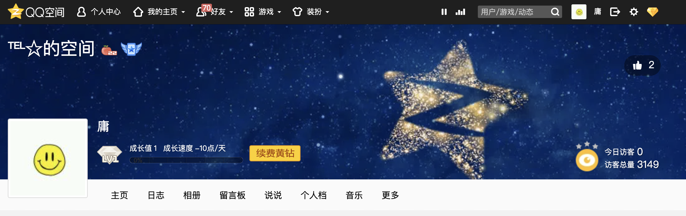
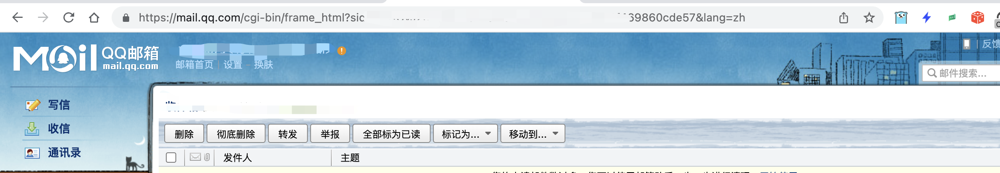
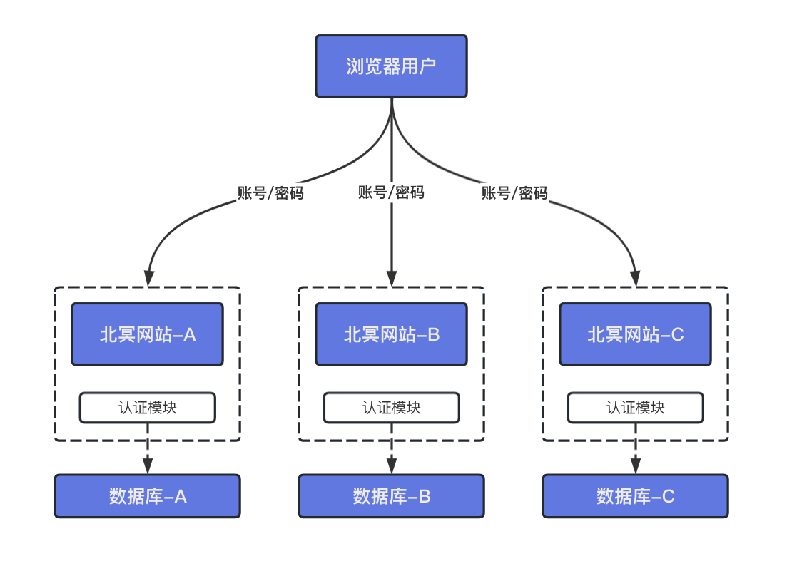
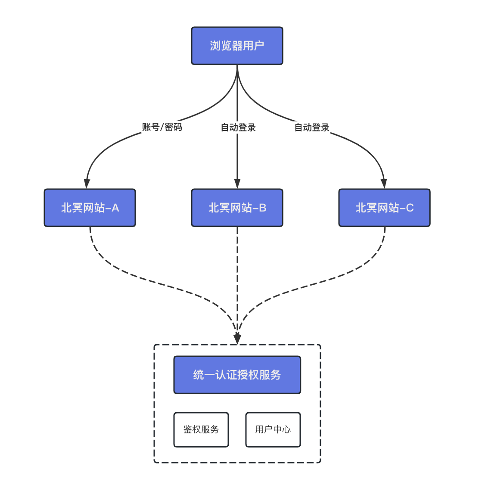
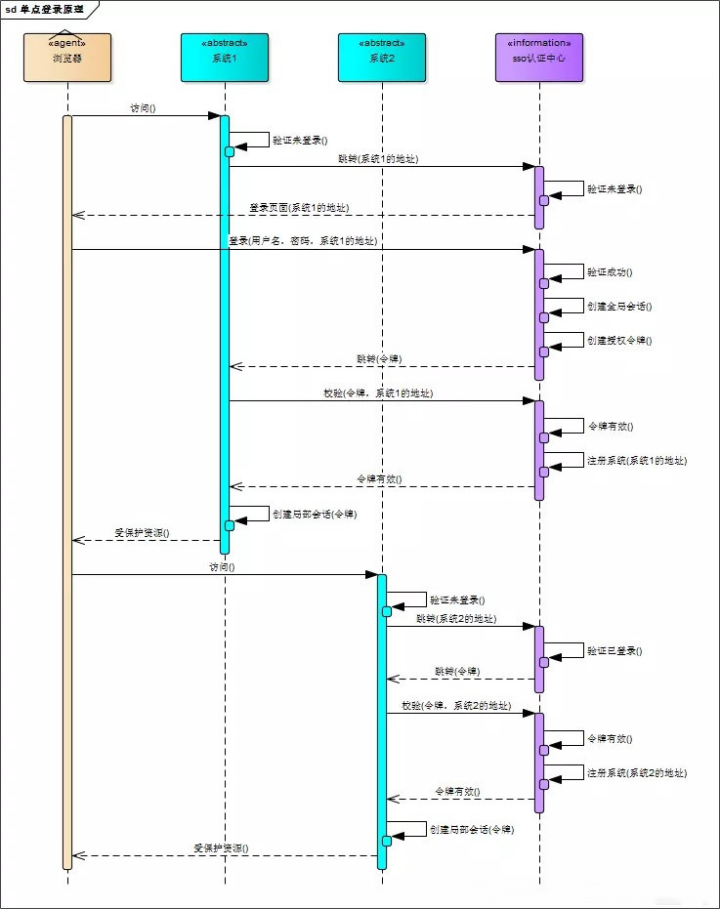
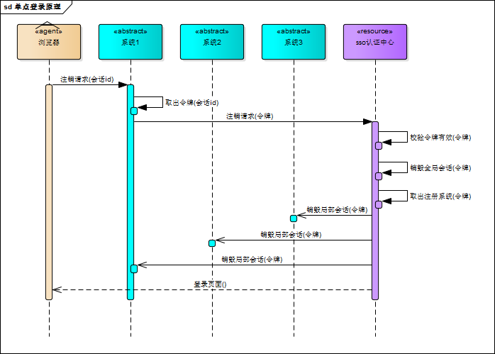
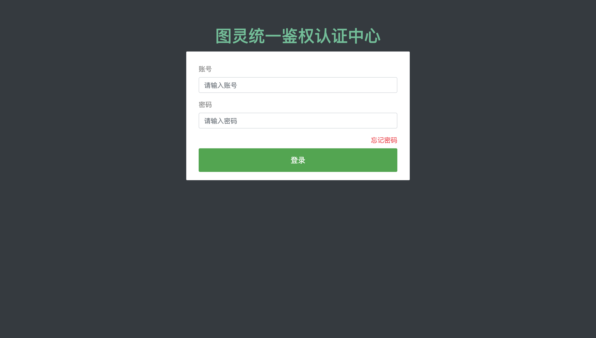
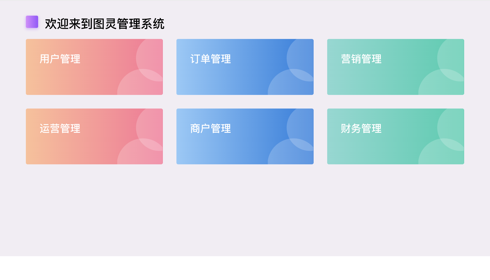
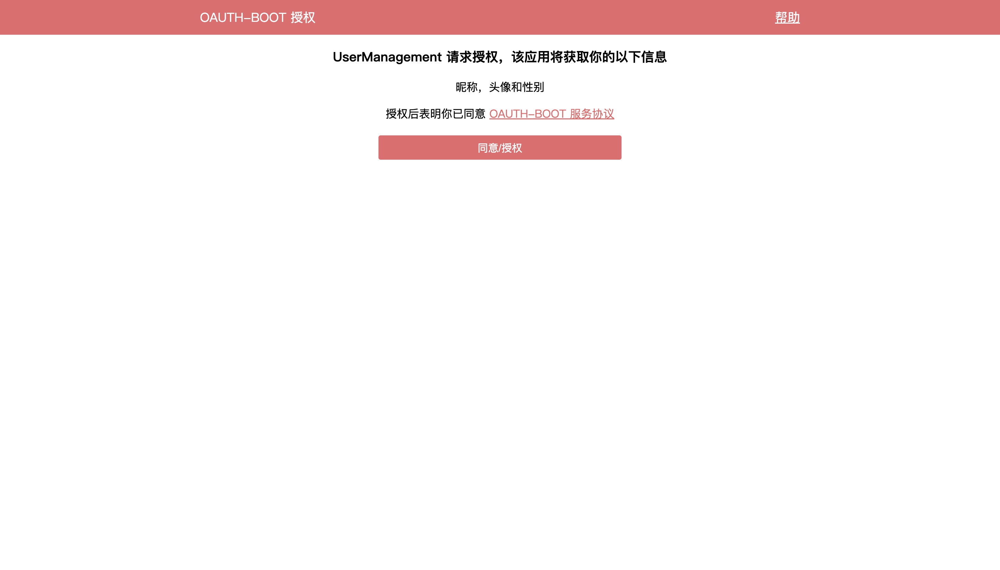
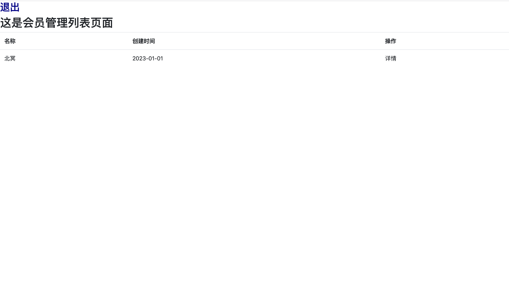

# SSO单点登录设计方案及落地

## 什么是SSO？

> 单点登录（Single Sign On，简称 SSO），是指在多系统应用群中登录一个系统，便可在其他所有系统中得到授权，无需再次登录。这种技术目前得到了广泛使用，它核心解决了一个问题：用户只需要登录一次，就可以访问所有相互信任的应用系统**。SSO是一种思想，或者说是一种解决方案，是抽象的，我们要做的就是按照它的这种思想去实现它。**
>

举个例子：

我在这边已经登录了QQ空间 [https://qzone.qq.com](https://qzone.qq.com) , 当我们再打开QQ邮箱时发现并不需要登录了 [https://mail.qq.com](https://mail.qq.com)

传统的多点登录系统中，每个站点都实现了本站专用的帐号数据库和登录模块。各站点的登录状态相互不认可，各站点需要逐一手工登录。如下图，有两个术语含义如下：

## SSO有什么好处？

说到这里，你可能会问为什么我们需要实施 SSO 呢？原因很简单，因为它提供了很多优势。下面我们具体分析一下。

首先，借助 SSO 可以确保系统更加安全，我们只需要一台集中式服务器来管理用户身份，而不需要将用户凭证扩展到各个服务，因此能够减少被攻击的维度。

其次，可以想象持续输入用户名和密码来访问不同的服务，是一件让用户感到很困扰的事情。而 SSO 将不同的服务组合在一起，以便用户可以在服务之间进行无缝导航，从而提高用户体验。

同时，SSO 也能帮助我们更好地了解客户，因为我们拥有对客户信息的单一视图，能够更好地构建用户画像。

## 单点登录设计与实现
| 单点登录模式 | 优点 | 缺点 |
| --- | --- | --- |
| 共享Cookie模式 | 简单方便，用户体验好 | 根域名需限制一致；Cookie可能不安全 |
| OAuth2.0模式 | 灵活安全，不受站点限制 | 成本稍高，需独立的认证中心 |
| 跨域设置Cookie | 用户体验好，不受站点限制 | 比较麻烦；Cookie可能不安全 |
| 客户端模式 | 用户体验好，不受站点限制 | 成本极高，依赖于用户本地安装客户端应用 |

## OAuth2模式实现单点登录

采用 Spring Security 和 OAuth2 协议是一个不错的选择，因为实现过程非常简单。虽然 OAuth2 一开始是用来允许用户授权第三方应用访问其资源的一种协议，也就是说其目标不是专门用来实现 SSO，但是我们可以利用它的功能特性来变相地实现单点登录，这就需要用到 OAuth2 四种授权模式中的授权码模式。同时，在使用 OAuth2 协议实现SSO时，我们也会使用 JWT 来生成和管理 Token。

多个站点共用一台认证授权服务器(用户数据库和认证授权模块共用)。用户经由其中任何一个站点(比如 `北冥网站-A`)登录后，可以免登录访问其他所有站点。而且，各站点间可以通过该登录状态直接交互。

### OAuth2实现原理分析

### 流程解析

+ 站点1发现用户未登录时，跳转至认证中心
+ 认证中心发现用户未登录（Cookie中没有认证记录），显示认证中心的登录页面
+ 用户输入账号密码登录，认证成功后，前端记录认证信息保存后端返回的accessToken令牌（可通过令牌获取对应用户名username），后端Redis存入access_token对应信息，其key为username:站点1的clientId，返回站点1的access_token
+ 认证中心携带access_token跳转至站点1的回调地址
+ 站点1前端获取到access_token令牌，记录已登录状态，每次请求携带access_token
+ 站点2发现用户未登录时，跳转至认证中心
+ 认证中心前端判断已认证授权过：从前端Cookie中取出存储的accessToken（可通过令牌获取对应用户名username）
+ 认证中心调用已授权验证接口，先验证accessToken是否有效，若有效，则后端Redis存入新站点的access_token信息，其key为username:站点2的clientId，返回站点2的access_token
+ 认证中心携带access_token跳转至站点2的回调地址
+ 站点2前端获取到access_token令牌，记录已登录状态，每次请求携带access_token

### 注销流程分析示例

任一站点用户退出登录，通过Redis失效所有以username开头的键值对即可

### 效果演示

> 原文: <https://www.yuque.com/tulingzhouyu/db22bv/bn0ynk3vqm0gptmx>