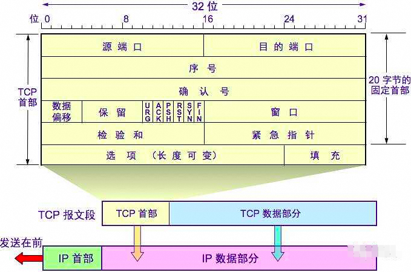
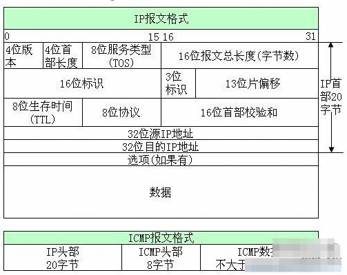
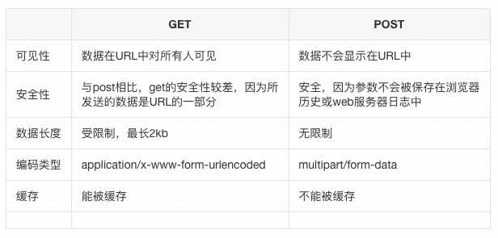
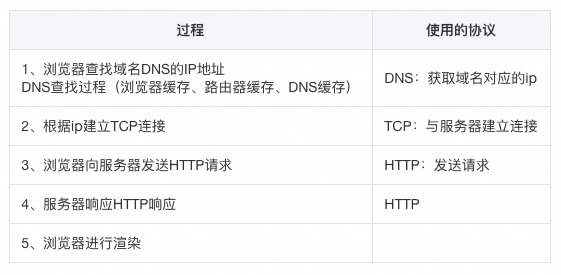

# 网络和操作系统基础篇

<font style="color:rgb(255, 129, 36);">网络基础</font>

<font style="color:rgb(62, 62, 62);">  
</font>

**<font style="color:rgb(62, 62, 62);">TCP三次握手</font>**

**<font style="color:rgb(62, 62, 62);">三次握手过程：</font>**

<font style="color:rgb(62, 62, 62);">客户端——发送带有SYN标志的数据包——服务端一次握手Client进入syn_sent状态；</font>

<font style="color:rgb(62, 62, 62);">服务端——发送带有SYN/ACK标志的数据包——客户端二次握手服务端进入syn_rcvd；</font>

<font style="color:rgb(62, 62, 62);">客户端——发送带有ACK标志的数据包——服务端三次握手连接就进入</font><font style="color:rgb(62, 62, 62);">Established</font><font style="color:rgb(62, 62, 62);">状态；</font>

**<font style="color:rgb(62, 62, 62);">为什么三次：</font>**

<font style="color:rgb(62, 62, 62);">主要是为了建立可靠的通信信道，保证客户端与服务端同时具备发送、接收数据的能力。</font>

**<font style="color:rgb(62, 62, 62);">为什么两次不行？</font>**

<font style="color:rgb(62, 62, 62);">1、防止已失效的请求报文又传送到了服务端，建立了多余的链接，浪费资源。</font>

<font style="color:rgb(62, 62, 62);">2、两次握手只能保证单向连接是畅通的。（为了实现可靠数据传输，TCP协议的通信双方，都必须维护一个序列号，以标识发送出去的数据包中，哪些是已经被对方收到的。三次握手的过程即是通信双方相互告知序列号起始值，并确认对方已经收到了序列号起始值的必经步骤；如果只是两次握手，至多只有连接发起方的起始序列号能被确认，另一方选择的序列号则得不到确认）。</font>

**<font style="color:rgb(62, 62, 62);">TCP四次挥手过程</font>**

**<font style="color:rgb(62, 62, 62);">四次挥手过程：</font>**

<font style="color:rgb(62, 62, 62);">客户端——发送带有FIN标志的数据包——服务端，关闭与服务端的连接，客户端进入FIN-WAIT-1状态。</font>

<font style="color:rgb(62, 62, 62);">服务端收到这个FIN，它发回⼀个ACK，确认序号为收到的序号加1，服务端就进入了CLOSE-WAIT状态。</font>

<font style="color:rgb(62, 62, 62);">服务端——发送⼀个FIN数据包——客户端，关闭与客户端的连接，客户端就进入FIN-WAIT-2状态。</font>

<font style="color:rgb(62, 62, 62);">客户端收到这个FIN，发回ACK报⽂确认，并将确认序号设置为收到序号加1，TIME-WAIT状态。</font>

**<font style="color:rgb(62, 62, 62);">为什么四次：</font>**

<font style="color:rgb(62, 62, 62);">因为需要确保客户端与服务端的数据能够完成传输。</font>

**<font style="color:rgb(62, 62, 62);">CLOSE-WAIT：</font>**

<font style="color:rgb(62, 62, 62);">这种状态的含义其实是表示在等待关闭。</font>

**<font style="color:rgb(62, 62, 62);">TIME-WAIT：</font>**

<font style="color:rgb(62, 62, 62);">为了解决网络的丢包和网络不稳定所带来的其他问题，确保连接方能在时间范围内，关闭自己的连接。</font>

**<font style="color:rgb(62, 62, 62);">如何查看TIME-WAIT状态的链接数量？</font>**

<font style="color:rgb(62, 62, 62);">netstat-an|grep TIME_WAIT|wc -l查看连接数等待time_wait状态连接数。</font>

**<font style="color:rgb(62, 62, 62);">为什么会TIME-WAIT过多？解决方法是怎样的？</font>**

**<font style="color:rgb(62, 62, 62);">可能原因：</font>**<font style="color:rgb(62, 62, 62);">高并发短连接的TCP服务器上，当服务器处理完请求后立刻按照主动正常关闭连接。</font>

**<font style="color:rgb(62, 62, 62);">解决：</font>**<font style="color:rgb(62, 62, 62);">负载均衡服务器；Web服务器首先关闭来自负载均衡服务器的连接。</font>

#### <font style="color:rgb(255, 104, 39);">1、OSI与TCP/IP模型</font>
<font style="color:rgb(62, 62, 62);">OSI七层：物理层、数据链路层、网络层、传输层、会话层、表示层、应用层</font>

<font style="color:rgb(62, 62, 62);">TCP/IP五层：物理层、数据链路层、网络层、传输层、应用层</font>

#### <font style="color:rgb(255, 104, 39);">2、常见网络服务分层</font>
<font style="color:rgb(62, 62, 62);">应用层：HTTP、SMTP、DNS、FTP</font>

<font style="color:rgb(62, 62, 62);">传输层：TCP、UDP</font>

<font style="color:rgb(62, 62, 62);">网络层：ICMP、IP、路由器、防火墙</font>

<font style="color:rgb(62, 62, 62);">数据链路层：网卡、网桥、交换机</font>

<font style="color:rgb(62, 62, 62);">物理层：中继器、集线器</font>

#### <font style="color:rgb(255, 104, 39);">3、TCP与UDP区别及场景</font>


**<font style="color:rgb(62, 62, 62);">基于UDP的协议：</font>**<font style="color:rgb(62, 62, 62);">RIP、DNS、SNMP</font>

**<font style="color:rgb(62, 62, 62);">基于TCP的协议：</font>**<font style="color:rgb(62, 62, 62);">HTTP、FTP、SMTP</font>

#### <font style="color:rgb(255, 104, 39);">4、TCP滑动窗口，拥塞控制</font>
**<font style="color:rgb(62, 62, 62);">TCP通过：</font>**<font style="color:rgb(62, 62, 62);">应用数据分割、对数据包进行编号、校验和、流量控制、拥塞控制、超时重传等措施保证数据的可靠传输；</font>

**<font style="color:rgb(62, 62, 62);">拥塞控制目的：</font>**<font style="color:rgb(62, 62, 62);">为了防止过多的数据注入到网络中，避免网络中的路由器、链路过载。</font>

**<font style="color:rgb(62, 62, 62);">拥塞控制过程：</font>**<font style="color:rgb(62, 62, 62);">TCP维护一个拥塞窗口，该窗口随着网络拥塞程度动态变化，通过慢开始、拥塞避免等算法减少网络拥塞的发生。</font>

#### <font style="color:rgb(255, 104, 39);">5、TCP粘包原因和解决方法</font>
**<font style="color:rgb(62, 62, 62);">TCP粘包是指：</font>**<font style="color:rgb(62, 62, 62);">发送方发送的若干包数据到接收方接收时粘成一包。</font>

**<font style="color:rgb(62, 62, 62);">发送方原因：</font>**

<font style="color:rgb(62, 62, 62);">TCP默认使用Nagle算法（主要作用：减少网络中报文段的数量）：</font>

<font style="color:rgb(62, 62, 62);">收集多个小分组，在一个确认到来时一起发送、导致发送方可能会出现粘包问题。</font>

**<font style="color:rgb(62, 62, 62);">接收方原因：</font>**

<font style="color:rgb(62, 62, 62);">TCP将接收到的数据包保存在接收缓存里，如果TCP接收数据包到缓存的速度大于应用程序从缓存中读取数据包的速度，多个包就会被缓存，应用程序就有可能读取到多个首尾相接粘到一起的包。</font>

**<font style="color:rgb(62, 62, 62);">解决粘包问题：</font>**

<font style="color:rgb(62, 62, 62);">最本质原因在与接收对等方无法分辨消息与消息之间的边界在哪，通过使用某种方案给出边界，例如：</font>

+ <font style="color:rgb(62, 62, 62);">发送定长包。每个消息的大小都是一样的，接收方只要累计接收数据，直到数据等于一个定长的数值就将它作为一个消息。</font>
+ <font style="color:rgb(62, 62, 62);">包尾加上\r\n标记。FTP协议正是这么做的。但问题在于如果数据正文中也含有\r\n，则会误判为消息的边界。</font>
+ <font style="color:rgb(62, 62, 62);">包头加上包体长度。包头是定长的4个字节，说明了包体的长度。接收对等方先接收包体长度，依据包体长度来接收包体。</font>

#### <font style="color:rgb(255, 104, 39);">6、TCP、UDP报文格式</font>
**<font style="color:rgb(62, 62, 62);">TCP报文格式：</font>**



**<font style="color:rgb(62, 62, 62);">源端口号和目的端口号：</font>**

<font style="color:rgb(62, 62, 62);">用于寻找发端和收端应用进程。这两个值加上ip首部源端ip地址和目的端ip地址唯一确定一个tcp连接。</font>

**<font style="color:rgb(62, 62, 62);">序号字段：</font>**

<font style="color:rgb(62, 62, 62);">序号用来标识从TCP发端向TCP收端发送的数据字节流，它表示在这个报文段中的的第一个数据字节。如果将字节流看作在两个应用程序间的单向流动，则TCP用序号对每个字节进行计数。序号是32 bit的无符号数，序号到达2^32-1后又从0开始。</font>

<font style="color:rgb(62, 62, 62);">当建立一个新的连接时，SYN标志变1。序号字段包含由这个主机选择的该连接的初始序号ISN（Initial Sequence Number）。该主机要发送数据的第一个字节序号为这个ISN加1，因为SYN标志消耗了一个序号。</font>

**<font style="color:rgb(62, 62, 62);">确认序号：</font>**

<font style="color:rgb(62, 62, 62);">既然每个传输的字节都被计数，确认序号包含发送确认的一端所期望收到的下一个序号。因此，确认序号应当是上次已成功收到数据字节序号加1。只有ACK标志为1时确认序号字段才有效。发送ACK无需任何代价，因为32 bit的确认序号字段和ACK标志一样，总是TCP首部的一部分。因此，我们看到一旦一个连接建立起来，这个字段总是被设置，ACK标志也总是被设置为1。TCP为应用层提供全双工服务。这意味数据能在两个方向上独立地进行传输。因此，连接的每一端必须保持每个方向上的传输数据序号。</font>

**<font style="color:rgb(62, 62, 62);">首都长度：</font>**

<font style="color:rgb(62, 62, 62);">首部长度给出首部中32 bit字的数目。需要这个值是因为任选字段的长度是可变的。这个字段占4 bit，因此TCP最多有60字节的首部。然而，没有任选字段，正常的长度是20字节。</font>

**<font style="color:rgb(62, 62, 62);">标志字段：</font>**<font style="color:rgb(62, 62, 62);">在TCP首部中有6个标志比特。它们中的多个可同时被设置为1.</font>

<font style="color:rgb(62, 62, 62);">URG紧急指针（u rgent pointer）有效  
</font><font style="color:rgb(62, 62, 62);">ACK确认序号有效  
</font><font style="color:rgb(62, 62, 62);">PSH接收方应该尽快将这个报文段交给应用层  
</font><font style="color:rgb(62, 62, 62);">RST重建连接  
</font><font style="color:rgb(62, 62, 62);">SYN同步序号用来发起一个连接。这个标志和下一个标志将在第18章介绍  
</font><font style="color:rgb(62, 62, 62);">FIN发端完成发送任务</font>

**<font style="color:rgb(62, 62, 62);">窗口大小：</font>**

<font style="color:rgb(62, 62, 62);">TCP的流量控制由连接的每一端通过声明的窗口大小来提供。窗口大小为字节数，起始于确认序号字段指明的值，这个值是接收端期望接收的字节。窗口大小是一个16 bit字段，因而窗口大小最大为65535字节。</font>

**<font style="color:rgb(62, 62, 62);">检验和：</font>**

<font style="color:rgb(62, 62, 62);">检验和覆盖了整个的TCP报文段：TCP首部和TCP数据。这是一个强制性的字段，一定是由发端计算和存储，并由收端进行验证。</font>

**<font style="color:rgb(62, 62, 62);">紧急指针：</font>**

<font style="color:rgb(62, 62, 62);">只有当URG标志置1时紧急指针才有效。紧急指针是一个正的偏移量，和序号字段中的值相加表示紧急数据最后一个字节的序号。TCP的紧急方式是发送端向另一端发送紧急数据的一种方式。</font>

**<font style="color:rgb(62, 62, 62);">选项：</font>**

<font style="color:rgb(62, 62, 62);">最常见的可选字段是最长报文大小，又称为MSS(Maximum Segment Size)。每个连接方通常都在通信的第一个报文段（为建立连接而设置SYN标志的那个段）中指明这个选项。它指明本端所能接收的最大长度的报文段。</font>

**<font style="color:rgb(62, 62, 62);">UDP报文格式：</font>**


**<font style="color:rgb(62, 62, 62);">端口号：</font>**

<font style="color:rgb(62, 62, 62);">用来表示发送和接受进程。由于IP层已经把IP数据报分配给TCP或UDP（根据IP首部中协议字段值），因此TCP端口号由TCP来查看，而UDP端口号由UDP来查看。TCP端口号与UDP端口号是相互独立的。</font>

**<font style="color:rgb(62, 62, 62);">长度：</font>**

<font style="color:rgb(62, 62, 62);">UDP长度字段指的是UDP首部和UDP数据的字节长度。该字段的最小值为8字节（发送一份0字节的UDP数据报是OK）。</font>

**<font style="color:rgb(62, 62, 62);">检验和：</font>**

<font style="color:rgb(62, 62, 62);">UDP检验和是一个端到端的检验和。它由发送端计算，然后由接收端验证。其目的是为了发现UDP首部和数据在发送端到接收端之间发生的任何改动。</font>

**<font style="color:rgb(62, 62, 62);">IP报文格式：</font>**<font style="color:rgb(62, 62, 62);">普通的IP首部长为20个字节，除非含有可选项字段。</font>



**<font style="color:rgb(62, 62, 62);">4位版本：</font>**

<font style="color:rgb(62, 62, 62);">目前协议版本号是4，因此IP有时也称作IPV4.</font>

**<font style="color:rgb(62, 62, 62);">4位首部长度：</font>**

<font style="color:rgb(62, 62, 62);">首部长度指的是首部占32bit字的数目，包括任何选项。由于它是一个4比特字段，因此首部长度最长为60个字节。</font>

**<font style="color:rgb(62, 62, 62);">服务类型（TOS）：</font>**

<font style="color:rgb(62, 62, 62);">服务类型字段包括一个3bit的优先权字段（现在已经被忽略），4bit的TOS子字段和1bit未用位必须置0。4bit的TOS分别代表：最小时延，最大吞吐量，最高可靠性和最小费用。4bit中只能置其中1比特。如果所有4bit均为0，那么就意味着是一般服务。</font>

**<font style="color:rgb(62, 62, 62);">总长度：</font>**

<font style="color:rgb(62, 62, 62);">总长度字段是指整个IP数据报的长度，以字节为单位。利用首部长度和总长度字段，就可以知道IP数据报中数据内容的起始位置和长度。由于该字段长16bit，所以IP数据报最长可达65535字节。当数据报被分片时，该字段的值也随着变化。</font>

**<font style="color:rgb(62, 62, 62);">标识字段：</font>**

<font style="color:rgb(62, 62, 62);">标识字段唯一地标识主机发送的每一份数据报。通常每发送一份报文它的值就会加1。</font>

**<font style="color:rgb(62, 62, 62);">生存时间：</font>**

<font style="color:rgb(62, 62, 62);">TTL（time-to-live）生存时间字段设置了数据报可以经过的最多路由器数。它指定了数据报的生存时间。TTL的初始值由源主机设置（通常为32或64），一旦经过一个处理它的路由器，它的值就减去1。当该字段的值为0时，数据报就被丢弃，并发送 ICMP报文通知源主机。</font>

**<font style="color:rgb(62, 62, 62);">首部检验和：</font>**

<font style="color:rgb(62, 62, 62);">首部检验和字段是根据IP首部计算的检验和码。它不对首部后面的数据进行计算。ICMP、IGMP、UDP和TCP在它们各自的首部中均含有同时覆盖首部和数据检验和码。</font>

**<font style="color:rgb(62, 62, 62);">以太网报文格式：</font>**


**<font style="color:rgb(62, 62, 62);">目的地址和源地址：</font>**

<font style="color:rgb(62, 62, 62);">是指网卡的硬件地址（也叫MAC地址），长度是48位，是在网卡出厂时固化的。</font>

**<font style="color:rgb(62, 62, 62);">数据：</font>**

<font style="color:rgb(62, 62, 62);">以太网帧中的数据长度规定最小46字节，最大1500字节，ARP和RARP数据包的长度不够46字节，要在后面补填充位。最大值1500称为以太网的最大传输单元（MTU），不同的网络类型有不同的MTU，如果一个数据包从以太网路由到拨号链路上，数据包度大于拨号链路的MTU了，则需要对数据包进行分片fragmentation）。ifconfig命令的输出中也有“MTU:1500”。注意，MTU个概念指数据帧中有效载荷的最大长度，不包括帧首部的长度。</font>

<font style="color:rgb(62, 62, 62);">  
</font>

**<font style="color:rgb(62, 62, 62);">HTTP协议</font>**

#### <font style="color:rgb(255, 104, 39);">1、HTTP协议1.0_1.1_2.0</font>
**<font style="color:rgb(62, 62, 62);">HTTP1.0：</font>**<font style="color:rgb(62, 62, 62);">服务器处理完成后立即断开TCP连接</font>**<font style="color:rgb(62, 62, 62);">（无连接）</font>**<font style="color:rgb(62, 62, 62);">，服务器不跟踪每个客户端也不记录过去的请求</font>**<font style="color:rgb(62, 62, 62);">（无状态）；</font>**

**<font style="color:rgb(62, 62, 62);">HTTP1.1：</font>**<font style="color:rgb(62, 62, 62);">KeepAlived</font>**<font style="color:rgb(62, 62, 62);">长连接</font>**<font style="color:rgb(62, 62, 62);">避免了连接建立和释放的开销；通过Content-Length来判断当前请求数据是否已经全部接受</font>**<font style="color:rgb(62, 62, 62);">（有状态）；</font>**

**<font style="color:rgb(62, 62, 62);">HTTP2.0：</font>**<font style="color:rgb(62, 62, 62);">引入二进制数据帧和流的概念，其中帧对数据进行顺序标识；因为有了序列，服务器可以并行的传输数据。</font>

**<font style="color:rgb(62, 62, 62);">http1.0和http1.1的主要区别如下：</font>**

<font style="color:rgb(62, 62, 62);">1、缓存处理：1.1添加更多的缓存控制策略（如：Entity tag，If-Match）；  
</font><font style="color:rgb(62, 62, 62);">2、网络连接的优化：1.1支持断点续传；  
</font><font style="color:rgb(62, 62, 62);">3、错误状态码的增多：1.1新增了24个错误状态响应码，丰富的错误码更加明确各个状态；  
</font><font style="color:rgb(62, 62, 62);">4、Host头处理：支持Host头域，不在以IP为请求方标志；  
</font><font style="color:rgb(62, 62, 62);">5、长连接：减少了建立和关闭连接的消耗和延迟。</font>

**<font style="color:rgb(62, 62, 62);">http1.1和http2.0的主要区别：</font>**

<font style="color:rgb(62, 62, 62);">1、新的传输格式：2.0使用二进制格式，1.0依然使用基于文本格式；  
</font><font style="color:rgb(62, 62, 62);">2、多路复用：连接共享，不同的request可以使用同一个连接传输（最后根据每个request上的id号组合成正常的请求）；  
</font><font style="color:rgb(62, 62, 62);">3、header压缩：由于1.X中header带有大量的信息，并且得重复传输，2.0使用encoder来减少需要传输的hearder大小；  
</font><font style="color:rgb(62, 62, 62);">4、服务端推送：同google的SPDUY（1.0的一种升级）一样；</font>

#### <font style="color:rgb(255, 104, 39);">2、HTTP与HTTPS之间的区别</font>
**<font style="color:rgb(62, 62, 62);">HTTP与HTTPS之间的区别：</font>**


**<font style="color:rgb(62, 62, 62);">HTTPS链接建立的过程：</font>**

<font style="color:rgb(62, 62, 62);">1.首先客户端先给服务器发送一个请求；</font>

<font style="color:rgb(62, 62, 62);">2.服务器发送一个SSL证书给客户端，内容包括：证书的发布机构、有效期、所有者、签名以及公钥；</font>

<font style="color:rgb(62, 62, 62);">3.客户端对发来的公钥进行真伪校验，校验为真则使用公钥对对称加密算法以及对称密钥进行加密；</font>

<font style="color:rgb(62, 62, 62);">4.服务器端使用私钥进行解密并使用对称密钥加密确认信息发送给客户端；</font>

<font style="color:rgb(62, 62, 62);">5.随后客户端和服务端就使用对称密钥进行信息传输；</font>

**<font style="color:rgb(62, 62, 62);">对称加密算法：</font>**

<font style="color:rgb(62, 62, 62);">双方持有相同的密钥，且加密速度快，典型对称加密算法：DES、AES</font>

**<font style="color:rgb(62, 62, 62);">非对称加密算法：</font>**

<font style="color:rgb(62, 62, 62);">密钥成对出现（私钥、公钥），私钥只有自己知道，不在网络中传输；而公钥可以公开。相比对称加密速度较慢，典型的非对称加密算法有：RSA、DSA</font>

#### <font style="color:rgb(255, 104, 39);">3、Get和Post请求区别</font>
**<font style="color:rgb(62, 62, 62);">HTTP请求：</font>**


**<font style="color:rgb(62, 62, 62);">get和Post区别：</font>**



#### <font style="color:rgb(255, 104, 39);">4、HTTP常见响应状态码</font>
<font style="color:rgb(62, 62, 62);">100：Continue---继续。客户端应继续其请求。</font>

<font style="color:rgb(62, 62, 62);">200：OK---请求成功。一般用于GET与POST请求。</font>

<font style="color:rgb(62, 62, 62);">301：Moved Permanently---永久重定向。</font>

<font style="color:rgb(62, 62, 62);">302：Found---暂时重定向。</font>

<font style="color:rgb(62, 62, 62);">400：Bad Request---客户端请求的语法错误，服务器无法理解。</font>

<font style="color:rgb(62, 62, 62);">403：Forbideen---服务器理解请求客户端的请求，但是拒绝执行此请求。</font>

<font style="color:rgb(62, 62, 62);">404：Not Found---服务器无法根据客户端的请求找到资源（网页）。</font>

<font style="color:rgb(62, 62, 62);">500：Internal Server Error---服务器内部错误，无法完成请求。</font>

<font style="color:rgb(62, 62, 62);">502：Bad Gateway---作为网关或者代理服务器尝试执行请求时，从远程服务器接收到了无效的响应。</font>

#### <font style="color:rgb(255, 104, 39);">5、重定向和转发区别</font>
**<font style="color:rgb(62, 62, 62);">重定向：redirect：</font>**

<font style="color:rgb(62, 62, 62);">地址栏发生变化</font>

<font style="color:rgb(62, 62, 62);">重定向可以访问其他站点（服务器）的资源</font>

<font style="color:rgb(62, 62, 62);">重定向是两次请求。不能使用request对象来共享数据</font>

**<font style="color:rgb(62, 62, 62);">转发：forward：</font>**

<font style="color:rgb(62, 62, 62);">转发地址栏路径不变</font>

<font style="color:rgb(62, 62, 62);">转发只能访问当前服务器下的资源</font>

<font style="color:rgb(62, 62, 62);">转发是一次请求，可以使用request对象共享数据</font>

#### <font style="color:rgb(255, 104, 39);">6、Cookie和Session区别</font>
<font style="color:rgb(62, 62, 62);">Cookie和Session都是用来跟踪浏览器用户身份的会话方式，但两者有所区别：</font>

<font style="color:rgb(62, 62, 62);">Cookie数据保存在客户端(浏览器端)，Session数据保存在服务器端。</font>

<font style="color:rgb(62, 62, 62);">cookie不是很安全，别人可以分析存放在本地的COOKIE并进行欺骗,考虑到安全应当使用session。</font>

<font style="color:rgb(62, 62, 62);">Cookie⼀般⽤来保存⽤户信息，Session的主要作⽤就是通过服务端记录⽤户的状态</font>

<font style="color:rgb(62, 62, 62);">  
</font>

**<font style="color:rgb(62, 62, 62);">浏览器输入URL过程</font>**

**<font style="color:rgb(62, 62, 62);">过程：</font>**<font style="color:rgb(62, 62, 62);">DNS解析、TCP连接、发送HTTP请求、服务器处理请求并返回HTTP报文、浏览器渲染、结束。</font>



<font style="color:rgb(255, 129, 36);">操作系统基础</font>

<font style="color:rgb(62, 62, 62);">  
</font>

**<font style="color:rgb(62, 62, 62);">进程和线程的区别</font>**

**<font style="color:rgb(62, 62, 62);">进程：</font>**<font style="color:rgb(62, 62, 62);">是资源分配的最小单位，一个进程可以有多个线程，多个线程共享进程的堆和方法区资源，不共享栈、程序计数器。</font>

**<font style="color:rgb(62, 62, 62);">线程：</font>**<font style="color:rgb(62, 62, 62);">是任务调度和执行的最小单位，线程并行执行存在资源竞争和上下文切换的问题。</font>

**<font style="color:rgb(62, 62, 62);">协程：</font>**<font style="color:rgb(62, 62, 62);">是一种比线程更加轻量级的存在，正如一个进程可以拥有多个线程一样，一个线程可以拥有多个协程。</font>

#### <font style="color:rgb(255, 104, 39);">1、进程间通信方式IPC</font>
**<font style="color:rgb(62, 62, 62);">管道pipe：</font>**

<font style="color:rgb(62, 62, 62);">亲缘关系使用匿名管道，非亲缘关系使用命名管道，管道遵循FIFO，半双工，数据只能单向通信；</font>

**<font style="color:rgb(62, 62, 62);">信号：</font>**

<font style="color:rgb(62, 62, 62);">信号是一种比较复杂的通信方式，用户调用kill命令将信号发送给其他进程。</font>

**<font style="color:rgb(62, 62, 62);">消息队列：</font>**

<font style="color:rgb(62, 62, 62);">消息队列克服了信号传递信息少，管道只能承载无格式字节流以及缓冲区大小受限等特点。</font>

**<font style="color:rgb(62, 62, 62);">共享内存(share memory)：</font>**

+ <font style="color:rgb(62, 62, 62);">使得多个进程可以可以直接读写同一块内存空间，是最快的可用IPC形式。是针对其他通信机制运行效率较低而设计的。</font>
+ <font style="color:rgb(62, 62, 62);">由于多个进程共享一段内存，因此需要依靠某种同步机制（如信号量）来达到进程间的同步及互斥。</font>

**<font style="color:rgb(62, 62, 62);">信号量(Semaphores)：</font>**

<font style="color:rgb(62, 62, 62);">信号量是⼀个计数器，⽤于多进程对共享数据的访问，这种通信⽅式主要⽤于解决与同步相关的问题并避免竞争条件。</font>

**<font style="color:rgb(62, 62, 62);">套接字(Sockets):</font>**

<font style="color:rgb(62, 62, 62);">简单的说就是通信的两⽅的⼀种约定，⽤套接字中的相关函数来完成通信过程。</font>

#### <font style="color:rgb(255, 104, 39);">2、用户态和核心态</font>
**<font style="color:rgb(62, 62, 62);">用户态：</font>**<font style="color:rgb(62, 62, 62);">只能受限的访问内存，运行所有的应用程序。</font>

**<font style="color:rgb(62, 62, 62);">核心态：</font>**<font style="color:rgb(62, 62, 62);">运行操作系统程序，cpu可以访问内存的所有数据，包括外围设备。</font>

**<font style="color:rgb(62, 62, 62);">为什么要有用户态和内核态：</font>**

<font style="color:rgb(62, 62, 62);">由于需要限制不同的程序之间的访问能力，防止他们获取别的程序的内存数据，或者获取外围设备的数据，并发送到网络。</font>

**<font style="color:rgb(62, 62, 62);">用户态切换到内核态的3种方式：</font>**

**<font style="color:rgb(62, 62, 62);">a.系统调用</font>**

<font style="color:rgb(62, 62, 62);">主动调用，系统调用的机制其核心还是使用了操作系统为用户特别开放的一个中断来实现，例如Linux的int 80h中断。</font>

**<font style="color:rgb(62, 62, 62);">b.异常</font>**

<font style="color:rgb(62, 62, 62);">当CPU在执行运行在用户态下的程序时，发生了某些事先不可知的异常，比如缺页异常，这时会触发切换内核态处理异常。</font>

**<font style="color:rgb(62, 62, 62);">c.外围设备的中断</font>**

<font style="color:rgb(62, 62, 62);">当外围设备完成用户请求的操作后，会向CPU发出相应的中断信号，这时CPU会由用户态到内核态的切换。</font>

#### <font style="color:rgb(255, 104, 39);">3、操作系统的进程空间</font>
<font style="color:rgb(62, 62, 62);">栈区（stack）—由编译器自动分配释放，存放函数的参数值，局部变量的值等。</font>

<font style="color:rgb(62, 62, 62);">堆区（heap）—一般由程序员分配释放，若程序员不释放，程序结束时可能由OS回收 。</font>

<font style="color:rgb(62, 62, 62);">静态区（static）—存放全局变量和静态变量的存储。</font>

<font style="color:rgb(62, 62, 62);">代码区(text)—存放函数体的二进制代码。</font>

**<font style="color:rgb(62, 62, 62);">线程共享堆区、静态区</font>**

<font style="color:rgb(62, 62, 62);">  
</font>

**<font style="color:rgb(62, 62, 62);">操作系统内存管理</font>**

**<font style="color:rgb(62, 62, 62);">存管理方式：</font>**<font style="color:rgb(62, 62, 62);">页式管理、段式管理、段页式管理</font>

**<font style="color:rgb(62, 62, 62);">分段管理：</font>**

<font style="color:rgb(62, 62, 62);">将程序的地址空间划分为若干段（segment），如代码段，数据段，堆栈段；这样每个进程有一个二维地址空间，相互独立，互不干扰。段式管理的优点是：没有内碎片（因为段大小可变，改变段大小来消除内碎片）。但段换入换出时，会产生外碎片（比如4k的段换5k的段，会产生1k的外碎片）。</font>

**<font style="color:rgb(62, 62, 62);">分页管理：</font>**

<font style="color:rgb(62, 62, 62);">在页式存储管理中，将程序的逻辑地址划分为固定大小的页（page），而物理内存划分为同样大小的页框，程序加载时，可以将任意一页放入内存中任意一个页框，这些页框不必连续，从而实现了离散分离。页式存储管理的优点是：没有外碎片（因为页的大小固定），但会产生内碎片（一个页可能填充不满）。</font>

**<font style="color:rgb(62, 62, 62);">段页式管理：</font>**

<font style="color:rgb(62, 62, 62);">段⻚式管理机制结合了段式管理和⻚式管理的优点。简单来说段⻚式管理机制就是把主存先分成若⼲段，每个段⼜分成若⼲⻚，也就是说段⻚式管理机制中段与段之间以及段的内部的都是离散的。</font>

#### <font style="color:rgb(255, 104, 39);">1、页面置换算法FIFO、LRU</font>
**<font style="color:rgb(62, 62, 62);">置换算法：</font>**<font style="color:rgb(62, 62, 62);">先进先出FIFO、最近最久未使用LRU、最佳置换算法OPT。</font>

**<font style="color:rgb(62, 62, 62);">先进先出FIFO:</font>**

<font style="color:rgb(62, 62, 62);">缺点：没有考虑到实际的页面使用频率，性能差、与通常页面使用的规则不符合，实际应用较少。</font>

**<font style="color:rgb(62, 62, 62);">最近最久未使用LRU:</font>**

<font style="color:rgb(62, 62, 62);">原理：选择最近且最久未使用的页面进行淘汰。</font>

<font style="color:rgb(62, 62, 62);">优点：考虑到了程序访问的时间局部性，有较好的性能，实际应用也比较多。</font>

<font style="color:rgb(62, 62, 62);">缺点：没有合适的算法，只有适合的算法，lFU、random都可以。</font>

```plain
/** * @program: Java * @description: LRU最近最久未使用置换算法，通过LinkedHashMap实现 * @author: Mr.Li * @create: 2020-07-17 10:29 **/public class LRUCache {    private LinkedHashMap<Integer,Integer> cache;    private int capacity;   //容量大小
    /**     *初始化构造函数     * @param capacity     */    public LRUCache(int capacity) {        cache = new LinkedHashMap<>(capacity);        this.capacity = capacity;    }
    public int get(int key) {        //缓存中不存在此key，直接返回        if(!cache.containsKey(key)) {            return -1;        }
        int res = cache.get(key);        cache.remove(key);   //先从链表中删除        cache.put(key,res);  //再把该节点放到链表末尾处        return res;    }
    public void put(int key,int value) {        if(cache.containsKey(key)) {            cache.remove(key); //已经存在，在当前链表移除        }        if(capacity == cache.size()) {            //cache已满，删除链表头位置            Set<Integer> keySet = cache.keySet();            Iterator<Integer> iterator = keySet.iterator();            cache.remove(iterator.next());        }        cache.put(key,value);  //插入到链表末尾    }}


/** * @program: Java * @description: LRU最近最久未使用置换算法，通过LinkedHashMap内部removeEldestEntry方法实现 * @author: Mr.Li * @create: 2020-07-17 10:59 **/class LRUCache {    private Map<Integer, Integer> map;    private int capacity;        /**     *初始化构造函数     * @param capacity     */    public LRUCache(int capacity) {        this.capacity = capacity;        map = new LinkedHashMap<Integer, Integer>(capacity, 0.75f, true) {            @Override            protected boolean removeEldestEntry(Map.Entry eldest) {                return size() > capacity;  // 容量大于capacity 时就删除            }        };    }    public int get(int key) {        //返回key对应的value值，若不存在，返回-1        return map.getOrDefault(key, -1);    }
    public void put(int key, int value) {        map.put(key, value);    }}
```

**<font style="color:rgb(62, 62, 62);">最佳置换算法OPT:</font>**

<font style="color:rgb(62, 62, 62);">原理：每次选择当前物理块中的页面在未来长时间不被访问的或未来不再使用的页面进行淘汰。</font>

<font style="color:rgb(62, 62, 62);">优点：具有较好的性能，可以保证获得最低的缺页率。</font>

<font style="color:rgb(62, 62, 62);">缺点：过于理想化，但是实际上无法实现（没办法预知未来的页面）。</font>

#### <font style="color:rgb(255, 104, 39);">2、死锁条件、解决方式</font>
<font style="color:rgb(62, 62, 62);">死锁是指两个或两个以上进程在执行过程中，因争夺资源而造成的下相互等待的现象；</font>

**<font style="color:rgb(62, 62, 62);">死锁的条件：</font>**

<font style="color:rgb(62, 62, 62);">互斥条件：进程对所分配到的资源不允许其他进程访问，若其他进程访问该资源，只能等待至占有该资源的进程释放该资源。</font>

<font style="color:rgb(62, 62, 62);">请求与保持条件：进程获得一定的资源后，又对其他资源发出请求，阻塞过程中不会释放自己已经占有的资源。</font>

<font style="color:rgb(62, 62, 62);">非剥夺条件：进程已获得的资源，在未完成使用之前，不可被剥夺，只能在使用后自己释放。</font>

<font style="color:rgb(62, 62, 62);">循环等待条件：系统中若干进程组成环路，环路中每个进程都在等待相邻进程占用的资源。</font>

**<font style="color:rgb(62, 62, 62);">解决方法：</font>**<font style="color:rgb(62, 62, 62);">破坏死锁的任意一条件。</font>

<font style="color:rgb(62, 62, 62);">乐观锁，破坏资源互斥条件，</font>**<font style="color:rgb(62, 62, 62);">CAS。</font>**

<font style="color:rgb(62, 62, 62);">资源一次性分配，从而剥夺请求和保持条件、</font>**<font style="color:rgb(62, 62, 62);">tryLock。</font>**

<font style="color:rgb(62, 62, 62);">可剥夺资源：即当进程新的资源未得到满足时，释放已占有的资源，从而破坏不可剥夺的条件，</font>**<font style="color:rgb(62, 62, 62);">数据库deadlock超时。</font>**

<font style="color:rgb(62, 62, 62);">资源有序分配法：系统给每类资源赋予一个序号，每个进程按编号递增的请求资源，从而破坏环路等待的条件，</font>**<font style="color:rgb(62, 62, 62);">转账场景。</font>**

<font style="color:rgb(255, 129, 36);">总结</font>

<font style="color:rgb(62, 62, 62);">在面试中，对于网络部分，应对TCP协议、OSI网络模型、网络服务分组有明确的理解。重点理解滑动窗口和拥塞控制的实现方式，并能结合实际情况进行详细阐述。尤其注意TCP连接建立的三次握手和断开的四次挥手过程中的细节以及他们背后的原理。  
  
</font><font style="color:rgb(62, 62, 62);">对于操作系统部分，需要理解进程和线程之间的差别，以及它们在操作系统中是如何进行通信和管理的。掌握常见的Linux操作命令，并熟悉利用他们处理如CPU使用率过高、内存溢出和进程死锁等线上问题。另外在页面置换算法中，LRU（最近最久未使用）算法是一个笔试中的重点，需要熟练掌握。</font>


> 原文: <https://www.yuque.com/tulingzhouyu/db22bv/pngo33i92ss0uz3s>