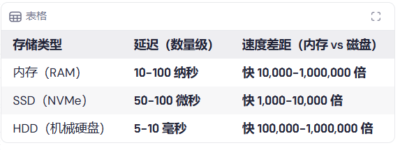
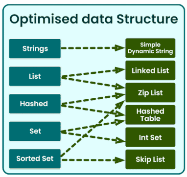
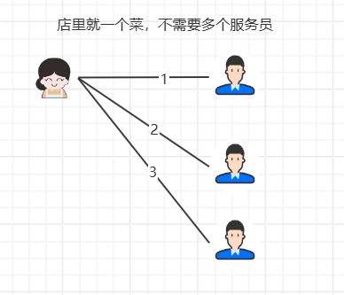
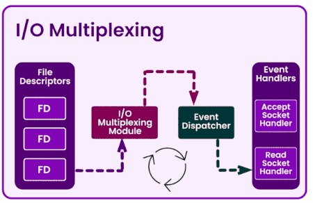

# Redis为什么这么快

Redis之所以快速的原因主要包括以下几点：

1. **内存存储：**Redis将数据存储在内存中，实现了快速的读写操作。
2. **单线程模型：**Redis采用单线程处理请求，避免了多线程的竞争和上下文切换开销。
3. **高效的数据结构：**Redis内部使用了高效的数据结构，如哈希表、跳跃表等，提供了快速的数据访问和操作。
4. **异步IO：**Redis利用异步IO来处理网络请求，能够同时处理多个请求，提高并发性能。
5. **事件驱动架构：**Redis基于事件驱动的模型，通过事件循环机制处理请求和操作，提高系统的效率。
6. **优化的操作：**Redis对常用操作进行了优化，如批量操作和管道技术，减少了网络通信开销。

综上所述，Redis之所以快速在于内存存储、单线程模型、高效的数据结构、异步IO、事件驱动架构和优化的操作等因素的综合作用。这使得Redis能够以高性能和高响应速度处理各类数据操作请求。

详：

在高并发下， 大家都知道要用多线程，  为什么Redis反其道而行之用单线程。  那单线程不是会导致串行从而影响吞吐量吗？

首先，  redis的瓶颈不在 CPU，  它直接从内存中拿完数据就直接通过网络来传输，中间不需要任何计算。

高效的数据结构，进一步提升操作内存的性能

所以对于 **Redis 这种高频小操作的场景，单线程的效率反而更高**。它的性能更多取决于内存访问速度和网络 I/O，而不是 CPU 的多核能力。那这样的话，单线程的设计就显得非常合理了。 因为对于内存操作来说，速度本身就非常快。 多线程反而会带来了额外的复杂性，上下文切换等问题造成额外的性能开销。 

Redis为什么不用b+树？MySQL为什么不用跳表？ 

1.redis没有这么多数据。

2.B+树是自平衡树， 每次插入数据都会自动维护树和排序，为了就是减少树的高度和将数据排好序。

2.mysql需要通过B+树减少磁盘ioc次数， redis直接操作内存，内存比磁盘上万倍，多跳几次问题不大。 

+ **单线程是怎么处理多个连接的？**

通过IO多路复用，     把连接都管理起来， 谁需要执行命令就执行谁的。

