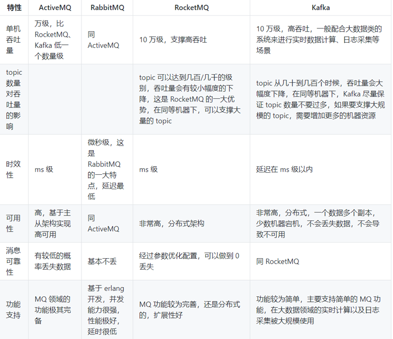

# 💎 B站讲的最好的Kafka系列课

## Kafka入门
### 什么是消息队列与Kafka简介
消息队列（Message Queue，简称MQ），指保存消息的一个容器，本质是个队列。

消息（Message）是指在应用之间传送的数据，消息可以非常简单，比如只包含文本字符串，也可以更复杂，可能包含嵌入对象。

消息队列（Message Queue）是一种应用间的通信方式，消息发送后可以立即返回，有消息系统来确保信息的可靠专递，消息发布者只管把消息发布到MQ中而不管谁来取，消息使用者只管从MQ中取消息而不管谁发布的，这样发布者和使用者都不用知道对方的存在。


+ <font style="color:rgb(18, 18, 18);">Producer：消息生产者，负责产生和发送消息到 Broker；</font>
+ <font style="color:rgb(18, 18, 18);">Broker：消息处理中心。负责消息存储、确认、重试等，一般其中会包含多个 queue；</font>
+ <font style="color:rgb(18, 18, 18);">Consumer：消息消费者，负责从 Broker 中获取消息，并进行相应处理；</font>

#### <font style="color:rgb(18, 18, 18);">为什么需要消息队列？</font>
1、屏蔽异构平台的细节：发送方、接收方系统之间不需要了解双方，只需认识消息。

2、异步：消息堆积能力；发送方接收方不需同时在线，发送方接收方不需同时扩容（削峰）。

3、解耦：防止引入过多的API给系统的稳定性带来风险；调用方使用不当会给被调用方系统造成压力，被调用方处理不当会降低调用方系统的响应能力。

4、复用：一次发送多次消费。

5、可靠：一次保证消息的传递。如果发送消息时接收者不可用，消息队列会保留消息，直到成功地传递它。

6、提供路由：发送者无需与接收者建立连接，双方通过消息队列保证消息能够从发送者路由到接收者，甚至对于本来网络不易互通的两个服务，也可以提供消息路由。

#### <font style="color:rgb(18, 18, 18);">消息队列有什么优点和缺点？</font>
1. <font style="color:rgb(18, 18, 18);">核心优点</font>
    1. <font style="color:rgb(18, 18, 18);">解耦</font>
    2. <font style="color:rgb(18, 18, 18);">异步</font>
    3. <font style="color:rgb(18, 18, 18);">削峰</font>
2. <font style="color:rgb(18, 18, 18);">缺点</font>
    1. <font style="color:rgb(18, 18, 18);">系统可用性降低：系统引入的外部依赖越多，越容易挂掉。</font>
    2. <font style="color:rgb(18, 18, 18);">系统复杂度提高了</font>
    3. <font style="color:rgb(18, 18, 18);">一致性问题：消息传递给多个系统，部分执行成功，部分执行失败，容易导致数据不一致</font>

#### Kafka简介
Kafka是一个分布式流处理系统，流处理系统使它可以像消息队列一样publish或者subscribe消息，分布式提供了容错性，并发处理消息的机制。

### Kafka的优势和特点
+ **<font style="color:rgb(51, 51, 51);">高吞吐量</font>**<font style="color:rgb(51, 51, 51);">：单机每秒处理几十上百万的消息量。即使存储了许多TB的消息，它也保持稳定的性能。</font>
+ **<font style="color:rgb(51, 51, 51);">高性能</font>**<font style="color:rgb(51, 51, 51);">：单节点支持上千个客户端，并保证零停机和零数据丢失，异步化处理机制</font>
+ **<font style="color:rgb(51, 51, 51);">持久化：</font>**<font style="color:rgb(51, 51, 51);">将消息持久化到磁盘。通过将数据持久化到硬盘以及replica(follower节点)防止数据丢失。</font>
+ **<font style="color:rgb(51, 51, 51);">零拷贝</font>**<font style="color:rgb(51, 51, 51);">：减少了很多的拷贝技术，以及可以总体减少阻塞事件，提高吞吐量。</font>
+ **<font style="color:rgb(51, 51, 51);">可靠性 ：</font>**<font style="color:rgb(51, 51, 51);">Kafka是分布式，分区，复制和容错的。</font>
+ <font style="color:rgb(51, 51, 51);">Kafka的特点 ：</font>
    - **<font style="color:rgb(102, 102, 102);">顺序读，顺序写</font>**
    - **<font style="color:rgb(102, 102, 102);">利用Linux的页缓存</font>**
    - **<font style="color:rgb(102, 102, 102);">分布式系统，易于向外扩展。所有的Producer、Broker和Consumer都会有多个，均为分布式的。无需停机即可扩展机器。多个Producer、Consumer可能是不同的应用。</font>**
    - **<font style="color:rgb(102, 102, 102);">客户端状态维护:消息被处理的状态是在Consumer端维护，而不是由server端维护。当失败时能自动平衡。</font>**
    - **<font style="color:rgb(102, 102, 102);">支持online（在线）和offline（离线）的场景。</font>**
    - **<font style="color:rgb(102, 102, 102);">支持多种客户端语言。Kafka支持Java、.NET、PHP、Python等多种语言。</font>**

### Kafka与传统消息队列的对比


各种对比之后，有如下建议：

+ ActiveMQ，没经过大规模吞吐量场景的验证，社区也不是很活跃，所以不推荐；
+ RabbitMQ，虽然erlang 语言阻止了大量的 Java 工程师去深入研究和掌控它，对公司而言，几乎处于不可控的状态，但是毕竟是开源的，比较稳定的支持，活跃度也高，推荐中小型公司使用；推荐
+ RocketMQ，阿里出品，Java语言编写，经过了阿里多年双十一大促的考验，性能和稳定性得到了充分的严重。目前在业界被广泛应用在订单，交易，充值，流计算，消息推送，日志流式处理，binlog分发等场景；强烈推荐
+ Kafka，如果是大数据领域的实时计算、日志采集等场景，用 Kafka 是业内标准的，绝对没问题，社区活跃度很高，绝对不会黄，何况几乎是全世界这个领域的事实性规范。

### Kafka的核心组件：Producer、Broker、Consumer、Topic、Partition
<font style="color:rgb(18, 18, 18);">kafka运行在集群上，集群包含一个或多个服务器。kafka把消息存在topic中，每一条消息包含键值（key），值（value）和时间戳（timestamp）。</font>

<font style="color:rgb(18, 18, 18);">kafka有以下一些基本概念：</font>

**<font style="color:rgb(18, 18, 18);">Producer</font>****<font style="color:rgb(18, 18, 18);"> </font>**<font style="color:rgb(18, 18, 18);">- 消息生产者，就是向kafka broker发消息的客户端。</font>

**<font style="color:rgb(18, 18, 18);">Consumer</font>****<font style="color:rgb(18, 18, 18);"> </font>**<font style="color:rgb(18, 18, 18);">- 消息消费者，是消息的使用方，负责消费Kafka服务器上的消息。</font>

**<font style="color:rgb(18, 18, 18);">Topic</font>****<font style="color:rgb(18, 18, 18);"> </font>**<font style="color:rgb(18, 18, 18);">- 主题，由用户定义并配置在Kafka服务器，用于建立Producer和Consumer之间的订阅关系。生产者发送消息到指定的Topic下，消息者从这个Topic下消费消息。</font>

**<font style="color:rgb(18, 18, 18);">Partition</font>**<font style="color:rgb(18, 18, 18);"> </font><font style="color:rgb(18, 18, 18);">- 消息分区，一个topic可以分为多个 partition，每个  
</font><font style="color:rgb(18, 18, 18);">partition是一个有序的队列。partition中的每条消息都会被分配一个有序的  
</font><font style="color:rgb(18, 18, 18);">id（offset）。</font>

**<font style="color:rgb(18, 18, 18);">Broker</font>****<font style="color:rgb(18, 18, 18);"> </font>**<font style="color:rgb(18, 18, 18);">- 一台kafka服务器就是一个broker。一个集群由多个broker组成。一个broker可以容纳多个topic。</font>

**<font style="color:rgb(18, 18, 18);">Consumer Group</font>**<font style="color:rgb(18, 18, 18);"> </font><font style="color:rgb(18, 18, 18);">- 消费者分组，用于归组同类消费者。每个consumer属于一个特定的consumer group，多个消费者可以共同消息一个Topic下的消息，每个消费者消费其中的部分消息，这些消费者就组成了一个分组，拥有同一个分组名称，通常也被称为消费者集群。</font>

**<font style="color:rgb(18, 18, 18);">Offset </font>**<font style="color:rgb(18, 18, 18);">- 消息在partition中的偏移量。每一条消息在partition都有唯一的偏移量，消息者可以指定偏移量来指定要消费的消息。</font>

### Kafka的数据模型与消息存储机制
#### 消息存储结构
<font style="color:rgb(64, 64, 64);">Kafka 有 Topic 和 Partition 两个概念，一个 Topic 可以有多个 Partition。在实际存储的时候，Topic + Partition 对应一个文件夹，这个文件夹对应的是这个 Partition 的数据。</font>

<font style="color:rgb(64, 64, 64);">在 Kafka 的数据文件目录下，一个 Partition 对应一个唯一的文件夹。如果有 4 个 Topic，每个 Topic 有 5 个 Partition，那么一共会有 4 * 5 = 20 个文件夹。而在文件夹下，Kafka 消息是采用 Segment File 的存储方式进行存储的。</font>

<font style="color:rgb(64, 64, 64);">Segment File 的大概意思是：将大文件拆分成小文件来存储，这样一个大文件就变成了一段一段（Segment 段）。这样的好处是 IO 加载速度快，不会有很长的 IO 加载时间。Kafka 的消息存储就采用了这种方式。</font>


<font style="color:rgb(64, 64, 64);">如上图所示，在一个文件夹下的数据会根据 Kafka 的配置拆分成多个小文件。拆分规则可以根据文件大小拆分，也可以根据消息条数拆分，这个是 Kafka 的一个配置，这里不细说。</font>

<font style="color:rgb(64, 64, 64);">在 Kafka 的数据文件夹下，分为两种类型的文件：索引文件（Index File）和数据文件（Data File）。索引文件存的是消息的索引信息，帮助快速定位到某条消息。数据文件存储的是具体的消息内容。</font>

#### <font style="color:rgb(64, 64, 64);">索引文件</font>
<font style="color:rgb(64, 64, 64);">索引文件的命名统一为数字格式，其名称表示 Kafka 消息的偏移量。我们假设索引文件的数字为 N，那么就代表该索引文件存储的第一条 Kafka 消息的偏移量为 N + 1，而上个文件存储的最后一条 Kafka 消息的偏移量为 N（因为 Kafka 是顺序存储的）。例如下图的 368769.index 索引文件，其表示文件存储的第一条 Kafka 消息的偏移量为 368770。而 368769 表示的是 0000.index 这个索引文件的最后一条消息。所以 368769.index 索引文件，其存储的 Kafka 消息偏移量范围为 368769-737337。</font>


<font style="color:rgb(64, 64, 64);">索引文件存储的是简单地索引数据，其格式为：「N,Position」。其中 N 表示索引文件里的第几条消息，而 Position 则表示该条消息在数据文件（Log File）中的物理偏移地址。例如下图中的「3,497」表示：索引文件里的第 3 条消息（即 offset 368772 的消息，368772 = 368769+3），其在数据文件中的物理偏移地址为 497。</font>

  


<font style="color:rgb(64, 64, 64);">其他的以此类推，例如：「8,1686」表示 offset 为 368777 的 Kafka 消息，其在数据文件中的物理偏移地址为 1686。</font>

#### <font style="color:rgb(64, 64, 64);">数据文件</font>
<font style="color:rgb(64, 64, 64);">数据文件的命名格式与索引文件的命名格式完全一样，这里就不再赘述了。</font>

<font style="color:rgb(64, 64, 64);">通过上面索引文件的分析，我们已经可以根据 offset 快速定位到某个数据文件了。那接着我们怎么读取到这条消息的内容呢？要读取到这条消息的内容，我们需要搞清楚数据文件的存储格式。</font>

<font style="color:rgb(64, 64, 64);">数据文件就是所有消息的一个列表，而每条消息都有一个固定的格式，如下图所示。</font>


<font style="color:rgb(64, 64, 64);">从上图可以看到 Kafka 消息的物理结构，其包含了 Kafka 消息的 offset 信息、Kafka 消息的大小信息、版本号等等。有了这些信息之后，我们就可以正确地读取到 Kafka 消息的实际内容。</font>

##   
Kafka基本操作
### 安装和配置Kafka集群
这一次我想换个方式来和大家分享技术，不想一上来就带大家怼原理、怼概念、怼源码。这套系列课我们踏踏实实从安装开始，每一步我都会通俗易懂的带大家彻彻底底的学会Kafka、学懂Kafka。


我们不论是学Java或者是一些其他的语言、中间件。首先第一件事都是安装，可能大家对Kafka的认识都还很浅，没关系，大家先别着急，首先你知道它是一个消息中间件就可以了。后面我会慢慢的带领大家去揭开它的神秘面纱。


在现在这个云时代我们去安装一个中间件已经不局限于弄一个服务器或者装个虚拟机自己搞了，最简单的方式你去阿里云，按量付费的方式，你1分钟就能跑起一台kafka了，这种方式对于比较有钱一点的企业，很多都是选择这种方式，一个中间件的运维工作，没各位想的这么简单的。虽然是花了点钱，但是会省心很多。这里不展开讲，不是这节课重点。我们上课也不可能带大家用这种方式去操作，我们最终是要学东西的。这儿也是告诉有这么一种选择的可能性。


好，回归正题，要装一个中间件，最好的方式是去看官方的文档，去找官方提供的下载源。对应下载源的地址我也放在了笔记里面，大家拿到笔记就可以直接去访问了。

> Kafka官方下载地址：https://kafka.apache.org/downloads
>

当前，截止到我在写这份笔记的时候，kafka当前最新的版本是3.5.0，这套课程里我也会选择这个版本带领大家去学习kafka。


当屏幕前的你，拿到这份笔记打开地址的时候，你当前看到的版本可能随着时间的推移会有些变化，但是要找到我们要下载的包还是没问题的。从版本号的位置往下看，下载包分为了2块，源码下载和二进制包下载，我们如果只安装不需要源码编译改造的话，直接关注二进制下载部分。但是这块也分了2个下载链接，这里最大的区别是关于`Scala`版本的问题。在下面是有一段注释的来帮助我们做决策的。

> <font style="color:rgb(34, 34, 34);">我们为 Scala 的多个版本构建。这只有在你使用 Scala 并且你想要为你所使用的相同的 Scala 版本构建一个版本时才有意义。否则任何版本都可以工作(建议使用2.13)。</font>
>

如果你没有这个需求的话，那就按照官方给我们推荐的，直接选择2.13版本就可以了。

```sql
wget https://downloads.apache.org/kafka/3.5.0/kafka_2.13-3.5.0.tgz

tar -xzf kafka_2.13-3.5.0.tgz

cd kafka_2.13-3.5.0
```

在详细介绍和部署之前我们要先安装JDK，为什么要装JDK？因为

#### JDK安装
```plain
apt install openjdk-8-jdk

java -version
```


### 创建与管理Kafka主题(Topic)
### 使用命令行工具操作Kafka集群
### 使用Java客户端连接Kafka集群
### 实现简单的Producer和Consumer
## Kafka进阶
### Kafka消息传输保障机制：at-most-once、at-least-once、exactly-once
### Kafka Consumer的消费者组（Consumer Group）概念与应用
### 了解Kafka事务以及如何实现端到端的事务
## Kafka高级特性
### 自定义Partitioner
### 自定义Serde（Serializer和Deserializer）
### 使用Kafka Connect进行数据导入和导出
### 使用Kafka Streams进行流式处理
## Kafka在实际应用中的应用场景
### 实时日志收集与处理
### 基于Kafka构建消息驱动的微服务架构
### 削峰填谷：Kafka在流量处理中的应用
### Kafka与Elasticsearch集成，构建实时搜索系统
### 使用Kafka与Spark进行大数据处理
## Kafka集群管理与运维
### Kafka集群的扩展与伸缩
### Kafka的备份与数据恢复
### 监控与性能调优
### 故障排查与故障恢复


