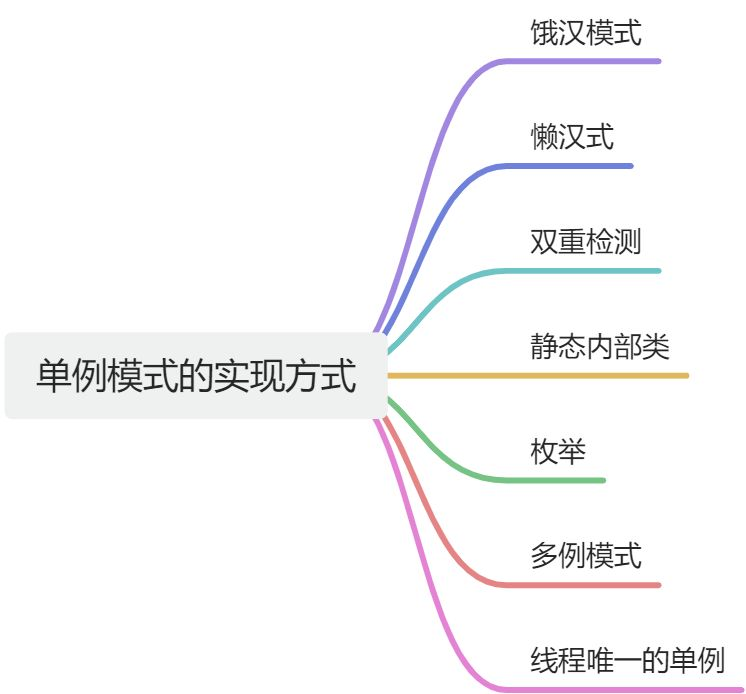
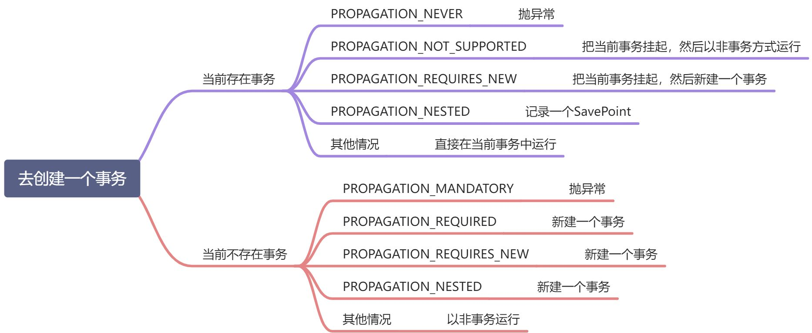
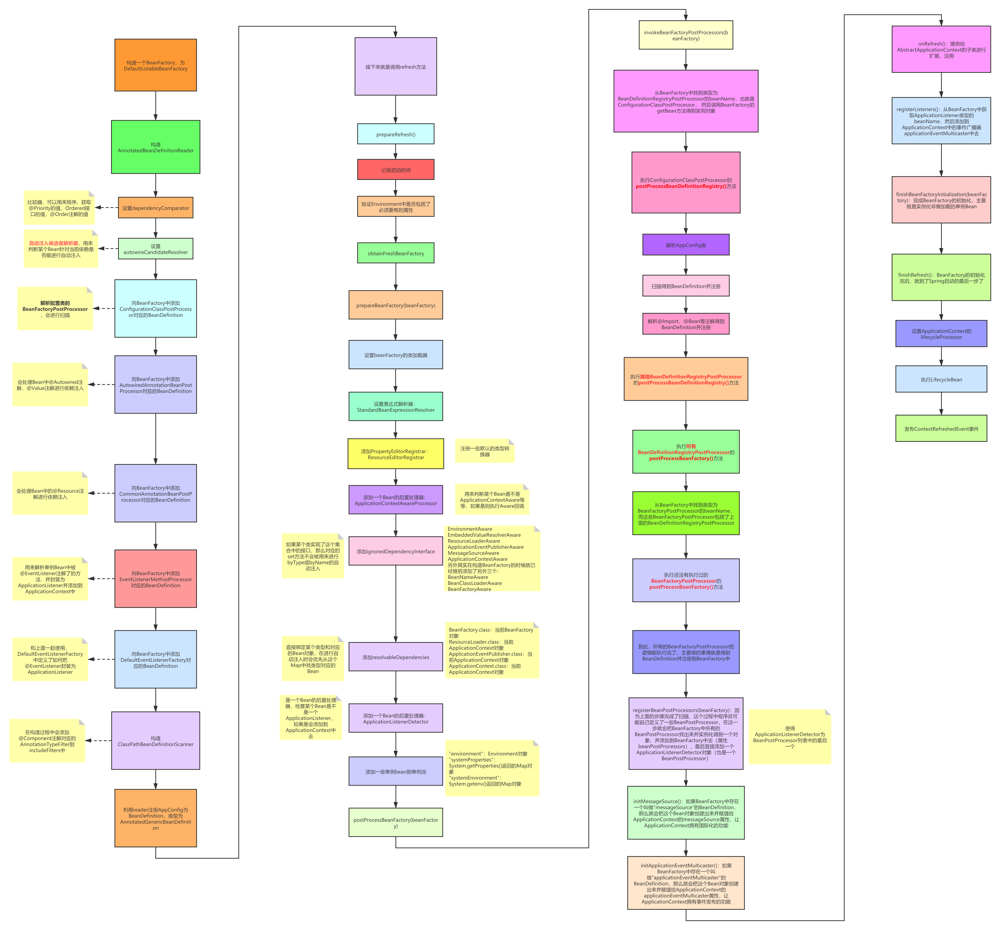

# 🔥那些面试官最喜欢问的Spring全家桶经典面试题

## 单例Bean是单例模式吗？


通常来说，单例模式是指在一个JVM中，一个类只能构造出来一个对象，有很多方法来实现单例模式，比如懒汉模式，但是我们通常讲的单例模式有一个前提条件就是规定在一个JVM中，那如果要在两个JVM中保证单例呢？那可能就要用分布式锁这些技术，这里的重点是，我们在讨论单例模式时，是要考虑范围的。


而Spring中的单例Bean也是一种单例模式，只不过范围比较小，范围是beanName，一个beanName对应同一个Bean对象，不同beanName可以对应不同的Bean对象（就算是同一个类也是可以的）。


比如：

```java
@Component
public class BailiService {


}
```

以上我们定义了一个单例Bean，beanName为 bailiService，类型为 BailiService，我们可以继续用@Bean来进一步定义：


```java
@ComponentScan("com.baili")
public class AppConfig {
    
    @Bean
    public BailiService bailiService1(){
        return new BailiService();		
    }

    @Bean
    public BailiService bailiService2(){
        return new BailiService();
    }
}
```

以上，Spring容器中将有三个BailiService类型的bean对象，他们的名字不一样。


## Bean的实例化和Bean的初始化有什么区别？


Spring在创建一个Bean对象时，会先创建出来一个Java对象，会通过反射来执行类的构造方法从而得到一个Java对象，而这个过程就是Bean的实例化。

得到Java对象后，会进行依赖注入，依赖注入之后就会进行初始化了，而Bean的初始化就是调用前面创建出来的Java对象中特定的方法，比如Java对象实现了InitializingBean接口，那么初始化的时候就会执行Java对象的afterPropertiesSet()，Spring只会执行这个方法，并不关心方法做了什么，我们可以在这个方法中去对某个属性进行验证，或者直接给某个属性赋值都是可以的，反正Bean的初始化就是执行afterPropertiesSet()方法，或者执行init-method指定的方法，比如：

```java
@Component
public class BailiService {

	public void a(){
		System.out.println("baili init");
	}
	
}
```


```java
@ComponentScan("com.baili")
public class AppConfig {

	@Bean(initMethod = "a")
	public BailiService bailiService1(){
    	return new BailiService();		
	}
}
```


## Spring AOP是如何实现的？它和AspectJ有什么区别？


Spring AOP是利用的动态代理机制，如果一个Bean实现了接口，那么就会采用JDK动态代理来生成该接口的代理对象，如果一个Bean没有实现接口，那么就会采用CGLIB来生成当前类的一个代理对象。代理对象的作用就是代理原本的Bean对象，代理对象在执行某个方法时，会在该方法的基础上增加一些切面逻辑，使得我们可以利用AOP来实现一些诸如登录校验、权限控制、日志记录等统一功能。


Spring AOP和AspectJ之间并没有特别强的关系，AOP表示面向切面编程，这是一种思想，各个组织和个人都可以通过技术来实现这种思想，AspectJ就是其中之一，它会在编译期来对类进行增强，所以要用AspectJ，得用AspectJ开发的编译器来编译你的项目。而Spring AOP则是采用动态代理的方式来实现AOP，只不过觉得AspectJ中设计的那几个注解比较好，比如@Before、@After、@Around等，同时也不给程序员造成困扰，所以Spring AOP中会对这几个注解进行支持，虽然注解是相同的，但是底层的支持实现是完全不一样的。


**<font style="color:#DF2A3F;"></font>**

## Spring中的事务是如何实现的？
1. Spring事务底层是基于数据库事务和AOP机制的
2. 首先对于使用了@Transactional注解的Bean，Spring会创建一个代理对象作为Bean
3. 当调用代理对象的方法时，会先判断该方法上是否加了@Transactional注解
4. 如果加了，那么则利用事务管理器创建一个数据库连接
5. 并且修改数据库连接的autocommit属性为false，禁止此连接的自动提交，这是实现Spring事务非常重要的一步
6. 然后执行当前方法，方法中会执行sql
7. 执行完当前方法后，如果没有出现异常就直接提交事务
8. 如果出现了异常，并且这个异常是需要回滚的就会回滚事务，否则仍然提交事务
9. Spring事务的隔离级别对应的就是数据库的隔离级别
10. Spring事务的传播机制是Spring事务自己实现的，也是Spring事务中最复杂的
11. Spring事务的传播机制是基于数据库连接来做的，一个数据库连接一个事务，如果传播机制配置为需要新开一个事务，那么实际上就是先建立一个数据库连接，在此新数据库连接上执行sql


**<font style="color:#DF2A3F;"></font>**

## 你是如何理解Spring事务的传播机制的？底层是如何实现的？



一个线程在运行过程中，可能会连续调用好几个方法，在调用某一个方法时，可能就开启了一个Spring事务，那么在调用接下来的方法时，到底是共用同一个事务呢？还是新开一个事务呢？这就是传播机制，程序员可以根据不同的业务场景进行配置，比如：

1. REQUIRED(Spring默认的事务传播类型)：如果当前没有事务，则自己新建一个事务，如果当前存在事务，则加入这个事务
2. SUPPORTS：当前存在事务，则加入当前事务，如果当前没有事务，就以非事务方法执行
3. MANDATORY：当前存在事务，则加入当前事务，如果当前事务不存在，则抛出异常。
4. REQUIRES_NEW：创建一个新事务，如果存在当前事务，则挂起该事务。
5. NOT_SUPPORTED：以非事务方式执行,如果当前存在事务，则挂起当前事务
6. NEVER：不使用事务，如果当前事务存在，则抛出异常
7. NESTED：如果当前事务存在，则在嵌套事务中执行，否则和REQUIRED的操作一样（开启一个事务）


在Spring中，一个Spring事务就是对应一个数据库连接，新开一个Spring事务其实就是新开一个数据库连接，比如执行某个方法时需要开启一个Spring事务，那么就会创建一个数据库连接，然后开始执行方法，如果方法中调用了其他方法，此时就会看这个其他方法怎么配置的：

1. 比如是REQUIRES_NEW，那么就会新开一个数据库连接，这个其中方法中的sql就会在这个新开的数据库连接中执行
2. 比如是REQUIRED，那么就不会新开，而是基于之前的数据库连接来执行方法中的sql


**<font style="color:#DF2A3F;"></font>**

## 哪些情况下会导致Spring事务失效，对应的原因是什么？


1. 方法内的自调用：Spring事务是基于AOP的，只要使用代理对象调用某个方法时，Spring事务才能生效，而在一个方法中调用使用this.xxx()调用方法时，this并不是代理对象，所以会导致事务失效。
    1. 解放办法1：把调用方法拆分到另外一个Bean中
    2. 解决办法2：自己注入自己
    3. 解决办法3：AopContext.currentProxy()+@EnableAspectJAutoProxy(exposeProxy = true)
2. 方法是private的：Spring事务会基于CGLIB来进行AOP，而CGLIB会基于父子类来失效，子类是代理类，父类是被代理类，如果父类中的某个方法是private的，那么子类就没有办法重写它，也就没有办法额外增加Spring事务的逻辑。
3. 方法是final的：原因和private是一样的，也是由于子类不能重写父类中的final的方法
4. 单独的线程调用方法：当Mybatis或JdbcTemplate执行SQL时，会从ThreadLocal中去获取数据库连接对象，如果开启事务的线程和执行SQL的线程是同一个，那么就能拿到数据库连接对象，如果不是同一个线程，那就拿到不到数据库连接对象，这样，Mybatis或JdbcTemplate就会自己去新建一个数据库连接用来执行SQL，此数据库连接的autocommit为true，那么执行完SQL就会提交，后续再抛异常也就不能再回滚之前已经提交了的SQL了。
5. 没加@Configuration注解：如果用SpringBoot基本没有这个问题，但是如果用的Spring，那么可能会有这个问题，这个问题的原因其实也是由于Mybatis或JdbcTemplate会从ThreadLocal中去获取数据库连接，但是ThreadLocal中存储的是一个MAP，MAP的key为DataSource对象，value为连接对象，而如果我们没有在AppConfig上添加@Configuration注解的话，会导致MAP中存的DataSource对象和Mybatis和JdbcTemplate中的DataSource对象不相等，从而也拿不到数据库连接，导致自己去创建数据库连接了。
6. 异常被吃掉：如果Spring事务没有捕获到异常，那么也就不会回滚了，默认情况下Spring会捕获RuntimeException和Error。
7. 类没有被Spring管理
8. 数据库不支持事务


**<font style="color:#DF2A3F;"></font>**

## Spring中的Bean创建的生命周期有哪些步骤
Spring中一个Bean的创建大概分为以下几个步骤：

1. 推断构造方法
2. 实例化
3. 填充属性，也就是依赖注入
4. 处理Aware回调
5. 初始化前，处理@PostConstruct注解
6. 初始化，处理InitializingBean接口
7. 初始化后，进行AOP


当然其实真正的步骤更加细致，可以看下面的流程图


**<font style="color:#DF2A3F;"></font>**

## Spring中Bean是线程安全的吗
Spring本身并没有针对Bean做线程安全的处理，所以：

1. 如果Bean是无状态的，那么Bean则是线程安全的
2. 如果Bean是有状态的，那么Bean则不是线程安全的


另外，Bean是不是线程安全，跟Bean的作用域没有关系，Bean的作用域只是表示Bean的生命周期范围，对于任何生命周期的Bean都是一个对象，这个对象是不是线程安全的，还是得看这个Bean对象本身。


## ApplicationContext和BeanFactory有什么区别
BeanFactory是Spring中非常核心的组件，表示Bean工厂，可以生成Bean，维护Bean，而ApplicationContext继承了BeanFactory，所以ApplicationContext拥有BeanFactory所有的特点，也是一个Bean工厂，但是ApplicationContext除开继承了BeanFactory之外，还继承了诸如EnvironmentCapable、MessageSource、ApplicationEventPublisher等接口，从而ApplicationContext还有获取系统环境变量、国际化、事件发布等功能，这是BeanFactory所不具备的


**<font style="color:#DF2A3F;"></font>**

## Spring容器启动流程是怎样的
1. 在创建Spring容器，也就是启动Spring时：
2. 首先会进行扫描，扫描得到所有的BeanDefinition对象，并存在一个Map中
3. 然后筛选出非懒加载的单例BeanDefinition进行创建Bean，对于多例Bean不需要在启动过程中去进行创建，对于多例Bean会在每次获取Bean时利用BeanDefinition去创建
4. 利用BeanDefinition创建Bean就是Bean的创建生命周期，这期间包括了合并BeanDefinition、推断构造方法、实例化、属性填充、初始化前、初始化、初始化后等步骤，其中AOP就是发生在初始化后这一步骤中
5. 单例Bean创建完了之后，Spring会发布一个容器启动事件
6. Spring启动结束
7. 在源码中会更复杂，比如源码中会提供一些模板方法，让子类来实现，比如源码中还涉及到一些BeanFactoryPostProcessor和BeanPostProcessor的注册，Spring的扫描就是通过BenaFactoryPostProcessor来实现的，依赖注入就是通过BeanPostProcessor来实现的
8. 在Spring启动过程中还会去处理@Import等注解



**<font style="color:#DF2A3F;"></font>**

**<font style="color:#DF2A3F;"></font>**

## @SpringBootApplication注解有什么用？为什么一定要写它？
@SpringBootApplication是一个复合注解：

```java
@SpringBootConfiguration
@EnableAutoConfiguration
@ComponentScan
public @interface SpringBootApplication {


}

```


是以上三个注解的整合，在一个类上只要加了@SpringBootApplication，就相当于同时加了以上的三个注解，当Spring容器在启动时，当解析到一个类上有@SpringBootApplication，那么就相当于这个类上有：

1. @ComponentScan，从而Spring容器会进行扫描，扫描路径为当前在解析的这个类所在的包路径。
2. @EnableAutoConfiguration，这个注解会负责进行自动配置类的导入，也就是将项目中的自动配置类导入到Spring容器中，从而得到解析
3. @SpringBootConfiguration，它其实就相当于是@Configuration，表示当前类是一个配置类


所以，在使用SpringBoot时，我们一般会加上@SpringBootApplication这个注解，因为只要加上了它，SpringBoot就会进行扫描，就会导入自动配置类并解析解析。


**<font style="color:#DF2A3F;"></font>**

## SpringBoot中的spring.factories文件有什么作用？
spring.factories是SpringBoot SPI机制实现的核心，SPI机制表示扩展机制，所以spring.factories文件的作用就是用来对SpringBoot进行扩展的，比如我们可以通过在该文件中去添加ApplicationListener、ApplicationContextInitializer、配置类等等，只需要在该文件中添加就可以了，而不用额外的去写什么代码。


SpringBoot在启动的过程中，会找出项目中所有的spring.factories文件，包括jar中spring.factories，从而向Spring容器中添加各个spring.factories文件中指定的ApplicationListener、ApplicationContextInitializer、配置类等组件，使得对SpringBoot做扩展非常容易了，只要引入一个jar，这个jar中有spring.factories文件，就可以把ApplicationListener等添加到Spring容器中。


**<font style="color:#DF2A3F;"></font>**

## 你是如何理解SpringBoot中的自动配置的？
在Spring中，我们通常需要去配置很多的Bean：

+ 比如用Mybatis，我们要配置SqlSessionFactory的Bean对象
+ 用AOP，我们需要配置@EnableAspectJAutoProxy注解
+ 用Spring事务，我们需要配置DataSourceTransactionManager的Bean对象
+ 用RabbitMQ，我们要配置RabbitTemplate的Bean对象
+ 等等


而我们用SpringBoot时，我们基本不用再去配这些了，因为SpringBoot帮我们配置好了，怎么做到的呢？其实就是SpringBoot内置了很多的配置类，比如

1. RabbitAutoConfiguration
2. AopAutoConfiguration
3. ElasticsearchDataAutoConfiguration
4. DataSourceTransactionManagerAutoConfiguration
5. 等等

内置的这些配置类，也可以叫做自动配置类，我们在依赖了spring-boot-starter-web后，会间接的依赖到spring-boot-autoconfigure这个jar，这个jar中都包含了很多的自动配置类：


这其实就是SpringBoot的自动配置，帮程序员提前配置了很多东西，Bean或者注解。

## springboot3 的自动配置原理？
1.通过@SpringBootConfiguration 引入了**<font style="color:rgb(223, 64, 42);">@EnableAutoConfiguration</font>** (负责启动自动配置功能）

2.@EnableAutoConfiguration 引入了**<font style="color:rgb(223, 64, 42);">@Import</font>**

3.Spring容器启动时：加载Ioc容器时会解析@Import 注解

4.@Import导入了一个**<font style="color:rgb(223, 64, 42);">deferredImportSelector</font>**(它会使SpringBoot的自动配置类的顺序在最后，这样方便我们扩展和覆盖)

5.然后读取所有的**<font style="color:rgb(223, 64, 42);">/META-INF/org.springframework.boot.autoconfigure.AutoConfiguration.imports</font>**文件（SPI)

6.过滤出所有**<font style="color:rgb(223, 64, 42);">AutoConfigurtionClass</font>**类型的类

7.最后通过**<font style="color:rgb(223, 64, 42);">@ConditioOnXXX</font>**排除无效的自动配置类


**<font style="color:#DF2A3F;"></font>**

## <font style="color:#121212;">Spring Boot启动过程中做了哪些事情？</font>
1. 首先，判断当前的应用类型，比如是不是web应用，如果是，那是servlet应用还是webflux应用，不同类型后续会创建不同的Spring容器
2. 根据应用类型创建Spring容器
3. 解析启动类，从而进行扫描、导入自动配置类并解析解析
4. 启动Tomcat或者jetty、undertow
5. 调用ApplicationRunner或CommandLineRunner


以上至少一些核心的，其实整个启动过程中还包含了SpringApplicationRunListeners的调用、banner的打印、ApplicationContextInitializer的执行等，具体可以参照源码。

<font style="color:#F5222D;"></font>

**<font style="color:#DF2A3F;"></font>**

## SpringMVC处理请求的流程是什么？
1. 在启动Tomcat过程中，会创建DispatcherServlet对象，并执行它的初始化逻辑
2. DispatcherServlet初始化过程中会创建Spring容器（根据用户的Spring配置）
3. 然后初始化过程中还是初始化HandlerMapping、HandlerAdapter等等
4. SpringMVC中默认提供了好几个HandlerMapping，其中有一个为RequestMappingHandlerMapping
5. RequestMappingHandlerMapping的作用是去寻找Spring容器中有哪些加了@RequestMapping的方法
6. 找到这些方法后，就会解析该注解上的信息，包含了指定的path，然后就把path作为key，Method作为value存到一个map中
7. 当DispatcherServlet接收到请求后，RequestMappingHandlerMapping就会负责根据请求路径从map中找到对应的Method
8. 然后准备执行Method，只不过，在执行Method之前，会解析该方法的各个参数
9. 比如参数前面加了@RequestParam注解，那SpringMVC就会解析该注解，并从请求中取出对应request param中的数据传给该参数
10. 解析完各个参数并从请求中拿到了对应的值之后，就会执行方法了
11. 执行完方法得到了方法返回值后，SpringMVC会进一步解析
12. 比如方法上如果加了@ResponseBody，那么就直接把返回值返回给浏览器
13. 如果方法上没有加@ResponseBody，那么就要根据返回值找到对应的页面，并进行服务端渲染，再把渲染结果返回给浏览器

<font style="color:#DF2A3F;"></font>

**<font style="color:#DF2A3F;"></font>**

## SpringMVC中的重定向和转发分别是如何实现的？
1. 我们可以使用**forward:**来对当前请求进行转发
2. 可以用**redirect:**来对当前请求进行重定向
3. 当SpringMVC接收到一个请求后，会先处理请求，如果后续方法要进行转发，就会利用RequestDispatcher将当前请求转发到指定地址，这种情况下，一直是同一个请求，只不过两次请求的路径不一样，并且转发对于浏览器而言是透明的
4. 而如果SpringMVC接收到一个请求，并进行处理后，发现要进行重定向，此时SpringMVC会向浏览器响应303，同时会告诉浏览器要重定向的路径，表示告诉浏览器要访问另外一个路径，由浏览器自己来访问，所以重定向是需要浏览器参与的，是不同的两个请求

## 
