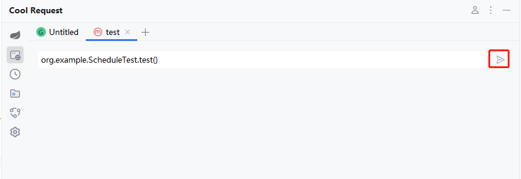
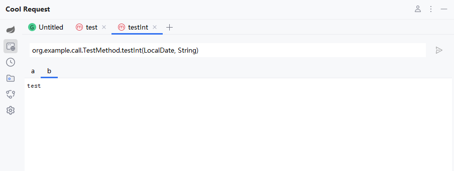
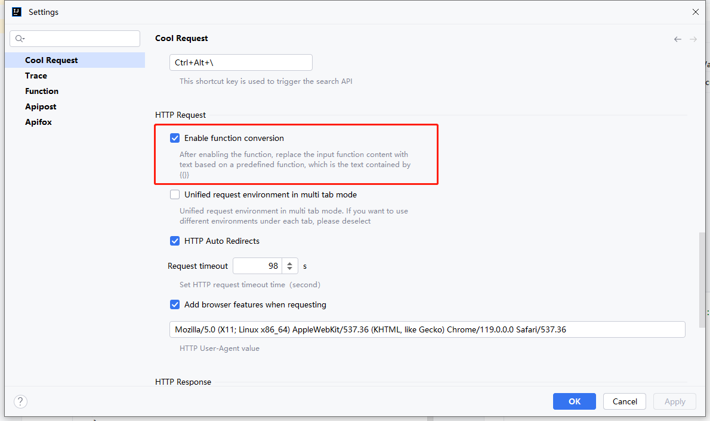

# 不用写一行代码就能统计方法耗时

# <font style="color:rgb(28, 30, 33);">什么是Cool Request</font>
<font style="color:rgb(28, 30, 33);">Cool Request是一款基于 IntelliJ IDEA 的插件，旨在简化 Spring MVC(Boot) 项目中 API调试调用，提供了强大的参数推测能力、方法耗时追踪、运行时反射调用等能力</font>

# <font style="color:rgb(28, 30, 33);">特色功能</font>
## 统计方法耗时
### <font style="color:rgb(28, 30, 33);">开启耗时追踪</font>
<font style="color:rgb(28, 30, 33);">Cool Request默认关闭方法耗时追踪，如果开启后，会影响第一次发起API时的速度，如果不需要耗时追踪，可点击关闭</font>  
 

### <font style="color:rgb(28, 30, 33);">发起追踪</font>
<font style="color:rgb(28, 30, 33);">当正常发起HTTP请求时，Cool Request将分析一次目标方法，根据设置的最大深度，尽可能多的追踪方法，这需要花费一些时间，且视所设置最大深度为定。</font>

<font style="color:rgb(28, 30, 33);">自动分析时，如果遇到了对interface形式的调用，则无法分析impl实现的方法，不会统计该方法，解决办法是改用注入impl的类，而不是service，或者使用</font>`<font style="color:rgb(28, 30, 33);">添加/取消自定义</font>`<font style="color:rgb(28, 30, 33);">方法手动添加impl方法。</font>


### <font style="color:rgb(28, 30, 33);">添加/取消自定义方法</font>
<font style="color:rgb(28, 30, 33);">如果自动分析无法满足需求，可在任意方法体内右击，选择</font>`<font style="color:rgb(28, 30, 33);">Cool Request -> Add/Cancel Method To Trace</font>`<font style="color:rgb(28, 30, 33);">，添加/取消目标方法。</font>


### <font style="color:rgb(28, 30, 33);">失效情况</font>
<font style="color:rgb(28, 30, 33);">有些原因可能会导致跟踪失效</font>

1. <font style="color:rgb(28, 30, 33);">当Controller内部抛出异常时，Trace将失效，请确保链路中无异常。</font>
2. <font style="color:rgb(28, 30, 33);">非SpringBoot项目</font>
3. <font style="color:rgb(28, 30, 33);">使用了jrebel启动(理论支持，但如果失效，可正常启动重新尝试)</font>

## <font style="color:rgb(28, 30, 33);">调用任意方法</font>
<font style="color:rgb(28, 30, 33);">Cool Request支持在SpringBoot运行时调用任意容器内实例的方法、同时也包括静态方法。</font>

### <font style="color:rgb(28, 30, 33);">使用教程</font>
<font style="color:rgb(28, 30, 33);">在想要调用的方法体内右击，选择CoolRequest->Call this Method</font>


<font style="color:rgb(28, 30, 33);">接着点击运行按钮即可。</font>



<font style="color:rgb(28, 30, 33);">当然，Cool Request支持大量常见的参数传递</font>


<font style="color:rgb(28, 30, 33);"> </font>

## <font style="color:rgb(28, 30, 33);">自定义函数</font>
<font style="color:rgb(28, 30, 33);">Cool Request拥有最强大得函数支持系统，当HTTP参数想要使用动态参数时，可根据自己需求，编写自定义函数。</font>

<font style="color:rgb(28, 30, 33);">函数可使用在任意HTTP参数中，包括请求头、URL参数、Path变量、请求体中。</font>


<font style="color:rgb(28, 30, 33);">例如想要增加一个自定义函数，可编写以下代码。</font>

```java
public String custom(){
    return "custom";
}
```

<font style="color:rgb(28, 30, 33);">在任意HTTP参数值中，通过</font>`<font style="color:rgb(28, 30, 33);">{{函数名}}</font>`<font style="color:rgb(28, 30, 33);">来引用此函数。</font>


### <font style="color:rgb(28, 30, 33);">关闭函数转换</font>
<font style="color:rgb(28, 30, 33);">如果想关闭函数转换，可以设置中禁用</font>



## <font style="color:rgb(28, 30, 33);">发起反射请求</font>
### <font style="color:rgb(28, 30, 33);">什么反射请求</font>
<font style="color:rgb(28, 30, 33);">发射请求可绕过系统中的拦截器，在开发时，可直接使请求进入到Controller方法。</font>

<font style="color:rgb(28, 30, 33);">普通HTTP请求的流程如下：</font>

1. <font style="color:rgb(28, 30, 33);">构造HTTP参数</font>
2. <font style="color:rgb(28, 30, 33);">发起HTTP请求</font>
3. <font style="color:rgb(28, 30, 33);">进入Web容器</font>
4. <font style="color:rgb(28, 30, 33);">进入过滤器</font>
5. <font style="color:rgb(28, 30, 33);">进入拦截器</font>
6. <font style="color:rgb(28, 30, 33);">进入Controller</font>

<font style="color:rgb(28, 30, 33);">而反射请求可以跳过其中的第3、第4步骤，而第5步是可选的，反射的流程如下：</font>

1. <font style="color:rgb(28, 30, 33);">构造HTTP参数</font>
2. <font style="color:rgb(28, 30, 33);">发起HTTP请求</font>
3. <font style="color:rgb(28, 30, 33);">进入拦截器（可选择是否应用拦截器）</font>
4. <font style="color:rgb(28, 30, 33);">进入Controller</font>

<font style="color:rgb(28, 30, 33);">进入参数配置界面，在左侧下拉框选中如下所示：</font>

<font style="color:rgb(28, 30, 33);"> </font>

<font style="color:rgb(28, 30, 33);">点击右侧 </font><font style="color:rgb(28, 30, 33);"> 按钮即可发起反射请求。</font>

## <font style="color:rgb(28, 30, 33);">Spring网关</font>
<font style="color:rgb(28, 30, 33);">Cool Request在网关程序启动后，会自动提取网关配置的路径，并添加到环境变量中，用户只需要根据实际修改配置即可。</font>

<font style="color:rgb(28, 30, 33);">例如有以下代码：</font>

```java
@Configuration
public class Config {
    @Bean
    public RouteLocator customRouteLocator(RouteLocatorBuilder builder) {
        return builder.routes()
                .route("apiroute", r -> r.path("/api/**")
                        .filters(f -> f.stripPrefix(1))
                        .uri("http://localhost:8080"))
                .build();
    }
}
```

<font style="color:rgb(28, 30, 33);">启动成功点击环境设置，可以发现会有一个名为</font>`<font style="color:rgb(28, 30, 33);">apiroute</font>`<font style="color:rgb(28, 30, 33);">的环境。</font>

**<font style="color:rgb(28, 30, 33);">官网地址：</font>**[**https://coolrequest.dev/docs/feat/spring_gateway/**](https://coolrequest.dev/docs/feat/spring_gateway/)


> 原文: <https://www.yuque.com/tulingzhouyu/db22bv/mknt2g3ukflkcb0v>