# 💎 Java面试题大全

## JDK、JRE、JVM之间的区别

+ JDK(Java SE Development Kit)，Java标准开发包，它提供了**编译**、**运行**Java程序所需的各种工具和资源，包括**Java编译器**、**Java运行时环境**，以及常用的**Java类库**等
+ JRE( Java Runtime Environment) ，Java运行环境，用于**运行**Java的字节码文件。JRE中包括了JVM以及JVM工作所需要的类库，普通用户而只需要安装JRE来运行Java程序，而程序开发者必须安装JDK来编译、调试程序。
+ JVM(Java Virtual Machine)，Java虚拟机，是JRE的一部分，它是整个java实现跨平台的最核心的部分，负责运行字节码文件。

我们写Java代码，用txt就可以写，但是写出来的Java代码，想要运行，需要先编译成字节码，那就需要编译器，而JDK中就包含了编译器javac，编译之后的字节码，想要运行，就需要一个可以执行字节码的程序，这个程序就是JVM（Java虚拟机），专门用来执行Java字节码的。

如果我们要开发Java程序，那就需要JDK，因为要编译Java源文件。

如果我们只想运行已经编译好的Java字节码文件，也就是*.class文件，那么就只需要JRE。

JDK中包含了JRE，JRE中包含了JVM。

另外，JVM在执行Java字节码时，需要把字节码解释为机器指令，而不同操作系统的机器指令是有可能不一样的，所以就导致不同操作系统上的JVM是不一样的，所以我们在安装JDK时需要选择操作系统。

另外，JVM是用来执行Java字节码的，所以凡是某个代码编译之后是Java字节码，那就都能在JVM上运行，比如Apache Groovy, Scala and Kotlin 等等。

## hashCode()与equals()之间的关系

在Java中，每个对象都可以调用自己的hashCode()方法得到自己的哈希值(hashCode)，相当于对象的指纹信息，通常来说世界上没有完全相同的两个指纹，但是在Java中做不到这么绝对，但是我们仍然可以利用hashCode来做一些提前的判断，比如：

+ 如果两个对象的hashCode不相同，那么这两个对象肯定不同的两个对象
+ 如果两个对象的hashCode相同，不代表这两个对象一定是同一个对象，也可能是两个对象
+ 如果两个对象相等，那么他们的hashCode就一定相同

在Java的一些集合类的实现中，在比较两个对象是否相等时，会根据上面的原则，会先调用对象的hashCode()方法得到hashCode进行比较，如果hashCode不相同，就可以直接认为这两个对象不相同，如果hashCode相同，那么就会进一步调用equals()方法进行比较。而equals()方法，就是用来最终确定两个对象是不是相等的，通常equals方法的实现会比较重，逻辑比较多，而hashCode()主要就是得到一个哈希值，实际上就一个数字，相对而言比较轻，所以在比较两个对象时，通常都会先根据hashCode想比较一下。

所以我们就需要注意，如果我们重写了equals()方法，那么就要注意hashCode()方法，一定要保证能遵守上述规则。

## String、StringBuffer、StringBuilder的区别

1. String是不可变的，如果尝试去修改，会新生成一个字符串对象，StringBuffer和StringBuilder是可变的
2. StringBuffer是线程安全的，StringBuilder是线程不安全的，所以在单线程环境下StringBuilder效率会更高

## 泛型中extends和super的区别

1. `<? extends T>`表示包括T在内的任何T的子类
2. `<? super T>`表示包括T在内的任何T的父类

## ==和equals方法的区别

+ ==：如果是基本数据类型，比较是值，如果是引用类型，比较的是引用地址
+ equals：具体看各个类重写equals方法之后的比较逻辑，比如String类，虽然是引用类型，但是String类中重写了equals方法，方法内部比较的是字符串中的各个字符是否全部相等。

## 重载和重写的区别

+ 重载(Overload)： 在一个类中，同名的方法如果有不同的参数列表（比如参数类型不同、参数个数不同）则视为重载。
+ 重写(Override)： 从字面上看，重写就是 重新写一遍的意思。其实就是在子类中把父类本身有的方法重新写一遍。子类继承了父类的方法，但有时子类并不想原封不动的继承父类中的某个方法，所以在方法名，参数列表，返回类型都相同(子类中方法的返回值可以是父类中方法返回值的子类)的情况下， 对方法体进行修改，这就是重写。但要注意子类方法的访问修饰权限不能小于父类的。

## List和Set的区别

+ List：有序，按对象插入的顺序保存对象，可重复，允许多个Null元素对象，可以使用Iterator取出所有元素，在逐一遍历，还可以使用get(int index)获取指定下标的元素
+ Set：无序，不可重复，最多允许有一个Null元素对象，取元素时只能用Iterator接口取得所有元素，在逐一遍历各个元素

## ArrayList的底层工作原理

1. 在构造ArrayList时，如果没有指定容量，那么内部会构造一个空数组，如果指定了容量，那么就构造出对应容量大小的数组
2. 在添加元素时，会先判断数组容量是否足够，如果不够则会扩容，扩容按1.5倍扩容，容量足够后，再把元素添加到数组中
3. 在添加元素时，如果指定了下标，先检查下标是否越界，然后再确认数组容量是否足够，不够则扩容，然后再把新元素添加到指定位置，如果该位置后面有元素则后移
4. 再获取指定下标的元素时，先检查下标是否越界，然后从数组中取出对应位置的元素

## ArrayList和LinkedList区别

1. 首先，他们的底层数据结构不同，ArrayList底层是基于数组实现的，LinkedList底层是基于链表实现的
2. 由于底层数据结构不同，他们所适用的场景也不同，ArrayList更适合随机查找，LinkedList更适合删除和添加，查询、添加、删除的时间复杂度不同
3. 另外ArrayList和LinkedList都实现了List接口，但是LinkedList还额外实现了Deque接口，所以LinkedList还可以当做队列来使用

## 谈谈ConcurrentHashMap的扩容机制

1.7版本

1. 1.7版本的ConcurrentHashMap是基于Segment分段实现的
2. 每个Segment相对于一个小型的HashMap
3. 每个Segment内部会进行扩容，和HashMap的扩容逻辑类似
4. 先生成新的数组，然后转移元素到新数组中
5. 扩容的判断也是每个Segment内部单独判断的，判断是否超过阈值

1.8版本

1. 1.8版本的ConcurrentHashMap不再基于Segment实现
2. 当某个线程进行put时，如果发现ConcurrentHashMap正在进行扩容那么该线程一起进行扩容
3. 如果某个线程put时，发现没有正在进行扩容，则将key-value添加到ConcurrentHashMap中，然后判断是否超过阈值，超过了则进行扩容
4. ConcurrentHashMap是支持多个线程同时扩容的
5. 扩容之前也先生成一个新的数组
6. 在转移元素时，先将原数组分组，将每组分给不同的线程来进行元素的转移，每个线程负责一组或多组的元素转移工作

## Jdk1.7到Jdk1.8 HashMap 发生了什么变化(底层)?

1. 1.7中底层是数组+链表，1.8中底层是数组+链表+红黑树，加红黑树的目的是提高HashMap插入和查询整体效率
2. 1.7中链表插入使用的是头插法，1.8中链表插入使用的是尾插法，因为1.8中插入key和value时需要判断链表元素个数，所以需要遍历链表统计链表元素个数，所以正好就直接使用尾插法
3. 1.7中哈希算法比较复杂，存在各种右移与异或运算，1.8中进行了简化，因为复杂的哈希算法的目的就是提高散列性，来提供HashMap的整体效率，而1.8中新增了红黑树，所以可以适当的简化哈希算法，节省CPU资源

## 说一下HashMap的Put方法

先说HashMap的Put方法的大体流程：

1. 根据Key通过哈希算法与与运算得出数组下标
2. 如果数组下标位置元素为空，则将key和value封装为Entry对象（JDK1.7中是Entry对象，JDK1.8中是Node对象）并放入该位置
3. 如果数组下标位置元素不为空，则要分情况讨论
    1. 如果是JDK1.7，则先判断是否需要扩容，如果要扩容就进行扩容，如果不用扩容就生成Entry对象，并使用头插法添加到当前位置的链表中
    2. 如果是JDK1.8，则会先判断当前位置上的Node的类型，看是红黑树Node，还是链表Node
        1. 如果是红黑树Node，则将key和value封装为一个红黑树节点并添加到红黑树中去，在这个过程中会判断红黑树中是否存在当前key，如果存在则更新value
        2. 如果此位置上的Node对象是链表节点，则将key和value封装为一个链表Node并通过尾插法插入到链表的最后位置去，因为是尾插法，所以需要遍历链表，在遍历链表的过程中会判断是否存在当前key，如果存在则更新value，当遍历完链表后，将新链表Node插入到链表中，插入到链表后，会看当前链表的节点个数，如果大于等于8，那么则会将该链表转成红黑树
        3. 将key和value封装为Node插入到链表或红黑树中后，再判断是否需要进行扩容，如果需要就扩容，如果不需要就结束PUT方法

## 深拷贝和浅拷贝

深拷贝和浅拷贝就是指对象的拷贝，一个对象中存在两种类型的属性，一种是基本数据类型，一种是实例对象的引用。

1. 浅拷贝是指，只会拷贝基本数据类型的值，以及实例对象的引用地址，并不会复制一份引用地址所指向的对象，也就是浅拷贝出来的对象，内部的类属性指向的是同一个对象
2. 深拷贝是指，既会拷贝基本数据类型的值，也会针对实例对象的引用地址所指向的对象进行复制，深拷贝出来的对象，内部的属性指向的不是同一个对象

## HashMap的扩容机制原理

1.7版本

1. 先生成新数组
2. 遍历老数组中的每个位置上的链表上的每个元素
3. 取每个元素的key，并基于新数组长度，计算出每个元素在新数组中的下标
4. 将元素添加到新数组中去
5. 所有元素转移完了之后，将新数组赋值给HashMap对象的table属性

1.8版本

1. 先生成新数组
2. 遍历老数组中的每个位置上的链表或红黑树
3. 如果是链表，则直接将链表中的每个元素重新计算下标，并添加到新数组中去
4. 如果是红黑树，则先遍历红黑树，先计算出红黑树中每个元素对应在新数组中的下标位置
    1. 统计每个下标位置的元素个数
    2. 如果该位置下的元素个数超过了 8，则生成一个新的红黑树，并将根节点的添加到新数组的对应位置
    3. 如果该位置下的元素个数没有超过6，那么则生成一个链表，并将链表的头节点添加到新数组的对应位置
5. 所有元素转移完了之后，将新数组赋值给HashMap对象的table属性

## CopyOnWriteArrayList的底层原理是怎样的

1. 首先CopyOnWriteArrayList内部也是用过数组来实现的，在向CopyOnWriteArrayList添加元素时，会复制一个新的数组，写操作在新数组上进行，读操作在原数组上进行
2. 并且，写操作会加锁，防止出现并发写入丢失数据的问题
3. 写操作结束之后会把原数组指向新数组
4. CopyOnWriteArrayList允许在写操作时来读取数据，大大提高了读的性能，因此适合读多写少的应用场景，但是CopyOnWriteArrayList会比较占内存，同时可能读到的数据不是实时最新的数据，所以不适合实时性要求很高的场景

## 什么是字节码？采用字节码的好处是什么？

编译器(javac)将Java源文件(*.java)文件编译成为字节码文件(*.class)，可以做到一次编译到处运行，windows上编译好的class文件，可以直接在linux上运行，通过这种方式做到跨平台，不过Java的跨平台有一个前提条件，就是不同的操作系统上安装的JDK或JRE是不一样的，虽然字节码是通用的，但是需要把字节码解释成各个操作系统的机器码是需要不同的解释器的，所以针对各个操作系统需要有各自的JDK或JRE。

采用字节码的好处，一方面实现了跨平台，另外一方面也提高了代码执行的性能，编译器在编译源代码时可以做一些编译期的优化，比如锁消除、标量替换、方法内联等。

## Java中的异常体系是怎样的

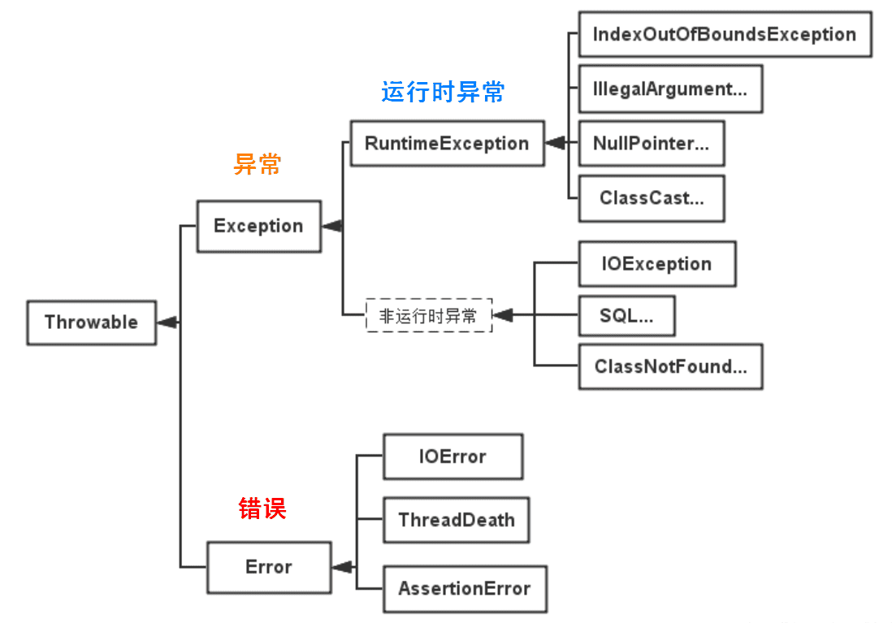

+ Java中的所有异常都来自顶级父类Throwable。
+ Throwable下有两个子类Exception和Error。
+ Error表示非常严重的错误，比如java.lang.StackOverFlowError和Java.lang.OutOfMemoryError，通常这些错误出现时，仅仅想靠程序自己是解决不了的，可能是虚拟机、磁盘、操作系统层面出现的问题了，所以通常也不建议在代码中去捕获这些Error，因为捕获的意义不大，因为程序可能已经根本运行不了了。
+ Exception表示异常，表示程序出现Exception时，是可以靠程序自己来解决的，比如NullPointerException、IllegalAccessException等，我们可以捕获这些异常来做特殊处理。
+ Exception的子类通常又可以分为RuntimeException和非RuntimeException两类
+ RunTimeException表示运行期异常，表示这个异常是在代码运行过程中抛出的，这些异常是非检查异常，程序中可以选择捕获处理，也可以不处理。这些异常一般是由程序逻辑错误引起的，程序应该从逻辑角度尽可能避免这类异常的发生，比如NullPointerException、IndexOutOfBoundsException等。
+ 非RuntimeException表示非运行期异常，也就是我们常说的检查异常，是必须进行处理的异常，如果不处理，程序就不能检查异常通过。如IOException、SQLException等以及用户自定义的Exception异常。

## 在Java的异常处理机制中，什么时候应该抛出异常，什么时候捕获异常？

异常相当于一种提示，如果我们抛出异常，就相当于告诉上层方法，我抛了一个异常，我处理不了这个异常，交给你来处理，而对于上层方法来说，它也需要决定自己能不能处理这个异常，是否也需要交给它的上层。

所以我们在写一个方法时，我们需要考虑的就是，本方法能否合理的处理该异常，如果处理不了就继续向上抛出异常，包括本方法中在调用另外一个方法时，发现出现了异常，如果这个异常应该由自己来处理，那就捕获该异常并进行处理。

## 什么是Java中的泛型擦除？

JDK1.5及1.5之前都是没有泛型的概念的，JDK1.5之后引入了泛型的概念并为了与之前的JDK版本兼容，所以引入了泛型擦除的概念。


以下两个类型是相等的，表面泛型被擦除了，都是ArrayList

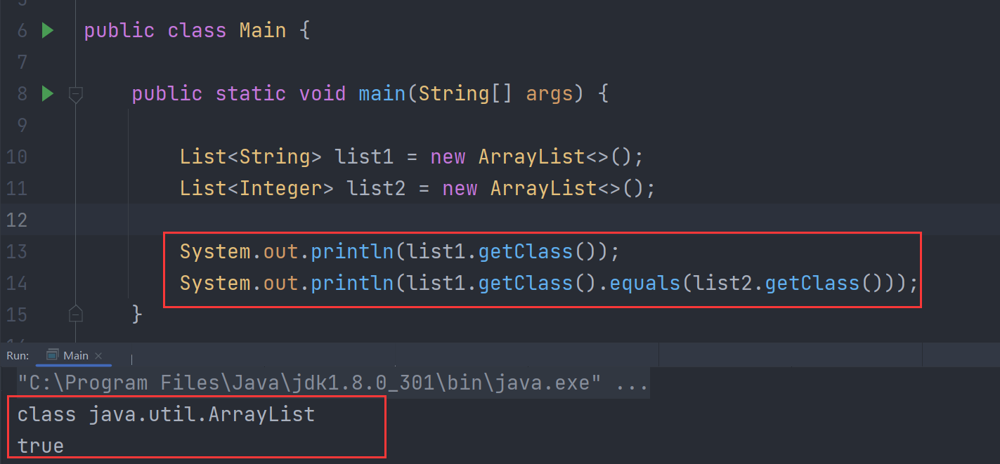

以下API，只能拿到泛型的个数，不能拿到具体的泛型类型


通过放射可以往List添加不同类型的元素，因为类型其实被擦除了，变成了Object

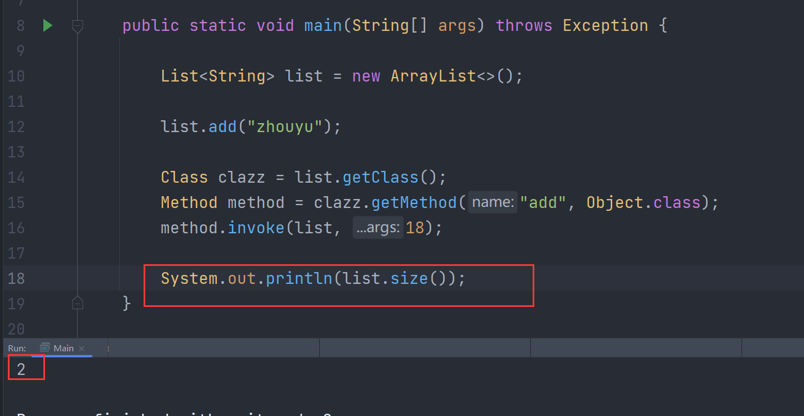

泛型虽然被擦除了，但是具体的泛型信息还是被保存在了字节码中

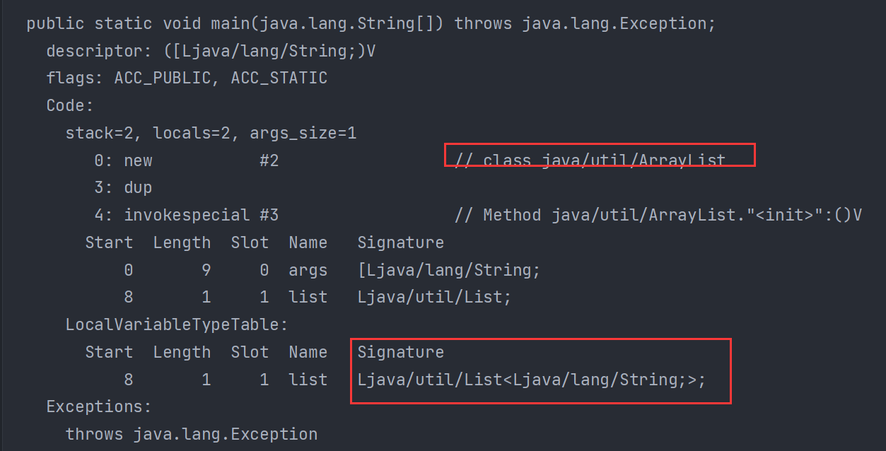

所以还是有一些方式可以很方便的获取到泛型的真实类型的

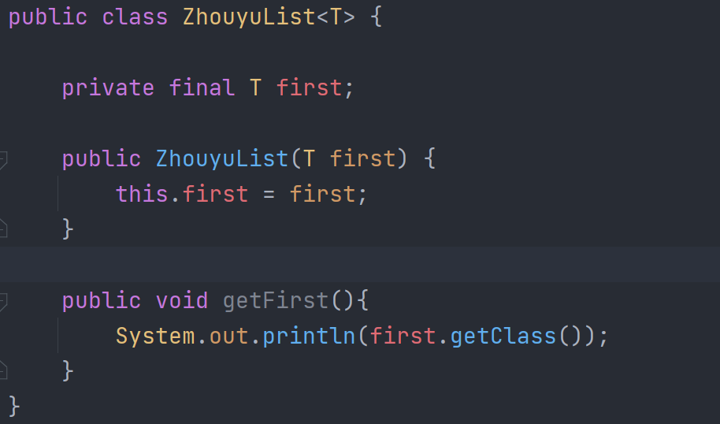

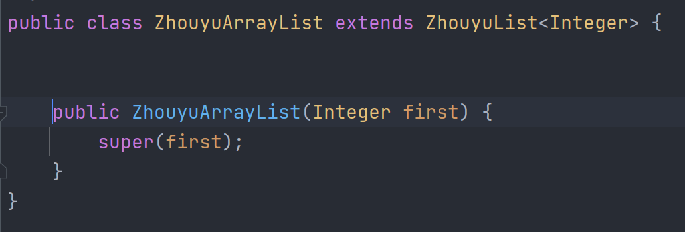


另外，对于JVM，如果对每个泛型类型都生成不同的目标代码，假如现在有10个不同泛型的List，就要生成10份字节码，这样会造成不仅造成代码膨胀，而且一份字节码对应一个Class对象，占据大量的内存。

## Java中有哪些类加载器


JDK自带有三个类加载器：bootstrap ClassLoader、ExtClassLoader、AppClassLoader。  

+ BootStrapClassLoader是ExtClassLoader的父类加载器，默认负责加载%JAVA_HOME%lib下的jar包和class文件。
+ ExtClassLoader是AppClassLoader的父类加载器，负责加载%JAVA_HOME%/lib/ext文件夹下的jar包和class类。
+ AppClassLoader是自定义类加载器的父类，负责加载classpath下的类文件。

## 说说类加载器双亲委派模型

JVM中存在三个默认的类加载器：

1. BootstrapClassLoader
2. ExtClassLoader
3. AppClassLoader

AppClassLoader的父加载器是ExtClassLoader，ExtClassLoader的父加载器是BootstrapClassLoader。

JVM在加载一个类时，会调用AppClassLoader的loadClass方法来加载这个类，不过在这个方法中，会先使用ExtClassLoader的loadClass方法来加载类，同样ExtClassLoader的loadClass方法中会先使用BootstrapClassLoader来加载类，如果BootstrapClassLoader加载到了就直接成功，如果BootstrapClassLoader没有加载到，那么ExtClassLoader就会自己尝试加载该类，如果没有加载到，那么则会由AppClassLoader来加载这个类。

所以，双亲委派指得是，JVM在加载类时，会委派给Ext和Bootstrap进行加载，如果没加载到才由自己进行加载。

## JVM中哪些是线程共享区

堆区和方法区是所有线程共享的，栈、本地方法栈、程序计数器是每个线程独有的


## 你们项目如何排查JVM问题

对于还在正常运行的系统：

1. 可以使用jmap来查看JVM中各个区域的使用情况
2. 可以通过jstack来查看线程的运行情况，比如哪些线程阻塞、是否出现了死锁
3. 可以通过jstat命令来查看垃圾回收的情况，特别是fullgc，如果发现fullgc比较频繁，那么就得进行调优了
4. 通过各个命令的结果，或者jvisualvm等工具来进行分析
5. 首先，初步猜测频繁发送fullgc的原因，如果频繁发生fullgc但是又一直没有出现内存溢出，那么表示fullgc实际上是回收了很多对象了，所以这些对象最好能在younggc过程中就直接回收掉，避免这些对象进入到老年代，对于这种情况，就要考虑这些存活时间不长的对象是不是比较大，导致年轻代放不下，直接进入到了老年代，尝试加大年轻代的大小，如果改完之后，fullgc减少，则证明修改有效
6. 同时，还可以找到占用CPU最多的线程，定位到具体的方法，优化这个方法的执行，看是否能避免某些对象的创建，从而节省内存

对于已经发生了OOM的系统：

1. 一般生产系统中都会设置当系统发生了OOM时，生成当时的dump文件（-XX:+HeapDumpOnOutOfMemoryError -XX:HeapDumpPath=/usr/local/base）
2. 我们可以利用jsisualvm等工具来分析dump文件
3. 根据dump文件找到异常的实例对象，和异常的线程（占用CPU高），定位到具体的代码
4. 然后再进行详细的分析和调试

总之，调优不是一蹴而就的，需要分析、推理、实践、总结、再分析，最终定位到具体的问题

## JVM出现OOM异常会导致进程挂掉吗？

当一个线程在执行代码的过程中，大概率需要创建对象，而创建对象就需要分配内存，如果JVM可用内存不够时会进行垃圾回收，如果垃圾回收完了之后内存还是不够就会抛出OutOfMemoryError，如果没有捕获OutOfMemoryError，那么就像抛出一个普通异常一样会导致线程停掉，如果捕获了OutOfMemoryError，那么线程可能就不会停掉，其实不管当前线程会不会停掉，跟进程会不会挂掉没有直接关系，也就是出现了OutOfMemoryError最多只会导致线程停掉，如果一个进程里面的所有非守护线程都停掉了，那么进程才会停掉，或者进程占了操作系统的过多内存，那么这个进程可能会被操作系统关闭掉。

## 一个对象从加载到JVM，再到被GC清除，都经历了什么过程？

1. 首先把字节码文件内容加载到方法区
2. 然后再根据类信息在堆区创建对象
3. 对象首先会分配在堆区中年轻代的Eden区，经过一次Minor GC后，对象如果存活，就会进入Suvivor区。在后续的每次Minor GC中，如果对象一直存活，就会在Suvivor区来回拷贝，每移动一次，年龄加1
4. 当年龄超过15后，对象依然存活，对象就会进入老年代
5. 如果经过Full GC，被标记为垃圾对象，那么就会被GC线程清理掉

## 怎么确定一个对象到底是不是垃圾？

1. 引用计数算法： 这种方式是给堆内存当中的每个对象记录一个引用个数。引用个数为0的就认为是垃圾。这是早期JDK中使用的方式。引用计数无法解决循环引用的问题。
2. 可达性算法： 这种方式是在内存中，从根对象向下一直找引用，找到的对象就不是垃圾，没找到的对象就是垃圾。

## JVM有哪些垃圾回收算法？

1. 标记清除算法：
    1. 标记阶段：把垃圾内存标记出来
    2. 清除阶段：直接将垃圾内存回收。
    3. 这种算法是比较简单的，但是有个很严重的问题，就是会产生大量的内存碎片。
2. 复制算法：为了解决标记清除算法的内存碎片问题，就产生了复制算法。复制算法将内存分为大小相等的两半，每次只使用其中一半。垃圾回收时，将当前这一块的存活对象全部拷贝到另一半，然后当前这一半内存就可以直接清除。这种算法没有内存碎片，但是他的问题就在于浪费空间。而且，他的效率跟存活对象的个数有关。
3. 标记压缩算法：为了解决复制算法的缺陷，就提出了标记压缩算法。这种算法在标记阶段跟标记清除算法是一样的，但是在完成标记之后，不是直接清理垃圾内存，而是将存活对象往一端移动，然后将边界以外的所有内存直接清除。

## 什么是STW？

STW: Stop-The-World，是在垃圾回收算法执行过程当中，需要将JVM内存冻结的一种状态。在STW状态下，JAVA的所有线程都是停止执行的-GC线程除外，native方法可以执行，但是，不能与JVM交互。GC各种算法优化的重点，就是减少STW，同时这也是JVM调优的重点。

## JVM参数有哪些？

JVM参数大致可以分为三类：

1. 标注指令： -开头，这些是所有的HotSpot都支持的参数。可以用java -help 打印出来。
2. 非标准指令： -X开头，这些指令通常是跟特定的HotSpot版本对应的。可以用java -X 打印出来。
3. 不稳定参数： -XX 开头，这一类参数是跟特定HotSpot版本对应的，并且变化非常大。

##

## 说说对线程安全的理解

线程安全指的是，我们写的某段代码，在多个线程同时执行这段代码时，不会产生混乱，依然能够得到正常的结果，比如i++，i初始化值为0，那么两个线程来同时执行这行代码，如果代码是线程安全的，那么最终的结果应该就是一个线程的结果为1，一个线程的结果为2，如果出现了两个线程的结果都为1，则表示这段代码是线程不安全的。

所以线程安全，主要指的是一段代码在多个线程同时执行的情况下，能否得到正确的结果。

## 对守护线程的理解

线程分为用户线程和守护线程，用户线程就是普通线程，守护线程就是JVM的后台线程，比如垃圾回收线程就是一个守护线程，守护线程会在其他普通线程都停止运行之后自动关闭。我们可以通过设置thread.setDaemon(true)来把一个线程设置为守护线程。

## ThreadLocal的底层原理

1. ThreadLocal是Java中所提供的线程本地存储机制，可以利用该机制将数据缓存在某个线程内部，该线程可以在任意时刻、任意方法中获取缓存的数据
2. ThreadLocal底层是通过ThreadLocalMap来实现的，每个Thread对象（注意不是ThreadLocal对象）中都存在一个ThreadLocalMap，Map的key为ThreadLocal对象，Map的value为需要缓存的值
3. 如果在线程池中使用ThreadLocal会造成内存泄漏，因为当ThreadLocal对象使用完之后，应该要把设置的key，value，也就是Entry对象进行回收，但线程池中的线程不会回收，而线程对象是通过强引用指向ThreadLocalMap，ThreadLocalMap也是通过强引用指向Entry对象，线程不被回收，Entry对象也就不会被回收，从而出现内存泄漏，解决办法是，在使用了ThreadLocal对象之后，手动调用ThreadLocal的remove方法，手动清楚Entry对象
4. ThreadLocal经典的应用场景就是连接管理（一个线程持有一个连接，该连接对象可以在不同的方法之间进行传递，线程之间不共享同一个连接）

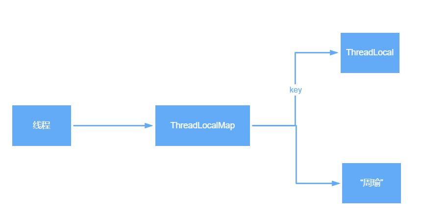

## 并发、并行、串行之间的区别

1. 串行：一个任务执行完，才能执行下一个任务
2. 并行(Parallelism)：两个任务同时执行
3. 并发(Concurrency)：两个任务整体看上去是同时执行，在底层，两个任务被拆成了很多份，然后一个一个执行，站在更高的角度看来两个任务是同时在执行的

## Java死锁如何避免？

造成死锁的几个原因：

1. 一个资源每次只能被一个线程使用
2. 一个线程在阻塞等待某个资源时，不释放已占有资源
3. 一个线程已经获得的资源，在未使用完之前，不能被强行剥夺
4. 若干线程形成头尾相接的循环等待资源关系

这是造成死锁必须要达到的4个条件，如果要避免死锁，只需要不满足其中某一个条件即可。而其中前3个条件是作为锁要符合的条件，所以要避免死锁就需要打破第4个条件，不出现循环等待锁的关系。

在开发过程中：

1. 要注意加锁顺序，保证每个线程按同样的顺序进行加锁
2. 要注意加锁时限，可以针对所设置一个超时时间
3. 要注意死锁检查，这是一种预防机制，确保在第一时间发现死锁并进行解决

## 线程池的底层工作原理

线程池内部是通过队列+线程实现的，当我们利用线程池执行任务时：

1. 如果此时线程池中的线程数量小于corePoolSize，即使线程池中的线程都处于空闲状态，也要创建新的线程来处理被添加的任务。
2. 如果此时线程池中的线程数量等于corePoolSize，但是缓冲队列workQueue未满，那么任务被放入缓冲队列。
3. 如果此时线程池中的线程数量大于等于corePoolSize，缓冲队列workQueue满，并且线程池中的数量小于maximumPoolSize，建新的线程来处理被添加的任务。
4. 如果此时线程池中的线程数量大于corePoolSize，缓冲队列workQueue满，并且线程池中的数量等于maximumPoolSize，那么通过 handler所指定的策略来处理此任务。
5. 当线程池中的线程数量大于 corePoolSize时，如果某线程空闲时间超过keepAliveTime，线程将被终止。这样，线程池可以动态的调整池中的线程数

## 线程池为什么是先添加列队而不是先创建最大线程？

当线程池中的核心线程都在忙时，如果继续往线程池中添加任务，那么任务会先放入队列，队列满了之后，才会新开线程。这就相当于，一个公司本来有10个程序员，本来这10个程序员能正常的处理各种需求，但是随着公司的发展，需求在慢慢的增加，但是一开始这些需求只会增加在待开发列表中，然后这10个程序员加班加点的从待开发列表中获取需求并进行处理，但是某一天待开发列表满了，公司发现现有的10个程序员是真的处理不过来了，所以就开始新招员工了。

## ReentrantLock中的公平锁和非公平锁的底层实现

首先不管是公平锁和非公平锁，它们的底层实现都会使用AQS来进行排队，它们的区别在于：线程在使用lock()方法加锁时，如果是公平锁，会先检查AQS队列中是否存在线程在排队，如果有线程在排队，则当前线程也进行排队，如果是非公平锁，则不会去检查是否有线程在排队，而是直接竞争锁。

不管是公平锁还是非公平锁，一旦没竞争到锁，都会进行排队，当锁释放时，都是唤醒排在最前面的线程，所以非公平锁只是体现在了线程加锁阶段，而没有体现在线程被唤醒阶段。

另外，ReentrantLock是可重入锁，不管是公平锁还是非公平锁都是可重入的。

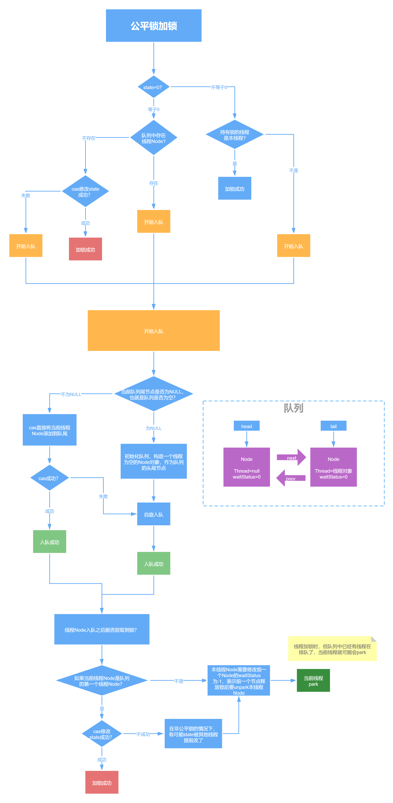                                                   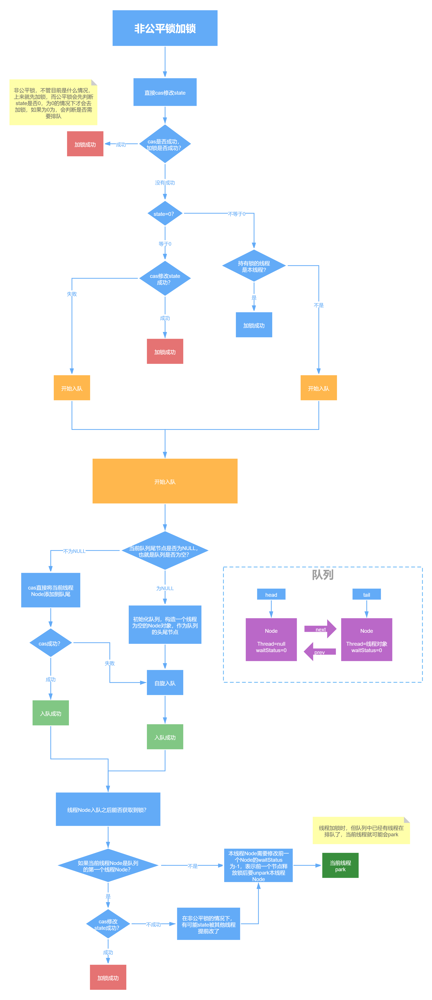

****

## ReentrantLock中tryLock()和lock()方法的区别

1. tryLock()表示尝试加锁，可能加到，也可能加不到，该方法不会阻塞线程，如果加到锁则返回true，没有加到则返回false
2. lock()表示阻塞加锁，线程会阻塞直到加到锁，方法也没有返回值

****

## CountDownLatch和Semaphore的区别和底层原理

CountDownLatch表示计数器，可以给CountDownLatch设置一个数字，一个线程调用CountDownLatch的await()将会阻塞，其他线程可以调用CountDownLatch的countDown()方法来对CountDownLatch中的数字减一，当数字被减成0后，所有await的线程都将被唤醒。

对应的底层原理就是，调用await()方法的线程会利用AQS排队，一旦数字被减为0，则会将AQS中排队的线程依次唤醒。

Semaphore表示信号量，可以设置许可的个数，表示同时允许最多多少个线程使用该信号量，通过acquire()来获取许可，如果没有许可可用则线程阻塞，并通过AQS来排队，可以通过release()方法来释放许可，当某个线程释放了某个许可后，会从AQS中正在排队的第一个线程开始依次唤醒，直到没有空闲许可。

## Sychronized的偏向锁、轻量级锁、重量级锁

1. 偏向锁：在锁对象的对象头中记录一下当前获取到该锁的线程ID，该线程下次如果又来获取该锁就可以直接获取到了
2. 轻量级锁：由偏向锁升级而来，当一个线程获取到锁后，此时这把锁是偏向锁，此时如果有第二个线程来竞争锁，偏向锁就会升级为轻量级锁，之所以叫轻量级锁，是为了和重量级锁区分开来，轻量级锁底层是通过自旋来实现的，并不会阻塞线程
3. 如果自旋次数过多仍然没有获取到锁，则会升级为重量级锁，重量级锁会导致线程阻塞
4. 自旋锁：自旋锁就是线程在获取锁的过程中，不会去阻塞线程，也就无所谓唤醒线程，阻塞和唤醒这两个步骤都是需要操作系统去进行的，比较消耗时间，自旋锁是线程通过CAS获取预期的一个标记，如果没有获取到，则继续循环获取，如果获取到了则表示获取到了锁，这个过程线程一直在运行中，相对而言没有使用太多的操作系统资源，比较轻量。

## Sychronized和ReentrantLock的区别

1. sychronized是一个关键字，ReentrantLock是一个类
2. sychronized会自动的加锁与释放锁，ReentrantLock需要程序员手动加锁与释放锁
3. sychronized的底层是JVM层面的锁，ReentrantLock是API层面的锁
4. sychronized是非公平锁，ReentrantLock可以选择公平锁或非公平锁
5. sychronized锁的是对象，锁信息保存在对象头中，ReentrantLock通过代码中int类型的state标识来标识锁的状态
6. sychronized底层有一个锁升级的过程

## 谈谈你对AQS的理解，AQS如何实现可重入锁？

1. AQS是一个JAVA线程同步的框架。是JDK中很多锁工具的核心实现框架。
2. 在AQS中，维护了一个信号量state和一个线程组成的双向链表队列。其中，这个线程队列，就是用来给线程排队的，而state就像是一个红绿灯，用来控制线程排队或者放行的。 在不同的场景下，有不用的意义。
3. 在可重入锁这个场景下，state就用来表示加锁的次数。0标识无锁，每加一次锁，state就加1。释放锁state就减1。

## 谈谈你对IOC的理解

通常，我们认为Spring有两大特性IoC和AOP，那到底该如何理解IoC呢？

对于很多初学者来说，IoC这个概念给人的感觉就是**我好像会，但是我说不出来**。

那么IoC到底是什么，接下来来说说我的理解，实际上这是一个非常大的问题，所以我们就把它拆细了来回答，IoC表示控制反转，那么：

1. 什么是控制？控制了什么？
2. 什么是反转？反转之前是谁控制的？反转之后是谁控制的？如何控制的？
3. 为什么要反转？反转之前有什么问题？反转之后有什么好处？

这就是解决这一类大问题的思路，大而化小。

那么，我们先来解决第一个问题：**什么是控制？控制了什么？**

我们在用Spring的时候，我们需要做什么：

1. 建一些类，比如UserService、OrderService
2. 用一些注解，比如@Autowired

但是，我们也知道，当程序运行时，用的是具体的UserService对象、OrderService对象，那这些对象是什么时候创建的？谁创建的？包括对象里的属性是什么时候赋的值？谁赋的？所有这些都是我们程序员做的，以为我们只是写了类而已，所有的这些都是Spring做的，它才是幕后黑手。

这就是**控制**：

1. 控制对象的创建
2. 控制对象内属性的赋值

如果我们不用Spring，那我们得自己来做这两件事，反过来，我们用Spring，这两件事情就不用我们做了，我们要做的仅仅是定义类，以及定义哪些属性需要Spring来赋值（比如某个属性上加@Autowired），而这其实就是第二个问题的答案，这就是**反转**，表示一种**对象控制权**的转移。

那反转有什么用，为什么要反转？

如果我们自己来负责创建对象，自己来给对象中的属性赋值，会出现什么情况？

比如，现在有三个类：

1. A类，A类里有一个属性C c；
2. B类，B类里也有一个属性C c；
3. C类

现在程序要运行，这三个类的对象都需要创建出来，并且相应的属性都需要有值，那么除开定义这三个类之外，我们还得写：

1. A a = new A();
2. B b = new B();
3. C c = new C();
4. a.c = c;
5. b.c = c;

这五行代码是不用Spring的情况下多出来的代码，而且，如果类在多一些，类中的属性在多一些，那相应的代码会更多，而且代码会更复杂。所以我们可以发现，我们自己来控制比交给Spring来控制，我们的代码量以及代码复杂度是要高很多的，反言之，将对象交给Spring来控制，减轻了程序员的负担。

总结一下，IoC表示控制反转，表示如果用Spring，那么Spring会负责来创建对象，以及给对象内的属性赋值，也就是如果用Spring，那么对象的控制权会转交给Spring。

## 单例Bean和单例模式

单例模式表示JVM中某个类的对象只会存在唯一一个。

而单例Bean并不表示JVM中只能存在唯一的某个类的Bean对象。

## Spring事务传播机制

多个事务方法相互调用时，事务如何在这些方法间传播，方法A是一个事务的方法，方法A执行过程中调用了方法B，那么方法B有无事务以及方法B对事务的要求不同都会对方法A的事务具体执行造成影响，同时方法A的事务对方法B的事务执行也有影响，这种影响具体是什么就由两个方法所定义的事务传播类型所决定。

1. REQUIRED(Spring默认的事务传播类型)：如果当前没有事务，则自己新建一个事务，如果当前存在事务，则加入这个事务
2. SUPPORTS：当前存在事务，则加入当前事务，如果当前没有事务，就以非事务方法执行
3. MANDATORY：当前存在事务，则加入当前事务，如果当前事务不存在，则抛出异常。
4. REQUIRES_NEW：创建一个新事务，如果存在当前事务，则挂起该事务。
5. NOT_SUPPORTED：以非事务方式执行,如果当前存在事务，则挂起当前事务
6. NEVER：不使用事务，如果当前事务存在，则抛出异常
7. NESTED：如果当前事务存在，则在嵌套事务中执行，否则REQUIRED的操作一样（开启一个事务）

## Spring事务失效的八大场景与原因分析

**图灵课堂-周瑜**

1. 方法内的自调用：Spring事务是基于AOP的，只要使用代理对象调用某个方法时，Spring事务才能生效，而在一个方法中调用使用this.xxx()调用方法时，this并不是代理对象，所以会导致事务失效。
    1. 解放办法1：把调用方法拆分到另外一个Bean中
    2. 解决办法2：自己注入自己
    3. 解决办法3：AopContext.currentProxy()+@EnableAspectJAutoProxy(exposeProxy = true)
2. 方法是private的：Spring事务会基于CGLIB来进行AOP，而CGLIB会基于父子类来失效，子类是代理类，父类是被代理类，如果父类中的某个方法是private的，那么子类就没有办法重写它，也就没有办法额外增加Spring事务的逻辑。
3. 方法是final的：原因和private是一样的，也是由于子类不能重写父类中的final的方法
4. 单独的线程调用方法：当Mybatis或JdbcTemplate执行SQL时，会从ThreadLocal中去获取数据库连接对象，如果开启事务的线程和执行SQL的线程是同一个，那么就能拿到数据库连接对象，如果不是同一个线程，那就拿到不到数据库连接对象，这样，Mybatis或JdbcTemplate就会自己去新建一个数据库连接用来执行SQL，此数据库连接的autocommit为true，那么执行完SQL就会提交，后续再抛异常也就不能再回滚之前已经提交了的SQL了。
5. 没加@Configuration注解：如果用SpringBoot基本没有这个问题，但是如果用的Spring，那么可能会有这个问题，这个问题的原因其实也是由于Mybatis或JdbcTemplate会从ThreadLocal中去获取数据库连接，但是ThreadLocal中存储的是一个MAP，MAP的key为DataSource对象，value为连接对象，而如果我们没有在AppConfig上添加@Configuration注解的话，会导致MAP中存的DataSource对象和Mybatis和JdbcTemplate中的DataSource对象不相等，从而也拿不到数据库连接，导致自己去创建数据库连接了。
6. 异常被吃掉：如果Spring事务没有捕获到异常，那么也就不会回滚了，默认情况下Spring会捕获RuntimeException和Error。
7. 类没有被Spring管理
8. 数据库不支持事务

## Spring中的Bean创建的生命周期有哪些步骤

Spring中一个Bean的创建大概分为以下几个步骤：

1. 推断构造方法
2. 实例化
3. 填充属性，也就是依赖注入
4. 处理Aware回调
5. 初始化前，处理@PostConstruct注解
6. 初始化，处理InitializingBean接口
7. 初始化后，进行AOP

当然其实真正的步骤更加细致，可以看下面的流程图

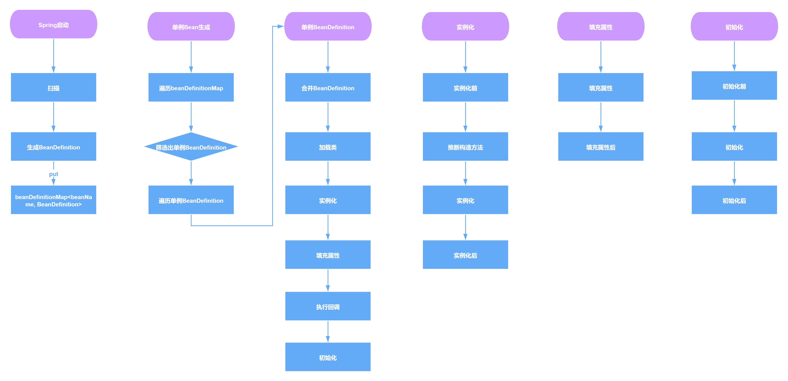

## Spring中Bean是线程安全的吗

Spring本身并没有针对Bean做线程安全的处理，所以：

1. 如果Bean是无状态的，那么Bean则是线程安全的
2. 如果Bean是有状态的，那么Bean则不是线程安全的

另外，Bean是不是线程安全，跟Bean的作用域没有关系，Bean的作用域只是表示Bean的生命周期范围，对于任何生命周期的Bean都是一个对象，这个对象是不是线程安全的，还是得看这个Bean对象本身。

## ApplicationContext和BeanFactory有什么区别

BeanFactory是Spring中非常核心的组件，表示Bean工厂，可以生成Bean，维护Bean，而ApplicationContext继承了BeanFactory，所以ApplicationContext拥有BeanFactory所有的特点，也是一个Bean工厂，但是ApplicationContext除开继承了BeanFactory之外，还继承了诸如EnvironmentCapable、MessageSource、ApplicationEventPublisher等接口，从而ApplicationContext还有获取系统环境变量、国际化、事件发布等功能，这是BeanFactory所不具备的

## Spring中的事务是如何实现的

1. Spring事务底层是基于数据库事务和AOP机制的
2. 首先对于使用了@Transactional注解的Bean，Spring会创建一个代理对象作为Bean
3. 当调用代理对象的方法时，会先判断该方法上是否加了@Transactional注解
4. 如果加了，那么则利用事务管理器创建一个数据库连接
5. 并且修改数据库连接的autocommit属性为false，禁止此连接的自动提交，这是实现Spring事务非常重要的一步
6. 然后执行当前方法，方法中会执行sql
7. 执行完当前方法后，如果没有出现异常就直接提交事务
8. 如果出现了异常，并且这个异常是需要回滚的就会回滚事务，否则仍然提交事务
9. Spring事务的隔离级别对应的就是数据库的隔离级别
10. Spring事务的传播机制是Spring事务自己实现的，也是Spring事务中最复杂的
11. Spring事务的传播机制是基于数据库连接来做的，一个数据库连接一个事务，如果传播机制配置为需要新开一个事务，那么实际上就是先建立一个数据库连接，在此新数据库连接上执行sql

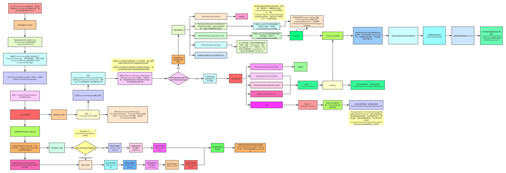

## Spring中什么时候@Transactional会失效

因为Spring事务是基于代理来实现的，所以某个加了@Transactional的方法只有是被代理对象调用时，那么这个注解才会生效，所以如果是被代理对象来调用这个方法，那么@Transactional是不会失效的。

同时如果某个方法是private的，那么@Transactional也会失效，因为底层cglib是基于父子类来实现的，子类是不能重载父类的private方法的，所以无法很好的利用代理，也会导致@Transactianal失效

## Spring容器启动流程是怎样的

1. 在创建Spring容器，也就是启动Spring时：
2. 首先会进行扫描，扫描得到所有的BeanDefinition对象，并存在一个Map中
3. 然后筛选出非懒加载的单例BeanDefinition进行创建Bean，对于多例Bean不需要在启动过程中去进行创建，对于多例Bean会在每次获取Bean时利用BeanDefinition去创建
4. 利用BeanDefinition创建Bean就是Bean的创建生命周期，这期间包括了合并BeanDefinition、推断构造方法、实例化、属性填充、初始化前、初始化、初始化后等步骤，其中AOP就是发生在初始化后这一步骤中
5. 单例Bean创建完了之后，Spring会发布一个容器启动事件
6. Spring启动结束
7. 在源码中会更复杂，比如源码中会提供一些模板方法，让子类来实现，比如源码中还涉及到一些BeanFactoryPostProcessor和BeanPostProcessor的注册，Spring的扫描就是通过BenaFactoryPostProcessor来实现的，依赖注入就是通过BeanPostProcessor来实现的
8. 在Spring启动过程中还会去处理@Import等注解


## Spring用到了哪些设计模式

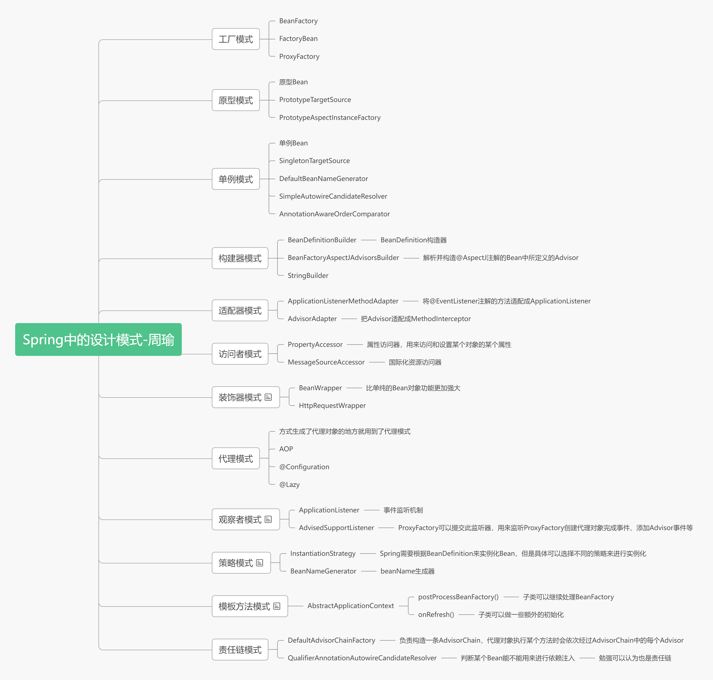

## Spring Boot中常用注解及其底层实现

1. @SpringBootApplication注解：这个注解标识了一个SpringBoot工程，它实际上是另外三个注解的组合，这三个注解是：
    1. @SpringBootConfiguration：这个注解实际就是一个@Configuration，表示启动类也是一个配置类
    2. @EnableAutoConfiguration：向Spring容器中导入了一个Selector，用来加载ClassPath下SpringFactories中所定义的自动配置类，将这些自动加载为配置Bean
    3. @ComponentScan：标识扫描路径，因为默认是没有配置实际扫描路径，所以SpringBoot扫描的路径是启动类所在的当前目录
2. @Bean注解：用来定义Bean，类似于XML中的`<bean>`标签，Spring在启动时，会对加了@Bean注解的方法进行解析，将方法的名字做为beanName，并通过执行方法得到bean对象
3. @Controller、@Service、@ResponseBody、@Autowired都可以说

## Spring Boot是如何启动Tomcat的

1. 首先，SpringBoot在启动时会先创建一个Spring容器
2. 在创建Spring容器过程中，会利用@ConditionalOnClass技术来判断当前classpath中是否存在Tomcat依赖，如果存在则会生成一个启动Tomcat的Bean
3. Spring容器创建完之后，就会获取启动Tomcat的Bean，并创建Tomcat对象，并绑定端口等，然后启动Tomcat

## Mybatis的优缺点

优点：

1. 基于 SQL 语句编程，相当灵活，不会对应用程序或者数据库的现有设计造成任何影响，SQL 写在 XML 里，解除 sql 与程序代码的耦合，便于统一管理；提供 XML 标签， 支持编写动态 SQL 语句， 并可重用。
2. 与 JDBC 相比，减少了 50%以上的代码量，消除了 JDBC 大量冗余的代码，不需要手动开关连接；
3. 很好的与各种数据库兼容（ 因为 MyBatis 使用 JDBC 来连接数据库，所以只要JDBC 支持的数据库 MyBatis 都支持）。
4. 能够与 Spring 很好的集成；
5. 提供映射标签， 支持对象与数据库的 ORM 字段关系映射； 提供对象关系映射标签， 支持对象关系组件维护。

缺点：

1. SQL 语句的编写工作量较大， 尤其当字段多、关联表多时， 对开发人员编写SQL 语句的功底有一定要求。
2. SQL 语句依赖于数据库， 导致数据库移植性差， 不能随意更换数据库。

## #{}和${}的区别是什么？

# {}是预编译处理、是占位符， ${}是字符串替换、是拼接符

Mybatis在处理#{}时，会将sql中的#{}替换为?号，调用 PreparedStatement 来赋值；

Mybatis在处理${}时，会将sql中的${}替换成变量的值，调用 Statement 来赋值；

使用#{}可以有效的防止 SQL 注入， 提高系统安全性。

## 索引的基本原理

索引用来快速地寻找那些具有特定值的记录。如果没有索引，一般来说执行查询时遍历整张表。

索引的原理：就是把无序的数据变成有序的查询

1. 把创建了索引的列的内容进行排序
2. 对排序结果生成倒排表
3. 在倒排表内容上拼上数据地址链
4. 在查询的时候，先拿到倒排表内容，再取出数据地址链，从而拿到具体数据

## 索引设计的原则？

查询更快、占用空间更小

1. 适合索引的列是出现在where子句中的列，或者连接子句中指定的列
2. 基数较小的表，索引效果较差，没有必要在此列建立索引
3. 使用短索引，如果对长字符串列进行索引，应该指定一个前缀长度，这样能够节省大量索引空间，如果搜索词超过索引前缀长度，则使用索引排除不匹配的行，然后检查其余行是否可能匹配。
4. 不要过度索引。索引需要额外的磁盘空间，并降低写操作的性能。在修改表内容的时候，索引会进行更新甚至重构，索引列越多，这个时间就会越长。所以只保持需要的索引有利于查询即可。
5. 定义有外键的数据列一定要建立索引。
6. 更新频繁字段不适合创建索引
7. 若是不能有效区分数据的列不适合做索引列(如性别，男女未知，最多也就三种，区分度实在太低)
8. 尽量的扩展索引，不要新建索引。比如表中已经有a的索引，现在要加(a,b)的索引，那么只需要修改原来的索引即可。
9. 对于那些查询中很少涉及的列，重复值比较多的列不要建立索引。
10. 对于定义为text、image和bit的数据类型的列不要建立索引。

## 事务的基本特性和隔离级别

事务基本特性ACID分别是：

**原子性**指的是一个事务中的操作要么全部成功，要么全部失败。

**一致性**指的是数据库总是从一个一致性的状态转换到另外一个一致性的状态。比如A转账给B100块钱，假设A只有90块，支付之前我们数据库里的数据都是符合约束的,但是如果事务执行成功了,我们的数据库数据就破坏约束了,因此事务不能成功,这里我们说事务提供了一致性的保证

**隔离性**指的是一个事务的修改在最终提交前，对其他事务是不可见的。

**持久性**指的是一旦事务提交，所做的修改就会永久保存到数据库中。

隔离性有4个隔离级别，分别是：

+ read uncommit  读未提交，可能会读到其他事务未提交的数据，也叫做脏读。  
用户本来应该读取到id=1的用户age应该是10，结果读取到了其他事务还没有提交的事务，结果读取结果age=20，这就是脏读。
+ read commit  读已提交，两次读取结果不一致，叫做不可重复读。  
不可重复读解决了脏读的问题，他只会读取已经提交的事务。  
用户开启事务读取id=1用户，查询到age=10，再次读取发现结果=20，在同一个事务里同一个查询读取到不同的结果叫做不可重复读。
+ repeatable read  可重复复读，这是mysql的默认级别，就是每次读取结果都一样，但是有可能产生幻读。
+ serializable  串行，一般是不会使用的，他会给每一行读取的数据加锁，会导致大量超时和锁竞争的问题。

## 什么是MVCC

MVCC（Multi-Version Concurrency Control ，多版本并发控制）指的就是在使用READ COMMITTD、REPEATABLE READ这两种隔离级别的事务在执行普通的SEELCT操作时访问记录的版本链的过程。可以使不同事务的读-写、写-读操作并发执行，从而提升系统性能。READ COMMITTD、REPEATABLE READ这两个隔离级别的一个很大不同就是：生成ReadView的时机不同，READ COMMITTD在每一次进行普通SELECT操作前都会生成一个ReadView，而REPEATABLE READ只在第一次进行普通SELECT操作前生成一个ReadView，之后的查询操作都重复使用这个ReadView就好了。

## 简述MyISAM和InnoDB的区别

**MyISAM：**

+ 不支持事务，但是每次查询都是原子的；
+ 支持表级锁，即每次操作是对整个表加锁；
+ 存储表的总行数；
+ 一个MYISAM表有三个文件：索引文件、表结构文件、数据文件；
+ 采用非聚集索引，索引文件的数据域存储指向数据文件的指针。辅索引与主索引基本一致，但是辅索引不用保证唯一性。

**InnoDb：**

+ 支持ACID的事务，支持事务的四种隔离级别；
+ 支持行级锁及外键约束：因此可以支持写并发；
+ 不存储总行数；
+ 一个InnoDb引擎存储在一个文件空间（共享表空间，表大小不受操作系统控制，一个表可能分布在多个文件里），也有可能为多个（设置为独立表空，表大小受操作系统文件大小限制，一般为2G），受操作系统文件大小的限制；
+ 主键索引采用聚集索引（索引的数据域存储数据文件本身），辅索引的数据域存储主键的值；因此从辅索引查找数据，需要先通过辅索引找到主键值，再访问辅索引；最好使用自增主键，防止插入数据时，为维持B+树结构，文件的大调整。

## Explain语句结果中各个字段分表表示什么

| 列名 | 描述 |
| --- | --- |
| id | 查询语句中每出现一个SELECT关键字，MySQL就会为它分配一个唯一的id值，某些子查询会被优化为join查询，那么出现的id会一样 |
| select_type | SELECT关键字对应的那个查询的类型 |
| table | 表名 |
| partitions | 匹配的分区信息 |
| type | 针对单表的查询方式（全表扫描、索引） |
| possible_keys | 可能用到的索引 |
| key | 实际上使用的索引 |
| key_len | 实际使用到的索引长度 |
| ref | 当使用索引列等值查询时，与索引列进行等值匹配的对象信息 |
| rows | 预估的需要读取的记录条数 |
| filtered | 某个表经过搜索条件过滤后剩余记录条数的百分比 |
| Extra | 一些额外的信息，比如排序等 |

## Mysql中九种索引失效场景分析

表数据：

```java
CREATE TABLE `t1` (
  a int primary key,
  b int ,
  c int ,
  d int ,
  e varchar(20)
) ENGINE=InnoDB ;


insert into t1 values(4,3,1,1,'d');
insert into t1 values(1,1,1,1,'a');
insert into t1 values(8,8,8,8,'h');
insert into t1 values(2,2,2,2,'b');
insert into t1 values(5,2,3,5,'e');
insert into t1 values(3,3,2,2,'c');
insert into t1 values(7,4,5,5,'g');
insert into t1 values(6,6,4,4,'f');
```

索引情况：


a字段是主键，对应主键索引，bcd三个字段组成一个联合索引，e字段一个索引

### 1. 不符合最左匹配原则


去掉b=1的条件就不符合最左匹配原则了，导致所有失效


### 2. 不正确的Like查询

不用like能走索引：


正常使用like：


不正确使用like：


### 3. 对索引列进行了计算或使用了函数


### 4. 索引列进行了类型转换

e字段的类型是vachar，下面这个sql需要把e字段中的字符转换成数字，会导致索引失效


### 5. `<>`不等于导致索引失效

b=1可以走索引，`b<>1`就不能走索引


### 6. order by导致索引失效

就算利用索引，但是由于是select * 所以需要回表，而且回表成本比较高，所以不会走索引。


如果是select b就需要回表了，就会选择走索引


### 7. 使用or导致索引失效


### 8. select * 导致索引失效


### 9. 范围查询数据量过多导致索引失效

新增一些数据：

```java
insert into t1 values(10,3,1,1,'d');
insert into t1 values(20,1,1,1,'a');
insert into t1 values(15,8,8,8,'h');
insert into t1 values(18,2,2,2,'b');
insert into t1 values(14,2,3,5,'e');
insert into t1 values(13,3,2,2,'c');
insert into t1 values(17,4,5,5,'g');
insert into t1 values(22,6,4,4,'f');
```


#####

## 索引覆盖是什么

索引覆盖就是一个SQL在执行时，可以利用索引来快速查找，并且此SQL所要查询的字段在当前索引对应的字段中都包含了，那么就表示此SQL走完索引后不用回表了，所需要的字段都在当前索引的叶子节点上存在，可以直接作为结果返回了

#####

## 最左前缀原则是什么

当一个SQL想要利用索引是，就一定要提供该索引所对应的字段中最左边的字段，也就是排在最前面的字段，比如针对a,b,c三个字段建立了一个联合索引，那么在写一个sql时就一定要提供a字段的条件，这样才能用到联合索引，这是由于在建立a,b,c三个字段的联合索引时，底层的B+树是按照a,b,c三个字段从左往右去比较大小进行排序的，所以如果想要利用B+树进行快速查找也得符合这个规则

#####

## Innodb是如何实现事务的

Innodb通过Buffer Pool，LogBuffer，Redo Log，Undo Log来实现事务，以一个update语句为例：

1. Innodb在收到一个update语句后，会先根据条件找到数据所在的页，并将该页缓存在Buffer Pool中
2. 执行update语句，修改Buffer Pool中的数据，也就是内存中的数据
3. 针对update语句生成一个RedoLog对象，并存入LogBuffer中
4. 针对update语句生成undolog日志，用于事务回滚
5. 如果事务提交，那么则把RedoLog对象进行持久化，后续还有其他机制将Buffer Pool中所修改的数据页持久化到磁盘中
6. 如果事务回滚，则利用undolog日志进行回滚

#####

## B树和B+树的区别，为什么Mysql使用B+树

B树的特点：

1. 节点排序
2. 一个节点了可以存多个元素，多个元素也排序了

B+树的特点：

1. 拥有B树的特点
2. 叶子节点之间有指针
3. 非叶子节点上的元素在叶子节点上都冗余了，也就是叶子节点中存储了所有的元素，并且排好顺序

Mysql索引使用的是B+树，因为索引是用来加快查询的，而B+树通过对数据进行排序所以是可以提高查询速度的，然后通过一个节点中可以存储多个元素，从而可以使得B+树的高度不会太高，在Mysql中一个Innodb页就是一个B+树节点，一个Innodb页默认16kb，所以一般情况下一颗两层的B+树可以存2000万行左右的数据，然后通过利用B+树叶子节点存储了所有数据并且进行了排序，并且叶子节点之间有指针，可以很好的支持全表扫描，范围查找等SQL语句。

#####

## Mysql锁有哪些，如何理解

按锁粒度分类：

1. 行锁：锁某行数据，锁粒度最小，并发度高
2. 表锁：锁整张表，锁粒度最大，并发度低
3. 间隙锁：锁的是一个区间

还可以分为：

1. 共享锁：也就是读锁，一个事务给某行数据加了读锁，其他事务也可以读，但是不能写
2. 排它锁：也就是写锁，一个事务给某行数据加了写锁，其他事务不能读，也不能写

还可以分为：

1. 乐观锁：并不会真正的去锁某行记录，而是通过一个版本号来实现的
2. 悲观锁：上面所的行锁、表锁等都是悲观锁

在事务的隔离级别实现中，就需要利用锁来解决幻读

#####

## Mysql慢查询该如何优化？

1. 检查是否走了索引，如果没有则优化SQL利用索引
2. 检查所利用的索引，是否是最优索引
3. 检查所查字段是否都是必须的，是否查询了过多字段，查出了多余数据
4. 检查表中数据是否过多，是否应该进行分库分表了
5. 检查数据库实例所在机器的性能配置，是否太低，是否可以适当增加资源

## Mysql中多大的表是大表？

**图灵课堂-周瑜**

我们通常说表太大，另外一层意思就是数据太多了，导致索引的效果都不明显了，只能分表了。所以我们在讨论什么是大表时，需要站在Mysql索引角度来分析，到底多大数据量时是大表。

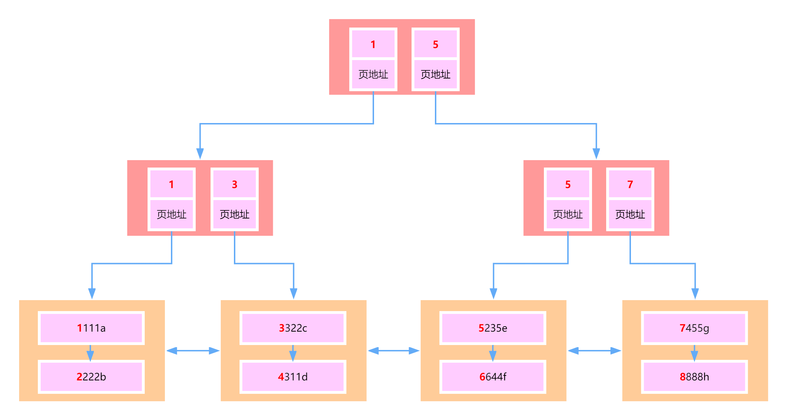

上图是Innodb中的一个主键索引，也就是一颗B+树，树中的每个节点是一个Innodb Page，大小默认为16kb，叶子节点中的每个节点主要存储的就是一条条数据，非叶子节点中存储的是主键和页地址。

所以，我们可以来计算一下，如果B+树的高度为2，能存多少条数据。

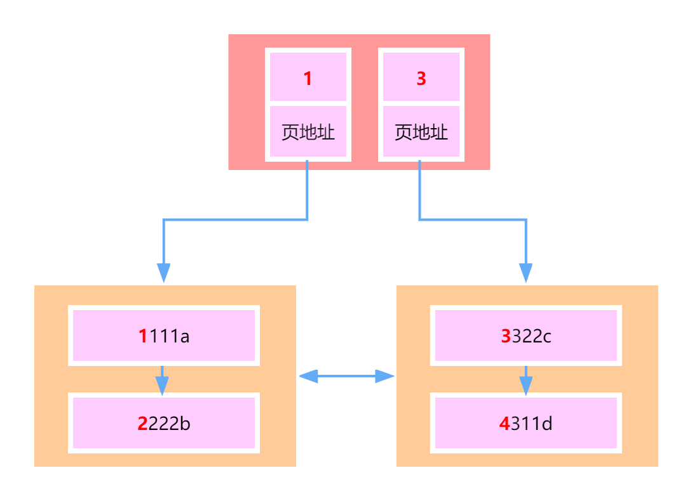

+ 假如一条记录为1kb
+ 主键类型为int类型，也就一个主键占4b
+ innodb中一个页地址需要占6b

所以1页中，也就是一个节点中，可以存：

1. 16kb/1kb = 16条行数据
2. 16kb/(4b+6b) = 1638条索引记录（主键+索引地址）

所以如果B+树的高度为2，那么叶子节点就有1638个，所以能存的行数据条数为：1638*16 = 26208条记录。

如果B+树的高度为3，那么第一层一个节点，第二层1638个节点，第三层1638*1638个节点，最终数据条数为：1638*1638*16=42,928704

也就是差不多4000多万条数据。

如果主键的类型为bigint，一个主键占8个字节，所以高度为3时，能存：

1. 16kb/(8b+6b) = 1170
2. 1170*1170*16= 21902400

也就是2000多万行数据。

所以，我们可以通过这种方式来判断一个表的数据量是不是过多（B+树的高度一般不建议超过三层，因为B+树的数据都是存在磁盘中的，树太高了，进行IO的次数就表多了，整体效率也就降低了），大家后续可以通过我介绍的方法来计算某一个表，B+树高度为2时能存多少条记录，高度为3时能存多少记录，如果表中实际的数据总条数超过了3层能存放的数据量，那么这个表就是大表了，此时索引的效率就不高了，就需要进行分表了。

## count(*)与count(1)有什么区别

**图灵课堂-周瑜**

工作中，经常需要做统计，比如分页的时候，需要知道表中总共有多少行数据，这时就会用到count()，那到底应该用count(*)呢？还是count(1)呢？还是count(某个字段)呢？

在mysql官网中，其实就对count(*)做了描述，[点击跳转](https://dev.mysql.com/doc/refman/5.6/en/aggregate-functions.html#function_count)。

在官网中是这么描述count(expr)的：

```java
Returns a count of the number of non-NULL values of expr in the rows retrieved by a SELECT statement. The result is a BIGINT value.

If there are no matching rows, COUNT() returns 0
```

翻译一下就是，返回SELECT语句结果中非NULL的统计结果，如果没有匹配的行，则返回0。

比如下面这个sql

```java
select count(*) from t1
```

就是统计：

```java
select * from t1
```

这个sql查询得到的结果的总行数。

紧接着，官网就单独描述了一下count(*)：

```java
COUNT(*) is somewhat different in that it returns a count of the number of rows retrieved, whether or not they contain NULL values.
```

意思是，count(*)有点不一样，一般的count()不会统计NULL值，但是count(*)会统计到NULL值。

比如现在有一个表，只有一个字段，有三条记录，两个f，一个null

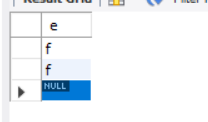

此时count(*)的结果为3，count(e)的结果为2，count(1)的结果为3

在MyISAM中，会有单独的地方记录表的行数，所以在MyISAM中执行count(*)是比较快的，当然前提条件是sql语句中没有where条件，因为MyISAM记录的就是无条件下的表中总共的行数。

但是Innodb中没有这种机制，因为Innodb支持事务，事务又有不同的隔离级别，对于同一个表来说，不同的事务可能同时在操作这个表，并且每个事务是独立的，A事务插入了一条数据，B事务可能是不需要知道的，这样就导致Innodb不能像MyISAM那样在某一个地方记录记录总行数了。

那么Innodb中的count()是怎么执行的呢？会利用索引。

比如在执行count(*)时，会选择表中的某一个索引，因为索引B+树中就记录了表中的所有数据行（每行数据的某些字段），所以利用索引页可以更快的统计出总行数。

比如现在有一张表，有a,b,c,d,e五个字段，其中a是主键，b,c,d是一个联合索引，此时如果：

```java
explain select count(*) from t1
```

会发现，这个sql会走bcd联合索引


因为bcd联合索引对于的B+树存的字段更少，导致B+树的叶子节点个数更少，但是并没有影响数据行数（没行只存了b,c,d字段，严格来说也存了a字段，但是e字段是肯定没有存的）。

这就是count(*)，相当于会利用索引来统计总行数。

而count(1)和count(*)是一样的，比如官网中就这么描述的：

```java
InnoDB handles SELECT COUNT(*) and SELECT COUNT(1) operations in the same way. There is no performance difference.
```

而如果count(某个字段)，那么也看这个字段有没有可用的索引，如果有利用索引统计，如果没有则进行全表扫描统计，当然会过滤掉null值。

以上就是我结合官网以及实验的分析过程，总结如下：

1. MyISAM中count(*)比较快，因为可以直接取到MyISAM帮我们统计的总行数
2. Innodb中count(*)会选择索引，然后利用索引统计出来总行数
3. count(1)和count(*)是一样的，不管是Innodb还是MyISAM
4. count(某个字段)会选择该字段可用的索引进行统计，如果没有则进行全部扫描，只要是count(某个字段)就会过滤掉null值，不管走没走索引

## 什么是RDB和AOF

RDB：Redis DataBase，在指定的时间间隔内将内存中的数据集快照写入磁盘，实际操作过程是fork一个子进程，先将数据集写入临时文件，写入成功后，再替换之前的文件，用二进制压缩存储。

**优点：**

1. 整个Redis数据库将只包含一个文件 dump.rdb，方便持久化。
2. 容灾性好，方便备份。
3. 性能最大化，fork 子进程来完成写操作，让主进程继续处理命令，所以是 IO 最大化。使用单独子进程来进行持久化，主进程不会进行任何 IO 操作，保证了 redis 的高性能
4. 相对于数据集大时，比 AOF 的启动效率更高。

**缺点：**

1. 数据安全性低。RDB 是间隔一段时间进行持久化，如果持久化之间 redis 发生故障，会发生数据丢失。所以这种方式更适合数据要求不严谨的时候)
2. 由于RDB是通过fork子进程来协助完成数据持久化工作的，因此，如果当数据集较大时，可能会导致整个服务器停止服务几百毫秒，甚至是1秒钟。

AOF：Append Only File，以日志的形式记录服务器所处理的每一个写、删除操作，查询操作不会记录，以文本的方式记录，可以打开文件看到详细的操作记录

**优点：**

1. 数据安全，Redis中提供了3中同步策略，即每秒同步、每修改同步和不同步。事实上，每秒同步也是异步完成的，其效率也是非常高的，所差的是一旦系统出现宕机现象，那么这一秒钟之内修改的数据将会丢失。而每修改同步，我们可以将其视为同步持久化，即每次发生的数据变化都会被立即记录到磁盘中。。
2. 通过 append 模式写文件，即使中途服务器宕机也不会破坏已经存在的内容，可以通过 redis-check-aof 工具解决数据一致性问题。
3. AOF 机制的 rewrite 模式。定期对AOF文件进行重写，以达到压缩的目的

**缺点：**

1. AOF 文件比 RDB 文件大，且恢复速度慢。
2. 数据集大的时候，比 rdb 启动效率低。
3. 运行效率没有RDB高

AOF文件比RDB更新频率高，优先使用AOF还原数据，AOF比RDB更安全也更大，RDB性能比AOF好，如果两个都配了优先加载AOF。

## Redis的过期键的删除策略

Redis是key-value数据库，我们可以设置Redis中缓存的key的过期时间。Redis的过期策略就是指当Redis中缓存的key过期了，Redis如何处理。

+ **惰性过期**：只有当访问一个key时，才会判断该key是否已过期，过期则清除。该策略可以最大化地节省CPU资源，却对内存非常不友好。极端情况可能出现大量的过期key没有再次被访问，从而不会被清除，占用大量内存。
+ **定期过期**：每隔一定的时间，会扫描一定数量的数据库的expires字典中一定数量的key，并清除其中已过期的key。该策略是一个折中方案。通过调整定时扫描的时间间隔和每次扫描的限定耗时，可以在不同情况下使得CPU和内存资源达到最优的平衡效果。

(expires字典会保存所有设置了过期时间的key的过期时间数据，其中，key是指向键空间中的某个键的指针，value是该键的毫秒精度的UNIX时间戳表示的过期时间。键空间是指该Redis集群中保存的所有键。)

Redis中同时使用了惰性过期和定期过期两种过期策略。

## 简述Redis事务实现

**1、事务开始**

_MULTI_命令的执行，标识着一个事务的开始。_MULTI_命令会将客户端状态的`flags`属性中打开`REDIS_MULTI`标识来完成的。

**2、命令入队**

当一个客户端切换到事务状态之后，服务器会根据这个客户端发送来的命令来执行不同的操作。如果客户端发送的命令为_MULTI_、*EXEC*、*WATCH*、_DISCARD_中的一个，立即执行这个命令，否则将命令放入一个事务队列里面，然后向客户端返回`QUEUED`回复

+ 如果客户端发送的命令为 EXEC、DISCARD、WATCH、MULTI 四个命令的其中一个，那么服务器立即执行这个命令。
+ 如果客户端发送的是四个命令以外的其他命令，那么服务器并不立即执行这个命令。  
首先检查此命令的格式是否正确，如果不正确，服务器会在客户端状态（redisClient）的 flags 属性关闭 REDIS_MULTI 标识，并且返回错误信息给客户端。  
如果正确，将这个命令放入一个事务队列里面，然后向客户端返回 QUEUED 回复

事务队列是按照FIFO的方式保存入队的命令

**3、事务执行**

客户端发送 EXEC 命令，服务器执行 EXEC 命令逻辑。

+ 如果客户端状态的 flags 属性不包含 REDIS_MULTI 标识，或者包含 REDIS_DIRTY_CAS 或者 REDIS_DIRTY_EXEC 标识，那么就直接取消事务的执行。
+ 否则客户端处于事务状态（flags 有 REDIS_MULTI 标识），服务器会遍历客户端的事务队列，然后执行事务队列中的所有命令，最后将返回结果全部返回给客户端；

redis 不支持事务回滚机制，但是它会检查每一个事务中的命令是否错误。

Redis 事务不支持检查那些程序员自己逻辑错误。例如对 String 类型的数据库键执行对 HashMap 类型的操作！

+ WATCH 命令是一个乐观锁，可以为 Redis 事务提供 check-and-set （CAS）行为。可以监控一个或多个键，一旦其中有一个键被修改（或删除），之后的事务就不会执行，监控一直持续到EXEC命令。
+ MULTI命令用于开启一个事务，它总是返回OK。MULTI执行之后，客户端可以继续向服务器发送任意多条命令，这些命令不会立即被执行，而是被放到一个队列中，当EXEC命令被调用时，所有队列中的命令才会被执行。
+ EXEC：执行所有事务块内的命令。返回事务块内所有命令的返回值，按命令执行的先后顺序排列。当操作被打断时，返回空值 nil 。
+ 通过调用DISCARD，客户端可以清空事务队列，并放弃执行事务， 并且客户端会从事务状态中退出。
+ UNWATCH命令可以取消watch对所有key的监控。

## Redis 主从复制的核心原理

通过执行slaveof命令或设置slaveof选项，让一个服务器去复制另一个服务器的数据。主数据库可以进行读写操作，当写操作导致数据变化时会自动将数据同步给从数据库。而从数据库一般是只读的，并接受主数据库同步过来的数据。一个主数据库可以拥有多个从数据库，而一个从数据库只能拥有一个主数据库。

全量复制：

1. 主节点通过bgsave命令fork子进程进行RDB持久化，该过程是非常消耗CPU、内存(页表复制)、硬盘IO的
2. 主节点通过网络将RDB文件发送给从节点，对主从节点的带宽都会带来很大的消耗
3. 从节点清空老数据、载入新RDB文件的过程是阻塞的，无法响应客户端的命令；如果从节点执行bgrewriteaof，也会带来额外的消耗

部分复制：

1. 复制偏移量：执行复制的双方，主从节点，分别会维护一个复制偏移量offset
2. 复制积压缓冲区：主节点内部维护了一个固定长度的、先进先出(FIFO)队列 作为复制积压缓冲区，当主从节点offset的差距过大超过缓冲区长度时，将无法执行部分复制，只能执行全量复制。
3. 服务器运行ID(runid)：每个Redis节点，都有其运行ID，运行ID由节点在启动时自动生成，主节点会将自己的运行ID发送给从节点，从节点会将主节点的运行ID存起来。 从节点Redis断开重连的时候，就是根据运行ID来判断同步的进度：
    + 如果从节点保存的runid与主节点现在的runid相同，说明主从节点之前同步过，主节点会继续尝试使用部分复制(到底能不能部分复制还要看offset和复制积压缓冲区的情况)；
    + 如果从节点保存的runid与主节点现在的runid不同，说明从节点在断线前同步的Redis节点并不是当前的主节点，只能进行全量复制。

## Redis有哪些数据结构？分别有哪些典型的应用场景？

Redis的数据结构有：

1. 字符串：可以用来做最简单的数据，可以缓存某个简单的字符串，也可以缓存某个json格式的字符串，Redis分布式锁的实现就利用了这种数据结构，还包括可以实现计数器、Session共享、分布式ID
2. 哈希表：可以用来存储一些key-value对，更适合用来存储对象
3. 列表：Redis的列表通过命令的组合，既可以当做栈，也可以当做队列来使用，可以用来缓存类似微信公众号、微博等消息流数据
4. 集合：和列表类似，也可以存储多个元素，但是不能重复，集合可以进行交集、并集、差集操作，从而可以实现类似，我和某人共同关注的人、朋友圈点赞等功能
5. 有序集合：集合是无序的，有序集合可以设置顺序，可以用来实现排行榜功能

#####

## Redis分布式锁底层是如何实现的？

1. 首先利用setnx来保证：如果key不存在才能获取到锁，如果key存在，则获取不到锁
2. 然后还要利用lua脚本来保证多个redis操作的原子性
3. 同时还要考虑到锁过期，所以需要额外的一个看门狗定时任务来监听锁是否需要续约
4. 同时还要考虑到redis节点挂掉后的情况，所以需要采用红锁的方式来同时向N/2+1个节点申请锁，都申请到了才证明获取锁成功，这样就算其中某个redis节点挂掉了，锁也不能被其他客户端获取到

#####

## Redis主从复制的核心原理

Redis的主从复制是提高Redis的可靠性的有效措施，主从复制的流程如下：

1. 集群启动时，主从库间会先建立连接，为全量复制做准备
2. 主库将所有数据同步给从库。从库收到数据后，在本地完成数据加载，这个过程依赖于内存快照RDB
3. 在主库将数据同步给从库的过程中，主库不会阻塞，仍然可以正常接收请求。否则，redis的服务就被中断了。但是，这些请求中的写操作并没有记录到刚刚生成的RDB文件中。为了保证主从库的数据一致性，主库会在内存中用专门的replication buffer，记录RDB文件生成收到的所有写操作。
4. 最后，也就是第三个阶段，主库会把第二阶段执行过程中新收到的写命令，再发送给从库。具体的操作是，当主库完成RDB文件发送后，就会把此时replocation buffer中修改操作发送给从库，从库再执行这些操作。这样一来，主从库就实现同步了
5. 后续主库和从库都可以处理客户端读操作，写操作只能交给主库处理，主库接收到写操作后，还会将写操作发送给从库，实现增量同步

#####

## Redis集群策略

Redis提供了三种集群策略：

1. 主从模式：这种模式比较简单，主库可以读写，并且会和从库进行数据同步，这种模式下，客户端直接连主库或某个从库，但是但主库或从库宕机后，客户端需要手动修改IP，另外，这种模式也比较难进行扩容，整个集群所能存储的数据受到某台机器的内存容量，所以不可能支持特大数据量
2. 哨兵模式：这种模式在主从的基础上新增了哨兵节点，但主库节点宕机后，哨兵会发现主库节点宕机，然后在从库中选择一个库作为进的主库，另外哨兵也可以做集群，从而可以保证但某一个哨兵节点宕机后，还有其他哨兵节点可以继续工作，这种模式可以比较好的保证Redis集群的高可用，但是仍然不能很好的解决Redis的容量上限问题。
3. Cluster模式：Cluster模式是用得比较多的模式，它支持多主多从，这种模式会按照key进行槽位的分配，可以使得不同的key分散到不同的主节点上，利用这种模式可以使得整个集群支持更大的数据容量，同时每个主节点可以拥有自己的多个从节点，如果该主节点宕机，会从它的从节点中选举一个新的主节点。

对于这三种模式，如果Redis要存的数据量不大，可以选择哨兵模式，如果Redis要存的数据量大，并且需要持续的扩容，那么选择Cluster模式。

## 缓存穿透、缓存击穿、缓存雪崩分别是什么

缓存中存放的大多都是热点数据，目的就是防止请求可以直接从缓存中获取到数据，而不用访问Mysql。

1. 缓存雪崩：如果缓存中某一时刻大批热点数据同时过期，那么就可能导致大量请求直接访问Mysql了，解决办法就是在过期时间上增加一点随机值，另外如果搭建一个高可用的Redis集群也是防止缓存雪崩的有效手段
2. 缓存击穿：和缓存雪崩类似，缓存雪崩是大批热点数据失效，而缓存击穿是指某一个热点key突然失效，也导致了大量请求直接访问Mysql数据库，这就是缓存击穿，解决方案就是考虑这个热点key不设过期时间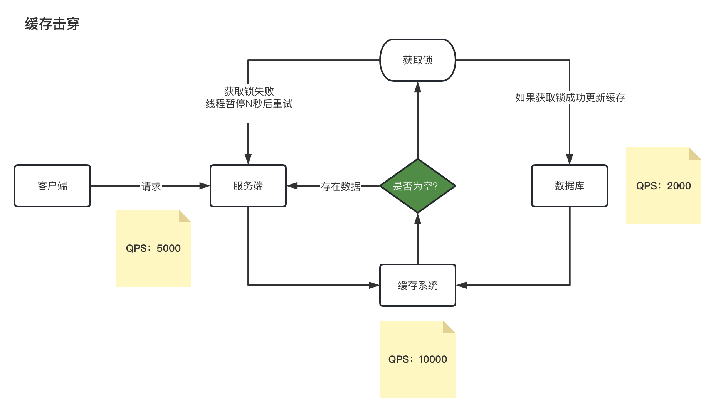
3. 缓存穿透：假如某一时刻访问redis的大量key都在redis中不存在（比如黑客故意伪造一些乱七八糟的key），那么也会给数据造成压力，这就是缓存穿透，解决方案是使用布隆过滤器，它的作用就是如果它认为一个key不存在，那么这个key就肯定不存在，所以可以在缓存之前加一层布隆过滤器来拦截不存在的key

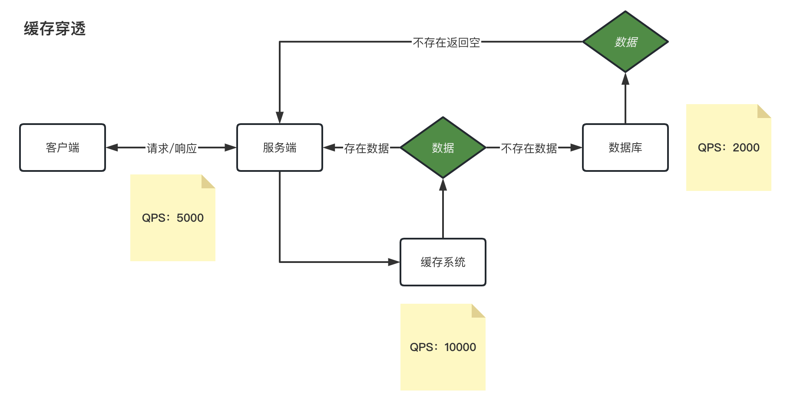

## Redis和Mysql如何保证数据一致

1. 先更新Mysql，再更新Redis，如果更新Redis失败，可能仍然不一致
2. 先删除Redis缓存数据，再更新Mysql，再次查询的时候在将数据添加到缓存中，这种方案能解决1方案的问题，但是在高并发下性能较低，而且仍然会出现数据不一致的问题，比如线程1删除了Redis缓存数据，正在更新Mysql，此时另外一个查询再查询，那么就会把Mysql中老数据又查到Redis中
3. 延时双删，步骤是：先删除Redis缓存数据，再更新Mysql，延迟几百毫秒再删除Redis缓存数据，这样就算在更新Mysql时，有其他线程读了Mysql，把老数据读到了Redis中，那么也会被删除掉，从而把数据保持一致

## Redis的持久化机制

RDB：Redis DataBase 将某一个时刻的内存快照（Snapshot），以二进制的方式写入磁盘。

手动触发：

+ save命令，使 Redis 处于阻塞状态，直到 RDB 持久化完成，才会响应其他客户端发来的命令，所以在生产环境一定要慎用
+ bgsave命令，fork出一个子进程执行持久化，主进程只在fork过程中有短暂的阻塞，子进程创建       之后，主进程就可以响应客户端请求了
+ 自动触发：
+ save m n ：在 m 秒内，如果有 n 个键发生改变，则自动触发持久化，通过bgsave执行，如果设置多个、只要满足其一就会触发，配置文件有默认配置(可以注释掉)
+ flushall：用于清空redis所有的数据库，flushdb清空当前redis所在库数据(默认是0号数据库)，会  清空RDB文件，同时也会生成dump.rdb、内容为空
+ 主从同步：全量同步时会自动触发bgsave命令，生成rdb发送给从节点

优点：

1. 整个Redis数据库将只包含一个文件   dump.rdb，方便持久化。
2. 容灾性好，方便备份。
3. 性能最大化，fork 子进程来完成写操作，让主进程继续处理命令，所以是 IO 最大化。使用单独子进程来进行持久化，主进程不会进行任何 IO 操作，保证了 redis 的高性能
4. 相对于数据集大时，比 AOF的启动效率更高。

缺点：

1. 数据安全性低。RDB 是间隔一段时间进行持久化，如果持久化之间 redis 发生故障，会发生数据丢失。所以这种方式更适合数据要求不严谨的时候)
2. 由于RDB是通过fork子进程来协助完成数据持久化工作的，因此，如果当数据集较大时，可能会导致整个服务器停止服务几百毫秒，甚至是1秒钟。会占用cpu

AOF：Append Only File 以日志的形式记录服务器所处理的每一个写、删除操作，查询操作不会记录，以文本的方式记录，可以打开文件看到详细的操作记录，调操作系统命令进程刷盘

1. 所有的写命令会追加到 AOF 缓冲中。
2. AOF 缓冲区根据对应的策略向硬盘进行同步操作。
3. 随着 AOF 文件越来越大，需要定期对 AOF 文件进行重写，达到压缩的目的。
4. 当 Redis 重启时，可以加载 AOF 文件进行数据恢复。同步策略：

每秒同步：异步完成，效率非常高，一旦系统出现宕机现象，那么这一秒钟之内修改的数据将会丢  失

每修改同步：同步持久化，每次发生的数据变化都会被立即记录到磁盘中，最多丢一条 不同步：由操作系统控制，可能丢失较多数据

优点：

1. 数据安全
2. 通过 append 模式写文件，即使中途服务器宕机也不会破坏已经存在的内容，可以通过 redis- check-aof 工具解决数据一致性问题。
3. AOF 机制的 rewrite 模式。定期对AOF文件进行重写，以达到压缩的目的

缺点：

1. AOF 文件比 RDB 文件大，且恢复速度慢。
2. 数据集大的时候，比 rdb 启动效率低。
3. 运行效率没有RDB高

对比：

+ AOF文件比RDB更新频率高，优先使用AOF还原数据。AOF比RDB更安全也更大
+ RDB性能比AOF好
+ 如果两个都配了优先加载AOF

## Redis单线程为什么这么快

Redis基于Reactor模式开发了网络事件处理器、文件事件处理器 fileeventhandler。它是单线程的， 所以 Redis才叫做单线程的模型，它采用IO多路复用机制来同时监听多个Socket，根据Socket上的事件类型来选择对应的事件处理器来处理这个事件。可以实现高性能的网络通信模型，又可以跟内部其他单  线程的模块进行对接，保证了 Redis内部的线程模型的简单性。

文件事件处理器的结构包含4个部分：多个Socket、IO多路复用程序、文件事件分派器以及事件处理器

（命令请求处理器、命令回复处理器、连接应答处理器等）。

多个 Socket 可能并发的产生不同的事件，IO多路复用程序会监听多个 Socket，会将 Socket 放入一个队列中排队，每次从队列中有序、同步取出一个 Socket 给事件分派器，事件分派器把 Socket 给对应的事件处理器。

然后一个 Socket 的事件处理完之后，IO多路复用程序才会将队列中的下一个 Socket 给事件分派器。文件事件分派器会根据每个 Socket 当前产生的事件，来选择对应的事件处理器来处理。

1. Redis启动初始化时，将连接应答处理器跟AE_READABLE事件关联。
2. 若一个客户端发起连接，会产生一个AE_READABLE事件，然后由连接应答处理器负责和客户端建立      连接，创建客户端对应的socket，同时将这个socket的AE_READABLE事件和命令请求处理器关联，使 得客户端可以向主服务器发送命令请求。
3. 当客户端向Redis发请求时（不管读还是写请求），客户端socket都会产生一个AE_READABLE事件，触发命令请求处理器。处理器读取客户端的命令内容， 然后传给相关程序执行。
4. 当Redis服务器准备好给客户端的响应数据后，会将socket的AE_WRITABLE事件和命令回复处理器关联，当客户端准备好读取响应数据时，会在socket产生一个AE_WRITABLE事件，由对应命令回复处  理器处理，即将准备好的响应数据写入socket，供客户端读取。
5. 命令回复处理器全部写完到 socket 后，就会删除该socket的AE_WRITABLE事件和命令回复处理器的映射。

单线程快的原因：

1. 纯内存操作
2. 核心是基于非阻塞的IO多路复用机制
3. 单线程反而避免了多线程的频繁上下文切换带来的性能问题

## 简述Redis事务实现

+ 事务开始：MULTI命令的执行，标识着一个事务的开始。MULTI命令会将客户端状态的 flags属性中打开REDIS_MULTI标识来完成的。
+ 命令入队：当一个客户端切换到事务状态之后，服务器会根据这个客户端发送来的命令来执行不同的操作。如果客  户端发送的命令为MULTI、EXEC、WATCH、DISCARD中的一个，立即执行这个命令，否则将命令放入一   个事务队列里面，然后向客户端返回QUEUED回复，如果客户端发送的命令为 EXEC、DISCARD、WATCH、MULTI 四个命令的其中一个，那么服务器立即执行这个命令。如果客户端发送的是四个命令以外的其他命令，那么服务器并不立即执行这个命令。首先检查此命令的格式是否正确，如果不正确，服务器会在客户端状态（redisClient）的 flags 属性关闭 REDIS_MULTI 标识，并且返回错误信息给客户端。如果正确，将这个命令放入一个事务队列里面，然后向客户端返回 QUEUED 回复事务队列是按照FIFO的方式保存入队的命令
+ 事务执行：客户端发送 EXEC 命令，服务器执行 EXEC 命令逻辑。如果客户端状态的 flags 属性不包含 REDIS_MULTI 标识，或者包含 REDIS_DIRTY_CAS 或者REDIS_DIRTY_EXEC 标识，那么就直接取消事务的执行。 否则客户端处于事务状态（flags有 REDIS_MULTI  标识），服务器会遍历客户端的事务队列，然后执行事务队列中的所有命令，最后将返回结果全部返回给客户端；Redis不支持事务回滚机制，但是它会检查每一个事务中的命令是否错误。Redis事务不支持检查那些程序员自己逻辑错误。例如对 String 类型的数据库键执行对 HashMap 类型的操作！

#

## 什么是CAP理论

CAP理论是分布式领域中非常重要的一个指导理论，C（Consistency）表示强一致性，A（Availability）表示可用性，P（Partition Tolerance）表示分区容错性，CAP理论指出在目前的硬件条件下，一个分布式系统是必须要保证分区容错性的，而在这个前提下，分布式系统要么保证CP，要么保证AP，无法同时保证CAP。

分区容错性表示，一个系统虽然是分布式的，但是对外看上去应该是一个整体，不能由于分布式系统内部的某个结点挂点，或网络出现了故障，而导致系统对外出现异常。所以，对于分布式系统而言是一定要保证分区容错性的。

强一致性表示，一个分布式系统中各个结点之间能及时的同步数据，在数据同步过程中，是不能对外提供服务的，不然就会造成数据不一致，所以强一致性和可用性是不能同时满足的。

可用性表示，一个分布式系统对外要保证可用。

## 什么是BASE理论

由于不能同时满足CAP，所以出现了BASE理论：

1. BA：Basically Available，表示基本可用，表示可以允许一定程度的不可用，比如由于系统故障，请求时间变长，或者由于系统故障导致部分非核心功能不可用，都是允许的
2. S：Soft state：表示分布式系统可以处于一种中间状态，比如数据正在同步
3. E：Eventually consistent，表示最终一致性，不要求分布式系统数据实时达到一致，允许在经过一段时间后再达到一致，在达到一致过程中，系统也是可用的

## 什么是RPC

RPC，表示远程过程调用，对于Java这种面试对象语言，也可以理解为远程方法调用，RPC调用和HTTP调用是有区别的，RPC表示的是一种调用远程方法的方式，可以使用HTTP协议、或直接基于TCP协议来实现RPC，在Java中，我们可以通过直接使用某个服务接口的代理对象来执行方法，而底层则通过构造HTTP请求来调用远端的方法，所以，有一种说法是RPC协议是HTTP协议之上的一种协议，也是可以理解的。

## 数据一致性模型有哪些

+ 强一致性：当更新操作完成之后，任何多个后续进程的访问都会返回最新的更新过的值，这种是对用户  最友好的，就是用户上一次写什么，下一次就保证能读到什么。根据 CAP理论，这种实现需要牺牲可用性。
+ 弱一致性：系统在数据写入成功之后，不承诺立即可以读到最新写入的值，也不会具体的承诺多久之后  可以读到。用户读到某一操作对系统数据的更新需要一段时间，我们称这段时间为“不一致性窗口”。
+ 最终一致性：最终一致性是弱一致性的特例，强调的是所有的数据副本，在经过一段时间的同步之后，  最终都能够达到一个一致的状态。因此，最终一致性的本质是需要系统保证最终数据能够达到一致，而  不需要实时保证系统数据的强一致性。到达最终一致性的时间  ，就是不一致窗口时间，在没有故障发生的前提下，不一致窗口的时间主要受通信延迟，系统负载和复制副本的个数影响。最终一致性模型根据其提供的不同保证可以划分为更多的模型，包括因果一致性和会话一致性等。

## 分布式ID是什么？有哪些解决方案？

在开发中，我们通常会需要一个唯一ID来标识数据，如果是单体架构，我们可以通过数据库的主键，或直接在内存中维护一个自增数字来作为ID都是可以的，但对于一个分布式系统，就会有可能会出现ID冲突，此时有以下解决方案：

1. uuid：这种方案复杂度最低，但是会影响存储空间和性能
2. mysql：利用单机数据库的自增主键，作为分布式ID的生成器，复杂度适中，ID长度较之uuid更短，但是受到单机数据库性能的限制，并发量大的时候，此方案也不是最优方案
3. redis、zookeeper：比如redis的自增命令、zookeeper的顺序节点，这种方案和单机数据库(mysql)相比，性能有所提高，可以适当选用
4. 雪花算法：一切问题如果能直接用算法解决，那就是最合适的，利用雪花算法也可以生成分布式ID，底层原理就是通过某台机器在某一毫秒内对某一个数字自增，这种方案也能保证分布式架构中的系统id唯一，但是只能保证趋势递增。业界存在tinyid、leaf等开源中间件实现了雪花算法。

## 分布式锁的使用场景是什么？有哪些实现方案？

在单体架构中，多个线程都是属于同一个进程的，所以在线程并发执行时，遇到资源竞争时，可以利用ReentrantLock、synchronized等技术来作为锁，来控制共享资源的使用。

而在分布式架构中，多个线程是可能处于不同进程中的，而这些线程并发执行遇到资源竞争时，利用ReentrantLock、synchronized等技术是没办法来控制多个进程中的线程的，所以需要分布式锁，意思就是，需要一个分布式锁生成器，分布式系统中的应用程序都可以来使用这个生成器所提供的锁，从而达到多个进程中的线程使用同一把锁。

目前主流的分布式锁的实现方案有两种：

1. zookeeper：利用的是zookeeper的临时节点、顺序节点、watch机制来实现的，zookeeper分布式锁的特点是高一致性，因为zookeeper保证的是CP，所以由它实现的分布式锁更可靠，不会出现混乱
2. redis：利用redis的setnx、lua脚本、消费订阅等机制来实现的，redis分布式锁的特点是高可用，因为redis保证的是AP，所以由它实现的分布式锁可能不可靠，不稳定（一旦redis中的数据出现了不一致），可能会出现多个客户端同时加到锁的情况

## 什么是分布式事务？有哪些实现方案？

在分布式系统中，一次业务处理可能需要多个应用来实现，比如用户发送一次下单请求，就涉及到订单系统创建订单、库存系统减库存，而对于一次下单，订单创建与减库存应该是要同时成功或同时失败的，但在分布式系统中，如果不做处理，就很有可能出现订单创建成功，但是减库存失败，那么解决这类问题，就需要用到分布式事务。常用解决方案有：

1. 本地消息表：创建订单时，将减库存消息加入在本地事务中，一起提交到数据库存入本地消息表，然后调用库存系统，如果调用成功则修改本地消息状态为成功，如果调用库存系统失败，则由后台定时任务从本地消息表中取出未成功的消息，重试调用库存系统
2. 消息队列：目前RocketMQ中支持事务消息，它的工作原理是：
    1. 生产者订单系统先发送一条half消息到Broker，half消息对消费者而言是不可见的
    2. 再创建订单，根据创建订单成功与否，向Broker发送commit或rollback
    3. 并且生产者订单系统还可以提供Broker回调接口，当Broker发现一段时间half消息没有收到任何操作命令，则会主动调此接口来查询订单是否创建成功
    4. 一旦half消息commit了，消费者库存系统就会来消费，如果消费成功，则消息销毁，分布式事务成功结束
    5. 如果消费失败，则根据重试策略进行重试，最后还失败则进入死信队列，等待进一步处理
3. Seata：阿里开源的分布式事务框架，支持AT、TCC等多种模式，底层都是基于两阶段提交理论来实现的

## 什么是ZAB协议

ZAB协议是Zookeeper用来实现一致性的原子广播协议，该协议描述了Zookeeper是如何实现一致性的，分为三个阶段：

1. 领导者选举阶段：从Zookeeper集群中选出一个节点作为Leader，所有的写请求都会由Leader节点来处理
2. 数据同步阶段：集群中所有节点中的数据要和Leader节点保持一致，如果不一致则要进行同步
3. 请求广播阶段：当Leader节点接收到写请求时，会利用两阶段提交来广播该写请求，使得写请求像事务一样在其他节点上执行，达到节点上的数据实时一致

但值得注意的是，Zookeeper只是尽量的在达到强一致性，实际上仍然只是最终一致性的。

## 为什么Zookeeper可以用来作为注册中心

可以利用Zookeeper的临时节点和watch机制来实现注册中心的自动注册和发现，另外Zookeeper中的数据都是存在内存中的，并且Zookeeper底层采用了nio，多线程模型，所以Zookeeper的性能也是比较高的，所以可以用来作为注册中心，但是如果考虑到注册中心应该是注册可用性的话，那么Zookeeper则不太合适，因为Zookeeper是CP的，它注重的是一致性，所以集群数据不一致时，集群将不可用，所以用Redis、Eureka、Nacos来作为注册中心将更合适。

#####

## Zookeeper中的领导者选举的流程是怎样的？

对于Zookeeper集群，整个集群需要从集群节点中选出一个节点作为Leader，大体流程如下：

1. 集群中各个节点首先都是观望状态（LOOKING），一开始都会投票给自己，认为自己比较适合作为leader
2. 然后相互交互投票，每个节点会收到其他节点发过来的选票，然后pk，先比较zxid，zxid大者获胜，zxid如果相等则比较myid，myid大者获胜
3. 一个节点收到其他节点发过来的选票，经过PK后，如果PK输了，则改票，此节点就会投给zxid或myid更大的节点，并将选票放入自己的投票箱中，并将新的选票发送给其他节点
4. 如果pk是平局则将接收到的选票放入自己的投票箱中
5. 如果pk赢了，则忽略所接收到的选票
6. 当然一个节点将一张选票放入到自己的投票箱之后，就会从投票箱中统计票数，看是否超过一半的节点都和自己所投的节点是一样的，如果超过半数，那么则认为当前自己所投的节点是leader
7. 集群中每个节点都会经过同样的流程，pk的规则也是一样的，一旦改票就会告诉给其他服务器，所以最终各个节点中的投票箱中的选票也将是一样的，所以各个节点最终选出来的leader也是一样的，这样集群的leader就选举出来了

#####

## Zookeeper集群中节点之间数据是如何同步的

1. 首先集群启动时，会先进行领导者选举，确定哪个节点是Leader，哪些节点是Follower和Observer
2. 然后Leader会和其他节点进行数据同步，采用发送快照和发送Diff日志的方式
3. 集群在工作过程中，所有的写请求都会交给Leader节点来进行处理，从节点只能处理读请求
4. Leader节点收到一个写请求时，会通过两阶段机制来处理
5. Leader节点会将该写请求对应的日志发送给其他Follower节点，并等待Follower节点持久化日志成功
6. Follower节点收到日志后会进行持久化，如果持久化成功则发送一个Ack给Leader节点
7. 当Leader节点收到半数以上的Ack后，就会开始提交，先更新Leader节点本地的内存数据
8. 然后发送commit命令给Follower节点，Follower节点收到commit命令后就会更新各自本地内存数据
9. 同时Leader节点还是将当前写请求直接发送给Observer节点，Observer节点收到Leader发过来的写请求后直接执行更新本地内存数据
10. 最后Leader节点返回客户端写请求响应成功
11. 通过同步机制和两阶段提交机制来达到集群中节点数据一致

##

## Dubbo支持哪些负载均衡策略

1. 随机：从多个服务提供者随机选择一个来处理本次请求，调用量越大则分布越均匀，并支持按权重设置随机概率
2. 轮询：依次选择服务提供者来处理请求， 并支持按权重进行轮询，底层采用的是平滑加权轮询算法
3. 最小活跃调用数：统计服务提供者当前正在处理的请求，下次请求过来则交给活跃数最小的服务器来处理
4. 一致性哈希：相同参数的请求总是发到同一个服务提供者

#####

## Dubbo是如何完成服务导出的？

1. 首先Dubbo会将程序员所使用的@DubboService注解或@Service注解进行解析得到程序员所定义的服务参数，包括定义的服务名、服务接口、服务超时时间、服务协议等等，得到一个ServiceBean。
2. 然后调用ServiceBean的export方法进行服务导出
3. 然后将服务信息注册到注册中心，如果有多个协议，多个注册中心，那就将服务按单个协议，单个注册中心进行注册
4. 将服务信息注册到注册中心后，还会绑定一些监听器，监听动态配置中心的变更
5. 还会根据服务协议启动对应的Web服务器或网络框架，比如Tomcat、Netty等

#####

## Dubbo是如何完成服务引入的？

1. 当程序员使用@Reference注解来引入一个服务时，Dubbo会将注解和服务的信息解析出来，得到当前所引用的服务名、服务接口是什么
2. 然后从注册中心进行查询服务信息，得到服务的提供者信息，并存在消费端的服务目录中
3. 并绑定一些监听器用来监听动态配置中心的变更
4. 然后根据查询得到的服务提供者信息生成一个服务接口的代理对象，并放入Spring容器中作为Bean

#####

## Dubbo的架构设计是怎样的？

Dubbo中的架构设计是非常优秀的，分为了很多层次，并且每层都是可以扩展的，比如：

1. Proxy服务代理层，支持JDK动态代理、javassist等代理机制
2. Registry注册中心层，支持Zookeeper、Redis等作为注册中心
3. Protocol远程调用层，支持Dubbo、Http等调用协议
4. Transport网络传输层，支持netty、mina等网络传输框架
5. Serialize数据序列化层，支持JSON、Hessian等序列化机制

##### 各层说明

+ **config 配置层**：对外配置接口，以 `ServiceConfig`, `ReferenceConfig` 为中心，可以直接初始化配置类，也可以通过 spring 解析配置生成配置类
+ **proxy 服务代理层**：服务接口透明代理，生成服务的客户端 Stub 和服务器端 Skeleton, 以 `ServiceProxy` 为中心，扩展接口为 `ProxyFactory`
+ **registry 注册中心层**：封装服务地址的注册与发现，以服务 URL 为中心，扩展接口为 `RegistryFactory`, `Registry`, `RegistryService`
+ **cluster 路由层**：封装多个提供者的路由及负载均衡，并桥接注册中心，以 `Invoker` 为中心，扩展接口为 `Cluster`, `Directory`, `Router`, `LoadBalance`
+ **monitor 监控层**：RPC 调用次数和调用时间监控，以 `Statistics` 为中心，扩展接口为 `MonitorFactory`, `Monitor`, `MonitorService`
+ **protocol 远程调用层**：封装 RPC 调用，以 `Invocation`, `Result` 为中心，扩展接口为 `Protocol`, `Invoker`, `Exporter`
+ **exchange 信息交换层**：封装请求响应模式，同步转异步，以 `Request`, `Response` 为中心，扩展接口为 `Exchanger`, `ExchangeChannel`, `ExchangeClient`, `ExchangeServer`
+ **transport 网络传输层**：抽象 mina 和 netty 为统一接口，以 `Message` 为中心，扩展接口为 `Channel`, `Transporter`, `Client`, `Server`, `Codec`
+ **serialize 数据序列化层**：可复用的一些工具，扩展接口为 `Serialization`, `ObjectInput`, `ObjectOutput`, `ThreadPool`

##### 关系说明

+ 在 RPC 中，Protocol 是核心层，也就是只要有 Protocol + Invoker + Exporter 就可以完成非透明的 RPC 调用，然后在 Invoker 的主过程上 Filter 拦截点。
+ 图中的 Consumer 和 Provider 是抽象概念，只是想让看图者更直观的了解哪些类分属于客户端与服务器端，不用 Client 和 Server 的原因是 Dubbo 在很多场景下都使用 Provider, Consumer, Registry, Monitor 划分逻辑拓普节点，保持统一概念。
+ 而 Cluster 是外围概念，所以 Cluster 的目的是将多个 Invoker 伪装成一个 Invoker，这样其它人只要关注 Protocol 层 Invoker 即可，加上 Cluster 或者去掉 Cluster 对其它层都不会造成影响，因为只有一个提供者时，是不需要 Cluster 的。
+ Proxy 层封装了所有接口的透明化代理，而在其它层都以 Invoker 为中心，只有到了暴露给用户使用时，才用 Proxy 将 Invoker 转成接口，或将接口实现转成 Invoker，也就是去掉 Proxy 层 RPC 是可以 Run 的，只是不那么透明，不那么看起来像调本地服务一样调远程服务。
+ 而 Remoting 实现是 Dubbo 协议的实现，如果你选择 RMI 协议，整个 Remoting 都不会用上，Remoting 内部再划为 Transport 传输层和 Exchange 信息交换层，Transport 层只负责单向消息传输，是对 Mina, Netty, Grizzly 的抽象，它也可以扩展 UDP 传输，而 Exchange 层是在传输层之上封装了 Request-Response 语义。
+ Registry 和 Monitor 实际上不算一层，而是一个独立的节点，只是为了全局概览，用层的方式画在一起。


## 负载均衡算法有哪些

**1、轮询法：**将请求按顺序轮流地分配到后端服务器上，它均衡地对待后端的每一台服务器，而不关心服务器实际的连接数和当前的系统负载。

**2、随机法：**通过系统的随机算法，根据后端服务器的列表大小值来随机选取其中的一台服务器进行访问。由概率统计理论可以得知，随着客户端调用服务端的次数增多，其实际效果越来越接近于平均分配调用量到后端的每一台服务器，也就是轮询的结果。

**3、源地址哈希法：**源地址哈希的思想是根据获取客户端的IP地址，通过哈希函数计算得到的一个数值，用该数值对服务器列表的大小进行取模运算，得到的结果便是客服端要访问服务器的序号。采用源地址哈希法进行负载均衡，同一IP地址的客户端，当后端服务器列表不变时，它每次都会映射到同一台后端服务器进行访问。

**4、加权轮询法：**不同的后端服务器可能机器的配置和当前系统的负载并不相同，因此它们的抗压能力也不相同。给配置高、负载低的机器配置更高的权重，让其处理更多的请；而配置低、负载高的机器，给其分配较低的权重，降低其系统负载，加权轮询能很好地处理这一问题，并将请求顺序且按照权重分配到后端。

**5、加权随机法：**与加权轮询法一样，加权随机法也根据后端机器的配置，系统的负载分配不同的权重。不同的是，它是按照权重随机请求后端服务器，而非顺序。

**6、最小连接数法：**最小连接数算法比较灵活和智能，由于后端服务器的配置不尽相同，对于请求的处理有快有慢，它是根据后端服务器当前的连接情况，动态地选取其中当前积压连接数最少的一台服务器来处理当前的请求，尽可能地提高后端服务的利用效率，将负责合理地分流到每一台服务器。

## 分布式架构下，Session 共享有什么方案

1、采用无状态服务，抛弃session

2、存入cookie（有安全风险）

3、服务器之间进行 Session 同步，这样可以保证每个服务器上都有全部的 Session 信息，不过当服务器数量比较多的时候，同步是会有延迟甚至同步失败；

4、 IP 绑定策略

使用 Nginx （或其他复杂均衡软硬件）中的 IP 绑定策略，同一个 IP 只能在指定的同一个机器访问，但是这样做失去了负载均衡的意义，当挂掉一台服务器的时候，会影响一批用户的使用，风险很大；

5、使用 Redis 存储

把 Session 放到 Redis 中存储，虽然架构上变得复杂，并且需要多访问一次 Redis ，但是这种方案带来的好处也是很大的：

+ 实现了 Session 共享；
+ 可以水平扩展（增加 Redis 服务器）；
+ 服务器重启 Session 不丢失（不过也要注意 Session 在 Redis 中的刷新/失效机制）；
+ 不仅可以跨服务器 Session 共享，甚至可以跨平台（例如网页端和 APP 端）。

## 如何实现接口的幂等性

+ 唯一id。每次操作，都根据操作和内容生成唯一的id，在执行之前先判断id是否存在，如果不存在则执行后续操作，并且保存到数据库或者redis等。
+ 服务端提供发送token的接口，业务调用接口前先获取token,然后调用业务接口请求时，把token携带过去,务器判断token是否存在redis中，存在表示第一次请求，可以继续执行业务，执行业务完成后，最后需要把redis中的token删除
+ 建去重表。将业务中有唯一标识的字段保存到去重表，如果表中存在，则表示已经处理过了
+ 版本控制。增加版本号，当版本号符合时，才能更新数据
+ 状态控制。例如订单有状态已支付 未支付 支付中 支付失败，当处于未支付的时候才允许修改为支付中等

## 简述zk的命名服务、配置管理、集群管理

命名服务：

通过指定的名字来获取资源或者服务地址。Zookeeper可以创建一个全局唯一的路径，这个路径就可以作为一个名字。被命名的实体可以是集群中的机器，服务的地址，或者是远程的对象等。一些分布式服务框架（RPC、RMI）中的服务地址列表，通过使用命名服务，客户端应用能够根据特定的名字来获取资源的实体、服务地址和提供者信息等

配置管理：

实际项目开发中，经常使用.properties或者xml需要配置很多信息，如数据库连接信息、fps地址端口等等。程序分布式部署时，如果把程序的这些配置信息保存在zk的znode节点下，当你要修改配置，即znode会发生变化时，可以通过改变zk中某个目录节点的内容，利用watcher通知给各个客户端，从而更改配置。

集群管理：

集群管理包括集群监控和集群控制，就是监控集群机器状态，剔除机器和加入机器。zookeeper可以方便集群机器的管理，它可以实时监控znode节点的变化，一旦发现有机器挂了，该机器就会与zk断开连接，对应的临时目录节点会被删除，其他所有机器都收到通知。新机器加入也是类似。

## 讲下Zookeeper中的watch机制

客户端，可以通过在znode上设置watch，实现实时监听znode的变化

Watch事件是一个一次性的触发器，当被设置了Watch的数据发生了改变的时候，则服务器将这个改变发送给设置了Watch的客户端

+ 父节点的创建，修改，删除都会触发Watcher事件。
+ 子节点的创建，删除会触发Watcher事件。

一次性：一旦被触发就会移除，再次使用需要重新注册，因为每次变动都需要通知所有客户端，一次性可以减轻压力，3.6.0默认持久递归，可以触发多次

轻量：只通知发生了事件，不会告知事件内容，减轻服务器和带宽压力

Watcher 机制包括三个角色：客户端线程、客户端的 WatchManager 以及 ZooKeeper 服务器

1. 客户端向 ZooKeeper 服务器注册一个 Watcher 监听，
2. 把这个监听信息存储到客户端的 WatchManager 中
3. 当 ZooKeeper 中的节点发生变化时，会通知客户端，客户端会调用相应 Watcher 对象中的回调方法。watch回调是串行同步的

## Zookeeper和Eureka的区别

zk：CP设计(强一致性)，目标是一个分布式的协调系统，用于进行资源的统一管理。

当节点crash后，需要进行leader的选举，在这个期间内，zk服务是不可用的。

eureka：AP设计（高可用），目标是一个服务注册发现系统，专门用于微服务的服务发现注册。

Eureka各个节点都是平等的，几个节点挂掉不会影响正常节点的工作，剩余的节点依然可以提供注册和查询服务。而Eureka的客户端在向某个Eureka注册时如果发现连接失败，会自动切换至其他节点，只要有一台Eureka还在，就能保证注册服务可用（保证可用性），只不过查到的信息可能不是最新的（不保证强一致性）

同时当eureka的服务端发现85%以上的服务都没有心跳的话，它就会认为自己的网络出了问题，就不会从服务列表中删除这些失去心跳的服务，同时eureka的客户端也会缓存服务信息。eureka对于服务注册发现来说是非常好的选择。

## 存储拆分后如何解决唯一主键问题

+ UUID：简单、性能好，没有顺序，没有业务含义，存在泄漏mac地址的风险
+ 数据库主键：实现简单，单调递增，具有一定的业务可读性，强依赖db、存在性能瓶颈，存在暴露业务 信息的风险
+ redis，mongodb，zk等中间件：增加了系统的复杂度和稳定性  
+ 雪花算法

## 雪花算法原理

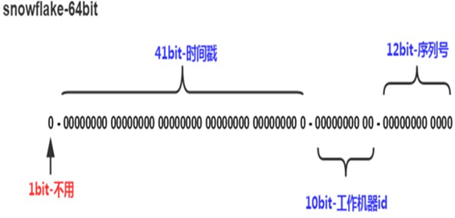

第一位符号位固定为0，41位时间戳，10位workId，12位序列号，位数可以有不同实现。

优点：每个毫秒值包含的ID值很多，不够可以变动位数来增加，性能佳（依赖workId的实现）。时间戳值在高位，中间是固定的机器码，自增的序列在低位，整个ID是趋势递增的。能够根据业务场景数据库节点布置灵活调整bit位划分，灵活度高。

缺点：强依赖于机器时钟，如果时钟回拨，会导致重复的ID生成，所以一般基于此的算法发现时钟回 拨，都会抛异常处理，阻止ID生成，这可能导致服务不可用。

## 如何解决不使用分区键的查询问题

****

+ 映射：将查询条件的字段与分区键进行映射，建一张单独的表维护(使用覆盖索引)或者在缓存中维 护
+ 基因法：分区键的后x个bit位由查询字段进行hash后占用，分区键直接取x个bit位获取分区，查询字段进行hash获取分区，适合非分区键查询字段只有一个的情况
+ 冗余：查询字段冗余存储

## Spring Cloud有哪些常用组件，作用是什么？

1. Eureka：注册中心
2. Nacos：注册中心、配置中心
3. Consul：注册中心、配置中心
4. Spring Cloud Config：配置中心
5. Feign/OpenFeign：RPC调用
6. Kong：服务网关
7. Zuul：服务网关
8. Spring Cloud Gateway：服务网关
9. Ribbon：负载均衡
10. Spring CLoud Sleuth：链路追踪
11. Zipkin：链路追踪
12. Seata：分布式事务
13. Dubbo：RPC调用
14. Sentinel：服务熔断
15. Hystrix：服务熔断

## 如何避免缓存穿透、缓存击穿、缓存雪崩？

缓存雪崩是指缓存同一时间大面积的失效，所以，后面的请求都会落到数据库上，造成数据库短时间内承受大量请求而崩掉。

解决方案：

+ 缓存数据的过期时间设置随机，防止同一时间大量数据过期现象发生。
+ 给每一个缓存数据增加相应的缓存标记，记录缓存是否失效，如果缓存标记失效，则更新数据缓存。
+ 缓存预热互斥锁

缓存穿透是指缓存和数据库中都没有的数据，导致所有的请求都落到数据库上，造成数据库短时间内承  受大量请求而崩掉。

解决方案：

+ 接口层增加校验，如用户鉴权校验，id做基础校验，`id<=0`的直接拦截；
+ 从缓存取不到的数据，在数据库中也没有取到，这时也可以将key-value对写为key-null，缓存有    效时间可以设置短点，如30秒（设置太长会导致正常情况也没法使用）。这样可以防止攻击用户 反复用同一个id暴力攻击
+ 采用布隆过滤器，将所有可能存在的数据哈希到一个足够大的 bitmap 中，一个一定不存在的数据会被这个 bitmap 拦截掉，从而避免了对底层存储系统的查询压力

缓存击穿是指缓存中没有但数据库中有的数据（一般是缓存时间到期），这时由于并发用户特别多，同  时读缓存没读到数据，又同时去数据库去取数据，引起数据库压力瞬间增大，造成过大压力。和缓存雪  崩不同的是，缓存击穿指并发查同一条数据，缓存雪崩是不同数据都过期了，很多数据都查不到从而查  数据库。

解决方案：

+ 设置热点数据永远不过期。加互斥锁

## 分布式系统中常用的缓存方案有哪些

+ 客户端缓存：页面和浏览器缓存，APP缓存，H5缓存，localStorage 和 sessionStorage CDN缓存：内容存储：数据的缓存，内容分发：负载均衡
+ nginx缓存：静态资源
+ 服务端缓存：本地缓存，外部缓存
+ 数据库缓存：持久层缓存（mybatis，hibernate多级缓存），mysql查询缓存 操作系统缓存：PageCache、BufferCache

## 缓存过期都有哪些策略？

+ 定时过期：每个设置过期时间的key都需要创建一个定时器，到过期时间就会立即清除。该策略可以立 即清除过期的数据，对内存很友好；但是会占用大量的CPU资源去处理过期的数据，从而影响缓存的响应时间和吞吐量
+ 惰性过期：只有当访问一个key时，才会判断该key是否已过期，过期则清除。该策略可以最大化地节省CPU资源，但是很消耗内存、许多的过期数据都还存在内存中。极端情况可能出现大量的过期key没有 再次被访问，从而不会被清除，占用大量内存。
+ 定期过期：每隔一定的时间，会扫描一定数量的数据库的expires字典中一定数量的key（是随机的）， 并清除其中已过期的key。该策略是定时过期和惰性过期的折中方案。通过调整定时扫描的时间间隔和 每次扫描的限定耗时，可以在不同情况下使得CPU和内存资源达到最优的平衡效果。
+ 分桶策略：定期过期的优化，将过期时间点相近的key放在一起，按时间扫描分桶。

## 常见的缓存淘汰算法

+ FIFO（First In First Out，先进先出），根据缓存被存储的时间，离当前最远的数据优先被淘汰；
+ LRU（LeastRecentlyUsed，最近最少使用），根据最近被使用的时间，离当前最远的数据优先被淘汰；
+ LFU（LeastFrequentlyUsed，最不经常使用），在一段时间内，缓存数据被使用次数最少的会被淘汰。

## 布隆过滤器原理，优缺点

+ 位图：int[10]，每个int类型的整数是4*8=32个bit，则int[10]一共有320 bit，每个bit非0即1，初始化时都是0
+ 添加数据时：将数据进行hash得到hash值，对应到bit位，将该bit改为1，hash函数可以定义多个，则      一个数据添加会将多个（hash函数个数）bit改为1，多个hash函数的目的是减少hash碰撞的概率
+ 查询数据：hash函数计算得到hash值，对应到bit中，如果有一个为0，则说明数据不在bit中，如果都为1，则该数据可能在bit中

优点：

+ 占用内存小
+ 增加和查询元素的时间复杂度为：O(K), (K为哈希函数的个数，一般比较小)，与数据量大小无关哈希函数相互之间没有关系，方便硬件并行运算
+ 布隆过滤器不需要存储元素本身，在某些对保密要求比较严格的场合有很大优势 数据量很大时，布隆过滤器可以表示全集
+ 使用同一组散列函数的布隆过滤器可以进行交、并、差运算

缺点：

+ 误判率，即存在假阳性(False  Position)，不能准确判断元素是否在集合中不能获取元素本身
+ 一般情况下不能从布隆过滤器中删除元素

## 分布式缓存寻址算法

****

+ hash算法：根据key进行hash函数运算、结果对分片数取模，确定分片   适合固定分片数的场景，扩展分片或者减少分片时，所有数据都需要重新计算分片、存储
+ 一致性hash：将整个hash值得区间组织成一个闭合的圆环，计算每台服务器的hash值、映射到圆环中。使用相同的hash算法计算数据的hash值，映射到圆环，顺时针寻找，找到的第一个服务器就是数据存储的服务器。新增及减少节点时只会影响节点到他逆时针最近的一个服务器之间的值 存在hash环倾斜的问题，即服务器分布不均匀，可以通过虚拟节点解决
+ hash   slot：将数据与服务器隔离开，数据与slot映射，slot与服务器映射，数据进行hash决定存放的slot，新增及删除节点时，将slot进行迁移即可

#####

## Spring Cloud和Dubbo有哪些区别？

Spring Cloud是一个微服务框架，提供了微服务领域中的很多功能组件，Dubbo一开始是一个RPC调用框架，核心是解决服务调用间的问题，Spring Cloud是一个大而全的框架，Dubbo则更侧重于服务调用，所以Dubbo所提供的功能没有Spring Cloud全面，但是Dubbo的服务调用性能比Spring Cloud高，不过Spring Cloud和Dubbo并不是对立的，是可以结合起来一起使用的。

#####

## 什么是服务雪崩？什么是服务限流？

1. 当服务A调用服务B，服务B调用C，此时大量请求突然请求服务A，假如服务A本身能抗住这些请求，但是如果服务C抗不住，导致服务C请求堆积，从而服务B请求堆积，从而服务A不可用，这就是服务雪崩，解决方式就是服务降级和服务熔断。
2. 服务限流是指在高并发请求下，为了保护系统，可以对访问服务的请求进行数量上的限制，从而防止系统不被大量请求压垮，在秒杀中，限流是非常重要的。

#####

## 什么是服务熔断？什么是服务降级？区别是什么？

1. 服务熔断是指，当服务A调用的某个服务B不可用时，上游服务A为了保证自己不受影响，从而不再调用服务B，直接返回一个结果，减轻服务A和服务B的压力，直到服务B恢复。
2. 服务降级是指，当发现系统压力过载时，可以通过关闭某个服务，或限流某个服务来减轻系统压力，这就是服务降级。

相同点：

1. 都是为了防止系统崩溃
2. 都让用户体验到某些功能暂时不可用

不同点：熔断是下游服务故障触发的，降级是为了降低系统负载

#####

## SOA、分布式、微服务之间有什么关系和区别？

1. 分布式架构是指将单体架构中的各个部分拆分，然后部署不同的机器或进程中去，SOA和微服务基本上都是分布式架构的
2. SOA是一种面向服务的架构，系统的所有服务都注册在总线上，当调用服务时，从总线上查找服务信息，然后调用
3. 微服务是一种更彻底的面向服务的架构，将系统中各个功能个体抽成一个个小的应用程序，基本保持一个应用对应的一个服务的架构

## 怎么拆分微服务？

拆分微服务的时候，为了尽量保证微服务的稳定，会有一些基本的准则：

1. 微服务之间尽量不要有业务交叉。
2. 微服务之前只能通过接口进行服务调用，而不能绕过接口直接访问对方的数据。
3. 高内聚，低耦合。

## 怎样设计出高内聚、低耦合的微服务？

高内聚低耦合，是一种从上而下指导微服务设计的方法。实现高内聚低耦合的工具主要有 同步的接口调用 和 异步的事件驱动 两种方式。

## 有没有了解过DDD领域驱动设计？

什么是DDD： 在2004年，由Eric Evans提出了， DDD是面对软件复杂之道。Domain-Driven- Design –Tackling Complexity in the Heart of Software

大泥团： 不利于微服务的拆分。大泥团结构拆分出来的微服务依然是泥团机构，当服务业务逐渐复杂，这个泥团又会膨胀成为大泥团。

DDD只是一种方法论，没有一个稳定的技术框架。DDD要求领域是跟技术无关、跟存储无关、跟通信无关。

## 什么是中台？

所谓中台，就是将各个业务线中可以复用的一些功能抽取出来，剥离个性，提取共性，形成一些可复用的组件。  

大体上，中台可以分为三类 业务中台、数据中台和技术中台。大数据杀熟-数据中台

中台跟DDD结合：  DDD会通过限界上下文将系统拆分成一个一个的领域， 而这种限界上下文，天生就成了中台之间的逻辑屏障。

DDD在技术与资源调度方面都能够给中台建设提供不错的指导。

DDD分为战略设计和战术设计。 上层的战略设计能够很好的指导中台划分，下层的战术设计能够很好的指导微服务搭建。

## 你的项目中是怎么保证微服务敏捷开发的？

+ 开发运维一体化。
+ 敏捷开发： 目的就是为了提高团队的交付效率，快速迭代，快速试错
+ 每个月固定发布新版本，以分支的形式保存到代码仓库中。快速入职。任务面板、站立会议。团队人员灵活流动，同时形成各个专家代表
+ 测试环境- 生产环境 -开发测试环境SIT-集成测试环境-压测环境STR-预投产环境-生产环境PRD
+ 晨会、周会、需求拆分会

## 如何进行消息队列选型？

+ Kafka：
  + 优点： 吞吐量非常大，性能非常好，集群高可用。
  + 缺点：会丢数据，功能比较单一。
  + 使用场景：日志分析、大数据采集
+ RabbitMQ：
  + 优点： 消息可靠性高，功能全面。
  + 缺点：吞吐量比较低，消息积累会严重影响性能。erlang语言不好定制。
  + 使用场景：小规模场景。
+ RocketMQ：
  + 优点：高吞吐、高性能、高可用，功能非常全面。
  + 缺点：开源版功能不如云上商业版。官方文档和周边生态还不够成熟。客户端只支持java。
  + 使用场景：几乎是全场景。

## RocketMQ的事务消息是如何实现的


    1. 生产者订单系统先发送一条half消息到Broker，half消息对消费者而言是不可见的
    2. 再创建订单，根据创建订单成功与否，向Broker发送commit或rollback
    3. 并且生产者订单系统还可以提供Broker回调接口，当Broker发现一段时间half消息没有收到任何操作命令，则会主动调此接口来查询订单是否创建成功
    4. 一旦half消息commit了，消费者库存系统就会来消费，如果消费成功，则消息销毁，分布式事务成功结束
    5. 如果消费失败，则根据重试策略进行重试，最后还失败则进入死信队列，等待进一步处理

## 为什么RocketMQ不使用Zookeeper作为注册中心呢？

根据CAP理论，同时最多只能满足两个点，而zookeeper满足的是CP，也就是说zookeeper并不能保证服务的可用性，zookeeper在进行选举的时候，整个选举的时间太长，期间整个集群都处于不可用的状态，而这对于一个注册中心来说肯定是不能接受的，作为服务发现来说就应该是为可用性而设计。

基于性能的考虑，NameServer本身的实现非常轻量，而且可以通过增加机器的方式水平扩展，增加集群的抗压能力，而zookeeper的写是不可扩展的，而zookeeper要解决这个问题只能通过划分领域，划分多个zookeeper集群来解决，首先操作起来太复杂，其次这样还是又违反了CAP中的A的设计，导致服务之间是不连通的。

持久化的机制来带的问题，ZooKeeper 的 ZAB 协议对每一个写请求，会在每个 ZooKeeper 节点上保持写一个事务日志，同时再加上定期的将内存数据镜像（Snapshot）到磁盘来保证数据的一致性和持久性，而对于一个简单的服务发现的场景来说，这其实没有太大的必要，这个实现方案太重了。而且本身存储的数据应该是高度定制化的。

消息发送应该弱依赖注册中心，而RocketMQ的设计理念也正是基于此，生产者在第一次发送消息的时候从NameServer获取到Broker地址后缓存到本地，如果NameServer整个集群不可用，短时间内对于生产者和消费者并不会产生太大影响。

## RocketMQ的实现原理

RocketMQ由NameServer注册中心集群、Producer生产者集群、Consumer消费者集群和若干Broker（RocketMQ进程）组成，它的架构原理是这样的：

Broker在启动的时候去向所有的NameServer注册，并保持长连接，每30s发送一次心跳

Producer在发送消息的时候从NameServer获取Broker服务器地址，根据负载均衡算法选择一台服务器来发送消息

Conusmer消费消息的时候同样从NameServer获取Broker地址，然后主动拉取消息来消费

## RocketMQ为什么速度快

因为使用了顺序存储、Page Cache和异步刷盘。我们在写入commitlog的时候是顺序写入的，这样比随机写入的性能就会提高很多，写入commitlog的时候并不是直接写入磁盘，而是先写入操作系统的PageCache，最后由操作系统异步将缓存中的数据刷到磁盘

## 消息队列如何保证消息可靠传输

消息可靠传输代表了两层意思，既不能多也不能少。

1. 为了保证消息不多，也就是消息不能重复，也就是生产者不能重复生产消息，或者消费者不能重复消费消息
2. 首先要确保消息不多发，这个不常出现，也比较难控制，因为如果出现了多发，很大的原因是生产者自己的原因，如果要避免出现问题，就需要在消费端做控制
3. 要避免不重复消费，最保险的机制就是消费者实现幂等性，保证就算重复消费，也不会有问题，通过幂等性，也能解决生产者重复发送消息的问题
4. 消息不能少，意思就是消息不能丢失，生产者发送的消息，消费者一定要能消费到，对于这个问题，就要考虑两个方面
5. 生产者发送消息时，要确认broker确实收到并持久化了这条消息，比如RabbitMQ的confirm机制，Kafka的ack机制都可以保证生产者能正确的将消息发送给broker
6. broker要等待消费者真正确认消费到了消息时才删除掉消息，这里通常就是消费端ack机制，消费者接收到一条消息后，如果确认没问题了，就可以给broker发送一个ack，broker接收到ack后才会删除消息

## 消息队列有哪些作用

1. 解耦：使用消息队列来作为两个系统之间的通讯方式，两个系统不需要相互依赖了
2. 异步：系统A给消息队列发送完消息之后，就可以继续做其他事情了
3. 流量削峰：如果使用消息队列的方式来调用某个系统，那么消息将在队列中排队，由消费者自己控制消费速度

#####

## 死信队列是什么？延时队列是什么？

1. 死信队列也是一个消息队列，它是用来存放那些没有成功消费的消息的，通常可以用来作为消息重试
2. 延时队列就是用来存放需要在指定时间被处理的元素的队列，通常可以用来处理一些具有过期性操作的业务，比如十分钟内未支付则取消订单

## 如何保证消息的高效读写？

零拷贝： kafka和RocketMQ都是通过零拷贝技术来优化文件读写。

传统文件复制方式： 需要对文件在内存中进行四次拷贝。

零拷贝： 有两种方式， mmap和transfile，Java当中对零拷贝进行了封装， Mmap方式通过MappedByteBuffer对象进行操作，而transfile通过FileChannel来进行操作。Mmap 适合比较小的文件，通常文件大小不要超过1.5G ~2G 之间。Transfile没有文件大小限制。RocketMQ当中使用Mmap方式来对他的文件进行读写。

在kafka当中，他的index日志文件也是通过mmap的方式来读写的。在其他日志文件当中，并没有使用零拷贝的方式。Kafka使用transfile方式将硬盘数据加载到网卡。

## epoll和poll的区别

1. select模型，使用的是数组来存储Socket连接文件描述符，容量是固定的，需要通过轮询来判断是否发生了IO事件
2. poll模型，使用的是链表来存储Socket连接文件描述符，容量是不固定的，同样需要通过轮询来判断是否发生了IO事件
3. epoll模型，epoll和poll是完全不同的，epoll是一种事件通知模型，当发生了IO事件时，应用程序才进行IO操作，不需要像poll模型那样主动去轮询

## TCP的三次握手和四次挥手

TCP协议是7层网络协议中的传输层协议，负责数据的可靠传输。

在建立TCP连接时，需要通过三次握手来建立，过程是：

1. 客户端向服务端发送一个SYN
2. 服务端接收到SYN后，给客户端发送一个SYN_ACK
3. 客户端接收到SYN_ACK后，再给服务端发送一个ACK

在断开TCP连接时，需要通过四次挥手来断开，过程是：

1. 客户端向服务端发送FIN
2. 服务端接收FIN后，向客户端发送ACK，表示我接收到了断开连接的请求，客户端你可以不发数据了，不过服务端这边可能还有数据正在处理
3. 服务端处理完所有数据后，向客户端发送FIN，表示服务端现在可以断开连接
4. 客户端收到服务端的FIN，向服务端发送ACK，表示客户端也会断开连接了

## 浏览器发出一个请求到收到响应经历了哪些步骤？

1. 浏览器解析用户输入的URL，生成一个HTTP格式的请求
2. 先根据URL域名从本地hosts文件查找是否有映射IP，如果没有就将域名发送给电脑所配置的DNS进行域名解析，得到IP地址
3. 浏览器通过操作系统将请求通过四层网络协议发送出去
4. 途中可能会经过各种路由器、交换机，最终到达服务器
5. 服务器收到请求后，根据请求所指定的端口，将请求传递给绑定了该端口的应用程序，比如8080被tomcat占用了
6. tomcat接收到请求数据后，按照http协议的格式进行解析，解析得到所要访问的servlet
7. 然后servlet来处理这个请求，如果是SpringMVC中的DispatcherServlet，那么则会找到对应的Controller中的方法，并执行该方法得到结果
8. Tomcat得到响应结果后封装成HTTP响应的格式，并再次通过网络发送给浏览器所在的服务器
9. 浏览器所在的服务器拿到结果后再传递给浏览器，浏览器则负责解析并渲染

## 跨域请求是什么？有什么问题？怎么解决？

跨域是指浏览器在发起网络请求时，会检查该请求所对应的协议、域名、端口和当前网页是否一致，如果不一致则浏览器会进行限制，比如在www.baidu.com的某个网页中，如果使用ajax去访问www.jd.com是不行的，但是如果是img、iframe、script等标签的src属性去访问则是可以的，之所以浏览器要做这层限制，是为了用户信息安全。但是如果开发者想要绕过这层限制也是可以的：

1. response添加header，比如resp.setHeader("Access-Control-Allow-Origin", "*");表示可以访问所有网站，不受是否同源的限制
2. jsonp的方式，该技术底层就是基于script标签来实现的，因为script标签是可以跨域的
3. 后台自己控制，先访问同域名下的接口，然后在接口中再去使用HTTPClient等工具去调用目标接口
4. 网关，和第三种方式类似，都是交给后台服务来进行跨域访问

## 零拷贝是什么

零拷贝指的是，应用程序在需要把内核中的一块区域数据转移到另外一块内核区域去时，不需要经过先复制到用户空间，再转移到目标内核区域去了，而直接实现转移。

                        

## MySQL里有2000w数据Redis中只存20w的数据，如何保证 redis 中的数据都是热点数据？（北冥）

首先我们可以看到Redis的空间实际上比我们MySQL少的多，那么Redis如何能够筛选出热点数据，这道题主要考察的是Redis的数据淘汰策略（这里有个误区，很多人容易混淆把数据淘汰策略当做数据过期策略），在Redis 4.0之后是为我们提供了8种淘汰策略，4.0之前则是提供的6种，主要是新增了LFU算法。其实说说是有8种，但是真正意义上是5种，针对random、lru、lfu是提供了两种不同数据范围的策略，一种是针对设置了过期时间的，一种是没有设置过期时间的。具体的五种策略分别为：

1. noeviction 选择这种策略则代表不进行数据淘汰，同时它也是redis中默认的淘汰策略，当缓存写满时redis就不再提供写服务了，写请求则直接返回失败。
2. random 随机策略这块则是分为两种，一种是volatile，这种是设置了过期时间得数据集，而另外一种是allkeys，这种是包含了所有的数据，当我们缓存满了的时候，选用这种策略就会在我们的数据集中进行随机删除。
3. volatile-ttl 这种策略是针对设置了过期时间的数据，并且按照过期时间的先后顺序进行删除，越早过期的越先被删除
4. lru 这里的lru策略和我们上面random策略一样也是提供了两种数据集进行处理，LRU算法全程为（最近最少使用）简单一句话来概括就是“如果数据最近被访问过，那么将来被访问的几率也就越高”。这种算法其实已经比较符合我们的实际业务需求了，但是还是存在一些缺陷。
5. lfu 最后一种策略就是我们的LFU算法，它是在我么LRU算法基础上增加了请求数统计，这样能够更加精准的代表我们的热点数据。

我们再回看我们的这个问题，我们能很清楚的知道，我们需要的策略是LFU算法。选择volatile还是allkeys就要根据具体的业务需求了。

## JDK19中的大杀器：虚拟线程，到底是什么？

**图灵课堂-周瑜**

JDK19中的虚拟线程就是业界的协程。

因为协程是用户态的，线程是操作系统内核态的，所以协程仍然基于的是线程，一个线程可以承载多个协程，但如果所有协程都只基于一个线程，那样效率肯定会不高，所以JDK19中协程会基于ForkJoinPool线程池，利用多个线程来支持协程的运行，并且利用ForkJoinPool，而不是普通的ThreadPoolExecutor，可以支持大任务的拆分。

JDK19中的协程底层是基于ForkJoinPool的，相当于，我们在利用协程执行Runnable时，底层会把Runnable提交到一个ForkJoinPool中去执行，我们可以通过：

+ -Djdk.virtualThreadScheduler.parallelism=1
+ -Djdk.virtualThreadScheduler.maxPoolSize=1

这两个参数来设置ForkJoinPool的核心线程数和最大线程数：

+ parallelism默认为Runtime.getRuntime().availableProcessors()
+ maxPoolSize默认为256

ForkJoinPool中的线程在执行任务过程中，一旦线程阻塞了，比如sleep、lock、io操作时，那么这个线程就会去执行ForkJoinPool中的其他任务，从而可以做到一个线程在执行过程中，也能并发的执行多个任务，达到协程并发执行任务的效果。

## 高并发下我们如何去保证接口的幂等性?（北冥）

首先普及下幂等的概念

> “在编程中一个幂等操作的特点是其任意多次执行所产生的影响均与一次执行的影响相同。幂等函数，或幂等方法，是指可以使用相同参数重复执行，并能获得相同结果的函数”
>

那么在我们的实际业务场景中幂等是一个非常高频的场景，比如：

+ 电商场景中用户因网络问题多次点击导致重复下单问题
+ MQ消息队列的重复消费
+ RPC中的超时重试机制
+ 等等

那么我们有那些方案可以解决我们的幂等性问题呢？

+ 数据库唯一主键实现幂等性
  + 其实现方式是使用分布式ID充当主键，不使用MySQL中的自增主键
+ 乐观锁实现幂等性
  + 在表中增加版本号标识，只有版本号标识一直才更新成功
+ 分布式锁
  + 简单来说就是分布式的排他锁，但是我们可以控制锁的粒度以提高程序的执行性能
+ 获取token
    1. 服务端提供获取 Token 的接口，请求前客户端调用接口获取 Token
    2. 然后将该串存入 Redis 数据库中，以该 Token 作为 Redis 的键（注意设置过期时间）。
    3. 将 Token 返回到客户端，在执行业务请求带上该 Token
    4. 服务端接收到请求后根据 Token 到 Redis 中查找该 key 是否存在（注意原子性），
    5. 如果存在就将该 key 删除，然后正常执行业务逻辑。如果不存在就抛异常，返回重复提交的错误信息。

## Redis如何保证与数据库的双写一致性（北冥）

我们来分析一下这道面试题，这道题主要是偏实际应用的

缓存可以提升性能，减轻数据库压力，在获取这部分好处的同时，它却带来了一些新的问题，缓存和数据库之间的数据一致性问题。

想必大家在工作中只要用了咱们缓存势必就会遇到过此类问题，那这道题该如何回答呢？

首先我们来看看一致性：

+ 强一致性：任何一次读都能读到某个数据的最近一次写的数据。
+ 弱一致性：数据更新后，如果能容忍后续的访问只能访问到部分或者全部访问不到，则是弱一致性。

解决双写一致性方案：

+ 延迟双删
  + 延迟双删策略是分布式系统中数据库存储和缓存数据保持一致性的常用策略，但它不是强一致。
  + 实现思路：也是非常简单的，先删除缓存然后更新DB在最后延迟 N 秒去再去执行一次缓存删除
  + 弊端：小概率会出现不一致情况、耦合程度高
+ 通过MQ进行重试删除
  + 更新完DB之后进行删除，如果删除失败则向MQ发送一条消息，然后消费者不断进行删除尝试。
+ binlog异步删除
  + 实现思路：低耦合的解决方案是使用canal。canal伪装成mysql的从机，监听主机mysql的二进制文件，当数据发生变化时发送给MQ。最终消费进行删除

## 谈谈缓存穿透、击穿、雪崩的区别，又如何去解决？(北冥)

#### 面试题分析

这道题主要考察的是求职者是否具有高并发思维,它也是在面试中一道高频的考点

#### 缓存穿透
>
> 缓存穿透代表的意思是在我们的缓存中没有找到缓存信息，那么我们在高并发场景下就会面临所有的请求都会直接打到DB，缓存则失去了它原本的意义，并且极有可能导致数据库压力过大而造成服务不可用。
>

+ 缓存空结果信息
+ 布隆过滤器（不存在的一定不存在，存在的可能不存在，通过bitmap实现，想深入布隆过滤器可以专门去看看这部分专题内容）
+ 过滤常见非法参数，拦截大部分无效请求（）

#### 缓存击穿
>
> 缓存击穿代表的意思是我们数据库中存在数据,但是缓存中不存在数据.这种场景一般是在缓存失效时发生的. 在高并发的场景下极有可能瞬间打垮数据库.
>

+ 我们可以考虑面对请求量大的热点接口直接将缓存设置永不过期.
+ 当然我们也可能碰到一些特殊场景不能设置永久缓存,那么我们可以在db为空时设置互斥锁,当查询完db更新至缓存时再释放锁

#### 缓存雪崩
>
> 缓存雪崩代表是意思是我们在某一个时间段,碰到大量热点缓存数据过期导致大量请求直接打垮数据库
>

+ 我们可以考虑面对请求量大的热点接口直接将缓存设置永不过期.
+ 缓存过期时间可以设置一个随机的波动值,防止大量数据在同一时间过期

## 10分钟带你了解灰度发布（北冥）

:::warning
灰度发布（又名金丝雀发布）是指在黑与白之间，能够平滑过渡的一种发布方式。在其上可以进行A/B testing，即让一部分用户继续用产品特性A，一部分用户开始用产品特性B，如果用户对B没有什么反对意见，那么逐步扩大范围，把所有用户都迁移到B上面来。灰度发布可以保证整体系统的稳定，在初始灰度的时候就可以发现、调整问题，以保证其影响度。

:::

**全量发布**

+ **回滚周期长**
+ **BUG导致服务集群雪崩**
+ **服务可用性差，影响用户体验**

**灰度发布**

+ **降低发布影响面，提升用户体验**
+ **可以做到不停机迁移**
+ **回滚速度快**

:::info
**发布方案对比图**

:::

| 策略 | 零停机 | 生产流量测试 | 针对特定用户 | 机器资源成本 | 回滚时长 | 负面影响 | 实现复杂度 |
| :--- | :--- | :--- | :--- | :--- | :--- | :--- | :--- |
| 全量发布 | × | × | × | 低 | 慢 | 高 | 低 |
| 蓝绿发布 | √ | × | × | 高（双倍） | 快 | 中 | 中 |
| 金丝雀发布 | √ | √ | √ | 中（按需） | 快 | 低 | 中 |
| 全链路灰度 | √ | √ | √ | 中（按需） | 快 | 低 | 高 |

**金丝雀发布**

:::info
据说以前有个典故，矿工开矿前，会先放一只金丝雀下去，看金丝雀是否能活下来，用来探测是否有毒气，金丝雀发布也是由此得名。

:::

灰度发布是指在黑与白之间，能够平滑过渡的一种发布方式。AB test就是一种灰度发布方式，让一部分用户继续用A，一部分用户开始用B，如果用户对B没有什么反对意见，那么逐步扩大范围，把所有用户都迁移到B上面来。灰度发布可以保证整体系统的稳定，在初始灰度的时候就可以发现、调整问题，以保证其影响度，而我们平常所说的金丝雀部署也就是灰度发布的一种方式。

**全链路灰度发布**  
 全链路灰度治理策略主要专注于整个调用链，它不关心链路上经过具体哪些微服务，流量控制视角从服务转移至请求链路上，仅需要少量的治理规则即可构建出从网关到整个后端服务的多个流量隔离环境，有效保证了多个亲密关系的服务顺利安全发布以及服务多版本并行开发，进一步促进业务的快速发展。

## Redis 事务支持 ACID 么？（北冥）

**原子性(Atomicity)：**一个事务的多个操作必须完成，或者都不完成。

**一致性(Consistency)：**事务执行结束后，数据库的完整性约束没有被破坏，事务执行的前后顺序都是合法数据状态。

**隔离性(Isolation)：**事务内部的操作与其他事务是隔离的，并发执行的各个事务之间不能互相干扰。

**持久性(Durability)：**事务一旦提交，所有的修改将永久的保存到数据库中，即使系统崩溃重启后数据也不会丢失。

redis事务功能是通过MULTI、EXEC、DISCARD和WATCH 四个原语实现的

Redis会将一个事务中的所有命令序列化，然后按顺序执行。

单独的隔离操作

+ 事务中的所有命令都会序列化、按顺序地执行。事务在执行的过程中，不会被其他客户端发送来的命令请求所打断。

没有隔离级别的概念

+ 队列中的命令没有提交之前都不会实际被执行，因为事务提交前任何指令都不会被实际执行

不保证原子性

+ 事务中如果有一条命令执行失败，其后的命令仍然会被执行，没有回滚

注：redis的discard只是结束本次事务,正确命令造成的影响仍然存在.

1）MULTI命令用于开启一个事务，它总是返回OK。MULTI执行之后，客户端可以继续向服务器发送任意多条命令，这些命令不会立即被执行，而是被放到一个队列中，当EXEC命令被调用时，所有队列中的命令才会被执行。

2）EXEC：执行所有事务块内的命令。返回事务块内所有命令的返回值，按命令执行的先后顺序排列。当操作被打断时，返回空值 nil 。

3）通过调用DISCARD，客户端可以清空事务队列，并放弃执行事务， 并且客户端会从事务状态中退出。

4）WATCH 命令可以为 Redis 事务提供 check-and-set （CAS）行为。可以监控一个或多个键，一旦其中有一个键被修改（或删除），之后的事务就不会执行，监控一直持续到EXEC命令。

## Redis持久化有那些方案，线上又是如何配置的呢？（北冥）

:::color3
Redis为我们提供了两种持久化方案，一种是RDB另外一种是AOF

:::

#### RDB快照
>
> RDB (Redis DataBase) 把当前进程数据生成快照保存到磁盘上的过程，由于是某一时刻的快照，那么快照中的值要早于或者等于内存中的值。
>

**优点**

1. **基于某个时间节点的快照，压缩后文件体积小**
2. **加载RDB文件恢复快**

**缺点**

1. **实时性不够**
2. **通过bgsave进行备份时，需要fork一个子线程，频繁执行性能成本高**

#### AOF
>
> Redis是“写后”日志，Redis先执行命令，把数据写入内存，然后才记录日志。日志里记录的是Redis收到的每一条命令，这些命令是以文本形式保存。
>

**优点**

1. **根据策略的不同AOF的方式能做到基本不丢失数据**

**缺点**

1. **文件体积大，AOF的文件体积要大于RDB**
2. **在大数据量情况下恢复速度慢**


#### 混合持久化

```makefile
// 开启混合持久化
aof-use-rdb-preamble yes
```

### Redisson实现分布式锁原理（北冥）

:::color3
我们在实现分布式锁的技术方案有很多比如Redis，Zookeeper等等。那么我们今天就讲讲Redisson实现分布式锁的机制是怎么样的。

:::

#### 首先我们来讲讲实现一个分布式锁我们需要考虑那些东西？

+ **互斥性  setnx**
+ **防死锁**
+ **可重入性**
+ **高性能**

#### 一张图带你弄懂Redisson分布式锁原理


## 什么是CAP定理和Base理论？(北冥)

#### CAP

在计算机科学中，我们只要碰到分布式系统就逃不开我们的CAP定理，它是我们分布式系统中的基石。那我们就来一步步揭开它的神秘面纱。

起源是美国一所高校的教授在2000年在ACM研讨会上提出了猜想，到02年的时候MIT的两名学生就证明了猜想就成为了定理。

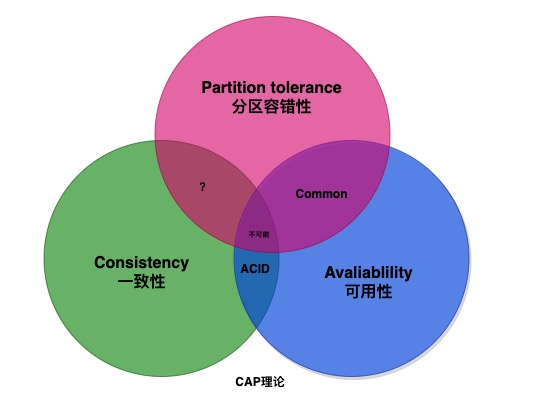

CAP定理是由三次单词组成：

+ 一致性（等同于所有节点访问同一份最新的数据副本）
+ 可用性 (每次请求都能获取到非错的响应——但是不保证获取的数据为最新数据)
+ 分区容错性 (以实际效果而言，分区相当于对通信的时限要求。系统如果不能在时限内达成数据一致性，就意味着发生了分区的情况， 必须就当前操作在C和A之间作出选择)

定理指出对于一个分布式系统来说**不可能同时满足以上三种特性。**在理解CAP理论的最简单方式是想象两个节点分处分区两侧。 允许至少一个节点更新状态会导致数据不一致， 即丧失了C性质。如果为了保证数据一致性，将分区一侧的节点设置为不可用， 那么又丧失了A性质。 除非两个节点可以互相通信， 才能既保证C又保证A，这又导致丧失了P性质。 也就是说，如图所示的三者交叉的位置，是不可能实现的。

既然CAP三者同时满足的条件是不可能的， 所以在系统设计的时候就需要作出取舍，比如弱化某些特性来支持其他两者。

**弱化一致性** 对结果不敏感的应用， 可以允许在新版本上线后过一段时间才能更新成功，不保证强一致性，保持最终状态的一致性。 典型的如，静态网站。

**弱化可用性** 对结果一致性很敏感的应用，如银行取款机，当系统发生故障时停止服务。 如清结算，转账等。 目前的paxos、raft等算法都是为保证强一致而设计的。这些系统会在 内部异常时拒绝或者阻塞客户端请求。

**弱化分区容错性** 现实中， 网络分区出现概率较小， 但难以避免。实践中，网络通信通过双通道等机制增强可靠性，达到高稳定的网络通信。

#### BASE理论

那我们再来看看Base理论（Basically Available（基本可用）、Soft state（软状态）、Eventually consistent（最终一致性）的缩写）；它基于CAP定理逐步演化来的，它是CAP中一致性和可用性权衡的结果，其核心思想是即使系统无法达到强一致性，可以**根据应用自身的业务特点，采用适当的方式来使系统达到最终一致性**。

**基本可用**是指当分布式系统发生故障的时候，允许损失部分可用性。常见的有以下几种情况：

+ 响应时间上的损失：正常情况下，一个在线搜索引擎需要再0.5秒之内返回给用户响应的查询结果，但由于出现故障，查询结果的响应时间增加到了1~2秒。
+ 功能上的损失：通常的做法是**降级服务**，如对于展示一些有序元素的页面，但部分组件出现故障时，这个时候可不展示有序元素，降级为无序元素列表。

**软状态**是指允许系统中的数据存在中间状态，并认为该中间状态的存在不影响系统的整体可用性，即允许系统不同节点的数据副本之间进行数据同步的过程中存在延时。

**最终一致性**强调的是系统所有的数据副本，在经过一段时间的同步后，最终能够达到一个一致的状态。因此，最终一致性的本质是需要系统保证最终数据能够达到一致，而不需要试试保证系统数据的强一致性。

## 面试官问你知道怎么用Java代码写一个死锁吗？(北冥)

这道面试题是考察面试者对死锁的了解程度，在这个角度来提问也是很有趣。

首先，我们如果要实现死锁的话有四个必要的条件

+ **互斥使用**（也就是说当我们的资源被一个线程占有时，那别的线程也就不能使用了）
+ **不可抢占**（请求线程不能强制从占用线程夺取资源，只能由占有线程主动去释放）
+ **请求和保持**（当请求线程在请求其他资源的时候要保持对原有资源的占有）
+ **循环等待**（要存在一个循环等待，也就是说A线程要B资源，而B线程要A资源。这就形成了一个等待环路）

那么我们解决死锁由那些方案呢？

+ **设置超时时间**（如果我们在某个时间段里面没有拿到锁的话，我们就不再死等了，去做别的事情，比如说用JUC包里面Lock接口提供的tryLock方法，而不是像用synchronized那样去一直等待。）
+ **降低锁粒度（比如说一个类如果使用一个锁来保护的话，第一个问题是效率低，还有就是死锁风险非常大，只要能够满足我们业务的要求就去尽量减少锁的使用）**
+ **避免嵌套锁（我们前面演示的例子就是一个嵌套锁，那么在多线程环境使用时，一旦获取锁的顺序反了，就势必会造成死锁）**
+ **专锁专用（不要很多功能都去用同一把锁，去避免锁冲突，如果很多线程都用同一把锁，就很容易造成死锁）**
+ **银行家算法（这种思想有一个著名的算法叫做银行家算法，其核心就是分配资源时先看能不能收回来资源（也就是说在分配之前先算一下如果分配出去了会不会造成死锁，要是收不回来造成死锁就不分配锁给这个线程，要是能收回来就分配。）**

****

## MySQL8隐藏索引（北冥）
>
> MySQL 8.0 支持了 `Invisible Indexes` 隐藏索引 这个特性，可以把某个索引设置为对优化器不可见，生成查询计划时便不使用这个索引了，但这个索引还是被正常维护的，例如表数据变更后还是会更新索引。
>
> 我们都知道维护一个索引带来的成本是很高的，当数据量越大的时候成本越高。不知道大家有没有遇到过一种场景就是做数据库优化时，我们可能会去删除一些多余的索引，我们要去线上禁用掉一个索引然后去观察对查询效率的一个影响，在8.0之前我们可能只能将数据导出到一个新的环境，然后再去删除掉这个索引，如果观察发现影响面比较大，那么就不能去删。还有一种方案是直接删线上的索引不行再加回来，稍微体量大一点的公司都是不被允许的。
>
> 那么在8.0 之后我们就不用这么麻烦了，官方为我们提供了一个新的功能叫隐藏索引，或者你可以理解成为灰度索引，它的作用类似于回收站功能。虽然我删除了某个文件但是这个文件其实还在。如果碰到上面的这种场景，就可以直接使用这个隐藏索引。
>

### 索引设置为隐藏索引

```sql
alter table xxx alter index xxx invisible;
```

### 索引设置为非隐藏索引

```sql
alter table xxx alter index xxx visible;
```

## private修饰的方法可以通过反射访问，那么private的意义是什么？(北冥)

在Java当中，如果为了我们不想让别人访问某些属性、方法，我们通常的做法是使用private关键字进行修饰。但是Java语言在设计时却允许通过反射来进行访问，只需要关掉访问检查就可以了。

```java
import java.lang.reflect.Field;

public class Test {

    public static void main(String[] args) {
        C c = new C();
        try {
            Field f = C.class.getDeclaredField("a");
            f.setAccessible(true);
            Integer i = (Integer)f.get(c);
            System.out.println(i);
        } catch (Exception e) {}
    }
}

class C {
    private Integer a = 6;
}
```

那么private修饰符不是失去了它原本的意义了吗？

其实不尽然，本身private修饰符是基于OOP思想下封装概念的一种体现，对于使用者而言是一种约束，并不是一种安全机制。就好比说，你在道路上行驶，导航时不时提醒你限速，这是道路交通法的规定，但是救护车碰上情况是不是也会超速对吧，这个就是这两者的差异。

你在用spring的IoC的时候，你知道你要“注入”，不管它是不是private的，都能够注入进去对吧。

如果你按照遵守这套规则，开发者在不考虑bug的情况下可以保证不出问题，否则就很有可能在你意想不到的地方带来灾难性的后果。

## MySQL8新特性-降序索引（北冥）

降序索引，顾名思义是指索引是按照从大到小降序排列的，和升序索引的顺序相反，平时我们创建的普通索引都是默认升序的。

当我们的查询SQL，只包含一个列的时候，无论是使用降序索引还是升序索引，整个查询过程的性能是一样的。当SQL中有多个列，但是每个列的排序顺序不一样的时候，降序所以就能起到比较重要的作用，下面我们慢慢分析。

## MySQL8新特性-默认字符集变更 (北冥)

我们知道在MySQL8.0版本之前，那么默认的字符集为`latin-1` ,而UTF8字符集指向的是`utf8mb3`，不知道大家在工作中是否被它坑过，名字就非常具有误导性，在面对一些生僻字、表情之类的内容，进行存储时会提示SQL异常。

```java
SQLException: Incorrect string value: ‘\xF0\xA1\x8B\xBE\xE5\xA2…’ for column ‘name’
```

`utfmb3` 后面的mb其实指的是 `most bytes` ，也就是最多占用几个字节。而mysql中字符串长度算的是字符数而不是字节数，那么对于char类型来说，需要保留足够的空间。我们用的utf8字符集，需要保留的长度就是 utf8 最长字符长度乘以字符串长度，所以这里理所当然的限制了 utf8 最大长度为 3。如果我们需要更好的一个兼容性，应该使用utf8mb4而不是utf8，对于char类型可能空间占用会多消耗一些， Mysql 官方建议是使用 VARCHAR  替代 CHAR。

在MySQL8.0开始，数据库的默认编码从`latin1`就改成了`utf8mb4` ，避免了我们可能忘记修改而带来的问题，我们基本上不用再为字符集而操心了。

## 惊，MySQL8居然抛弃了查询缓存！！！（北冥）

英雄也有落幕时，MySQL8.0 已经删除了查询缓存，Query Cache 便正式退出了历史舞台，实际上在5.7 版本中已经可以通过缺省值query_cache_type控制，且默认是处于关闭状态。在官方文档中也是标注为了Deprecated 。

经历过如此多版本迭代了查询缓存，官方为什么要抛弃呢？设计的初衷又是什么呢？那么接下来我就带领大家来一步一步深入学习。

### 查询缓存

The query cache stores the text of a [SELECT](https://docs.oracle.com/cd/E17952_01/mysql-5.6-en/select.html) statement together with the corresponding result that was sent to the client. If an identical statement is received later, the server retrieves the results from the query cache rather than parsing and executing the statement again. The query cache is shared among sessions, so a result set generated by one client can be sent in response to the same query issued by another client. The query cache can be useful in an environment where you have tables that do not change very often and for which the server receives many identical queries. This is a typical situation for many Web servers that generate many dynamic pages based on database content. The query cache does not return stale data. When tables are modified, any relevant entries in the query cache are flushed.

查询缓存存储 SELECT 语句的文本以及发送到客户端的相应结果。如果稍后收到相同的语句，服务器将从查询缓存中检索结果，而不是再次解析和执行该语句。查询缓存在会话之间共享，因此可以将一个客户机生成的结果集发送给另一个客户机发出的相同查询。

查询缓存在这样的环境中非常有用，即表不经常更改，并且服务器收到许多相同的查询。对于许多基于数据库内容生成许多动态页面的 Web 服务器来说，这是一种典型的情况。

查询缓存不返回过期数据。修改表时，将刷新查询缓存中的任何相关条目。

摘自MySQL官方文档： [https://docs.oracle.com/cd/E17952_01/mysql-5.6-en/query-cache.html](https://docs.oracle.com/cd/E17952_01/mysql-5.6-en/query-cache.html)

### 工作原理

在解析之前将传入查询与查询缓存中的查询进行比较，因此查询缓存认为以下两个查询是不同的:

SELECT *FROM tbl_name Select* from tbl_name

虽然两条查询语句是意义是一样的，但是mysql会为这条SQL生成一个hash值。尽管是小写和大写的区别，但还是会被认定为2条查询语句。

之后就是将hash值和查询结果缓存在Query Cache 中，后续查询语句都会通过hash值对比如果一致就返回缓存结果，否则就去数据库中查询。

官方设计之初就是考虑用此来提升查询效率，因为Query Cache 区域是放在内存中，如果业务中存在大量的重复请求查询，那也就不用去进行SQL解析、优化、硬盘查询等一系列操作了。性能的提升是非常巨大的。

**看上去是非常不错，那为什么官方要将至删除呢？**

+ 首先在前面也和大家讲到过，通过sql语句对比，尽管大小写不同缓存还是无法命中，但实际我们在生产环境中，有很多业务实际一致返回结果也一致，但是由于这种比较苛刻的要求，会导致无法命中。
+ 第二点就是缓存过期策略也是非常苛刻，我们只要对表中数据进行修改也会导致缓存实效，比如说增删改语句，表结构调整语句等等。上面特性也就说明了，只有在读远大于写的场景下，查询缓存才能发挥价值。对于读写比例毕竟均衡或者读少但是写多的场景，基本上查询环境就没什么太大价值了。
+ 第三点分区表禁用，如果我们的数据表使用了分区，查询环境会直接禁用无法生效。
+ 第四点当开启Query Cache选项后，如果查询请求没有命中Query Cache时，MySQL会需要额外的性能开销去处理结果集，写入Query Cache中，最糟糕的情况下，这个额外的性能开销是13%，但实际场景中的情况会更加的复杂，通常情况下，额外的性能开销会低于该值，但这仍是一笔无谓的性能损耗。
+ SQL中使用了特定函数也会导致不走查询缓存，比如说now()等等。

我们综上对比其实就可以产出，MySQL对查询缓存的限制非常多，但是实际生产中很多SQL都会触发限制条件不走查询缓存。MySQL在综合考虑之下关闭了查询缓存。官方也给出了一些解释

Assuming that scalability could be improved, the limiting factor of the query cache is that since only queries that hit the cache will see improvement; it is unlikely to improve *predictability of performance.* For user facing systems, reducing the *variability* of performance is often more important than improving *peak throughput*:

假设可伸缩性可以得到改进，那么查询缓存的限制因素是，因为只有触及缓存的查询才会得到改进; 所以不太可能提高性能的可预测性。对于面向用户的系统，降低性能的可变性往往比提高峰值吞吐量更为重要:

MySQL官方团队对于在8.0版本中彻底移除Query Cache的决策做出了如上的解释，并给出了所替代的解决方案建议——使用第三方工具客户端缓存ProxySQL 来代替Query Cache。

如下图所示，MySQL官方给出了使用ProxySQL 对比原生Query Cache 性能报告，从图中可以清晰的看到，ProxySQL 的查询性能完胜原生的Query Cache。

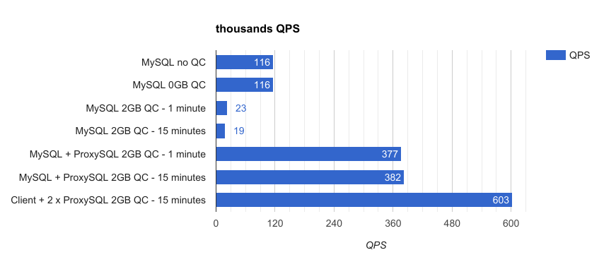
