# 😇 MySQL Explain使用教程

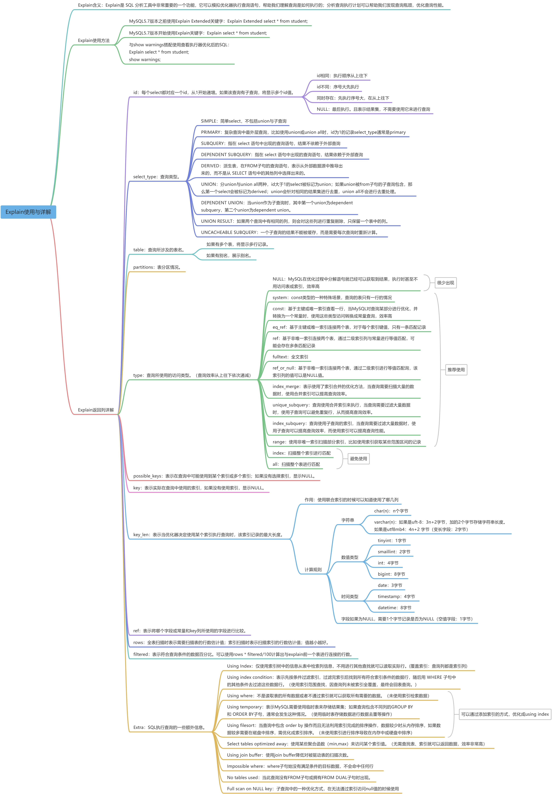

## 1.Explain含义

Explain是 SQL 分析工具中非常重要的一个功能，它可以模拟优化器执行查询语句，帮助我们理解查询是如何执行的；分析查询执行计划可以帮助我们发现查询瓶颈，优化查询性能。

## 2.Explain作用

+ 表的读取顺序
+ SQL执行时查询操作类型
+ 可以使用哪些索引
+ 实际使用哪些索引
+ 每张表有多少行记录被扫描
+ **SQL语句性能分析**

## 3.Explain用法

```sql
drop table orders;
drop table products;
drop table users;
CREATE TABLE users (  
  id INT PRIMARY KEY AUTO_INCREMENT,  
  name VARCHAR(50) NOT NULL,  
  email VARCHAR(100) NOT NULL,  
  password VARCHAR(100) NOT NULL  
) ENGINE=InnoDB DEFAULT CHARSET=utf8;

CREATE TABLE products (  
  id INT PRIMARY KEY AUTO_INCREMENT,  
  name VARCHAR(50) NOT NULL,  
  price FLOAT NOT NULL  
) ENGINE=InnoDB DEFAULT CHARSET=utf8;

CREATE TABLE orders (  
  id INT PRIMARY KEY AUTO_INCREMENT,  
  user_id INT NOT NULL,  
  order_date DATETIME NOT NULL,  
  total_price FLOAT NOT NULL,  
  product_id INT NOT NULL,  
  FOREIGN KEY (user_id) REFERENCES users(id),  
  FOREIGN KEY (product_id) REFERENCES products(id)  
) ENGINE=InnoDB DEFAULT CHARSET=utf8;

alter table users add index index_name_email (name,email);

INSERT INTO users (name, email, password)     
VALUES ('张三', 'zhangsan@example.com', 'password123'),     
('李四', 'lisi@example.com', 'password123'),     
('王五', 'wangwu@example.com', 'password123'),     
('赵六', 'zhaoli@example.com', 'password123'),     
('钱七', 'qianqi@example.com', 'password123');   

INSERT INTO products (name, price)     
VALUES ('产品 1', 10.00),     
('产品 2', 15.00),     
('产品 3', 20.00),     
('产品 4', 12.00),     
('产品 5', 18.00); 

INSERT INTO orders (user_id, order_date, total_price, product_id)     
VALUES (1, '2023-02-18 10:00:00', 100.00, 1),     
(2, '2023-02-18 11:00:00', 50.00, 2),     
(3, '2023-02-18 12:00:00', 20.00, 3),     
(4, '2023-02-18 13:00:00', 15.00, 4),     
(5, '2023-02-18 14:00:00', 25.00, 5); 
```

MySQL5.7版本之前，使用Explain Extended在Explain的基础上额外多返回filtered列与extra列；

```sql
Explain Extended select * from users;
```

MySQL5.7版本之前，使用Explain Partitions在Explain的基础上额外多返回partitions列；

```sql
Explain Partitions select * from users;
```

MySQL5.7版本引入了这两个特性，直接使用Explain关键字可以将partitions列、filtered列、extra列直接查询出来。

```sql
Explain select * from users;
```


Explain语句返回列的各列含义：

| **列名** | **含义** |
| --- | --- |
| id | 每个select都有一个对应的id号，并且是从1开始自增的 |
| select_type | 查询语句执行的查询操作类型 |
| table | 表名 |
| partitions | 表分区情况 |
| type | 查询所用的访问类型 |
| possible_keys | 可能用到的索引 |
| key | 实际查询用到的索引 |
| key_len | 所使用到的索引长度 |
| ref | 使用到索引时，与索引进行等值匹配的列或者常量 |
| rows | 预计扫描的行数（索引行数或者表记录行数） |
| filtered | 表示符合查询条件的数据百分比 |
| Extra | SQL执行的额外信息 |

这些查询列大家先留一个印象，后续会详细讲解。

## 4.Explain返回列详解

接下来我们将展示Explain中每个列的信息

#### 1. id列：每个select都有一个对应的id号，并且是从1开始自增的

+ 如果id序号相同，从上往下执行。
+ 如果id序号不同，序号大先执行。
+ 如果两种都存在，先执行序号大，在同级从上往下执行。
+ 如果显示NULL，最后执行。表示结果集，并且不需要使用它来进行查询。

```sql
explain 
SELECT users.name, orders.total_price, products.price    
FROM users    
INNER JOIN orders ON users.id = orders.user_id    
INNER JOIN products ON orders.product_id = products.id;
```


```sql
explain
select * from orders where product_id =  (select id from products where products.price = 10);
```

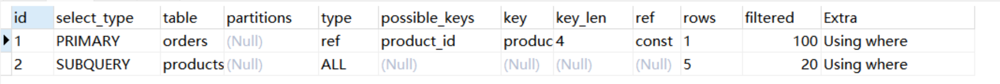

```sql
set session optimizer_switch='derived_merge=off'; #关闭MySQL5.7对衍生表合并优化

explain 
select orders.* 
from (select id from products) as temp inner join orders on temp.id = orders.product_id;

set session optimizer_switch='derived_merge=on'; #还原配置
```


```sql
explain
select id from users
union
select id from products;
```

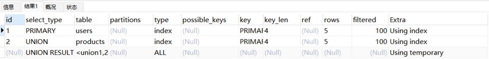

优化器会针对子查询进行一定的优化重写SQL：

```plain
EXPLAIN select * from users WHERE id in (select user_id from orders where id = 1);
show WARNINGS;
```

#### 2.select_type列：表示查询语句执行的查询操作类型

##### 2.1.simple：简单select，不包括union与子查询

```sql
Explain select * from users;
```

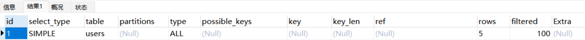

```sql
Explain select * from users inner join orders on users.id = orders.user_id;
```

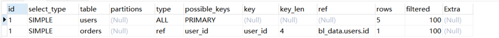

##### 2.2.primary：复杂查询中最外层查询，比如使用union或union all时，id为1的记录select_type通常是primary

```sql
explain
select id from users
union
select id from products;
```


##### 2.3.subquery：指在 select 语句中出现的子查询语句,结果不依赖于外部查询（不在from语句中）

```sql
explain
select orders.*,(select name from products where id = 1) from orders;
```

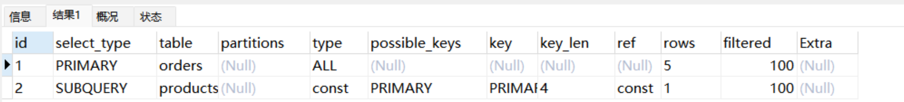

##### 2.4.dependent subquery：指在 select 语句中出现的查询语句，结果依赖于外部查询

```sql
explain
select orders.*,(select name from products where products.id = orders.user_id) from orders;
```

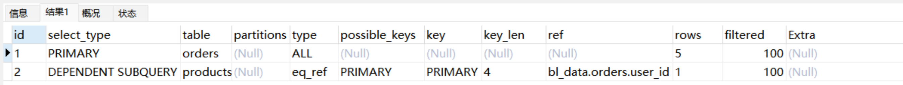

##### 2.5.derived：派生表，在FROM子句的查询语句，表示从外部数据源中推导出来的，而不是从 SELECT 语句中的其他列中选择出来的

```sql
set session optimizer_switch='derived_merge=off'; #关闭MySQL5.7对衍生表合并优化

explain
select * from (select user_id from orders where id = 1) as temp;

set session optimizer_switch='derived_merge=on'; #还原配置
```


##### 2.6.union：分union与union all两种，若第二个select出现在union之后，则被标记为union；如果union被from子句的子查询包含，那么第一个select会被标记为derived；union会针对相同的结果集进行去重，union all不会进行去重处理

```sql
explain 
select * from (
select id from products where price = 10
union
select id from orders where user_id in (1,2)
union 
select id from users where name = '张三' ) as temp;
```

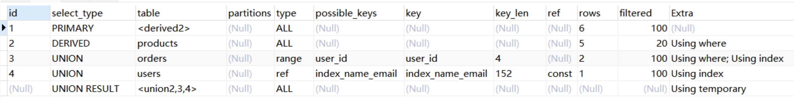

```sql
explain 
select * from (
select id from products where price = 10
union all
select id from orders where user_id in (1,2)
union all
select id from users where name = '张三' ) as temp;
```

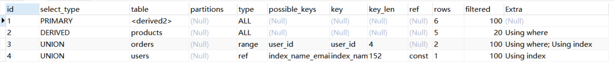

##### 2.7.dependent union：当union作为子查询时，其中第一个union为dependent subquery，第二个union为dependent union

```sql
explain 
select * from orders where id in (
select id from products where price = 10
union
select id from orders where user_id = 2
union 
select id from users where name = '张三' );
```


##### 2.8.union result：如果两个查询中有相同的列，则会对这些列进行重复删除，只保留一个表中的列

```sql
explain
select id from users
union
select id from products;
```

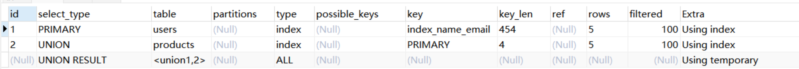  


#### 3.table列：查询所涉及的表名。如果有多个表，将显示多行记录

#### 4.partitions列：表分区情况

查询语句所涉及的表的分区情况。具体来说，它会显示出查询语句在哪些分区上执行，以及是否使用了分区裁剪等信息。如果没有分区，该项为NULL。

#### 5.type列：查询所使用的访问类型

效率从高到低分别为：**system > const > eq_ref > ref** > fulltext > ref_or_null **> range > index > ALL，**一般来说保证range级别，最好能达到ref级别。

##### 5.1.system：const类型的一种特殊场景，查询的表只有一行记录的情况，并且该表使用的存储引擎的统计数据是精确的

InnoDb存储引擎的统计数据不是精确的，虽然只有一条数据但是type类型为ALL；

```sql
DROP TABLE t;
CREATE TABLE t(i INT) ENGINE=InnoDb;
INSERT INTO t VALUES(1);
explain select * from t;
```

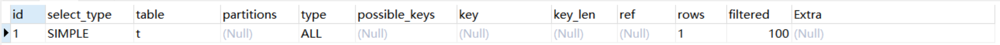

Memory存储引擎的统计数据是精确的，所以当只有一条记录的时候type类型为system。

```sql
DROP TABLE tt;
CREATE TABLE tt(i INT) ENGINE=memory;
INSERT INTO tt VALUES(1);
explain select * from tt;
```


##### 5.2.const：基于主键或唯一索引查看一行，当MySQL对查询某部分进行优化，并转换为一个常量时，使用这些类型访问转换成常量查询，效率高

```sql
explain
select * from orders where id = 1;
```

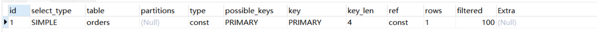

##### 5.3.eq_ref：基于主键或唯一索引连接两个表，对于每个索引键值，只有一条匹配记录，被驱动表的类型为'eq_ref'

```sql
explain
select users.* from users inner join orders on users.id = orders.id;
```

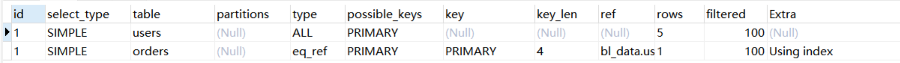

##### 5.4.ref：基于非唯一索引连接两个表或通过二级索引列与常量进行等值匹配，可能会存在多条匹配记录

1.关联查询，使用非唯一索引进行匹配。

```sql
explain
select users.* from users inner join orders on users.id = orders.user_id;
```

  
2.简单查询，使用二级索引列匹配。

```sql
explain
select * from orders where user_id = 1;
```

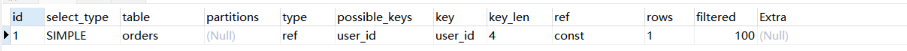

##### 5.5.range：使用非唯一索引扫描部分索引，比如使用索引获取某些范围区间的记录

```sql
explain
select * from orders where user_id > 3;
```

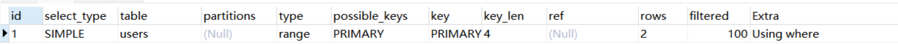

##### 5.6.index：扫描整个索引就能拿到结果，一般是二级索引，这种查询一般为使用覆盖索引（需优化，缩小数据范围）

```sql
explain
select user_id from orders;
```


##### 5.7.all：扫描整个表进行匹配，即扫描聚簇索引树（需优化，添加索引优化）

```sql
explain
select * from users;
```

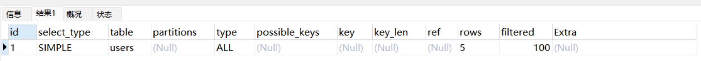

##### 5.8.NULL：MySQL在优化过程中分解语句就已经可以获取到结果，执行时甚至不用访问表或索引

```sql
explain 
select min(id) from users;
```


#### 6.possible_keys列：表示在查询中可能使用到某个索引或多个索引；如果没有选择索引，显示NULL

#### 7.key列：表示在查询中实际使用的索引，如果没有使用索引，显示NULL

#### 8.key_len列：表示当优化器决定使用某个索引执行查询时，该索引记录的最大长度（主要使用在联合索引）

联合索引可以通过这个值算出具体使用了索引中的哪些列。

使用单例索引：

```sql
explain  
select * from users where id = 1;
```

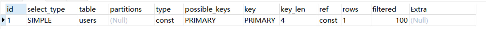

使用联合索引：

```sql
explain 
select * from users where name = '张三' and email = 'zhangsan@example.com';
```

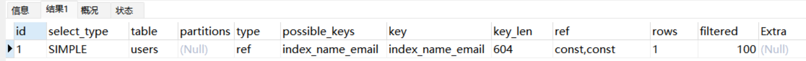  
计算规则：

+ 字符串：

char(n)：n个字节

varchar(n)：如果是uft-8：3n+2字节，加的2个字节存储字符串长度。如果是utf8mb4：4n+2字节。

+ 数值类型：

tinyint：1字节

smaillint：2字节

int：4字节

bigint：8字节

+ 时间类型：

date：3字节

timestamp：4字节

datetime：8字节  
字段如果为NULL，需要1个字节记录是否为NULL

#### 9.ref列：表示将哪个字段或常量和key列所使用的字段进行比较

当使用索引列等值查询时，与索引列进行等值匹配的对象信息。

1.常量：

```sql
explain 
select * from users where name = '张三' and email = 'zhangsan@example.com';
```

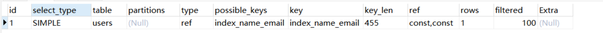

2.字段：

```sql
explain
select users.* from users inner join orders on users.id = orders.id;
```


3.函数

```sql
explain
select users.* from users inner join orders on users.id = trim(orders.id);
```

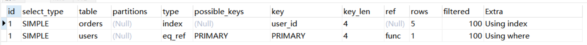

#### 10.rows列：全表扫描时表示需要扫描表的行数估计值；索引扫描时表示扫描索引的行数估计值；值越小越好（不是结果集中的行数）

1.全表扫描

```sql
explain
select * from orders where user_id >= 3 and total_price = 25;
```

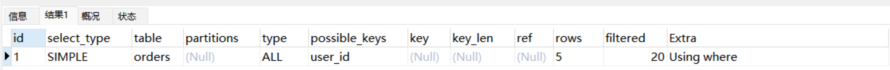

2.索引扫描

```sql
explain
select * from orders where user_id > 3;
```


#### 11.filtered列：表示符合查询条件的数据百分比。可以使用rows * filtered/100计算出与**explain**前一个表进行连接的行数

前一个表指 explain 中的id值比当前表id值小的表，id相同的时候指后执行的表。

```sql
explain
select users.* from users inner join orders on users.id = orders.id;
```


#### 12.Extra列：SQL执行查询的一些额外信息

##### 12.1.Using Index：使用非主键索引树就可以查询所需要的数据。一般是覆盖索引，即查询列都包含在辅助索引树叶子节点中，不需要回表查询

```sql
explain
select user_id,id from orders where user_id = 1;
```

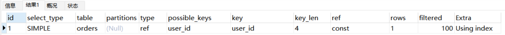

##### 12.2.Using where：不通过索引查询所需要的数据

```sql
explain
select * from orders where total_price = 100;

explain
select * from orders where user_id = 1 and total_price = 100;
```


##### 12.3.Using index condition：表示查询列不被索引覆盖，where 条件中是一个索引范围查找，过滤完索引后回表找到所有符合条件的数据行

```sql
explain
select * from orders where user_id > 3;
```

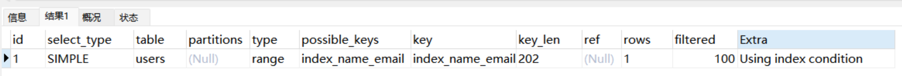

##### 12.4.Using temporary：表示需要使用临时表来处理查询

1.total_price列无索引，需要创建一张临时表进行去重

```sql
explain
select distinct total_price from orders;
```

  
2.name列有联合索引

```sql
explain
select distinct name from users;
```


##### 12.5.Using filesort：当查询中包含 order by 操作而且无法利用索引完成的排序操作，数据较少时从内存排序，如果数据较多需要在磁盘中排序。 需优化成索引排序

1.total_price列无索引，无法通过索引进行排序。需要先保存total_price与对应的主键id，然后在排序total_price查找数据。

```sql
explain
select total_price from orders order by total_price;
```

  
2.name列有索引，因索引已经是排好序的所以直接读取就可以了。

```sql
explain
select name from users order by name;
```


##### 12.6.Select tables optimized away：使用某些聚合函数（min,max）来访问某个索引值

```sql
explain 
select min(id) from users;

explain 
select min(password) from users;
```


## 5. 总结

正确合理使用 MySQL explain 可以帮助我们更好地理解查询执行计划，并确定如何最好地优化查询SQL，提升SQL性能，增加系统稳定性。
