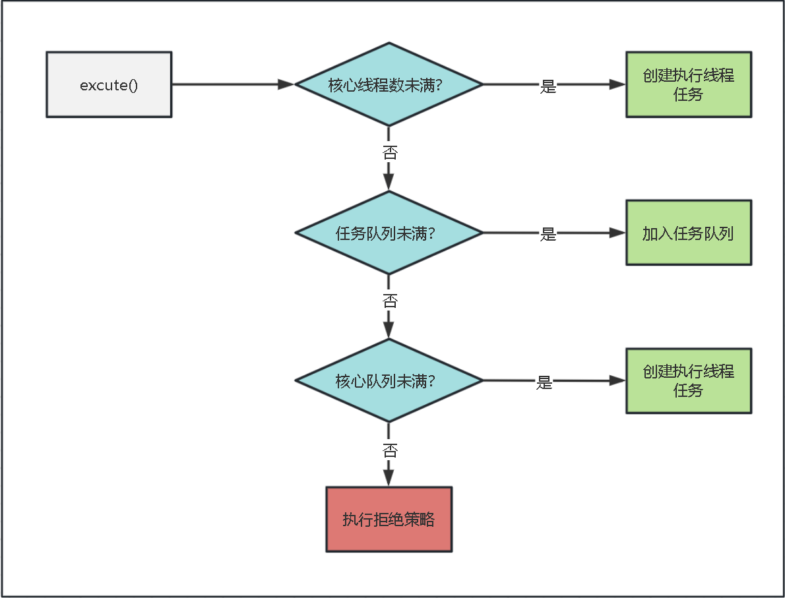
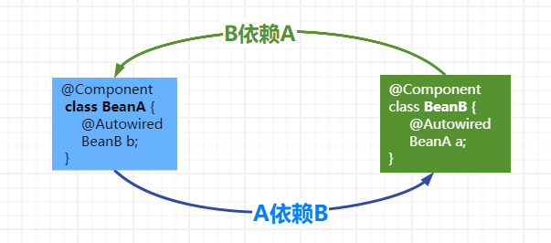

# 🚛 一分钟拿下一道面试题

# 1.int和Integer有什么区别？

+ **基本类型/包装类型：****Integer是int的****包装类型****，int则是java的一种****基本数据类型****。**
+ **空值表示：****Integer的默认值是null，int的默认值是0。**
+ **类型转换：****int通过强制类型转****换为其他类型，如 long，float 或double。Integer使用相应的****方法进行********类型转换****，如intValue() 将其转换为 int 值。**
+ **在集合中的使用：****集合类（如 List、Set 等）只能存储对象，不能直接存储基本类型的值。因此，如果要在****集合中存储整数****，必须****使用 Integer类型****而不是int类型。**

# 2.== 与 equals 有什么区别？

+ **==：**
  + **用于****基本类型****比较时，****比较值****是否相等；**
  + **用于****引用类型****比较时，****比较对象的内存地址****是否相等。**
+ **equals：**
  + **默认是****比较对象的内存地址****，但大多数类都会****重写equals方法****来改变默认的行为，使其****比较对象的内容****而不是****对象的内存地址****。比如 String、Integer 重写了equals方法变成比较值是否相等。**

```java
@Test
public void compareDemo1() {
    int x = 10;
    int y = 10;
    //比较值相等，true
    System.out.println(x == y); // true

    String str1 = new String("baili");
    String str2 = new String("baili");
    //比较对象内存地址不相同，false
    System.out.println(str1 == str2); // false
    //比较字符相同，true
    System.out.println(str1.equals(str2)); // true
}


```

# 3.final 在 java 中有什么作用？

**定义常量：****使用final关键字可以****将变量声明为常量****，一旦初始化后就不能再修改其值。**

**禁止继承：****当用final****修饰类****时，表示该类是****最终的****，不允许被其他类继承。**

**禁止方法重写：****当用final****修饰方法****时，表示该方法****不可被子类重写****。**

**禁止参数重新赋值：****当用final****修饰方法的参数****时，表示参数的值在方法体内****不能被改变****。**

**线程安全性：****当用final****修饰对象时****，表示该对象的****引用不能被修改****，但对象本身的****状态是可变的****。这可以确保在多线程环境下，该对象的引用不会被改变，从而避免潜在的并发问题。**

# 4.Java中常用于操作字符串的类有哪些？

+ **String：****不可变****的字符串类，提供了多种****字符串操作****方法。如拼接、截取、****查找****等。**
+ **StringBuilder：****可变****的字符串类，****非线程安全****，适用于频繁修改字符串的情况。**
+ **StringBuffer：****可变****的字符串类，****线程安全****，适用于多线程环境。**
+ **StringUtils：****Apache Commons Lang 库中的一个****工具类****，提供了各种字符串操作方法。例如****判断是否为空****、去除空格、****大小写转换****等。**

# 5.String类的常用方法有哪些？

+ **equals()：****比较字符串是否****相等****。**
+ **indexOf()：****返回第一个匹配子串的****起始索引****。**
+ **substring()：****返回从****起始位置（包含）****到****结束位置（不包含）****的子字符串。**
+ **startsWith()：****检查****字符串是否以****指定的前缀开头****。**
+ **replaceAll()：****使用给定的****替换字符串****替换所有匹配给定正则表达式的子字符串。**
+ **trim()：****去除字符串****首尾****的空白字符。**
+ **split()：****使用给定的正则表达式****拆分字符串****为字符串数组。**

# 6.String为什么要设计为不可变类？

+ **常量池的需要：****字符串常量池可以****共享****相同的字符串对象，****节省****内存空间并****提高****性能**
+ **hashCode 缓存的需要：****字符串的哈希码被缓存，****提高****了散列集合的性能（如哈希表）**
+ **线程安全性：****不可变类天然具备****线程安全****的特性，无需额外同步措施**
+ **安全性和可靠性：****不可变性确保****实例状态不会被修改****，适用于处理敏感信息等安全场景**
+ **共享和重用：****不可变类的实例可以****自由共享和重用****，提升性能效率**

# 7.String、StringBuilder、StringBuffer 的区别？

+ **String：****String类是****不可变****的，每次操作都会创建新的对象；它是****线程安全****的，可以在多线程环境下使用。**
+ **StringBuilder：****StringBuilder类是****可变****的，StringBuilder比String更高效。但是它是****非线程安全****的，不能保证线程安全性。**
+ **StringBuffer：****StringBuffer类是****可变****的，与StringBuilder不同的是，StringBuffer是****线程安全****的，可以在多线程环境下使用。****需要注意****，它通过使用****同步方法****来确保线程安全性，因此****会带来****额外的性能开销****。**

# 8.接口和抽象类有什么区别？

+ **定义方式：****接口****使用关键字 ****interface**** 来定义； ****抽象类****使用关键字 ****abstract**** 来定义。**
+ **实现方式：****一个类****可以实现****多个接口****，但只能****继承一个****抽象类。**
+ **内容：****接口****只有方法****声明，****没有实现体****；抽象类可以****有方法****的声明和****实现体****，还可包含属性和构造方法等。**
+ **实例化：****接口不能被实例化；抽象类可以被继承并实例化。**
+ **多继承：****接口支持****多继承****；抽象类只能****单继承****。**
+ **设计目的：****接口定义****约束和契约****，强调****行为一致性****；抽象类提供通用基类，强调对子类的****抽象和封装****。**

# 9.ArrayList和LinkedList有什么区别？

|  | **ArrayList** | **LinkedList** |
| --- | --- | --- |
| **底层数据结构** | **使用****数组实现** | **使用****链表实现** |
| **插入和删除操作** | **需要****移动其他元素****，时间复杂度为****O(n)** | **只需要****修改指针****的指向，时间复杂度为****O(1)** |
| **随机访问** | **根据****索引****直接****访问****元素，时间复杂度为****O(1)** | **需要****遍历链表****找到目标位置进行访问，时间复杂度为****O(n)** |
| **适用场景** | **频繁访问和随机访问，插入和删除较少的场景** | **频繁插入和删除，随机访问需求较少的场景** |

# 10.HashMap的底层数据结构

**`JDK<=1.7`：****数组+链表；**

**`JDK>=1.8`：****数组+链表+红黑树；**

**数组：****时间复杂度是****O(1)；**

**链表：****时间复杂度是****O(N)；**

**红黑树：****时间复杂度是****O(logn)；**

**Hash值产生碰撞后，****`链表长度>8`****时会从****链表转换为红黑树****，而当红黑树的****`节点<6`****时，会从****红黑树转换为链表****。**

# 11.HashSet 的底层数据结构？

+ **基于HashMap实现。**

```powershell
public HashSet() {
    map = new HashMap<>();
}
```

+ **值存放于HashMap的key上。**

```powershell
public boolean add(E e) {
    return map.put(e, PRESENT)==null;
}
```

+ **HashMap的value统一为PRESENT。**

```powershell
private static final Object PRESENT = new Object();
```

# 12.HashMap和HashTable有什么区别？

+ **线程安全性：****HashTable 是****线程安全****的，而 HashMap 不是。**
+ **Null 值：****HashMap ****允许****键和值都为 null，而 HashTable ****不允许****键或值为 null。**
+ **继承关系：****HashMap 继承自**** AbstractMap 类****，而 HashTable 继承自 ****Dictionary 类****，已过时****。**
+ **性能：****在****单线程环境****下，由于 HashMap 不需要进行额外的同步措施，通常比 HashTable 性能高。而在****多线程环境****下，HashTable保证了线程安全性，但因为同步操作引入了开销，所以性能相对较差。**

# 13.HashMap 与LinkedHashMap 的区别

+ **继承关系：****LinkedHashMap 是 HashMap 的子类，继承了 HashMap 的基本功能，并在此基础上增加了维护插入顺序的功能。**
+ **元素顺序：****HashMap 不保证元素的顺序，而 LinkedHashMap 使用双向链表来维护元素的插入顺序**
+ **底层数据结构：****HashMap 使用数组和链表（或红黑树）来实现，而 LinkedHashMap 在 HashMap 的基础上，额外维护了一个双向链表。**

# 14.并发和并行的区别

+ **并发：****一个处理器****同时处理多个任务，CPU通过时间片切换轮流执行不同的任务。**
+ **并行：****多个处理器****或者是多核的处理器同时处理多个不同的任务，两个线程互****不抢占CPU资源****，可以同时进行。**

# 15.创建线程有哪几种方式

+ **继承****Thread类****，重写该类的run()方法**
+ **实现****Runnable接口****，重写该接口的run()方法**
+ **实现****Callable接口****通过FutureTask包装器来创建线程**

# 16.线程的run()和start()有什么区别

+ **start()方法用于****启动一个新线程****，并****异步****执行线程的任务**
+ **run()方法是线程的任务处理入口，会在当前线程中****同步执行******
+ **start()方法****只能调用一次****，而run()方法可以被多次调用**
+ **调用start()方法****不会阻塞****主线程，而调用run()方法****会阻塞****当前线程的执行**

# 17.Java线程有哪些状态

+ **新建（New）：****线程被创建，但还没有调用start()方法**
+ **运行（Runnable）****：就绪或者运行中**
+ **阻塞（Blocked）：****表示线程阻塞，等待获取锁**
+ **等待（Waiting）：****表示线程调用了wait方法****，需要等待其他线程做出一些特定动作（通知或中断）**
+ **超时等待（Timed waiting）：****该状态不同于****Waiting****，它是可以在指定的时间自行返回**
+ **死亡（Terminated）：****表示当前线程已经执行完毕**

# 18.sleep()与 wait()的区别

+ **sleep()是****Thread类****方法，而wait()是****Object类****方法**
+ **sleep()用于****暂停****当前正在执行的****线程****，****不会释放****对象锁**
+ **wait()用于使线程进入****等待状态****，****会释放****对象锁，并且需要在****同步代码块****或同步方法中使用。只能通过****其他线程****的notify()或notifyAll()来唤醒**

# 19.唤醒线程的方法有哪些

+ **notify()：****该方法****随机唤醒****在对象上等待的****单个线程**
+ **notifyAll()：****该方法唤醒在对象上等待的****所有线程**
+ **Lock 接口与 Condition 接口：****使用 Lock 接口获取锁，并通过 Condition 接口的 ****signal() ****或 ****signalAll()****来唤醒相应的线程**

# 20.创建线程池的常用方式

+ **使用 ****Executors 工厂类****的****静态方法****，例如 ****newFixedThreadPool()****：固定线程数的线程池**

******newCachedThreadPool()****：线程数动态变化的线程池**

******newSingleThreadExecutor()****：单线程线程池**

+ **使用 ****ThreadPoolExecutor 类****的****构造函数****，手动设置核心线程数、最大线程数、线程空闲时间和任务队列等参数。**
+ **使用 ****ForkJoinPool 类****来执行 ****Fork-Join**** 任务的线程池。**

# 21.线程池的执行流程

**线程池是一种管理和复用线程的机制，可以提高多线程程序的性能和资源利用率。下面是线程池的基本执行流程：**



# 22.如何设置线程池的线程数

+ **对于****CPU密集型任务****，由于这类任务主要消耗CPU资源而不涉及IO操作，因此****线程数的设置****应该尽量****与CPU核心数保持一致****。一般****推荐****将核心线程数****设置为CPU核心数+1****，这样可以充分利用CPU的计算能力，并且提供一个额外的线程用于防止CPU饥饿。**
+ **对于****IO密集型任务****，虽然这类任务并不会特别消耗CPU资源，但是在进行IO操作时会占用较多时间。因此，可以****适当增加线程池的核心线程数****，一般****推荐****将核心线程数设置为****2倍CPU核心数****。这样可以让CPU在等待IO的时候有其他线程去处理别的任务，充分利用CPU的时间。**

# 23.线程池中线程复用原理

**线程池中线程复用原理是通过****封装工作线程并循环执行任务****。**

**工作线程****从任务队列****获取新任务执行，****避免了****频繁创建和销毁线程，提高了系统的效率和性能。**

**线程池实现了****线程的管理和调度****，使得线程可以重复利用，****减少了****系统开销。**

**同时，线程池根据任务负载动态调整线程数量，适应不同需求。这种机制提升了系统的响应速度和吞吐量，提供了一种高效的并发处理方式。**

# 24.线程池中线程如何回收

**线程池中线程的回收是通过****设置空闲超时****和****最大线程数****两种方式进行的。**

**首先，****如果一个线程在执行完任务后一段时间内****没有新的任务可执行****，根据设定的空闲超时时间，该线程会被回收。**

**其次，****当线程池中的线程数量已经****达到最大线程数****，并且所有****线程都处于空闲状态****时，多余的空闲线程****会被回收****以限制线程数量的增长。**

**这样的回收机制可以根据任务负载动态调整线程数量，提高系统的效率和资源利用率，并避免不必要的资源浪费。**

# 25.常见的阻塞队列有哪些

**常见的阻塞队列有以下几种：**

+ **ArrayBlockingQueue：****基于****数组****实现的有界阻塞队列，按照****先进先出****的原则进行操作。**
+ **LinkedBlockingQueue：****基于****链表****实现的可选有界或无界阻塞队列，也按照****先进先出****的原则进行操作。**
+ **PriorityBlockingQueue：****基于****堆结构****实现的优先级阻塞队列，元素按照****优先级进行排序****。**
+ **SynchronousQueue：****一个****不存储元素****的阻塞队列，用于线程间的****直接传输****。**
+ **DelayQueue：****基于****优先级队列****实现的延时阻塞队列，元素按照指定的****延时时间****进行处理。**

**这些阻塞队列在多线程编程中提供了方便的数据共享和同步机制，能够有效地管理线程之间的任务调度和通信。**

# 26.Volatile关键字的作用

**Volatile 关键字保证了多线程环境下变量的****可见性****和****禁止指令重排序****。**

**通过将变量声明为 Volatile，对该变量的修改操作会****立即写入****主内存，并且其他线程在访问该变量时会从主内存中获取最新值，****解决了****线程之间的****数据不一致问题****。**

**此外，****volatile 关键字还能****禁止****编译器和处理器对被标记变量的****指令重排序****优化，确保程序执行顺序的正确性。**

**需要注意的是，****volatile 关键字****不能替代锁****，它只能保证可见性和禁止重排序。**

# 27.Java内存模型是怎样的

**Java内存模型规定了Java程序中****多线程之间的内存访问规则****。**

**它包含****主内存****和****线程本地工作内存****，通过写入主内存和从主内存读取数据来实现****多线程间****的****数据共享与通信****。**

**内存模型通过****先行发生原则****保证操作顺序性，并使用****volatile关键字****确保可见性和禁止指令重排序，使用****synchronized关键字****用于实现互斥同步。**

**内存模型的规则保证了多线程环境下数据的一致性和线程安全。开发者应遵守这些规则以确保正确的并发程序行为。**

# 28.保证线程安全的常用方法

1. **使用锁机制：****使用关键字****synchronized****或****Lock接口****及其实现类对关键代码块或方法进行****加锁****，确保同一时间只有一个线程能够执行，避免数据竞争和不一致性。**
2. **使用原子类：****使用AtomicInteger、AtomicLong等原子类，利用底层的****CAS ****操作实现****线程安全的原子操作****。**
3. **使用并发容器：****使用java.util.concurrent包中提供的****线程安全的集合类****，如ConcurrentHashMap、CopyOnWriteArrayList等**
4. **使用ThreadLocal：****使用ThreadLocal类为每个线程****提供独立的变量副本****，确保线程间数据的隔离性，避免线程安全问题。**

# 29.什么是 CAS？

**CAS（Compare and Swap）是一种****并发控制机制****，用于****解决并发****环境下****的数据竞争****和****原子性问题****。**

**它允许多个线程或进程同时访问共享资源，并且通过****比较当前值与预期值****是否相等来****判断****是否进行更新操作。**

**如果相等****，就将新值写入内存地址；**

**如果不相等****，则操作失败，需要重新尝试。**

**CAS操作被广泛应用于并发编程中的自旋锁、无锁数据结构等场景，提高了线程安全和性能。**

**然而，CAS也存在一些限制，如ABA问题和循环时间长。**

# 30.CAS 有哪些优缺点?

**CAS的优点包括：**

+ **原子性：****CAS操作是****原子性****的，可以****避免****数据竞争和同步问题。**
+ **高效性：****相较于传统锁机制，CAS操作****不需要****进行加锁和解锁操作，因此执行****效率更高****。**
+ **无阻塞：****CAS操作是****非阻塞****的，线程不会在等待锁上浪费时间。**

**但CAS也存在以下缺点：**

+ **ABA问题：****CAS****无法解决****ABA问题（一个值被修改为另一个值，然后又被改回原来的值），可能导致数据不一致。**
+ **忙等待：****由于CAS失败时****需要重试****，循环时间长而且开销大，可能导致忙等待问题。**
+ **非确定性：****由于多个线程可能同时尝试进行CAS操作，因此无法确定哪个线程最终能够成功。**

# 31.悲观锁和乐观锁的区别

**悲观锁和乐观锁是并发控制的两种不同策略。**

**悲观锁：**

**在整个数据访问过程中，****假设会出现并发冲突****，因此采取保守的策略，****使用锁****来阻塞其他线程对共享资源的访问。**

**悲观锁在读取和修改数据时会直接加锁，确保数据的完整性和一致性。**

**乐观锁：**

**在整个数据访问过程中，****假设不会出现并发冲突****，因此****不主动加锁****，而是****采用版本控制****或者****比较交换****的方式来****检测****是否发生了冲突。如果没有冲突，则更新数据，否则进行回滚或重试。**

**乐观锁适用于多读少写的场景，避免了加锁的开销，提高了并发性能。但是，乐观锁需要处理冲突的情况，可能需要重试操作。**

# 32.公平锁和非公平锁的区别

**公平锁和非公平锁是线程调度中的****两种不同策略****。**

**公平锁****是指多个线程按照请求的顺序获得锁，即****先到先得的原则****。当一个线程释放锁后，等待时间最长的线程将获得锁的访问权。公平锁可以****避免饥饿现象****，但可能会导致线程切换的频繁发生，****降低系统的吞吐量****。**

**非公平锁****是指多个线程争抢锁时，****不考虑等待的顺序****，直接尝试获取锁。如果获取失败，则进入等待队列，等待被唤醒后再次竞争锁。****非公平锁****在****性能****上通常****优于公平锁****，因为它****减少了线程切换的开销****，但可能会导致某些线程长期等待。**

# 33.synchronized 和ReentrantLock区别？

**synchronized 和 ReentrantLock 都可以用于多线程下的同步控制，但具有如下不同点：**

1. **线程阻塞机制不同：****synchronized 在****获取锁失败****时会****一直等待****，而 ReentrantLock 支持可****中断式****获取锁。**
2. **对于公平锁的支持****：synchronized ****无法实现公平锁****，而 ReentrantLock 可以通过构造函数****传入 true 来实现****公平锁。**
3. **性能方面不同：****在****低并发的情况****下，synchronized 的性能比 ReentrantLock 好，因为它是 JVM 层面的锁，不需要进行用户态和内核态之间的切换。但在****高并发的情况****下，ReentrantLock 的性能优于 synchronized，因为它提供了更灵活的线程控制，可以有效地避免死锁。**

# 34.ThreadLocal数据存储原理？

**ThreadLocal 中的数据实际上是****存储在每个线程****的 Thread 对象中的一个****特殊的字段****中，称为 ****ThreadLocalMap****。**

**每个线程****都有自己独立****的ThreadLocalMap****用于存储****对应的ThreadLocal变量及其值。**

**ThreadLocalMap 是一个自定义的****散列表****，其****键为**** ThreadLocal 实例，****值为****对应的变量值。****每个线程****访问 ThreadLocal 时，实际上是通过 ThreadLocalMap 查找或修改对应的值。**

**由于每个线程的 ThreadLocalMap ****是独立的****，因此可以实现****线程间数据隔离****的效果。**

**当一个****线程结束****时，它持有的 ThreadLocalMap 也****会被回收****，从而实现对应的 ThreadLocal 的数据的释放，避免内存泄漏问题。**

**需要注意的是，ThreadLocal 中存储的数据****仅在当前线程内部可见****，不会被其他线程访问到，因此能够保证多线程环境下的数据隔离和线程安全性。**

# 35.Error和Exception的区别

**Error 和 Exception 是两种可抛出对象，区别如下：**

+ **Error ****表示****严重的系统或环境错误，****无法恢复****。**
+ **Exception ****可由开发者****代码引发****，分为****受检异常****和****非受检异常****。**
  + **受检异常****需要在方法签名中声明或进行捕获和处理。**
  + **非受检异常不要求声明或强制捕获处理。**

# 36.continue 和 break 的区别

**continue 和 break 是两个在编程语言中常用的关键字，它们的作用和区别如下：**

+ **continue：****continue 关键字****用于循环语句****中，是用于****跳过当前迭代的剩余代码****并开始下一次迭代，换句话说，它会忽略 continue 语句后面的代码，直接进行下一轮的循环。**
+ **break：****break 关键字同样****用于循环语句****中，是用于****提前终止循环并跳出循环体****。当程序执行到 break 语句时，它将立即停止当前循环的执行，并跳出整个循环体，继续执行循环外的代码。**

# 37.Java 4种引用的区别

**Java中有四种引用类型：****强引用****、****软引用****、****弱引用****和****虚引用****。它们之间的****区别****主要在于****对垃圾回收的影响和回收优先级****，具体如下：**

+ **强引用是默认类型，不受垃圾回收的影响；**
+ **软引用在内存不足时可能被回收；**
+ **弱引用的回收优先级更低，只要没有强引用指向对象，就可能被回收；**
+ **虚引用主要用于跟踪对象被回收的状态。**

# 38.什么是 CLH 锁

**CLH锁是一种****自旋锁****的变种，用于实现对共享资源的互斥访问。**

**它通过****链表的形式****组织等待线程，并采用****自旋等待****的方式，以提高性能和公平性。**

**相比传统的自旋锁，CLH锁****减少了****处理器缓存竞争，并****避免了****忙等待的问题。**

**然而，在高并发场景下可能出现伸缩性问题，所以在高并发场景下需要注意选择合适的锁机制。**

# 39.单例模式的懶汉式和饿汉式

**懒汉式和饿汉式是两种常见的单例模式实现方式，用于确保一个类只有一个实例对象。******

**懒汉式：**

+ **在需要获取单例实例时才进行初始化，****延迟实例化****。**
+ **优点是****实现简单****且延迟初始化，但在****多线程****环境下****需要考虑****线程安全性，并可能降低并发性能。**

**饿汉式：**

+ **在类加载时就进行对象的创建，即在****类定义****时就****实例化单例对象****。**
+ **优点是实现****简单且线程安全****，但可能会造成****资源浪费****，特别是在单例对象占用内存较大或初始化耗时较长的情况下。**

# 40.什么情况下触发类加载

**在Java中，以下几种情况会触发类的加载：**

+ **创建类的实例；****例如：MyClass obj = new MyClass();**
+ **访问类的静态成员；****例如：int value = MyClass.staticVariable;**
+ **调用类的静态方法；****例如：MyClass.staticMethod();**
+ **使用反射操作；****例如：Class.forName("com.example.MyClass")**
+ **执行Java程序的入口类****：通常是含有public static void main(String[] args)方法的类**

# 41.有哪几种类加载器

**Java中存在以下几种类加载器：**

+ **启动类加载器：****负责加载Java核心类库。**
+ **扩展类加载器：****加载Java扩展库。**
+ **应用程序类加载器：****加载应用程序类路径上的类。**

# 42.什么是双亲委派机制

**双亲委派机制是Java****类加载器****的一种****工作方式****。**

**它规定, 在一个特定的类加载器接收到类加载请求时，该加载器首先会把这个****请求委托****给它的****父类****加载器去完成，直到****到达最顶层****的启动类加载器。只有在****父类****加载器****无法完成****加载请求的情况下，子加载器才会自己去尝试加载。**

**这种双亲委派的过程****保证了****Java类的唯一性，****避免了****重复加载。同时，由于Java类的加载过程是逐级向上委托的，所以可以保证Java类的****安全性****。**

# 43.如何打破双亲委派机制

**要打破双亲委派机制，可以****自定义一个类加载器****，并在其加载类的逻辑中不遵循双亲委派规则。具体步骤如下：**

+ **创建****一个继承于 java.lang.ClassLoader****自定义类加载器****。**
+ **重写findClass()方法****，在该方法中实现特定的类加载逻辑。可以从非标准的位置加载类文件、修改加载规则等。**
+ **在加载类时，通过****调用defineClass()****方法将字节码数据转换为类对象。**
+ **调用自定义类加载器的****loadClass()方法****来加载需要的类。**

# 44.深拷贝和浅拷贝区别

**深拷贝和浅拷贝是在对象复制过程中的两种不同方式：**

+ **浅拷贝是****复制对象的引用****，新对象和原对象****共享****一块****内存地址****；**
+ **深拷贝是****复制对象本身的内容****，新对象与原对象****独立****，彼此之间****没有****任何****关联****。**

**在进行深拷贝时，需要注意可能会涉及到递归复制子对象的所有属性，可能会引起性能上的开销。**

# 45.JDK动态代理与CGLIB的区别

**JDK动态代理和CGLIB动态代理是Java中两种常见的实现动态代理的方式。**

+ **JDK动态代理****适用于那些****实现了接口的类****。使用Java标准库，****无需额外依赖****，在运行时通过反射机制调用被代理对象的方法。**
+ **CGLIB动态代理****则适用于****没有实现接口的类****。它使用****字节码生成库cglib****来生成代理类。CGLIB动态代理通过继承被代理类并重写其方法，并在运行时动态生成字节码来实现代理。**

**相对而言，****JDK动态代理更轻量级****，因为它使用Java标准库，无需引入额外依赖。而****CGLIB动态代理****在生成代理类时需要动态生成字节码，所以相对来说****更重量级一些****。**

# 46.什么是Java的序列化

**Java的序列化是将****对象转换为字节流的过程****，以便在网络传输、存储或跨平台传递。**

+ **通过****实现Serializable接口****，对象****可以被序****列化和反序列化。**
+ **序列化****可用于****远程通信、缓存和对象持久化等场景。**
+ **序列化后的对象可以在不同环境中传输，并在接收端重新恢复为原始对象。**

**序列化使对象的跨平台和跨网络****传输变得****简单和方便。**

# 47.什么是守护线程？与普通线程的区别是什么

**守护线程是一种****在程序后台****提供支持服务的****特殊线程类型****。**

**与普通线程相比，它具有****生命周期上的区别****，当所有用户线程结束时自动终止；它的****角色定位也不同****，通常用于执行某些后台任务，以提供支持性的功能。**

**需要注意它不能执行关键任务并且不能访问非守护线程创建的资源。**

# 48.说说你对设计模式的理解

**设计模式是软件设计中常见问题的****解决方案经验总结****，具有****可重用****、****易扩展****和****易维护****的优势，合理运用设计模式能提高代码质量、可读性和可维护性。**

**然而，设计模式****并非万能药****，应根据实际需求慎重选择，并结合良好的设计原则使用。只有在恰当的情况下，才能发挥设计模式的最大价值，提升软件系统的效率和可靠性。**

# 49.什么是指针碰撞

**指针碰撞是一种****内存分配****的方式，适用于特定的内存管理场景。**

**它将****内存****视为****连续****的区域，通过一个****指针标记****可用的内存地址，并在每次分配内存时将指针移动到下一个可用地址。**

**这样，每个分配的内存块都相邻连接。指针碰撞要求原子操作来确保并发下的内存分配****不会产生冲突****。**

**然而，指针碰撞只适用于****静态分配****或****预先知道****内存大小的动态分配，且****无法处理****内存重叠的情况。**

# 50.什么是TLAB

**TLAB是线程****本地分配缓冲区****，一种****提高****多线程程序中堆内存分配性能的技术。**

**Java虚拟机为每个线程都****分配自己的TLAB****，将堆内存划分为多个固定大小的区域。**

**当线程进行内存分配时，可以直接****在自己****的TLAB中进行，****减少****全局堆锁的竞争，提高效率。**

**使用TLAB可以****有效避免****因内存分配而导致的线程间竞争，****但需要****合理配置大小和分配策略。**

# 51.MySQL 索引类型

**MySQL****索引类型包括****B树索引、哈希索引、全文索引、空间索引和组合索引。**

**B树索引****适用于大多数查询场景，****哈希索引****适用于等值查询，****全文索引****用于全文搜索，****空间索引****用于地理空间数据，****组合索引****可以提高多列查询的效率。**

**选择适当的索引类型可以优化数据库的查询性能。**

# 52.组合索引的最左前缀匹配原则

**组合索引的最左前缀匹配原则是指在****使用组合索引****进行查询时，****只能利用****索引的****最左边的列****进行匹配，****无法利用****索引的右边列进行匹配。**

**这是由于组合索引的存储结构决定的。**

**因此，在设计组合索引时，应将经常用于查询条件的列放在左边，以提高查询效率。**

# 53.隐式转换导致索引失效

**隐式转换导致索引失效的原因主要是由于****数据类型不匹配****和****函数操作****。当查询条件中的列的数据类型与索引列的数据****类型不一致****，或者在查询条件中对列进行了****函数操作****时，MySQL 会尝试进行****隐式转换****。**

**然而，****转换后****的数据类型可能与索引列的数据****类型不匹配****，导致索引****无法使用****。**

**为避免这种情况，应确保查询条件中的列与索引列的数据类型匹配，并尽量****避免****在查询条件中对列进行函数操作。通过****优化数据类型****和查询条件，可以****提高****索引的效率，****提升****查询性能。**

# 54.哈希索引的缺点是什么

**哈希索引的缺点主要包括以下几点：**

+ **仅支持****等值查询，****无法进行****范围查询、排序或模糊匹配。**
+ **无序存储导致****无法按顺序访问****数据。**
+ **处理****重复键值效率低下。**
+ **对内存****要求较高****，需要一次性加载到内存。**
+ **占用较大****的存储空间。**

# 55.索引失效的几种场景

**索引失效可能是由以下因素引起的：**

+ **查询条件****不使用****索引列。**
+ **多个条件****使用OR****连接且其中****至少一个****条件不是索引列。**
+ **索引列****基数非常高****。**
+ **使用****NOT操作****导致对索引列进行****反向查询****。**
+ **数据分布****不均匀****。**

# 56.创建索引的原则

+ **选择合适的索引列：****选择经****常用****于查询和条件筛选的列****作为索引列****，确保索引具有高选择性。**
+ **考虑多列索引：****对于****经常****一起使用的多个列，创建****联合索引****，提高多列条件查询的效率。**
+ **确保索引区分度高：****选择具有较多不同值的索引列，以****减小****索引范围，****提高****查询速度。**
+ **避免过多索引：****根据业务需求，选择性地****创建必要的索引****，****避免过多****索引增加维护成本和降低更新性能。**

# 57.B+树结构的优点

+ **平衡性：****B+树保持树的平衡，使得查询、插入和删除操作的****时间复杂度****保持在****较低****水平。**
+ **顺序访问性：****B+树的节点按****顺序存储****，****有利于****范围查询和排序查询的性能。**
+ **快速查找：****B+树采用****多层索引****，能****快速定位****到目标数据。**
+ **适应动态更新：****B+树具有****自平衡特性****，适应数据的动态变化。**
+ **扩展性：****B+树支持存储大量数据，****具有****良好的扩展能力。**

# 58.聚簇索引与非聚簇索引的区别

+ **存储方式：****聚簇索引按照索引键的顺序排序并****直接存储数据行****，非聚簇索引将索引键和行指针****分开存储****。**
+ **表内索引数量：****一张表只能有****一个****聚簇索引，但可以有****多个****非聚簇索引。**
+ **查询性能：****聚簇索引****适合****范围查询和顺序访问，非聚簇索引需要先查找索引再获取数据行。**
+ **插入和更新性能：****插入和更新时，聚簇索引可能需要移动数据行，****耗时较长****；非聚簇索引只需修改索引，****速度较快****。**
+ **索引大小：****聚簇索引通常比非聚簇索引****更大****，因为它直接存储数据行。**

# 59.什么是覆盖索引

**覆盖索引是数据库中的一种****特殊索引****，简单而言就是****查询列都是索引列****。使用覆盖索引有如下好处：**

+ **减少IO访问：****减少了****磁盘和内存的读取操作，因为数据可以直接从索引中获取，****提高****查询性能。**
+ **减小存储开销：****覆盖索引通常比包含整个数据行的索引更小，****减少了****存储占用。**
+ **降低锁竞争：****减少****锁竞争，****提高****多用户并发查询性能。**
+ **提高查询性能：****特别****适用于****复杂查询和大量数据，****加速****数据检索。**

# 60.什么是索引下推

**索引下推是一种数据库****查询优化技术****，通过在****检索数据时****尽早应用****查询条件到索引层级****，****减少****数据读取和内存占用。**

**它****适用于****大数据量、复杂查询条件和多表连接等场景，能够****显著提升****查询性能，****加速****数据检索和处理过程。**

**注意，****索引下推并非适用于所有查询和索引，需要根据具体情况确定可行性。**

# 61.InnoDB和MyISAM的区别

**InnoDB和MyISAM是MySQL数据库中****常用的两种存储引擎****，它们在性能、功能和适用场景等方面有以下区别：**

+ **事务支持：****InnoDB支持****事务处理，可以实现ACID特性，适用于需要并发读写和数据一致性要求高的场景。而MyISAM不支持事务，只支持表级锁定，适用于读密集的场景。**
+ **并发性能：****InnoDB****通过****行级锁定****实现高度的并发性能，多个事务可以同时操作不同的行。而****MyISAM****只支持****表级锁定****，当有查询或修改操作时，会锁定整个表，限制了并发性能。**
+ **索引：****InnoDB****的索引结构是****B+树****，支持聚簇索引，****适合于****频繁的查询和更新操作。****MyISAM****的索引结构是****B树****，不支持聚簇索引，****适合于****主要进行全文搜索的应用。**
+ **容灾能力：****InnoDB****支持崩溃恢复和故障容错能力，****具备更好****的数据安全性。****MyISAM****则较为脆弱，****不具备****崩溃恢复功能。当系统故障发生时，可能造成数据丢失或损坏。**

# 62.什么是数据库事务

**数据库事务是指作为****单个逻辑工作单元****执行的一组数据库操作，这些操作****要么全部成功****完成，****要么全部失败****回滚。事务以保证数据的一致性和完整性为目标。**

**事务具有以下几个特性，通常缩写为ACID：**

+ **原子性（Atomicity）：****事务中的所有操作****要么全部执行****成功，****要么全部回滚****，不会出现部分操作成功或部分操作失败的情况。**
+ **一致性（Consistency）：****事务在****执行前后****数据库的****数据状态必须保持一致****。如果一个事务违反了数据库的完整性约束，那么事务将回滚到执行之前的状态，保证数据的正确性。**
+ **隔离性（Isolation）：****事务的执行****是****相互隔离****的，一个事务的操作在提交之前对其他事务是不可见的。隔离级别可以控制事务之间的可见性和并发性。**
+ **持久性（Durability）：****一旦****事务提交****，其所做的修改会****永久保存在数据库****中，即使在系统故障或重启后，也能保证数据的持久性。**

# 63.数据库并发会带来什么问题

**数据库并发可能引起以下问题：**

1. **脏读：****一个事务****读取未提交的数据****，导致读取到无效或不正确的数据。**
2. **不可重复读：****一个事务在同一查询中****多次读取数据****，但其他事务对****该数据****进行了修改或删除，导致读取****结果不一致****。**
3. **幻读：****一个事务在****同一查询中多次读取数据****，但其他事务添加或删除了****符合查询条件的数据****，导致****读取结果不一致****。**
4. **丢失更新：****多个事务同时读取****同一数据并进行修改****，但****只有一个****事务的****修改生效****，其他事务的修改结果丢失。**
5. **死锁：****多个事务****相互****等待对方释放资源****，导致系统无法继续进行。**

**为解决这些问题，可以采用锁、事务隔离级别和并发控制算法等手段，以保证数据库在并发访问时仍能保持数据一致性和完整性。**

# 64.MySQL 有几种锁机制

**MySQL提供了多种锁机制，包括以下几种常见的锁：**

1. **共享锁：****也称为****读锁****，****多个事务****可以同时持有共享锁，****用于****读取数据而不进行修改，共享锁****之间不会互斥****。**
2. **排他锁：****也称为****写锁****，事务****独占****地持有排他锁，其他****事务无法同时持有****排他锁或共享锁，用于修改数据。**
3. **记录锁：********锁定单个记录****，其他事务无法修改该记录，但****可以同时读取****。**
4. **间隙锁：****锁定****一个范围的****索引记录之间的间隙****，防止新数据插入或删除。**
5. **表级锁：****最简单的锁机制，对整个****表进行锁定****，限制其他事务对整个表进行操作。**

**通过合理使用这些锁机制，可以在MySQL中实现并发控制，保证数据的一致性和完整性。**

# 65.MySQL 事务隔离级别

**MySQL提供了四种事务隔离级别，可以通过设置来控制事务的并发行为和数据一致性。**

1. **读未提交（Read Uncommitted）****：****最低隔离级别****，一个事务可以****读取到其他事务尚未提交的数据****，可能导致脏读、不可重复读和幻读的问题。**
2. **读已提交（Read Committed）****：一个事务****只能读取到其他事务已经提交的数据****，****避免了****脏读的问题，但仍可能导致不可重复读和幻读的问题。**
3. **可重复读（Repeatable Read）****：****默认的隔离级别****，****确保在****同一个事务****中****多次读取同样的数据****时，会得到****一致的结果****。其他事务对数据的修改不可见，避免了脏读和不可重复读的问题，但仍可能导致幻读的问题。**
4. **串行化（Serializable）：****最高隔离级别****，将事务****串行执行****，确保数据的一致性。****避免了****所有并发问题，但****牺牲了****并发性能。**

# 66.什么是 MVCC

**MVCC是一种用于数据库系统的****并发控制技术****，它通过为每个事务****创建独立的数据版本****来****实现****事务隔离和一致性。**

**在MVCC中，事务可以****读取和修改****数据而****不会相互冲突****，并且读操作只能看到在其开始之前已经提交的版本。**

**当一个事务进行****写操作****时，MVCC会****创建新的数据版本****，****其他事务****仍然可以****读取已提交的旧版本****。**

**MVCC****提高了****并发性能，****避免了****一些锁竞争和阻塞问题，但也有存储开销和版本链过长的限制。**

**注意，****MySQL的InnoDB 存储引擎就是使用MVCC来支持事务操作的。**

# 67.count(1)、count(*) 与 count(列名) 的区别

**三者都是在SQL中用于计算行数的不同方式，存在以下区别：**

1. **count(1)：**
    + **count(1) 用于****计算结果集****中的****行数****，****不考虑****具体的列值，这种方式****通常是最快的****，因为它只需要统计行数。**
2. **count(*)：**
    + **count(*) 也用于计算结果集中的行数，****与 count(1) 类似****，它也****不需要****考虑特定列的值，但在某些数据库系统中，它可能****稍微慢一些****，因为在执行时****会考虑对表的全面扫描****。**
    + **然而，现代数据库优化器通常会将 count(*) 优化为 count(1)。**
3. **count(列名)：**
    + **count(列名) 用于****计算特定列中非NULL值的行数****，而不是结果集的总行数。**

# 68. 为什么需要数据库连接池

**数据库连接池是一种****用于缓存和重复使用数据库连接****的技术，****以减少****资源消耗和提高应用性能**

**每次新建****数据库****连接****都占用系统资源，特别是在****并发用户较多****的情况下会****导致系统崩溃****或性能下降**

**使用****连接池****可以****预先创建一些连接****，并在需要时****重复利用****，****避免了****频繁创建和关闭连接的开销，****提高了****应用程序的性能和可伸缩性**

**此外，****连接池还能灵活控制并发连接数量，****避免****数据库负载过高。****通过调整****连接池大小、等待队列长度和超时时间等****参数****，可以****有效控制****并发连接数，提高系统的稳定性**

# MySQL有哪几张权限表？

**在 MySQL 数据库中，与权限相关的表如下：**

+ **mysql.user：****存储所有****用户账号****的权限信息。**
+ **mysql.db：****记录用户对****数据库****的权限信息。**
+ **mysql.tables_priv：****记录用户对****表级别****的权限信息。**
+ **mysql.columns_priv：****记录用户对****列级别****的权限信息。**
+ **mysql.procs_priv：****记录用户对****存储过程和函数****的权限信息。**

**这些表存储了 MySQL 数据库中各个用户的权限信息，通过操作这些表可以管理和控制用户的权限。**

****

****

****

# MySQL的binlog有几种录入格式？

**MySQL的binlog有三种录入格式：statement、row和mixed。**

+ **statement****格式记录****SQL语句本身****，但无法完美记录复杂操作。**
+ **row****格式记录****每一行数据的变更****，适用于事务性场景，但会产生大量日志。**
+ **mixed****格式是****statement和row的混合使用****，根据实际情况自动选择记录方式。**

# InnoDB引擎的4大特性

1. **事务支持：****支持ACID事务****，****确保****数据完整性和一致性。**
2. **行级锁定：****提供****更好的****并发性能，****允许****多个事务同时处理表中不同行。**
3. **外键约束：****支持****定义外键关系****，****维护****表之间的数据一致性。**
4. **数据完整性：****支持****各种约束条件****，****防止****无效或不一致的数据插入。**

# 索引的基本原理

**索引是****排好序****的数据结构，****用于****提高查询性能。**

**BTree 索引是****常见的****索引类型，它****通过平衡树****结构存储和查找数据。**

**在查询时，数据库会使用****BTree**** 索引来****定位****符合条件的****数据行****所在的页，并依次查找数据。**

**为了优化****查询性能****，需要****根据具体****的业务****需求和数据****特点，分析查询条件和数据量，****选择合适的索引****类型和建立方式。**

# 索引算法有哪些？

**常见的索引算法有B-Tree、Hash、Bitmap、Full-Text和R树。**

+ **B-Tree****适用于****范围查询****和****精确查找****。**
+ **Hash****适用于****等值查询****。**
+ **Bitmap****适合****布尔****或****多值类型****的列。**
+ **Full-Text****适用于****文本类型****的数据列。**
+ **R树****主要应用于****空间数据****处理。**

# 隔离级别与锁的关系

**隔离级别和锁****密切相关****，****不同****隔离级别****对应不同****的****锁机制****。**

**低隔离****级别需要更****严格的锁****来控制并发，****高隔离****级别可以使用较****宽松的锁****来优化性能。**

**锁机制****用于****处理并发****事务中的****数据冲突****。**

**隔离级别和锁机制****共同确保****事务的正确执行和****高并发的****数据库应用。**

# 使用索引一定能提高性能吗？

**不一定****。**

**原因包括****查询****条件不符合****索引、****数据量过大****需遍历大量数据页、**

**索引冗余****和维护开销、数据****分布不均匀****。**

**需根据****具体需求****和数据****特点****进行评估和选择，****避免创建****过多冗余索引，**

**确保查询****条件和索引匹配，并进行****适当优化****措施，才能真正****提高****查询性能。**

# 为什么要使用视图？什么是视图？

**视图是****虚拟表****，由一个或多个****基本表****的查询结果****组成。**

**通过视图，可以将****复杂的查询****操作****抽象为****简单的视图查询，对于频繁需要执行的复杂查询，****只需调用视图****即可，****提高了****查询的方便性和效率。**

**同时，视图还****能够限制****用户只能访问特定的数据列，并****隐藏敏感信息****，****保护了****数据的安全性和隐私。**

# 什么是游标？

**游标是一种****遍历关系型数据库结果集****的机制，****提供****逐条处理或操作记录的方式。它可以****按照指定的顺序****逐行遍历结果集，****并提供****对当前行进行操作的方法。**

**游标分为****静态游标****和****动态游标****，****前者将****所有记录读入客户端结果集，****后者只****在处理过程中读取****部分记录****，需要时再向数据库查询。**

**游标可以****用于处理****较小规模数据表的结果集，****有效地****实现对数据的逐行处理和操作。**

# 什么是存储过程？

**存储过程是封装在数据库中****可重复执行的程序单元****，类似于程序中的函数或子程序。它可以****接受输入参数****并****返回数据集****或标量值，也可以在内部进行业务逻辑处理。**

**存储过程的****优点****包括****提高****性能、可维护性和安全性，****减少****网络传输数据量；****缺点****则包括****调试困难****、产生****代码膨胀****和****不易移植****等问题。**

**在应用中，需要根据具体需求综合考虑是否使用存储过程。**

# 什么是触发器？

**触发器是数据库中的对象，与表相关联，在数据操作时****自动触发****动作。****使用场景****包括****确保数据完整性和一致性****、数据同步和复制、日志记录和审计、****处理****复杂业务逻辑、数据变化通知等。**

**日常使用中****需谨慎使用****触发器，过多或复杂会影响数据库性能和可维护性，****应考虑业务需求****、数据操作频率和数据库性能，****合理****选择和配置触发器，****避免****循环调用和死锁问题，****确保****数据库稳定可靠。**

# MySQL中都有哪些触发器？

**MySQL中支持三种类型的触发器：**

+ **BEFORE触发器：****在数据插入、更新或删除****之前触发****，可以****用于检查数据****的有效性、设置默认值等操作。**
+ **AFTER触发器：****在数据插入、更新或删除****之后触发****，****可以用于记录****日志、更新其他表中的数据等操作。**
+ **INSTEAD OF触发器：****仅适用于视图****，可以在对视图进行插入、更新或删除操作时触发，可以****用于实现视图****的可写功能。**

**触发器还可以根据****触发事件类型分为****INSERT、UPDATE和DELETE触发器。**

**除了类型和事件，MySQL触发器还有一些其他属性，如触发器的名称、所属表、触发时机、触发条件、触发器的语句等。**

# 什么是超键、候选键、主键、外键？

**在关系型数据库中，四者是用于****定义和管理数据表****之间关系的重要概念。**

**超键：****能够****唯一标识一个元组****的属性集合。**

**候选键：****最小****的超键。**

**主键：****用来****唯一标识每个元组****的属性或属性组。**

**外键：****用来****建立两个关系****之间的联系。**

# SQL 约束有哪几种？

**SQL 约束有以下几种：**

+ **主键约束：****用于****定义一个或多个****列作为主键，确保每行数据的唯一性和非空性。**
+ **唯一约束：****用于****确保一个或多个列****的取值在表中是****唯一的****，****不允许重复****。**
+ **非空约束：****用于确保一个或多个列****不允许为空值****，要求必须有值。**
+ **外键约束：****用于建立表与表之间的关系，****确保一个表****的列值与另一个表的主键或****唯一键值相匹配****。**
+ **检查约束：****用于****定义一个列或多个****列的取值****必须符合指定的条件****或表达式**

**这些约束可以保证数据的完整性和一致性，提供了对数据库中数据进行有效限制和验证的功能。**

# MySQL有哪些关联查询？

**在 MySQL 中，常见的关联查询如下：**

+ **内连接：****内连接****返回两个表****中满足****连接条件的匹配行****。**
+ **左连接：****左连接****返回左表****中的所有行，****以及右表****中与左表****匹配的行**
+ **右连接：****右连接****返回右表****中的所有行，****以及左表****中与右表****匹配的行**
+ **全连接：****全连接****返回两个表****中的****所有行****，****无论是否****存在****匹配****的数据**
+ **自连接：****自连接是指将同一个表作为两个不同的表来进行连接操作**
+ **交叉连接：****交叉连接****返回两个表****中****所有可能****的组合，即笛卡尔积。**

# 什么是子查询

**子查询是指在****一个 SQL**** 查询语句中****嵌套****了****另一个****完整的****SQL**** 查询语句。**

**子查询****可以用来****获取某些条件下****的特定****结果集****，这个结果集可以作为外层查询语句的一部分进行处理。**

**子查询****通常出现在**** WHERE 子句、FROM 子句或SELECT 子句中，它可以****返回单个值****、****一列值****或****多列值****。**

**子查询可以使用****比较运算符****（如 `=、>、<、<>`等）和****逻辑运算符****（如 AND、OR、NOT）来筛选数据。**

# 子查询的三种情况

**子查询可以分为以下三种情况：**

+ **标量子查询：****标量子查询****返回单个值****，通常****用于****比****较运算符中的条件判断。**
+ **列子查询：****列子查询****返回一列值****，通常****用于****IN 或 NOT IN 子句中的条件判断。**
+ **表子查询：****表子查询****返回多列值****，可以****作为****外层查询语句的一部分进行处理。**

# MySQL 中 in 和 exists 区别

**在 MySQL 中，IN 和 EXISTS 是用于子查询中的条件运算符，它们有以下区别：**

+ **IN 运算符：****用于****检查****一个****值是否存在****于子查询返回的结果集中。它将比较左侧的表达式与子查询的结果，并返回匹配的行。如果****子查询****返回的****结果集****中****包含任何****与左侧表达式****匹配的值****，则条件为真。**
+ **EXISTS 运算符：****用于****检查子查询是否返回了****至少一行****结果****。它只****关心****子查询是否返回了****结果****，而****不关心****具体的****返回值****是什么。如果子查询返回了至少一行结果，则条件为真。**

# VARCHAR 与 CHAR 的区别

**VARCHAR 和 CHAR 是 MySQL 中两种字符数据类型。**

**两者区别如下：**

+ **存储方式：****CHAR**** 是****定长存储****，占用固定空间；****VARCHAR**** 是****变长存储****，只占用实际需要的空间。**
+ **存储效率：****CHAR**** 存储****效率高****，访问和处理速度快；****VARCHAR**** 存储****效率相对较低****。**
+ **索引效率：****CHAR**** 索引****效率高****，使用固定大小索引；****VARCHAR**** 需要****动态计算****长度，使用变长索引。**
+ **适用场景：****CHAR**** 适用于****长度固定****的字符串；****VARCHAR**** 适用于****长度可变****的字符串。**

# VARCHAR(50)中50的涵义

**在 MySQL 中，VARCHAR(50)中的50****表示****该字段可以****存储****的****最大字符数****为50个。简单来说，该字段****最多****可以容纳50个字符，如果****超过了****50个字符，则会****被截断****。**

**需要注意的是，****VARCHAR**** 类型的****实际存储****空间****取决于****存储的****数据长度****，而不是定义的最大长度。例如，如果一个 ****VARCHAR****(50) 字段****存储****了****10个字符****，则它****只****会****占用10个字符****的存储空间，而****不是50个****字符的存储空间。**

# drop、delete与truncate的区别

**在 MySQL 中，DROP、DELETE 和 TRUNCATE 是三个不同的操作，它们有以下区别：**

+ **DROP：****DROP 用于****删除整个表****（包括表结构和数据）。执行后，表将被完全删除，****无法恢复****。**
+ **DELETE：****DELETE 用于****删除****表中的****一部分或全部数据****，****保留****表结构。可以使用 WHERE 子句指定删除的条件。执行后，被删除的数据可以通过****事务回滚或备份进行恢复****。**
+ **TRUNCATE：****TRUNCATE 用于****删除表中的全部数据****，保留表结构。TRUNCATE 操作比 DELETE 更快，因为它是通过****直接删除****表中的****数据页****来完成的，而不是逐行删除。执行后，被删除的数据****无法****通过事务回滚或备份****进行恢复****。**

# UNION与UNION ALL的区别？

**UNION和UNION ALL是SQL中的两个****关键词****，用于合并多个SELECT语句的结果集。它们的****主要区别****在于****处理重复行的方式****。**

+ **UNION：****UNION操作符用于合并多个SELECT语句的结果集，并****自动去除重复的行****。**
+ **UNION ALL：****UNION ALL操作符也用于合并多个SELECT语句的结果集，但****不会去除重复的行****。**

# 如何定位慢 SQL

**要定位慢SQL，可以按照以下步骤进行操作：**

+ **监控数据库性能：****使用****性能监控工具****或内置的****系统监视器****来了解数据库的整体性能。**
+ **分析查询日志：****查询日志可以记录数据库所有执行的SQL语句，在日志中搜索****执行时间较长****的****SQL语句****。**
+ **使用性能分析工具：****性能分析工具可以帮助我们****深入理解****慢SQL的****执行过程****。**
+ **观察数据库指标：****观察数据库的性能指标****，如CPU利用率、内存利用率、磁盘IO等，来了解数据库的负载情况。**

# 如何优化慢 SQL语句

**优化慢SQL，一般有以下多种方式：**

1. **分析执行计划****，避免全表扫描、索引未使用等耗时操作。**
2. **创建****合适的索引****，提高查询效率。**
3. **重写和****简化复杂SQL语句****，如避免使用SELECT *。**
4. **使用****优化的分页****技术，减少IO操作。**
5. **使用连接查询（JOIN）****替代嵌套****查询。**
6. **缓存查询结果，减少数据库访问。**
7. **定期维护****数据库，如重建索引、更新统计信息。**
8. **调整数据库参数****，如缓冲区大小、并发连接数等**

# 索引失效场景

**以下几种场景会出现索引失效：**

+ **使用了****函数、操作符或表达式****时。**
+ **列****类型不匹配****或隐式类型转换时。**
+ **列值****范围过大****或统计信息****不准确****时。**
+ **多表连接时****连接条件不正确****或连接的列没有索引时。**

# SQL的执行过程？

**SQL是关系型数据库管理系统的标准语言，其执行过程包括以下几个步骤：**

+ **词法分析：****将SQL语句****按照规则分解****成单词、符号等组成的记号流，其中包括关键字、表名、列名、运算符等。**
+ **语法分析：****根据SQL语法规则检查词法分析所生成的记号流是否满足语法要求，****判断语句是否正确****。**
+ **查询优化：****对于SELECT语句，系统会根据统计信息、索引等信息进行查询优化，****选择最合适的查询方式****和访问路径，以提高查询效率。**
+ **执行计划生成：****生成查询执行计划，确定如何访问表和索引，并选择执行操作的****最佳顺序和方法****。**
+ **执行SQL语句：****按照执行计划执行SQL语句****，包括读取、插入、更新或删除表中的数据等操作。**
+ **返回结果：****将执行结果返回给用户。**

# 怎么优化大表数据查询

**针对大表数据查询的优化策略有如下方式：**

1. **索引优化：****创建****适当的索引****以提高查询速度。**
2. **使用合适的连接方式：****选择****适当的连接方式****和连接条件，减少磁盘 I/O 。**
3. **调整数据类型：****选择****合适的数据类型****来存储数据，减少I/O操作。**
4. **分页查询：****使用LIMIT语句****限制返回的行数****，避免一次性返回全部结果集**
5. **批量操作：****使用****批量处理****的方式，减少数据库连接开销，提高效率。**
6. **垂直分割与水平分割：****将****大表拆分成多个小表****，提高查询效率。**
7. **使用缓存技术：****将查询****结果缓存****起来，减少对数据库的访问。**
8. **数据归档和清理：****及时进行****归档和清理****，减少查询范围，提高查询效率。**

# 为什么要尽量设定一个主键？

**MySQL的数据存储是通过****B+树数据结构****存储在文件中的，这种数据结构也被称为聚簇索引。每个表都会有且只有一个聚簇索引，而聚簇索引的键选择方式有三种情况：**

1. **如果****设置了主键****，那么聚簇索引会****以主键列来构建****。**
2. **如果****没有设置主键****，但存在非空唯一的列，那么聚簇索引会****以该列来构建****索引。**
3. **如果****表中不存在非空唯一的列****，那么聚簇索引会以一个****隐藏的主键列****来构建索引。**

**设置主键的意义在于它****不仅能保证****数据的唯一性，****还可以****通过以主键构建聚簇索引来提高数据操作的效率。**

# 为什么推荐使用自增ID？

**推荐****使用自增ID****作为主键的原因有以下几点：**

+ **索引效率高：****自增ID主键是一个****递增的整数序列****，可以****有效地减少****索引的碎片化，****提高****查询效率。在****B+树索引结构****中，相邻的ID值通常存储在相邻的磁盘页上，****减少了****随机IO的次数，提升了查询性能。**
+ **存储空间效率高：****相对于UUID****主键，自增ID主键只需****占用较小的整数类型****的存储空间，****节省了****存储资源。尤其在大规模数据量的情况下，节省的存储空间会更加显著。**
+ **简化数据维护和分片操作：****使用自增ID主键可以****简化数据的维护****和分片操作。相对于UUID主键，****自增ID主键****不需要考虑全局唯一性的生成算法，****避免了****复杂的业务逻辑处理，并且在数据库分片时，也****更容易****进行数据的拆分和合并操作。**

# 字段为什么要求定义为NOT NULL？

**在数据库中定义字段为 NOT NULL，是因为它有以下几个好处：**

1. **数据完整性：****通过将字段定义为 NOT NULL，可以****确保数据库****中的每行记录都包含该字段的值。这****有助于维护****数据的****完整性****和****一致性****，避免出现****数据不完整****、丢失或错误的情况。**
2. **查询性能：****当使用****包含 NULL 值****的列进行查询时，数据库需要进行****额外的处理****来判断 NULL 值。这可能会导致****查询速度变慢****。如果将字段定义为 NOT NULL，则可以避免这种情况，提高查询性能。**
3. **减少空间占用：****存储 NULL 值****需要额外的空间。当数据表中包含许多 NULL 值时，它们会****占用额外的存储空间****。如果将字段定义为 NOT NULL，则可以减少空间占用。**

# MySQL 8.0 版本做了哪些优化

**MySQL 8.0 ****主要有如下几点优化****：**

1. **JSON 支持更完善。**
2. **引入****窗口函数****和****分析函数****。**
3. **全局事务标识符****简化复制拓扑结构****。**
4. **默认****支持加密连接****，提供更多加密功能。**
5. **引入更****精细的资源管理****功能。**
6. **增加字符集和校对规则。**
7. **优化了查询性能。**

# 为什么大厂不建议使用多表 JOIN

**大厂不建议过度使用多表 JOIN 的原因主要有以下几点：**

1. **性能问题：****多表 JOIN 会****导致数据库执行****较为****复杂的查询操作****，特别是在表数据量大、索引不够完善或者查询条件复杂的情况下，容易导致****性能下降****，影响系统的响应速度。**
2. **可维护性：****过多的多表 JOIN 会使得 SQL 查询语句变得****复杂且难以维护****，****增加了****代码的复杂度和理解难度，****降低了****代码的可读性和可维护性。**
3. **扩展性：****当系统需要扩展新的功能或者进行数据库结构调整时，存在****多个表关联的查询语句可能需要频繁地修改****，增加了维护和扩展的成本。**

# 为什么MySQL默认使用RR隔离级别

**这是因为RR级别提供了****较高的事务隔离性****，可以****避免****脏读、不可重复读和幻读等****并发访问问题****。**

**在RR隔离级别下，事务在读取数据时会****创建一个快照****，并在事务结束前始终使用该快照来****保证数据的一致性****，从而****避免了****其他事务对数据的并发修改对当前事务的影响。**

**虽然RR提供了较高的隔离性，但也可能****导致****一些****性能损失****，因为它要求数据库在事务期间保持一致的快照视图，这可能****会阻碍****其他事务对数据的修改，****增加了****系统的并发控制负担。**

**但在特定情况下，用户也可以****根据自己的需求来选择更低的隔离级别****，以获得更好的性能表现，如RC（Read Committed）隔离级别。**

# 当前读和快照读有什么区别

**当前读****和****快照读****是关于数据库****隔离级别****的****两种读取方式****。**

**当前读是指在事务执行过程中，****读取的数据是最新的****，会受到并发事务的影响。**

**而快照读是在事务****开始时确定需要读取的数据版本****，接下来的读取都会使用这个版本的数据，不受其他事务影响。**

**当前读****通常用于****可重复读****和****串行化****隔离级别，****而快照读****通常用于****读已提交****和****可重复读****隔离级别。**

# 什么是意向锁

**意向锁是数据库管理系统中的****一种锁定机制****，用于****协调事务对数据行的排他锁和共享锁请求****。**

**意向锁分为两种类型：****意向共享锁****和****意向排他锁****。**

**当****一个事务****需要对某个数据行进行****加锁时****，****会先尝试获取****相应的****意向锁****，以表示接下来可能会对数据行进行共享锁或排他锁的申请。**

**通过使用****意向锁****，数据库系统可以****更高效地判断****是否有其他事务对数据行已经持有了排他锁或共享锁，从而****避免不必要的锁竞争和冲突****。**

**这种机制可以****提高并发****访问效率，****降低锁冲突****的概率，从而减少了事务之间的阻塞情况，提升了数据库系统的整体性能。**

# MySQL的主键一定是自增的吗

**主键并不一定是自增的****。**

**虽然自增主键是一种常见的主键类型，但在****实际数据库****操作中，我们经常会遇到数据****插入失败****、****数据删除****、****事务回滚****、****数据订正****等情况，这些情况都可能****导致自增字段的值****出现****间断或重复****，打破了自增ID的连续性。**

**因此，主键可以是任何具有****唯一性和非空性****的字段，如整型、字符型等，并不一定要求是自增的。**

**选择主键类型取决于****具体的业务需求和数据特点****，对于不需要自动增长的场景，可以选择其他类型的主键来满足需求。**

# Binlog、Redolog和 Undolog 的区别

**Binlog（****二进制日志****）、Redo log（****重做日志****）、 Undo log（****回滚日志****）它们是数据库中常见的日志类型。**

+ **Binlog：****用于****备份与复制****，记录了对数据进行更改的 SQL 语句或其他相关信息；**
+ **Redo log：****用于****事务的持久性和数据库崩溃恢复****，记录了数据库引擎对数据页的修改，确保事务提交后的修改可以被恢复；**
+ **Undo log：****用于****事务的撤销和多版本并发控制****，记录了事务的逆操作，用于事务回滚和历史版本数据读取。**

**三种日志相互配合，共同确保了数据库的一致性、持久性和并发控制。**

# 数据库死锁如何解决

**解决数据库死锁可以采取以下方法：**

1. **优化事务，****缩短持锁时间****，减少死锁风险。**
2. **确保事务顺序一致性，****有助于减少死锁****可能性。**
3. **减少锁粒度，尽量使用行级锁而非表级锁。**
4. **设置合理超时时间，****通过超时回滚来解除死锁****。**
5. **监控死锁****，及时发现并解决死锁问题。**
6. **实现死锁检测和重试机制，遇到****死锁时自动重试****事务。**

# order by 是怎么实现的

**数据库中的"ORDER BY"实现****涉及查询语句解析****、****记录检索****和****排序阶段**

**数据库系统根据指定列****使用排序算法****（如快速排序）对记录****进行排序****，最后返回排序后的结果集。**

**为****提高效率****，数据库可能****利用索引加速排序****、在内存中执行排序以减少磁盘访问频率等策略。**

**针对不同查询和数据量****，数据库系统会根据优化器****选择合适的****排序方法，确保针对大规模数据的排序操作能够高效完成。**

# SQL中PK、UK、CK、FK、DF是什么意思

**在SQL中，这些缩写代表了不同的约束类型：**

1. **PK (Primary Key): ****主键约束****，用于唯一标识表中的每一行数据。主键的值****不能重复****，且****不能为空****。**
2. **UK (Unique Key): ****唯一约束****，确保列中的****数值是唯一的****，但****可以****包含空值。**
3. **CK (Check Constraint): ****检查约束****，用于确保列中的数据满足特定的条件，类似于对列****添加额外的验证条件****。**
4. **FK (Foreign Key): ****外键约束****，用于在一个表中创建指向另一个表中主键的外键关系，****确保引用的完整性****。**
5. **DF (Default Constraint):********默认约束****，用于指定列的默认值。如果插入行时未提供值，将会使用默认值。**

# 什么是 Spring 的 IOC

**Spring的IOC（全称 Inversion of Control，控制反转），它是****Spring框架****的****核心概念****之一。它主要包括以下关键点：**

1. **IOC的目的****是将应用程序的****控制权****从应用程序代码中****转移到****框架或容器中。**
2. **IOC容器管理bean的****生命周期****和****依赖注入****。**
3. **开发者只需配置bean的依赖关系，IOC容器会根据配置创建对象并进行注入。**
4. **通过IOC实现****松耦合****、****提高代码可维护性****和可测试性。**
5. **Spring的IOC提供了一种****灵活、易于管理和维护的组件****组织方式。**

# 什么是 Spring 的 AOP

**Spring的AOP（也称为面向切面编程）是****Spring框架的另一个核心概念****，主要包括以下关键点：**

1. **AOP用于将****横切关注点****（如****日志****、****事务处理****）从应用程序的****核心业务****逻辑中****分离出来****。**
2. **AOP通过****切面****（Aspect）实现对横切关注点的****模块化****组织。**
3. **切面可以定义在****哪些连接点****（Join Point）上执行哪些通知（Advice），并可以****使用切点****（Pointcut）****指定连接点****。**
4. **Spring AOP****支持多种类型****的通知，包括前置通知、后置通知、环绕通知等。**
5. **AOP能够****提高代码的重用性****，****降低****系统耦合度，使得系统更易于维护和扩展。**

# Spring Bean 的初始化过程

**S****pring容器在实例化Bean时，会经历以下初始化过程：**

1. **实例化Bean：****通过****构造器****或****工厂方法****创建Bean的实例。**
2. **设置Bean的属性：****Spring容器将****根据配置文件****或****注解****为Bean设置属性。**
3. **实现Aware接口：****如果Bean****实现了Aware接口****（如****BeanNameAware****、****BeanFactoryAware****等），Spring容器会调用相应的方法注入相关资源。**
4. **调用BeanPostProcessor的前置处理方法：****如果有注册的BeanPostProcessor，会在初始化前执行相应的****前置处理方法****。**
5. **调用初始化方法：****如果Bean****配置了初始化方法****（通过init-method属性或@PostConstruct注解），Spring容器会调用该方法进行初始化。**
6. **实现InitializingBean接口：****如果Bean****实现了InitializingBean接口****，Spring容器会调用其****afterPropertiesSet()方法****。**
7. **调用BeanPostProcessor的后置处理方法：****如果有注册的BeanPostProcessor****，会在****初始化后执行****相应的****后置处理方法****。**

# Spring 事务传播机制

**Spring框架的事务传播机制是用来控制多个事务方法相互调用时事务如何传播的规则。在Spring中，可以****通过@Transactional注解或编程式事务管理****来配置事务传播行为。**

**下面是一些常见的事务传播行为：**

1. **REQUIRED：****如果****存在****事务，****则****加入****该事务；****如果****没有****事务，****则****创建****一个新的事务。**
2. **SUPPORTS：****如果****存在****事务，则****加入****该事务；如果****没有****事务，则****以非事务的方式执行**
3. **MANDATORY：****必须在****一个已有的****事务中执行****，否则抛出异常。**
4. **REQUIRES_NEW：****创建一个新的事务****，如果当前存在事务，则将当前事务挂起。**
5. **NOT_SUPPORTED：****以非事务方式执行****操作，如果存在事务，则将当前事务挂起。**
6. **NEVER：****以非事务方式执行****操作，如果当前存在事务，则抛出异常。**
7. **NESTED：****如果当前****存在事务****，则在****嵌套事务内执行****；如果当前没有事务，则表现类似于REQUIRED。**

# Autowired 和 Resource 的区别

**@Autowired和@Resource都是****用于依赖注入的注解****，用于将其他组件或资源自动注入到目标对象中。它们在使用方式和功能上有一些区别：**

1. **@Autowired：**

+ **是****Spring框架****的注解，****基于类型****进行依赖注入。**
+ **默认按照类型进行匹配注入，如果存在****多个匹配类型****的Bean，****则根据属性名称****进行匹配。**
+ **可以****用于构造器、字段、方法或者参数****上。**
+ **支持通过@Qualifier注解指定具体的Bean名称进行注入。**

2. **@Resource：**

+ **是****Java EE规范****中定义的注解，在Java 6及以上版本中可用。**
+ **基于名称进行依赖注入，****先按照名称****查找，****再按照类型****匹配。**
+ **默认按照属性名称****进行查找，也可以通过name属性指定具体的Bean名称进行注入。**
+ **只能****用于字段、setter方法或者参数****上。**

# BeanFactory 和 FactroyBean 的区别

**BeanFactory和FactoryBean是Spring框架中的两个不同的概念，它们有以下区别：**

1. **BeanFactory：**

+ **是****Spring框架****的核心****接口****之一，用于****管理和获取****Bean实例。**
+ **是一个****容器****，负责实例化、配置和管理Bean对象。**
+ **提供了一系列的方法用于****获取Bean****，如根据名称获取Bean、根据类型获取Bean等。**
+ **可以延迟****加载Bean实例，只在使用时才进行实例化。**

2. **FactoryBean：**

+ **是一个****特殊的Bean****，实现了FactoryBean接口。**
+ **用于****自定义Bean的实例化逻辑****，可以通过FactoryBean创建复杂的Bean实例。**
+ **FactoryBean的实现类可以****定义自己的逻辑来创建和管理Bean对象****，并将其作为一个普通Bean注册到Spring容器中。**
+ **在从容器中获取FactoryBean时，实际上获取到的是FactoryBean创建的对象，而不是FactoryBean本身。**

# Spring 用到了哪些设计模式

1. **单例模式：****Spring默认使用****单例模式来管理和创建Bean对象****，确保在整个应用中只有一个实例存在。**
2. **工厂模式：****Spring使用****工厂模式来创建和管理Bean实例****，通过BeanFactory或ApplicationContext等容器来托管和管理Bean的生命周期。**
3. **代理模式：****Spring AOP 基于动态代理技术，****通过代理对象对目标对象进行增强****，实现横切关注点的模块化处理。**
4. **观察者模式：****Spring的****事件驱动机制基于观察者模式****，通过发布-订阅模型实现不同组件之间的解耦和通信。**
5. **模板方法模式：****Spring的JdbcTemplate等模板类****使用了模板方法****模式，将通用的业务逻辑****封装在抽象类****中，子类可以通过重写特定的方法来实现自己的逻辑。**
6. **策略模式：****Spring的****事务管理中使用了****策略模式，通过配置不同的事务管理策略来适应不同的事务需求。**
7. **装饰器模式：****Spring的****装饰模式被应用在AOP****中，通过动态代理和装饰器模式实现对目标对象的增强。**

# 什么是 Spring 循环依赖

**Spring循环依赖指的是在Spring容器中存在****相互依赖的Bean对象****，形成了一个循环的引用关系。简单来说，就是****A依赖于B****，同时****B也依赖于A****，这样就形成了一个循环的依赖。**

# Spring 事务失效原因

**Spring事务失效通常有多种原因，以下是一些常见的导致Spring事务失效的原因：**

1. **未正确配置事务管理器：****在Spring中如果****未正确配置****事务管理器或者****使用了不支持事务****的事务管理器，会导致事务失效。**
2. **未添加@Transactional注解或XML配置：****在使用声明式事务时，****未****在需要事务支持的方法上****添加@Transactional注解****，或者****未在XML配置中****配置事务相关内容，都会导致事务失效。**
3. **异常未被正确捕获和处理：****在事务方法中，如果业务逻辑抛出****异常未被正确捕获****和处理，会导致事务失效，因为Spring****默认只对受检查异常进行回滚****，对于未受检查异常（RuntimeException及其子类）才会进行回滚。**
4. **事务传播行为设置错误：****如果在调用事务方法时，事务****传播行为设置错误****，可能会导致事务失效。**
5. **方法调用问题：****如果在同一个****类中的方法直接调用****，而不是通过代理对象调用，也可能导致事务失效，因为Spring的事务是通过动态代理实现的。**

# 什么是 MVC

**MVC是一种软件设计模式，用于将应用程序的不同方面进行分离，以提高代码的可维护性和可扩展性。**

**MVC代表模型（Model）****、****视图（View）和控制器（Controller）****，它们分别负责处理应用程序的数据、展示和用户交互。**

1. **模型（Model）：****模型表示****应用程序的数据和业务逻辑****。它负责处理数据的读取、写入、验证和处理，与数据库或其他数据源进行交互，以及执行业务规则和操作。**
2. **视图（View）：****视图负责****展示模型中的数据****给用户，并接收用户的输入。**
3. **控制器（Controller）：****控制器作为****模型和视图之间的协调者****，负责处理用户的请求、更新模型的数据，并选择适当的视图进行响应。**

****

****

****

****

**解决焦虑的唯一办法是学习！**

**路虽远，行则将至！事虽难，做则必成！**

****
