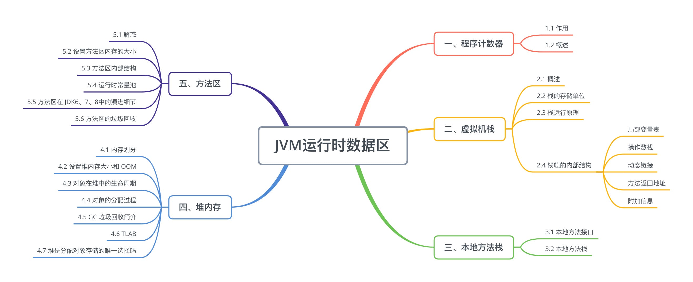
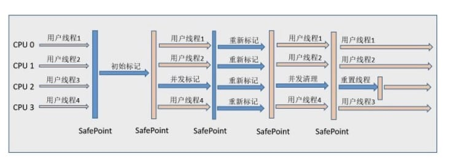
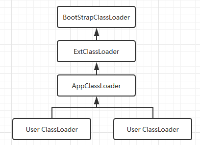

# 🚛 经典高频面试题汇总

# 1. Java 基础与高级特性

Java 基础是面试的入门，考察你对语言本身的理解，尤其是细节和底层实现。

## Java 中的 equals() 和 hashCode() 有什么关系？为什么要重写它们？

    - 考察点：`Object` 类的基础方法，HashMap 的工作原理，重写时需要满足的约定。

### 核心概念

1. `**equals()**`******定义：**
    - `equals()` 是 `Object` 类中的方法，用于判断两个对象是否相等。
    - 默认实现是比较对象的引用地址（`==`），即它们是否是同一个对象。
    - 我们需要重写 `equals()` 方法，让其比较对象内容而非地址。
2. `**hashCode()**`******定义：**
    - `hashCode()` 方法返回对象的哈希值，是一个整数，用于快速查找。
    - Java 的集合框架（如 `HashMap`、`Set`）通过 `hashCode()` 进行哈希分桶操作。
    - 默认实现基于对象的内存地址计算哈希值。
3. **两者的关系：**
    - 如果两个对象通过 `equals()` 方法判断相等，那么它们的 `hashCode()` 必须相等（保证逻辑一致）。
    - 如果两个对象的 `hashCode()` 不同，那么它们的 `equals()` 必定返回 `false`。
    - 同一个对象在多次调用 `hashCode()` 时，应该返回相同的结果（如果对象状态未改变）。

---

### 为什么要重写它们？

1. **为了支持集合的正常工作：**
    - 当将对象存储到基于哈希的集合（如 `HashMap` 或 `HashSet`）中，会先调用 `hashCode()` 方法定位到哈希桶，再通过 `equals()` 确定对象是否相同。
    - 如果 `hashCode()` 和 `equals()` 不一致，则集合可能无法正确处理对象。例如：
        - 存在哈希冲突时，`equals()` 用于判断是否是同一个对象。
        - 如果只重写 `equals()` 而没有重写 `hashCode()`，会导致逻辑错误。
2. **对比内容而非引用：**
    - 开发中更常见的是基于内容的比较，例如判断两个用户是否是同一个人，不应仅仅依赖对象地址。
3. **防止错误行为：**
    - 如果 `hashCode()` 的逻辑错误或未正确匹配 `equals()`，会导致错误结果或性能下降（比如哈希碰撞过多，导致链表长度增大）。

---

### 深入考察点

1. **违反约定的结果：**
    - 如果两个对象的 `equals()` 返回 `true`，但 `hashCode()` 不相等，哈希集合将无法正确工作，例如可能会插入重复元素。
    - 举例：`HashSet` 中会出现 "看似相等但存储多个" 的情况。
2. `**HashMap**`******的存储与查找过程：**
    - 存储时会调用键的 `hashCode()` 计算哈希值，定位到哪个 "哈希桶"。
    - 查找时会根据同样的 `hashCode()` 定位，再通过 `equals()` 确保是目标键。

---

### 代码示例

**未重写******`**equals**`******和**** **`**hashCode**`**：**

```java
import java.util.HashMap;  

class Person {  
    private String name;  

    public Person(String name) {  
        this.name = name;  
    }  
}  

public class Demo {  
    public static void main(String[] args) {  
        HashMap<Person, String> map = new HashMap<>();  

        Person p1 = new Person("John");  
        Person p2 = new Person("John");  

        map.put(p1, "Person1");  
        System.out.println(map.get(p2)); // null，查找时定位失败  
    }  
}
```

原因：由于 `p1` 和 `p2` 是不同的内存对象，`hashCode()` 不同，导致它们被分配到不同的哈希桶。

---

**正确重写******`**equals()**`******和**** **`**hashCode()**`**：**

```java
import java.util.Objects;  

class Person {  
    private String name;  
    private int age;  

    public Person(String name, int age) {  
        this.name = name;  
        this.age = age;  
    }  

    @Override  
    public boolean equals(Object o) {  
        if (this == o) return true;  
        if (o == null || getClass() != o.getClass()) return false;  
        Person person = (Person) o;  
        return age == person.age && Objects.equals(name, person.name);  
    }  

    @Override  
    public int hashCode() {  
        return Objects.hash(name, age);  
    }  
}  

public class Demo {  
    public static void main(String[] args) {  
        HashMap<Person, String> map = new HashMap<>();  

        Person p1 = new Person("John", 25);  
        Person p2 = new Person("John", 25);  

        map.put(p1, "Person1");  
        System.out.println(map.get(p2)); // 输出：Person1  
    }  
}
```

---

### 面试高频问答点

1. **为什么要重写******`**equals()**`******和**** **`**hashCode()**`**？**
    - 因为默认实现是基于对象内存地址，如果希望逻辑判断基于内容相等（如 `HashSet` 的合理存储/查找），就必须重写它们。
2. **如何正确重写？需注意哪些约定？**
    - 依赖对象核心字段实现一致性。
    - `equals()` 和 `hashCode()` 必须保持一致。
    - 避免仅对可变字段定义 `equals()` 和 `hashCode()`（否则状态变化会导致集合异常）。
3. **重写的过程是否会影响性能？**
    - 如果 `hashCode()` 的计算过程设计不当（如复杂字段组合或过多冲突），会增加集合操作开销。
4. **哈希冲突如何处理？**
    - Java 8 及以上版本，如果链表长度超过一定阈值（8），会将链表转化为红黑树提高性能。

---

### 总结

重写 `equals()` 和 `hashCode()` 是 Java 面试的经典高频点之一，重点在于了解两者的约定关系，以及重写时如何保持一致性，避免逻辑错误。

同时要结合集合框架的原理和实际使用场景，说明其必要性。这类问题尤其喜欢考察底层实现（如 `HashSet`、`HashMap` 的工作原理），回答时强调理论和实践结合效果最佳。

---

## 说说 Java 中的反射机制及其用途？反射的优缺点是什么？

    - 考察点：反射的核心类（`Class`、`Method`、`Field` 等），动态代理的实现，性能开销。

### 核心概念

1. **什么是反射 (Reflection)**：
    - 反射是 Java 提供的一种动态机制，允许程序在运行时检查和操作类的结构和行为（比如获取类信息、创建实例、调用方法、访问字段等）。
    - 反射是通过 `Class` 对象和 `java.lang.reflect` 包中的类（如 `Method`、`Field`、`Constructor` 等）实现的。
2. **反射的基本能力**：
    - **类的加载与检查**：如获取类的全限定名、实现的接口、父类等。
    - **动态创建实例**：通过构造器动态实例化对象。
    - **动态调用方法**：在运行时调用任何方法。
    - **动态访问字段**：获取、修改类的私有或公有字段。
3. **反射的核心类及方法：**
    - `Class`：核心类，表示一个类的字节码文件，提供访问类元数据的入口。
    - `Method`：表示类的方法。
    - `Field`：表示类的字段。
    - `Constructor`：表示类的构造器。

---

### 用途

1. **动态加载类和创建对象**：
    - 在程序运行时根据类名动态加载类，用于加载配置文件指定的类。
    - Spring 框架通过反射动态加载和实例化 Bean。

```java
String className = "com.example.MyClass";  
Class<?> clazz = Class.forName(className);  
Object obj = clazz.getDeclaredConstructor().newInstance();
```

2. **调用未知方法**：
    - 可以动态获取方法，并且在运行时调用，比如 ORM 框架（如 Hibernate）会根据实体类动态调用 Getter/Setter 方法。

```java
Method method = clazz.getDeclaredMethod("myMethod", String.class);  
method.invoke(obj, "example");
```

3. **访问和修改私有字段**：
    - 可以通过反射访问和修改类中的私有字段。
    - 常用于单元测试、框架中需要访问类的底层实现。

```java
Field field = clazz.getDeclaredField("privateField");  
field.setAccessible(true); // 绕过访问权限修饰符  
field.set(obj, "new value");
```

4. **框架/工具的核心机制**：
    - Spring、Hibernate、MyBatis 等框架的大量功能（如依赖注入、AOP、动态代理）都依赖反射机制。
5. **类的分析和工具开发**：
    - 用于开发调试工具（如通过反射动态分析某个类的结构）。
    - 代码生成工具（如 Lombok）。

---

### 动态代理的实现（反射的重要用途之一）

动态代理是反射的典型应用，框架通过动态代理实现 AOP（面向切面编程）或动态生成方法代理。

**JDK 动态代理示例：**

```java
import java.lang.reflect.Proxy;  
import java.lang.reflect.InvocationHandler;  
import java.lang.reflect.Method;  

// 接口  
interface MyService {  
    void doWork();  
}  

// 实现类  
class MyServiceImpl implements MyService {  
    public void doWork() {  
        System.out.println("Executing work in MyServiceImpl");  
    }  
}  

public class DynamicProxyDemo {  
    public static void main(String[] args) {  
        MyServiceImpl target = new MyServiceImpl();  

        // 创建动态代理  
        MyService proxy = (MyService) Proxy.newProxyInstance(  
            target.getClass().getClassLoader(),  
            target.getClass().getInterfaces(),  
            new InvocationHandler() {  
                @Override  
                public Object invoke(Object proxy, Method method, Object[] args) throws Throwable {  
                    System.out.println("Before executing method: " + method.getName());  
                    Object result = method.invoke(target, args);  
                    System.out.println("After executing method: " + method.getName());  
                    return result;  
                }  
            }  
        );  

        proxy.doWork(); // 通过代理对象调用方法  
    }  
}
```

输出：

```plain
Before executing method: doWork  
Executing work in MyServiceImpl  
After executing method: doWork
```

---

### 优缺点

1. **优点**：
    - **灵活性**：反射允许动态获取和操作类的元数据，提供非常灵活的扩展能力（如动态加载第三方库）。
    - **解耦性**：可以在运行时实现动态行为，而不是提前硬编码，适合扩展性强的场景。
    - **框架核心能力**：
        - 动态代理机制（Spring AOP）。
        - 依赖注入（Spring IOC）。
        - 持久层（MyBatis、Hibernate 等）。
2. **缺点**：
    - **性能开销**：
        - 反射比直接调用慢，性能差异显著，因为反射需要动态检查访问权限、元数据等。
        - 建议将反射操作封装好后缓存，避免频繁使用。
    - **安全性问题**：
        - 通过反射可以直接访问类的私有成员，增强灵活性的同时也带来了安全隐患。
    - **类型安全削弱**：
        - 反射使用时无法在编译期检查类型错误，容易引发运行时异常（如非法访问异常）。

---

### 代码示例

**动态访问私有字段案例：**

```java
class Example {  
    private String message = "Hello!";  

    public String getMessage() {  
        return message;  
    }  
}  

public class ReflectionDemo {  
    public static void main(String[] args) throws Exception {  
        Class<?> clazz = Class.forName("Example");  
        Object obj = clazz.getDeclaredConstructor().newInstance();  

        // 获取字段  
        Field field = clazz.getDeclaredField("message");  
        field.setAccessible(true); // 绕过私有访问限制  

        // 修改字段值  
        field.set(obj, "Hello, Reflection!");  

        // 调用方法  
        Method method = clazz.getDeclaredMethod("getMessage");  
        System.out.println(method.invoke(obj)); // Hello, Reflection!  
    }  
}
```

---

### 应用场景

- **Spring IOC 容器**：  
通过反射获取依赖类和对象，并注入到 Bean 中。
- **ORM 框架（如 Hibernate、MyBatis）**：  
通过反射实现对象与数据库表的映射动态操作。
- **AOP（如 Spring AOP）**：  
动态代理切面增强方法执行逻辑。
- **单元测试/调试工具**：  
私有代码测试或代码分析工具。

---

### 高频问答点

1. **反射与直接调用的区别？**
    - 反射操作会增加时间开销（如动态检查安全性）。
    - 直接调用更高效，但无法在运行时动态操作对象。
2. **反射的性能如何优化？**
    - 将 `Method`、`Field` 等动态获取的元数据对象缓存起来，避免在多次调用时重复获取。
3. **动态代理与 CGLIB 区别？**
    - JDK 动态代理：只支持接口。
    - CGLIB 动态代理：通过子类化目标类实现，无需接口支持。
4. **什么时候避免使用反射？**
    - 当应用性能较为关键且类结构已知时，不建议使用反射，应选择直接调用以减少开销。

---

## Java 泛型的实现原理是什么？什么是类型擦除？如何解决类型擦除带来的问题？

    - 考察点：泛型的编译时检查与运行时擦除，`T` 和 `?` 的区别，如何通过 `Class<T>` 获取类型信息。

### 核心概念

1. **泛型的定义**：
    - 泛型是 Java 提供的一种类型安全机制，允许定义类、接口或方法时使用类型参数（例如 `<T>`），在编译时确定实际类型。
    - 泛型通过在编译时检查类型约束，避免在运行时出现类型转换异常（`ClassCastException`）。
2. **泛型的实现原理**：
    - **类型擦除(Type Erasure)**：Java 泛型的编译器特性。
    - Java 的泛型在编译期间会将类型参数**擦除**，用其边界类型或 `Object` 替代。这意味着所有泛型信息在运行时并不存在。
3. **类型擦除的过程**：
    - 编译时，JVM 将代码中的泛型语法转换为常规类/方法形式，同时插入必要的强制类型转换。
    - **无边界泛型**：如 `<T>`，被擦除为 `Object`。
    - **有边界泛型**：如 `<T extends Number>`，被擦除为边界类型 `Number`。

---

### 类型擦除的代码示例

1. **泛型代码**（编译前）：

```java
public class GenericExample<T> {  
    private T data;  

    public T getData() {  
        return data;  
    }  

    public void setData(T data) {  
        this.data = data;  
    }  
}  

public static void main(String[] args) {  
    GenericExample<String> example = new GenericExample<>();  
    example.setData("Hello");  
    String value = example.getData(); // 类型安全，无需强制转换  
}
```

2. **类型擦除后**（编译期间）：

```java
public class GenericExample {  
    private Object data; // 类型参数被擦除为 Object  

    public Object getData() {  
        return data;  
    }  

    public void setData(Object data) {  
        this.data = data;  
    }  
}  

public static void main(String[] args) {  
    GenericExample example = new GenericExample();  
    example.setData("Hello");  
    String value = (String) example.getData(); // 强制类型转换  
}
```

**结论**：运行时，泛型的类型信息不可用，因为它们都被编译器擦除。

---

### 什么是类型擦除？其影响是什么？

1. **类型擦除定义**：
    - 泛型的类型参数 (`<T>` 等) 会在编译时被替换为原始类型 (`Object` 或边界类型)。
    - 这种设计的主要目的是保持向后兼容性：泛型在 JDK 1.5 引入后，仍可兼容旧版本的字节码。
2. **类型擦除的影响：**
    - **运行时不可获取具体泛型类型**：
        - 由于类型擦除，无法直接在运行时检查泛型参数的具体类型。
        - 例如：`List<String>` 和 `List<Integer>` 在运行时无法区分，都是 `List`。
    - **无法创建泛型数组**：
        - 由于运行时不能检测类型参数，Java 不允许直接创建泛型数组（如 `T[]`）。
    - **潜在的类型转换异常**：
        - 泛型擦除后，类型检查被迫下放到运行时（通过强转），可能引发 `ClassCastException`。

---

### 解决类型擦除导致的问题

1. **核心问题**：类型擦除导致泛型在运行时不可用，因此需要采用一些变通方法解决。

---

**方案 1：使用******`**Class**`******对象传递泛型类型**

- 通过在方法或构造器中传递泛型的 `Class` 对象，保留运行时类型信息。

**代码示例：**

```java
public class GenericFactory<T> {  
    private Class<T> clazz;  

    public GenericFactory(Class<T> clazz) {  
        this.clazz = clazz;  
    }  

    public T createInstance() throws InstantiationException, IllegalAccessException {  
        return clazz.newInstance(); // 使用 `Class` 对象来实例化对象  
    }  
}  

public static void main(String[] args) throws Exception {  
    GenericFactory<String> factory = new GenericFactory<>(String.class);  
    String instance = factory.createInstance();  
    System.out.println(instance);  
}
```

**讲解**：

- 通过显式传入 `Class<T>`，确保运行时的类型信息可用，用来定位泛型类型。

---

**方案 2：使用******`**ParameterizedType**`******获取运行时泛型信息**

- 利用反射机制，通过 `ParameterizedType` 获取泛型类的实际类型参数。

**代码示例：**

```java
import java.lang.reflect.ParameterizedType;  
import java.lang.reflect.Type;  

class GenericExample<T> {}  

public class Main {  
    public static void main(String[] args) {  
        GenericExample<String> example = new GenericExample<String>() {};  
        Type superClass = example.getClass().getGenericSuperclass();  
        ParameterizedType paramType = (ParameterizedType) superClass;  

        System.out.println(paramType.getActualTypeArguments()[0]); // 输出：class java.lang.String  
    }  
}
```

**讲解**：

- 通过创建匿名子类，保留泛型类型参数的信息，然后通过 `getGenericSuperclass()` 获取类型参数。

---

**方案 3：结合工具类来安全操作泛型**

- 一些框架（如 Guava、Apache Commons）提供工具类帮助处理泛型操作。

**示例（Guava******`**TypeToken**`**）：**

```java
import com.google.common.reflect.TypeToken;  

public class Main {  
    public static void main(String[] args) {  
        TypeToken<List<String>> typeToken = new TypeToken<List<String>>() {};  
        System.out.println(typeToken.getType()); // 输出：java.util.List<java.lang.String>  
    }  
}
```

---

### **优缺点思考**

#### **优点**

1. **类型安全**：
    - 泛型在编译时提供严格的类型检查，可以减少运行时强制类型转换可能产生的错误。  
例如：

```java
List<String> list = new ArrayList<>();  
list.add(123); // 编译失败！
```

2. **代码复用性增强**：
    - 泛型支持多种类型传入，极大减少重复代码。
3. **提高可读性**：
    - 泛型降低了强转的需求，代码更直观、易维护。

#### **缺点**

1. **类型擦除：**
    - 运行时无法获取类型参数信息，导致灵活性降低。
    - 泛型数组不能直接创建（如 `T[]`）。
    - 在序列化/反序列化场景中使用泛型时，类型擦除会造成障碍。
2. **复杂性**：
    - 泛型表达复杂，可能导致类型层次较深时增加代码理解成本。

---

### **高频面试问答点**

1. **为什么泛型采用类型擦除的实现方式？**
    - 为了保持向后兼容性。
    - 泛型引入之前的字节码（比如 JDK 1.4）不支持泛型，类型擦除让旧版本 JVM 能运行字节码。
2. **什么是无边界和有边界泛型？**
    - **无边界泛型**：`<T>`，T 的类型为任意类型。
    - **有边界泛型**：`<T extends Number>`，T 的类型必须为 `Number` 或其子类。
3. **泛型和 Java 的多态有什么关系？**
    - 泛型不像传统多态基于继承链，泛型在运行时被擦除，便不提供继承链式的信息。
4. **为什么不能直接创建泛型数组？**
    - 泛型数组在运行时不能检查具体类型擦除，容易引发安全问题（如强转出错）。

---

## 什么是 Java 的序列化？如何实现对象的序列化与反序列化？

    - 考察点：`Serializable` 接口，`transient` 关键字，`Externalizable` 的实现。

### 核心概念

1. **什么是序列化 (Serialization)？**
    - **序列化** 是将对象的状态转换为字节流的过程，这些字节流可以被保存到文件、传输到网络中或存储到数据库中。
    - **反序列化 (Deserialization)** 是序列化过程的逆操作，将字节流还原为对应的 Java 对象。
2. **什么时候需要序列化？**
    - 当你需要将一个对象的状态保存下来以便后续恢复。
    - 通过网络、文件或其他媒介传输对象时（例如 RMI、Socket 通信等场景）。
3. **实现序列化的方式：**
    - Java 提供了一个内置接口 `**java.io.Serializable**` 来实现序列化。
    - 实现序列化的对象需要通过 `ObjectOutputStream`（输出流），反序列化需要通过 `ObjectInputStream`（输入流）。

---

### 序列化工作的原理

1. **Java 提供的序列化工具类：**
    - `ObjectOutputStream`：将对象序列化并写入输出流。
    - `ObjectInputStream`：从输入流中读取字节流并反序列化为对象。
2. **一个类支持序列化需要满足以下条件**：
    - 必须实现 `Serializable` 接口（该接口是一个标记接口，表示该类可以序列化）。
    - 所有对象的字段也必须是可序列化的。如果某个字段不希望被序列化，可以使用 `transient` 关键字修饰。
    - 如果实现的类有父类，父类也需要支持序列化。

---

### 序列化与反序列化的实现方式

1. **类的定义**
    - 实现 `java.io.Serializable` 接口。
    - 提供一个 `serialVersionUID`，以确保类的版本兼容性。

```java
import java.io.Serializable;  

public class Person implements Serializable {  
    private static final long serialVersionUID = 1L; // 序列化版本号  
    private String name;  
    private int age;  

    // 构造方法  
    public Person(String name, int age) {  
        this.name = name;  
        this.age = age;  
    }  

    @Override  
    public String toString() {  
        return "Person{name='" + name + "', age=" + age + "}";  
    }  
}
```

1. **序列化代码实现**

```java
import java.io.FileOutputStream;  
import java.io.ObjectOutputStream;  

public class SerializeExample {  
    public static void main(String[] args) {  
        Person person = new Person("John", 30);  

        try (ObjectOutputStream out = new ObjectOutputStream(new FileOutputStream("person.ser"))) {  
            // 将对象序列化写入文件  
            out.writeObject(person);  
            System.out.println("序列化成功！");  
        } catch (Exception e) {  
            e.printStackTrace();  
        }  
    }  
}
```

1. **反序列化代码实现**

```java
import java.io.FileInputStream;  
import java.io.ObjectInputStream;  

public class DeserializeExample {  
    public static void main(String[] args) {  
        try (ObjectInputStream in = new ObjectInputStream(new FileInputStream("person.ser"))) {  
            // 反序列化读取文件中的对象  
            Person person = (Person) in.readObject();  
            System.out.println("反序列化成功：" + person);  
        } catch (Exception e) {  
            e.printStackTrace();  
        }  
    }  
}
```

**运行结果：**

```plain
序列化成功！  
反序列化成功：Person{name='John', age=30}
```

---

### 关键词和细节解析

1. `**serialVersionUID**`******是什么？为什么重要？**
    - `serialVersionUID` 是一个唯一标识序列化类版本的字段。
    - 当某个类发生变动（比如新增字段）时，若没有指定 `serialVersionUID`，则可能出现 `InvalidClassException`，因为反序列化时无法匹配版本。
    - 推荐显式指定 `serialVersionUID`，确保版本兼容。

示例：

```java
private static final long serialVersionUID = 1L;
```

2. `**transient**`******关键字的作用？**
    - 用于修饰类中的字段，表示该字段不参与序列化。
    - 例如：

```java
private transient String password; // 不会参与序列化
```

3. **对象包含不可序列化字段的解决办法：**
    - 如果一个对象的某些字段不可序列化，可以对这些字段设置为 `transient`，或者使用 `writeObject` 和 `readObject` 方法自定义序列化逻辑。

示例：

```java
private void writeObject(ObjectOutputStream out) throws IOException {  
    out.defaultWriteObject();  
    out.writeObject(自定义逻辑); // 自定义序列化某些字段  
}  

private void readObject(ObjectInputStream in) throws IOException, ClassNotFoundException {  
    in.defaultReadObject();  
    恢复自定义字段逻辑(); // 恢复不可序列化字段  
}
```

---

### 序列化的应用场景

1. **网络通信**：
    - 在分布式系统中，通过序列化将对象传输到远程节点（例如 RPC 通信）。
    - Java RMI（Remote Method Invocation）在数据传输中依赖序列化。
2. **持久化存储**：
    - 对象序列化后可以写入到文件或数据库中，比如保存用户会话状态。
3. **缓存与分布式框架**：
    - 分布式缓存框架（如 Redis 和 Memcached）中，可以将对象序列化后存储。
    - 常用可替代序列化的其他工具：JSON、Protocol Buffers。
4. **深拷贝**：
    - 利用序列化创建对象的深拷贝，通过序列化和反序列化还原来生成新的对象。

---

### 优缺点分析

**优点：**

1. **简单易用**：
    - 只需实现 `Serializable` 接口，无需额外配置即可完成序列化和反序列化。
2. **兼容性高**：
    - 提供了 `serialVersionUID` 控机制，类版本变更也可兼容。
3. **标准化**：
    - Java 提供了完整的序列化工具类，如 `ObjectOutputStream` 和 `ObjectInputStream`。

**缺点：**

1. **性能开销大**：
    - Java 默认序列化存在性能问题，尤其在大规模分布式场景下，往往需要更高效的序列化框架（如 JSON、Protocol Buffers、Kryo）。
2. **类版本兼容问题**：
    - 若不显式声明 `serialVersionUID`，类结构发生变化后，可能导致反序列化失败。
3. **字段不可控性**：
    - 使用默认序列化时，类的所有可序列化字段都会被序列化，容易导致隐私或数据泄露。

---

### 高频面试问题

1. **为什么要实现******`**Serializable**`**？不实现会发生什么？**
    - 如果类没有实现 `Serializable`，序列化时会抛出 `NotSerializableException`，因为 JVM 不知道如何处理该类对象。
2. `**serialVersionUID**`******有何作用？**
    - 确保序列化兼容性。在类发生变化时，若版本号一致，可避免反序列化失败。
3. `**Serializable**`******和**** **`**Externalizable**`******的区别？**
    - **Serializable**：默认机制，序列化所有字段。
    - **Externalizable**：需要开发者手动实现序列化逻辑（通过实现 `writeExternal` 和 `readExternal` 方法），更加灵活。
4. **哪些字段不会被序列化？**
    - `static` 字段：属于类本身，而非对象。
    - `transient` 字段：由开发者显式声明不参与序列化。

---

## 说说 Java 中的异常体系，Error 和 Exception 的区别是什么？

    - 考察点：Checked 和 Unchecked 异常，常见异常（如 NullPointerException、ClassCastException）。

### 核心概念

1. **什么是异常？**
    - 异常是程序运行过程中发生的不正常情况，可能会导致程序中断，但它是一种可预见且可处理的问题。
    - Java 提供了异常机制来捕获、处理这些错误，帮助开发者编写更健壮的代码。
2. **异常体系结构：**
    - Java 中所有异常和错误的根类是 `**Throwable**`。
    - 根据用途和性质，Java 中的异常分为两大类：
        - **Error**：严重错误，通常是系统级问题，程序无法处理。
        - **Exception**：程序运行过程中可以捕获和恢复的异常，是程序错误或外部原因导致的问题。
    - `Throwable` 的子类结构如下：


---

### Error 和 Exception 的区别

| **方面** | **Error** | **Exception** |
| --- | --- | --- |
| **定义** | 系统级错误，通常由 JVM 抛出，表示程序无法恢复的严重问题。 | 可恢复的异常，通常由程序或外部问题导致。 |
| **性质** | 属于严重错误，程序无法处理也不建议处理。 | 程序可以捕获并处理，恢复正常运行。 |
| **常见子类** | **OutOfMemoryError**、**StackOverflowError**、LinkageError 等。 | **IOException**、**SQLException**、**NullPointerException** 等。 |
| **是否需要捕获** | 不需要捕获，通常直接终止程序运行。 | 需要捕获并处理，避免程序中断。 |
| **示例** | - `OutOfMemoryError`<br/>：内存溢出<br>- `StackOverflowError`<br/>：栈溢出 | - `FileNotFoundException`<br/>：文件未找到<br>- `NullPointerException`<br/>：空指针 |

---

### 异常的分类

1. **Checked Exception（受检异常）：**
    - 编译时被强制检查的异常，必须通过 `try-catch` 或 `throws` 来处理。
    - 开发者可以根据特定场景处理这些异常。
    - **典型 Checked 异常**：
        - `IOException`（文件/流操作失败）
        - `SQLException`（数据库相关错误）
        - `FileNotFoundException` 等。
2. **Unchecked Exception（非受检异常）：**
    - 编译器不会强制开发者处理，运行时可能发生。
    - 通常由程序逻辑错误引起，需要从代码层面修复。
    - **典型 Unchecked 异常**：
        - `NullPointerException`（空指针引用问题）
        - `IndexOutOfBoundsException`（数组越界）
        - `ArithmeticException`（算术错误，例如除 0）

---

### 代码示例

1. **Checked Exception 示例**：

```java
import java.io.*;  

public class CheckedExceptionExample {  
    public static void main(String[] args) {  
        try {  
            FileReader reader = new FileReader("non_existent_file.txt");  
        } catch (FileNotFoundException e) {  
            System.out.println("文件未找到: " + e.getMessage());  
        }  
    }  
}
```

**输出：**

```java
文件未找到: non_existent_file.txt (没有这样的文件或目录)
```

2. **Unchecked Exception 示例**：

```java
public class UncheckedExceptionExample {  
    public static void main(String[] args) {  
        int[] nums = {1, 2, 3};  
        System.out.println(nums[3]);  // 数组越界访问  
    }  
}
```

**输出：**

```java
Exception in thread "main" java.lang.ArrayIndexOutOfBoundsException: Index 3 out of bounds for length 3
```

3. **Error 示例**：

```java
public class ErrorExample {  
    public static void recursiveCall() {  
        recursiveCall(); // 无限递归，导致栈溢出  
    }  

    public static void main(String[] args) {  
        recursiveCall();  
    }  
}
```

**输出：**

```java
Exception in thread "main" java.lang.StackOverflowError
```

---

### 异常的捕获与处理

1. **异常处理结构：**
    - `try`：包含可能抛出异常的代码。
    - `catch`：捕获并处理特定异常。
    - `finally`：始终执行的代码块（如清理资源）。
    - `throws`：声明将抛出异常，交由调用者处理。
2. **异常捕获示例：**

```java
public class ExceptionHandlingExample {  
    public static void main(String[] args) {  
        try {  
            int result = 10 / 0;  
        } catch (ArithmeticException e) {  
            System.out.println("算术异常: " + e.getMessage());  
        } finally {  
            System.out.println("程序结束。");  
        }  
    }  
}
```

**输出：**

```java
算术异常: / by zero  
程序结束。
```

---

### 面试高频点：常见问题与思考

1. **为什么要区分 Checked 和 Unchecked 异常？**
    - Checked 异常需要开发者显式处理，是可以预见和恢复的异常（例如：文件未找到）。
    - Unchecked 异常由程序缺陷导致，不能被外部恢复（例如：空指针）。
2. **为什么******`**Error**`******不应该被捕获？**
    - `Error` 表示系统或 JVM 层级的严重错误（如内存溢出、系统资源耗尽），即使捕获也无法恢复，通常应该允许它们终止程序。
3. `**finally**`******块一定会执行吗？**
    - **通常会执行，但以下情况除外：**
        - 在 `finally` 块或之前的代码中调用了 `System.exit(0)`。
        - 在程序崩溃时（如硬件故障）。
4. **是否可以在一个******`**try**`******块中捕获多个异常？**
    - 可以。JDK 7 之后支持多异常捕获：

```java
try {  
    // 可能抛出多种异常的代码  
} catch (IOException | SQLException e) {  
    e.printStackTrace();  
}
```

5. **如何自定义异常？**
    - 可以通过创建自定义异常类继承 `Exception` 或 `RuntimeException`：

```java
class CustomException extends Exception {  
    public CustomException(String message) {  
        super(message);  
    }  
}
```

6. **面试常考情景题：**
    - **问：运行时抛出******`**NullPointerException**`******是哪个异常？**  
答：属于 `RuntimeException` 的子类，属于非受检异常。
7. **Error 的一些经典例子解释：**
    - `OutOfMemoryError`：程序在堆内存不足时抛出，例如大量对象未释放。
    - `StackOverflowError`：递归调用过深（如无限递归）导致栈空间耗尽。

---

### 总结

1. **异常体系：**
    - `Throwable` 是顶层类，`Error` 表示不可恢复的系统错误，`Exception` 表示程序可能恢复的异常。
2. **Error vs Exception：**
    - **Error**：如 `StackOverflowError`、`OutOfMemoryError`，程序无法处理，通常直接崩溃。
    - **Exception**：有两类：
        - Checked Exception（受检异常，编译时检查）。
        - Unchecked Exception（非受检异常，运行时检查）。
3. **关键点：**
    - 开发中需要正确处理异常（尤其是 Checked 异常）。
    - 避免滥用捕获或忽略异常，造成代码隐患。

---

# 2. JVM（Java 虚拟机）

JVM 是 Java 面试的重中之重，尤其是性能调优、内存管理和垃圾回收机制。

## JVM 的内存模型（运行时数据区）是什么样的？各个区域的作用是什么？

    - 考察点：堆、方法区、栈、本地方法栈、程序计数器，线程共享与私有的内存区域。

Java 程序运行时，JVM 会将内存划分为多个区域，用来存储不同类型的数据。这些区域统称为 **JVM 的运行时数据区**，负责管理应用程序的内存分配和回收。

---

### JVM 内存模型的整体结构

根据 JVM 规范，JVM 的运行时数据区包括以下几个主要部分：


---

### 各个区域的作用解析

#### **1. 程序计数器 (Program Counter Register)**

- **定义**：
  - 程序计数器是一块较小的内存空间，表示当前线程所执行的**字节码指令**地址。
- **作用**：
  - 用于记录程序的执行位置（即当前指令的行号）。
  - 线程私有，保证每个线程的代码执行位置互不干扰。
- **特点**：
  - 如果线程正在执行 JVM 自身的代码（普通 Java 方法），则记录JVM字节码地址。
  - 如果线程正在执行本地方法（如 C/C++ 方法），程序计数器为空。

---

#### **2. Java 虚拟机栈 (JVM Stack)**

- **定义**：
  - 每个线程分配一个 JVM 栈，用来存储方法调用的相关信息。
- **组成：**
  - 每个方法调用时，JVM 为其分配一个 **栈帧 (Stack Frame)**。
  - 栈帧包含：
    - **局部变量表**：存储方法的局部变量（如基本数据类型、对象引用）。
    - **操作数栈**：方法执行时，用来存储中间操作结果。
    - **动态链接**：指向运行时常量池中方法的引用。
    - **方法返回地址**：存储方法调用后返回的位置。
- **作用**：
  - 管理方法的调用和返回。
  - 是线程私有的，生命周期和线程一致。
- **常见异常**：
  - `**StackOverflowError**`：
    - 递归调用过深导致栈空间耗尽。
  - `**OutOfMemoryError: Java Heap Space**`：
    - JVM 栈内存不足时出现。

---

#### **3. 本地方法栈 (Native Method Stack)**

- **定义**：
  - 与 JVM Stack 类似，但它用于支持 JVM 调用 **本地方法**（Native Method，即非 Java 代码，如 C、C++ 代码）。
- **作用**：
  - 管理本地方法调用时的内存分配和回收。
  - 一般与操作系统的底层交互有关，例如文件操作、网络 IO 等。
- **异常**：
  - 如果该栈的内存分配不足，也会抛出 `**StackOverflowError**` 或 `**OutOfMemoryError**`。

---

#### **4. 堆 (Heap，重点)**

- **定义**：
  - 堆是运行时 Java 对象分配的主要区域，**所有对象实例和数组都存储在堆中**。
- **作用**：
  - 管理对象实例的生命周期。
  - 是线程共享区域，所有线程都可以访问其中的数据。
- **堆的划分**：
  - 堆分为**新生代 (Young Generation)** 和 **老年代 (Old Generation)**。
    - **新生代**：
      - 用于存放短命周期的对象（年轻对象）。
      - 再细分为：
        - Eden 区（分配新对象）。
        - From Survivor 和 To Survivor（存活对象在这两个区之间复制）。
      - **垃圾回收频率高**（Minor GC）。
    - **老年代**：
      - 用于存放生命周期长的对象（如静态对象和使用频繁的大对象）。
      - **垃圾回收频率较低**（Major GC / Full GC）。
- **异常**：
  - 如果堆内存不足，会抛出 `**OutOfMemoryError: Java Heap Space**`。

---

#### **5. 方法区 (Method Area)**

- **定义**：
  - 存储类的元信息（MetaData），包括类结构、方法定义、字段、静态变量、运行时常量池等。
  - 在 JDK 8 之前，方法区由 **永久代 (PermGen)** 实现；JDK 8 之后，永久代被替换为**元空间(Metaspace)**，元空间使用**直接内存**方式管理。
- **作用**：
  - 用于存储类的运行时信息，而非实例数据。
  - 静态变量会存储在方法区中。
- **特点**：
  - 是线程共享的。
  - 元空间大小可以通过 `-XX:MetaspaceSize` 参数进行调整。
- **异常**：
  - `**OutOfMemoryError: Metaspace**`：
    - 元空间内存不足，无法加载新类时抛出。

---

#### **6. 运行时常量池 (Runtime Constant Pool)**

- **定义**：
  - 是方法区的一部分，用于存储所有类/接口的常量。
  - 包括 **字面量**（如字符串、基本类型字面值）和 **符号引用**（方法名、字段、类型描述符等）。
- **作用**：
  - 提供动态链接的支持（运行时将符号引用替换为内存中的直接引用）。
  - 编译时的常量池（Class 文件中）会被加载到这里。
- **特点**：
  - **运行时字符串池 (String Pool)**：
    - JVM 中的字符串字面量存储在运行时常量池中。
    - 可以避免重复创建字符串，提升性能。
- **异常**：
  - `**OutOfMemoryError: PermGen Space**`**（JDK 7 及之前）**：
    - 如果常量池空间不足会抛出。
  - `**OutOfMemoryError: Java Heap Space**`**（JDK 8 及之后）**：
    - 字符串池被移动到了堆中，内存不足时会抛出该异常。

---

### JVM 内存模型与线程的关系

1. **线程私有区域：**
    - 程序计数器。
    - Java 虚拟机栈。
    - 本地方法栈。
2. **线程共享区域：**
    - 堆。
    - 方法区（元空间）。
    - 运行时常量池。

---

### JVM 内存模型中的常见问题与排查

1. **堆内存不足**：
    - 错误：`OutOfMemoryError: Java Heap Space`
    - 排查：
        - 监控堆内存使用情况。
        - 调整 JVM 参数：如 `-Xmx`（最大堆大小）和 `-Xms`（初始堆大小）。
    - 优化：
        - 检查代码中有没有内存泄漏。
        - 减少不必要的大对象创建。
2. **元空间不足**：
    - 错误：`OutOfMemoryError: Metaspace`
    - 排查：
        - 类加载频繁时，检查是否存在类加载器泄漏问题。
        - 增加元空间大小：`-XX:MaxMetaspaceSize`。
3. **栈溢出问题**：
    - 错误：`StackOverflowError`
    - 原因：
        - 递归调用深度过高。
        - 方法调用层级过多。
    - 解决：
        - 优化递归算法。
        - 调整栈内存大小：`-Xss`。

---

### 总结

1. JVM 的内存模型是管理 Java 程序在运行时所有数据的关键，每个区域有不同的作用：
    - **程序计数器**：记录当前线程执行位置。
    - **虚拟机栈**：存储方法调用信息，线程私有。
    - **本地方法栈**：支持本地代码执行。
    - **堆**：管理对象生命周期，重点区域。
    - **方法区（元空间）**：存储类元信息、常量池。
    - **运行时常量池**：存放常量和符号引用。
2. JVM 优化的重要参数：
    - 堆内存调整：`-Xms`、`-Xmx`。
    - 元空间大小：`-XX:MetaspaceSize`。
    - 栈大小：`-Xss`。
3. 常见异常：
    - 堆内存不足：`OutOfMemoryError: Java Heap Space`
    - 栈溢出：`StackOverflowError`
    - 元空间不足：`OutOfMemoryError: Metaspace`

通过理解 JVM 的运行时内存分区以及各个区域的作用，可以更好地优化程序性能，并排查内存相关问题！

---

## Java 中的垃圾回收机制（GC）是如何工作的？常见的 GC 垃圾收集器有哪些？

    - 考察点：GC Roots、引用计数法、标记-清除算法、CMS、G1 收集器的原理和适用场景。

### 什么是垃圾回收（GC，Garbage Collection）？

- **概念**：  
垃圾回收是 JVM 的一种内存管理机制，它会**自动回收**不再被使用的对象占用的内存空间，从而避免手动释放内存的操作。
- **GC 的目标**：
  - **检测**：找出已经失去作用（即不再可达）的对象。
  - **回收**：回收它们所占用的堆内存空间，提供给新的对象使用。
- **特点**：
  - Java 的垃圾回收由 JVM 自动完成，开发者无需手动管理内存（与 C++ 的 `malloc` 和 `free` 不同）。
  - 虽然 GC 提高了开发效率，但也可能带来性能开销。

---

### JVM 内存分代和垃圾回收

在了解 GC 工作机制之前，先了解 JVM 堆内存的分代模型，这直接影响垃圾回收机制。

#### JVM 的堆内存分代模型


1. **新生代 (Young Generation)**：
    - 存放新创建的对象。
    - 再细分为：
        - **Eden 区**：新对象首先分配在这里。
        - **两个 Survivor 区**（From 和 To）：Eden 中存活的对象会被移动到 Survivor。
    - 新生代的垃圾回收较频繁，采用**Minor GC**。
2. **老年代 (Old Generation)**：
    - 存放生命周期较长的对象。
    - 移动到老年代的对象通常是多次在新生代回收中幸存的对象。
    - 老年代垃圾回收比新生代少，采用**Major GC** 或 **Full GC**。
3. **永久代 (PermGen)** / **元空间 (Metaspace)**：
    - JVM 方法区的一部分，用于存储类的元数据、静态变量等。
    - 注意：
        - 在 JDK 8 后，永久代被替换为元空间，元空间不在堆内存中，而是使用本地内存。

---

### Java 垃圾回收的工作原理

**核心思想：**  
Java 使用 **可达性分析算法 (Reachability Analysis)** 来判断对象是否存活。

#### 判断对象是否存活

1. **可达性分析 (Reachability Analysis)**：


    - JVM 会从一组称为**GC Roots**的引用对象出发，遍历所有可以被引用的对象。如果某对象不可达（即无法通过 GC Roots 找到该对象），则认为该对象是垃圾。
    - **GC Roots** 的来源：
        * 虚拟机栈中引用的对象（局部变量）。
        * 方法区中的静态字段引用的对象。
        * 方法区中的常量引用的对象。
        * 本地方法栈引用的对象（Native 方法）。
2. **对象的生命周期（死亡判定）**：
    - 第一次：若对象不可达，进入**死亡状态**。
    - 第二次：如果对象实现了 `finalize()` 方法，会尝试自救。如果仍不可达，则正式被认为死亡。

#### 垃圾回收的方法

1. **标记 - 清除算法**：


    - **过程**：
        1. 遍历对象，标记出所有需要被回收的对象。
        2. 清除这些对象，释放相关内存。
    - **缺点**：
        * 容易导致内存碎片化。
2. **复制算法**：


    - **过程**：
        * 将存活的对象从一块内存复制到另一块内存中，清空原内存。
    - **应用**：
        * 适用于新生代（Eden 和 Survivor 之间）。
    - **优点**：
        * 不会有碎片化问题。
    - **缺点**：
        * 需要额外的内存空间以完成复制。
3. **标记 - 整理算法**：


    - **过程**：
        * 标记存活的对象。
        * 将存活的对象整理到内存的一端，清理无用的空间。
    - **用途**：
        * 适用于老年代。
    - **优点**：
        * 减少碎片化问题。
4. **分代收集算法**：


    - **原理**：
        * 根据对象的生命周期长短，将堆内存划分为新生代和老年代，分别采用不同的算法。
    - **应用**：
        * 新生代：复制算法。
        * 老年代：标记 - 整理算法。

---

### 常见的垃圾收集器

JVM 提供了多种垃圾收集器，可以根据应用场景选择合适的实现。以下是常用的垃圾收集器：

#### 新生代收集器

1. **Serial GC**：


    - **特点**：单线程的垃圾收集器，效率高，但会导致长时间停顿（`Stop The World`，简称 STW）。
    - **适用场景**：适用于单线程程序、小内存场景。
    - 参数：`-XX:+UseSerialGC`
2. **ParNew GC**：


    - **特点**：并行收集器，和 Serial 相比，支持多线程。
    - **适用场景**：默认与 CMS GC 配合使用。
    - 参数：`-XX:+UseParNewGC`
3. **Parallel GC (Throughput Collector)**：
    - **特点**：多线程并行收集，关注吞吐量（即减少垃圾回收占总时间的比例）。
    - **适用场景**：适用于后台运算型的应用，如大数据处理。
    - 参数：`-XX:+UseParallelGC`

#### 老年代收集器

1. **CMS GC (Concurrent Mark-Sweep)**：



    - **特点**：
        * 使用标记 - 清除算法。
        * 主要目标是降低停顿时间（低延迟）。
        * 可能出现内存碎片化，不适合高内存压力场景。
    - 参数：`-XX:+UseConcMarkSweepGC`
2. **G1 GC (Garbage First)**：


    - **特点**：
        * 将堆划分为多个区域（Region），不再严格区分新生代和老年代。
        * 使用并行、增量回收，减少 STW 时间。
    - **适用场景**：适合大内存低延迟场景。
    - 参数：`-XX:+UseG1GC`

#### 新一代收集器

1. **ZGC (Z Garbage Collector)**：


    - **特点**：关注超低延迟，STW 时间不到 10 ms。
    - **适用场景**：适合大规模、低延迟应用。
    - 参数：`-XX:+UseZGC`

---

### GC 日志和调优

1. **GC 日志参数**：
    - `-XX:+PrintGCDetails`：打印 GC 的详细日志。
    - `-Xloggc:<file>`：指定 GC 日志的输出文件。
    - `-XX:+PrintGCTimeStamps`：打印 GC 时间戳。

**GC 日志示例**：

```powershell
[GC (Allocation Failure) [PSYoungGen: 512K->64K(1536K)] 512K->160K(5632K), 0.0002561 secs]
```

    - 新生代回收：从 512K 减少到 64K（使用复制算法）。
    - 整体堆内存变化：从 512K 减少到 160K。
2. **调优策略**：
    - **吞吐量优先**：增加堆内存大小，减少 GC 频率。
        *使用 `Parallel GC`。
    - **低延迟优先**：减少停顿时间。
        * 使用 `G1 GC`、`ZGC` 或 `Shenandoah GC`。
    - 调大新生代比例：减少对象晋升到老年代的频率。

---

### 总结

1. **工作原理**：
    - JVM 使用可达性分析判断对象存活。
    - 常见算法：标记 - 清除、复制算法、标记 - 整理。
2. **分代模型**：
    - 新生代：短生命周期对象，频繁回收。
    - 老年代：长生命周期对象，回收较少。
3. **常用收集器**：
    - **新生代**：Serial、ParNew、Parallel。
    - **老年代**：CMS、G1。
    - **低延迟收集器**：ZGC。
4. **调优场景**：
    - 吞吐优先：Parallel GC。
    - 低延迟：G1 GC、ZGC。

---

## 什么是类加载机制？类加载的过程是怎样的？什么是双亲委派模型？

    - 考察点：加载、链接、初始化；双亲委派的优点；如何自定义类加载器。

### 什么是类加载机制？

**类加载机制** 是指 **JVM 动态加载******`**.class**`******文件到内存**、对类进行解析、初始化的过程。

- 通过类加载，JVM 在运行时把 `.class` 文件加载进方法区（JDK 8 之后为元空间 Metaspace），同时生成对应的 `Class` 对象（表示内存中类的抽象描述）。
- 动态加载意味着类只有在需要时才会被加载到 JVM 中。

**Java 的特点**：

- **动态加载**：类编译成 `.class` 文件后，可以在运行时动态加载需求的类。
- **按需加载**：只有在类真正被使用时，才会触发加载。

---

### 类加载的过程

Java 的类加载主要分为 **加载（Loading）**、**连接（Linking）** 和 **初始化（Initialization）** 三个阶段：


**（1）加载（Loading）**：

- **含义**：将类的字节码文件（`.class` 文件）加载到内存（方法区中），并生成对应的 `Class` 对象。


- **步骤**：
    1. 通过类的全限定名找到 `.class` 文件。
    2. 使用类加载器将字节码文件加载到内存中。
    3. 创建 `Class` 对象，用于代表该类的元信息。
- **参与者**：类加载器（Class Loader）。
- **可能路径**：从本地文件系统、网络、JAR 包甚至动态生成的字节码加载类。

---

**（2）连接（Linking）**：

1. **验证（Verification）**：
    - 验证字节码文件的正确性和安全性，确保不会破坏 JVM 的运行。
    - 主要检查：
        - 文件格式是否符合规范。
        - 字节码是否符合 Java 语言规范。
        - 符号引用是否能正常解析。
    - 如果验证失败，会抛出 `**VerifyError**`。
2. **准备（Preparation）**：
    - 为类的静态变量分配内存，并将其初始化为默认值（如 `0`、`null` 等）。
    - **注意**：此时只会赋默认值，不会对静态变量赋初始值。
        - 示例：

```java
public static int num = 10;
```

在这里，准备阶段 `num = 0`，正式赋值是初始化阶段完成。

3. **解析（Resolution）**：
    - 将类中的符号引用（常量池中的类、方法、字段符号）解析为直接引用（内存地址）。
    - 会分析常量池中引用的类、方法和字段，并将其加载进来。

---

**（3）初始化（Initialization）**：

- **含义**：对类的静态变量进行赋值操作，执行类的静态代码块。
- **触发条件**：
    1. 当第一次主动使用类时（如实例化、访问静态字段、调用静态方法）。
    2. 通过反射（如 `Class.forName()`）。
    3. JVM 加载某些入口类（`main` 方法所在的类）。

---

### 什么是双亲委派模型？

**双亲委派模型（Parent Delegation Model）** 是 Java 类加载机制的重要组成部分。  
它规定了类加载器的工作方式，确保类的加载具有优先级和安全性。

**核心原理：**

- 当一个类加载器需要加载某个类时，它首先会**委托它的父加载器**尝试加载，只有当父加载器无法加载该类时，子加载器才会尝试加载。



**步骤：**

1. 当前类加载器向上委托给父级加载器检查。
2. 父级加载器继续向上委托，最终由**根加载器（Bootstrap ClassLoader）**尝试加载。
3. 如果父加载器未能加载目标类，子加载器才会尝试加载。

---

##### **作用**

1. **安全性**：
    - 确保核心的 Java API（如 `java.lang.String`）只能由引导类加载器加载，不能通过自定义类加载器篡改。
    - 避免 User ClassLoader 重写这些核心类，增加应用程序运行的安全性。
2. **避免重复加载**：
    - 遵循双亲委派模型，每个类只会加载一次，避免两个不同类加载器实例化相同类的问题。

---

##### **经典类加载器的继承链**

Java 提供了以下几种**类加载器**：

1. **Bootstrap ClassLoader（根加载器）**：
    - 最顶层的加载器，由 C/C++ 代码实现。
    - 负责加载 `$JAVA_HOME/lib` 目录下的核心类（如 `rt.jar`）。
2. **Extension ClassLoader（扩展类加载器）**：
    - 负责加载 `$JAVA_HOME/lib/ext` 目录下的类。
3. **Application ClassLoader（系统类加载器）**：
    - 负责加载应用程序的类路径 `CLASSPATH` 中的类。
4. **自定义 ClassLoader**：
    - 继承 `ClassLoader`，可以实现自定义的类加载逻辑。

---

### 示例代码

**（1）类的加载与初始化**：

```java
public class ClassLoaderTest {  
    static {  
        System.out.println("静态代码块被执行");  
    }  

    public static void main(String[] args) throws Exception {  
        System.out.println("主方法开始");  
        // 主动触发类加载  
        Class.forName("ClassLoaderTest");  
        System.out.println("类加载完成");  
    }  
}
```

**运行结果：**

```java
主方法开始  
静态代码块被执行  
类加载完成
```

---

**（2）双亲委派模型示例**：  
通过以下代码观察类加载器委托链：

```java
public class ClassLoaderHierarchy {  
    public static void main(String[] args) {  
        // 获取应用类加载器  
        ClassLoader appClassLoader = ClassLoader.getSystemClassLoader();  
        System.out.println("应用类加载器: " + appClassLoader);  

        // 获取扩展类加载器  
        ClassLoader extClassLoader = appClassLoader.getParent();  
        System.out.println("扩展类加载器: " + extClassLoader);  

        // 获取引导类加载器（null，因其用本地语言实现）  
        ClassLoader bootClassLoader = extClassLoader.getParent();  
        System.out.println("引导类加载器: " + bootClassLoader);  
    }  
}
```

**运行结果：**

```java
应用类加载器: sun.misc.Launcher$AppClassLoader@18b4aac2  
扩展类加载器: sun.misc.Launcher$ExtClassLoader@10f87f48  
引导类加载器: null
```

---

**（3）自定义 ClassLoader 示例**：

```java
public class CustomClassLoader extends ClassLoader {  
    @Override  
    protected Class<?> findClass(String name) throws ClassNotFoundException {  
        // 自定义加载逻辑  
        System.out.println("使用自定义类加载器加载类: " + name);  
        return super.findClass(name);  
    }  
}
```

---

### 双亲委派模型的优缺点

- **优点**：
    1. **安全性**：确保核心类如 `java.lang.Object` 不会被自定义加载器篡改。
    2. **避免重复加载**：同一个类不会被多个类加载器重复加载。
- **缺点**：
  - 双亲委派模型对某些动态化需求支持不好。例如热部署场景（如 Tomcat 会打破模型，使用自定义加载器加载用户的类）。

---

### 类加载机制常见面试问题

1. **双亲委派模型如何保证安全性？**
    - 确保核心 Java 类（如 `java.lang.String`）只能由引导类加载器加载，避免恶意代码篡改。
2. **什么时候跳过双亲委派模型？**
    - 动态需求场景，比如 Servlet 容器（Tomcat）在热加载类时会绕过双亲委派。
3. **类加载的触发条件有哪些？**
    - 静态字段访问、静态方法调用、实例化类对象、使用反射等。
4. **类加载的主要阶段有哪些？**
    - 加载，连接（含验证、准备、解析），初始化，使用，卸载。
5. **如何实现一个自定义类加载器？**
    - 通过扩展 `ClassLoader`，重写 `findClass` 方法，实现自定义字节码读取逻辑。

---

### 总结

1. Java 的类加载机制是动态的，类只有在需要时才会被加载。
2. 类加载分为**加载、连接（验证、准备、解析）和初始化**三个主要阶段。
3. 双亲委派模型通过加载器的层层委派，提供了安全性和高效性。
4. 特殊场景下（如动态加载、热部署），可能需要自定义类加载器或打破双亲委派模型。

## OOM（OutOfMemoryError）有哪些常见类型？如何排查和解决？

    - 考察点：堆内存溢出、栈内存溢出、方法区溢出，`jmap`、`jstack` 和 `MAT` 工具的使用。

### 什么是 `OutOfMemoryError`？

`OutOfMemoryError` 是 JVM 抛出的一个严重错误，表示应用程序运行时内存不足，JVM 无法为对象分配足够的内存空间。

- **特点：**
  - 属于 `Error` 类，由 JVM 抛出，表示容错机制无法处理的严重问题。
  - `OOM` 通常意味着需要调整 JVM 内存参数或优化代码，有时也可能是内存泄漏的表现。

---

### 常见的 `OutOfMemoryError` 类型

#### `java.lang.OutOfMemoryError: Java heap space`

    - **原因**：
        * 堆内存不足，无法分配对象。
        * 使用了大量大对象，且这些对象无法被及时回收。
    - **触发场景**：
        * 创建太多大数组或对象。
        * 集合类中不断增加元素（如 `List` 或 `Map`），且未正确释放引用。
        * 使用缓存但没有清理过期的数据。
    - **关键参数**：
        * 堆大小由 JVM 参数 `-Xms`（最小堆内存）和 `-Xmx`（最大堆内存）控制。

---

#### `java.lang.OutOfMemoryError: GC overhead limit exceeded`

    - **原因**：
        * 垃圾回收器消耗了过多的 CPU 时间，但只能回收极少量的内存。
        * JVM 超过 98% 的时间在执行垃圾回收，但只释放不到 2% 的堆内存。
    - **触发场景**：
        * 老年代或整个堆几乎被占满，且对象存活率高，GC 无法有效释放内存。
    - **解决方向**：
        * 调整堆大小。
        * 检查代码是否有内存泄漏。
        * 优化对象生命周期，减少老年代中存活对象的数量。

---

#### `java.lang.OutOfMemoryError: Metaspace`

    - **原因**（适用于 JDK 8 及以上，JDK 7 中为 **PermGen Space**）：
        * 元空间（`Metaspace`）耗尽，无法为加载的类分配足够的内存。
        * `Metaspace` 是用于存放类的元数据（如类的信息、方法、常量池等）。
    - **触发场景**：
        * 动态生成了大量类（如通过动态代理、ASM 等字节码工具频繁创建类）。
        * 长时间运行的应用加载过多的类（如某些 Web 应用）且没有卸载。
    - **关键参数**：
        * `Metaspace` 大小由 JVM 参数 `-XX:MetaspaceSize` 和 `-XX:MaxMetaspaceSize` 控制。
    - **解决方向**：
        * 增加 `**MaxMetaspaceSize**`。
        * 检查类的加载情况，避免重复加载。
        * 做好类加载器的内存清理，优化动态类生成逻辑。

---

#### `java.lang.StackOverflowError`

    - **原因**：
        * JVM 栈空间溢出，通常由于递归调用过深且无结束条件。
    - **触发场景**：
        * 递归调用方法时，调用的深度远远超过栈的大小限制。
    - **关键参数**：
        * 栈大小由 JVM 参数 `-Xss` 设置（每线程栈分配的大小）。
    - **解决方向**：
        * 检查递归逻辑，添加结束条件。
        * 增加 `-Xss` 栈空间大小。

---

#### `java.lang.OutOfMemoryError: Direct buffer memory`

    - **原因**：
        * NIO 直接内存耗尽。直接内存不是堆内存，而是直接分配在操作系统的内存中。
    - **触发场景**：
        * 使用大量 `ByteBuffer.allocateDirect` 分配了直接内存，没有及时释放。
        * DirectMemory 的大小超过了由 `-XX:MaxDirectMemorySize` 限制的范围。
    - **关键参数**：
        * `MaxDirectMemorySize`（默认等于堆大小）。
    - **解决方向**：
        * 增大 `MaxDirectMemorySize`。
        * 改为使用堆内存（`ByteBuffer.allocate()`）。
        * 确保直接内存分配后调用 `clean()` 及时释放。

---

#### `java.lang.OutOfMemoryError: Unable to create new native thread`

    - **原因**：
        * 操作系统无法为 JVM 创建更多的线程。每个线程都需要栈空间，栈空间不足或操作系统线程限制都会导致此问题。
    - **触发场景**：
        * 应用程序创建了过多的线程（如线程池配置过大，或死循环创建新线程）。
        * 操作系统的线程数达到了最大限制。
    - **关键参数**：
        * 每个线程的栈大小由 `-Xss` 决定。
    - **解决方向**：
        * 减少线程数或控制线程池的大小。
        * 优化代码逻辑，避免频繁创建线程。
        * 调整操作系统的线程限制参数（如 Linux 的 `ulimit -u`）。

---

#### `java.lang.OutOfMemoryError: Out of native memory`

    - **原因**：
        * 本地内存（本机操作系统的内存）不足。通常由直接内存、进程占用过多等原因引起。
    - **触发场景**：
        * 大量使用 JNI 调用或消耗内存资源的操作。
    - **解决方向**：
        * 减少本地内存的分配。
        * 为应用的容器增加系统级可用内存。

---

### 如何排查和解决 `OOM`

#### 启用 GC 日志

启用 GC 日志来查看垃圾回收的行为：

```java
-XX:+PrintGCDetails -XX:+PrintGCDateStamps -Xloggc:gc.log
```

#### 使用内存分析工具

- **常用工具**：
  - **JVisualVM**：实时查看内存、线程、GC 动态情况。
  - **MAT（Memory Analyzer Tool）**：分析内存堆转储（`.hprof` 文件），找到内存泄漏的根因。
  - **JProfiler / YourKit**：Java 应用性能调优工具，监控堆内存存储结构。

**生成堆快照：**  
当应用出现 OOM 时，可以通过下述参数生成内存转储文件：

```java
-XX:+HeapDumpOnOutOfMemoryError -XX:HeapDumpPath=<file-path>
```

#### 分析垃圾回收日志

- 检查 Minor GC 和 Full GC 的频率：
  - **频繁 Minor GC**：可能是堆新生代过小。
  - **频繁 Full GC**：可能是老年代满了或内存泄漏。

#### 定位内存泄漏

使用工具分析：

- 找到长时间存活的对象（被 Root 引用，无法回收）。
- 找到不断膨胀的集合（如 `Map`、`List` 等），并优化移除无用数据。

---

### 常见 OOM 场景与调优建议

| **问题类型** | **解决方法** |
| --- | --- |
| **Java heap space**（堆空间不足） | - 增加堆内存大小：`-Xms512m -Xmx1024m`。<br/>- 检查并优化数据结构，避免使用过多对象（如大数组）。<br/>- 使用 `WeakReference` 弱引用缓存。 |
| **GC overhead limit exceeded**（GC过频繁） | - 增加堆大小。<br/>- 优化代码逻辑，减少对象的创建与引用保留。<br/>-分析垃圾回收日志，调整内存分代参数。 |
| **Metaspace（方法区/元空间不足）** | - 增加元空间大小：`-XX:MaxMetaspaceSize=256m`。<br/>- 避免动态生成过多类，优化类加载逻辑。 |
| **StackOverflowError（栈溢出）** | - 检查递归算法，确保递归深度有退出条件。<br/>- 增加栈大小：`-Xss256k`到 `-Xss1m`。 |
| **Direct buffer memory（直接内存不足）** | - 增加直接内存大小：`-XX:MaxDirectMemorySize=512m`。<br/>- 优化 `ByteBuffer`<br/> 使用，及时释放内存。 |
| **Unable to create new native thread（线程创建失败）** | - 减少线程池大小。<br/>- 优化线程的生命周期，避免频繁创建和销毁线程。<br/>- 调整操作系统线程限制（如 `ulimit`）。 |

---

### 总结

1. **常见 OOM 类型**：
    - 堆内存不足（`Java heap space`）。
    - GC 过载（`GC overhead limit exceeded`）。
    - 元空间溢出（`Metaspace/PermGen`）。
    - 栈空间不足（`StackOverflowError`）。
    - NIO 直接内存不足（`Direct buffer memory`）。
    - 无法创建新线程（`Unable to create new native thread`）。
2. **排查工具与方法**：
    - 启用 GC 日志，分析 Full GC 与内存分布。
    - 使用内存分析工具（如 MAT、JVisualVM）定位内存泄漏。
    - 检查线程与直接内存占用情况。
3. **优化启动参数**：
    - `-Xmx`、`-Xms` 控制堆大小。
    - `-XX:MaxMetaspaceSize` 控制元空间大小。
    - `-Xss` 调整栈大小。
    - `-XX:MaxDirectMemorySize` 控制直接内存大小。

通过合理的优化代码与参数配置，大多数 `OOM` 都可以被有效解决！

## 什么是 Java 的内存模型（JMM）？volatile 和 synchronized 的区别是什么？

    - 考察点：JMM 的核心概念（主内存与工作内存），可见性、有序性、原子性，volatile 的底层实现。

### 什么是 Java 的内存模型（JMM）？

Java 内存模型 **(Java Memory Model, JMM)** 是 Java 定义的一组规范，用于解决并发编程中多线程对共享内存的访问问题。它规定了 **变量的读写** 操作如何在线程间进行交互和有序化。


---

#### 为什么需要 JMM？

在多线程环境中，各线程可以拥有自己的 **工作内存**（类似于 CPU 缓存），线程操作会先从共享内存拷贝变量值到自己的工作内存再执行，而不是直接访问主内存。  
JMM 用于解决以下问题：

1. **可见性问题**：
    - 线程对共享变量的修改，其他线程可能无法立即可见。例如一个线程更新了共享变量，而另一个线程仍然看到旧值。
2. **指令重排序**：
    - 编译器和处理器可能会对程序指令进行**优化重排**（不改变单线程语义），但这种优化可能导致不正确的多线程行为。
3. **原子性问题**：
    - 某些操作看似是一步完成，但实际上可能被拆解为多步。例如 `count++` 实际上包括读取变量、操作值和写回变量三步骤，可能在多线程环境中被打断。

---

#### JMM 的设计目标

**JMM 的目标**是为多线程提供统一的内存可见性规则，并解决以上问题，重点包括：

- **线程间共享变量的可见性**。
- **告诉 JVM 如何屏蔽指令重排序的影响**。

---

#### JMM 的核心概念

1. **主内存和工作内存：**
    - **主内存**：
        - 所有线程共享的内存区域（在 JVM 中为堆），用于存储共享变量。
    - **工作内存**：
        - 每个线程都拥有自己的工作内存（类似于 CPU 缓存），存储线程从主内存读取的变量副本。
    - **内存交互过程**：
        - 线程从主内存加载共享变量到工作内存（读取）。
        - 对变量进行修改后，将结果刷新到主内存中（写入）。
2. **重排序（Reordering）：**
    - 编译器和处理器为了优化性能，可能会重新调整代码指令的执行顺序。
    - 重排序会导致线程间的执行结果与程序源代码意思不符。
3. **Happens-Before 规则：**
    - JMM 定义了一组规则来约束操作顺序，保证某些操作的结果对其他线程可见。关键原则如下：
        - 单线程规则：一个线程中，前面的操作 Happens-Before 后续操作，按照程序顺序执行。
        - 锁规则：对同一锁的解锁 Happens-Before 对这个锁的加锁。
        - `volatile` 规则：对 `volatile` 变量的写操作 Happens-Before 之后对它的读操作。
        - 传递性：如果 A Happens-Before B，且 B Happens-Before C，那么 A Happens-Before C。


---

### volatile 和 synchronized 的区别

`**volatile**` 和 `**synchronized**` 是 Java 中常用的并发工具，分别解决不同的线程安全问题。

---

#### volatile 的特点与作用

1. **作用：**
    - 保证共享变量在多线程环境中的 **可见性**。
    - 禁止指令重排序。
2. **实现机制：**
    - **内存可见性**：通过加入内存屏障，确保线程对 `volatile` 变量的写操作会立即更新到主内存，并保证其他线程能立即读取到主内存中最新的值。
    - **禁止指令重排序**：在 `volatile` 变量的读写操作之前加入屏障，优化器不能改变这些操作的顺序。
3. **应用场景：**
    - 状态标志变量（如线程终止标志位、双重检查锁单例模式中的标志位等）。

```java
private volatile boolean flag = true;  

public void stop() {  
    flag = false; // 修改对其他线程可见  
}  

public void run() {  
    while (flag) {  
        // 循环直到 flag 为 false  
    }  
}
```

4. **局限性：**
    - **不保证原子性**：
        - 示例：`count++` 无法保证线程安全，因为它是分3步完成的，可能被其他线程打断。
    - **不能取代锁**：
        - `volatile` 不能解决读-改-写操作的原子性问题，仅确保可见性和顺序性。

---

#### synchronized 的特点与作用

1. **作用：**
    - 保证代码块或方法的**原子性**（互斥访问）。
    - 保证访问共享资源的可见性（操作同步后会刷新主内存）。
2. **实现机制：**
    - 基于 **Java 内部锁** 实现。线程获取锁后才能进入 `synchronized` 块或方法，其他线程需要等待锁被释放。
    - 锁的机制保证了：
        - 所有线程对共享变量的读写必须从主内存中加载。
        - 当锁释放时，会将工作内存的修改同步到主内存。
3. **应用场景：**
    - 用于保护多个线程间共享的数据，避免线程竞争。
4. **性能开销：**
    - 由于 `synchronized` 会引入上下文切换，因此性能比 `volatile` 差，特别是在高竞争情况下。

---

#### 对比：volatile vs synchronized

| **属性** | **volatile** | **synchronized** |
| --- | --- | --- |
| **解决问题** | 保证共享变量的可见性，禁止指令重排序 | 保证访问共享资源的**原子性**和可见性 |
| **是否阻塞** | 非阻塞 | 阻塞（如果锁已被占用，需要等待） |
| **性能** | 性能较好，但仅适用于少量场景（主要是标志位） | 性能较差，尤其在高并发情况下性能开销较大 |
| **适用场景** | - 单一标志位（初始化变量、线程终止标志等）。- 禁止重排序场景（如双重检查单例）。 | - 多线程对共享资源的互斥访问。<br/>- 复杂逻辑的线程安全。 |
| **原子性** | 不保证原子性 | 保证方法或代码块内的操作具有原子性 |
| **可见性** | 保证可见性 | 保证可见性 |
| **底层实现** | 通过内存屏障实现（写加屏障后立即刷新主内存，读加屏障后立即从主内存读取） | 使用内部锁机制，当线程获得锁时，保证工作内存与主内存同步 |

---

### 示例分析

#### volatile 示例（状态标志位确保可见性）

```java
public class VolatileExample {  
    private static volatile boolean flag = true;  

    public static void main(String[] args) {  
        new Thread(() -> {  
            while (flag) {  
                // do something  
            }  
            System.out.println("线程1终止");  
        }).start();  

        new Thread(() -> {  
            try {  
                Thread.sleep(1000); // 模拟某些操作  
                flag = false;       // 修改对线程1可见  
                System.out.println("线程2修改了flag为false");  
            } catch (InterruptedException e) {  
                e.printStackTrace();  
            }  
        }).start();  
    }  
}
```

**运行结果：**  
线程1 将检测到 `flag` 的值变化并终止循环，因为 `volatile` 保证了 `flag` 的可见性。

---

#### synchronized 示例（计数器原子性保障）

```java
public class SynchronizedExample {  
    private int count = 0;  

    public synchronized void increment() {  
        count++;  
    }  

    public static void main(String[] args) {  
        SynchronizedExample example = new SynchronizedExample();  
        for (int i = 0; i < 1000; i++) {  
            new Thread(example::increment).start();  
        }  

        try {  
            Thread.sleep(2000); // 等待线程执行完毕  
            System.out.println("最终计数值: " + example.count);  
        } catch (InterruptedException e) {  
            e.printStackTrace();  
        }  
    }  
}
```

**运行结果：**  
计数器 `count` 最终值正确，因为 `synchronized` 保证了每次的 `count++` 操作是线程安全的。

---

### 总结

1. **Java 内存模型 (JMM)** 定义了线程间共享变量如何可见，并通过 `Happens-Before` 规则协调多线程执行的顺序，解决了线程安全问题。
2. **volatile 和 synchronized 的主要区别**：
    - **volatile**：保证可见性和有序性，轻量级，性能高，但不能保证原子性。
    - **synchronized**：保证可见性和原子性，重量级，适合复杂的线程同步逻辑。
3. **选择场景：**
    - 频繁使用标志变量或需要禁止重排序时，使用 `volatile`。
    - 多线程竞争共享资源且操作需要原子性时，使用 `synchronized`。

---

# 3. 多线程与并发编程

并发编程是 Java 后端的核心技能，尤其是线程安全和性能优化。

## 线程的生命周期是什么？如何用代码实现线程的创建与管理？

    - 考察点：`Thread` 类和 `Runnable` 接口，线程池的使用，线程状态转换。

### 线程的生命周期

Java 中线程的生命周期分为六个主要状态，这些状态由 `Thread.State` 枚举表示：

1. **NEW（新建状态）**
    - 线程对象被创建，但还没有调用 `start()` 方法启动线程。
    - 示例代码：

```java
Thread t = new Thread(() -> { System.out.println("Running"); });  
// 此时线程状态为 NEW
```

2. **RUNNABLE（就绪/运行状态）**
    - 线程处于可运行状态，其中包括：
        - 已调用 `start()` 方法，但还未被 CPU 调度。
        - 被 CPU 调度运行。
    - Java 把 **"就绪" 和 "运行"** 状态统一归为 `RUNNABLE`。
3. **BLOCKED（阻塞状态）**
    - 线程在等待进入一个由其他线程持有的 **同步块或方法**。
    - 示例：

```java
synchronized (object) {  
    // 如果另一个线程想获取这个锁，它会进入 BLOCKED 状态  
}
```

4. **WAITING（无限期等待状态）**
    - 线程等待其他线程显式唤醒，没有设置超时时间。
    - 常见方法：`Object.wait()`、`Thread.join()`（无时间限定）。
    - 示例：

```java
synchronized (lock) {  
    lock.wait(); // 当前线程进入 WAITING 状态  
}
```

5. **TIMED_WAITING（超时等待状态）**
    - 线程等待其他线程显式唤醒，但有时间限制。
    - 常见方法：`Thread.sleep()`、`Object.wait(time)`、`Thread.join(time)`。
    - 示例：

```java
Thread.sleep(2000); // 当前线程进入 TIMED_WAITING 状态
```

6. **TERMINATED（终止状态）**
    - 线程执行完了 `run()` 方法或异常退出，结束生命周期。
    - 示例：

```java
System.out.println("Thread finished!");
```

---

**线程状态之间的关系**：  
以下是线程状态转换的常见形式：


---

### 如何用代码实现线程的创建与管理

Java 中可以通过以下两种基础方式创建线程：

---

#### 使用 `Thread` 类直接创建线程

1. **方式**
    - 继承 `java.lang.Thread` 类并重写 `run()` 方法。
    - 调用 `start()` 方法启动线程。
2. **示例代码**：

```java
class MyThread extends Thread {  
    @Override  
    public void run() {  
        System.out.println(Thread.currentThread().getName() + " is running");  
    }  
}  

public class Main {  
    public static void main(String[] args) {  
        Thread t1 = new MyThread();  
        Thread t2 = new MyThread();  
        t1.start();  
        t2.start();  
    }  
}
```

**特点**：

    - 简单直接，适合快速实现线程功能。
    - 缺点：Java 单继承的限制。如果继承了 `Thread`，就无法继承其他类。

---

#### 使用 `Runnable` 接口实现线程

1. **方式**
    - 实现 `java.lang.Runnable` 接口并重写 `run()` 方法。
    - 将 `Runnable` 对象传递给 `Thread` 实例。
2. **示例代码**：

```java
class MyRunnable implements Runnable {  
    @Override  
    public void run() {  
        System.out.println(Thread.currentThread().getName() + " is running");  
    }  
}  

public class Main {  
    public static void main(String[] args) {  
        Thread t1 = new Thread(new MyRunnable());  
        Thread t2 = new Thread(new MyRunnable());  
        t1.start();  
        t2.start();  
    }  
}
```

**特点**：

    - 适合需要继承其他类的场景。
    - 推荐使用，因为解耦线程逻辑（`Runnable`）和线程控制（`Thread`）。

---

#### 使用线程池管理线程

1. **线程池的优势**
    - ThreadPool 提供了高效的线程复用，避免频繁创建、销毁线程。
    - 能限制系统中活跃线程数量，防止资源耗尽。
    - 简化了线程管理，便于任务调度。
2. **线程池的创建**

Java 提供了 `ExecutorService` 接口，常用线程池类型包括：

    - `newFixedThreadPool(int n)`: 固定大小线程池
    - `newCachedThreadPool()`: 缓存线程池，自动伸缩
    - `newSingleThreadExecutor()`: 单线程线程池

示例代码：

```java
import java.util.concurrent.ExecutorService;  
import java.util.concurrent.Executors;  

public class ThreadPoolExample {  
    public static void main(String[] args) {  
        ExecutorService executor = Executors.newFixedThreadPool(3); // 创建固定大小的线程池  

        for (int i = 1; i <= 5; i++) {  
            executor.submit(() -> {  
                System.out.println(Thread.currentThread().getName() + " is executing task");  
            });  
        }  

        executor.shutdown(); // 关闭线程池  
    }  
}
```

**执行逻辑**：

    - 线程池有 3 个固定线程（核心线程），任务 `submit()` 实际提交后将在线程池中复用线程执行。
3. **自定义线程池（使用******`**ThreadPoolExecutor**`**）**
    - 如果需要灵活管理线程池，可以使用 `ThreadPoolExecutor`。
    - 例如设置核心线程数、最大线程数、队列类型等：

```java
import java.util.concurrent.*;  

public class CustomThreadPool {  
    public static void main(String[] args) {  
        ThreadPoolExecutor executor = new ThreadPoolExecutor(  
            2,               // 核心线程数  
            5,               // 最大线程数  
            1,               // 非核心线程空闲时间  
            TimeUnit.SECONDS,  
            new ArrayBlockingQueue<>(2), // 阻塞队列，最大可排队2个任务  
            new ThreadPoolExecutor.CallerRunsPolicy() // 拒绝策略  
        );  

        for (int i = 1; i <= 10; i++) {  
            final int taskId = i;  
            executor.submit(() -> {  
                System.out.println(Thread.currentThread().getName() + " is handling task " + taskId);  
            });  
        }  
        executor.shutdown();  
    }  
}
```

**线程池参数解释**：

    - 核心线程数：即使线程空闲也始终保持的线程数。
    - 最大线程数：当核心线程忙时，是否动态新增更多线程。
    - 队列：存储等待执行的任务。
    - 拒绝策略：当线程池和队列均已满时的处理策略。

---

### 面试考点

**1.3.1 面试高频点：**

1. **线程生命周期：**
    - 描述线程的 6 种状态及其转换。
    - 举例说明 `WAITING`, `BLOCKED`, `RUNNABLE` 的差异性。
2. **线程创建方式：**
    - Thread vs Runnable。
    - 使用线程池管理线程。
    - 如何实现带返回值的任务（Callable + Future）。
3. **线程池深入问题：**
    - 线程池的优点。
    - 常用线程池类型及应用场景。
    - 自定义线程池的参数配置（如核心线程数、最大线程数）。

---

### 总结：线程创建与管理的常用方式

| **方式** | **特点** | **适用场景** |
| --- | --- | --- |
| **继承******`**Thread**` | 简单易用，但受单继承限制；线程逻辑直接控制在线程类中，耦合性高 | 小项目，快速验证多线程场景 |
| **实现******`**Runnable**` | 解耦线程逻辑和线程管理，推荐使用，支持继承其他类 | 需要线程逻辑分离，但需要手动创建线程 |
| **使用线程池** | 高效的线程复用，线程数可控，支持任务调度等高级功能 | 高并发场景，或需要对线程资源进行专业化管理 |
| **自定义线程池** | 通过 `ThreadPoolExecutor`<br/> 精确控制线程数、任务队列和拒绝策略 | 需要灵活管理线程池，避免任务堆积或线程资源浪费 |

## 什么是线程安全？如何保证线程安全？常见的线程安全类有哪些？

    - 考察点：synchronized、Lock、volatile 的使用，`ConcurrentHashMap`、`CopyOnWriteArrayList` 等并发容器。

### 什么是线程安全？

**线程安全** 是指在多线程环境中，当多个线程访问同一块共享资源时，能够正确地协调这些线程的操作，保证数据的**一致性**和**正确性**，不会出现数据竞争或不可预期的行为。

**线程安全的核心问题：**

1. **数据竞争**：多个线程同时对共享变量进行读写操作，导致最终结果不一致。
2. **指令重排序**：编译器或处理器可能会对代码执行顺序进行优化，导致线程间的执行顺序不一致。
3. **可见性问题**：一个线程对共享变量的修改，其他线程无法及时看到。

---

### 如何保证线程安全？

保证线程安全的方法主要分为以下几类：

---

#### 使用锁机制

**1. synchronized（内置锁）**

- **作用**：
  - 保证代码块或方法在同一时刻只允许一个线程进入，确保线程间的互斥访问。
  - 同时保证共享变量的**可见性**（线程释放锁时，修改的变量会刷新到主内存）。
- **用法**：
  - 修饰实例方法：锁住当前实例对象。
  - 修饰静态方法：锁住当前类的 `Class` 对象。
  - 修饰代码块：锁住指定的对象。

**示例代码：**

```java
public class SynchronizedExample {  
    private int count = 0;  

    public synchronized void increment() {  
        count++;  
    }  

    public int getCount() {  
        return count;  
    }  
}
```

---

**2. ReentrantLock（显示锁）**

- **作用**：
  - 提供更灵活的锁机制，可以控制锁的获取与释放。
  - 支持公平锁（按照线程请求的顺序分配）和非公平锁。
  - 支持可中断锁（`lockInterruptibly()`）和尝试获取锁（`tryLock()`）。
- **用法**：
  - 显式加锁和解锁，必须在 `finally` 块中释放锁以避免死锁。

**示例代码：**

```java
import java.util.concurrent.locks.Lock;  
import java.util.concurrent.locks.ReentrantLock;  

public class ReentrantLockExample {  
    private final Lock lock = new ReentrantLock();  
    private int count = 0;  

    public void increment() {  
        lock.lock();  
        try {  
            count++;  
        } finally {  
            lock.unlock();  
        }  
    }  

    public int getCount() {  
        return count;  
    }  
}
```

---

#### 使用 volatile 关键字

- **作用**：
  - 保证共享变量的**可见性**：当一个线程修改了变量的值，其他线程能够立即看到。
  - 禁止指令重排序，确保变量的读写顺序正确。
- **局限性**：
  - 不能保证操作的**原子性**，如 `count++` 仍然需要加锁。
  - 适用于状态标志等简单场景。

**示例代码：**

```java
public class VolatileExample {  
    private volatile boolean flag = true;  

    public void stop() {  
        flag = false; // 修改对其他线程可见  
    }  

    public void run() {  
        while (flag) {  
            // 循环直到 flag 为 false  
        }  
    }  
}
```

---

#### 使用线程安全的类

Java 提供了许多线程安全的类和工具，可以简化线程安全问题的处理。

##### 常见线程安全类

1. **并发容器（**`**java.util.concurrent**`******包）**
    - **ConcurrentHashMap**：
        - 高效的线程安全 `Map`，使用分段锁（JDK 8 后使用 CAS 和红黑树优化）。
    - **CopyOnWriteArrayList**：
        - 适用于读多写少的场景，写时通过复制底层数组实现线程安全。
    - **ConcurrentLinkedQueue**：
        - 高效的无锁队列，基于 CAS 实现。
2. **同步包装类（**`**Collections.synchronizedXXX**`**）**
    - 提供线程安全版本的集合类，如 `Collections.synchronizedList()`。
3. **线程安全的原子类（**`**java.util.concurrent.atomic**`******包）**
    - **AtomicInteger**、**AtomicLong** 等：提供原子性操作，基于 CAS 实现。
    - **AtomicReference**：支持对对象引用的原子操作。

---

#### 使用线程池

- **作用**：
  - 避免频繁创建和销毁线程，减少线程管理的开销。
  - 提供线程复用和并发任务的控制。
- **实现方式**：
  - 通过 `Executors` 工厂类创建线程池，或者使用 `ThreadPoolExecutor` 自定义线程池。

**示例代码：**

```java
import java.util.concurrent.ExecutorService;  
import java.util.concurrent.Executors;  

public class ThreadPoolExample {  
    public static void main(String[] args) {  
        ExecutorService executor = Executors.newFixedThreadPool(3);  

        for (int i = 0; i < 5; i++) {  
            final int task = i;  
            executor.submit(() -> {  
                System.out.println("任务 " + task + " 由线程 " + Thread.currentThread().getName() + " 执行");  
            });  
        }  

        executor.shutdown();  
    }  
}
```

---

#### 使用线程局部变量（ThreadLocal）

- **作用**：
  - 为每个线程提供独立的变量副本，避免共享变量引发的线程安全问题。
  - 常用于保存线程上下文信息（如用户会话、数据库连接）。

**示例代码：**

```java
public class ThreadLocalExample {  
    private static ThreadLocal<Integer> threadLocal = ThreadLocal.withInitial(() -> 0);  

    public static void main(String[] args) {  
        Thread t1 = new Thread(() -> {  
            threadLocal.set(1);  
            System.out.println("线程1：" + threadLocal.get());  
        });  

        Thread t2 = new Thread(() -> {  
            threadLocal.set(2);  
            System.out.println("线程2：" + threadLocal.get());  
        });  

        t1.start();  
        t2.start();  
    }  
}
```

---

### 常见线程安全类及其应用场景

| **类名** | **应用场景** |
| --- | --- |
| **ConcurrentHashMap** | 高效线程安全的 `Map`，适合高并发读写场景。 |
| **CopyOnWriteArrayList** | 读多写少的场景，如缓存配置、白名单等。 |
| **ConcurrentLinkedQueue** | 高效的无锁队列，适合生产者-消费者模式。 |
| **AtomicInteger** | 需要对数值进行原子操作的场景，如计数器。 |
| **Collections.synchronizedList** | 适合少量线程访问的场景，但性能不如 `CopyOnWriteArrayList`。 |
| **ReentrantLock** | 需要更灵活的锁机制，如公平锁、可中断锁等。 |
| **ThreadLocal** | 每个线程需要独立变量副本的场景，如线程上下文、用户会话。 |
| **Semaphore** | 控制并发访问的线程数量，例如限流控制。 |
| **CountDownLatch** | 用于线程之间的同步协调，例如等待多个线程完成任务后继续执行主线程。 |
| **CyclicBarrier** | 多线程互相等待，直到所有线程到达屏障点后再继续执行。 |

---

### 总结

1. **线程安全的定义**：
    - 在多线程环境中，保证共享资源的访问是正确的，结果是一致的。
2. **保证线程安全的方法**：
    - 使用锁机制（`synchronized`、`ReentrantLock`）。
    - 使用 `volatile` 保证可见性。
    - 使用线程安全类（如 `ConcurrentHashMap`、`CopyOnWriteArrayList`）。
    - 使用线程池管理线程。
    - 使用 `ThreadLocal` 避免共享变量。
3. **常见线程安全类**：
    - 并发容器：`ConcurrentHashMap`、`CopyOnWriteArrayList`。
    - 原子类：`AtomicInteger`、`AtomicReference`。
    - 工具类：`CountDownLatch`、`CyclicBarrier`、`ThreadLocal`。

## 说说线程池的工作原理？如何合理配置线程池大小？

    - 考察点：`ThreadPoolExecutor` 的核心参数（核心线程数、最大线程数、队列大小），拒绝策略。

### 线程池的工作原理

线程池通过管理多个线程，实现线程的重用来减少频繁创建和销毁线程的开销，提高系统资源利用率与性能。Java 中线程池的核心实现是 `**ThreadPoolExecutor**`。

**线程池的核心思想**：

- **线程重用**：将执行完成的线程重新放回线程池中，而不销毁它。
- **任务队列**：当线程数达到上限时，未被处理的任务会存放到任务队列中，等待线程池处理。
- **线程扩展**：当任务快速积压，并且队列不能容纳时，线程池会扩展线程数量处理积压任务。
- **拒绝策略**：当线程数已达到最大且队列已满，使用拒绝策略处理新任务。

---

#### `ThreadPoolExecutor` 的核心组成

`ThreadPoolExecutor` 是线程池的核心类，其工作有赖于以下重要参数和组件：

1. **核心线程数 (**`**corePoolSize**`**)**：
    - 保持在线程池中存活的线程数量。
    - 核心线程即使在没有任务时，也会存活（除非设置了 `allowCoreThreadTimeOut`，使得核心线程在空闲时超时销毁）。
2. **最大线程数 (**`**maximumPoolSize**`**)**：
    - 线程池中允许存在的最大线程数。
    - 当任务量激增且超出队列容量时，线程池创建新线程，线程数可增加到 `maximumPoolSize`。
3. **任务队列（**`**BlockingQueue**`**）**：
    - 存放等待执行的任务。常见队列类型：
        - `**ArrayBlockingQueue**`：有界队列，固定容量。
        - `**LinkedBlockingQueue**`：有界队列，容量可指定（若未指定，则默认为 Integer.MAX_VALUE）。
        - `**SynchronousQueue**`：无缓冲队列，直接交付任务给线程执行。
        - `**PriorityBlockingQueue**`：支持任务按优先级排序的队列。
4. **线程工厂（**`**ThreadFactory**`**）**：
    - 用于创建线程对象，可以设置线程名称、守护线程、优先级等。
5. **拒绝策略（**`**RejectedExecutionHandler**`**）**：
    - 当线程数达到最大线程数且队列已满时，决定如何处理新提交的任务。
    - 常见的拒绝策略：
        - `**AbortPolicy**`（默认）：直接抛出异常 `RejectedExecutionException`。
        - `**CallerRunsPolicy**`：将任务交给调用线程执行。
        - `**DiscardPolicy**`：丢弃任务，不抛出异常。
        - `**DiscardOldestPolicy**`：丢弃队列中最旧的任务，尝试重新提交新任务。

---

#### 线程池的生命周期

线程池的运行过程分为以下 5 个阶段：

1. **运行 (**`**RUNNING**`**)**：
    - 线程池能接受任务并且能处理已提交的任务。
2. **关闭 (**`**SHUTDOWN**`**)**：
    - 调用 `shutdown()` 方法后进入此状态，不能接受新任务，但会继续处理队列中的任务。
3. **停止 (**`**STOP**`**)**：
    - 调用 `shutdownNow()` 方法后，不仅会拒绝新任务，还会尝试中断正在执行的任务。
4. **任务完成 (**`**TIDYING**`**)**：
    - 线程池任务全部完成且线程池已完全关闭时进入。
5. **终止 (**`**TERMINATED**`**)**：
    - 线程池完全终止，生命周期结束。

---

#### **线程池的任务处理流程**

1. **提交任务时：**
    - 若当前线程数未达到 `corePoolSize`，创建新线程执行任务。
    - 若已达到 `corePoolSize`，任务进入队列等待。
    - 若队列已满且线程数小于 `maximumPoolSize`，创建非核心线程执行任务。
    - 若线程数已达到 `maximumPoolSize` 且队列也已满，触发拒绝策略。
2. **执行任务时：**
    - 线程池中的空闲线程从队列中取任务执行。
    - 若线程空闲超出一定时间，非核心线程可能被销毁（取决于 `keepAliveTime` 配置）。

**工作流程图：**


---

### 如何合理配置线程池大小？

配置线程池大小需要综合 **CPU 密集型任务** 和 **I/O 密集型任务特性**，通过合理的参数设置，兼顾性能与资源使用。

---

#### 2.1 影响线程池大小的主要因素

1. **任务类型**：
    - **CPU 密集型任务**：
        - 计算密集任务，对 CPU 的依赖程度高，比如加密、解析、复杂计算。
        - **推荐策略**：
            - 设置线程数接近 CPU 核心数（如 `Runtime.getRuntime().availableProcessors()`）。
            - 原因：CPU 密集型任务不会因阻塞而等待，可同时运行的线程数量有限。
    - **I/O 密集型任务**：
        - 阻塞任务，如文件读取、网络请求。
        - **推荐策略**：
            - 设置线程数高于 CPU 核心数，例如 `CPU 核心数 × 2` 或更多。
            - 原因：I/O 阻塞时间占多数，利用多线程对 I/O 操作进行并发处理。
2. **系统资源（CPU、内存）**：
    - 系统资源瓶颈会直接影响线程池大小。
    - 若内存或 CPU 已接近饱和，应减少线程池大小。
3. **任务特性**：
    - 每个任务所需的平均执行时间。
    - 最大任务并发量。

---

#### 公式计算线程池大小

根据任务类型和特性，可以按照如下公式计算线程池大小：

```java
线程池大小 = CPU 核心数 × [1 + (I/O 时间 ÷ CPU 时间)]
```

- **CPU 核心数**：通过 `Runtime.getRuntime().availableProcessors()` 获取。
- **I/O 时间 ÷ CPU 时间**：表示 I/O 阻塞时间和 CPU 计算时间的比值。

---

#### 线程池参数配置

```java
import java.util.concurrent.*;  

public class CustomThreadPool {  
    public static void main(String[] args) {  
        // 核心线程数为 2，最大线程数为 4，队列容量为 100，空闲线程存活时间 60 秒  
        ThreadPoolExecutor executor = new ThreadPoolExecutor(  
            2,   // corePoolSize  
            4,   // maximumPoolSize  
            60,  // keepAliveTime  
            TimeUnit.SECONDS, // 时间单位  
            new ArrayBlockingQueue<>(100), // 任务队列  
            Executors.defaultThreadFactory(), // 线程工厂  
            new ThreadPoolExecutor.AbortPolicy() // 拒绝策略  
        );  

        // 提交任务  
        for (int i = 0; i < 10; i++) {  
            executor.submit(() -> System.out.println("线程 " + Thread.currentThread().getName() + " 正在执行任务"));  
        }  

        // 关闭线程池  
        executor.shutdown();  
    }  
}
```

---

#### 拒绝策略详解

| **拒绝策略** | **说明** |
| --- | --- |
| **AbortPolicy**（默认） | 抛出 `RejectedExecutionException`<br/> 异常，表示任务被拒绝。 |
| **CallerRunsPolicy** | 在调用线程（提交任务的线程）中执行任务，降低新任务提交速率。 |
| **DiscardPolicy** | 静默丢弃新任务，不抛出异常，可用于对任务丢弃不敏感的场景。 |
| **DiscardOldestPolicy** | 丢弃队列中最旧的任务，然后将新任务加入队列，尝试重新提交。 |

---

### 常见问题与注意事项

1. **避免使用******`**Executors**`******中的工厂方法创建线程池**
    - 问题：其默认的 `CachedThreadPool` 和 `FixedThreadPool` 可能引发 OOM 问题，因为任务队列的容量默认是无限的。
    - 建议：使用 `ThreadPoolExecutor` 明确配置 `BlockingQueue` 的大小。
2. **合理设置队列容量**
    - 队列太小可能导致频繁创建线程，影响性能。
    - 队列太大会导致任务延迟等待，降低吞吐量。
3. **监控线程池状态**
    - 使用 `ThreadPoolExecutor` 提供的方法（如 `getPoolSize()`、`getTaskCount()`）监控线程池运行情况。

---

### 总结

- **工作原理**：
  - 线程池提供线程复用，只在必要时增减线程数。
  - 通过核心线程数、最大线程数和任务队列实现高效任务管理，并结合拒绝策略应对极端任务场景。
- **合理配置线程池大小**：
  - **CPU 密集型任务**：线程数接近 CPU 核心数。
  - **I/O 密集型任务**：线程数高于 CPU 核心数（按公式计算）。
  - 结合任务队列、拒绝策略和任务特性调优配置。

## 什么是死锁？如何避免死锁？

    - 考察点：死锁的四个必要条件，避免死锁的常见方法（如锁顺序、超时机制）。

### 什么是死锁？

**死锁** 是指两个或多个线程在执行过程中，因为相互争夺资源而形成一种 **互相等待** 的状态。如果没有外力干预，这些线程将永远无法继续执行。

**通俗描述**：

- 线程 A 占有资源 R1，等待资源 R2；线程 B 此时占有资源 R2，等待资源 R1。这种僵局就造成了死锁。

**代码场景：**

```java
public class DeadlockExample {  
    private static final Object LOCK_1 = new Object();  
    private static final Object LOCK_2 = new Object();  

    public static void main(String[] args) {  
        // 线程1  
        Thread thread1 = new Thread(() -> {  
            synchronized (LOCK_1) {  
                System.out.println("线程 1 获得锁 LOCK_1");  
                try { Thread.sleep(100); } catch (InterruptedException e) {}  
                synchronized (LOCK_2) {  
                    System.out.println("线程 1 获得锁 LOCK_2");  
                }  
            }  
        });  

        // 线程2  
        Thread thread2 = new Thread(() -> {  
            synchronized (LOCK_2) {  
                System.out.println("线程 2 获得锁 LOCK_2");  
                try { Thread.sleep(100); } catch (InterruptedException e) {}  
                synchronized (LOCK_1) {  
                    System.out.println("线程 2 获得锁 LOCK_1");  
                }  
            }  
        });  

        thread1.start();  
        thread2.start();  
    }  
}
```

**结果**：

- `线程 1` 持有锁 `LOCK_1`，在等待 `LOCK_2`；
- 同时，`线程 2` 持有锁 `LOCK_2`，在等待 `LOCK_1`；
- 双方无限等待，造成死锁。

---

### 死锁产生的必要条件

死锁必须满足以下 4 个条件，称为 **死锁的 4 个必要条件**：

1. **互斥条件**：
    - 线程对需要的资源独占，其他线程无法访问这些资源。
2. **占有且等待条件**：
    - 一个线程已经占有某个资源，并且在等待另一个资源，但不释放已占有的资源。
3. **不可抢占条件**：
    - 已被线程占有的资源不能被其他线程强行夺取，只有线程自己主动释放。
4. **循环等待条件**：
    - 存在一个线程等待环，例如线程 A 等线程 B 占有的资源，线程 B 等线程 C 占有的资源，而线程 C 又在等待线程 A 占有的资源。

**死锁发生：**

- 只有满足以上 4 个条件，并且它们同时成立时，系统才会进入死锁状态。

---

### 如何避免死锁？

为了避免死锁，需要破坏至少一个死锁的必要条件。

---

#### 避免循环等待条件

**方法 1：通过锁顺序来避免死锁**

- **思路**：
  - 所有线程获取多个锁时，按照 **固定的顺序** 加锁。
  - 这样可以避免线程之间交叉申请资源，打破循环等待条件。

**代码示例：**

```java
public class AvoidDeadlock {  
    private static final Object LOCK_1 = new Object();  
    private static final Object LOCK_2 = new Object();  

    public static void main(String[] args) {  
        Thread thread1 = new Thread(() -> {  
            synchronized (LOCK_1) {  
                System.out.println("线程 1 获得锁 LOCK_1");  
                synchronized (LOCK_2) {  
                    System.out.println("线程 1 获得锁 LOCK_2");  
                }  
            }  
        });  

        Thread thread2 = new Thread(() -> {  
            synchronized (LOCK_1) { // 锁的顺序与线程1一致  
                System.out.println("线程 2 获得锁 LOCK_1");  
                synchronized (LOCK_2) {  
                    System.out.println("线程 2 获得锁 LOCK_2");  
                }  
            }  
        });  

        thread1.start();  
        thread2.start();  
    }  
}
```

**结果**：

- 线程 1 和线程 2 都按照相同的顺序（`LOCK_1 -> LOCK_2`）获取锁，因此不会出现交叉等待，避免了死锁。

```java
线程 1 获得锁 LOCK_1
线程 1 获得锁 LOCK_2
线程 2 获得锁 LOCK_1
线程 2 获得锁 LOCK_2
```

---

#### 设置超时机制，打破占有且等待条件

**方法 2：通过******`**tryLock**`******设置超时机制**

- **思路**：
  - 使用 `**ReentrantLock.tryLock(long timeout, TimeUnit unit)**` 方法，线程在尝试一定时间未获得锁时，会主动退出，从而避免无限等待。

**代码示例：**

```java
import java.util.concurrent.TimeUnit;  
import java.util.concurrent.locks.Lock;  
import java.util.concurrent.locks.ReentrantLock;  

public class AvoidDeadlockWithTimeout {  
    private static final Lock LOCK_1 = new ReentrantLock();  
    private static final Lock LOCK_2 = new ReentrantLock();  

    public static void main(String[] args) {  
        Thread thread1 = new Thread(() -> {  
            try {  
                if (LOCK_1.tryLock(1, TimeUnit.SECONDS)) {  
                    try {  
                        System.out.println("线程 1 获得锁 LOCK_1");  
                        Thread.sleep(100);  
                        if (LOCK_2.tryLock(1, TimeUnit.SECONDS)) {  
                            try {  
                                System.out.println("线程 1 获得锁 LOCK_2");  
                            } finally {  
                                LOCK_2.unlock();  
                            }  
                        } else {  
                            System.out.println("线程 1 未能获取 LOCK_2");  
                        }  
                    } finally {  
                        LOCK_1.unlock();  
                    }  
                } else {  
                    System.out.println("线程 1 未能获取 LOCK_1");  
                }  
            } catch (InterruptedException e) {  
                e.printStackTrace();  
            }  
        });  

        Thread thread2 = new Thread(() -> {  
            try {  
                if (LOCK_2.tryLock(1, TimeUnit.SECONDS)) {  
                    try {  
                        System.out.println("线程 2 获得锁 LOCK_2");  
                        Thread.sleep(100);  
                        if (LOCK_1.tryLock(1, TimeUnit.SECONDS)) {  
                            try {  
                                System.out.println("线程 2 获得锁 LOCK_1");  
                            } finally {  
                                LOCK_1.unlock();  
                            }  
                        } else {  
                            System.out.println("线程 2 未能获取 LOCK_1");  
                        }  
                    } finally {  
                        LOCK_2.unlock();  
                    }  
                } else {  
                    System.out.println("线程 2 未能获取 LOCK_2");  
                }  
            } catch (InterruptedException e) {  
                e.printStackTrace();  
            }  
        });  

        thread1.start();  
        thread2.start();  
    }  
}
```

**结果**：

- 设置了超时时间，线程在无法获取锁时及时退出，避免无限等待导致死锁。

```java
线程 1 获得锁 LOCK_1
线程 2 获得锁 LOCK_2
线程 1 未能获取 LOCK_2
线程 2 未能获取 LOCK_1
```

---

#### 减少互斥条件

**方法 3：尽量减少锁粒度**

- **思路**：
  - 锁定尽可能小的资源范围（即缩小锁的临界区），减少线程之间的竞争。

**代码示例：**

```java
public class ReduceLockGranularity {  
    private static final Object LOCK_1 = new Object();  
    private static final Object LOCK_2 = new Object();  

    public void method1() {  
        synchronized (LOCK_1) {  
            System.out.println("只锁住方法1的共享资源");  
        }  
    }  

    public void method2() {  
        synchronized (LOCK_2) {  
            System.out.println("只锁住方法2的共享资源");  
        }  
    }  
}
```

**效果**：

- 将锁的作用范围限制在必要的同步代码块，避免多个线程长时间持有锁。

---

#### 使用无锁算法和线程安全类

**方法 4：使用线程安全的工具类**

- 使用 `java.util.concurrent` 包下的线程安全容器与工具，如：
  - `**ConcurrentHashMap**`
  - `**ConcurrentLinkedQueue**`
  - `**AtomicInteger**`
  - 尽量避免使用显式的加锁操作。

---

### 实际场景中避免死锁的常用方法总结

| **方法** | **说明** |
| --- | --- |
| **统一加锁顺序** | 确保多线程获取锁的顺序一致，打破**循环等待条件**。 |
| **设置超时机制** | 使用显式锁（`ReentrantLock`），设置超时时间，避免无限等待状态。 |
| **减少锁范围/锁粒度** | 锁住尽可能少的代码块或资源，减少资源竞争与等待时间。 |
| **使用现代工具类** | 利用 `ConcurrentHashMap`、`Atomic`系列类等线程安全工具，避免传统显式加锁。 |
| **避免嵌套锁** | 尽量减少一个线程持有多个锁的情况，或者多个线程间互相争抢同一组锁的场景。 |
| **检测死锁** | 通过死锁监控工具（如 JConsole、VisualVM 中的线程视图）分析线程状态并排查死锁。 |

---

### **总结**

- **死锁的本质**：多个线程陷入资源的循环等待，永远无法继续执行。
- **死锁的 4 个必要条件**：互斥、占有且等待、不可抢占、循环等待。
- **避免死锁的方法**：
    1. **统一加锁顺序**，通过固定顺序打破循环等待条件。
    2. **设置超时机制**，及时退出等待状态避免僵局。
    3. 使用**无锁算法**和并发工具类，尽量避免显式加锁。
    4. **减少锁的粒度**，限制同步范围，优化性能。
- 在实际开发中，合理使用以上方法可以有效避免死锁，提升程序的稳定性和性能。

## 什么是 CAS（Compare-And-Swap）？CAS 的优缺点是什么？

    - 考察点：CAS 的底层实现（Unsafe 类），ABA 问题，`AtomicInteger` 的应用。

### 什么是 CAS（Compare-And-Swap）？

**CAS**（比较并交换）是一种硬件层面提供的原子操作，用于在多线程环境中实现无锁（lock-free）操作。它是一种乐观锁的实现方式，通过不断尝试更新来确保线程安全。

**定义：**  
CAS 是一种原子操作，其核心思想是：

- 比较一个变量的当前值是否与预期值相等；
- 若相等，则更新为新值；
- 若不相等，则说明其他线程已经修改过变量，CAS 操作失败，线程可以选择继续尝试或者执行其他逻辑。

**操作模型：**

```java
CAS 操作逻辑：  
Compare-And-Swap(V, E, N)  
    - V：变量的内存地址  
    - E：期望值  
    - N：新值  
如果当前值 V 等于预期值 E，那么将变量更新为 N。否则，不更新。  
返回值：更新是否成功。
```

---

### CAS 的底层实现

#### Unsafe 类

在 Java 中，CAS 的底层依赖于 `**Unsafe**`******类** 实现。`Unsafe` 是 JDK 提供的一个直接操作内存的类，但由于其操作不受 JVM 管控，因此只有特定权限可以使用。

**CAS 的底层方法：**

1. JVM 会调用 CPU 的 CAS 指令（如 x86 的 CMPXCHG 指令）来保证 Compare-And-Swap 操作的原子性。
2. `**Unsafe.compareAndSwapXXX**` 方法执行 CAS 操作。

**示例代码：**

```java
import sun.misc.Unsafe;  

import java.lang.reflect.Field;  

public class CASExample {  
    private static Unsafe unsafe;  
    private static long valueOffset;  

    private volatile int value = 0;  

    static {  
        try {  
            // 获取 Unsafe 实例  
            Field unsafeField = Unsafe.class.getDeclaredField("theUnsafe");  
            unsafeField.setAccessible(true);  
            unsafe = (Unsafe) unsafeField.get(null);  

            // 获取变量的内存偏移量  
            valueOffset = unsafe.objectFieldOffset(CASExample.class.getDeclaredField("value"));  
        } catch (Exception e) {  
            throw new Error(e);  
        }  
    }  

    public boolean compareAndSwapValue(int expected, int newValue) {  
        // 使用 Unsafe 的 compareAndSwapInt 方法  
        return unsafe.compareAndSwapInt(this, valueOffset, expected, newValue);  
    }  

    public static void main(String[] args) {  
        CASExample casExample = new CASExample();  
        System.out.println(casExample.compareAndSwapValue(0, 10)); // true  
        System.out.println(casExample.compareAndSwapValue(0, 20)); // false  
    }  
}
```

**工作流程：**

1. `Unsafe.compareAndSwapInt` 将检测对象 `value` 的当前值是否等于 `expected`。
2. 若检测相等，则更新为 `newValue`，并返回 `true`，否则返回 `false`。

---

#### 原子操作类

CAS 被广泛用于实现 Java 并发包里的原子性工具类，比如 `**AtomicInteger**`、`**AtomicLong**`、`**AtomicReference**` 等。

**AtomicInteger 示例：**

```java
import java.util.concurrent.atomic.AtomicInteger;  

public class AtomicIntegerExample {  
    public static void main(String[] args) {  
        AtomicInteger atomicInteger = new AtomicInteger(0);  

        // CAS 操作：比较并更新  
        boolean success = atomicInteger.compareAndSet(0, 10); // 尝试将 0 更新为 10  
        System.out.println("CAS 更新成功：" + success); // true  
        System.out.println("当前值：" + atomicInteger.get()); // 10  

        success = atomicInteger.compareAndSet(0, 20); // 尝试将 0 更新为 20  
        System.out.println("CAS 更新成功：" + success); // false  
    }  
}
```

结果：

```java
CAS 更新成功：true
当前值：10
CAS 更新成功：false
```

---

### CAS 的优缺点

#### 优势

1. **高性能**：
    - CAS 利用硬件指令实现，避免了加锁操作，减少了线程间的切换与等待，比传统的锁机制更加高效。
    - 是无锁算法的核心，适用于多线程高并发场景。
2. **无阻塞并发**：
    - 使用乐观锁（Optimistic Lock）的思想，线程不会因阻塞而挂起。
    - 多线程并发时避免了多个线程进入等待状态。
3. **简单实现**：
    - 无需显式对共享资源加锁，仅用 CAS 操作更新资源，即可保证线程安全性。

---

#### 劣势

1. **ABA 问题**：
    - 如果某个变量从 `A` 改为了 `B`，然后又改回了 `A`，CAS 无法察觉中间发生了变化，误认为没有线程修改过变量而继续执行。
    - 例如：
        - 线程 A 读取到值是 1；
        - 线程 B 将值从 1 更新为 2，又将值更改回 1；
        - 线程 A 再次执行 CAS，发现值还是 1，认为变量没有变化，更新成功。
    - **解决方案**：
        - 使用带版本号的变量（例如 `AtomicStampedReference`）来解决 ABA 问题。

```java
AtomicStampedReference<Integer> atomicStampedRef = new AtomicStampedReference<>(1, 0);
```

2. **自旋导致性能浪费**：
    - 若线程多次 CAS 失败，会进行**自旋重试**（不断循环比较和更新），在高并发和竞争激烈时，会增加 CPU 的开销，降低性能。
3. **只能保证单个变量的原子性**：
    - CAS 只能对一个变量进行原子更新，不能保证多个变量的一致性。
    - **解决方案**：
        - 使用锁机制（如 `ReentrantLock`）。
        - 使用支持多变量操作的类（如 `AtomicReference`）。
4. **不易理解代码逻辑**：
    - CAS 操作相比直接加锁或同步块，逻辑实现上更复杂，可能增加代码维护成本。

---

### 防止 ABA 问题的解决方案

**解决方案：使用******`**AtomicStampedReference**`

- **原理**：为值绑定一个版本号，每次更新时同时检查值与版本号，确保中间的改动不被忽略。

**示例代码：**

```java
import java.util.concurrent.atomic.AtomicStampedReference;  

public class ABAExample {  
    public static void main(String[] args) {  
        AtomicStampedReference<Integer> atomicStampedRef = new AtomicStampedReference<>(1, 0);  

        int[] stampHolder = new int[1];  
        System.out.println("初始值：" + atomicStampedRef.get(stampHolder) + "，版本号：" + stampHolder[0]);  

        // 模拟线程1：执行 CAS 修改  
        boolean success = atomicStampedRef.compareAndSet(1, 2, stampHolder[0], stampHolder[0] + 1);  
        System.out.println("线程 1 修改成功：" + success);  
        System.out.println("当前值：" + atomicStampedRef.getReference() + "，版本号：" + atomicStampedRef.getStamp());  

        // 模拟线程2：执行 ABA 操作  
        atomicStampedRef.compareAndSet(2, 1, atomicStampedRef.getStamp(), atomicStampedRef.getStamp() + 1);  
        System.out.println("线程 2 回退值为 1：" + atomicStampedRef.getReference() + "，版本号：" + atomicStampedRef.getStamp());  
    }  
}
```

**输出：**

```java
初始值：1，版本号：0  
线程 1 修改成功：true  
当前值：2，版本号：1  
线程 2 回退值为 1：1，版本号：2
```

通过版本号解决了 ABA 问题！

---

### 总结

1. **什么是 CAS**：
    - 比较并交换，是一种硬件层面的乐观锁原子操作，通过比较内存中的值与期望值，相等则更新为新值。
2. **CAS 的优缺点**：
    - **优点**：
        - 高效：无锁化操作，性能优于传统锁。
        - 无阻塞：避免线程挂起，适合高并发场景。
    - **缺点**：
        - **ABA 问题**：需要使用 `AtomicStampedReference` 等方式解决。
        - 自旋开销大：多次失败导致 CPU 资源浪费。
        - 不能保证多变量一致性。
3. **场景与应用**：
    - 使用 Atomic 类：如 `AtomicInteger`、`AtomicStampedReference`。
    - 高并发环境中无锁操作。
    - 确保单个变量的原子性更新。

---

# 5. 数据库（MySQL + Redis）

数据库是后端开发的核心，重点考察 SQL 优化、索引设计和缓存机制。

## MySQL

## 说说 MySQL 的事务隔离级别及其实现原理？

    - 考察点：四种隔离级别（Read Uncommitted、Read Committed、Repeatable Read、Serializable），MVCC 的实现。

### 什么是事务隔离级别？

事务的隔离级别（Isolation Level）是为了控制多个事务并发执行时的相互干扰程度，保证数据的一致性。SQL 标准定义了 **四种隔离级别**，从低到高依次是：

1. **未提交读（Read Uncommitted）**
2. **已提交读（Read Committed）**
3. **可重复读（Repeatable Read）**
4. **可序列化（Serializable）**

隔离级别越高，事务间的相互影响越小，同时性能开销也越大。低隔离级别下可能产生数据一致性问题，如 **脏读**、**不可重复读** 和 **幻读**。

---

### 数据库中的三种并发一致性问题

1. **脏读（Dirty Read）**：
    - 事务 A 读取了事务 B 修改但未提交的数据。
    - 如果事务 B 回滚，那么事务 A 的数据就是无效的，造成脏读。
2. **不可重复读（Non-Repeatable Read）**：
    - 事务 A 在同一事务中两次读取同一数据时，发现数据被事务 B 修改了，导致两次读取结果不一致。
3. **幻读（Phantom Read）**：
    - 事务 A 在某次范围查询时，发现事务 B 插入了新的数据，导致同样的查询条件在后续读取时返回了额外的行（幻影数据）。

---

### 四种事务隔离级别

1. **Read Uncommitted（未提交读）**：
    - 一个事务可以读取另一个未提交事务的数据。
    - 可能产生问题：**脏读**、**不可重复读**、**幻读**。
    - 适用场景：几乎不用，隔离性最低，性能较好。
2. **Read Committed（已提交读）**：
    - 一个事务只能读取另一个事务已提交的数据。
    - 解决了**脏读**问题，但可能会出现**不可重复读**和**幻读**。
    - 适用场景：大多数数据库（如 Oracle ）默认的隔离级别。
3. **Repeatable Read（可重复读）**：
    - 同一事务的多次读取在读取期间保持一致，即数据不会被其他事务修改。
    - 解决了**脏读**和**不可重复读**问题，但可能会出现**幻读**。
    - 适用场景：MySQL 默认隔离级别（InnoDB 通过 MVCC 解决幻读问题）。
4. **Serializable（可串行化）**：
    - 最严格的隔离级别，所有事务按顺序执行，相当于给每个事务上锁，完全避免了**脏读**、**不可重复读**和**幻读**。
    - 缺点：性能开销极高，几乎不用。

---

### MySQL 的事务隔离级别实现

MySQL 支持上面四种隔离级别，默认是 `Repeatable Read`。以 MySQL 的 **InnoDB 存储引擎**为例，其通过以下关键技术实现：

---

#### MVCC（多版本并发控制）

- **概念：**  
在支持事务的存储引擎中（如 InnoDB），为了提高并发性能，通常使用 MVCC（Multi-Version Concurrency Control，多版本并发控制）来实现隔离级别。

MVCC 让事务在不同时间点看到的数据版本不同，避免加锁操作，提高并发性能。

- **MVCC 的核心原理：**
  - **版本链：** 每行数据都存储了多个版本（以 Undo Log 支持），通过时间戳或事务 ID 追踪其历史版本。
  - **隐藏字段：**  
InnoDB 的每一行数据都有两个额外的隐藏字段：
    - `**trx_id**`：表示最近一次修改该记录的事务 ID。
    - `**roll_pointer**`：指向 Undo Log 的指针，用于找到之前的版本。
  - **快照读与当前读：**
    - **快照读（Snapshot Read）：** 通过版本链读取符合时间点的数据版本，不加锁，典型于 SELECT 语句。
    - **当前读（Current Read）：** 读取最新数据，需要加锁，典型于 SELECT ... FOR UPDATE、UPDATE、DELETE。
- **不同隔离级别下的 MVCC 行为：**
  - **Read Uncommitted：** 不使用快照，直接读取最新数据版本。
  - **Read Committed：** 每次查询时都会生成新的快照，读取最新提交的数据版本。
  - **Repeatable Read：** 整个事务中使用同一个快照，确保多次读取结果一致（避免不可重复读）。
  - **Serializable：** 强制加锁，不依赖 MVCC。

---

#### 锁机制

- **共享锁（Shared Lock，S 锁）：** 允许事务读取行数据，多个事务可以同时加共享锁。
- **排他锁（Exclusive Lock，X 锁）：** 允许事务修改行数据，其他事务无法获得排他锁或共享锁。

**典型场景：**

1. `SELECT ... LOCK IN SHARE MODE`：加共享锁，确保其他事务不能修改该行数据。
2. `SELECT ... FOR UPDATE`：加排他锁，防止其他事务修改甚至读取。

**锁的粒度：**

- **行锁：** 针对记录加锁（InnoDB 采用），锁粒度小并发高。
- **表锁：** 针对整个表加锁，锁粒度大性能差。

---

#### 幻读的解决方式

- 在 `Repeatable Read` 隔离级别中，MySQL **通过 MVCC 和 Next-Key Locks（间隙锁）解决幻读问题**：
    1. **Next-Key Lock（间隙锁）：**
        - 对索引记录之间的“间隙”加锁。
        - 示例：查询范围 `WHERE id BETWEEN 10 AND 20`，不仅会锁住 `id=10` 和 `id=20` 的记录，还会锁住它们中间的空隙，防止插入新数据。

---

### 性能对比及适用场景

| **隔离级别** | **解决问题** | **并发性能** | **场景** |
| --- | --- | --- | --- |
| **Read Uncommitted** | 无法解决并发一致性问题 | 高 | 几乎不用，简单环境测试时可能用到。 |
| **Read Committed** | 解决脏读问题 | 较高 | 默认隔离级别 (Oracle)，适用于要求高吞吐量的场景。 |
| **Repeatable Read** | 解决脏读、不可重复读问题 | 中等 | MySQL 默认隔离级别，适合大多数业务场景。 |
| **Serializable** | 完全解决并发问题 | 低 | 银行转账等强一致性要求，但性能差，多用于学术测试或小型系统。 |

---

### 总结

1. **事务隔离级别**
    - **低级别**：允许更高的并发，但可能出现更多的并发问题（如脏读、不重复读、幻读）。
    - **高级别**：更强的一致性保障，但并发性能降低。
    - MySQL 默认的 `Repeatable Read` 通过 **MVCC** 和 **Next-Key Lock** 同时解决了脏读、不可重复读和幻读问题。
2. **MVCC 的核心**
    - 多版本数据 + Undo Log + 隐藏字段（`trx_id`、`roll_pointer`）。
    - 通过快照方式实现高并发，快照读和当前读分别用于普通查询和加锁查询。
3. **隔离级别的选择**
    - 开发时需要根据业务场景权衡隔离级别与性能：
        - 一般选择 `Read Committed` 或 `Repeatable Read`。
        - 在对一致性要求极高的场景（如金融系统）可选 `Serializable`。

## MySQL 索引的底层结构是什么？为什么使用 B+ 树？

    - 考察点：B+ 树的特点，聚簇索引和非聚簇索引的区别。

### MySQL 索引的底层结构

MySQL 中（尤其是 Innodb 引擎），**索引的底层实现是基于 B+ 树数据结构**。

索引就是为了在大数据量下加速查询操作的一种机制，底层通过特定的数据结构（如 B+ 树）组织存储的数据以提高检索效率。

常见的 MySQL 索引数据结构：

- **B+ 树索引**（大多数场景的默认结构）
- **哈希索引**（适合完全匹配查询）
- **全文索引**（适合查找文本中的关键字）
- **R 树**（空间数据索引，主要用于地理数据存储）

---

### 为什么 MySQL 使用 B+ 树而不是其他结构？

B+ 树是 MySQL 中广泛使用的索引结构，尤其在 InnoDB 存储引擎中，其默认的索引（主键索引和一般的二级索引）都基于 B+ 树实现。

#### 原因：B+ 树的特点特别适合数据库场景

1. **B+ 树是一种多叉平衡搜索树**
    - B+ 树的每个节点最多可以有多个子节点（称为 M 阶），相比二叉树，其高度更低，可减少磁盘 I/O 次数。
    - **B+ 树始终保持平衡**，每次插入或删除数据时都会调整结构，保证树的高度最低。
2. **相比其他树结构，B+ 树更适合磁盘存储**
    - 数据库中的表数据量一般较大，无法完全存储在内存中，所以索引需要频繁访问磁盘。
    - **B+ 树的设计特性减少了磁盘 I/O：**
        - 每个节点存储多个关键字（而不是单个关键字），从而减少了树的高度。
        - **磁盘每次读取的是一个页（Page）**，B+ 树节点的设计使每个节点大小刚好等于一个磁盘页的大小，充分利用磁盘 I/O。
3. **B+ 树的叶子节点构成有序链表，支持范围查询**
    - B+ 树的所有关键字都存储在叶子节点（不会出现在非叶子节点），叶子节点通过有序链表相连，可以高效地支持范围查询(如 `BETWEEN` 和查询区间)。
    - **而普通的 B 树中，关键字分布在内节点和叶子节点，无法高效支持范围查询。**
4. **磁盘读取效率高**
    - B+ 树的非叶子节点只存储索引信息，每个节点的大小更小，内存可以一次加载更多非叶子节点，从而减少磁盘读取次数。

---

### 为什么不用其他数据结构？（与其他结构的比较）

#### 二叉搜索树

1. **深度问题：**
    - 二叉搜索树在数据倾斜情况下会退化为链表，查询效率变慢（复杂度 O(n)）。
2. **磁盘利用率低：**
    - 每个节点只存储一个关键字，树的高度较高，而数据库访问磁盘 I/O 是耗时的操作，二叉搜索树会增加磁盘的读取次数。

#### 哈希索引

1. **缺乏范围查询能力：**
    - 哈希索引只适合精确匹配（等值查询），无法用于范围查询（如 `BETWEEN` 或小于某值的查询）。
2. **无序特性：**
    - 哈希索引不存储数据的排列顺序，因此也不能用于 ORDER BY 场景。
3. **冲突问题：**
    - 若哈希发生冲突，检索效率会下降。

#### B 树

1. **数据分布问题：**
    - B 树的索引值既存储在叶子节点中，也存储在内节点中，非叶子节点也需要存储数据占用更多磁盘 I/O。
2. **范围查询效率低：**
    - B 树的非叶子节点不构成有序链表，范围查询需要更复杂的算法。
3. **扫描性能较差：**
    - B 树缺乏类似 B+ 树的叶子节点顺序链表结构，扫描效率不如 B+ 树。

#### 跳表（Skip List）

1. **内存索引为主：**
    - 跳表更多用于 **内存存储中的 KV 数据库**（如 Redis）。  
对于磁盘存储而言，跳表的 I/O 层次劣于多叉树。
2. **磁盘访问效率低：**
    - 跳表的查询对磁盘空间分割不如 B+ 树高效。

---

### 聚簇索引和非聚簇索引的区别

MySQL 的 B+ 树索引分为 **聚簇索引（Clustered Index）** 和 **非聚簇索引（Secondary Index）**。

#### 聚簇索引（Clustered Index）

1. **特点：**
    - 表中数据的物理存储顺序与主键索引的顺序一致。
    - 每张表只能有一个聚簇索引（一般为主键索引），因为数据只能按照一种顺序存储。
    - 叶子节点存储的是数据本身。
2. **优点：**
    - 查询主键或范围查询时效率更高，因为数据与索引在一起，减少了磁盘寻址。
    - 加快顺序访问（比如按照主键排序）。
3. **缺点：**
    - 当主键较大时，聚簇索引会占用更多的存储空间。
    - 插入或删除数据时可能导致 B+ 树频繁调整，增删性能较低。
4. **使用场景：**
    - 主键查询频繁的场景，或者需要排序操作的场景。

---

#### 非聚簇索引（Secondary Index）

1. **特点：**
    - 索引的叶子节点存储的是主键的值，而不是数据本身。
    - 需要通过主键回表获取完整数据。
2. **优点：**
    - 避开聚簇索引对物理存储的限制，可以有多个非聚簇索引（适合二次查询条件）。
    - 插入、更新、删除操作的调整代价较小。
3. **缺点：**
    - 查询时可能需要多次磁盘 IO（非聚簇索引 → 主键索引 → 数据）。
    - 范围查询效率不如聚簇索引。
4. **使用场景：**
    - 非主键列的查找，或者在查询中涉及多个列索引。

---

### 综合示例

假设有如下表：

```plsql
CREATE TABLE student (  
    id INT PRIMARY KEY AUTO_INCREMENT,    -- 学生ID  
    name VARCHAR(100) NOT NULL,           -- 学生姓名  
    course_id INT,                        -- 所报课程ID  
    age INT                               -- 学生年龄  
);

CREATE TABLE course (  
    id INT PRIMARY KEY AUTO_INCREMENT,    -- 课程ID  
    course_name VARCHAR(100) NOT NULL,    -- 课程名称  
    teacher_id INT                        -- 授课教师ID  
);  
```

1. 如果查询 `SELECT * FROM student WHERE id = 1;`：
    - 聚簇索引直接根据主键 `id` 快速找到对应的数据，无需回表。
2. 如果查询 `SELECT * FROM student WHERE name = 'John';`：
    - 如果有非聚簇索引（name）：
        - 索引树的叶子节点会存储主键 `id`，通过主键会回表查找完整数据。

---

### 总结

1. **B+ 树特点：**
    - 多叉平衡树，减少树的高度，优化磁盘 I/O。
    - 所有关键字都存储在叶子节点中，且叶子节点之间有序链表，方便范围查询。
    - 高效的磁盘利用率和查询性能。
2. **为什么使用 B+ 树：**
    - 支持范围查询、高效排序。
    - 减少磁盘 I/O 次数，适合存储引擎中数据量大的场景。
3. **聚簇索引 vs 非聚簇索引：**
    - 聚簇索引：主键与数据本身存储在一起，高效但只能有一个。
    - 非聚簇索引：存储主键指针，灵活但需要回表。

## 如何优化慢查询？Explain 的输出结果如何分析？

    - 考察点：索引设计、覆盖索引、索引下推，Explain 的关键字段（type、rows、key）。

### 如何优化慢查询

慢查询是指执行时间较长、性能较差的 SQL 查询。优化慢查询通常围绕 **索引设计**、**SQL 改写** 和 **服务器参数调优** 等展开。

在实际优化中，工具如 `EXPLAIN` 是重要的分析方法。

---

#### 常见优化策略

1. **索引优化**
    - 创建合适的索引来提高查询效率。
    - **覆盖索引**：查询的字段都在索引中，无需回表执行。
    - **联合索引**：多列组合索引，避免多个单列索引无法被有效利用的情况。
    - **索引下推（Index Condition Pushdown, ICP）**：在 MySQL 5.6 之后，减少回表次数，提高过滤效率。
    - 删除无用或冗余索引，减少写操作性能损耗。
2. **SQL 结构优化**
    - 避免对列进行函数运算或类型转换，如 `WHERE YEAR(date) = 2023` 改为范围查询 `WHERE date >= '2023-01-01' AND date < '2024-01-01'`。
    - 避免在过滤条件中对列进行模糊匹配的左匹配（如 `%abc`），可以重新设计逻辑。
    - 拆分复杂查询，将单一查询任务化简为多个子查询。
3. **合理利用数据库特性**
    - 使用 **分区表**：对大表按范围分区，加速查询。
    - 利用 **延迟关联**：先通过索引查询需要的主键信息，再基于主键进行数据查询，减少回表次数。
    - 优化 **Join 语句**：确保连接字段有索引，小表驱动大表，减少全表扫描。
4. **降低查询复杂度**
    - 避免 SELECT 查询中过多字段（尽量不用 `SELECT *`）。
    - 优化排序和分组操作（如 GROUP BY 或 ORDER BY），保证排序字段上有索引。
    - 限制返回结果的总量（如分页查询使用 `LIMIT`）。
5. **避免频繁访问磁盘**
    - 提高缓存命中率，配置合理的**查询缓存（query_cache_size）**。
    - 调整 **InnoDB Buffer Pool** 大小，使更多的数据加载于内存中。
6. **慢查询日志调试**
    - 使用 `slow_query_log` 定位慢查询 SQL，结合 `EXPLAIN` 输出分析查询瓶颈。

---

#### Explain 的输出结果及分析

`EXPLAIN` 是 MySQL 提供的查询性能分析工具，用于显示查询在执行时的执行计划。

执行 `EXPLAIN` 后，输出一张表格，包含以下字段。以下重点说明关键字段及其含义。

---

#### Explain 输出字段及分析

1. **id**
    - 标识查询中每个子查询的顺序号。
    - **通常值越大，表示优先执行**。
    - 对于复杂查询，SQL 会被拆解为多个子查询块，多个子查询可能会有不同的 `id`。
2. **select_type**
    - 描述查询的类型。
    - 常见值：
        1. **SIMPLE**：简单查询，没有子查询或 UNION。
        2. **PRIMARY**：主查询（最外层子语句）。
        3. **SUBQUERY**：子查询。
        4. **DERIVED**：派生表（子查询生成的临时表）。
        5. **UNION**：UNION 查询中的第二个或后续查询。
1. **table**
    - 当前正在访问的表名或临时表名。
2. **type**（非常重要）
    - 当前查询中表的访问方式，性能由好到差排序：
        1. **NULL**：无表，直接使用索引进行查询。
        2. **const/system**：表中最多有一行时使用（非常高效，O(1)）。
        3. **eq_ref**：对主键或唯一索引的精确匹配，通常用于 Join 中。
        4. **ref**：普通索引扫描，匹配某个非唯一索引。
        5. **range**：索引范围扫描，如 `BETWEEN`、`>`、`<` 等条件。
        6. **index**：扫描了所有索引，比全表扫描（ALL）性能好。
        7. **ALL**：全表扫描，效率最低。
    - **优化目标：尽量让 type 达到******`**range**`**、**`**ref**`******或更高的级别**，避免出现 `ALL`。
3. **possible_keys**
    - 查询中可能会用到的索引。
4. **key**
    - 实际使用的索引，若为空表示没用到索引。
    - 索引使用效率的关键是匹配度，比如 WHERE 条件字段是否包含联合索引的最左前缀。
5. **key_len**
    - 表示 MySQL 实际使用的索引的关键字长度，长度越短代表索引匹配效率越高。
    - 值越接近索引定义的长度，说明索引使用更完整。
6. **ref**
    - 显示查询的连接条件或过滤条件，通常为字段或常量。
7. **rows**（非常重要）
    - 估算需要扫描的行数，值越大表示查询耗时越多。
    - **优化目标：减少 rows 的值**，可通过优化索引提高过滤效率。
8. **filtered**
    - 显示服务器过滤掉的行数占比，100 表示没有过滤。
9. **Extra**（查询的额外信息）
    - 显示当前查询的额外操作，比如排序、分组等。主要值有：
        - **Using index**：覆盖索引查询（无需回表，表现优秀）。
        - **Using where**：查询中使用了 WHERE 过滤条件。
        - **Using filesort**：查询结果需要额外排序（性能较差）。
        - **Using temporary**：查询使用了临时表（性能较差）。

---

### Explain 的输出分析示例

**场景 1：未优化的查询**

```plsql
EXPLAIN SELECT * FROM student WHERE name = 'John';
```

输出：

```plsql
mysql> EXPLAIN SELECT * FROM student WHERE name = 'John';
+----+-------------+---------+------------+------+---------------+------+---------+------+------+----------+-------------+
| id | select_type | table   | partitions | type | possible_keys | key  | key_len | ref  | rows | filtered | Extra       |
+----+-------------+---------+------------+------+---------------+------+---------+------+------+----------+-------------+
|  1 | SIMPLE      | student | NULL       | ALL  | NULL          | NULL | NULL    | NULL |    1 |   100.00 | Using where |
+----+-------------+---------+------------+------+---------------+------+---------+------+------+----------+-------------+
1 row in set, 1 warning (0.00 sec)
```

**问题分析：**

- **type = ALL**：全表扫描，说明没有在 `name` 字段上建立索引。
- **possible_keys 与 key 为空**：无可用索引。

**优化方式：**

- 在 `name` 字段上添加索引：

```plsql
ALTER TABLE student ADD INDEX idx_name(name);
```

- 再次执行 `EXPLAIN`，结果可能优化为：

```plsql
mysql> EXPLAIN SELECT * FROM student WHERE name = 'John';
+----+-------------+---------+------------+------+---------------+----------+---------+-------+------+----------+-------+
| id | select_type | table   | partitions | type | possible_keys | key      | key_len | ref   | rows | filtered | Extra |
+----+-------------+---------+------------+------+---------------+----------+---------+-------+------+----------+-------+
|  1 | SIMPLE      | student | NULL       | ref  | idx_name      | idx_name | 402     | const |    1 |   100.00 | NULL  |
+----+-------------+---------+------------+------+---------------+----------+---------+-------+------+----------+-------+
1 row in set, 1 warning (0.00 sec)
```

---

**场景 2：覆盖索引优化**

```plsql
ALTER TABLE student ADD INDEX idx_age_name (age, name);

EXPLAIN SELECT name FROM student WHERE age > 18;
```

可能的输出：

```plsql
mysql> EXPLAIN SELECT name FROM student WHERE age > 18;
+----+-------------+---------+------------+-------+---------------+--------------+---------+------+------+----------+--------------------------+
| id | select_type | table   | partitions | type  | possible_keys | key          | key_len | ref  | rows | filtered | Extra                    |
+----+-------------+---------+------------+-------+---------------+--------------+---------+------+------+----------+--------------------------+
|  1 | SIMPLE      | student | NULL       | index | idx_age_name  | idx_age_name | 407     | NULL |    1 |   100.00 | Using where; Using index |
+----+-------------+---------+------------+-------+---------------+--------------+---------+------+------+----------+--------------------------+
1 row in set, 1 warning (0.00 sec)
```

**分析：**

- **Using index**：符合查询的列（`name` 和 `age`）都在索引中，避免了回表操作，进一步提升性能。

---

**场景 3：多表 Join 查询**

```plsql
ALTER TABLE course ADD INDEX idx_course_name(course_name);  
ALTER TABLE student ADD INDEX idx_course_id_name(course_id,name);

EXPLAIN SELECT s.name, c.course_name  
FROM student s  
JOIN course c ON s.course_id = c.id  
WHERE c.course_name = 'Math';  
```

可能的输出：

```plsql
mysql> EXPLAIN SELECT s.name, c.course_name  
    -> FROM student s  
    -> JOIN course c ON s.course_id = c.id  
    -> WHERE c.course_name = 'Math';  
+----+-------------+-------+------------+--------+-------------------------+--------------------+---------+-------------------+------+----------+--------------------------+
| id | select_type | table | partitions | type   | possible_keys           | key                | key_len | ref               | rows | filtered | Extra                    |
+----+-------------+-------+------------+--------+-------------------------+--------------------+---------+-------------------+------+----------+--------------------------+
|  1 | SIMPLE      | s     | NULL       | index  | idx_course_id_name      | idx_course_id_name | 407     | NULL              |    1 |   100.00 | Using where; Using index |
|  1 | SIMPLE      | c     | NULL       | eq_ref | PRIMARY,idx_course_name | PRIMARY            | 4       | baili.s.course_id |    1 |   100.00 | Using where              |
+----+-------------+-------+------------+--------+-------------------------+--------------------+---------+-------------------+------+----------+--------------------------+
2 rows in set, 1 warning (0.00 sec)
```

**分析：**

- **Join 优化**：`course.course_name` 使用索引快速锁定范围，再通过主键高效关联表 `student`。
- **type = eq_ref**：是高效的主键查询方式。

---

### **总结**

1. **优化慢查询**
    - 创建合理索引（覆盖索引、联合索引）。
    - 尽量减少全表扫描（`type = ALL`）。
    - 避免临时表和文件排序（`Using temporary`、`Using filesort`）。
    - 重构 SQL，提高索引利用率（如范围查询、去除函数运算等）。
2. **Explain 分析要点**
    - **type** 优化目标：`ref`、`range` 或更高。
    - **rows** 要尽量少，说明查询过滤效果好。
    - **key 和 Extra**：观察是否用了合适的索引（`Using index` 更优）。

## 什么是主从复制？如何实现高可用？

    - 考察点：主从同步原理，读写分离、主从延迟，常见高可用方案（如 MHA、ProxySQL）。

### 什么是主从复制？

**主从复制（Master-Slave Replication）** 是 MySQL 提供的一种数据同步机制，指将一个主数据库（Master）的数据实时复制到一个或多个从数据库（Slave），以实现数据的冗余备份和读写分离，提升系统的可用性。

#### 主从复制的核心机制

- **主库（Master）**：
  - 主库负责写操作，接收所有数据更新操作。
- **从库（Slave）**：
  - 从库从主库中复制其数据，并负责读操作。
  - 一般是 **只读** 模式（`read_only=1`），以避免数据不一致。

#### 主从复制的优点

1. **读写分离**：
    - 主库处理写请求，从库处理读请求，提升数据库的并发能力。
2. **高可用性**：
    - 当主库出现问题时，从库可以切换为主库，保证数据不丢失，提高数据库可用性。
3. **数据备份**：
    - 从库提供了实时数据的冗余备份，便于灾备恢复。
4. **分布式部署**：
    - 可以利用从库分担主库的压力，如日志分析、报表查询等。

#### 主从复制的缺点

1. 主从之间可能会存在 **延迟**。
2. 当主库故障后，手动切换到从库过程较复杂（没自动化工具时）。
3. 不同节点可能因网络问题导致数据不同步。

---

### 主从复制的实现原理

在 MySQL 主从复制中，主库与从库之间通过 **二进制日志（Binary Log）** 进行通信和同步。其核心过程包括以下 3 个步骤：

#### 复制过程

1. **主库记录更新事件到二进制日志（Binlog）**：
    - 所有对主库表的更新操作（如 `INSERT`、`UPDATE`、`DELETE`）被记录为事件，存储在主库的 `binlog` 中。
    - 每个事件记录了 SQL 更改的具体信息。
2. **从库将主库的 Binlog 拷贝到中继日志（Relay Log）**：
    - 从库通过 I/O 线程读取 Binlog（主库的二进制日志），并将其写入到从库的中继日志 `Relay Log`。
3. **从库重放 Relay Log 的事件，更新数据**：
    - 从库的 SQL 线程从 `Relay Log` 中逐条读取事件，按顺序执行修改，达到与主库一致的状态。

#### 同步线程

主从复制中涉及三个核心线程：

- **主库：Binlog 线程**  
将主库的操作写入二进制日志，并发送给从库。
- **从库：I/O 线程**  
从主库拉取 Binlog 写入从库的中继日志。
- **从库：SQL 线程**  
从中继日志读取操作并执行，更新从库数据。

#### 主从复制模式

1. **异步复制（Asynchronous Replication）**：  
主库不等待从库响应操作结果即返回给客户端，默认模式，性能较高，但主从可能不一致。
2. **半同步复制（Semi-Synchronous Replication）**：  
主库确认至少一个从库接收到 Binlog 后再返回，可以降低从库数据丢失的可能。
3. **全同步复制（Synchronous Replication）**：  
主库等待所有从库都完成操作后才返回，性能较差，很少使用。

---

### 如何实现高可用？

在主从模型中，实现高可用（High Availability, HA）需要解决以下核心问题：

1. **主库宕机后的主从切换**：
    - 如何将从库提升为主库，以及其他从库的同步切换。
2. **数据一致性保证**：
    - 如何确保主库切换的过程中数据不丢失、不分裂。

以下是常见的高可用实现方案：

---

#### 利用读写分离优化性能

1. **实现方式：**
    - 客户端使用中间件（如 **ProxySQL**、**Mycat**）或业务层路由规则，将写请求定向到主库，读请求定向到从库。
    - 如：
        - 写：`INSERT INTO Master`
        - 读：`SELECT ... FROM Slave`
2. **中间件管理自动读写：**
    - 中间件负责管理从库的负载均衡，根据从库的健康状态和实时延迟选择最佳的从节点。
3. **读写分离的挑战：**
    - **主从延迟**：
        - 如主库的写操作刚完成，从库还未同步写入，当立即从从库读取数据时可能读到旧值。
        - **解决**：通过监控延迟优化查询或设置查询一致性要求。

---

#### 常见的高可用架构方案

##### 手动主从切换

1. **操作流程：**
    - 主库发生故障时，手动提升一个从库为主库（`reset master`）。
    - 将其他从库重新设置为新的主库的从库。
    - 更新应用程序的数据库连接信息指向新主库。
2. **缺点：**
    - 手动操作耗时，容易出错。
    - 容易导致服务长时间中断。

---

##### MHA (Master High Availability)

1. **概述**：
    - **MHA** 是目前 MySQL 集群高可用的主流方案之一，快速完成主从切换。
    - 由 MHA Manager 和每个节点上的 MHA Node 组成。
    - 主要功能：
        - 检测主库故障。
        - 自动切换从库为主库。
    - 切换过程中自动复制主库最后的 Binlog，从而保证数据不丢失。
1. **执行步骤：**
    1. 监控主库健康状态。
    2. 选择最优的从库作为新主库。
    3. 将其他从库指向新主库。
    4. 应用日志确保数据一致性。
2. **优点**：
    - 快速检测主库故障，自动修复，确保数据一致性。
    - 切换时间短（秒级）。
    - 支持延迟同步。
3. **缺点**：
    - 配置复杂，依赖脚本管理。
    - 需要精心设计主从拓扑。

---

##### ProxySQL（代理层解决高可用）

1. **概述**：
    - **ProxySQL** 是一个高性能的 MySQL 中间件，提供读写分离和负载均衡。
    - 它充当数据库的入网代理，隐藏底层架构的复杂性。
2. **特性与功能**：
    - 支持高效的读写分离。
    - 自动路由请求（写请求到主库，读请求到从库）。
    - 检测主库/从库的健康状态，当发生主从切换时自动调整路由规则。
3. **优点**：
    - 能显著减少应用逻辑的复杂性。
    - 高扩展性，支持添加或移除从库节点。
    - 配合其它高可用工具（如 MHA、Orchestrator）使用效果更佳。

---

### 主从延迟及其解决方法

**问题：主从延迟** 是主从复制过程中从库滞后于主库的情况，可能导致读取新数据不及时或不一致。

#### 主从延迟的原因

1. 网络带宽限制：从库同步日志需要传输大量的数据。
2. 从库写入性能问题：从库重放中继日志性能不足。
3. 主库压力过大时产生大量事务，导致延迟扩大。

#### 解决主从延迟方法

1. **优化主库写操作**：
    - 减小事务大小。
    - 避免一次性向主库写入大量数据。
2. **从库优化**：
    - 增加从库硬件资源（如 CPU、内存）。
    - 删除不必要的索引，提升重放日志性能。
3. **监控延迟**：
    - 通过 MySQL 提供的 `Seconds_Behind_Master` 字段监控延迟。
    - 延迟过大时可以临时切回主库读取关键数据。
4. **半同步复制**：
    - 主库确认至少一个从库接收到 Binlog 后再返回操作成功。

---

### 总结

1. **主从复制**
    - MySQL 主从复制分为异步、半同步和全同步模式，用于数据冗余和读写分离。
    - 核心原理是主库通过 Binlog 日志将操作传递到从库。
2. **高可用实现**
    - 手动切换：简单但效率低。
    - 工具方案（如 MHA、ProxySQL）：主从自动切换、延迟管理、健康监控，能实现真正的高可用设计。
3. **读写分离和延迟**
    - 通过合理的架构设计和配置（如合适的索引和分布式路由），可以大幅度减少主从延迟并提高系统的吞吐量。

## MySQL 中的锁机制有哪些？行锁和表锁的区别是什么？

    - 考察点：共享锁、排他锁，InnoDB 的行锁实现（间隙锁、Next-Key 锁）。

### MySQL 中的锁机制

MySQL 提供了多种锁，用于管理并发访问下数据库的数据一致性和完整性。锁可以分为以下几种类型：

---

#### 按锁的性质分类

1. **共享锁（Shared Lock，S 锁）**
    - 又叫 **读锁**。
    - 多个事务可以同时加共享锁，共享锁之间不会互相阻塞。
    - 典型场景：多个事务可以同时读取同一份数据。
    - **应用**：使用 `SELECT ... LOCK IN SHARE MODE` 显式加共享锁：

```plsql
SELECT * FROM table_name WHERE id = 1 LOCK IN SHARE MODE;
```

2. **排他锁（Exclusive Lock，X 锁）**
    - 又叫 **写锁**。
    - 排他锁之间互斥，同时只能有一个事务获得排他锁（其他事务只能等待锁释放后才能读取或修改）。
    - 典型场景：事务需要对某行记录进行修改。
    - **应用**：使用 `SELECT ... FOR UPDATE` 显式加排他锁：

```plsql
SELECT * FROM table_name WHERE id = 1 FOR UPDATE;
```

---

#### 按作用范围分类

1. **全局锁**
    - 锁住整个数据库实例，禁止对所有表的读写操作。
    - 作用：通常用于一致性备份，保证备份期间数据不会被修改。
    - **使用**：

```plsql
FLUSH TABLES WITH READ LOCK;

SELECT * FROM student WHERE name = 'John' for update;

UNLOCK TABLES; --释放
```

2. **表锁（Table Lock）**
    - 锁住整张表的所有记录。
    - 表锁有两种类型：
        - **读锁**：其他事务可以读取数据，但无法写入数据。
        - **写锁**：其他事务既不能读取数据，也不能写入数据。
    - 表级锁的特点：
        - 粒度大，但实现简单，适用于 MyISAM 存储引擎。
    - **使用**：

```plsql
LOCK TABLES student READ;
LOCK TABLES student WRITE;
```

3. **行锁（Row Lock）**
    - 对数据表中的某一行记录加锁。
    - 行锁具有细粒度的特点，是 InnoDB 存储引擎特有的锁，适合高并发场景。
    - **使用**：
        - 默认在 InnoDB 引擎下，`UPDATE`、`DELETE` 和 `INSERT` 会自动加行锁。
        - 显式使用：

```plsql
SELECT * FROM student WHERE id = 1 FOR UPDATE;
```

#### InnoDB 特有的行锁

InnoDB 在行锁的实现上进一步扩展以解决幻读问题和提高并发效率。包含以下锁类型：

1. **记录锁（Record Lock）**
    - 只锁定某一行记录本身，不影响记录前后的数据。
2. **间隙锁（Gap Lock）**
    - 锁定某一范围之间的“间隙”，而不是具体的行。
    - **作用**：防止其他事务在范围间隙内插入新数据，避免幻读。
    - 示例：`id BETWEEN 10 AND 20` 的查询会锁定 `10 < id < 20` 之间的空隙。
3. **Next-Key 锁**
    - 记录锁和间隙锁的组合，锁定某一行记录及其前后的间隙。
    - **作用**：在 `REPEATABLE READ` 隔离级别下，Next-Key 锁可以完全避免幻读问题。

---

### 行锁和表锁的区别

| **对比维度** | **行锁（Row Lock）** | **表锁（Table Lock）** |
| --- | --- | --- |
| **锁定范围** | 只锁定某一行记录。 | 锁定整张表。 |
| **锁粒度** | 粒度较小，并发高且锁冲突少。 | 粒度大，并发性能较低，锁冲突多。 |
| **性能影响** | 实现复杂，锁的开销较大，但适合高并发场景。 | 实现简单，开销较小，但适用于并发需求不高的场景。 |
| **适用场景** | InnoDB 引擎（支持事务场景），适合频繁行级操作，如更新少量行数据。 | MyISAM 引擎（只支持表锁），适合频繁读取或批量更新操作，如报表查询场景。 |
| **加锁方式** | 通常依赖索引，如果没有索引会退化为表锁。 | 直接锁定整张表。 |
| **阻塞场景** | 不同事务修改同一行数据会发生阻塞。 | 当一个事务持有写锁时，所有其他读写事务会被阻塞。 |

---

### InnoDB 行锁实现机制

**InnoDB 的行锁是通过索引实现的**，在操作数据时，会根据 SQL 的条件选择对应的索引行加锁。以下是具体实现机制：

1. **加锁的情况**：
    - 如果没有索引，InnoDB 默认会退化为表锁。
    - 行锁不仅会锁住实际满足条件的行，还可能锁住范围内其他的数据（间隙锁或 Next-Key 锁）。
2. **不同锁的示例解读**：
    - **记录锁**：

```plsql
SELECT * FROM orders WHERE id = 1 FOR UPDATE;
```

锁定主键索引对应的记录，其他事务无法更新或删除该行，但可以修改其他不相关的行数据。

    - **间隙锁**：

```plsql
SELECT * FROM orders WHERE id BETWEEN 10 AND 20 FOR UPDATE;
```

锁定 `10 < id < 20` 的范围，防止在该区间内插入新数据。

    - **Next-Key 锁（防幻读）**：

```plsql
SELECT * FROM orders WHERE id >= 10 FOR UPDATE;
```

锁定 `id >= 10` 范围内的记录，并锁住间隙以防止其他事务插入符合条件的新数据。

3. **加锁依赖索引的表现**：
    - 行锁必须依赖索引来实现。如果查询条件未命中索引，InnoDB 会进行全表扫描，并对整张表加表锁。
    - **优化建议**：
        - 尽量设计合适的索引，避免全表扫描退化为表锁。

---

### **常见问题**

#### **死锁**

- 死锁是指两个或多个事务在等待对方锁资源释放的情况下，造成事务无法继续执行。
- **示例**：
  - 事务 A 锁定 `id=1`，等待事务 B 锁定的 `id=2`。
  - 事务 B 锁定 `id=2`，等待事务 A 锁定的 `id=1`。
- **解决办法**：
    1. 设计合理的加锁顺序（如先锁小范围再锁大范围）。
    2. 使用短事务，减少锁的持有时间，避免长时间锁定资源。
    3. MySQL 的 InnoDB 引擎自动检测死锁并回滚其中一个事务。

#### **锁等待**

- 加锁后，若被另一个事务阻塞未能释放，就会进入等待状态，直到设置的等待超时结束。
- 可通过以下设置修改锁等待时间：

```plsql
SET innodb_lock_wait_timeout = 10;
```

---

### **优化建议**

1. **索引优化**
    - 在频繁需要加锁的列上建立索引，以减少锁范围，提高并发性能。
2. **事务优化**
    - 尽量减少事务执行时间，快速释放锁。
3. **读写分离**
    - 在读多写少的场景下，利用主从复制和读写分离减少锁冲突。
4. **选择合适锁机制**
    - InnoDB 提供细粒度行锁，对性能有很大帮助，尽量用 InnoDB 代替 MyISAM。
5. **避免全表扫描**
    - 确保查询条件使用索引，避免因全表扫描退化为表锁。

---

### **总结**

1. **MySQL 锁机制**
    - 锁的种类包括共享锁、排他锁，按范围分为全局锁、表锁和行锁。
    - InnoDB 支持复杂的行锁机制（记录锁、间隙锁、Next-Key 锁），实现高并发控制和防止幻读。
2. **行锁和表锁区别**
    - 行锁粒度小，性能高但实现复杂；表锁粒度大，性能较低但实现简单。
    - InnoDB 支持行锁，而 MyISAM 只支持表锁。
3. **优化**
    - 利用索引缩小锁定范围，通过事务优化和表设计提高并发性能，避免死锁和长时间锁等待。

# Redis

## Redis 的数据结构有哪些？每种结构的使用场景是什么？

    - 考察点：String、Hash、List、Set、SortedSet 的特点和应用。

## Redis 的持久化机制是什么？RDB 和 AOF 的区别是什么？

    - 考察点：两种持久化方式的优缺点，混合持久化。

## Redis 如何实现分布式锁？有什么问题？

    - 考察点：SETNX 实现锁，Redlock 的原理，锁的可靠性问题。

## Redis 的缓存淘汰策略有哪些？如何避免缓存雪崩和穿透？

    - 考察点：LRU、LFU、TTL，缓存预热、布隆过滤器。

## Redis 的主从复制和集群模式是如何实现的？

    - 考察点：主从复制、哨兵模式，Cluster 的分片原理。

---

# 6. 分布式与微服务

分布式系统和微服务架构是中高级后端开发的重点。

## 分布式系统中如何保证数据一致性？什么是 CAP 定理？

    - 考察点：强一致性、最终一致性，BASE 理论，分布式事务（2PC、TCC）。

## 如何实现分布式 ID？常见的分布式 ID 生成方案有哪些？

    - 考察点：UUID、雪花算法（Snowflake）、数据库自增 ID 的问题。

## 说说微服务架构中的服务注册与发现机制？

    - 考察点：Eureka、Zookeeper、Consul 的工作原理。

## 分布式锁的实现方式有哪些？如何选择？

    - 考察点：基于 Redis、Zookeeper 的分布式锁实现，优缺点对比。

## 消息队列（MQ）在分布式系统中的作用是什么？如何保证消息的可靠性投递？

    - 考察点：Kafka、RabbitMQ 的核心功能，幂等性、消息丢失与重复消费问题。

---

# 7. 系统设计与高并发

系统设计是面试的高级部分，重点考察解决实际问题的能力。

## 如何设计一个高并发系统？常见的限流策略有哪些？

    - 考察点：令牌桶、漏桶算法，Nginx 限流，Guava 的 RateLimiter。

## 如何设计一个秒杀系统？需要注意哪些问题？

    - 考察点：库存扣减、热点商品缓存、分布式锁、异步队列。

## 如何设计一个分布式缓存系统？如何保证缓存与数据库的一致性？

    - 考察点：缓存更新策略（先更新缓存还是先更新数据库），双写一致性。

## 如何设计一个短链接生成系统？

    - 考察点：哈希算法、分布式存储，短链接的唯一性。

## 如何设计一个高可用的系统？常见的高可用架构有哪些？

    - 考察点：负载均衡（Nginx、LVS）、服务降级与熔断（Hystrix）、多活架构。

---

# 总结

- **基础**：Java 基础与高级特性、JVM。
- **核心**：多线程与并发、Spring 框架。
- **进阶**：数据库优化、分布式系统设计。
- **项目**：结合自己的项目经验，准备具体的技术难点和解决方案。

建议你针对每个专题深入准备，结合实际项目经验，形成自己的理解和表达，做到基础扎实、思路清晰、表达流畅。祝你面试顺利！
