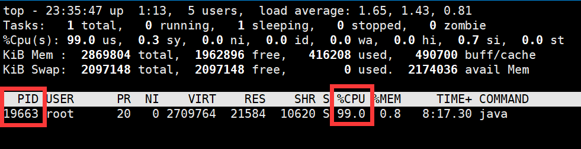
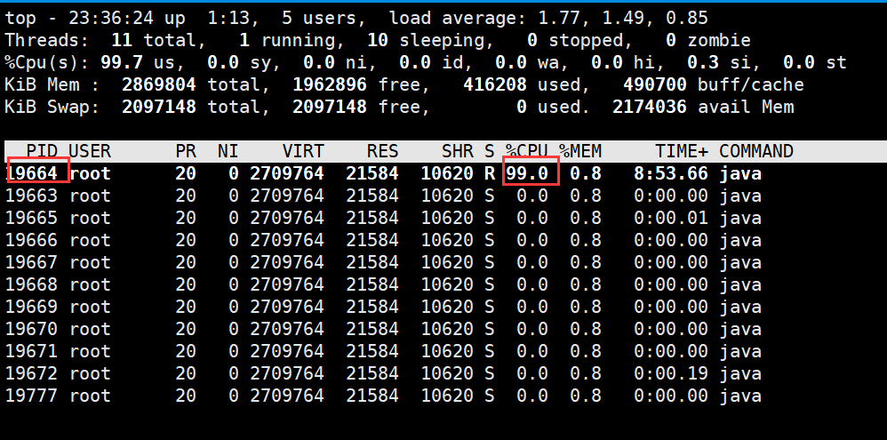
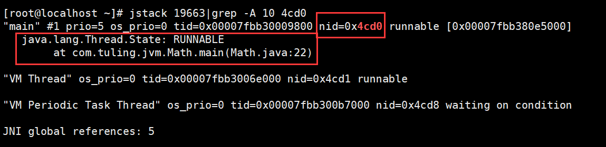

# CPU飙高问题如何排查

线上系统CPU飙高问题可以按以下步骤排查：

1. **确定问题进程**

首先，使用top命令找出占用CPU较高的Java进程：

```plain
top
```

找到对应的进程ID (PID)。



2. **获取线程信息**

使用top -Hp <PID>命令查看该进程内各个线程的CPU占用情况：

```plain
top -Hp <PID>
```

记录下占用CPU较高的线程ID。



3. **转换线程ID为十六进制**

使用printf命令将线程ID 19664 转换为十六进制，结果为 0x4cd0：

```java
printf "%x\n" <线程ID>
```

4. **获取线程堆栈**

使用jstack命令获取进程的线程堆栈信息：

```java
# 得到线程堆栈信息中 4cd0 这个线程所在行的后面10行，从堆栈中可以发现导致cpu飙高的调用方法
jstack 19663|grep -A 10 4cd0
```



5. **代码分析**

根据堆栈信息，查看相关的Java代码。以下是一些可能导致CPU飙高的代码示例：

示例1：死循环

```java
while (true) {  
    // 耗CPU的操作  
}
```

示例2：频繁的垃圾回收

```java
List<Object> list = new ArrayList<>();  
while (true) {  
    list.add(new Object());  
    if (list.size() > 10000) {  
        list.clear();  
    }  
}
```

示例3：不当的线程同步

```java
public class BadSynchronization {  
    private static final Object lock1 = new Object();  
    private static final Object lock2 = new Object();  

    public static void method1() {  
        synchronized (lock1) {  
            synchronized (lock2) {  
                // 操作  
            }  
        }  
    }  

    public static void method2() {  
        synchronized (lock2) {  
            synchronized (lock1) {  
                // 操作  
            }  
        }  
    }  
}
```

示例4：密集的计算操作

```java
public long fibonacci(long n) {  
if (n <= 1) return n;  
return fibonacci(n-1) + fibonacci(n-2);  
}  

// 调用  
long result = fibonacci(50);
```

6. **使用性能分析工具**

可以使用诸如Arthas、JProfile等Java性能分析工具进行更深入的分析。

7. **查看GC日志**

如果怀疑是GC问题，可以查看GC日志：

```java
jstat -gcutil <PID> 1000
```

8. **检查系统资源**

使用vmstat、iostat等命令检查系统资源使用情况，排除是否为系统资源问题。

通过以上步骤，我们可以定位到导致CPU飙高的具体代码位置，然后进行相应的优化。常见的优化方法包括：优化算法、增加缓存、调整线程池参数、优化数据库查询等。在进行优化时，要注意进行充分的测试，以确保修改不会引入新的问题。
