# IDEA 天花板小技巧

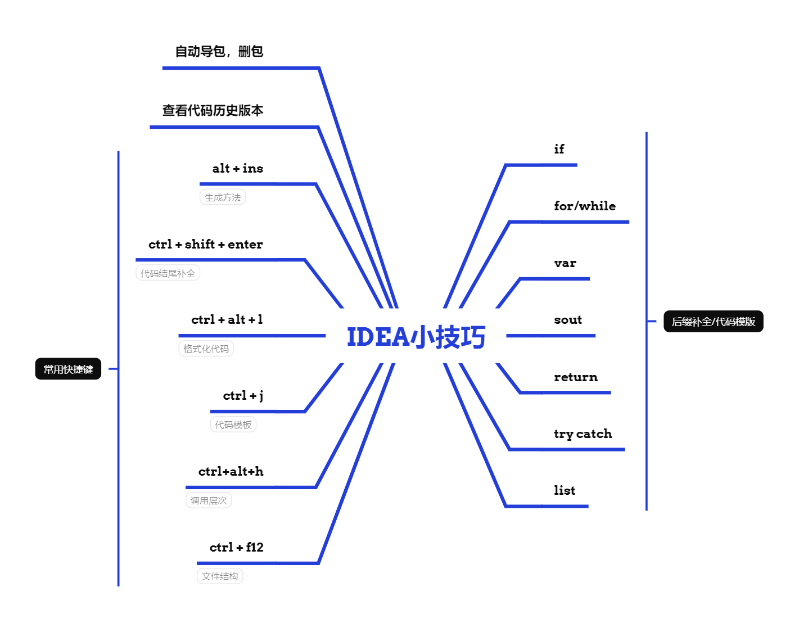

IDEA 作为Java开发工具的主流工具，几乎以碾压之势把其他对手甩在了身后，主要原因还是归功于：好用；虽然有点重，但依旧瑕不掩瑜，内置了非常多的功能，大大提高了日常的开发效率。

### **1.查看代码历史版本**

---

鼠标在需要查看的java类 右键 找到Local History >> Show History 点开即可看到历史版本，常用于自己忘记代码改了哪些内容 或需要恢复至某个版本 (注意 只能看近期修改 太久了也是看不到的)

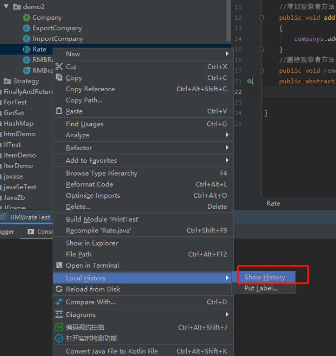

### **2.idea设置成eclipse的快捷键**

---

这对eclipse转idea的开发人员来说 非常友好，这样不需要记两套快捷键

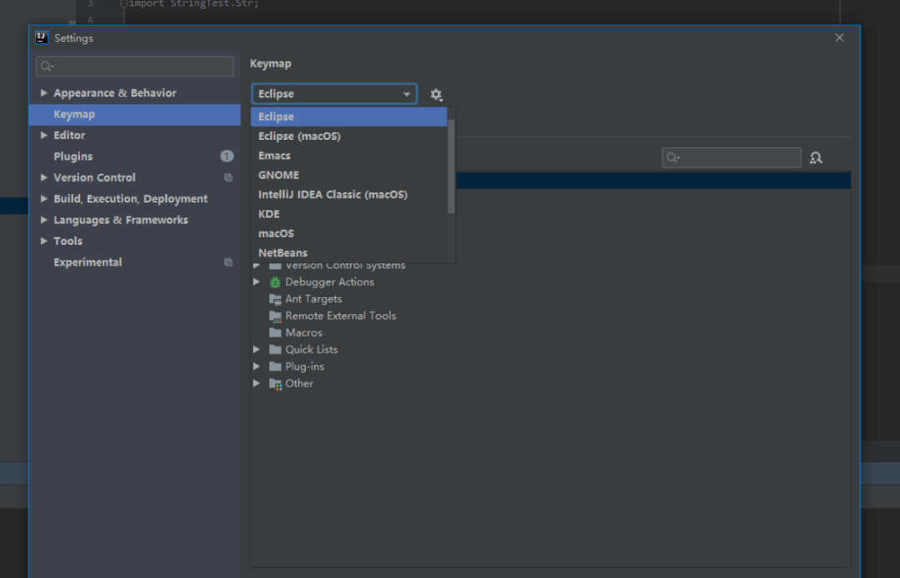

### **3.设置提示词忽略大小写**

---

把这个勾去掉，（有的idea版本是选择选项 选择none即可），例如String 输入string 、String 都可以提示

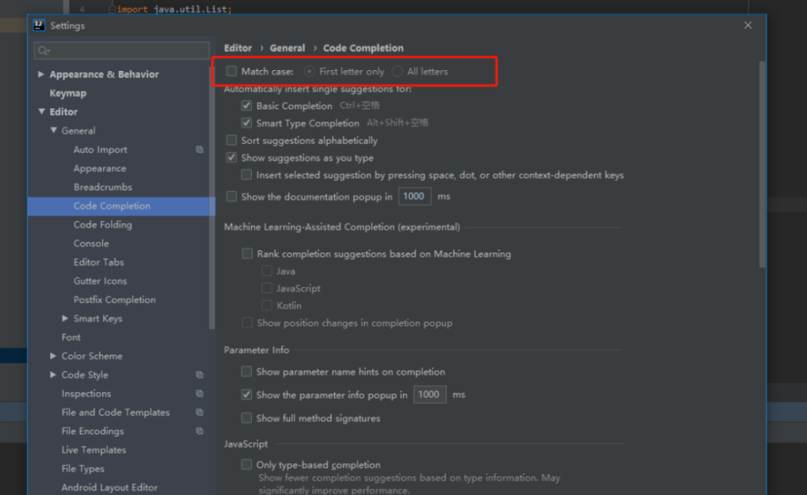

### **4.设置多行tab**

---

idea默认是选择显示单行的，我们把这个去掉，就可以显示多行tab了，在打开tab过多时的场景非常方便！

**4.1 tab过多会自动关闭**

settings - editor - General - Editor tabs - tab limit 数值设大就好了

### **5.快速匹配方法的大括号位置**

---

ctrl+[    或者   ctrl+] 可以快速跳转到方法大括号的起止位置，配合方法分隔符使用，不怕找不到方法在哪儿分割了

### **6.代码结尾补全**

---

例如一行代码补全分号，或者是if(xxx) 补全大括号，按ctrl+shift+enter 无需切换鼠标光标，大幅度提升了编码效率

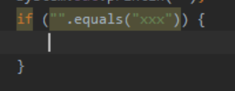

### **7.模糊搜索方法**

---

例如People类里面的test方法，按ctrl+shift+alt+n 输入Peo.te 就可以查到该方法了，如果觉得这个快捷键难记 也可以按ctrl+shift+r （查找某个文件名的快捷键 下图中的Files）,再手动选择Symbols

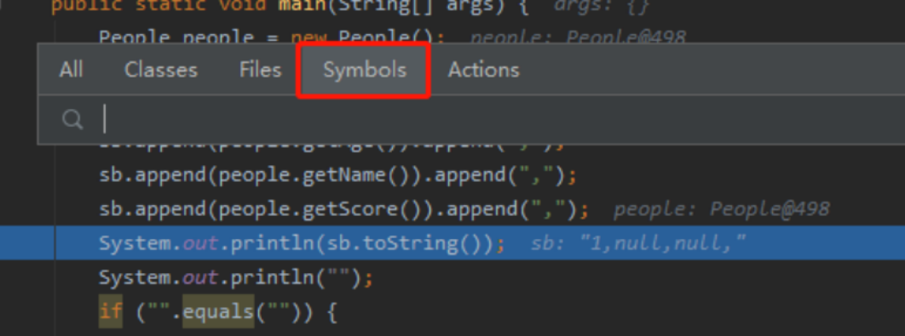

### **8.查看方法在哪里被调用**

---

ctrl+alt+h 可以清楚看到方法在哪些地方被调用

### **9.自动导包、自动移除没用的包（****建议开启自动导入，关闭自动移除****）**

---

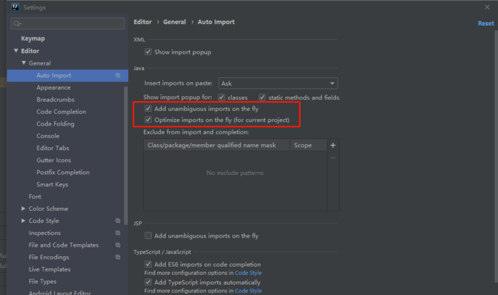

**9.1 手动导包 :alt+enter 手动移除未使用包: crtl+alt+o**

### **10.微服务项目中将不同项目添加到同一个启动窗口**

---

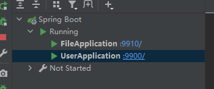

步骤：View ——>Tool Windows ——> services ——>add services

### **11.快捷键切换回上一个点开的tab**

---

当我们打开了多个tab的时候 ， 想要快速回到上一个点击的tab中 有的时候肉眼很难找

我们可以用快捷键 alt + ← 键 (eclipse版快捷键 idea默认快捷键需要自测) ，有的时候我们在后面tab编辑了内容 按一次可能不够 需要再多按几次 ,相应的 alt + → 切换到下一个点击的tab

> 常见应用场景：debug发生类跳转时 、利用快捷键在其它类中创建方法时
>

即使两个tab不相邻 也可以切换回去

### **12.代码调用链路图插件**

---

**SequenceDiagram 插件**

这其实是本文第13点的上位替代方案，idea自带的快捷键查看代码调用，只是以菜单形式展示，不太直观，如果是自己写的代码或比较规范的代码，那用自带的也就无所谓，如果是比较复杂的源码或不规范的代码，那使用 SequenceDiagram 会直观特别多。

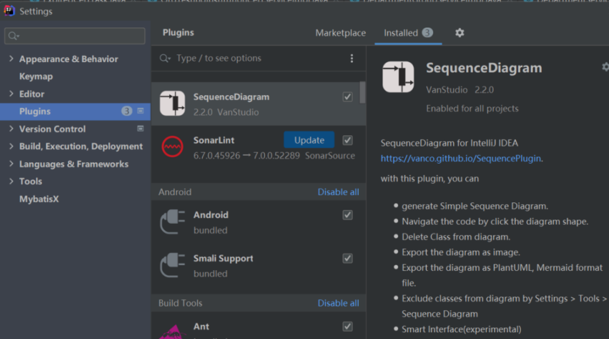

在要查看的java文件鼠标右键，点击 Sequence Diagram

效果示例：

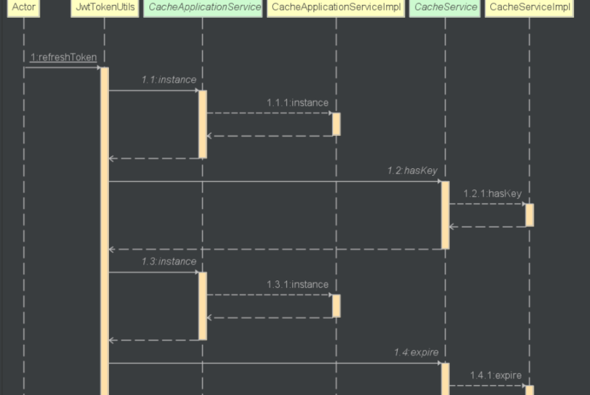

### **13.获取当前线程dump**

---

在断点调试的时候，我们可以通过点击下图红色箭头指向的相机图标，获取当前线程的dump信息。

这个功能有什么用呢？我们可以通过线程名，分析当前是哪个线程执行的，在多线程环境下对代码运行分析起到辅助作用。

比如下图1， run()方法是通过main主线程执行的，只是方法调用，并没有启动多线程（这是我们熟知结论的实践证明）

当我们把run方法改成start()方法时，可以看到是线程thread0执行的。

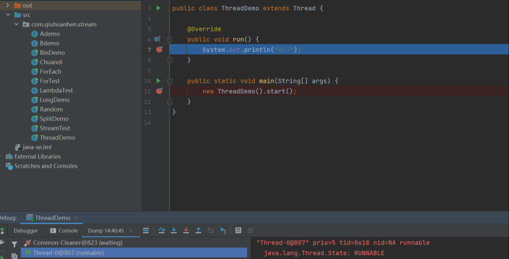

### **14.代码模板(代码快捷键)（调用****ctrl + j 唤醒****）**

---

例如 : eclipse 中的syso是打印控制台输出 ，但是idea默认是sout , 如果非要改成syso 可以在Postfix Completion里面设置，类似的 fori等都是在里面设置

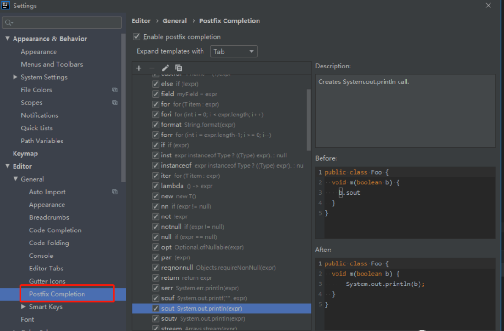
