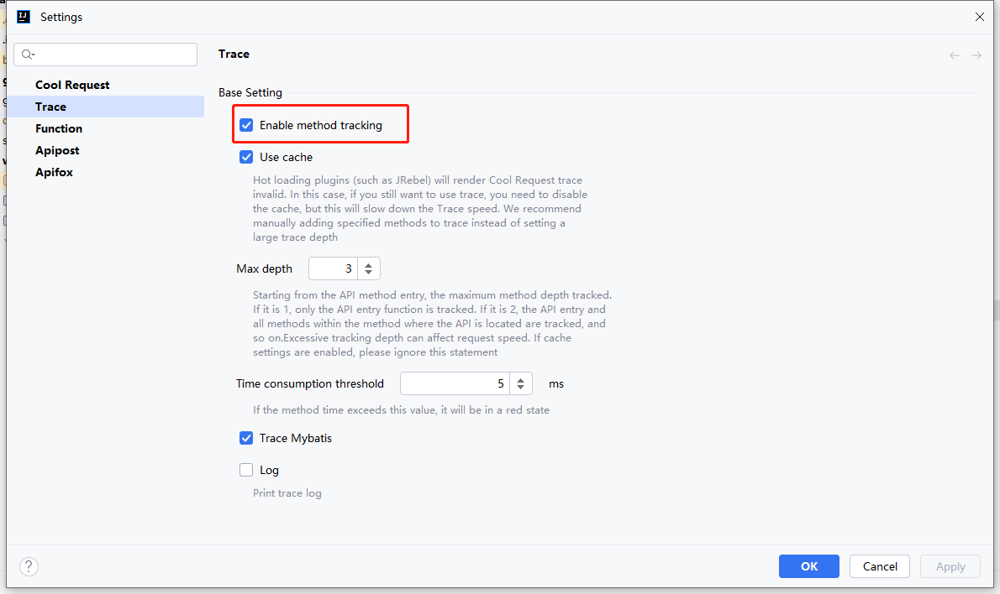
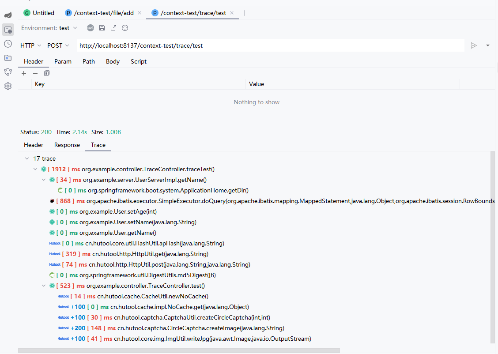
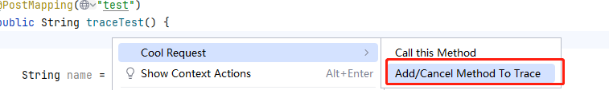
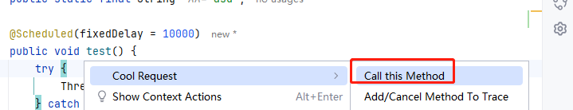
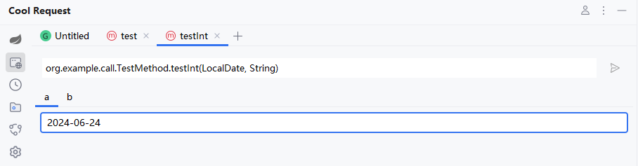
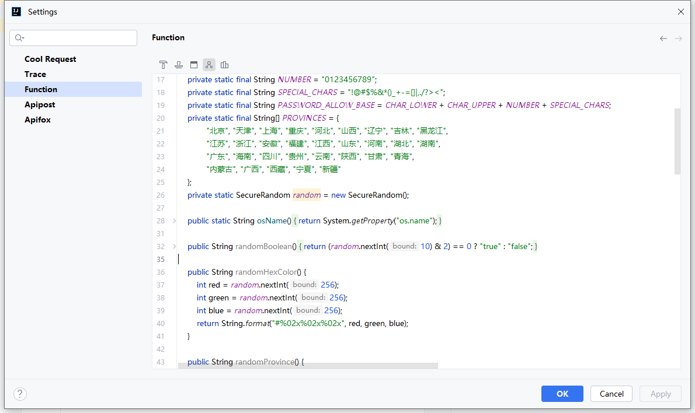
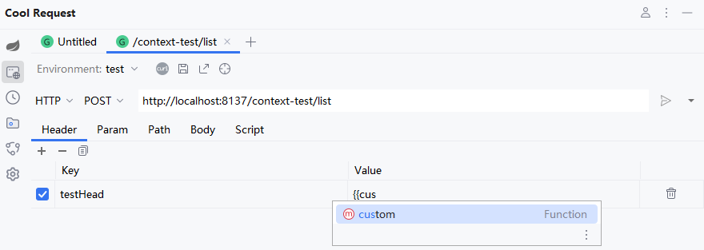
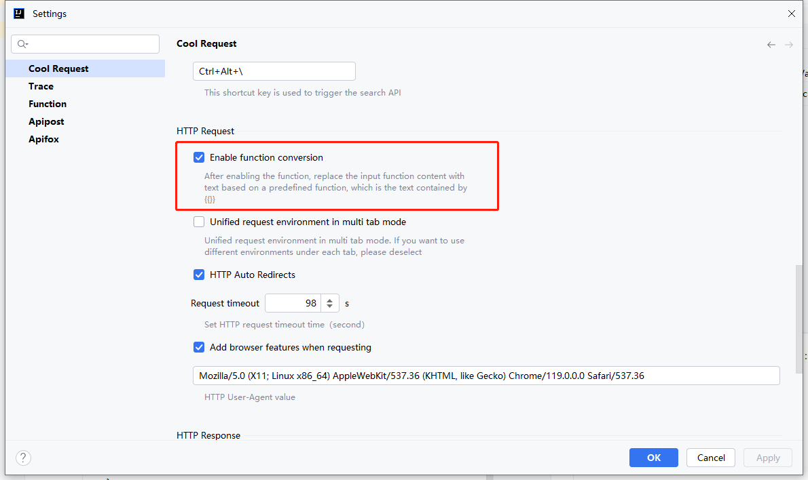

# 一行代码统计方法耗时

# 什么是Cool Request

Cool Request是一款基于 IntelliJ IDEA 的插件，旨在简化 Spring MVC(Boot) 项目中 API调试调用，提供了强大的参数推测能力、方法耗时追踪、运行时反射调用等能力

# 特色功能

## 统计方法耗时

### 开启耗时追踪

Cool Request默认关闭方法耗时追踪，如果开启后，会影响第一次发起API时的速度，如果不需要耗时追踪，可点击关闭  
 

### 发起追踪

当正常发起HTTP请求时，Cool Request将分析一次目标方法，根据设置的最大深度，尽可能多的追踪方法，这需要花费一些时间，且视所设置最大深度为定。

自动分析时，如果遇到了对interface形式的调用，则无法分析impl实现的方法，不会统计该方法，解决办法是改用注入impl的类，而不是service，或者使用`添加/取消自定义`方法手动添加impl方法。



### 添加/取消自定义方法

如果自动分析无法满足需求，可在任意方法体内右击，选择`Cool Request -> Add/Cancel Method To Trace`，添加/取消目标方法。



### 失效情况

有些原因可能会导致跟踪失效

1. 当Controller内部抛出异常时，Trace将失效，请确保链路中无异常。
2. 非SpringBoot项目
3. 使用了jrebel启动(理论支持，但如果失效，可正常启动重新尝试)

## 调用任意方法

Cool Request支持在SpringBoot运行时调用任意容器内实例的方法、同时也包括静态方法。

### 使用教程

在想要调用的方法体内右击，选择CoolRequest->Call this Method



接着点击运行按钮即可。


当然，Cool Request支持大量常见的参数传递



 

## 自定义函数

Cool Request拥有最强大得函数支持系统，当HTTP参数想要使用动态参数时，可根据自己需求，编写自定义函数。

函数可使用在任意HTTP参数中，包括请求头、URL参数、Path变量、请求体中。



例如想要增加一个自定义函数，可编写以下代码。

```java
public String custom(){
    return "custom";
}
```

在任意HTTP参数值中，通过`{{函数名}}`来引用此函数。



### 关闭函数转换

如果想关闭函数转换，可以设置中禁用



## 发起反射请求

### 什么反射请求

发射请求可绕过系统中的拦截器，在开发时，可直接使请求进入到Controller方法。

普通HTTP请求的流程如下：

1. 构造HTTP参数
2. 发起HTTP请求
3. 进入Web容器
4. 进入过滤器
5. 进入拦截器
6. 进入Controller

而反射请求可以跳过其中的第3、第4步骤，而第5步是可选的，反射的流程如下：

1. 构造HTTP参数
2. 发起HTTP请求
3. 进入拦截器（可选择是否应用拦截器）
4. 进入Controller

进入参数配置界面，在左侧下拉框选中如下所示：

 

点击右侧  按钮即可发起反射请求。

## Spring网关

Cool Request在网关程序启动后，会自动提取网关配置的路径，并添加到环境变量中，用户只需要根据实际修改配置即可。

例如有以下代码：

```java
@Configuration
public class Config {
    @Bean
    public RouteLocator customRouteLocator(RouteLocatorBuilder builder) {
        return builder.routes()
                .route("apiroute", r -> r.path("/api/**")
                        .filters(f -> f.stripPrefix(1))
                        .uri("http://localhost:8080"))
                .build();
    }
}
```

启动成功点击环境设置，可以发现会有一个名为`apiroute`的环境。

**官网地址：**[**https://coolrequest.dev/docs/feat/spring_gateway/**](https://coolrequest.dev/docs/feat/spring_gateway/)
