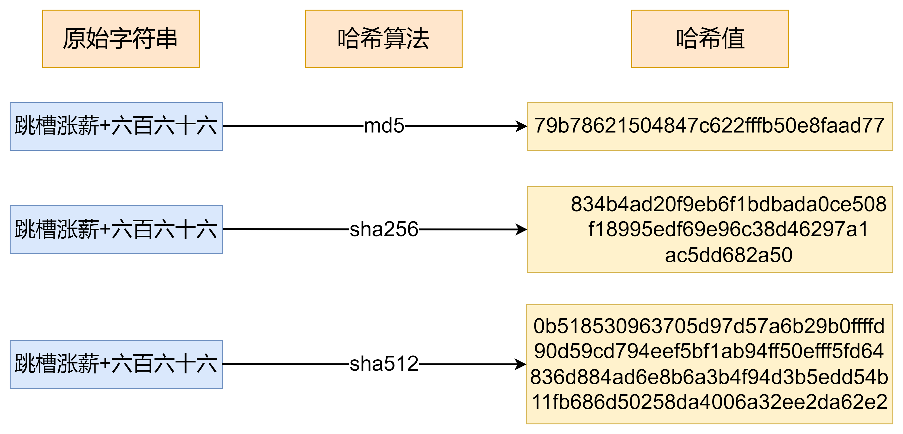

# 为什么QQ忘记密码只能重置，不能直接告诉你原密码？腾讯面试官揭秘：你的密码连系统都不知道

#### **一个让千万网友抓狂的瞬间**
>
> “密码错误！”  
第5次输入生日+纪念日+手机尾号的排列组合后，你瘫在椅子上哀嚎：“QQ啊QQ，连我自己都不记得密码了，你为什么不直接告诉我？！”
>
> 最气的是新设置的密码说重复了。
>

**停！这个问题，连腾讯面试官都在考！**  
最近一位小伙伴爆料，腾讯面试时被问：“**为什么QQ忘记密码只能重置，不能直接告诉你原密码？**”  小伙伴脑子嗡的一声（内心OS：这题像问我为啥呼吸要喘气？？）


**答案出乎意料：****因为QQ自己也不知道你的密码！**  
（是不是感觉大脑突然宕机？别急，往下看！）

### **1. 你的密码，在服务器眼里竟是“乱码”？**

#### **1.1 黑客电影里的“密码库”都是骗人的！**

电影里黑客轻松盗取“密码库”的场景，在现实中根本不存在！  
**真相是：腾讯服务器里，压根没存你的真实密码！**  
当你设置密码“1314520”时，系统会把它丢进一个**“魔法搅拌机”**（哈希算法），出来就变成：  
`4f3d7a2e1c...`（64位乱码）  
**哪怕马化腾本人登录QQ，看到的也只是这串“火星文”！**



#### **1.2 为什么非要搞这么麻烦？**

想象一下：如果腾讯存了你的明文密码——  
✅ 程序员小哥可能偷偷看你密码  
✅ 黑客攻破服务器就能盗走所有账号  
✅ 甚至你的“1314520”会在黑市被反复倒卖！

> **中国最大程序员社区CSDN泄露事件**
>
> 2011年600万用户密码被公开，只因用明文存密码（就像把日记本摊开在广场）。
>
> 有人十年后还在收到勒索邮件：“我知道你2011年的密码是123456...”
>

**而“魔法搅拌机”的绝妙之处在于：**  
搅碎的“密码汁”无法还原！**（哈希不可逆）**  
从此，全世界只有你自己知道“1314520”！

### **2. 加盐！给你的密码撒一把“秘密调料”**

#### **2.1 当全中国人都在用“123456”...**

你以为“密码搅拌机”很安全？太天真！  
黑客早就整理了《全球常用密码哈希值词典》：

+ 123456 → a1b2c3d4...
+ password → x9y8z7...  
**只要对照词典，分分钟破解你的“懒人密码”！**

> **某婚恋网泄露事件**
>
> 某知名婚恋网的工程师自信满满："我们用MD5加密，绝对安全！"
>
> 结果黑客掏出**彩虹表（密码破解词典）**，10分钟破解60%用户密码！
>
> **血腥现场：**
>
> **✅****痴情男给女神充的10万金币被盗**
>
> **✅****骗子用真实账号编造"杀猪盘"**
>
> **✅****有人发现"自己"同时和8个人网恋**
>

#### **2.2 腾讯的绝招：撒一把“盐”**

工程师们灵机一动：**在搅拌密码前，随机撒一把“盐”（Salt）！**  
比如你的密码“1314520”+盐“%t7#k” → 搅拌后变成`7g8h9i...`  
**从此：**  
✅ 同样的密码，每次“加盐”后结果完全不同  
✅ 黑客的密码词典彻底失效！  
（这就好比全国人民都吃西红柿炒蛋，但你家偏要加榴莲——神仙也猜不出味道！）


### **SHA-256 + Salt代码示例**

```java
String password = "123456";  
String salt = "1abd1c";  
// 创建SHA-256摘要对象  
MessageDigest messageDigest = MessageDigest.getInstance("SHA-256");  
messageDigest.update((password + salt).getBytes());  
// 计算哈希值  
byte[] result = messageDigest.digest();  
// 将哈希值转换为十六进制字符串  
String hexString = new HexBinaryAdapter().marshal(result);  
System.out.println("Original String: " + password);  
System.out.println("SHA-256 Hash: " + hexString.toLowerCase());
```

### **3.为什么找回密码比登天还难？**

#### **3.1 你眼中的密码 VS 系统眼中的密码**

| **你输入的密码** | **系统眼中的模样** |
| --- | --- |
| `1314520` | `4f3d7a2e1c...` |
| `5201314` | `8b9c0d3e2f...` |

**当你忘记密码时：**  
❌ 系统无法把`4f3d7a2e1c...`变回“1314520” 
✅ 只能请你重新设置密码，再搅拌一次存进去！

#### **3.2 终极安全逻辑**
>
> “**最好的保密，就是连自己都别相信！**”—— 腾讯安全工程师的至理名言
>

你的密码就像**一份独一无二的记忆**：  
✅ 系统只验证，不窥探  
✅ 工程师无法查看  
✅ 黑客即便盗库也束手无策  
**这才是真正的“绝对安全”！**

### **下次忘记密码时，请骄傲地重置吧！**

**因为：**  
🔐 你的密码是腾讯都无法破解的“量子态”  
🔐 每一次重置，都在为全球网络安全做贡献  
🔐 这串“1314520”，是只属于你的数字浪漫

**你现在还敢用“生日+姓名缩写”当密码吗？**

> **高校教务系统「集体裸考」**
>
> 某985大学，5万学生密码统一设为学号+生日
>
> 黑客用「撞库攻击」一夜盗空选课系统：
>
> ✅ 学霸被篡改成《母猪产后护理》课
>
> ✅ 富二代收到"不转钱就挂科"邮件
>
> ✅ 校长信箱被塞满《重修爱情》小黄文
>
> 教授含泪补刀：这届学生用密码的水平，还不如ATM机密码「666666」安全！
>
