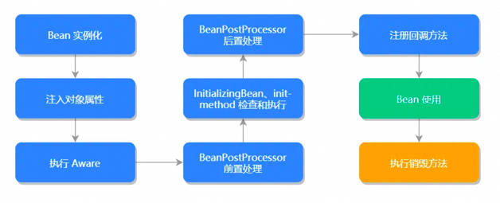
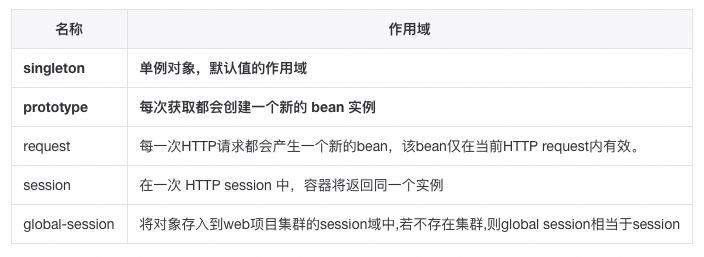
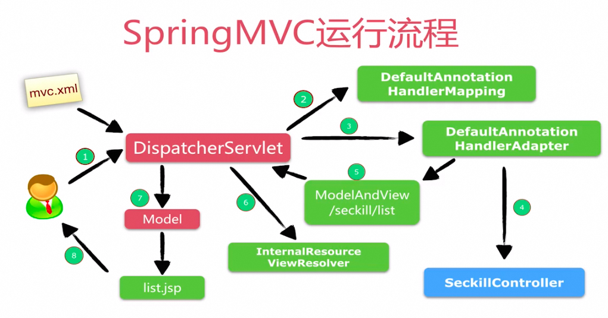

# Spring篇

设计思想&Beans

**1、IOC 控制反转**

IoC（Inverse of Control:控制反转）是⼀种设计思想，就是将原本在程序中⼿动创建对象的控制权，交由Spring框架来管理。IoC 在其他语⾔中也有应⽤，并⾮ Spring 特有。

IoC 容器是 Spring⽤来实现 IoC 的载体， IoC 容器实际上就是个Map（key，value）,Map 中存放的是各种对象。将对象之间的相互依赖关系交给 IoC 容器来管理，并由 IoC 容器完成对象的注⼊。这样可以很⼤程度上简化应⽤的开发，把应⽤从复杂的依赖关系中解放出来。IoC 容器就像是⼀个⼯⼚⼀样，当我们需要创建⼀个对象的时候，只需要配置好配置⽂件/注解即可，完全不⽤考虑对象是如何被创建出来的。

**DI 依赖注入**

DI:（Dependancy Injection：依赖注入)站在容器的角度，将对象创建依赖的其他对象注入到对象中。

**2、AOP 动态代理**

AOP(Aspect-Oriented Programming:⾯向切⾯编程)能够将那些与业务⽆关，却为业务模块所共同调⽤的逻辑或责任（例如事务处理、⽇志管理、权限控制等）封装起来，便于减少系统的重复代码，降低模块间的耦合度，并有利于未来的可拓展性和可维护性。

Spring AOP就是基于动态代理的，如果要代理的对象，实现了某个接⼝，那么Spring AOP会使⽤JDKProxy，去创建代理对象，⽽对于没有实现接⼝的对象，就⽆法使⽤ JDK Proxy 去进⾏代理了，这时候Spring AOP会使⽤基于asm框架字节流的Cglib动态代理 ，这时候Spring AOP会使⽤ Cglib ⽣成⼀个被代理对象的⼦类来作为代理。

**3、Bean生命周期**

**单例对象：** singleton

总结：单例对象的生命周期和容器相同

**多例对象：** prototype

出生：使用对象时spring框架为我们创建

活着：对象只要是在使用过程中就一直活着

死亡：当对象长时间不用且没有其它对象引用时，由java的垃圾回收机制回收



IOC容器初始化加载Bean流程：

```plain
@Overridepublic void refresh() throws BeansException, IllegalStateException { synchronized (this.startupShutdownMonitor) {  // 第一步:刷新前的预处理   prepareRefresh();  //第二步: 获取BeanFactory并注册到 BeanDefitionRegistry  ConfigurableListableBeanFactory beanFactory = obtainFreshBeanFactory();  // 第三步:加载BeanFactory的预准备工作(BeanFactory进行一些设置，比如context的类加载器等)  prepareBeanFactory(beanFactory);  try {    // 第四步:完成BeanFactory准备工作后的前置处理工作     postProcessBeanFactory(beanFactory);    // 第五步:实例化BeanFactoryPostProcessor接口的Bean     invokeBeanFactoryPostProcessors(beanFactory);    // 第六步:注册BeanPostProcessor后置处理器，在创建bean的后执行     registerBeanPostProcessors(beanFactory);    // 第七步:初始化MessageSource组件(做国际化功能;消息绑定，消息解析);     initMessageSource();    // 第八步:注册初始化事件派发器     initApplicationEventMulticaster();    // 第九步:子类重写这个方法，在容器刷新的时候可以自定义逻辑     onRefresh();    // 第十步:注册应用的监听器。就是注册实现了ApplicationListener接口的监听器    registerListeners();    //第十一步:初始化所有剩下的非懒加载的单例bean 初始化创建非懒加载方式的单例Bean实例(未设置属性)    finishBeanFactoryInitialization(beanFactory);    //第十二步: 完成context的刷新。主要是调用LifecycleProcessor的onRefresh()方法，完成创建    finishRefresh();    }  ……}


总结：
```

**四个阶段**

+ 实例化 Instantiation
+ 属性赋值 Populate
+ 初始化 Initialization
+ 销毁 Destruction

**多个扩展点**

+ 影响多个Bean
  + BeanPostProcessor
  + InstantiationAwareBeanPostProcessor
+ 影响单个Bean
  + Aware

**完整流程**

1. 实例化一个Bean－－也就是我们常说的**new**；
2. 按照Spring上下文对实例化的Bean进行配置－－**也就是IOC注入**；
3. 如果这个Bean已经实现了BeanNameAware接口，会调用它实现的setBeanName(String)方法，也就是根据就是Spring配置文件中**Bean的id和name进行传递；**
4. 如果这个Bean已经实现了BeanFactoryAware接口，会调用它实现setBeanFactory(BeanFactory)也就是Spring配置文件配置的**Spring工厂自身进行传递**；
5. 如果这个Bean已经实现了ApplicationContextAware接口，会调用setApplicationContext(ApplicationContext)方法，和4传递的信息一样但是因为ApplicationContext是BeanFactory的子接口，所以**更加灵活；**
6. 如果这个Bean关联了BeanPostProcessor接口，将会调用postProcessBeforeInitialization()方法，BeanPostProcessor经常被用作是Bean内容的更改，由于这个是在Bean初始化结束时调用那个的方法，也可以被应用于**内存或缓存技术；**
7. 如果Bean在Spring配置文件中配置了init-method属性会自动调用其配置的初始化方法。
8. 如果这个Bean关联了BeanPostProcessor接口，将会调用postProcessAfterInitialization()，**打印日志或者三级缓存技术里面的bean升级；**
9. 以上工作完成以后就可以应用这个Bean了，那这个Bean是一个Singleton的，所以一般情况下我们调用同一个id的Bean会是在内容地址相同的实例，当然在Spring配置文件中也可以配置非Singleton，这里我们不做赘述。
10. 当Bean不再需要时，会经过清理阶段，如果Bean实现了DisposableBean这个接口，或者根据spring配置的destroy-method属性，调用实现的destroy()方法

**4、Bean作用域**



默认作用域是singleton，多个线程访问同一个bean时会存在线程不安全问题

**保障线程安全方法：**

1. 在Bean对象中尽量避免定义可变的成员变量（不太现实）；
2. 在类中定义⼀个ThreadLocal成员变量，将需要的可变成员变量保存在 ThreadLocal 中；

**ThreadLocal：**

每个线程中都有一个自己的ThreadLocalMap类对象，可以将线程自己的对象保持到其中，各管各的，线程可以正确的访问到自己的对象。

将一个共用的ThreadLocal静态实例作为key，将不同对象的引用保存到不同线程的ThreadLocalMap中，然后**在线程执行的各处通过这个静态ThreadLocal实例的get()方法取得自己线程保存的那个对象**，避免了将这个对象作为参数传递的麻烦。

**5、循环依赖**

循环依赖其实就是循环引用，也就是两个或者两个以上的 Bean 互相持有对方，最终形成闭环。比如A 依赖于B，B又依赖于A

Spring中循环依赖场景有:

+ prototype 原型 bean循环依赖
+ 构造器的循环依赖（构造器注入）
+ Field 属性的循环依赖（set注入）其中，构造器的循环依赖问题无法解决，在解决属性循环依赖时，可以使用懒加载，spring采用的是提前暴露对象的方法。

**懒加载@Lazy解决循环依赖问题**

Spring 启动的时候会把所有bean信息(包括XML和注解)解析转化成Spring能够识别的BeanDefinition并存到Hashmap里供下面的初始化时用，然后对每个 BeanDefinition 进行处理。普通 Bean 的初始化是在容器启动初始化阶段执行的，而被lazy-init=true修饰的 bean 则是在从容器里第一次进行**context.getBean() 时进行触发**。

**三级缓存解决循环依赖问题**


1. Spring容器初始化ClassA通过构造器初始化对象后提前暴露到Spring容器中的singletonFactorys（三级缓存中）。
2. ClassA调用setClassB方法，Spring首先尝试从容器中获取ClassB，此时ClassB不存在Spring 容器中。
3. Spring容器初始化ClassB，ClasssB首先将自己暴露在三级缓存中，然后从Spring容器一级、二级、三级缓存中一次中获取ClassA 。
4. 获取到ClassA后将自己实例化放入单例池中，实例 ClassA通过Spring容器获取到ClassB，完成了自己对象初始化操作。
5. 这样ClassA和ClassB都完成了对象初始化操作，从而解决了循环依赖问题。

Spring注解

**1、@SpringBoot**

**声明bean的注解**

**@Component**通⽤的注解，可标注任意类为 Spring 组件

**@Service**在业务逻辑层使用（service层）

**@Repository**在数据访问层使用（dao层）

**@Controller**在展现层使用，控制器的声明（controller层）

**注入bean的注解**

**@Autowired：**默认按照类型来装配注入，**@Qualifier**：可以改成名称

**@Resource：**默认按照名称来装配注入，JDK的注解，新版本已经弃用

**@Autowired注解原理**

@Autowired的使用简化了我们的开发，

实现 AutowiredAnnotationBeanPostProcessor 类，该类实现了 Spring 框架的一些扩展接口。

实现 BeanFactoryAware 接口使其内部持有了 BeanFactory（可轻松的获取需要依赖的的 Bean）。

实现 MergedBeanDefinitionPostProcessor 接口，实例化Bean 前获取到 里面的 @Autowired 信息并缓存下来；

实现 postProcessPropertyValues 接口， 实例化Bean 后从缓存取出注解信息，通过反射将依赖对象设置到 Bean 属性里面。

**@SpringBootApplication**

```plain
@SpringBootApplicationpublic class JpaApplication {    public static void main(String[] args) {        SpringApplication.run(JpaApplication.class, args);    }}
@SpringBootApplication注解等同于下面三个注解：
```

+ **@SpringBootConfiguration：** 底层是**Configuration**注解，说白了就是支持**JavaConfig**的方式来进行配置
+ **@EnableAutoConfiguration：**开启**自动配置**功能
+ **@ComponentScan：**就是**扫描**注解，默认是扫描**当前类下**的package

其中@EnableAutoConfiguration是关键(启用自动配置)，内部实际上就去加载META-INF/spring.factories文件的信息，然后筛选出以EnableAutoConfiguration为key的数据，加载到IOC容器中，实现自动配置功能！

它主要加载了@SpringBootApplication注解主配置类，这个@SpringBootApplication注解主配置类里边最主要的功能就是SpringBoot开启了一个@EnableAutoConfiguration注解的自动配置功能。

**@EnableAutoConfiguration作用：**

它主要利用了一个

EnableAutoConfigurationImportSelector选择器给Spring容器中来导入一些组件。

```plain
@Import(EnableAutoConfigurationImportSelector.class)public @interface EnableAutoConfiguration
```

**2、@SpringMVC**

```plain
@Controller 声明该类为SpringMVC中的Controller@RequestMapping 用于映射Web请求@ResponseBody 支持将返回值放在response内，而不是一个页面，通常用户返回json数据@RequestBody 允许request的参数在request体中，而不是在直接连接在地址后面。@PathVariable 用于接收路径参数@RequestMapping("/hello/{name}")申明的路径，将注解放在参数中前，即可获取该值，通常作为Restful的接口实现方法。
```

**SpringMVC原理**



1. 客户端（浏览器）发送请求，直接请求到 DispatcherServlet 。
2. DispatcherServlet 根据请求信息调⽤ HandlerMapping ，解析请求对应的 Handler 。
3. 解析到对应的 Handler （也就是 Controller 控制器）后，开始由HandlerAdapter 适配器处理。
4. HandlerAdapter 会根据 Handler 来调⽤真正的处理器开处理请求，并处理相应的业务逻辑。
5. 处理器处理完业务后，会返回⼀个 ModelAndView 对象， Model 是返回的数据对象
6. ViewResolver 会根据逻辑 View 查找实际的 View 。
7. DispaterServlet 把返回的 Model 传给 View （视图渲染）。
8. 把 View 返回给请求者（浏览器）

**3、@SpringMybatis**

```plain
@Insert ：插入sql ,和xml insert sql语法完全一样@Select ：查询sql, 和xml select sql语法完全一样@Update ：更新sql, 和xml update sql语法完全一样@Delete ：删除sql, 和xml delete sql语法完全一样@Param ：入参@Results ：设置结果集合@Result ：结果@ResultMap ：引用结果集合@SelectKey ：获取最新插入id 
mybatis如何防止sql注入？
```

简单的说就是#{}是经过预编译的，是安全的，**

**{}是未经过预编译的，仅仅是取变量的值，是非安全的，存在SQL注入。在编写mybatis的映射语句时，尽量采用**`“#{xxx}”`**这样的格式。如果需要实现动态传入表名、列名，还需要做如下修改：添加属性**statementType="STATEMENT"**，同时sql里的属有变量取值都改成****{}是未经过预编译的，仅仅是取变量的值，是非安全的，存在SQL注入。在编写mybatis的映射语句时，尽量采用**`“#{xxx}”`**这样的格式。如果需要实现动态传入表名、列名，还需要做如下修改：添加属性**statementType="STATEMENT"**，同时sql里的属有变量取值都改成**`{xxxx}`**

**Mybatis和Hibernate的区别**

**Hibernate 框架：**

**Hibernate**是一个开放源代码的对象关系映射框架,它对JDBC进行了非常轻量级的对象封装,建立对象与数据库表的映射。是一个全自动的、完全面向对象的持久层框架。

**Mybatis框架：**

**Mybatis**是一个开源对象关系映射框架，原名：ibatis,2010年由谷歌接管以后更名。是一个半自动化的持久层框架。

**区别：**

**开发方面**

在项目开发过程当中，就速度而言：

hibernate开发中，sql语句已经被封装，直接可以使用，加快系统开发；

Mybatis 属于半自动化，sql需要手工完成，稍微繁琐；

但是，凡事都不是绝对的，如果对于庞大复杂的系统项目来说，复杂语句较多，hibernate 就不是好方案。

**sql优化方面**

Hibernate 自动生成sql,有些语句较为繁琐，会多消耗一些性能；

Mybatis 手动编写sql，可以避免不需要的查询，提高系统性能；

**对象管理比对**

Hibernate 是完整的对象-关系映射的框架，开发工程中，无需过多关注底层实现，只要去管理对象即可；

Mybatis 需要自行管理映射关系；

**4、@Transactional**

```plain
@EnableTransactionManagement @Transactional
```

注意事项：

①事务函数中不要处理耗时任务，会导致长期占有数据库连接。

②事务函数中不要处理无关业务，防止产生异常导致事务回滚。

**事务传播属性**

**1) REQUIRED（默认属性）** 如果存在一个事务，则支持当前事务。如果没有事务则开启一个新的事务。

1. MANDATORY 支持当前事务，如果当前没有事务，就抛出异常。
2. NEVER 以非事务方式执行，如果当前存在事务，则抛出异常。
3. NOT_SUPPORTED 以非事务方式执行操作，如果当前存在事务，就把当前事务挂起。
4. REQUIRES_NEW 新建事务，如果当前存在事务，把当前事务挂起。
5. SUPPORTS 支持当前事务，如果当前没有事务，就以非事务方式执行。

**7) NESTED** （**局部回滚**） 支持当前事务，新增Savepoint点，与当前事务同步提交或回滚。 **嵌套事务一个非常重要的概念就是内层事务依赖于外层事务。外层事务失败时，会回滚内层事务所做的动作。而内层事务操作失败并不会引起外层事务的回滚。**

Spring源码阅读

**1、Spring中的设计模式**

**单例设计模式 :** Spring 中的 Bean 默认都是单例的。

**⼯⼚设计模式 :** Spring使⽤⼯⼚模式通过 BeanFactory 、 ApplicationContext 创建bean 对象。

**代理设计模式 :** Spring AOP 功能的实现。

**观察者模式：** Spring 事件驱动模型就是观察者模式很经典的⼀个应⽤。

**适配器模式：**Spring AOP 的增强或通知(Advice)使⽤到了适配器模式、spring MVC 中也是⽤到了适配器模式适配 Controller 。
