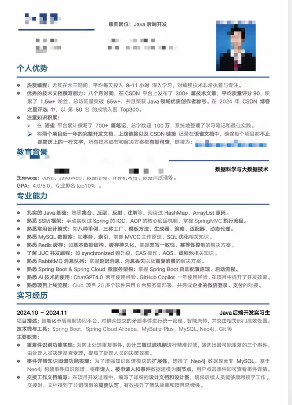
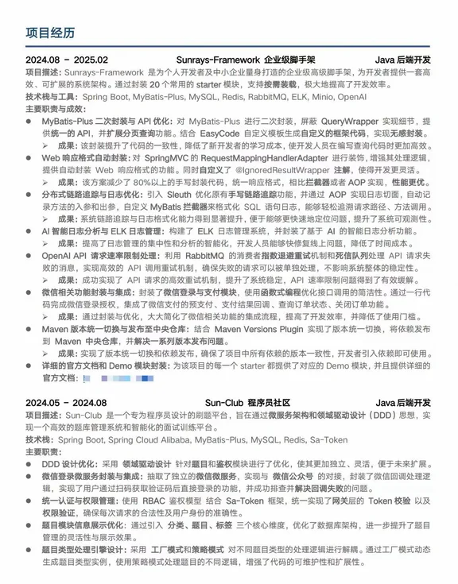

# Sun-Club程序员社区项目

上面这位学员简历的项目二没突出亮点和难点，投出去面试机会可能不多，经过和老师沟通后，着重优化了第二个项目《Sun-Club程序员社区》，优化如下：

### 项目名称：Sun-Club程序员社区

#### 项目描述

Sun-Club程序员社区是一个专为程序员设计的在线学习平台，目前注册用户规模10000+，日均活跃用户1000+。它利用微服务架构和领域驱动设计（DDD）思想，实现了一个高效的题库管理系统和智能化的面试训练平台。该项目集成了Spring Boot、Spring Cloud Alibaba等先进技术，提供了统一认证、权限管理以及动态题目处理等核心功能，旨在通过优化学习资源和训练流程，提升程序员的技能和面试准备效率。

#### 技术栈与工具

Spring Boot, Spring Cloud Alibaba, MyBatis-Plus + MySQL + Redis + kafka + Sa-Token

#### 核心亮点

1. **高效的题库管理系统**
    - **技术架构**：采用Spring Boot, Spring Cloud Alibaba, MyBatis-Plus等技术栈，构建了一个高效的题库管理系统。
    - **领域驱动设计（DDD）**：通过领域驱动设计优化题目和鉴权模块，增强了系统的独立性和灵活性，便于未来扩展。
2. **智能化的面试训练平台**
    - **智能化训练**：实现一个智能化的面试训练平台，通过微服务架构和领域驱动设计（DDD）思想，提高了面试训练的效率和效果。
    - **微信登录集成**：微信登录微服务封装与集成，实现与微信公众号的对接，封装微信回调处理逻辑，提升用户登录便捷性。
3. **统一认证与权限管理**
    - **RBAC模型**：使用RBAC鉴权模型结合Sa-Token框架，统一实现了网关层的Token校验以及权限验证，确保每次请求的合法性及用户身份的准确性。
    - **数据库优化**：通过引入分类、题目、标签三个核心维度，优化了数据库架构，进一步提升了题目管理的灵活性与展示效果。
4. **题目类型处理引擎设计**
    - **工厂模式和策略模式**：采用工厂模式和策略模式对不同题目类型的处理逻辑进行解耦，增强了代码的可维护性和扩展性。
    - **动态题目生成**：通过工厂模式动态生成题目类型实例，使用策略模式处理题目的不同逻辑，提高了系统的灵活性。
5. **系统性能优化**
    - **复杂SQL优化**：结合业务场景优化复杂SQL，将查询时间从30秒级优化到1秒内，提高数据库访问效率。
    - **读写分离**：实现读写分离，利用多级缓存减少数据库访问压力，提升系统整体吞吐量。
6. **安全性设计**
    - **细粒度权限控制**：实现了基于RBAC的细粒度权限控制，确保系统的安全性。
    - **防刷限流机制**：设计防刷限流机制，有效防止恶意攻击，保障系统稳定运行。
    - **数据加密**：实现敏感数据加密存储和传输机制，保护用户数据安全。

#### 技术难点及解决方案

1. **文档处理性能优化：**
    - 设计基于MinIO的分布式文件存储方案，支持PB级文档存储
    - 实现文档断点续传和秒传功能，提升10倍传输效率
    - 引入文档预览服务，支持100+种格式在线预览
2. **数据和缓存一致性问题**
    - 解决方案：使用延迟双删和消息队列（如 Kafka）来解决数据一致性问题。此外，可以使用 Canal 监听 MySQL Binlog，再将数据库更新到消息队列中，再通过监听消息更新 Redis 缓存，以确保缓存与数据库的一致性。
3. **消息丢失/消息积压等问题**
    - 解决方案：对于消息丢失，可以通过网络问题、系统故障等原因的排查来解决。对于消息积压，通常是由于消息产生的速度超过了消费者的处理速度，可以通过增加消费者数量或优化处理逻辑来缓解。
4. **数据库性能问题**
    - 解决方案：优化 SQL 查询语句，添加合适的索引；可以使用读写分离、分库分表、分布式数据库等方案来解决数据库性能问题。
5. **热点帖子高并发请求问题**
    - 解决方案：对于高并发请求问题可以采用以下方案：
        1. 添加缓存：使用缓存来存储热点数据，减少对后端数据库的访问。
        2. 限流和降级：使用令牌桶或漏桶算法来限制单位时间内请求的数量；当检测到某个服务出现异常时，自动切断与该服务的连接，防止故障扩散。
        3. 异步处理：使用消息队列（如 RocketMQ、Kafka 等）来异步处理任务，缓解即时处理的压力。
        4. 数据库优化：可以使用读写分离、分库分表、分布式数据库等方案来解决。

**6 . 线程竞争和死锁**

    - 解决方案：避免过度的线程同步，减少锁竞争；检查并解决死锁问题，以提高程序执行效率

这样的包装既突出了技术深度，又结合了具体的业务场景，面试时可以重点展开这些亮点，并准备具体的技术方案和数据支撑。每个点都可以深入展开讨论，展现你的技术实力和解决问题的能力。

面试问答可参看OA项目中的文件处理，和保险分销并发处理等。
