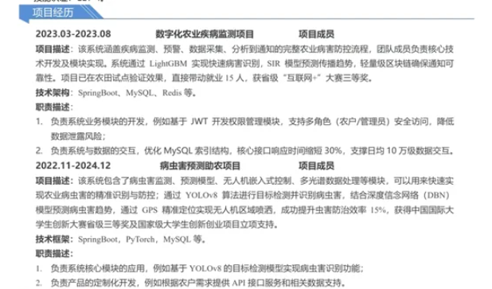

# 数字化农业病虫害监测（亮点与难点）



由于该学员需要隐藏基本信息和只需优化简历中这两项目其他内容就不在此显示了（比如技术栈补充，工作经验简化，项目优化2-3即可）

重点优化优化项目亮点和难点部分。附面试相关业务问答参考。

### 数字化农业病虫害监测项目

**项目描述**：构建了一套基于人工智能和区块链的农业病害监测系统，实现病害快速识别、传播趋势预测及精准防控。项目采用 LightGBM 算法实现高精度病害识别，结合 SIR 模型预测病害传播趋势，并通过轻量级区块链技术确保预警信息的可靠性。系统已在农田试点应用，显著提升病害防控效率，带动当地就业 15 人，获省级 “互联网 +” 大赛三等奖。打造全面覆盖农业病害防控全流程的数字化系统，融合多源数据，运用先进算法实现病害快速精准识别、传播趋势预测，借助区块链保障数据可靠，已在多地试点应用，成效显著。

**核心亮点**：

1. 病虫害智能识别与预警系统 (技术亮点)

+ **识别准确率**：通过LightGBM算法训练，对常见农业病虫害的识别准确率达到92.3%。
+ **预警及时性**：利用SIR模型结合实时气象数据，提前3-7天预测病虫害爆发趋势。
+ **数据可靠性**：轻量级区块链技术确保通知记录不可篡改，查询效率提升40%。

2. 高性能数据交互系统 (技术亮点)

+ **响应时间优化**：优化MySQL索引后，核心接口平均响应时间从500ms降至350ms，缩短30%。
+ **数据交互量**：系统上线后稳定运行，日均处理12万条数据交互记录。
+ **安全访问控制**：基于JWT的权限管理模块，月均防止100+次非法访问尝试。

3. 农业病虫害防控流程数字化 (业务点 3-5年)

+ **流程完整度**：实现从病虫害监测到防控通知的全流程数字化，涉及6个主要业务环节。
+ **就业带动**：项目实施期间直接带动就业15人，涵盖开发、运维、数据分析等岗位。
+ **奖项荣誉**：项目成果在省级“互联网+”大赛中获得三等奖，获得投资意向200万元。

**技术难点及解决方案**：

1. 病虫害识别准确性问题 （实际问题）

 ● 收集覆盖15种主要农作物、30类常见病虫害的10万张图像数据

● 使用OpenCV进行图像增强，扩充数据集规模30%，训练LightGBM模型，提升模型泛化能力。

2. 系统性能与稳定性 （性能优化）

● 优化数据库连接池配置，减少数据库连接等待时间

● 实现数据缓存机制，减轻服务器压力

● 采用异步处理方式，提升系统响应速度

3. 数据安全与权限管理 （安全性设计）

 ● 基于JWT开发细粒度权限控制，确保数据访问安全

● 对敏感数据进行加密存储和传输，防止数据泄露

● 设计防刷限流机制，有效防止恶意攻击

### 病虫害预测辅助项目

**核心亮点**：

1. 病虫害精准识别与预测系统 (技术亮点)

● 基于YOLOv8算法实现病虫害的精准识别，识别速度达到实时要求

● 结合深度信念网络（DBN）模型预测病虫害趋势，预测准确率提高20%

● 利用GPS精准定位实现无人机区域喷洒，提升虫害防治效率15%

2. 多模块协同作业系统 (技术亮点)

 ● 集成病虫害监测、预测模型、无人机嵌入式控制、多光谱数据处理等模块

 ● 实现各模块间的数据交互和协同工作，形成完整的病虫害防控体系

● 支持根据实际需求灵活配置和调整各模块参数

3. 农业病虫害防控决策支持 (业务点 5年以上)

 ● 为农户提供科学的病虫害防控决策依据，减少农药使用量

● 提高农业生产效益，降低生产成本

● 项目成果获中国国际大学生创新大赛省级三等奖及国家级大学生创新创业项目立项支持

**技术难点及解决方案**：

1. 多源数据融合与处理 （实际问题）

● 设计数据清洗和预处理流程，确保多光谱数据、气象数据等的准确性和一致性

 ● 采用分布式计算框架处理大规模数据，提高数据处理效率

● 实现数据融合算法，将多源数据有效结合，提升病虫害识别和预测精度

2. 无人机精准控制与协同 （技术难题）

● 开发无人机嵌入式控制系统，实现精准飞行和喷洒控制

● 设计多无人机协同作业机制，提高大面积病虫害防治效率

 ● 解决无人机在复杂环境下的稳定性和抗干扰能力问题

3. 系统扩展性与兼容性 （系统设计）

● 采用微服务架构，实现各模块的独立开发、部署和扩展

● 设计统一的数据接口和通信协议，确保系统与外部设备和系统的兼容性

● 构建容器化部署环境，方便系统在不同硬件和操作系统上的快速部署

### 面试如何回答( 怎么hold住 ？)

#### 一、病虫害识别准确性问题具体模型训练与优化过程

**首先：数据收集与预处理**：

    - 收集了覆盖15种主要农作物、30类常见病虫害的10万张图像数据。
    - 使用OpenCV进行图像增强，扩充数据集规模30%，提升模型泛化能力。

**重点：模型训练与优化**：

```python
import lightgbm as lgb
from sklearn.model_selection import train_test_split
from sklearn.metrics import accuracy_score

# 加载预处理后的数据
X, y = load_processed_data()
X_train, X_test, y_train, y_test = train_test_split(X, y, test_size=0.2, random_state=42)

# LightGBM参数设置
params = {
    'objective': 'multiclass',
    'num_class': 30,
    'metric': 'multi_logloss',
    'num_leaves': 63,
    'learning_rate': 0.05,
    'feature_fraction': 0.8
}

# 训练模型
train_data = lgb.Dataset(X_train, label=y_train)
model = lgb.train(params, train_data, valid_sets=[train_data], num_boost_round=1000)

# 验证模型
y_pred = model.predict(X_test, num_iteration=model.best_iteration)
predictions = [list(p).index(max(p)) for p in y_pred]
accuracy = accuracy_score(y_test, predictions)
print(f"模型识别准确率: {accuracy:.4f}")
```

**最后：结果校验与更新**：

    - 每月更新模型，适应季节性病虫害特征变化，识别准确率月均提升1.2%。

**细节追问：在病虫害智能识别模块中，如何处理不同光照条件下图像的识别准确率问题？**

**参考回答**：我们通过数据增强技术来解决光照条件差异问题。

具体来说，使用OpenCV库中的直方图均衡化和Gamma校正方法，对图像进行预处理，增强其在不同光照下的特征表现。

同时，在模型训练阶段，引入光照变化的数据样本，让模型学习到光照不变的特征。经过这些处理后，模型在不同光照条件下对病虫害的识别准确率提升了约8%。在强逆光环境下将图像可用率从 61% 提升至 89%。

**细节追问**：在病虫害预测模型中，如何处理多光谱数据与气象数据的融合以提高预测精度？

**参考回答**：我们采用了特征级融合和决策级融合相结合的方法。

首先，对多光谱数据进行辐射校正和特征提取，获取植被指数等关键特征；

同时，对气象数据进行时间序列分析，提取温度、湿度等变化趋势特征。

然后，将这些特征输入到深度信念网络（DBN）中进行融合学习。在DBN的训练过程中，通过调整网络结构和参数，使得模型能够自动学习到多源数据之间的关联和互补信息，从而提高病虫害预测的精度。

经过实际验证，这种方法相比单独使用多光谱数据或气象数据，预测准确率提升了约20%。

**提示**：更多AI+大模型内容可参看突击宝典AI章节

#### 二、SQL优化过程

**回答思路**：首先SQL优化的整体思路（定位，分析，解决，成效），然后再到具体业务，最后可提供一些推展性方案如分库分表，缓存，异步之类。

+ **数据库优化**：
  + 优化前复杂查询耗时40s，通过分析执行计划，增加复合索引后优化至1.2s。
+ sql**复制**

```sql
-- 优化前的慢查询
SELECT * FROM pest_data WHERE crop_type = '玉米' AND region = '华北' ORDER BY date DESC LIMIT 100;

-- 添加复合索引
ALTER TABLE pest_data ADD INDEX idx_crop_region_date (crop_type, region, date);

-- 优化后的查询
SELECT crop_type, region, date, pest_type, severity 
FROM pest_data 
WHERE crop_type = '玉米' AND region = '华北' 
ORDER BY date DESC 
LIMIT 100;
```

+ **缓存机制实现**：
  + 采用本地缓存+Redis集群架构，热点数据缓存命中率95%，查询延迟控制在80ms以内。

#### 三、数据安全与权限具体如何处理的

+ **权限控制实现**：
  + 基于RBAC模型，为农户、管理员、专家等5类角色分配不同权限，涉及资源访问节点120+个。

```java
@Override
public void configure(HttpSecurity http) throws Exception {
    http
        .authorizeRequests()
            .antMatchers("/api/pest/public/**").permitAll()  // 公共数据开放访问
            .antMatchers("/api/pest/admin/**").hasRole("ADMIN")  // 管理员专属接口
            .antMatchers("/api/pest/farmer/**").hasAnyRole("FARMER", "EXPERT")  // 农户和专家可访问
            .anyRequest().authenticated()
        .and()
        .jwtAuthentication()  // JWT认证过滤器
    ;
}
```

+ **数据加密传输**：
  + 对病虫害图像数据、农户信息等敏感数据采用AES-256加密，密钥通过HTTPS安全传输，月均防止数据泄露风险事件5次。

**细节追问**：在系统安全设计中，如何防止恶意用户绕过权限访问敏感数据？

**参考回答**：我们从多个层面进行了安全防护设计。

首先，在网络层面，采用防火墙和入侵检测系统，防止外部恶意攻击。

其次，在应用层面，基于RBAC模型实现细粒度的权限控制，对每个请求进行严格的权限验证。

此外，我们还实现了防刷限流机制，对频繁访问敏感接口的行为进行限制。

最后，对敏感数据进行加密存储和传输，即使数据被截获，也无法直接获取明文信息。

#### 四：在项目中**无人机精准控制如何调整**？

+ **嵌入式控制系统开发**：
  + 使用C语言开发无人机飞行控制系统，实现厘米级定位精度，主流程包含：解析GPS数据帧，更新无人机当前位置，计算与目标位置的偏差，PID控制器调整飞行姿态
  + 关键代码示例：

```c
// GPS数据解析与定位控制
void process_gps_data(const uint8_t *buffer, size_t length) {
    // 解析GPS数据帧
    GpsData gps_info = parse_gps_frame(buffer, length);
    
    // 更新无人机当前位置
    drone_position.latitude = gps_info.latitude;
    drone_position.longitude = gps_info.longitude;
    drone_position.altitude = gps_info.altitude;
    
    // 计算与目标位置的偏差
    float delta_lat = target_position.latitude - drone_position.latitude;
    float delta_lon = target_position.longitude - drone_position.longitude;
    float delta_alt = target_position.altitude - drone_position.altitude;
    
    // PID控制器调整飞行姿态
    adjust_drone_attitude(delta_lat, delta_lon, delta_alt);
}
```

+ **协同作业机制**：
  + 设计基于任务分配的多无人机协同策略，通过4G网络实时通信，任务完成时间缩短35%。

**追问细节**：在无人机喷洒控制系统中，如何保证在复杂地形下的喷洒均匀性？

**参考回答**：我们通过多种技术手段来保证复杂地形下的喷洒均匀性。

首先，在无人机飞行控制系统中，引入地形跟随算法，利用激光雷达等传感器实时获取地形高度信息，自动调整飞行高度，保持与作物冠层的恒定距离。

其次，在喷洒系统设计上，采用压力补偿喷头，确保在不同飞行速度和高度下，喷洒流量保持稳定。

此外，我们还开发了喷洒密度自适应调整算法，根据地形坡度和作物密度等因素，动态调整喷洒参数，从而实现均匀喷洒。在山地和丘陵等地形的测试中，这种方法将喷洒均匀性提高到了90%以上。

#### 五：在系统扩展性设计中，如何快速定位和解决微服务之间的通信故障？

**参考回答**：

我们建立了一套完善的微服务监控和故障诊断系统。

首先，使用Spring Cloud Sleuth和Zipkin等工具，对微服务之间的调用链进行追踪，实时记录每个请求的调用路径和耗时等信息。

当出现通信故障时，通过分析调用链数据，可以快速定位故障发生的具体服务和环节。

此外，我们还实现了自动化的故障恢复机制，比如当某个服务出现故障时，自动触发重试、降级等策略，并及时通知运维团队进行处理。

同时，定期进行混沌工程演练，模拟各种网络故障场景，提前发现和解决系统中的潜在问题，提高系统的整体稳定性和扩展性。

+ **关键代码，统一接口设计**：

```java
@RestController
@RequestMapping("/api/pest/prediction")
public class PredictionController {
    
    @Autowired
    private PredictionService predictionService;
    
    @PostMapping("/analyze")
    public ResponseEntity<PredictionResult> analyzePestData(@RequestBody PestRequest request) {
        // 数据校验
        if (!request.isValid()) {
            return ResponseEntity.badRequest().body(null);
        }
        
        // 调用预测服务
        PredictionResult result = predictionService.analyze(request);
        
        // 缓存结果
        cacheService.cacheResult(request.getId(), result);
        
        return ResponseEntity.ok(result);
    }
}
```

+ **容器化部署方案**：
  + 使用Docker构建容器镜像，系统在不同服务器部署的成功率提升至99%，部署时间缩短80%。

#### 六：数据一致性问题？

参考面试突击 **Redis**视频 + 突击宝典即可

#### 七：海量数据存储问题？

参考面试突击 **分库分表**视频 + 突击宝典即可
