# 千万级实时聊天系统如何设计

## 千万级IM消息系统设计

**整体架构**

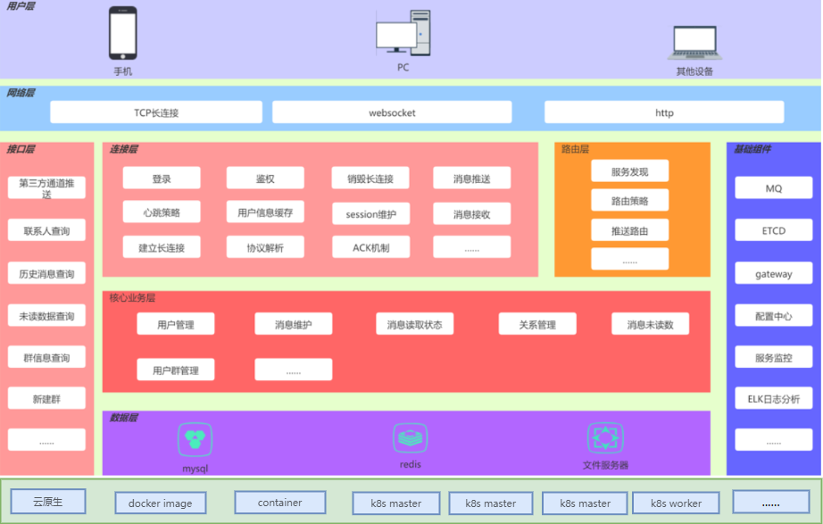

**核心流程：**

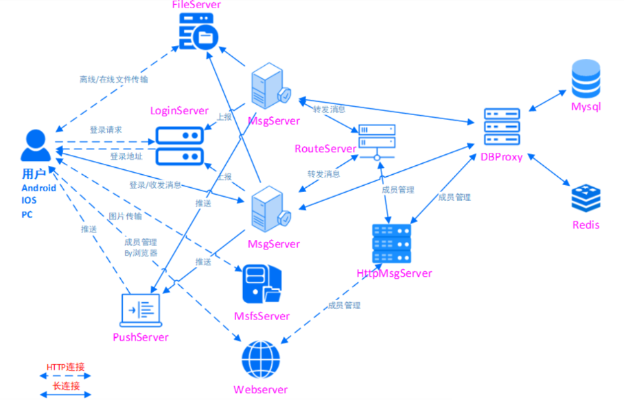

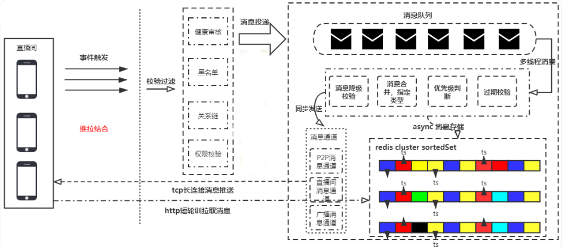

**消息分发流程：**

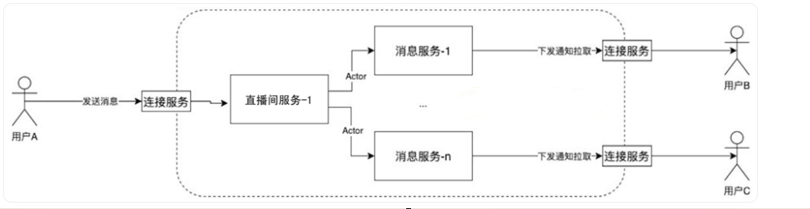

**消息拉取流程：**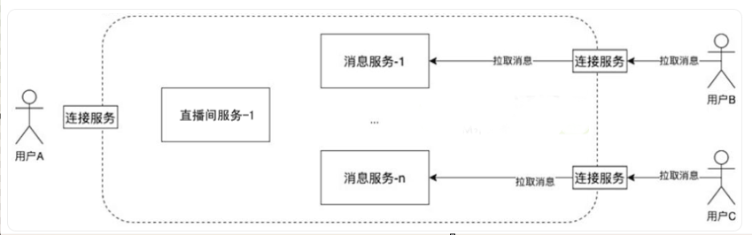

**长连接消息分发整体架构：**

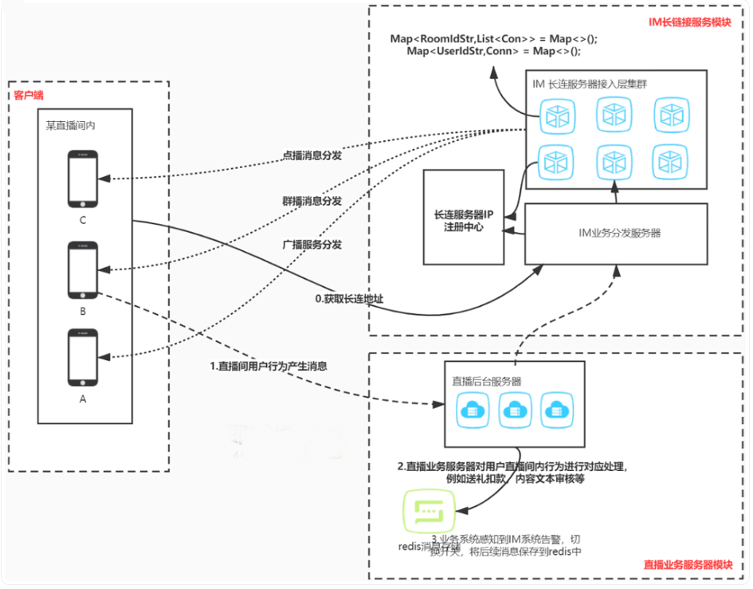

**k8s集群部署**

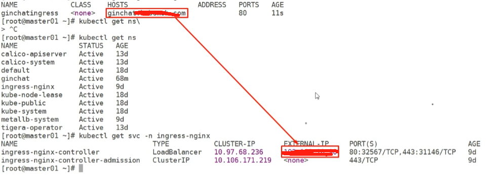

## IM 核心功能
  
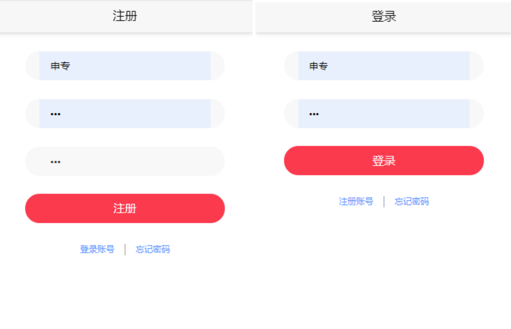

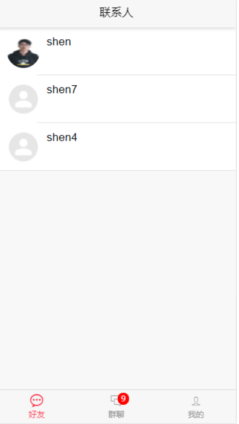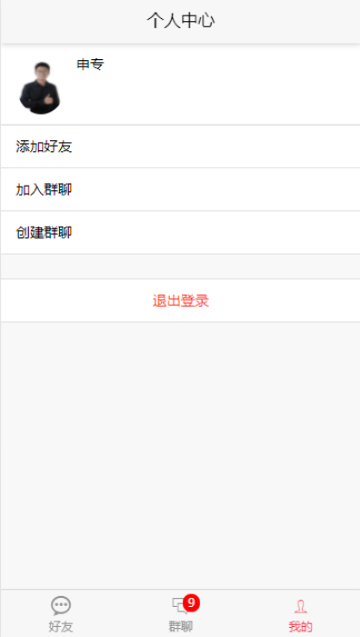

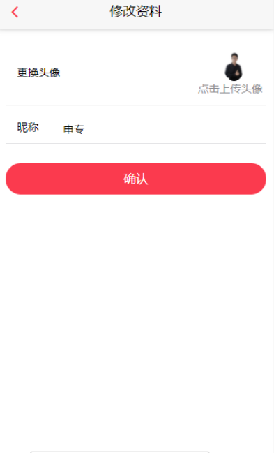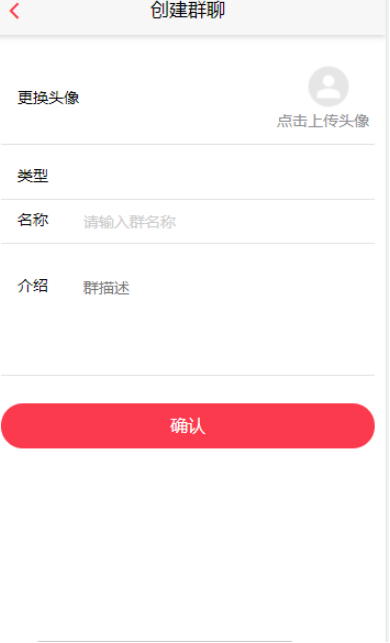

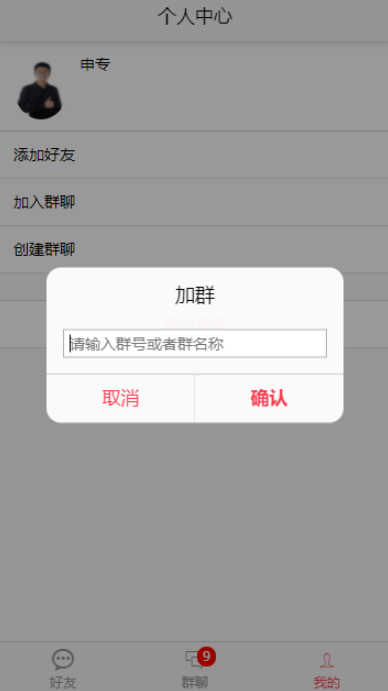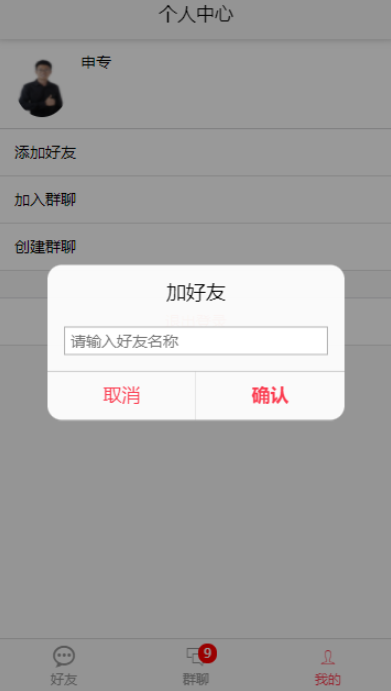

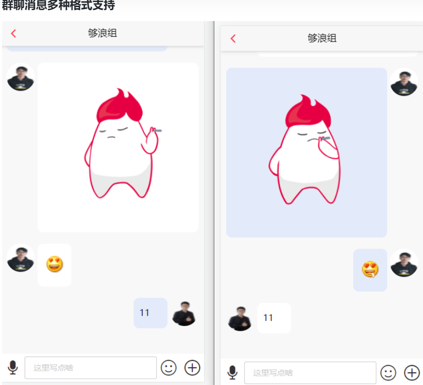

### 竞品方案类比
  
前面了解了 IM 系统的常见设计问题，接下来我们再看看业界是怎么设计 IM 系统的。研究业界的主流方案有助于我们深入理解 IM 系统的设计。  
**微信**  
虽然微信很多基础框架都是自研，但这并不妨碍我们理解微信的架构设计。微信采用的主要是：写扩散 + 推拉结合。由于群聊使用的也是写扩散，而写扩散很消耗资源，因此微信群有人数上限（目前是 500）。所以这也是写扩散的一个明显缺点，如果需要万人群就比较难了。可以看出，微信采用了多数据中心架构  

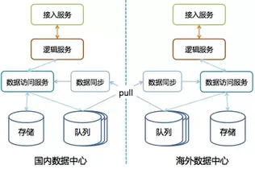

微信每个数据中心都是自治的，每个数据中心都有全量的数据，数据中心间通过自研的消息队列来同步数据。为了保证数据的一致性，每个用户都只属于一个数据中心，只能在自己所属的数据中心进行数据读写，如果用户连了其它数据中心则会自动引导用户接入所属的数据中心。而如果需要访问其它用户的数据那只需要访问自己所属的数据中心就可以了。同时，微信使用了三园区容灾的架构，使用 Paxos 来保证数据的一致性。  
微信的 ID 设计采用的是：基于申请 DB 步长的生成方式 + 用户级别递增。如下图所示：  

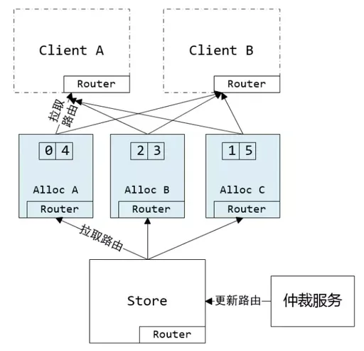

微信的序列号生成器由仲裁服务生成路由表（路由表保存了 uid 号段到 AllocSvr 的全映射），路由表会同步到 AllocSvr 跟 Client。如果 AllocSvr 宕机的话会由仲裁服务重新调度 uid 号段到其它 AllocSvr。  
**钉钉**  
钉钉最开始使用的是写扩散模型，为了支持万人群，后来貌似优化成了读扩散。  
但聊到阿里的 IM 系统，不得不提的是阿里自研的 Tablestore。一般情况下，IM 系统都会有一个自增 ID 生成系统，但 Tablestore 创造性地引入了[主键列自增](https://xie.infoq.cn/link?target=https%3A%2F%2Fhelp.aliyun.com%2Fdocument_detail%2F47731.html%3Fspm%3D5176.10695662.1996646101.searchclickresult.6bc54277FuOVpL)，即把 ID 的生成整合到了 DB 层，支持了用户级别递增（传统 MySQL 等 DB 只能支持表级自增，即全局自增）。  
**Twitter**  
什么？Twitter 不是 Feeds 系统吗？不是讨论 IM 的吗？是的，Twitter 是 Feeds 系统，但 Feeds 系统跟 IM 系统其实有很多设计上的共性，研究下 Feeds 系统有助于我们在设计 IM 系统时进行参考。再说了，研究下 Feeds 系统也没有坏处，扩展下技术视野嘛。  
Twitter 的自增 ID 设计估计大家都耳熟能详了，即大名鼎鼎的 [Snowflake](https://xie.infoq.cn/link?target=https%3A%2F%2Fdeveloper.twitter.com%2Fen%2Fdocs%2Fbasics%2Ftwitter-ids)，因此 ID 是全局递增的。  

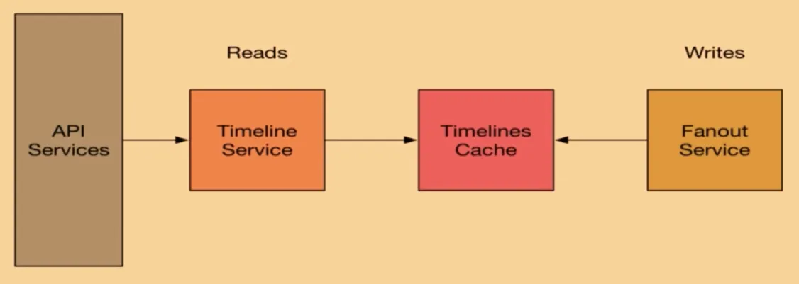

Twitter 一开始使用的是写扩散模型，Fanout Service 负责扩散写到 Timelines Cache（使用了 Redis），Timeline Service 负责读取 Timeline 数据，然后由 API Services 返回给用户。  
但由于写扩散对于大 V 来说写的消耗太大，因此后面 Twitter 又使用了写扩散跟读扩散结合的方式。如下图所示：  

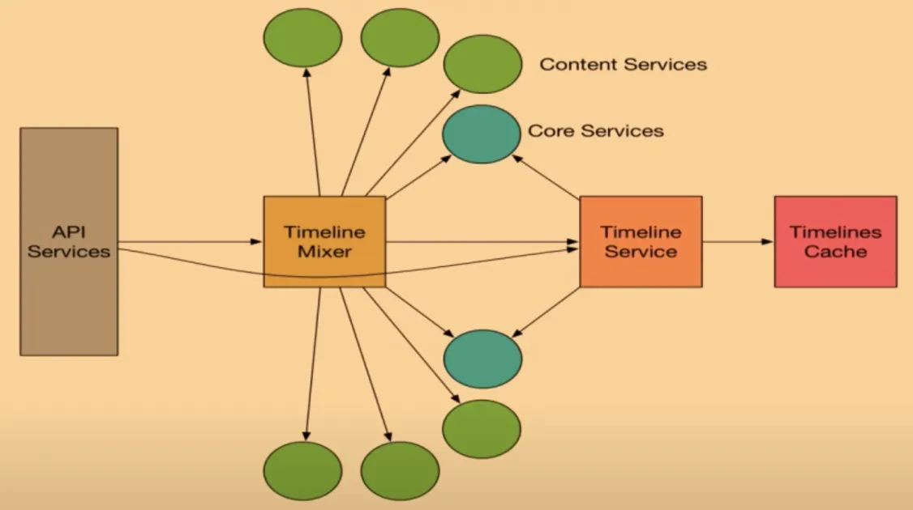

对于粉丝数不多的用户如果发 Twitter 使用的还是写扩散模型，由 Timeline Mixer 服务将用户的 Timeline、大 V 的写 Timeline 跟系统推荐等内容整合起来，最后再由 API Services 返回给用户。  
**抖音**  
抖音作为目前流量最大的IM实时消息平台。采用了go语言开发，采用多级流量池分级推荐机制，通过中心化的流量分发逻辑，根据用户标签和行为数据进行内容匹配。这种机制不仅优化了消息的分发效率，还确保了内容的多样性和个性化推荐。

此外，抖音通过容器化和 Kubernetes 等技术实现了弹性扩展，能够根据流量波动自动调整资源分配。这种动态扩容能力确保了系统在高并发场景下的稳定运行

相对上面纯IM通信场景，抖音直播间消息还具备如下特点：

1）消息要求更及时：过时的消息对于用户来说不重要；

2）松散的群聊：用户随时进群，随时退群；

3）历史消息不需要重发：用户进群后，离线期间（接听电话）的消息不需要重发。

并且不同消息类型分别处理：如用户发消息，直播间消息，直播间刷礼物等

## 技术难点

### 读扩散 vs 写扩散

**读扩散**

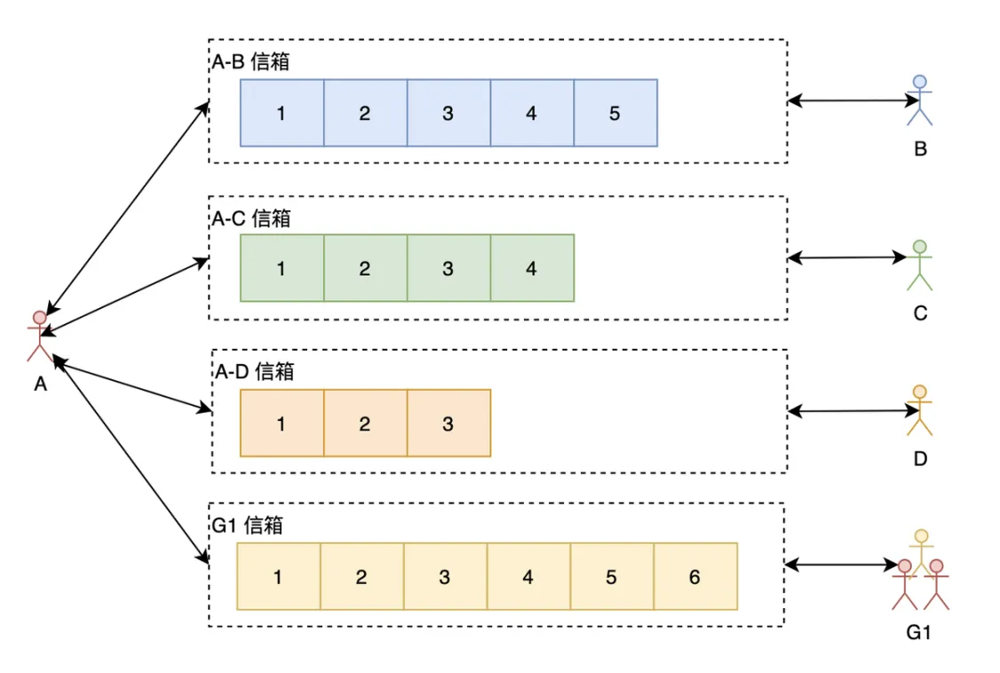  
我们先来看看读扩散。如上图所示，A 与每个聊天的人跟群都有一个信箱（有些博文会叫 Timeline），A 在查看聊天信息的时候需要读取所有有新消息的信箱。这里的读扩散需要注意与 Feeds 系统的区别，在 Feeds 系统中，每个人都有一个写信箱，写只需要往自己的写信箱里写一次就好了，读需要从所有关注的人的写信箱里读。但 IM 系统里的读扩散通常是每两个相关联的人就有一个信箱，或者每个群一个信箱。  
读扩散的优点：  
●写操作（发消息）很轻量，不管是单聊还是群聊，只需要往相应的信箱写一次就好了  
●每一个信箱天然就是两个人的聊天记录，可以方便查看聊天记录跟进行聊天记录的搜索  
读扩散的缺点：  
●读操作（读消息）很重  
**写扩散**  
接下来看看写扩散。  

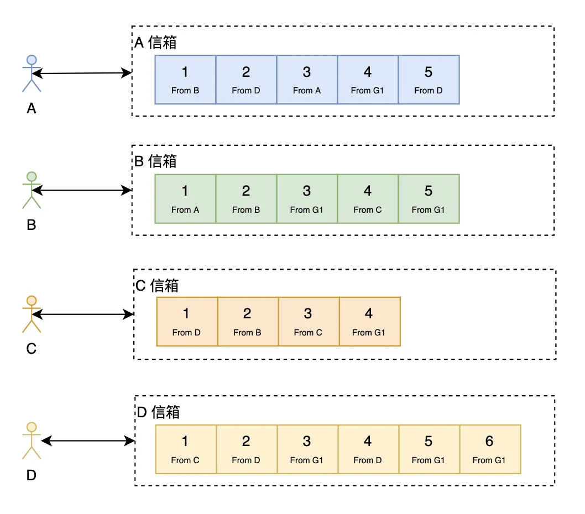

在写扩散中，每个人都只从自己的信箱里读取消息，但写（发消息）的时候，对于单聊跟群聊处理如下：  
●单聊：往自己的信箱跟对方的信箱都写一份消息，同时，如果需要查看两个人的聊天历史记录的话还需要再写一份（当然，如果从个人信箱也能回溯出两个人的所有聊天记录，但这样效率会很低）。  
●群聊：需要往所有的群成员的信箱都写一份消息，同时，如果需要查看群的聊天历史记录的话还需要再写一份。可以看出，写扩散对于群聊来说大大地放大了写操作。  
写扩散优点：  
●读操作很轻量  
●可以很方便地做消息的多终端同步  
写扩散缺点：  
●写操作很重，尤其是对于群聊来说  
注意，在 Feeds 系统中：  
●写扩散也叫：Push、Fan-out 或者 Write-fanout  
●读扩散也叫：Pull、Fan-in 或者 Read-fanout

基于传统的IM架构技术，尤其在群内聊天或者分享，每条消息按照群内人数进行写扩散，按照主互动500人群规模来计算，平均群大小320+，1:N的写入必然导致写入DB的RT以及存储压力，按照DB库承接120w/s写入速度，导致消息上行3K/s的极限，而实际参与互动分享的用户在峰值的时候远大于这部分互动分享和聊天消息流量。  其次集群的写入不可能完全给IM聊天消息，还有其它的营销活动、交易、物流等通知类型的消息。  基于传统IM的“写扩散”架构，在高并发、强互动场景下遇到了瓶颈，导致消息大量的延迟下推，影响最终用户体验。

**对比何选择**

写扩散技术：

  优点：

 1）整体架构简洁，方案简单，维护用户同步队列实现数据同步机制；

 2）无论是单聊还是群聊等会话消息，写入用户维度同步队列，集中获取同步数据；

 3）推和拉情况下，存储模型和数据处理简单，且天然支持个性化数据。

 缺点：

 1）群会话消息，天然存在1:N写入扩散比，存储压力N倍压力，在线用户收到消息延迟增大；

 2）多个群内消息队列混合在同步队列，无优先级处理能力，无法针对互动群等做隔离。  读扩散技术：  

优点：

 1）降低写扩散N倍的DB存储压力，减少下行在线用户端到端扩散的RT时间；

 2）提升消息上行集群整体的吞吐量，用户体验更流畅；

 3）端到端实现会话级别的同步优先级队列，实现差异化服务。

  缺点：  

1）整体架构偏复杂，需要维护每个动态会话消息同步队列，端侧需要实时感知新增的动态同步队列；

 2）客户端冷启动需要分散读取多个会话消息同步队列数据，对于存储会带来读QPS压力。

混合模式演进推进“**读写扩散混合模式**“落地，结合两者的优点进行云端一体化数据同步技术，覆盖几千万互动群用户，保证整体峰值上行消息以及用户在群内端到端延迟体验，做到一条上行消息500ms以内到达群内其他用户端侧，让整体用户体验提升明显，群内强互动成为可能。

### 唯一 ID 设计

通常情况下，ID 的设计主要有以下几大类：  
●UUID  
●基于 Snowflake 的 ID 生成方式  
●基于申请 DB 步长的生成方式  
●基于 Redis 或者 DB 的自增 ID 生成方式  
●特殊的规则生成唯一 ID  
具体的实现方法跟优缺点可以参考之前的一篇博文：[分布式唯一 ID 解析](https://xie.infoq.cn/article/6673de15fabf57e46017c12c4)  
在 IM 系统中需要唯一 Id 的地方主要是：  
●会话 ID  
●消息 ID  
**消息 ID**  
我们来看看在设计消息 ID 时需要考虑的三个问题。  
**消息 ID 不递增可以吗**  
我们先看看不递增的话会怎样：  
●使用字符串，浪费存储空间，而且不能利用存储引擎的特性让相邻的消息存储在一起，降低消息的写入跟读取性能  
●使用数字，但数字随机，也不能利用存储引擎的特性让相邻的消息存储在一起，会加大随机 IO，降低性能；而且随机的 ID 不好保证 ID 的唯一性  
消息可以看做时序数据，使用递增的 ID 可以方便做消息分页拉取，提高分页性能。因此，消息 ID 最好是递增的。  
**全局递增 vs 用户级别递增 vs 会话级别递增**  
全局递增：指消息 ID 在整个 IM 系统随着时间的推移是递增的。全局递增的话一般可以使用 Snowflake（当然，Snowflake 也只是 worker 级别的递增）。此时，如果你的系统是读扩散的话为了防止消息丢失，那每一条消息就只能带上上一条消息的 ID，前端根据上一条消息判断是否有丢失消息，有消息丢失的话需要重新拉一次。  
用户级别递增：指消息 ID 只保证在单个用户中是递增的，不同用户之间不影响并且可能重复。典型代表：微信。如果是写扩散系统的话信箱时间线 ID 跟消息 ID 需要分开设计，信箱时间线 ID 用户级别递增，消息 ID 全局递增。如果是读扩散系统的话感觉使用用户级别递增必要性不是很大。  
会话级别递增：指消息 ID 只保证在单个会话中是递增的，不同会话之间不影响并且可能重复。典型代表：QQ。  
**连续递增 vs 单调递增**  
连续递增是指 ID 按 1,2,3...n 的方式生成；而单调递增是指只要保证后面生成的 ID 比前面生成的 ID 大就可以了，不需要连续。  
据我所知，QQ 的消息 ID 就是在会话级别使用的连续递增，这样的好处是，如果丢失了消息，当下一条消息来的时候发现 ID 不连续就会去请求服务器，避免丢失消息。此时，可能有人会想，我不能用定时拉的方式看有没有消息丢失吗？当然不能，因为消息 ID 只在会话级别连续递增的话那如果一个人有上千个会话，那得拉多少次啊，服务器肯定是抗不住的。  
对于读扩散来说，消息 ID 使用连续递增就是一种不错的方式了。如果使用单调递增的话当前消息需要带上前一条消息的 ID（即聊天消息组成一个链表），这样，才能判断消息是否丢失。  
总结一下就是：  
●写扩散：信箱时间线 ID 使用用户级别递增，消息 ID 全局递增，此时只要保证单调递增就可以了  
●读扩散：消息 ID 可以使用会话级别递增并且最好是连续递增  
**会话 ID**  
我们来看看设计会话 ID 需要注意的问题：  
其中，会话 ID 有种比较简单的生成方式（特殊的规则生成唯一 ID）：拼接 from_user_id 跟 to_user_id：  
1如果 from_user_id 跟 to_user_id 都是 32 位整形数据的话可以很方便地用位运算拼接成一个 64 位的会话 ID，即： `conversation_id = ${from_user_id} << 32` | `${to_user_id}` （在拼接前需要确保值比较小的用户 ID 是 from_user_id，这样任意两个用户发起会话可以很方便地知道会话 ID）  
2如果from_user_id 跟 to_user_id 都是 64 位整形数据的话那就只能拼接成一个字符串了，拼接成字符串的话就比较伤了，浪费存储空间性能又不好。  
前东家就是使用的上面第 1 种方式，第 1 种方式有个硬伤：随着业务在全球的扩展，32 位的用户 ID 如果不够用需要扩展到 64 位的话那就需要大刀阔斧地改了。32 位整形 ID 看起来能够容纳 21 亿个用户，但通常我们为了防止别人知道真实的用户数据，使用的 ID 通常不是连续的，这时，32 位的用户 ID 就完全不够用了。因此，该设计完全依赖于用户 ID，不是一种可取的设计方式。  
因此，会话 ID 的设计可以使用全局递增的方式，加一个映射表，保存from_user_id、to_user_id跟conversation_id的关系。

### 推模式 vs 拉模式 vs 推拉结合模式

在 IM 系统中，新消息的获取通常会有三种可能的做法：  
●推模式：有新消息时服务器主动推给所有端（iOS、Android、PC 等）  
●拉模式：由前端主动发起拉取消息的请求，为了保证消息的实时性，一般采用推模式，拉模式一般用于获取历史消息  
●推拉结合模式：有新消息时服务器会先推一个有新消息的通知给前端，前端接收到通知后就向服务器拉取消息  
**推模式简化图如下：**  

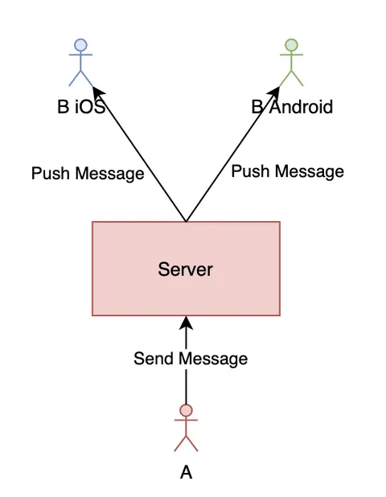

如上图所示，正常情况下，用户发的消息经过服务器存储等操作后会推给接收方的所有端。但推是有可能会丢失的，最常见的情况就是用户可能会伪在线（是指如果推送服务基于长连接，而长连接可能已经断开，即用户已经掉线，但一般需要经过一个心跳周期后服务器才能感知到，这时服务器会错误地以为用户还在线；伪在线是本人自己想的一个概念，没想到合适的词来解释）。因此如果单纯使用推模式的话，是有可能会丢失消息的。  
**推拉结合模式简化图如下：**  

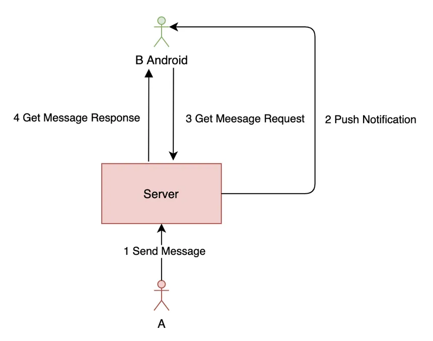

可以使用推拉结合模式解决推模式可能会丢消息的问题。在用户发新消息时服务器推送一个通知，然后前端请求最新消息列表，为了防止有消息丢失，可以再每隔一段时间主动请求一次。可以看出，使用推拉结合模式最好是用写扩散，因为写扩散只需要拉一条时间线的个人信箱就好了，而读扩散有 N 条时间线（每个信箱一条），如果也定时拉取的话性能会很差。

### 消息积压

消息串行写入 Redis，如果某个直播间消息量很大，那么消息会堆积在 Kafka 中，消息延迟较大。  
解决办法：

+ 消息写入流程优化：前端机-> Kafka -> 处理机 -> Redis；
+ 前端机：如果延迟小，则只写入一个 Kafka 的partion；如果延迟大，则这个直播的这种消息类型写入 Kafka 的多个partion；
+ 处理机：如果延迟小，加锁串行写入 Redis；如果延迟大，则取消锁。因此有四种组合，四个档位，分别是：  
+ 一个partion, 加锁串行写入 Redis, 最大并发度:1；  
+ 多个partition,加锁串行写入 Redis, 最大并发度:Kafka partion的个数；  
+ 一个partion, 不加锁并行写入 Redis, 最大并发度: 处理机的线程池个数；  
+ 多个partion, 不加锁并行写入 Redis，最大并发度: Kafka partition个数处理机线程池的个数。

+ 延迟程度判断：前端机写入消息时，打上消息的统一时间戳，处理机拿到后，延迟时间 = 现在时间 - 时间戳；
+ 档位选择：自动选择档位，粒度:某个直播间的某个消息类型。  

### Redis slave瓶颈

用户轮询最新消息，需要进行 Redis 的 ZrangByScore 操作，redis slave 的性能瓶颈较大。

解决办法:

+ 本地缓存：前端机每隔1秒左右取拉取一次直播间的消息，用户到前端机轮询数据时，从本地缓存读取数据；
+ 消息的返回条数根据直播间的大小自动调整：小直播间返回允许时间跨度大一些的消息，大直播间则对时间跨度以及消息条数做更严格的限制。

tips: 这里本地缓存与平常使用的本地缓存问题，有一个最大区别：成本问题。如果所有直播间的消息都进行缓存，假设同时有1000个直播间，每个直播间5种消息类型，本地缓存每隔1秒拉取一次数据，40台前端机，那么对 Redis 的访问QPS是   1000 *5* 40 = 20万。成本太高，因此我们只有大直播间才自动开启本地缓存，小直播间不开启。  

### 视频回放数据

直播消息直接存在缓存且过期时间较短，弹幕数据支持回放，直播结束后，这些数据存放于 Redis 中，在回放时，会与直播的数据竞争 Redis 的 cpu 资源。

解决办法:

直播结束后，数据备份到 mysql；

增加一组回放的 Redis；

前端机增加回放的 local cache。  

tips： 回放时，读取数据顺序是: local cache -> Redis -> mysql。localcache 与回放 Redis 都可以只存某个直播某种消息类型的部分数据，有效控制容量；local cache与回放 Redis 使用SortedSet数据结构，这样整个系统的数据结构都保持一致。

### 动态缩扩容

聊天室人员多少决定性能需根据监听及时发现热门直播间，提前做好扩缩容。

消息服务在进行扩缩容时，大部分成员需要按照一致性哈希的原则路由到新的消息服务节点上。这个过程会打破当前的人员平衡，并做一次整体的人员转移。

在聊天室进行自动销毁时，需先判断当前聊天室是否应该是本节点的。如果不是，跳过销毁逻辑，避免 Redis 中的数据因为销毁逻辑而丢失。

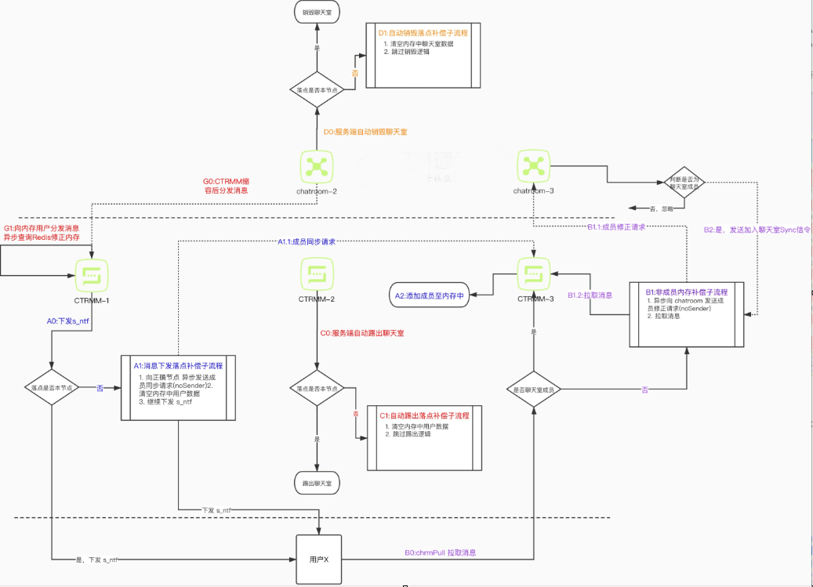

1）在扩容时：我们根据聊天室的活跃程度逐步转移人员。

2）在有消息时：[消息服务会遍历缓存在本节点上的所有用户进行消息的通知拉取，在此过程中判断此用户是否属于这台节点（如果不是，将此用户同步加入到属于他的节点）。

3）在拉消息时：用户在拉取消息时，如果本机缓存列表中没有该用户，消息服务会向聊天室服务发送请求确认此用户是否在聊天室中（如果在则同步加入到消息服务，不在则直接丢掉）。

4）在缩容时：消息服务会从公共 Redis 获得全部成员，并根据落点计算将本节点用户筛选出来并放入用户管理列表中。

### 海量在线用户管理

**聊天室服务**：

管理了所有人员的进出，人员的列表变动也会异步存入 Redis 中。

**消息服务**：则维护属于自己的聊天室人员，用户在主动加入和退出房间时，需要根据一致性哈希算出落点后同步给对应的消息服务。

**广播聊天室消息并进行心跳检测**：聊天室服务广播给所有聊天室消息服务，由消息服务进行消息的通知拉取。消息服务会检测用户的消息拉取情况，在聊天室活跃的情况下，30s 内人员没有进行拉取或者累计 30 条消息没有拉取，消息服务会判断当前用户已经离线，然后踢出此人，并且同步给聊天室服务对此成员做下线处理。

利用TCP的keeplive保活探测功能，可以探知客户端崩溃、中间网络端开和中间设备因超时删除连接相关的连接表等意外情况，从而保证在意外发生时，服务端可以释放半打开的TCP连接。  
客户端启动智能心跳不仅能在消耗极少的电和网络流量条件下，通知服务器客户端存活状态、定时的刷新NAT内外网IP映射表，还能在网络变更时自动重连长连接。

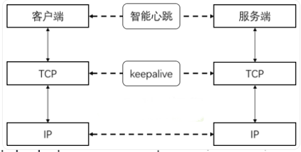

### 消息的实时性

在通信协议的选择上，我们主要有以下几个选择：  
1，使用 TCP Socket 通信，自己设计协议：58 到家等等

2，使用 UDP Socket 通信：QQ 等等

3，使用 HTTP 长轮循：微信网页版等等

4，websocket实时通信：抖音 等  
不管使用哪种方式，我们都能够做到消息的实时通知。但影响我们消息实时性的可能会在我们处理消息的方式上。例如：假如我们推送的时候使用 MQ 去处理并推送一个万人群的消息，推送一个人需要 2ms，那么推完一万人需要 20s，那么后面的消息就阻塞了 20s。如果我们需要在 10ms 内推完，那么我们推送的并发度应该是：人数：10000 / (推送总时长：10 / 单个人推送时长：2) = 2000  
因此，我们在选择具体的实现方案的时候一定要评估好我们系统的吞吐量，系统的每一个环节都要进行评估压测。只有把每一个环节的吞吐量评估好了，才能保证消息推送的实时性。

### 如何保证消息时序

以下情况下消息可能会乱序：  
●发送消息如果使用的不是长连接，而是使用 HTTP 的话可能会出现乱序。因为后端一般是集群部署，使用 HTTP 的话请求可能会打到不同的服务器，由于网络延迟或者服务器处理速度的不同，后发的消息可能会先完成，此时就产生了消息乱序。  
**解决方案：**  
●前端依次对消息进行处理，发送完一个消息再发送下一个消息。这种方式会降低用户体验，一般情况下不建议使用。  
●带上一个前端生成的顺序 ID，让接收方根据该 ID 进行排序。这种方式前端处理会比较麻烦一点，而且聊天的过程中接收方的历史消息列表中可能会在中间插入一条消息，这样会很奇怪，而且用户可能会漏读消息。但这种情况可以通过在用户切换窗口的时候再进行重排来解决，接收方每次收到消息都先往最后面追加。  
●通常为了优化体验，有的 IM 系统可能会采取异步发送确认机制（例如：QQ）。即消息只要到达服务器，然后服务器发送到 MQ 就算发送成功。如果由于权限等问题发送失败的话后端再推一个通知下去。这种情况下 MQ 就要选择合适的 Sharding 策略了：  
●按to_user_id进行 Sharding：使用该策略如果需要做多端同步的话发送方多个端进行同步可能会乱序，因为不同队列的处理速度可能会不一样。例如发送方先发送 m1 然后发送 m2，但服务器可能会先处理完 m2 再处理 m1，这里其它端会先收到 m2 然后是 m1，此时其它端的会话列表就乱了。  
●按conversation_id进行 Sharding：使用该策略同样会导致多端同步会乱序。  
●按from_user_id进行 Sharding：这种情况下使用该策略是比较好的选择  
●通常为了优化性能，推送前可能会先往 MQ 推，这种情况下使用to_user_id才是比较好的选择。

### 用户在线状态如何做

很多 IM 系统都需要展示用户的状态：是否在线，是否忙碌等。主要可以使用 Redis 或者分布式一致性哈希来实现用户在线状态的存储。  
1，Redis 存储用户在线状态  

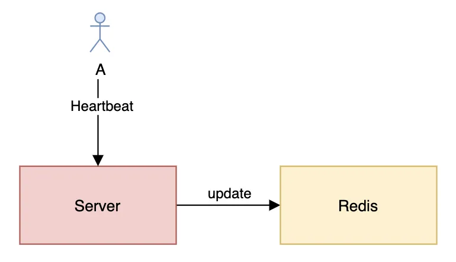

看上面的图可能会有人疑惑，为什么每次心跳都需要更新 Redis？如果我使用的是 TCP 长连接那是不是就不用每次心跳都更新了？确实，正常情况下服务器只需要在新建连接或者断开连接的时候更新一下 Redis 就好了。但由于服务器可能会出现异常，或者服务器跟 Redis 之间的网络会出现问题，此时基于事件的更新就会出现问题，导致用户状态不正确。因此，如果需要用户在线状态准确的话最好通过心跳来更新在线状态。  
由于 Redis 是单机存储的，因此，为了提高可靠性跟性能，我们可以使用 Redis Cluster 或者 Codis。  
2，分布式一致性哈希存储用户在线状态  

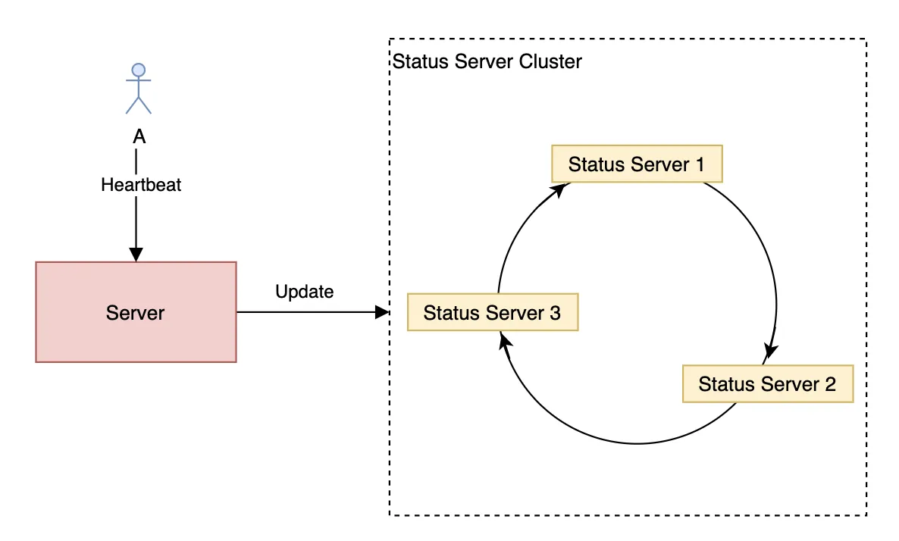

使用分布式一致性哈希需要注意在对 Status Server Cluster 进行扩容或者缩容的时候要先对用户状态进行迁移，不然在刚操作时会出现用户状态不一致的情况。同时还需要使用虚拟节点避免数据倾斜的问题。

### 数据冷热分离

对于 IM 来说，历史消息的存储有很强的时间序列特性，时间越久，消息被访问的概率也越低，价值也越低。  

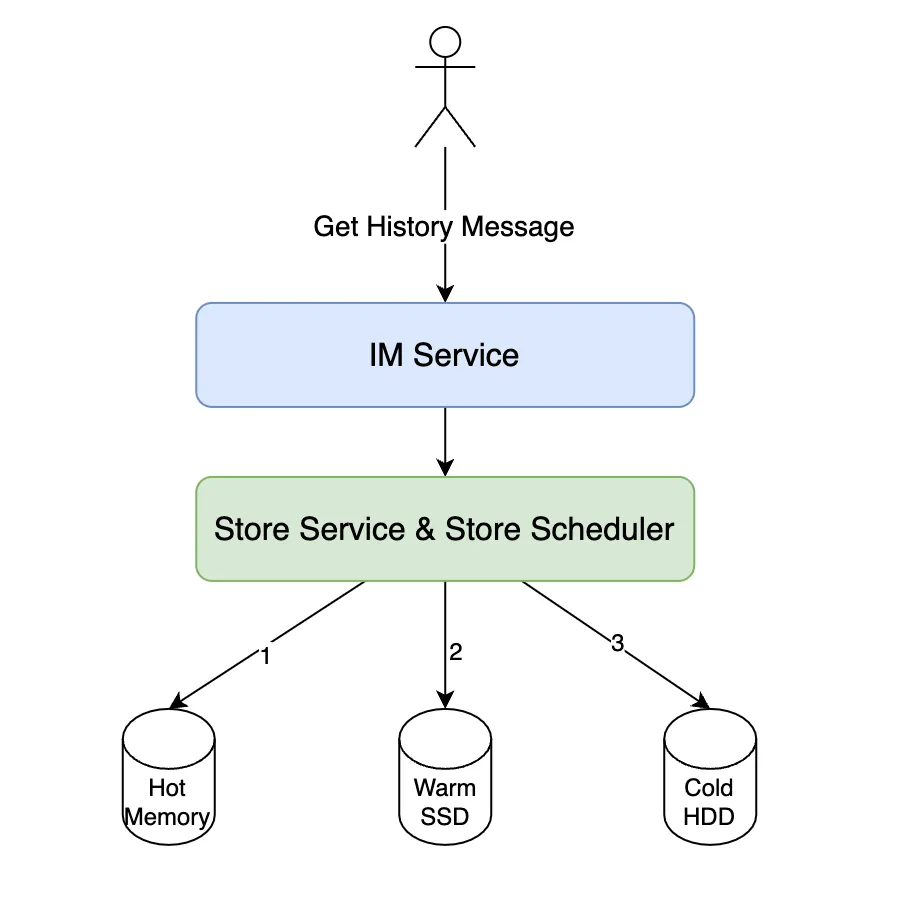

如果我们需要存储几年甚至是永久的历史消息的话（电商 IM 中比较常见），那么做历史消息的冷热分离就非常有必要了。数据的冷热分离一般是 HWC（Hot-Warm-Cold）架构。对于刚发送的消息可以放到 Hot 存储系统（可以用 Redis）跟 Warm 存储系统，然后由 Store Scheduler 根据一定的规则定时将冷数据迁移到 Cold 存储系统。获取消息的时候需要依次访问 Hot、Warm 跟 Cold 存储系统，由 Store Service 整合数据返回给 IM Service。

### 消息优先级

消息控速的核心是对消息的取舍，这就需要对消息做优先级划分。

 划分逻辑大致如下：

  1）白名单消息：这类消息最为重要，级别最高，一般系统类通知或者管理类信息会设置为白名单消息；

 2）高优先级消息：仅次于白名单消息，没有特殊设置过的消息都为高优先级； 3）低优先级消息：最低优先级的消息，这类消息大多是一些文字类消息。  

具体如何划分，应该是可以开放出方便的接口进行设置的。

  服务器对三种消息执行不同的限速策略，在高并发时，低优先级消息被丢弃的概率最大。

 服务器将三种消息分别存储在三个消息桶中：

客户端在拉取消息时按照白名单消息 ＞ 高优先级消息 ＞ 低优先级消息的顺序拉取。

### 互动消息分离处理

实时收发消息是聊天系统的核心业务，主要分文字语音等基础类型。

其次弹幕和礼物之类：

 1）礼物因涉及付费等因素一般通过客户方业务服务器发送；

2）弹幕消息则可以通过聊天室长链接发送。

 在千万级直播间场景下，因消息量太高，因此需要从消息量、消息体大小、消息比例等多个方面优化，因此我们设计了一套基于优先级队列的弹幕服务。  

**首先**：为了节约消息产生的带宽，在大型直播项目开始阶段，就需要对消息格式进行优化，充分精简消息体大小。例如将礼物消息展示相关的资源文件提前预加载到直播App中，礼物消息转化为业务编号，可极大的减少消息大小；

**其次**：针对上行消息设计流控机制。为了能全局控制上行消息体量，设计了逐级流控方案。上层级根据下层级能够支撑处理能力设计相对较粗粒度的本地流控机制。在弹幕反垃圾业务阶段，因需要全局控制消息量，因此采用分布式全局流控方案；弹幕广播阶段则根据业务广播需求再一次进行消息流控。

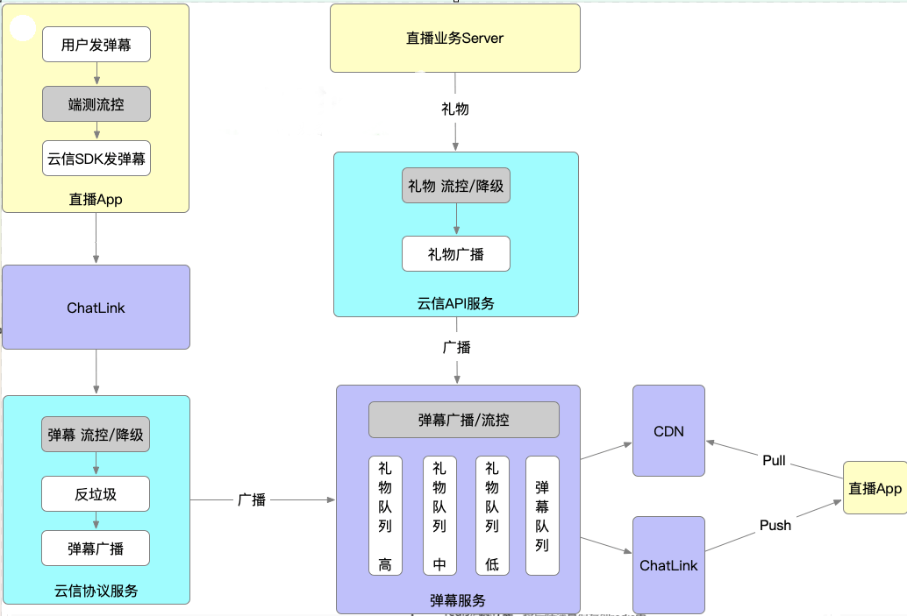

**上行消息通过反垃圾监测后被投递到弹幕服务处理。**基于优先级队列的弹幕服务首先按业务划分不同的消息队列，例如：系统广播、高优先级礼物、低优先级、弹幕，然后按队列分配消息比例，最后根据单位时间（1秒）内用户需要接收到的消息量计算各个队列应该投递的消息数量。在实际投递消息的过程中，若前一个队列消息量不足，可将剩余的消息数量叠加到下一个队列，以确保每一个周期都发送足够的消息给用户。  

**弹幕可通过长连接或CDN广播给其他用户。**为了给用户提供极致的弹幕体验，充分发挥边缘加速的优势，在千万级在线直播场景下优先选择CDN方案。

### 接入层怎么做

实现接入层的负载均衡主要有以下几个方法：  
1，硬件负载均衡：例如 F5、A10 等等。硬件负载均衡性能强大，稳定性高，但价格非常贵，不是土豪公司不建议使用。  
2，使用 DNS 实现负载均衡：使用 DNS 实现负载均衡比较简单，但使用 DNS 实现负载均衡如果需要切换或者扩容那生效会很慢，而且使用 DNS 实现负载均衡支持的 IP 个数有限制、支持的负载均衡策略也比较简单。  
3，DNS + 4 层负载均衡 + 7 层负载均衡架构：

例如 DNS + DPVS + Nginx 或者 DNS + LVS + Nginx。有人可能会疑惑为什么要加入 4 层负载均衡呢？

这是因为 7 层负载均衡很耗 CPU，并且经常需要扩容或者缩容，对于大型网站来说可能需要很多 7 层负载均衡服务器，但只需要少量的 4 层负载均衡服务器即可。因此，该架构对于 HTTP 等短连接大型应用很有用。当然，如果流量不大的话只使用 DNS + 7 层负载均衡即可。但对于长连接来说，加入 7 层负载均衡 Nginx 就不大好了。因为 Nginx 经常需要改配置并且 reload 配置，reload 的时候 TCP 连接会断开，造成大量掉线。  
4，DNS + 4 层负载均衡：4 层负载均衡一般比较稳定，很少改动，比较适合于长连接。  
对于长连接的接入层，如果我们需要更加灵活的负载均衡策略或者需要做灰度的话，那我们可以引入一个调度服务，如下图所示：  

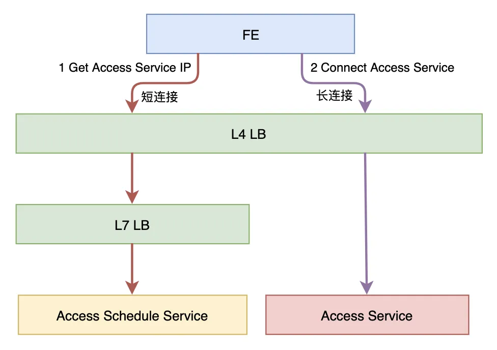

Access Schedule Service 可以实现根据各种策略来分配 Access Service，例如：  
●根据灰度策略来分配  
●根据就近原则来分配  
●根据最少连接数来分配

### 更多详情参看：支撑千万人在线微信钉钉后端IM高并发架构实战
