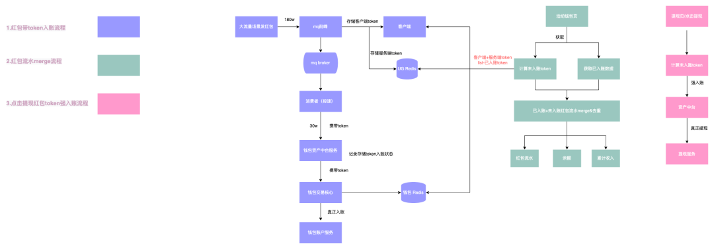
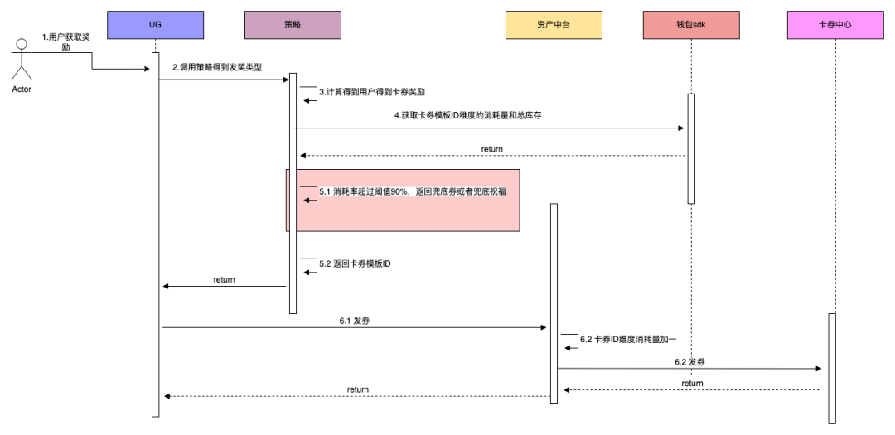
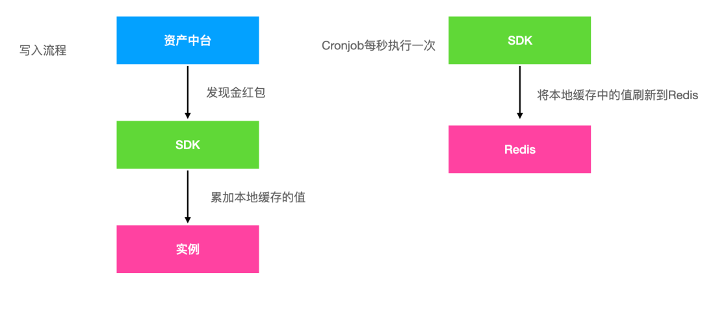
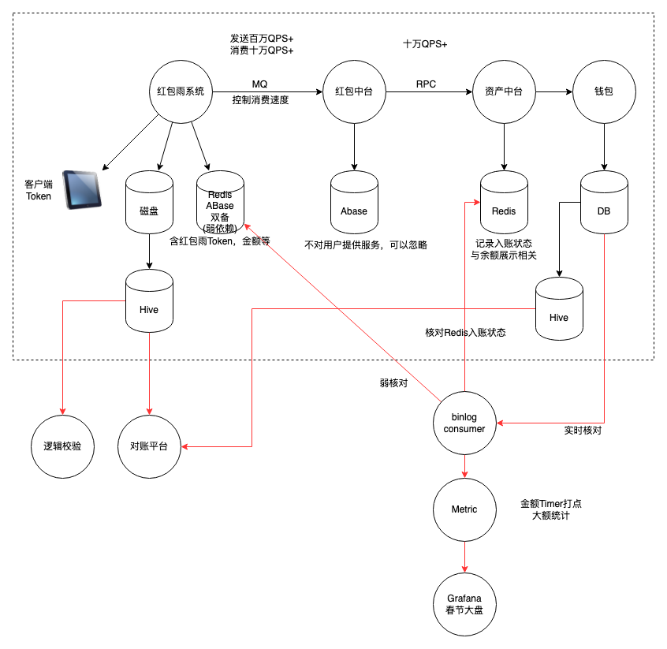
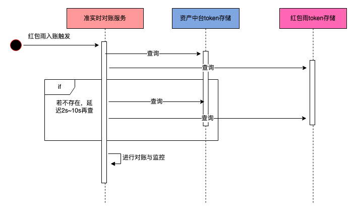

# 百亿级超大流量红包架构方案

:::info
话说每逢双十一节或春节等节假日，对大家来讲是最欢乐的日子，可以在微信群中收发红包，此外今年微信还推出了面对面红包，让大家拜年时可直接收发，对于用户来讲很爽也很方便。但对于技术架构侧的考量，这使得微信红包的收发数据成几何倍数上升，处理的复杂度也增加了很多。

2017年微信红包发送量最大的时间段是除夕夜，达到了142亿个。

如此大规模、高并发、高峰值的业务场景，怕是在美帝互联网的技术团队，包括EBay、Amazon等也无法想象，在这种巨大的流量与并发后面，需要什么样级别的技术架构支撑？

当达百亿级别的资金交易规模时，我们该怎样来保证系统的并发性能和交易安全？

当今中国的互联网平台，有两个场景称得上亿级以上的并发量：

一个是微信的红包，

一个是字节的红包，

都是在一个单位时间达到亿万以以上的请求负载。

:::

### 百亿级微信红包技术架构

与传统意义上的红包相比，近两年火起来的“红包”，似乎才是如今春节的一大重头戏。历经上千年时代传承与变迁，春节发红包早已成为历史沉淀的文化习俗，融入了民族的血脉。按照各家公布的数据，除夕全天微信用户红包总发送量达到80.8亿个，红包峰值收发量为40.9万个/秒。春晚直播期间讨论春晚的微博达到5191万条，网友互动量达到1.15亿，网友抢微博红包的总次数超过8亿次。

微信红包在经过15年春晚摇一摇之后，2015年上半年业务量一度呈指数级增长。尤其是微信红包活跃用户数的大量增长，使得2016除夕跨年红包成为极大挑战。为了应对16年春节可预知的红包海量业务，红包系统在架构上进行了一系列调整和优化。主要包括异地架构、cache系统优化、拆红包并发策略优化、存储优化一系列措施，为迎接2016春节红包挑战做好准备。 下面介绍最主要的一些思路。

#### 架构

微信用户在国内有深圳、上海两个接入点，习惯性称之为南、北（即深圳为南，上海为北）。用户请求接入后，不同业务根据业务特性选择部署方式。微信红包在信息流上可以分为订单纬度与用户纬度。

其中订单是贯穿红包发、抢、拆、详情列表等业务的关键信息，属于交易类信息；而用户纬度指的是红包用户的收红包列表、发红包列表，属于展示类信息。红包系统在架构上，有以下几个方面：

##### **南北分布**

1、订单层南北独立体系，数据不同步

用户就近接入，请求发红包时分配订单南北，并在单号打上南北标识。抢红包、拆红包、查红包详情列表时，接入层根据红包单号上的南北标识将流量分别引到南北系统闭环。根据发红包用户和抢红包用户的所属地不同，有以下四种情况：

1）深圳用户发红包，深圳用户抢

订单落在深圳，深圳用户抢红包时不需要跨城，在深圳完成闭环。

2）深圳用户发红包，上海用户抢

订单落在深圳，上海用户抢红包，在上海接入后通过专线跨城到深圳，最后在深圳闭环完成抢红包。

3）上海用户发红包，上海用户抢

订单落在上海，上海用户抢红包时不需要跨城，在上海完成闭环。

4）上海用户发红包，深圳用户抢

订单落在上海，深圳用户抢红包，从深圳接入后通过专线跨城到上海，最后在上海闭环完成抢红包。

系统这样设计，好处是南北系统分摊流量，降低系统风险。


2、用户数据写多读少，全量存深圳，异步队列写入，查时一边跨城

用户数据的查询入口，在微信钱包中，隐藏的很深。这决定了用户数据的访问量不会太大，而且也被视为可旁路的非关键信息，实时性要求不高。因此，只需要在发红包、拆红包时，从订单纬度拆分出用户数据写入请求，由MQ异步写入深圳。后台将订单与用户进行定时对账保证数据完整性即可。

3、支持南北流量灵活调控

红包系统南北分布后，订单落地到深圳还是上海，是可以灵活分配的，只需要在接入层上做逻辑。例如，可以在接入层中，实现让所有红包请求，都落地到深圳（无论用户从上海接入，还是深圳接入），这样上海的红包业务系统将不会有请求量。提升了红包系统的容灾能力。同时，实现了接入层上的后台管理系统，实现了秒级容量调控能力。可根据南北请求量的实时监控，做出对应的调配。

4、DB故障时流量转移能力 基于南北流量的调控能力，当发现DB故障时，可将红包业务流量调到另外一边，实现DB故障的容灾。

预订单

支付前订单落cache，同时利用cache的原子incr操作顺序生成红包订单号。优点是cache的轻量操作，以及减少DB废单。在用户请求发红包与真正支付之间，存在一定的转化率，部分用户请求发红包后，并不会真正去付款。

##### **拆红包入账异步化**

信息流与资金流分离。

拆红包时，DB中记下拆红包凭证，然后异步队列请求入账。

入账失败通过补偿队列补偿，最终通过红包凭证与用户账户入账流水对账，保证最终一致性。如下图所示：


这个架构设计，理论基础是快慢分离。

红包的入账是一个分布事务，属于慢接口。

而拆红包凭证落地则速度快。

实际应用场景中，用户抢完红包，只关心详情列表中谁是“最佳手气”，很少关心抢到的零是否已经到账。

因为只需要展示用户的拆红包凭证即可。

##### **发拆落地，其他操作双层cache**

1、Cache住所有查询，两层cache

除了使用ckv做全量缓存，还在数据访问层dao中增加本机内存cache做二级缓存，cache住所有读请求。

查询失败或者查询不存在时，降级内存cache；内存cache查询失败或记录不存在时降级DB。

**DB本身不做读写分离。**

2、DB写同步cache，容忍少量不一致， DB写操作完成后，dao中同步内存cache，业务服务层同步ckv，失败由异步队列补偿，

定时的ckv与DB备机对账，保证最终数据一致。

#### 高并发

微信红包的并发挑战，主要在于微信大群，多人同时抢同一个红包。

以上这种情况，存在竞争MySQL行锁。为了控制这种并发，团队做了以下一些事情：

**1、请求按红包订单路由，逻辑块垂直sticky，事务隔离**

按红包订单划分逻辑单元，单元内业务闭环。服务rpc调用时，使用红包订单号的hash值为key寻找下一跳地址。对同一个红包的所有拆请求、查询请求，都路由到同一台逻辑机器、同一台DB中处理。


**2、Dao搭建本机Memcache内存cache，控制同一红包并发个数**

在DB的接入机dao中，搭建本机内存cache。以红包订单号为key，对同一个红包的拆请求做原子计数，控制同一时刻能进DB中拆红包的并发请求数。

这个策略的实施，依赖于请求路由按红包订单hash值走，确保同一红包的所有请求路由到同一逻辑层机器。

**3、多层级并发量控制**

1）发红包控制

发红包是业务流程的入口，控制了这里的并发量，代表着控制了红包业务整体的并发量。在发红包的业务链路里，做了多层的流量控制，确保产生的有效红包量级在可控范围。

2）抢红包控制

微信红包领取时分为两个步骤，抢和拆。

抢红包这个动作本身就有控制拆并发的作用。因为抢红包时，只需要查cache中的数据，不需要请求DB。

对于红包已经领完、用户已经领过、红包已经过期等流量可以直接拦截。而对于有资格进入拆红包的请求量，也做流量控制。通过这些处理，最后可进入拆环节的流量大大减少，并且都是有效请求。

3）拆时内存cache控制

针对同一个红包并发拆的控制，上面的文章已介绍。

**4、DB简化和拆分**

DB的并发能力，有很多影响因素。红包系统结合红包使用情境，进行了一些优化。比较有借鉴意义的，主要有以下两点：

1）订单表只存关键字段，其他字段只在cache中存储，可柔性。

红包详情的展示中，除了订单关键信息（用户、单号、金额、时间、状态）外，还有用户头像、昵称、祝福语等字段。这些字段对交易来说不是关键信息，却占据大量的存储空间。

将这些非关键信息拆出来，只存在cache，用户查询展示，而订单中不落地。

这样可以维持订单的轻量高效，同时cache不命中时，又可从实时接口中查询补偿，达到优化订单DB容量的效果。

2）DB双重纬度分库表，冷热分离

使用订单hash、订单日期，两个纬度分库表，也即db_xxx.t_x_dd这样的格式。

其中，x表示订单hash值，dd表示01-31循环日。

订单hash纬度，是为了将订单打散到不同的DB服务器中，均衡压力。

订单日期循环日纬度，是为了避免单表数据无限扩张，使每天都是一张空表。

另外，红包的订单访问热度，是非常典型的冷热型。

热数据集中在一两天内，且随时间急剧消减。

线上热数据库只需要存几天的数据，其他数据可以定时移到成本低的冷数据库中。

循环日表也使得历史数据的迁移变得方便。

##### **红包算法**

首先，如果红包只有一个，本轮直接使用全部金额，确保红包发完。

然后，计算出本轮红包最少要领取多少，才能保证红包领完，即本轮下水位；轮最多领取多少，才能保证每个人都领到，即本轮上水位。主要方式如下：

计算本轮红包金额下水位：假设本轮领到最小值1分，那接下来每次都领到200元红包能领完，那下水位为1分；如果不能领完，那按接下来每次都领200元，剩下的本轮应全部领走，是本轮的下水位。

计算本轮红包上水位：假设本轮领200元，剩下的钱还足够接下来每轮领1分钱，那本轮上水位为200元；如果已经不够领，那按接下来每轮领1分，计算本轮的上水位。

为了使红包金额不要太悬殊，使用红包均值调整上水位。如果上水位金额大于两倍红包均值，那么使用两倍红包均值作为上水位。换句话说，每一轮抢到的红包金额，最高为两倍剩下红包的均值。

最后，获取随机数并用上水位取余，如果结果比下水位还小，则直接使用下水位，否则使用随机金额为本轮拆到金额。

##### **柔性降级方案**

系统到处存在发生异常的可能，需要对所有的环节做好应对的预案。

下面列举微信红包对系统异常的主要降级考虑。

1、 下单cache故障降级DB

下单cache有两个作用，生成红包订单与订单缓存。

缓存故障情况下，降级为直接落地DB，并使用id生成器独立生成订单号。

2、 抢时cache故障降级DB

抢红包时，查询cache，拦截红包已经抢完、用户已经抢过、红包已经过期等无效请求。当cache故障时，降级DB查询，同时打开DB限流保护开关，防止DB压力过大导致服务不可用。

另外，cache故障降级DB时，DB不存储用户头像、用户昵称等（上文提到的优化），此时一并降级为实时接口查询。查询失败，继续降级为展示默认头像与昵称。

3、 拆时资金入账多级柔性

拆红包时，DB记录拆红包单据，然后执行资金转账。单据需要实时落地，而资金转账，这里做了多个层级的柔性降级方案：

大额红包实时转账，小额红包入队列异步转账 所有红包进队列异步转账 实时流程不执行转账，事后凭单据批量入账。

总之，单据落地后，真实入账可实时、可异步，最终保证一致即可。

4、 用户列表降级

用户列表数据在微信红包系统中，属于非关键路径信息，属于可被降级部分。

首先，写入时通过MQ异步写，通过定时对账保证一致性。

其次，cache中只缓存两屏，用户查询超过两屏则查用户列表DB。在系统压力大的情况下，可以限制用户只查两屏。

调整后的系统经过了2016年春节的实践检验，平稳地度过了除夕业务高峰，保障了红包用户的体验。

上文参考来源：架构说公众号，作者：方乐明

方乐明，2011年毕业于华南理工大学通信与信息系统专业，毕业后就职于财付通科技有限公司。微信支付团队组建后，主要负责微信红包、微信转账、AA收款等支付应用产品的后台架构。

### 360w QPS 100亿级 字节红包 体系架构

#### 1. 背景&挑战&目标

##### 1.1 业务背景

（1）**支持八端**：

2022 年字节系产品春节活动需要支持八端 APP 产品（包含抖音/抖音火山/抖音极速版/西瓜/头条/头条极速版/番茄小说/番茄畅听）的奖励互通。用户在上述任意一端都可以参与活动，得到的奖励在其他端都可以提现与使用。

（2）**玩法多变**：

主要有集卡、朋友页红包雨、红包雨、集卡开奖与烟火大会等。

（3）**多种奖励**：

奖励类型包含现金红包、补贴视频红包、商业化广告券、电商券、支付券、消费金融券、保险券、信用卡优惠券、喜茶券、电影票券、dou+券、抖音文创券、头像挂件等。

##### 1.2 核心挑战

（1）超高吞吐，超大并发，最高预估 360w QPS 发奖。

（2）奖励类型多，共 10 余种奖励。多种发奖励的场景，玩法多变；

（3）从奖励系统稳定性、用户体验、资金安全与运营基础能力全方位保障，确保活动顺利进行 。

##### 1.3 最终目标

（1）**奖励入账**：数据高可靠。提供统一的错误处理机制，入账幂等能力和奖励预算控制。

（2）**奖励展示/使用：**支持用户查看、提现（现金），使用卡券/挂件等能力。

（3）**稳定性保障**：在大流量的入账场景下，保证钱包核心路径稳定性与完善，通过常用稳定性保障手段如资源扩容、限流、熔断、降级、兜底、资源隔离等方式保证用户奖励方向的核心体验。

（4）**资金安全**：通过幂等、对账、监控与报警等机制，保证资金安全，保证用户资产应发尽发，不少发。

（5）**活动隔离**：实现内部测试、灰度放量和正式春节活动三个阶段的奖励入账与展示的数据隔离，不互相影响。

#### 2. 产品需求介绍

用户可以在任意一端参与字节的春节活动获取奖励，以抖音红包雨现金红包入账场景为例，具体的业务流程如下：

登录抖音 → 参与活动 → 活动钱包页 → 点击提现按钮 → 进入提现页面 → 进行提现 → 提现结果页，

另外从钱包页也可以进入活动钱包页。


奖励发放核心场景：

1. **集卡**：集卡抽卡时发放各类卡券，集卡锦鲤还会发放大额现金红包，集卡开奖时发放瓜分奖金和优惠券；
2. **红包雨**：发红包、卡券以及视频补贴红包，其中红包和卡券最高分别 180w QPS；


#### 3. 钱包资产中台设计与实现

在 2022 年春节活动中，业务方分为：

UG、激励中台、视频红包、钱包方向、资产中台等

其中，UG 主要负责活动的玩法实现，包含集卡、红包雨以及烟火大会等具体的活动相关业务逻辑和稳定性保障。

而钱包方向定位是大流量场景下实现奖励入账、奖励展示、奖励使用与资金安全保障的相关任务。

其中资产中台负责**奖励发放与奖励展示**部分。

##### 3.1 春节资产资产中台总体架构图如下


钱包资产中台核心系统划分如下：

1. **资产订单层**：

收敛八端奖励入账链路，

提供统一的接口协议，对接上游活动业务方的奖励发放功能，

同时，支持预算控制、补偿、订单号幂等。

2. **活动钱包 api 层**：

统一奖励展示链路，同时支持大流量场景

##### 3.2 资产订单中心设计

**核心发放模型：**


**说明：**

活动 ID 唯一区分一个活动，

本次春节分配了一个单独的母活动 ID

场景 ID 和具体的一种奖励类型一一对应，

定义该场景下发奖励的唯一配置，

场景 ID 可以配置的能力有：

+ 发奖励账单文案；
+ 是否需要补偿；
+ 限流配置；
+ 是否进行库存控制；
+ 是否要进行对账。
+ 提供可插拔的能力，供业务可选接入。

**订单号设计：**

资产订单层支持订单号维度的发奖幂等，订单号设计逻辑为

`${actID}_${scene_id}_${rain_id}_${award_type}_${statge}`

从单号设计层面保证不超发，每个场景的奖励用户最多只领一次。

#### 4. 核心难点问题解决

##### 4.1 难点一：支持八端奖励数据互通

有八个产品端，需要统一对接，

其中抖音系和头条系 APP 是不同的账号体系，所以不能通过用户 ID 打通奖励互通。

具体解决方案是：

+ 给每个用户生成唯一的 actID
+ 手机号优先级最高，如果不同端登录的手机号一样，在不同端的 actID 是一致的。

在唯一 actID 基础上，每个用户的奖励数据是绑定在 actID 上的，入账和查询是通过 actID 维度实现的，即可实现八端奖励互通。

示意图如下：


##### 4.2 难点二：高场景下的奖励入账实现

超高并发场景，发现金红包都是最关键的一环。有几个原因如下：

1. 预估发现金红包最大流量有 180w TPS。
2. 现金红包本身价值高，需要保证资金安全。
3. 用户对现金的敏感度很高，在保证用户体验与功能完整性同时也要考虑成本问题。

终上所述，**发现金红包面临比较大的技术挑战。**

发红包其实是一种交易行为，资金流走向是从公司成本出然后进入个人账户。

（1）从技术方案上是要支持订单号维度的幂等，同一订单号多次请求只入账一次。订单号生成逻辑为

`${actID}_${scene_id}_${rain_id}_${award_type}_${statge}`

从单号设计层面保证不超发。

（2）支持高并发，有以下 2 个传统方案：

| **具体方案类型** | **实现思路** | **优点** | **缺点** |
| :---: | :---: | :---: | :---: |
| 同步入账 | 申请和预估流量相同的计算和存储资源 | 1.开发简单； 2.不容易出错； | **浪费存储成本。** 拿账户数据库举例，经实际压测结果：支持 30w 发红包需要 152 个数据库实例，如果支持 180w 发红包，至少需要 1152 个数据库实例，还没有算上 tce 和 redis 等其他计算和存储资源。 |
| 异步入账 | 申请部分计算和存储资源资源，实际入账能力与预估有一定差值 | 1.开发简单； 2.不容易出错； 3.不浪费资源； | **用户体验受到很大影响。** 入账延迟较大，以今年活动举例会有十几分钟延迟。用户参与玩法得到奖励后在活动钱包页看不到奖励，也无法进行提现，会有大量客诉，影响抖音活动的效果。 |

以上两种传统意义上的技术方案都有明显的缺点，

那么进行思考，既能相对节约资源又能保证用户体验的方案是什么？

最终采用的是红包雨 token 方案，具体方案是：

**使用异步入账加较少量分布式存储和较复杂方案来实现，**

下面具体介绍一下。

###### 4.2.1 红包雨 token 方案

**根据预估发放红包估算**，红包雨 token 方案, 计算实际入账最低要支持的 TPS 为 30w，所以实际发放中有压单的过程。

**设计目标：**

在活动预估给用户发放（180w）与实际入账（30w）有很大 gap 的情况下，保证用户的核心体验。

用户在前端页面查看与使用过当中不能感知压单的过程，即查看与使用体验不能受到影响，相关展示的数据包含余额，累计收入与红包流水，使用包含提现等。

**具体设计方案：**

我们在大流量场景下每次给用户发红包会生成一个加密 token（**使用非对称加密**，包含发红包的元信息：红包金额，actID，与发放时间等），

分别存储在客户端和服务端（**容灾互备**），每个用户有个 token 列表。

每次发红包的时候会在 Redis 里记录该 token 的入账状态，

然后用户在活动钱包页看到的现金红包流水、余额等数据，是合并已入账红包列表+token 列表-已入账/入账中 token 列表的结果。

同时为保证用户提现体验不感知红包压单流程，

在进入提现页或者点击提现时，将未入账的 token 列表进行强制入账，

保证用户提现时账户的余额为应入账总金额，不 block 用户提现流程。

**示意图如下：**



**token 数据结构：**

token 使用的是 protobuf 格式，

经单测验证存储消耗实际比使用 json 少了一倍，节约请求网络的带宽和存储成本；

同时序列化与反序列化消耗 cpu 也有降低。

```plain
// 红包雨token结构
type RedPacketToken struct {
   AppID      int64  `protobuf: varint,1,opt  json: AppID,omitempty ` // 端ID
   ActID     int64  `protobuf: varint,2,opt  json: UserID,omitempty ` // ActID
   ActivityID string `protobuf: bytes,3,opt  json: ActivityID,omitempty ` // 活动ID
   SceneID    string `protobuf: bytes,4,opt  json: SceneID,omitempty ` // 场景ID
   Amount     int64  `protobuf: varint,5,opt  json: Amount,omitempty ` // 红包金额
   OutTradeNo string `protobuf: bytes,6,opt  json: OutTradeNo,omitempty ` // 订单号
   OpenTime   int64  `protobuf: varint,7,opt  json: OpenTime,omitempty ` // 开奖时间
   RainID     int32  `protobuf: varint,8,opt,name=rainID  json: rainID,omitempty ` // 红包雨ID
   Status     int64  `protobuf: varint,9,opt,name=status  json: status,omitempty ` //入账状态
}
```

**token 安全性保障：**

采用非对称加密算法，保障存储在的客户端尽可能不被破解。

如果 token 加密算法被黑产破译，可监控报警发现，可降级。

##### 4.3 难点三：发奖励链路依赖多的稳定性保障

发红包流程降级示意图如下：


根据历史经验，实现的功能越复杂，依赖会变多，对应的稳定性风险就越高，那么如何保证高依赖的系统稳定性呢？

**解决方案：**

现金红包入账最基础要保障的功能，

是将用户得到的红包进行入账，

核心的功能，需要支持幂等与预算控制（避免超发），

红包账户的幂等设计强依赖数据库保持事务一致性。

但是如果极端情况发生，中间的链路可能会出现问题，如果是弱依赖，需要支持降级掉，不影响发放主流程。

钱包方向发红包**最短路径**为依赖服务实例计算资源和 MySQL 存储资源实现现金红包入账。

发红包强弱依赖梳理图示：

| **psm** | **依赖服务** | **是否强依赖** | **降级方案** | **降级后影响** |
| :---: | :---: | :---: | :---: | :---: |
| 资产中台 | tcc | **是** | 降级读本地缓存 | 无 |
| | bytkekv | 否 | 主动降级开关，跳过 bytekv，依赖下游做幂等 | 无 |
| 资金交易层 | 分布式锁 Redis | 否 | 被动降级，调用失败，直接跳过 | 基本无 |
| | token Redis | 否 | 主动降级开关，不调用 Redis | 用户能感知到入账有延迟，会有很多客诉 |
| | MySQL | **是** | 主有问题，联系 dba 切主 | 故障期间发红包不可用 |

##### 4.4 难点四：大流量发卡券预算控制

大流量集中发券的一个场景，钱包侧与算法策略配合进行卡券发放库存控制，防止超发。

**具体实现：**

（1）钱包资产中台维护每个卡券模板 ID 的消耗发放量。

（2）每次卡券发放前，读取该卡券模板 ID 的消耗量以及总库存数。同时会设置一个阈值，如果卡券剩余量小于 10%后不发这个券（使用兜底券或者祝福语进行兜底）。

（3） 发券流程 累计每个券模板 ID 的消耗量（使用 Redis incr 命令原子累加消耗量），然后与总活动库存进行比对，如果消耗量大于总库存数则拒绝掉，防止超发，也是一个兜底流程。

**具体流程图：**



**优化方向：**

（1）大流量下使用 Redis 计数，单 key 会存在热 key 问题，需要拆分 key 来解决。

（2）大流量场景下，**操作 Redis 会存在超时问题**，返回上游处理中，上游继续重试发券，会多消耗库存少发，本次春节活动实际活动库存在预估库存基础上加了 5%的量级来缓解超时带来的少发问题。

##### 4.5 难点五：高 QPS 场景下的热 key 的读取和写入稳定性保障

最大流量预估读取有 180wQPS，写入 30wQPS。

这是典型的超大流量，热点 key、更新延迟不敏感，非数据强一致性场景（数字是一直累加），

同时要做好**容灾降级处理**，最后实际活动展示的金额与产品预计发放数值误差小于 1%。


###### 4.5.1 方案一

高 QPS 下的读取和写入单 key，比较容易想到的是使用 Redis 分布式缓存来进行实现，但是单 key 读取和写入的会打到一个实例上，压测过单实例的瓶颈为 3w QPS。

所以做的一个优化是拆分多个 key，然后用本地缓存兜底。

**具体写入流程：**

设计拆分 100 个 key，每次发红包根据请求的 actID%100 使用 incr 命令累加该数字，因为不能保证幂等性，所以超时不重试。


**读取流程：**

与写入流程类似，优先读取本地缓存，

如果本地缓存值为为 0，那么去读取各个 Redis 的 key 值累加到一起，进行返回。


**问题：**

（1）拆分 100 个 key 会出现读扩散的问题，需要申请较多 Redis 资源，存储成本比较高。

而且可能存在读取超时问题，不能保证一次读取所有 key 都读取成功，故返回的结果可能会较上一次有减少。

（2）容灾方案方面，如果申请备份 Redis，也需要较多的存储资源，需要的额外存储成本。

###### 4.5.2 方案二

**设计思路：**

在方案一实现的基础上进行优化，

在写场景，通过本地缓存进行合并写请求，进行原子性累加，

读场景返回本地缓存的值，减少额外的存储资源占用。

使用 Redis 实现中心化存储，最终大家读到的值都是一样的。

**具体设计方案：**

每个 docker 实例启动时都会执行定时任务，分为读 Redis 任务和写 Redis 任务。

**读取流程：**

1. 本地的定时任务每秒执行一次，

读取 Redis 单 key 的值，如果获取到的值大于本地缓存那么更新本地缓存的值。

2. 对外暴露的 sdk 直接返回本地缓存的值即可。
3. 有个问题需要注意下，每次实例启动第一秒内是没有数据的，所以会阻塞读，等有数据再返回。

**写入流程：**

1. 因为读取都是读取本地缓存（本地缓存不过期），所以处理好并发情况下的写即可。
2. 本地缓存写变量使用 go 的 atomic.AddInt64 支持原子性累加本地写缓存的值。
3. 每次执行更新 Redis 的定时任务，

先将本地写缓存复制到 amount 变量，最后将 amount 的值 incr 到 Redis 单 key 上，实现 Redis 的单 key 的值一直累加。

4. 容灾方案是使用备份 Redis 集群，写入时进行双写，

一旦主机群挂掉，设计了一个配置开关支持读取备份 Redis。两个 Redis 集群的数据一致性，通过定时任务兜底实现。

具体写入流程图如下：



**本方案调用 Redis 的流量是跟实例数成正比**，

经调研读取侧的服务为主会场实例数 2 万个，写入侧服务为资产中台实例数 8 千个，

所以实际 Redis 要支持的 QPS 为 2.8 万/定时任务执行间隔（单位为 s），

经压测验证 Redis 单实例可以支持单 key2 万 get，8k incr 的操作，

所以设置定时任务的**执行时间间隔是 1s**，如果实例数更多可以考虑延长执行时间间隔。

###### 4.5.3 方案对比

| | **优点** | **缺点** |
| --- | :---: | :---: |
| 方案一 | 1. 实现成本简单 | 1. 浪费存储资源； 2. 难以做容灾； 3. 不能做到一直累加； |
| 方案二 | 1. 节约资源； 2. 容灾方案比较简单，同时也节约资源成本； | 1. 实现稍复杂，需要考虑好并发原子性累加问题 |

**结论：**

从实现效果，资源成本和容灾等方面考虑，最终选择了方案二上线。

##### 4.6 难点六：大流量场景下资金安全保障

钱包方向在本次春节活动期间做了三件事情来保障大流量大预算的现金红包发放的资金安全：

1. 现金红包发放整体预算控制的拦截
2. 单笔现金红包发放金额上限的拦截
3. 大流量发红包场景的资金对账

+ 小时级别对账：支持红包雨/集卡/烟火红包发放 h+1 小时级对账，并针对部分场景设置兜底 h+2 核对。
+ 准实时对账：红包雨已入账的红包数据反查钱包资产中台和活动侧做准实时对账

多维度核对示意图：



准实时对账流程图：



**说明：**

准实时对账监控和报警可以及时发现是否异常入账情况，如果报警发现会有紧急预案处理。

#### 5. 通用模式抽象

在经历过春节超大流量活动后的设计与实现后，有一些总结和经验与大家一起分享一下。

##### 5.1 容灾降级层面

大流量场景，为了保证活动最终上线效果，容灾是一定要做好的。

参考业界通用实现方案，如降级、限流、熔断、资源隔离，根据预估活动参与人数和效果进行使用存储预估等。

###### 5.1.1 限流层面

（1）限流方面应用了 api 层 nginx 入流量限流，分布式入流量限流，分布式出流量限流。

这几个限流器都是字节跳动公司层面公共的中间件，经过大流量的验证。

（2）首先进行了实际单实例压测，根据单实例扛住的流量与本次春节活动预估流量打到该服务的流量进行扩容，并结合下游能抗住的情况，

在 tlb 入流量、入流量限流以及出流量限流分别做好了详细完整的配置并同。

**限流目标：**

保证自身服务稳定性，防止外部预期外流量把本身服务打垮，防止造成雪崩效应，保证核心业务和用户核心体验。

简单集群限流是实例维度的限流，

每个实例限流的 QPS=总配置限流 QPS/实例数，

对于多机器低 QPS 可能会有不准的情况，要**经过实际压测并且及时调整配置值。**

对于分布式入流量和出流量限流，两种使用方式如下，每种方式都支持高低 QPS，区别只是 SDK 使用方式和功能不同。

一般低 QPS 精度要求高，采用 redis 计数方式，使用方提供自己的 redis 集群。

高 QPS 精度要求低，退化为总 QPS/tce 实例数的单实例限流。

###### 5.1.2 降级层面

对于高流量场景，每个核心功能都要有对应的**降级方案**来保证突发情况核心链路的稳定性。

（1）本次春节奖励入账与活动活动钱包页方向做好了充分的操作预案，一共有 26 个降级开关，关键时刻弃车保帅，防止有单点问题影响核心链路。

（2）以发现金红包链路举例，钱包方向最后完全降级的方案是只依赖 docker 和 MySQL，其他依赖都是可以降级掉的，MySQL 主有问题可以紧急联系切主，虽说最后一个都没用上，但是前提要设计好保证活动的万无一失。

###### 5.1.3 资源隔离层面

（1）提升开发效率**不重复造轮子**。

因为钱包资产中台也日常支持抖音资产发放的需求，本次春节活动也复用了现有的接口和代码流程支持发奖。

（2）同时针对本次春节活动，服务层面做了**集群隔离**，

创建专用活动集群，底层存储资源隔离，活动流量和常规流量互不影响。

###### 5.1.4 存储预估

（1）不但要考虑和验证了 Redis 或者 MySQL 存储能抗住对应的流量，同时也要按照实际的获取参与和发放数据等预估存储资源是否足够。

（2）对于字节跳动公司的 Redis 组件来讲，

可以进行**垂直扩容**（每个实例增加存储，最大 10G），也可以进行**水平扩容**（单机房上限是 500 个实例），因为 Redis 是三机房同步的，所以计算存储时只考虑一个机房的存储上限即可。

要留足 buffer，因为水平扩容是很慢的一个过程，突发情况遇到存储资源不足只能通过配置开关提前下掉依赖存储，需要提前设计好。

###### 5.1.5 压测层面

本次春节活动，钱包奖励入账和活动钱包页做了充分的全链路压测验证，下面是一些经验总结。

1. 在压测前要建立好压测整条链路的监控大盘，在压测过程当中及时和方便的发现问题。
2. 对于 MySQL 数据库，在红包雨等大流量正式活动开始前，进行小流量压测预热数据库，峰值流量前提前建链，减少正式活动时的大量建链耗时，保证发红包链路数据库层面的稳定性。
3. 压测过程当中一定要传压测标，支持全链路识别压测流量做特殊逻辑处理，与线上正常业务互不干扰。
4. 针对压测流量不做特殊处理，压测流量处理流程保持和线上流量一致。
5. 压测中要验证计算资源与存储资源是否能抗住预估流量

+ **梳理好压测计划**，基于历史经验，设置合理初始流量，渐进提升压测流量，实时观察各项压测指标。
+ **存储资源压测数据要与线上数据隔离**，对于 MySQL 和 Bytekv 这种来讲是建压测表，对于 Redis 和 Abase 这种来讲是压测 key 在线上 key 基础加一下压测前缀标识 。
+ **压测数据要及时清理**，Redis 和 Abase 这种加短时间的过期时间，过期机制处理比较方便，如果忘记设置过期时间，可以根据写脚本识别压测标前缀去删除。

1. 压测后也要关注存储资源各项指标是否符合预期。

##### 5.2 微服务思考

在日常技术设计中，大家都会遵守微服务设计原则和规范，根据系统职责和核心数据模型拆分不同模块，提升开发迭代效率并不互相影响。

但是微服务也有它的弊端，对于超大流量的场景功能也比较复杂，会经过多个链路，这样是极其消耗计算资源的。

本次春节活动**资产中台提供了 sdk 包代替 rpc 进行微服务链路聚合对外提供基础能力**，如查询余额、判断用户是否获取过奖励，强制入账等功能。访问流量最高上千万，与使用微服务架构对比节约了上万核 CPU 的计算资源。

#### 6. 系统的未来演进方向

（1）梳理上下游需求和痛点，优化资产中台设计实现，完善基础能力，优化服务架构，提供一站式服务，让接入活动方可以更专注进行活动业务逻辑的研发工作。

（2）加强实时和离线数据看板能力建设，让奖励发放数据展示的更清晰更准确。

（3）加强配置化和文档建设，对内减少对接活动的对接成本，对外提升活动业务方接入效率。
