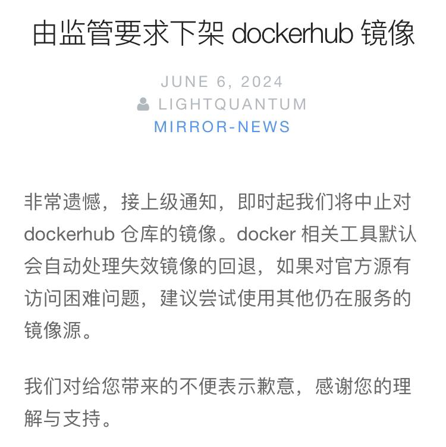

# Docker快速安装+使用

1. 安装docker

```powershell
[root@localhost ~]# yum -y install docker
```

2. 手动启动docker

```powershell
[root@localhost ~]# systemctl start docker
```

3. 查看docker状态

```powershell
[root@localhost ~]# systemctl status docker
● docker.service - Docker Application Container Engine
   Loaded: loaded (/usr/lib/systemd/system/docker.service; enabled; vendor preset: disabled)
   Active: active (running) since Tue 2024-06-04 13:43:05 CST; 31min ago
     Docs: http://docs.docker.com
 Main PID: 4791 (dockerd-current)
    Tasks: 49
   Memory: 11.0M
   CGroup: /system.slice/docker.service
           ├─4791 /usr/bin/dockerd-current --add-runtime docker-runc=/usr/libexec/docker/docker-runc-current --default-runtime=docker-runc --exec-opt ...
           ├─4799 /usr/bin/docker-containerd-current -l unix:///var/run/docker/libcontainerd/docker-containerd.sock --metrics-interval=0 --start-timeo...
           ├─5098 /usr/libexec/docker/docker-proxy-current -proto tcp -host-ip 0.0.0.0 -host-port 18630 -container-ip 172.17.0.2 -container-port 18630...
           └─5105 /usr/bin/docker-containerd-shim-current f34dd9057953cd36f9548c77ff0ec413a40c75ed3be69a46f6a55e4477615565 /var/run/docker/libcontaine...
```

4. 配置镜像

由于政策限制， 很多镜像无法使用， 但是也有很多零星的一些镜像可以用，所以最好用魔

```powershell
 
vim /etc/docker/daemon.json
{
  "registry-mirrors": [
    "https://registry.docker-cn.com",
    "http://hub-mirror.c.163.com",
    "https://docker.mirrors.ustc.edu.cn",
    "https://dockerhub.azk8s.cn",
    "https://mirror.ccs.tencentyun.com",
    "https://registry.cn-hangzhou.aliyuncs.com",
    "https://docker.mirrors.ustc.edu.cn",
    "https://docker.1panel.live",
    "https://atomhub.openatom.cn/",
    "https://hub.uuuadc.top",
    "https://docker.anyhub.us.kg",
    "https://dockerhub.jobcher.com",
    "https://dockerhub.icu",
    "https://docker.ckyl.me",
    "https://docker.awsl9527.cn"
  ]
} 


sudo systemctl daemon-reload
sudo systemctl restart docker 
```

5. 设置docker开机自动启动

```powershell
[root@localhost streamsets]# systemctl enable docker.service
Created symlink from /etc/systemd/system/multi-user.target.wants/docker.service to /usr/lib/systemd/syst
```

 


+ <font style="color:rgba(6, 8, 31, 0.88);">在Docker Hub上查找MySQL镜像的页面：</font>[<font style="color:#117CEE;">MySQL Docker Hub</font>](https://hub.docker.com/)<font style="color:#117CEE;">。</font>

<font style="color:#117CEE;"></font>

## Docker相关命令：
 


重启Docker服务：systemctl restart docker / service docker restart

关闭Docker服务：docker service docker stop / docker systemctl stop docker

停止容器：docker stop 容器ID

重启容器：docker restart 容器ID

删除容器：docker rm container_id

搜索仓库镜像：docker search 镜像名

查看镜像：docker images

拉取镜像：docker pull 镜像名（或docker pull nginx:xxx ，xxx指版本号）

删除镜像：docker rmi image_id

启动（停止的）容器：docker start 容器ID

启动（新）容器：docker run -it ubuntu /bin/bash（或docker run -p 80:80 -d --name nginx nginx:1.24.0，第一个80宿主机端口，第二个80容器端口）

进入容器：docker attach 容器ID或docker exec -it 容器ID /bin/bash，推荐使用后者。

先启动再设置自启动：docker update --restart=always  容器ID

查看正在运行的容器：docker ps

查看所有容器：docker ps -a

查看docker 日志：docker logs -t  -f rabbitmq （docker 容器的默认日志路径/var）

镜像打包：docker save 镜像名称:镜像版本 >打包后的文件名字.tar

将镜像加载到Docker：docker load -i 打包后的文件名字.tar（例子：docker load -i minio.tar）

查看docker内存情况：docker stats -a

 

