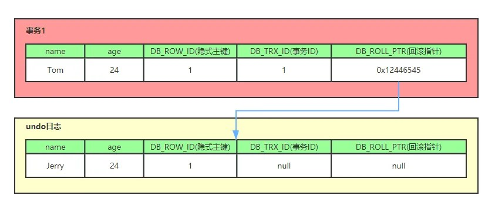
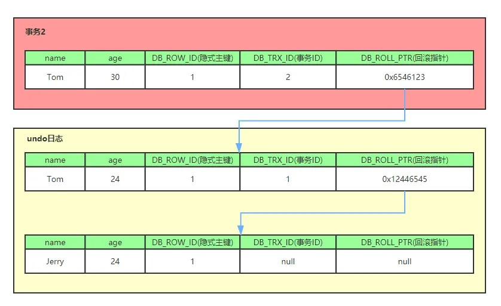
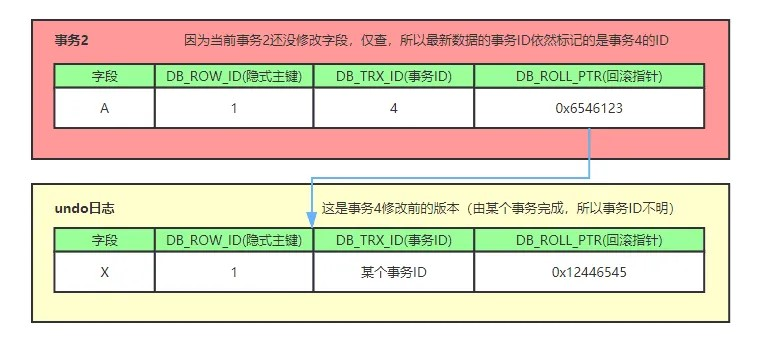
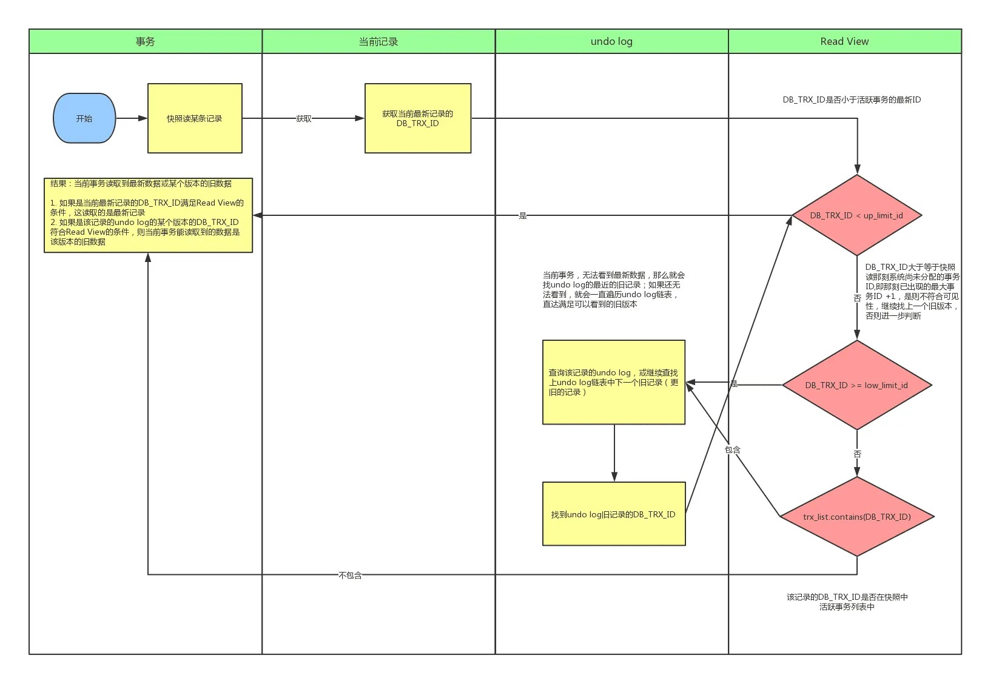

# MySQL InnoDB的MVCC实现机制

> MySQL 中InnoDB中实现了事务（多版本并发控制MVCC+锁）， 其中通过MVCC解决隔离性问题。具体而言，**MVCC就是为了实现读-写冲突不加锁**，而这个读指的就是**快照读**, 而非当前读，当**前读实际上是一种加锁的操作，是悲观锁的实现**; 本文带你理解InnoDB中MVCC的实现机制。
>

## 前提概要
### 什么是MVCC?
> MVCC，全称Multi-Version Concurrency Control，即多版本并发控制。MVCC是一种并发控制的方法，一般在数据库管理系统中，实现对数据库的并发访问，在编程语言中实现事务内存。 
>

MVCC在MySQL InnoDB中的实现主要是为了提高数据库并发性能，用更好的方式去处理读-写冲突，做到即使有读写冲突时，也能做到不加锁，非阻塞并发读

### 什么是当前读和快照读？
> 在学习MVCC多版本并发控制之前，我们必须先了解一下，什么是MySQL InnoDB下的当前读和快照读?
>

+ **当前读**

像select lock in share mode(共享锁), select for update ; update, insert ,delete(排他锁)这些操作都是一种当前读，为什么叫当前读？就是它读取的是记录的最新版本，读取时还要保证其他并发事务不能修改当前记录，会对读取的记录进行加锁

+ **快照读**

像不加锁的select操作就是快照读，即不加锁的非阻塞读；快照读的前提是隔离级别不是串行级别，串行级别下的快照读会退化成当前读；之所以出现快照读的情况，是基于提高并发性能的考虑，快照读的实现是基于多版本并发控制，即MVCC,可以认为MVCC是行锁的一个变种，但它在很多情况下，避免了加锁操作，降低了开销；既然是基于多版本，即快照读可能读到的并不一定是数据的最新版本，而有可能是之前的历史版本

> 说白了**MVCC就是为了实现读-写冲突不加锁**，而这个读指的就是**快照读**, 而非当前读，当**前读实际上是一种加锁的操作，是悲观锁的实现**
>

### 当前读，快照读和MVCC的关系
> 当前读，快照读和MVCC之间是什么关系呢？
>

+ 准确的说，MVCC多版本并发控制指的是 “维持一个数据的多个版本，使得读写操作没有冲突” 这么一个概念。仅仅是一个理想概念
+ 而在MySQL中，实现这么一个MVCC理想概念，我们就需要MySQL提供具体的功能去实现它，而快照读就是MySQL为我们实现MVCC理想模型的其中一个具体非阻塞读功能。而相对而言，当前读就是悲观锁的具体功能实现
+ 要说的再细致一些，快照读本身也是一个抽象概念，再深入研究。MVCC模型在MySQL中的具体实现则是由 **4个隐式字段**，**undo日志** ，**Read View** 等去完成的，具体可以看下面的MVCC实现原理

### MVCC能解决什么问题，好处是？
#### 数据库并发场景?
有三种, 分别为：

+ **读-读**：不存在任何问题，也不需要并发控制
+ **读-写**：有线程安全问题，可能会造成事务隔离性问题，可能遇到脏读，幻读，不可重复读
+ **写-写**：有线程安全问题，可能会存在更新丢失问题，比如第一类更新丢失，第二类更新丢失

#### MVCC带来的好处是？
多版本并发控制（MVCC）是一种用来解决读-写冲突的无锁并发控制，也就是为事务分配单向增长的时间戳，为每个修改保存一个版本，版本与事务时间戳关联，读操作只读该事务开始前的数据库的快照。 所以MVCC可以为数据库解决以下问题

在并发读写数据库时，可以做到在读操作时不用阻塞写操作，写操作也不用阻塞读操作，提高了数据库并发读写的性能 同时还可以解决脏读，幻读，不可重复读等事务隔离问题，但不能解决更新丢失问题

### 小结一下
总之，MVCC就是因为大牛们，不满意只让数据库采用悲观锁这样性能不佳的形式去解决读-写冲突问题，而提出的解决方案，所以在数据库中，因为有了MVCC，所以我们可以形成两个组合：

+ **MVCC + 悲观锁** MVCC解决读写冲突，悲观锁解决写写冲突
+ **MVCC + 乐观锁** MVCC解决读写冲突，乐观锁解决写写冲突

这种组合的方式就可以最大程度的提高数据库并发性能，并解决读写冲突，和写写冲突导致的问题

## MVCC的实现原理
> MVCC的目的就是多版本并发控制，在数据库中的实现，就是为了解决读写冲突，它的实现原理主要是依赖记录中的 **4个隐式字段**，**undo日志** ，**Read View** 来实现的。
>

### 隐式字段
每行记录除了我们自定义的字段外，还有数据库隐式定义的DB_TRX_ID,DB_ROLL_PTR,DB_ROW_ID等字段

+ **DB_ROW_ID** 6byte, 隐含的自增ID（隐藏主键），如果数据表没有主键，InnoDB会自动以DB_ROW_ID产生一个聚簇索引
+ **DB_TRX_ID** 6byte, 最近修改(修改/插入)事务ID：记录创建这条记录/最后一次修改该记录的事务ID
+ **DB_ROLL_PTR** 7byte, 回滚指针，指向这条记录的上一个版本（存储于rollback segment里）
+ **DELETED_BIT** 1byte, 记录被更新或删除并不代表真的删除，而是删除flag变了

如上图，DB_ROW_ID是数据库默认为该行记录生成的唯一隐式主键；DB_TRX_ID是当前操作该记录的事务ID； 而DB_ROLL_PTR是一个回滚指针，用于配合undo日志，指向上一个旧版本；delete flag没有展示出来。

### undo日志
InnoDB把这些为了回滚而记录的这些东西称之为undo log。这里需要注意的一点是，由于查询操作（SELECT）并不会修改任何用户记录，所以在查询操作执行时，并不需要记录相应的undo log。undo log主要分为3种：

+ **Insert undo log** ：插入一条记录时，至少要把这条记录的主键值记下来，之后回滚的时候只需要把这个主键值对应的记录删掉就好了。
+ **Update undo log**：修改一条记录时，至少要把修改这条记录前的旧值都记录下来，这样之后回滚时再把这条记录更新为旧值就好了。
+ **Delete undo log**：删除一条记录时，至少要把这条记录中的内容都记下来，这样之后回滚时再把由这些内容组成的记录插入到表中就好了。 
    - 删除操作都只是设置一下老记录的DELETED_BIT，并不真正将过时的记录删除。
    - 为了节省磁盘空间，InnoDB有专门的purge线程来清理DELETED_BIT为true的记录。为了不影响MVCC的正常工作，purge线程自己也维护了一个read view（这个read view相当于系统中最老活跃事务的read view）;如果某个记录的DELETED_BIT为true，并且DB_TRX_ID相对于purge线程的read view可见，那么这条记录一定是可以被安全清除的。

对MVCC有帮助的实质是**update undo log** ，undo log实际上就是存在rollback segment中旧记录链，它的执行流程如下：

1. **比如有个事务插入persion表插入了一条新记录，记录如下，name为Jerry, age为24岁，隐式主键是1，事务ID和回滚指针，我们假设为NULL**

1. **现在来了一个事务1对该记录的name做出了修改，改为Tom**
    1. 在事务1修改该行(记录)数据时，数据库会先对该行加排他锁
    2. 然后把该行数据拷贝到undo log中，作为旧记录，即在undo log中有当前行的拷贝副本
    3. 拷贝完毕后，修改该行name为Tom，并且修改隐藏字段的事务ID为当前事务1的ID, 我们默认从1开始，之后递增，回滚指针指向拷贝到undo log的副本记录，即表示我的上一个版本就是它
    4. 事务提交后，释放锁	

1. **又来了个事务2修改person表的同一个记录，将age修改为30岁**
    1. 在事务2修改该行数据时，数据库也先为该行加锁
    2. 然后把该行数据拷贝到undo log中，作为旧记录，发现该行记录已经有undo log了，那么最新的旧数据作为链表的表头，插在该行记录的undo log最前面
    3. 修改该行age为30岁，并且修改隐藏字段的事务ID为当前事务2的ID, 那就是2，回滚指针指向刚刚拷贝到undo log的副本记录
    4. 事务提交，释放锁

从上面，我们就可以看出，不同事务或者相同事务的对同一记录的修改，会导致该记录的undo log成为一条记录版本线性表，即链表，undo log的链首就是最新的旧记录，链尾就是最早的旧记录（当然就像之前说的该undo log的节点可能是会purge线程清除掉，向图中的第一条insert undo log，其实在事务提交之后可能就被删除丢失了，不过这里为了演示，所以还放在这里）

### Read View(读视图)
> 什么是Read View，说白了Read View就是事务进行快照读操作的时候生产的读视图(Read View)，在该事务执行的快照读的那一刻，会生成数据库系统当前的一个快照，记录并维护系统当前活跃事务的ID(**当每个事务开启时(执行 SQL 的时候**)，都会被分配一个ID, 这个ID是递增的，所以最新的事务，ID值越大)
>

所以我们知道 Read View主要是用来做可见性判断的, 即当我们某个事务执行快照读的时候，对该记录创建一个Read View读视图，把它比作条件用来判断当前事务能够看到哪个版本的数据，即可能是当前最新的数据，也有可能是该行记录的undo log里面的某个版本的数据。

Read View遵循一个可见性算法，主要是将要被修改的数据的最新记录中的DB_TRX_ID（即当前事务ID）取出来，与系统当前其他活跃事务的ID去对比（由Read View维护），如果DB_TRX_ID跟Read View的属性做了某些比较，不符合可见性，那就通过DB_ROLL_PTR回滚指针去取出Undo Log中的DB_TRX_ID再比较，即遍历链表的DB_TRX_ID（从链首到链尾，即从最近的一次修改查起），直到找到满足特定条件的DB_TRX_ID, 那么这个DB_TRX_ID所在的旧记录就是当前事务能看见的最新老版本

> 那么这个判断条件是什么呢？
>

我们可以把Read View简单的理解成有四个全局属性

> + **trx_list** 未提交事务ID列表，用来维护Read View生成时刻系统正活跃的事务ID
> + **up_limit_id** 记录trx_list列表中事务ID最小的ID
> + **low_limit_id** ReadView生成时刻系统尚未分配的下一个事务ID，也就是目前已出现过的事务ID的最大值+1
> + **create_trx_id** 创建当前read view的事务ID
>

#### 比较规则
+ 首先比较 DB_TRX_ID == create_trx_id，如果等于代表当前 read view 是当前事务创建，能看到DB_TRX_ID 所在的记录。
+ 然后比较 DB_TRX_ID < up_limit_id，如果小于，则当前事务能看到DB_TRX_ID 所在的记录（**已提交事务，可见**），如果大于等于进入下一个判断
+ 接下来判断 DB_TRX_ID >= low_limit_id，如果大于等于则代表DB_TRX_ID 所在的记录在Read View生成后才出现的（**未开始的事务**），那对当前事务肯定不可见，如果小于则进入下一个判断
+ 判断DB_TRX_ID 是否在活跃事务之中（**进行中的事务，可能存在已提交事务，因为存在事务处理速度差异**），如果在，则代表我Read View生成时刻，你这个事务还在活跃，还没有Commit，你修改的数据，当前事务也是看不见的；如果不在，则说明，你这个事务在Read View生成之前就已经Commit了，你修改的结果，当前事务是能看见的

### 整体流程
我们在了解了隐式字段，undo log， 以及Read View的概念之后，就可以来看看MVCC实现的整体流程是怎么样了

整体的流程是怎么样的呢？我们可以模拟一下

当事务2对某行数据执行了快照读，数据库为该行数据生成一个Read View读视图，假设当前事务ID为2，此时还有事务1和事务3在活跃中，事务4在事务2快照读前一刻提交更新了，所以Read View记录了系统当前活跃事务1，3的ID，维护在一个列表上，假设我们称为trx_list

| 事务1 | 事务2 | 事务3 | 事务4 |
| --- | --- | --- | --- |
| 事务开始 | 事务开始 | 事务开始 | 事务开始 |
| … | … | … | 修改且已提交 |
| 进行中 | 快照读 | 进行中 |  |
| … | … | … |  |

Read View不仅仅会通过一个列表**trx_list**来维护事务2执行快照读那刻系统正活跃的事务ID，

还会有两个属性**up_limit_id**（记录trx_list列表中事务ID最小的ID），**low_limit_id**(记录trx_list列表中下一个事务ID，也就是目前已出现过的事务ID的最大值+1)；

所以在这里例子中up_limit_id就是1，low_limit_id就是4 + 1 = 5，trx_list集合的值是1,3，Read View如下图

我们的例子中，只有事务4修改过该行记录，并在事务2执行快照读前，就提交了事务，所以当前该行当前数据的undo log如下图所示；

我们的事务2在快照读该行记录的时候，就会拿**该行记录的DB_TRX_ID**去跟**up_limit_id,low_limit_id和活跃事务ID列表(trx_list)进行比较**，判断当前事务2能看到该记录的版本是哪个。

所以先拿该记录DB_TRX_ID字段记录的事务ID 4去跟Read View的的up_limit_id比较

+ 判断 4 是否小于up_limit_id(1)，所以**不符合条件**
+ 继续判断 4 是否大于等于 low_limit_id(5)，也**不符合条件**
+ 最后判断 4 是否处于trx_list中的活跃事务, 发现事务ID为4的事务不在当前活跃事务列表中, 符合**可见性条件**
+ 所以事务 4 修改后提交的最新结果对事务2快照读时是可见的

因此事务2 能读到的最新数据记录是事务4所提交的版本，而事务4提交的版本也是全局角度上最新的版本。

也正是Read View生成时机的不同，从而造成RC,RR级别下快照读的结果的不同

## MVCC相关问题
### RR是如何在RC级的基础上解决不可重复读的？
当前读和快照读在RR级别下的区别：

表1:

表2:

而在表2这里的顺序中，事务B在事务A提交后的快照读和当前读都是实时的新数据400，这是为什么呢？

这里与上表的唯一区别仅仅是表1的事务B在事务A修改金额前快照读过一次金额数据，而表2的事务B在事务A修改金额前没有进行过快照读。

**所以我们知道事务中快照读的结果是非常依赖该事务首次出现快照读的地方，即某个事务中首次出现快照读的地方非常关键，它有决定该事务后续快照读结果的能力**

**我们这里测试的是更新，同时删除和更新也是一样的，如果事务B的快照读是在事务A操作之后进行的，事务B的快照读也是能读取到最新的数据的**

### RC,RR级别下的InnoDB快照读有什么不同？
正是Read View生成时机的不同，从而造成RC,RR级别下快照读的结果的不同

+ 在RR级别下的某个事务的对某条记录的第一次快照读会创建一个快照及Read View, 将当前系统活跃的其他事务记录起来，此后在调用快照读的时候，还是使用的是同一个Read View，所以只要当前事务在其他事务提交更新之前使用过快照读，那么之后的快照读使用的都是同一个Read View，所以对之后的修改不可见；
+ 即RR级别下，快照读生成Read View时，Read View会记录此时所有其他活动事务的快照，这些事务的修改对于当前事务都是不可见的。而早于Read View创建的事务所做的修改均是可见
+ 而在RC级别下的，事务中，每次快照读都会新生成一个快照和Read View, 这就是我们在RC级别下的事务中可以看到别的事务提交的更新的原因

**总之在RC隔离级别下，是每个快照读都会生成并获取最新的Read View；而在RR隔离级别下，则是同一个事务中的第一个快照读才会创建Read View, 之后的快照读获取的都是同一个Read View**。

+ 版权声明：本文为CSDN博主「SnailMann」的原创文章，遵循CC 4.0 BY-SA版权协议，转载请附上原文出处链接及本声明。
+ 原文链接：https: //blog.csdn.net/SnailMann/article/details/94724197

