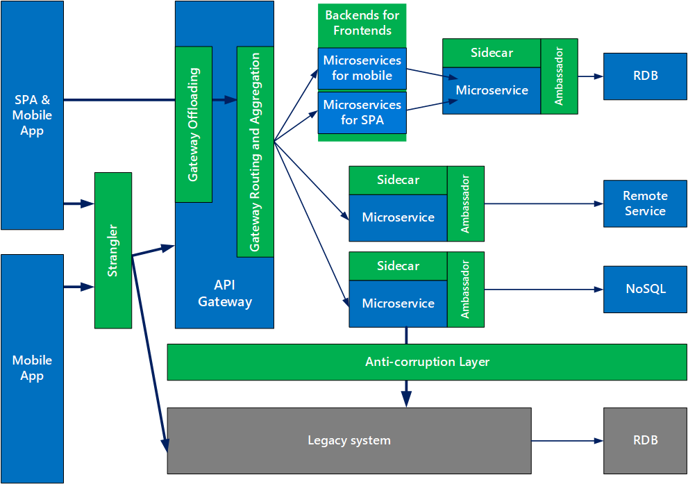

# 微服务设计的9种设计模式

下图是微软团队建议如何在微服务架构中使用这些模式：

文中提到的 9 个模式包括：外交官模式（Ambassador），防腐层（Anti-corruption layer），后端服务前端（Backends for Frontends），舱壁模式（Bulkhead），网关聚合（Gateway Aggregation），网关卸载（Gateway Offloading），网关路由（Gateway Routing），挎斗模式（Sidecar）和绞杀者模式（Strangler）。这些模式绝大多数也是目前业界比较常用的模式，如：

+ 外交官模式（Ambassador）可以用与语言无关的方式处理常见的客户端连接任务，如监视，日志记录，路由和安全性（如 TLS）。
+ 防腐层（Anti-corruption layer）介于新应用和遗留应用之间，用于确保新应用的设计不受遗留应用的限制。
+ 后端服务前端（Backends for Frontends）为不同类型的客户端（如桌面和移动设备）创建单独的后端服务。这样，单个后端服务就不需要处理各种客户端类型的冲突请求。这种模式可以通过分离客户端特定的关注来帮助保持每个微服务的简单性。
+ 舱壁模式（Bulkhead）隔离了每个工作负载或服务的关键资源，如连接池、内存和 CPU。使用舱壁避免了单个工作负载（或服务）消耗掉所有资源，从而导致其他服务出现故障的场景。这种模式主要是通过防止由一个服务引起的级联故障来增加系统的弹性。
+ 网关聚合（Gateway Aggregation）将对多个单独微服务的请求聚合成单个请求，从而减少消费者和服务之间过多的请求。
+ 挎斗模式（Sidecar）将应用程序的辅助组件部署为单独的容器或进程以提供隔离和封装。

设计模式是对针对某一问题域的解决方案，它的出现也代表了工程化的可能。随着微服务在业界的广泛实践，相信这个领域将会走向成熟和稳定，笔者期望会有更多的模式和实践出现，帮助促进这一技术的进一步发展。感兴趣的读者可以参考微软的[微服务设计模式](https://azure.microsoft.com/en-us/blog/design-patterns-for-microservices/)一文以及[Azure 架构中心](https://docs.microsoft.com/en-us/azure/architecture/)的资料为自己的微服务选择合适的模式或者提出新的模式。
