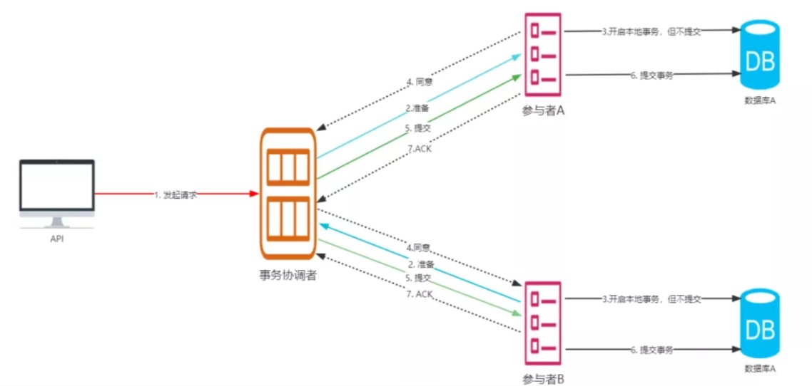
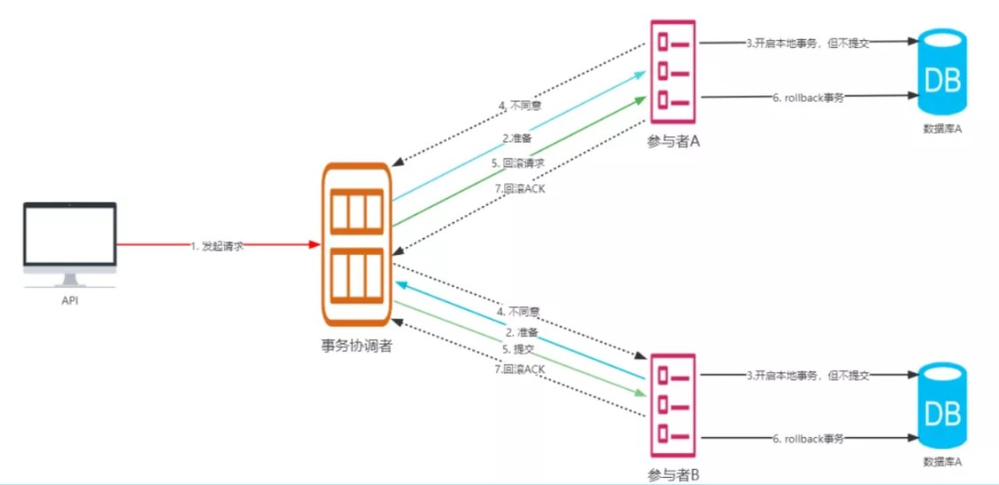
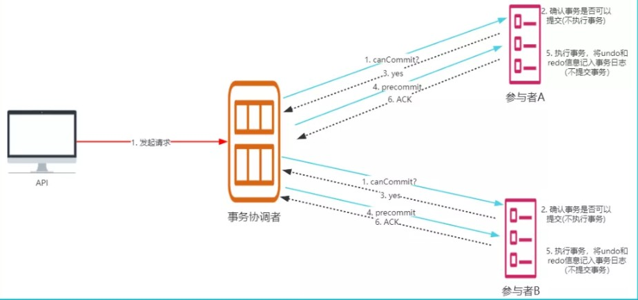
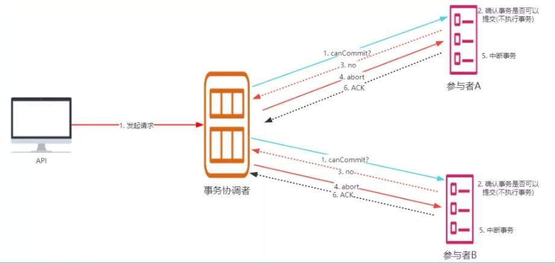
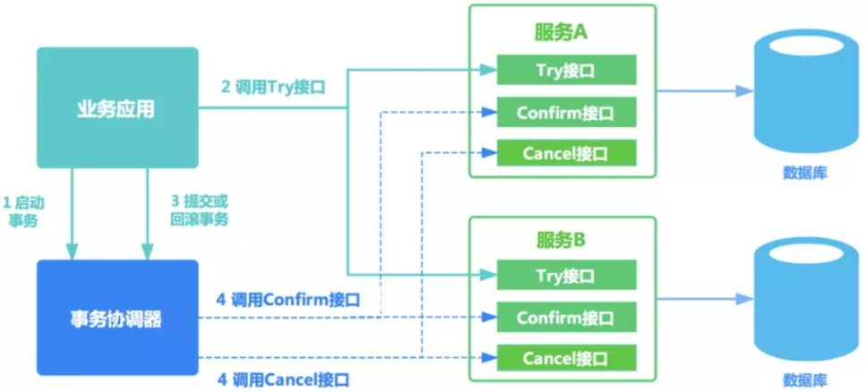
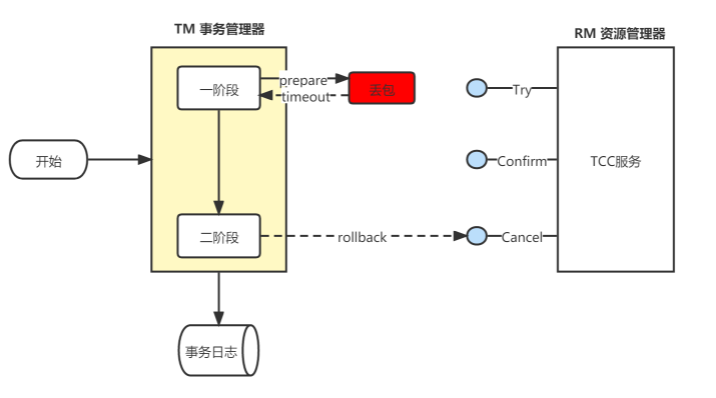
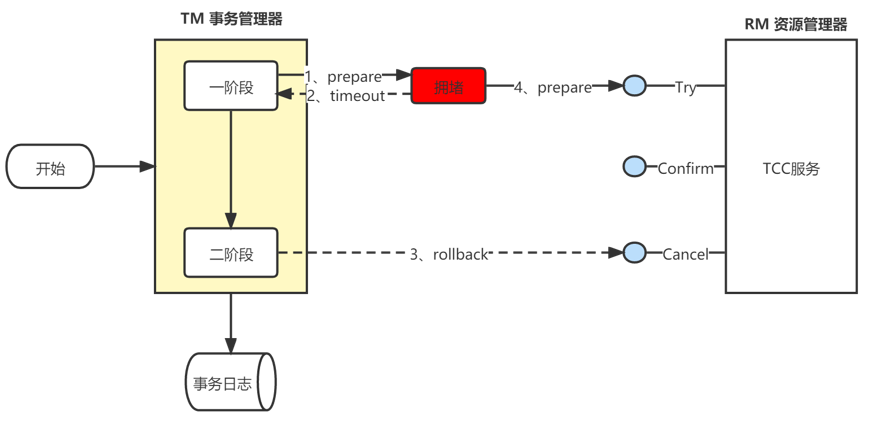
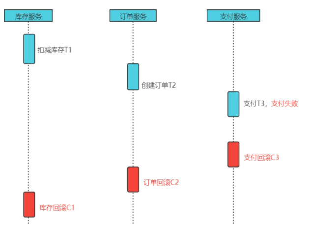
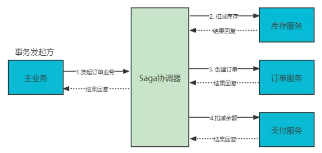

# 分布式事务有哪些常见的实现方案

资：12-25K

岗位：中高级开发工程师

分布式事务：在分布式系统中一次操作需要由多个服务协同完成，这种由不同的服务之间通过网络协同完成的事务称为分布式事务

[bilibili](https://player.bilibili.com/player.html?bvid=BV1mC4y1f7CG&autoplay=0)

## **一、2PC：**
2PC，两阶段提交，将事务的提交过程分为资源准备和资源提交两个阶段，并且由事务协调者来协调所有事务参与者，如果准备阶段所有事务参与者都预留资源成功，则进行第二阶段的资源提交，否则事务协调者回滚资源。

### **1、第一阶段：准备阶段**
由事务协调者询问通知各个事务参与者，是否准备好了执行事务，具体流程图如下：

+ ① 协调者向所有参与者发送事务内容，询问是否可以提交事务，并等待答复
+ ② 各参与者执行本地事务操作，将 undo 和 redo 信息记入事务日志中（但不提交事务）
+ ③ 如参与者执行成功，给协调者反馈同意，否则反馈中止，表示事务不可以执行

### **2、第二阶段：提交阶段**
协调者收到各个参与者的准备消息后，根据反馈情况通知各个参与者commit提交或者rollback回滚

**（1）事务提交：**

当第一阶段所有参与者都反馈同意时，协调者发起正式提交事务的请求，当所有参与者都回复同意时，则意味着完成事务，具体流程如下：

+ ① 协调者节点向所有参与者节点发出正式提交的 commit 请求。
+ ② 收到协调者的 commit 请求后，参与者正式执行事务提交操作，并释放在整个事务期间内占用的资源。
+ ③ 参与者完成事务提交后，向协调者节点发送ACK消息。
+ ④ 协调者节点收到所有参与者节点反馈的ACK消息后，完成事务。

所以，正常提交时，事务的完整流程图如下：

**（2）事务回滚：**

如果任意一个参与者节点在第一阶段返回的消息为中止，或者协调者节点在第一阶段的询问超时之前无法获取所有参与者节点的响应消息时，那么这个事务将会被回滚，具体流程如下：

+ ① 协调者向所有参与者发出 rollback 回滚操作的请求
+ ② 参与者利用阶段一写入的undo信息执行回滚，并释放在整个事务期间内占用的资源
+ ③ 参与者在完成事务回滚之后，向协调者发送回滚完成的ACK消息
+ ④ 协调者收到所有参与者反馈的ACK消息后，取消事务

所以，事务回滚时，完整流程图如下：

 

### **3、2PC的缺点：**
二阶段提交确实能够提供原子性的操作，但是不幸的是，二阶段提交还是有几个缺点的：

（1）性能问题：执行过程中，所有参与节点都是事务阻塞性的，当参与者占有公共资源时，其他第三方节点访问公共资源就不得不处于阻塞状态，为了数据的一致性而牺牲了可用性，对性能影响较大，不适合高并发高性能场景

（2）可靠性问题：2PC非常依赖协调者，当协调者发生故障时，尤其是第二阶段，那么所有的参与者就会都处于锁定事务资源的状态中，而无法继续完成事务操作（如果是协调者挂掉，可以重新选举一个协调者，但是无法解决因为协调者宕机导致的参与者处于阻塞状态的问题）

（3）数据一致性问题：在阶段二中，当协调者向参与者发送commit请求之后，发生了局部网络异常或者在发送commit请求过程中协调者发生了故障，这会导致只有一部分参与者接受到了commit请求。而在这部分参与者接到commit请求之后就会执行commit操作。但是其他部分未接到commit请求的机器则无法执行事务提交。于是整个分布式系统便出现了数据部一致性的现象。

（4）二阶段无法解决的问题：协调者在发出 commit 消息之后宕机，而唯一接收到这条消息的参与者同时也宕机了，那么即使协调者通过选举协议产生了新的协调者，这条事务的状态也是不确定的，没人知道事务是否被已经提交。

## **二、3PC：**
3PC，三阶段提交协议，是二阶段提交协议的改进版本，三阶段提交有两个改动点：

+ （1）在协调者和参与者中都引入超时机制
+ （2）在第一阶段和第二阶段中插入一个准备阶段，保证了在最后提交阶段之前各参与节点的状态是一致的。

所以3PC会分为3个阶段，CanCommit 准备阶段、PreCommit 预提交阶段、DoCommit 提交阶段，处理流程如下：

### **1、阶段一：CanCommit 准备阶段**
协调者向参与者发送 canCommit 请求，参与者如果可以提交就返回Yes响应，否则返回No响应，具体流程如下：

+ （1）事务询问：协调者向所有参与者发出包含事务内容的 canCommit 请求，询问是否可以提交事务，并等待所有参与者答复。
+ （2）响应反馈：参与者收到 canCommit 请求后，如果认为可以执行事务操作，则反馈 yes 并进入预备状态，否则反馈 no。

### **2、阶段二：PreCommit 阶段**
协调者根据参与者的反应情况来决定是否可以进行事务的 PreCommit 操作。根据响应情况，有以下两种可能：

**（1）执行事务：**

假如所有参与者均反馈 yes，协调者预执行事务，具体如下：

+ ① 发送预提交请求：协调者向参与者发送 PreCommit 请求，并进入准备阶段
+ ② 事务预提交 ：参与者接收到 PreCommit 请求后，会执行本地事务操作，并将 undo 和 redo 信息记录到事务日志中（但不提交事务）
+ ③ 响应反馈 ：如果参与者成功的执行了事务操作，则返回ACK响应，同时开始等待最终指令。

**（2）中断事务：**

假如有任何一个参与者向协调者发送了No响应，或者等待超时之后，协调者都没有接到参与者的响应，那么就执行事务的中断，流程如下：

+ ① 发送中断请求 ：协调者向所有参与者发送 abort 请求。
+ ② 中断事务 ：参与者收到来自协调者的 abort 请求之后（或超时之后，仍未收到协调者的请求），执行事务的中断。

 

### **3、阶段三：doCommit阶段**
该阶段进行真正的事务提交，也可以分为以下两种情况：

**（1）提交事务：**

+ ① 发送提交请求：协调接收到所有参与者发送的ACK响应，那么他将从预提交状态进入到提交状态，并向所有参与者发送 doCommit 请求
+ ② 本地事务提交：参与者接收到doCommit请求之后，执行正式的事务提交，并在完成事务提交之后释放所有事务资源
+ ③ 响应反馈：事务提交完之后，向协调者发送ack响应。
+ ④ 完成事务：协调者接收到所有参与者的ack响应之后，完成事务。

**（2）中断事务：**任何一个参与者反馈 no，或者等待超时后协调者尚无法收到所有参与者的反馈，即中断事务

+ ① 发送中断请求：如果协调者处于工作状态，向所有参与者发出 abort 请求
+ ② 事务回滚：参与者接收到abort请求之后，利用其在阶段二记录的undo信息来执行事务的回滚操作，并在完成回滚之后释放所有的事务资源。
+ ③ 反馈结果：参与者完成事务回滚之后，向协调者反馈ACK消息
+ ④ 中断事务：协调者接收到参与者反馈的ACK消息之后，执行事务的中断。

进入doCommit阶段后，无论协调者出现问题，或者协调者与参与者之间的网络出现问题，都会导致参与者无法接收到协调者发出的 doCommit 请求或 abort 请求。此时，参与者都会在等待超时之后，继续执行事务提交。这其实基于概率来决定的，当进入第三阶段时，说明第一阶段收到所有参与者的CanCommit响应都是Yes，意味着大家都同意修改了，并且第二阶段所有的参与者对协调者的PreCommit请求也都是同意的。所以，一句话概括就是，当进入第三阶段时，由于网络超时等原因，虽然参与者没有收到commit或者abort响应，但是他有理由相信：成功提交的几率很大。

### **4、3PC的优缺点：**
与2PC相比，3PC降低了阻塞范围，并且在等待超时后，协调者或参与者会中断事务，避免了协调者单点问题，阶段三中协调者出现问题时，参与者会继续提交事务。

数据不一致问题依然存在，当在参与者收到 preCommit 请求后等待 doCommit 指令时，此时如果协调者请求中断事务，而协调者因为网络问题无法与参与者正常通信，会导致参与者继续提交事务，造成数据不一致。

2PC和3PC都无法保证数据绝对的一致性，一般为了预防这种问题，可以添加一个报警，比如监控到事务异常的时候，通过脚本自动补偿差异的信息。  

## **三、TCC：**
### **1、什么是TCC：**
TCC（Try Confirm Cancel）是应用层的两阶段提交，所以对代码的侵入性强，其核心思想是：针对每个操作，都要实现对应的确认和补偿操作，也就是业务逻辑的每个分支都需要实现 try、confirm、cancel 三个操作，第一阶段由业务代码编排来调用Try接口进行资源预留，当所有参与者的 Try 接口都成功了，事务协调者提交事务，并调用参与者的 confirm 接口真正提交业务操作，否则调用每个参与者的 cancel 接口回滚事务，并且由于 confirm 或者 cancel 有可能会重试，因此对应的部分需要支持幂等。

### **2、TCC的执行流程：**
TCC的执行流程可以分为两个阶段，分别如下：

（1）第一阶段：Try，业务系统做检测并预留资源 (加锁，锁住资源)，比如常见的下单，在try阶段，我们不是真正的减库存，而是把下单的库存给锁定住。

（2）第二阶段：根据第一阶段的结果决定是执行confirm还是cancel

+ Confirm：执行真正的业务（执行业务，释放锁）
+ Cancle：是对Try阶段预留资源的释放（出问题，释放锁）

### **3、TCC如何保证最终一致性：**
+ TCC 事务机制以 Try 为中心的，Confirm 确认操作和 Cancel 取消操作都是围绕 Try 而展开。因此，Try 阶段中的操作，其保障性是最好的，即使失败，仍然有 Cancel 取消操作可以将其执行结果撤销。
+ Try阶段执行成功并开始执行 Confirm 阶段时，默认 Confirm 阶段是不会出错的，也就是说只要 Try 成功，Confirm 一定成功（TCC设计之初的定义）
+ Confirm 与 Cancel 如果失败，由TCC框架进行重试补偿
+ 存在极低概率在CC环节彻底失败，则需要定时任务或人工介入

### **4、TCC的注意事项：**
**（1）允许空回滚：**

空回滚出现的原因是 Try 超时或者丢包，导致 TCC 分布式事务二阶段的 回滚，触发 Cancel 操作，此时事务参与者未收到Try，但是却收到了Cancel 请求，如下图所示：

所以 cancel 接口在实现时需要允许空回滚，也就是 Cancel 执行时如果发现没有对应的事务 xid 或主键时，需要返回回滚成功，让事务服务管理器认为已回滚。

**（2）防悬挂控制：**

悬挂指的是二阶段的 Cancel 比 一阶段的Try 操作先执行，出现该问题的原因是 Try 由于网络拥堵而超时，导致事务管理器生成回滚，触发 Cancel 接口，但之后拥堵在网络的 Try 操作又被资源管理器收到了，但是 Cancel 比 Try 先到。但按照前面允许空回滚的逻辑，回滚会返回成功，事务管理器认为事务已回滚成功，所以此时应该拒绝执行空回滚之后到来的 Try 操作，否则会产生数据不一致。因此我们可以在 Cancel 空回滚返回成功之前，先记录该条事务 xid 或业务主键，标识这条记录已经回滚过，Try 接口执行前先检查这条事务xid或业务主键是否已经标记为回滚成功，如果是则不执行 Try 的业务操作。

**（3）幂等控制：**

由于网络原因或者重试操作都有可能导致 Try - Confirm - Cancel 3个操作的重复执行，所以使用 TCC 时需要注意这三个操作的幂等控制，通常我们可以使用事务 xid 或业务主键判重来控制。

### **5、TCC方案的优缺点：**
（1）TCC 事务机制相比于上面介绍的 XA 事务机制，有以下优点：

+ 性能提升：具体业务来实现，控制资源锁的粒度变小，不会锁定整个资源。
+ 数据最终一致性：基于 Confirm 和 Cancel 的幂等性，保证事务最终完成确认或者取消，保证数据的一致性。
+ 可靠性：解决了 XA 协议的协调者单点故障问题，由主业务方发起并控制整个业务活动，业务活动管理器也变成多点，引入集群。

（2）缺点：TCC 的 Try、Confirm 和 Cancel 操作功能要按具体业务来实现，业务耦合度较高，提高了开发成本。

## **四、Saga事务：**
### **1、什么是Saga事务：**
Saga 事务核心思想是将长事务拆分为多个本地短事务并依次正常提交，如果所有短事务均执行成功，那么分布式事务提交；如果出现某个参与者执行本地事务失败，则由 Saga 事务协调器协调根据相反顺序调用补偿操作，回滚已提交的参与者，使分布式事务回到最初始的状态。Saga 事务基本协议如下：

+ （1）每个 Saga 事务由一系列幂等的有序子事务(sub-transaction) Ti 组成。
+ （2）每个 Ti 都有对应的幂等补偿动作 Ci，补偿动作用于撤销 Ti 造成的结果。

与TCC事务补偿机制相比，TCC有一个预留(Try)动作，相当于先报存一个草稿，然后才提交；Saga事务没有预留动作，直接提交。

### **2、Saga的恢复策略：**
对于事务异常，Saga提供了两种恢复策略，分别如下：

**（1）向后恢复(backward recovery)：**

当执行事务失败时，补偿所有已完成的事务，是“一退到底”的方式，这种做法的效果是撤销掉之前所有成功的子事务，使得整个 Saga 的执行结果撤销。如下图：

从上图可知事务执行到了支付事务T3，但是失败了，因此事务回滚需要从C3,C2,C1依次进行回滚补偿，对应的执行顺序为：T1,T2,T3,C3,C2,C1。

**（2）向前恢复(forward recovery)：**

对于执行不通过的事务，会尝试重试事务，这里有一个假设就是每个子事务最终都会成功，这种方式适用于必须要成功的场景，事务失败了重试，不需要补偿。流程如下图：

### **3、Saga事务的实现方式：**
Saga事务有两种不同的实现方式，分别如下：

+ 命令协调（Order Orchestrator）
+ 事件编排（Event Choreographyo）

**（1）命令协调：**

中央协调器（Orchestrator，简称 OSO）以命令/回复的方式与每项服务进行通信，全权负责告诉每个参与者该做什么以及什么时候该做什么。整体流程如下图：

 

+ ① 事务发起方的主业务逻辑请求 OSO 服务开启订单事务
+ ② OSO 向库存服务请求扣减库存，库存服务回复处理结果。
+ ③ OSO 向订单服务请求创建订单，订单服务回复创建结果。
+ ④ OSO 向支付服务请求支付，支付服务回复处理结果。
+ ⑤ 主业务逻辑接收并处理 OSO 事务处理结果回复。

中央协调器 OSO 必须事先知道执行整个事务所需的流程，如果有任何失败，它还负责通过向每个参与者发送命令来撤销之前的操作来协调分布式的回滚，基于中央协调器协调一切时，回滚要容易得多，因为协调器默认是执行正向流程，回滚时只要执行反向流程即可。

**（2）事件编排：**

命令协调方式基于中央协调器实现，所以有单点风险，但是事件编排方式没有中央协调器。事件编排的实现方式中，每个服务产生自己的事件并监听其他服务的事件来决定是否应采取行动。

在事件编排方法中，第一个服务执行一个事务，然后发布一个事件，该事件被一个或多个服务进行监听，这些服务再执行本地事务并发布（或不发布）新的事件。当最后一个服务执行本地事务并且不发布任何事件时，意味着分布式事务结束，或者它发布的事件没有被任何 Saga 参与者听到都意味着事务结束。

 

+ ① 事务发起方的主业务逻辑发布开始订单事件。
+ ② 库存服务监听开始订单事件，扣减库存，并发布库存已扣减事件。
+ ③ 订单服务监听库存已扣减事件，创建订单，并发布订单已创建事件。
+ ④ 支付服务监听订单已创建事件，进行支付，并发布订单已支付事件。
+ ⑤ 主业务逻辑监听订单已支付事件并处理。

如果事务涉及 2 至 4 个步骤，则非常合适使用事件编排方式，它是实现 Saga 模式的自然方式，它很简单，容易理解，不需要太多的代码来构建。

### **4、Saga事务的优缺点：**
**（1）命令协调设计的优缺点：**

① 优点：

+ 服务之间关系简单，避免服务间循环依赖，因为 Saga 协调器会调用 Saga 参与者，但参与者不会调用协调器。
+ 程序开发简单，只需要执行命令/回复(其实回复消息也是一种事件消息)，降低参与者的复杂性。
+ 易维护扩展，在添加新步骤时，事务复杂性保持线性，回滚更容易管理，更容易实施和测试。

② 缺点：

+ 中央协调器处理逻辑容易变得庞大复杂，导致难以维护。
+ 存在协调器单点故障风险。

**（2）事件编排设计的优缺点：**

① 优点：

+ 避免中央协调器单点故障风险。
+ 当涉及的步骤较少服务开发简单，容易实现。

② 缺点：

+ 服务之间存在循环依赖的风险。
+ 当涉及的步骤较多，服务间关系混乱，难以追踪调测。

由于 Saga 模型没有 Prepare 阶段，因此事务间不能保证隔离性。当多个 Saga 事务操作同一资源时，就会产生更新丢失、脏数据读取等问题，这时需要在业务层控制并发，例如：在应用层面加锁，或者应用层面预先冻结资源。  

## **五、本地消息表：**
### **1、什么是本地消息表：**
本地消息表的核心思路就是将分布式事务拆分成本地事务进行处理，在该方案中主要有两种角色：事务主动方和事务被动方。事务主动发起方需要额外新建事务消息表，并在本地事务中完成业务处理和记录事务消息，并轮询事务消息表的数据发送事务消息，事务被动方基于消息中间件消费事务消息表中的事务。

这样可以避免以下两种情况导致的数据不一致性：

+ 业务处理成功、事务消息发送失败
+ 业务处理失败、事务消息发送成功

### **2、本地消息表的执行流程：**

+ ① 事务主动方在同一个本地事务中处理业务和写消息表操作
+ ② 事务主动方通过消息中间件，通知事务被动方处理事务消息。消息中间件可以基于 Kafka、RocketMQ 消息队列，事务主动方主动写消息到消息队列，事务消费方消费并处理消息队列中的消息。
+ ③ 事务被动方通过消息中间件，通知事务主动方事务已处理的消息。
+ ④ 事务主动方接收中间件的消息，更新消息表的状态为已处理。

一些必要的容错处理如下：

+ 当①处理出错，由于还在事务主动方的本地事务中，直接回滚即可
+ 当②、③处理出错，由于事务主动方本地保存了消息，只需要轮询消息重新通过消息中间件发送，通知事务被动方重新读取消息处理业务即可。
+ 如果是业务上处理失败，事务被动方可以发消息给事务主动方回滚事务
+ 如果事务被动方已经消费了消息，事务主动方需要回滚事务的话，需要发消息通知事务主动方进行回滚事务。

### **3、本地消息表的优缺点：**
（1）优点：

+ 从应用设计开发的角度实现了消息数据的可靠性，消息数据的可靠性不依赖于消息中间件，弱化了对 MQ 中间件特性的依赖。
+ 方案轻量，容易实现。

（2）缺点：

+ 与具体的业务场景绑定，耦合性强，不可公用
+ 消息数据与业务数据同库，占用业务系统资源
+ 业务系统在使用关系型数据库的情况下，消息服务性能会受到关系型数据库并发性能的局限

## **六、MQ事务消息：**
### **1、MQ事务消息的执行流程：**
基于MQ的分布式事务方案本质上是对本地消息表的封装，整体流程与本地消息表一致，唯一不同的就是将本地消息表存在了MQ内部，而不是业务数据库中，如下图：

由于将本地消息表存在了MQ内部，那么MQ内部的处理尤为重要，下面主要基于 RocketMQ4.3 之后的版本介绍 MQ 的分布式事务方案

### **2、RocketMQ事务消息：**
在本地消息表方案中，保证事务主动方发写业务表数据和写消息表数据的一致性是基于数据库事务，而 RocketMQ 的事务消息相对于普通 MQ提供了 2PC 的提交接口，方案如下：

**（1）正常情况：**

在事务主动方服务正常，没有发生故障的情况下，发消息流程如下：

+ 步骤①：发送方向 MQ Server(MQ服务方)发送 half 消息
+ 步骤②：MQ Server 将消息持久化成功之后，向发送方 ack 确认消息已经发送成功
+ 步骤③：发送方开始执行本地事务逻辑
+ 步骤④：发送方根据本地事务执行结果向 MQ Server 提交二次确认（commit 或是 rollback）。
+ 最终步骤：MQ Server 如果收到的是 commit 操作，则将半消息标记为可投递，MQ订阅方最终将收到该消息；若收到的是 rollback 操作则删除 half 半消息，订阅方将不会接受该消息

**（2）异常情况：**

在断网或者应用重启等异常情况下，图中的步骤④提交的二次确认超时未到达 MQ Server，此时的处理逻辑如下：

+ 步骤⑤：MQ Server 对该消息发起消息回查
+ 步骤⑥：发送方收到消息回查后，需要检查对应消息的本地事务执行的最终结果
+ 步骤⑦：发送方根据检查得到的本地事务的最终状态再次提交二次确认。
+ 最终步骤：MQ Server基于 commit/rollback 对消息进行投递或者删除。

### **3、MQ事务消息的优缺点：**
（1）优点：相比本地消息表方案，MQ 事务方案优点是：

+ 消息数据独立存储 ，降低业务系统与消息系统之间的耦合
+ 吞吐量大于使用本地消息表方案

（2）缺点：

+ 一次消息发送需要两次网络请求(half 消息 + commit/rollback 消息) 。
+ 业务处理服务需要实现消息状态回查接口。

## **七、最大努力通知：**
最大努力通知也称为定期校对，是对MQ事务方案的进一步优化。它在事务主动方增加了消息校对的接口，如果事务被动方没有接收到主动方发送的消息，此时可以调用事务主动方提供的消息校对的接口主动获取

在可靠消息事务中，事务主动方需要将消息发送出去，并且让接收方成功接收消息，这种可靠性发送是由事务主动方保证的；但是最大努力通知，事务主动方仅仅是尽最大努力（重试，轮询....）将事务发送给事务接收方，所以存在事务被动方接收不到消息的情况，此时需要事务被动方主动调用事务主动方的消息校对接口查询业务消息并消费，这种通知的可靠性是由事务被动方保证的。

所以最大努力通知适用于业务通知类型，例如微信交易的结果，就是通过最大努力通知方式通知各个商户，既有回调通知，也有交易查询接口。

## **八、各方案常见使用场景总结：**
+ **2PC/3PC**：依赖于数据库，能够很好的提供强一致性和强事务性，但延迟比较高，比较适合传统的单体应用，在同一个方法中存在跨库操作的情况，不适合高并发和高性能要求的场景。
+ **TCC**：准备阶段业务多，锁粒度小，性能要求高，  只要把try、confirm、cancel各阶段的逻辑捋清楚就可以使用TCC了， 但是存在业务耦合。
+ **本地消息表/MQ 事务**：适用于事务中参与方支持操作幂等，对一致性要求不高，业务上能容忍数据不一致到一个人工检查周期，事务涉及的参与方、参与环节较少，业务上有对账/校验系统兜底。
+ **Saga 事务**：由于 Saga 事务不能保证隔离性，需要在业务层控制并发，适合于业务场景事务并发操作同一资源较少的情况。Saga 由于缺少预提交动作，导致补偿动作的实现比较麻烦，例如业务是发送短信，补偿动作则得再发送一次短信说明撤销，用户体验比较差。所以，Saga 事务较适用于补偿动作容易处理的场景

