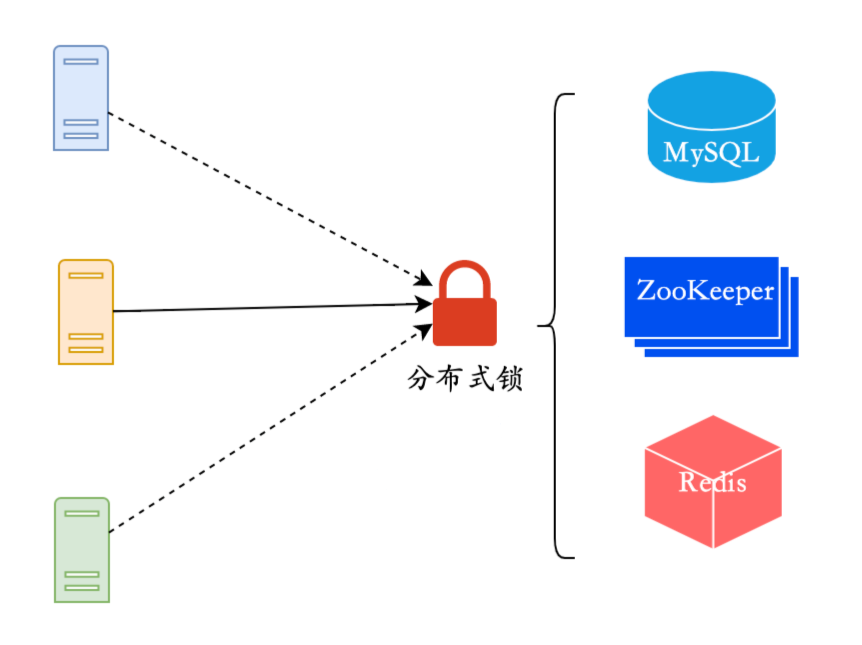
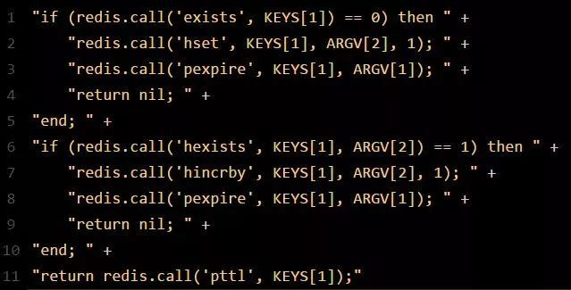
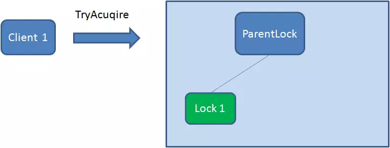
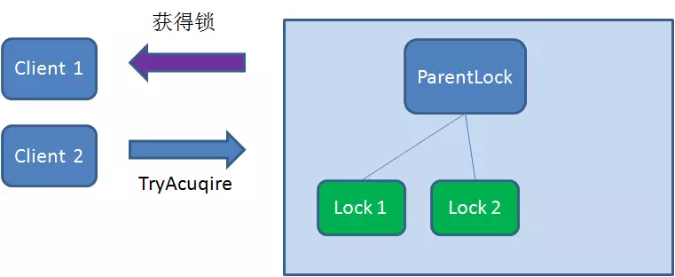
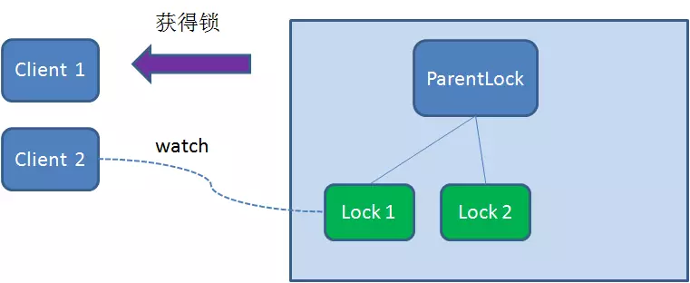
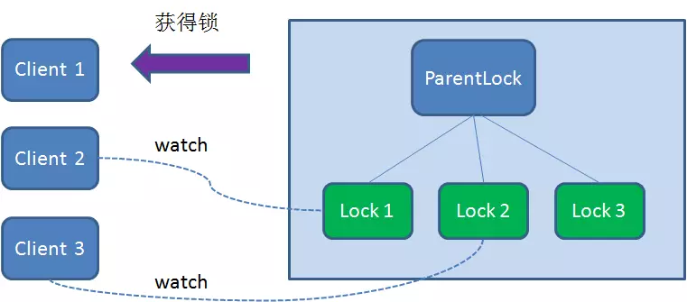
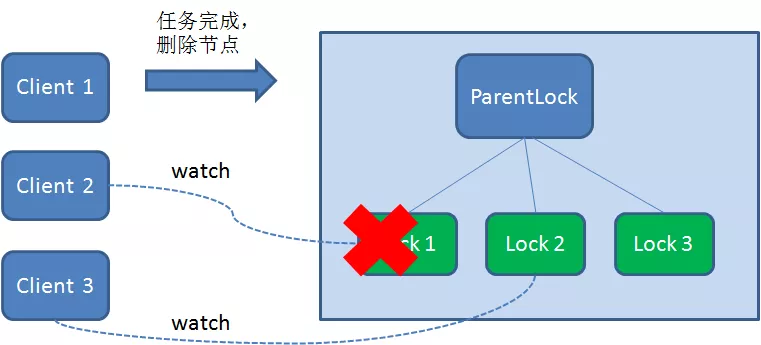
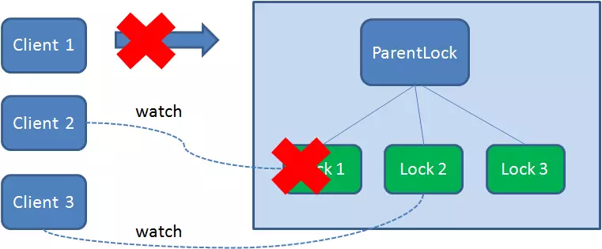
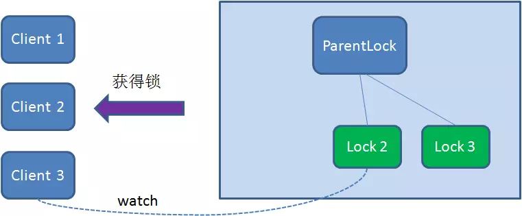
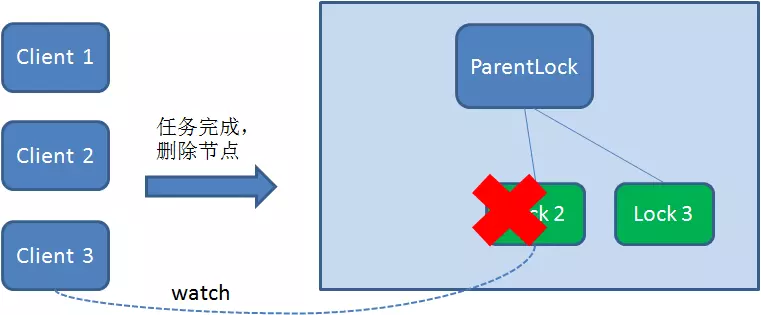

# 有哪些分布式锁的实现方案

<font style="background-color:#FBDE28;">资：12-25K</font>

<font style="background-color:#C1E77E;">岗位：中高级开发工程师</font>

<font style="color:rgb(74, 74, 74);"></font>

### <font style="color:rgb(79, 79, 79);">一、</font>[<font style="color:rgb(74, 74, 74);">分布式锁</font>](https://so.csdn.net/so/search?q=%E5%88%86%E5%B8%83%E5%BC%8F%E9%94%81&spm=1001.2101.3001.7020)<font style="color:rgb(79, 79, 79);">场景</font>
<font style="color:rgb(77, 77, 77);">一般需要使用分布式锁的场景如下：</font>

+ <font style="color:rgb(51, 51, 51);">效率：使用分布式锁可以避免不同节点重复相同的工作，比如避免重复执行定时任务等；</font>
+ <font style="color:rgb(51, 51, 51);">正确性：使用分布式锁同样可以避免破坏数据正确性，如果两个节点在同一条数据上面操作，可能会出现并发问题。</font>

### <font style="color:rgb(79, 79, 79);">二、分布式锁特点</font>
<font style="color:rgb(77, 77, 77);">一个完善的分布式锁需要满足以下特点：</font>

+ <font style="color:rgb(51, 51, 51);">互斥性：互斥是所得基本特性，分布式锁需要按需求保证线程或节点级别的互斥。；</font>
+ <font style="color:rgb(51, 51, 51);">可重入性：同一个节点或同一个线程获取锁，可以再次重入获取这个锁；</font>
+ <font style="color:rgb(51, 51, 51);">锁超时：支持锁超时释放，防止某个节点不可用后，持有的锁无法释放；</font>
+ <font style="color:rgb(51, 51, 51);">高效性：加锁和解锁的效率高，可以支持高并发；</font>
+ <font style="color:rgb(51, 51, 51);">高可用：需要有高可用机制预防锁服务不可用的情况，如增加降级；</font>
+ <font style="color:rgb(51, 51, 51);">阻塞性：支持阻塞获取锁和非阻塞获取锁两种方式；</font>
+ <font style="color:rgb(51, 51, 51);">公平性：支持公平锁和非公平锁两种类型的锁，公平锁可以保证安装请求锁的顺序获取锁，而非公平锁不可以。</font>

### <font style="color:rgb(79, 79, 79);">三、分布式锁的实现</font>
<font style="color:rgb(77, 77, 77);">分布式锁常见的实现有三种实现，下文我们会一一介绍这三种锁的实现方式：</font>



+ <font style="color:rgb(51, 51, 51);">基于数据库的分布式锁；</font>
+ <font style="color:rgb(51, 51, 51);">基于Redis的分布式锁；</font>
+ <font style="color:rgb(51, 51, 51);">基于Zookeeper的分布式锁。</font>

### <font style="color:rgb(79, 79, 79);">1、基于数据库的分布式锁</font>
<font style="color:rgb(74, 74, 74);">用数据库实现分布式锁比较简单，就是创建一张锁表，数据库对字段作唯一性约束。</font>

<font style="color:rgb(74, 74, 74);">加锁的时候，在锁表中增加一条记录即可；释放锁的时候删除记录就行。</font>

<font style="color:rgb(74, 74, 74);">如果有并发请求同时提交到数据库，数据库会保证只有一个请求能够得到锁。</font>

<font style="color:rgb(74, 74, 74);">这种属于数据库 IO 操作，效率不高，而且频繁操作会增大数据库的开销，因此这种方式在高并发、高性能的场景中用的不多。</font>

#### <font style="color:rgb(79, 79, 79);">方案概览</font>
<font style="color:rgb(77, 77, 77);">我们上面列举出了分布式锁需要满足的特点，使用数据库实现分布式锁也需要满足这些特点，下面我们来一一介绍实现方法：</font>

+ <font style="color:rgb(51, 51, 51);">互斥性：通过数据库update的原子性达到两次获取锁之间的互斥性；</font>
+ <font style="color:rgb(51, 51, 51);">可重入性：在数据库中保留一个字段存储当前锁的持有者；</font>
+ <font style="color:rgb(51, 51, 51);">锁超时：在数据库中存储锁的获取时间点和超时时长；</font>
+ <font style="color:rgb(51, 51, 51);">高效性：数据库本身可以支持比较高的并发；</font>
+ <font style="color:rgb(51, 51, 51);">高可用：可以增加主从数据库逻辑，提升数据库的可用性；</font>
+ <font style="color:rgb(51, 51, 51);">阻塞性：可以通过看门狗轮询的方式实现线程的阻塞；</font>
+ <font style="color:rgb(51, 51, 51);">公平性：可以添加锁队列，不过不建议，实现起来比较复杂。</font>

#### <font style="color:rgb(79, 79, 79);">表结构设计</font>
<font style="color:rgb(77, 77, 77);">数据库的表名为lock，各个字段的定义如下所示：</font>

| **<font style="color:rgb(79, 79, 79);">字段名名称</font>** | **<font style="color:rgb(79, 79, 79);">字段类型</font>** | **<font style="color:rgb(79, 79, 79);">说明</font>** |
| :--- | :--- | :--- |
| <font style="color:rgb(79, 79, 79);">lock_key</font> | <font style="color:rgb(79, 79, 79);">varchar</font> | <font style="color:rgb(79, 79, 79);">锁的唯一标识符号</font> |
| <font style="color:rgb(79, 79, 79);">lock_time</font> | <font style="color:rgb(79, 79, 79);">timestample</font> | <font style="color:rgb(79, 79, 79);">加锁的时间</font> |
| <font style="color:rgb(79, 79, 79);">lock_duration</font> | <font style="color:rgb(79, 79, 79);">integer</font> | <font style="color:rgb(79, 79, 79);">锁的超时时长，单位可以业务自定义，通常为秒</font> |
| <font style="color:rgb(79, 79, 79);">lock_owner</font> | <font style="color:rgb(79, 79, 79);">varchar</font> | <font style="color:rgb(79, 79, 79);">锁的持有者，可以是节点或线程的唯一标识，不同可重入粒度的锁有不同的含义</font> |
| <font style="color:rgb(79, 79, 79);">locked</font> | <font style="color:rgb(79, 79, 79);">boolean</font> | <font style="color:rgb(79, 79, 79);">当前锁是否被占有</font> |


#### <font style="color:rgb(79, 79, 79);">获取锁的SQL语句</font>
<font style="color:rgb(77, 77, 77);">获取锁的SQL语句分不同的情况，如果锁不存在，那么首先需要创建锁，并且创建锁的线程可以获取锁：</font>

```plain
insert into lock(lock_key,lock_time,lock_duration,lock_owner,locked) values ('xxx',now(),1000,'ownerxxx',true)
```

<font style="color:rgb(77, 77, 77);">如果锁已经存在，那么就尝试更新锁的信息，如果更新成功则表示获取锁成功，更新失败则表示获取锁失败。</font>

```sql
update lock set 
    locked = true, 
    lock_owner = 'ownerxxxx', 
    lock_time = now(), 
    lock_duration = 1000
where
    lock_key='xxx' and(
      lock_owner = 'ownerxxxx' or
      locked = false or
      date_add(lock_time, interval lock_duration second) > now())
```

#### <font style="color:rgb(79, 79, 79);">释放锁的SQL语句</font>
<font style="color:rgb(77, 77, 77);">当用户使用完锁需要释放的时候，可以直接更新locked标识位为false。</font>

```plsql
update lock set 
    locked = false, 
where
    lock_key='xxx' and
    lock_owner = 'ownerxxxx' and
    locked = true
```

#### <font style="color:rgb(79, 79, 79);">看门狗</font>
<font style="color:rgb(77, 77, 77);">通过上面的步骤，我们可以实现获取锁和释放锁，那么看门狗又是做什么的呢？</font>

<font style="color:rgb(79, 79, 79);">大家想象一下，如果用户获取锁到释放锁之间的时间大于锁的超时时间，是不是会有问题？是不是可能会出现多个节点同时获取锁的情况？这个时候就需要看门狗了，看门狗可以通过定时任务不断刷新锁的获取事件，从而在用户获取锁到释放锁期间保持一直持有锁。</font>

### <font style="color:rgb(79, 79, 79);">2、基于Redis的分布式锁</font>
<font style="color:rgb(77, 77, 77);">Redis的Java客户端Redisson实现了分布式锁，我们可以通过类似ReentrantLock的加锁-释放锁的逻辑来实现分布式锁。</font>

```java
RLock disLock = redissonClient.getLock("DISLOCK");
disLock.lock();
try {
    // 业务逻辑
} finally {
    // 无论如何, 最后都要解锁
    disLock.unlock();
}
```

#### <font style="color:rgb(79, 79, 79);">Redisson分布式锁的底层原理</font>
<font style="color:rgb(77, 77, 77);">如下图为Redisson客户端加锁和释放锁的逻辑：</font>



#### 
#### <font style="color:rgb(79, 79, 79);">加锁机制</font>
<font style="color:rgb(79, 79, 79);">从上图中可以看出来，Redisson客户端需要获取锁的时候，要发送一段Lua脚本到Redis集群执行，为什么要用Lua脚本呢？因为一段复杂的业务逻辑，可以通过封装在Lua脚本中发送给Redis，保证这段复杂业务逻辑执行的原子性。</font>

**<font style="color:rgb(77, 77, 77);">Lua源码分析</font>**<font style="color:rgb(77, 77, 77);">：如下为Redisson加锁的lua源码，接下来我们会对源码进行分析。</font>

**<font style="color:rgb(77, 77, 77);">源码入参</font>**<font style="color:rgb(77, 77, 77);">：Lua脚本有三个输入参数：KEYS[1]、ARGV[1]和ARGV[2]，含义如下：</font>

+ <font style="color:rgb(51, 51, 51);">KEYS[1]代表的是加锁的Key，例如RLock lock = redisson.getLock("myLock")中的“myLock”；</font>
+ <font style="color:rgb(51, 51, 51);">ARGV[1]代表的就是锁Key的默认生存时间，默认30秒；</font>
+ <font style="color:rgb(51, 51, 51);">ARGV[2]代表的是加锁的客户端的ID，类似于下面这样的：8743c9c0-0795-4907-87fd-6c719a6b4586:1。</font>

<font style="color:rgb(77, 77, 77);">Lua脚本及加锁步骤如下代码块所示，可以看出其大致原理为：</font>

+ <font style="color:rgb(51, 51, 51);">锁不存在的时候，创建锁并设置过期时间；</font>
+ <font style="color:rgb(51, 51, 51);">锁存在的时候，如果是重入场景则刷新锁的过期事件；</font>
+ <font style="color:rgb(51, 51, 51);">否则返回加锁失败和锁的过期时间。</font>

```java
-- 判断锁是不是存在
if (redis.call('exists', KEYS[1]) == 0) then 
    -- 添加锁，并且设置客户端和初始锁重入次数
    redis.call('hincrby', KEYS[1], ARGV[2], 1); 
    -- 设置锁的超时事件 
    redis.call('pexpire', KEYS[1], ARGV[1]);  
    -- 返回加锁成功
    return nil;  
end;  
-- 判断当前锁的持有者是不是请求锁的请求者
if (redis.call('hexists', KEYS[1], ARGV[2]) == 1) then  
    -- 当前锁被请求者持有，重入锁，增加锁重入次数
    redis.call('hincrby', KEYS[1], ARGV[2], 1);  
    -- 刷新锁的过期时间
    redis.call('pexpire', KEYS[1], ARGV[1]);  
    -- 返回加锁成功
    return nil;  
end;  
-- 返回当前锁的过期时间
return redis.call('pttl', KEYS[1]);
```

#### 
#### <font style="color:rgb(79, 79, 79);">看门狗逻辑</font>
<font style="color:rgb(79, 79, 79);">客户端1加锁的锁Key默认生存时间才30秒，如果超过了30秒，客户端1还想一直持有这把锁，怎么办呢？只要客户端1加锁成功，就会启动一个watchdog看门狗，这个后台线程，会每隔10秒检查一下，如果客户端1还持有锁Key，就会不断的延长锁Key的生存时间。</font>

#### <font style="color:rgb(79, 79, 79);">释放锁机制</font>
<font style="color:rgb(79, 79, 79);">如果执行lock.unlock()，就可以释放分布式锁，此时的业务逻辑也是非常简单的。就是每次都对myLock数据结构中的那个加锁次数减1。</font>

<font style="color:rgb(79, 79, 79);">如果发现加锁次数是0了，说明这个客户端已经不再持有锁了，此时就会用：“del myLock”命令，从Redis里删除这个Key。</font>

<font style="color:rgb(79, 79, 79);">而另外的客户端2就可以尝试完成加锁了。这就是所谓的分布式锁的开源Redisson框架的实现机制。</font>

<font style="color:rgb(79, 79, 79);">一般我们在生产系统中，可以用Redisson框架提供的这个类库来基于Redis进行分布式锁的加锁与释放锁。</font>

#### <font style="color:rgb(79, 79, 79);">Redisson分布式锁的缺陷</font>
<font style="color:rgb(77, 77, 77);">Redis分布式锁会有个缺陷，就是在Redis哨兵模式下:</font>

1. <font style="color:rgb(51, 51, 51);">客户端1对某个master节点写入了redisson锁，此时会异步复制给对应的slave节点。但是这个过程中一旦发生master节点宕机，主备切换，slave节点从变为了master节点。</font>
2. <font style="color:rgb(51, 51, 51);">客户端2来尝试加锁的时候，在新的master节点上也能加锁，此时就会导致多个客户端对同一个分布式锁完成了加锁。</font>
3. <font style="color:rgb(51, 51, 51);">系统在业务语义上一定会出现问题，导致各种脏数据的产生。</font>

<font style="color:rgb(77, 77, 77);">这个缺陷导致在哨兵模式或者主从模式下，如果master实例宕机的时候，可能导致多个客户端同时完成加锁。</font>

### <font style="color:rgb(79, 79, 79);">四、基于Zookeeper的分布式锁</font>
<font style="color:rgb(77, 77, 77);">Zookeeper实现的分布式锁适用于引入Zookeeper的服务，如下所示，有两个服务注册到Zookeeper，并且都需要获取Zookeeper上的分布式锁，流程式什么样的呢？</font>

<font style="color:rgb(85, 85, 85);">首先，在 Zookeeper 当中创建一个持久节点 ParentLock。当第一个客户端想要获得锁时，需要在ParentLock这个节点下面创建一个临时顺序节点 Lock1。</font>

<font style="color:rgb(85, 85, 85);">之后，Client1 查找 ParentLock 下面所有的临时顺序节点并排序，判断自己所创建的节点 Lock1 是不是顺序最靠前的一个。如果是第一个节点，则成功获得锁。</font><font style="color:rgb(85, 85, 85);">这时候，如果再有一个客户端 Client2 前来获取锁，则在 ParentLock 下再创建一个临时顺序节点Lock2。</font><font style="color:rgb(85, 85, 85);">Client2 查找 ParentLock 下面所有的临时顺序节点并排序，判断自己所创建的节点 Lock2 是不是顺序最靠前的一个，结果发现节点 Lock2 并不是最小的。</font>

<font style="color:rgb(85, 85, 85);">于是，Client2 向排序仅比它靠前的节点 Lock1 注册 Watcher，用于监听 Lock1 节点是否存在。这意味着 Client2 抢锁失败，进入了等待状态。</font>

<font style="color:rgb(85, 85, 85);">这时候，如果又有一个客户端 Client3 前来获取锁，则在ParentLock下载再创建一个临时顺序节点Lock3。</font><font style="color:rgb(85, 85, 85);">Client3 查找 ParentLock 下面所有的临时顺序节点并排序，判断自己所创建的节点 Lock3 是不是顺序最靠前的一个，结果同样发现节点 Lock3 并不是最小的。</font>

<font style="color:rgb(85, 85, 85);">于是，Client3 向排序仅比它靠前的节点 Lock2 注册 Watcher，用于监听 Lock2 节点是否存在。这意味着 Client3 同样抢锁失败，进入了等待状态。</font>

<font style="color:rgb(85, 85, 85);">这样一来，Client1 得到了锁，Client2 监听了 Lock1，Client3 监听了 Lock2。这恰恰形成了一个等待队列，很像是 Java 当中 ReentrantLock 所依赖的 AQS（AbstractQueuedSynchronizer）。</font>

### <font style="color:rgb(68, 68, 68);">释放锁</font>
<font style="color:rgb(85, 85, 85);">释放锁分为两种情况：</font>

<font style="color:rgb(85, 85, 85);">1、任务完成，客户端显示释放</font>

<font style="color:rgb(85, 85, 85);">当任务完成时，Client1 会显示调用删除节点 Lock1 的指令。</font>

<font style="color:rgb(85, 85, 85);">2.任务执行过程中，客户端崩溃</font>

<font style="color:rgb(85, 85, 85);">获得锁的 Client1 在任务执行过程中，如果 Duang 的一声崩溃，则会断开与 Zookeeper 服务端的链接。根据临时节点的特性，相关联的节点 Lock1 会随之自动删除。</font>



<font style="color:rgb(85, 85, 85);">由于 Client2 一直监听着 Lock1 的存在状态，当 Lock1 节点被删除，Client2 会立刻收到通知。这时候 Client2 会再次查询 ParentLock 下面的所有节点，确认自己创建的节点 Lock2 是不是目前最小的节点。如果是最小，则 Client2 顺理成章获得了锁。</font>

<font style="color:rgb(85, 85, 85);">同理，如果 Client2 也因为任务完成或者节点崩溃而删除了节点 Lock2，那么 Client3 就会接到通知。</font><font style="color:rgb(85, 85, 85);">最终，Client3 成功得到了锁。</font>

  
 

### <font style="color:rgb(79, 79, 79);">五、三种锁的优缺点</font>
**<font style="color:rgb(77, 77, 77);">基于数据库的分布式锁</font>**<font style="color:rgb(77, 77, 77);">：</font>

+ <font style="color:rgb(51, 51, 51);">数据库并发性能较差；</font>
+ <font style="color:rgb(51, 51, 51);">阻塞式锁实现比较复杂；</font>
+ <font style="color:rgb(51, 51, 51);">公平锁实现比较复杂。</font>

**<font style="color:rgb(77, 77, 77);">基于Redis的分布式锁</font>**<font style="color:rgb(77, 77, 77);">：</font>

+ <font style="color:rgb(51, 51, 51);">主从切换的情况下可能出现多客户端获取锁的情况；</font>
+ <font style="color:rgb(51, 51, 51);">Lua脚本在单机上具有原子性，主从同步时不具有原子性。</font>

**<font style="color:rgb(77, 77, 77);">基于Zookeeper的分布式锁</font>**<font style="color:rgb(77, 77, 77);">：</font>

+ <font style="color:rgb(51, 51, 51);">需要引入Zookeeper集群，比较重量级；</font>
+ <font style="color:rgb(51, 51, 51);">分布式锁的可重入粒度只能是节点级别；</font>


 

  
 

