# 一文了解Paxos 算法

本文主要介绍了 Paxos 算法，包括 Basic Paxos 和 Multi Paxos。

Basic Paxos 算法中存在提议者、接受者、学习者三种角色，通过准备和接受两个阶段达成共识，还讲解了接受者存在已通过提案的情况。

Multi Paxos 是一种思想，引入领导者以解决冲突和优化执行过程，如 Chubby 实现了其算法。

## 前言

Paxos 算法由 Leslie Lamport 在 1989 年提出的一个分布式共识算法，Paxos 算法较难理解，本文尝试以图形化方案解释 Paxos 算法。

Lamport 提出的 Paxos 算法包括两个部分：

+ Basic Paxos 算法：多节点如何就某个值达成共识
+ Multi Paxos 思想：执行多个 Basic Paxos ，就一系列的值达成共识

---

## 一、Basic Paxos

## 1. 问题

假设一个集群包含三个节点 A, B, C，提供只读< key-value 存储服务。只读 key-value 的意思是指，当一个 key 被创建时，它的值就确定下来了，且后面不能修改。

客户端 1 和客户端 2 同时试图创建一个 K 键。客户端 1 创建值为 "baili" 的 K ，客户端 2 创建值为 "百里" 的 K 。在这种情况下，集群如何达成共识，实现各节点上 K 的值一致呢？

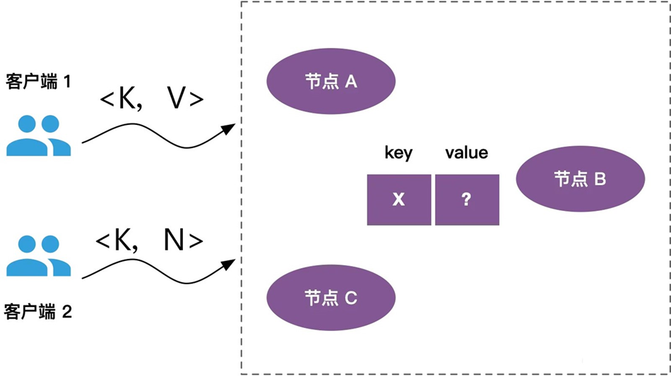

## 2. Paxos 涉及的概念

在 Paxos 算法中，存在提议者（Proposer），接受者（Acceptor），学习者（Learner）三种角色，它们的关系如下：

+ 提议者（Proposer）：提议一个值，用于投票表决，可以将上图客户端 1 和客户端 2 看作提议者。实际上，提议者更多是集群内的节点，这里为了演示的方便，将客户端 1 和 2 看作提议者，不影响 Paxos 算法的实质
+ 接受者（Acceptor）：对每个提议的值进行投票，并存储接受的值，例如，上图集群内的节点 A、B、C
+ 学习者（Learner）：被告知投票的结果，接受达成共识的值，不参与投票的过程，存储接受数据

需要指出的是，一个节点，既可以是提议者，也可以是接受者。

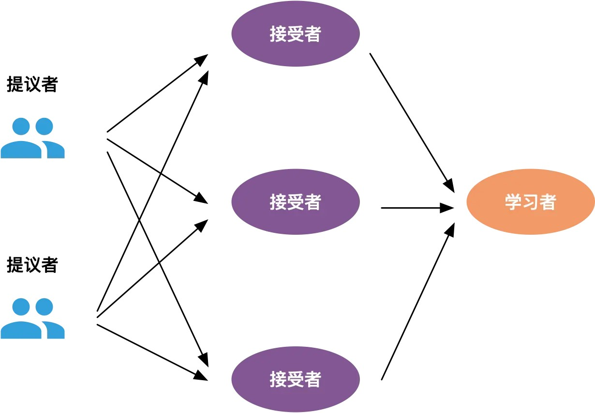

在 Paxos 算法中，使用**提案**表示一个提议，提案包括提案编号和提议的值。接下来，我们使用 [n, v] 表示一个提案，其中， n 是提案编号， v 是提案的值。

在 Basic Paxos 中，集群中各个节点为了达成共识，需要进行 2 个阶段的协商，即准备（Prepare）阶段和接受（Accept）阶段。

## 3. 准备阶段

假设客户端 1 的提案编号是 1，客户端 2 的提案编号为 5，并假设节点 A, B 先收到来自客户端 1 的准备请求，节点 C 先收到来自客户端 2 的准备请求。

客户端作为提议者，向所有的接受者发送包含提案编号的准备请求。注意在准备阶段，请求中不需要指定提议的值，只需要包含提案编号即可。

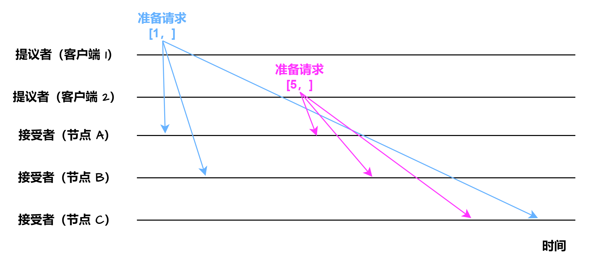

接下来，节点 A，B 接收到客户端 1 的准备请求（提案编号为 1），节点 C 接收到客户端 2 的准备请求（提案编号为 5）。

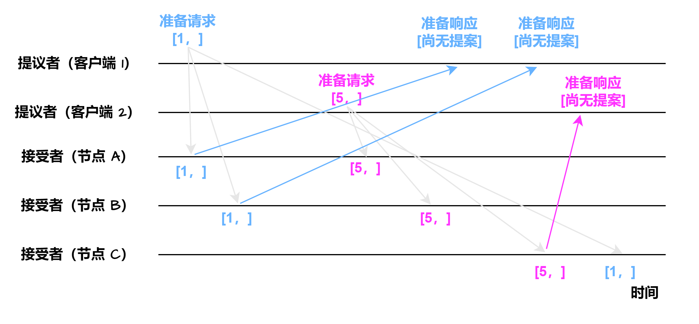 集群中各个节点在接收到第一个准备请求的处理：

+ 节点 A, B：由于之前没有通过任何提案，所以节点 A，B 将返回“尚无提案”的准备响应，并承诺以后不再响应提案编号小于等于 1 的准备请求，不会通过编号小于 1 的提案
+ 节点 C：由于之前没有通过任何提案，所以节点 C 将返回“尚无提案”的准备响应，并承诺以后不再响应提案编号小于等于 5 的准备请求，不会通过编号小于 5 的提案

接下来，当节点 A，B 接收到提案编号为 5 的准备请求，节点 C 接收到提案编号为 1 的准备请求：

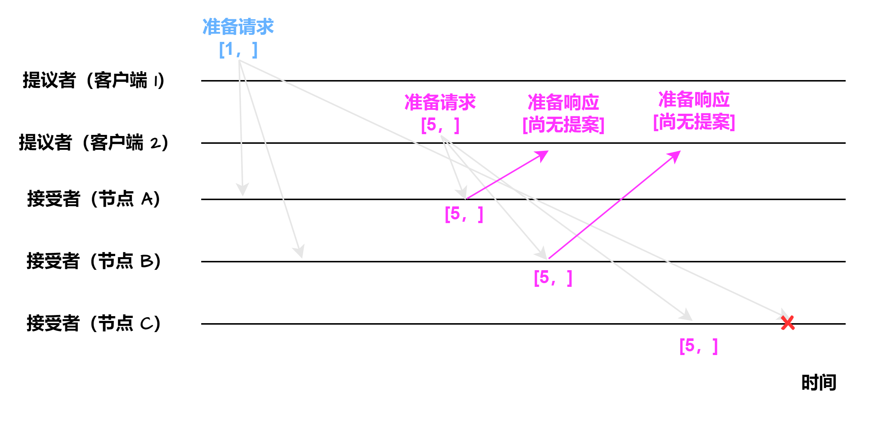

+ 节点 A, B：由于提案编号 5 大于之前响应的准备请求的提案编号 1，且节点 A, B 都没有通过任何提案，故均返回“尚无提案”的响应，并承诺以后不再响应提案编号小于等于 5 的准备请求，不会通过编号小于 5 的提案
+ 节点 C：由于节点 C 接收到提案编号 1 小于节点 C 之前响应的准备请求的提案编号 5 ，所以丢弃该准备请求，不作响应

## 4. 接受阶段

Basic Paxos 算法第二阶段为接受阶段。当客户端 1，2 在收到大多数节点的准备响应之后会开始发送接受请求。 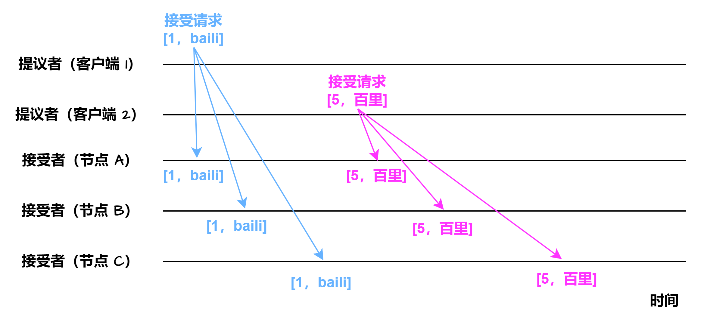

+ 客户端 1：客户端 1 接收到大多数的接受者（节点 A, B）的准备响应后，根据响应中的提案编号最大的提案的值，设置接受请求的值。由于节点 A, B 均返回“尚无提案”，即提案值为空，故客户端 1 把自己的提议值 "baili" 作为提案的值，发送接受请求 [1, "baili"]
+ 客户端 2：客户端 2 接收到大多数接受者的准备响应后，根据响应中的提案编号最大的提案的值，设置接受请求的值。由于节点 A, B, C 均返回“尚无提案”，即提案值为空，故客户端 2 把自己的提议值 "百里" 作为提案的值，发送接受请求 [5, "百里"]

当节点 A, B, C 接收到客户端 1, 2 的接受请求时，对接受请求进行处理：

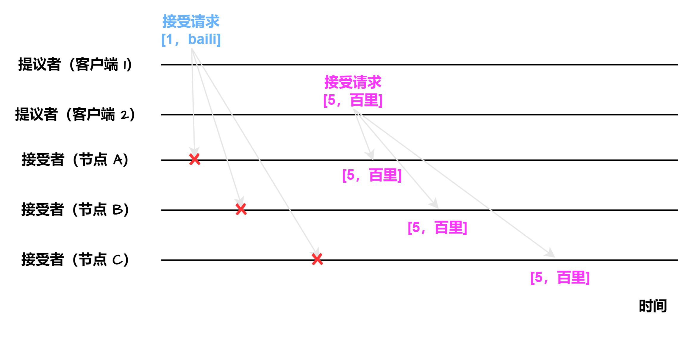

+ 节点 A, B, C 接收到接受请求 [1, "baili"] ，由于提案编号 1 小于三个节点承诺可以通过的最小提案编号 5，所以提案 [1, "baili"] 被拒绝
+ 节点 A, B, C 接收到接受请求 [5, "百里"]，由于提案编号 5 不小于三个节点承诺可以通过的最小提案编号 5 ，所以通过提案 [5, "百里"]，即三个节点达成共识，接受 X 的值为 "百里"

如果集群中还有学习者，当接受者通过一个提案，就通知学习者，当学习者发现大多数接受者都通过了某个提案，那么学习者也通过该提案，接受提案的值。

## 5. 接受者存在已通过提案的情况

上面例子中，准备阶段和接受阶段均不存在接受者已经通过提案的情况。这里继续使用上面的例子，不过假设节点 A, B 已通过提案 [5, "百里"]，节点 C 未通过任何提案。 增加一个新的提议者客户端 3，客户端 3 的提案为 [8，""] 。

接下来，客户端 3 执行准备阶段和接受阶段。

客户端 3 向节点 A, B, C 发送提案编号为 8 的准备请求：

 节点 A, B 接收到客户端 3 的准备请求，由于节点 A, B 已通过提案 [5, "百里"]，故在准备响应中，包含此提案信息。

节点 C 接收到客户端 3 的准备请求，由于节点 C 未通过任何提案，故节点 C 将返回“尚无提案”的准备响应。

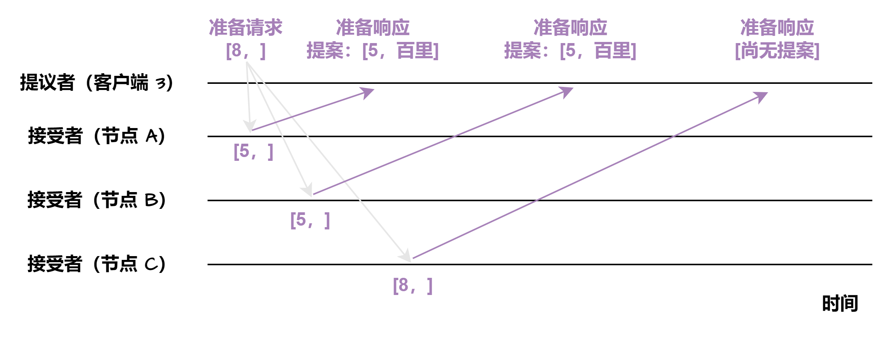

客户端 3 接收到节点 A, B, C 的准备响应后，向节点 A, B, C 发送接受请求。这里需要特点指出，客户端 3 会根据响应中的提案编号最大的提案的值，设置接受请求的值。由于在准备响应中，已包含提案 [5, "百里"]，故客户端 3 将接受请求的提案编号设置为 8，提案值设置为 "百里" 即接受请求的提案为 [8, "百里"]：

节点 A, B, C 接收到客户端 3 的接受请求，由于提案编号 8 不小于三个节点承诺可以通过的最小提案编号，故均通过提案 [8, 百里]。

概括来说，Basic Paxos 具有以下特点：

+ Basic Paxos 通过二阶段方式来达成共识，即准备阶段和接受阶段
+ Basic Paxos 除了达成共识功能，还实现了容错，在少于一半节点出现故障时，集群也能工作
+ 提案编号大小代表优先级。对于提案编号，接受者提供三个承诺：
  + 如果准备请求的提案编号，小于等于接受者已经响应的准备请求的提案编号，那么接受者承诺不响应这个准备请求
  + 如果接受请求中的提案编号，小于接受者已经响应的准备请求的提案编号，那么接受者承诺不通过这个提案
  + 如果按受者已通过提案，那些接受者承诺会在准备请求的响应中，包含已经通过的最大编号的提案信息

## 二、Multi Paxos

Basic Paxos 算法只能对单个值达成共识，对于多个值的情形，Basic Paxos 算法就不管用了。因此，Basic Paxos 算法几乎只是用来理论研究，并不直接应用在实际工作中。

Lamport 提出的 Multi Paxos 是一种思想，并不是算法。

Multi Paxos 算法则是一个统称，是指基于 Multi Paxos 思想，通过多个 Basic Paxos 实例实现一系列值的共识的算法（例如 Raft 算法等）。

如果直接通过多次执行 Basic Paxos 实例方式，来实现一系列值的共识，存在以下问题：

+ 如果集群中多个提议者同时在准备阶段提交提案，可能会出现没有提议者接收到大多数准备响应，导致需要重新提交准备请求。例如，在一个 5 个节点的集群中，有 3 个节点同时作为提议者同时提交提案，那就会出现没有一个提议者获取大多数的准备响应，而需要重新提交
+ 为了达成一个值的共识，需要进行 2 轮 RPC 通讯，分别是准备阶段和接受阶段，性能低下

为了解决以上问题，Multi Paxos 引入了领导者（Leader）和优化了 Basic Paxos 的执行过程。

## 1. 领导者

上面的问题一存在多个提议者同时提交准备请求的情况，如果引入了领导者，由领导者作为唯一的提议者，就可以解决问题一中的冲突的问题。

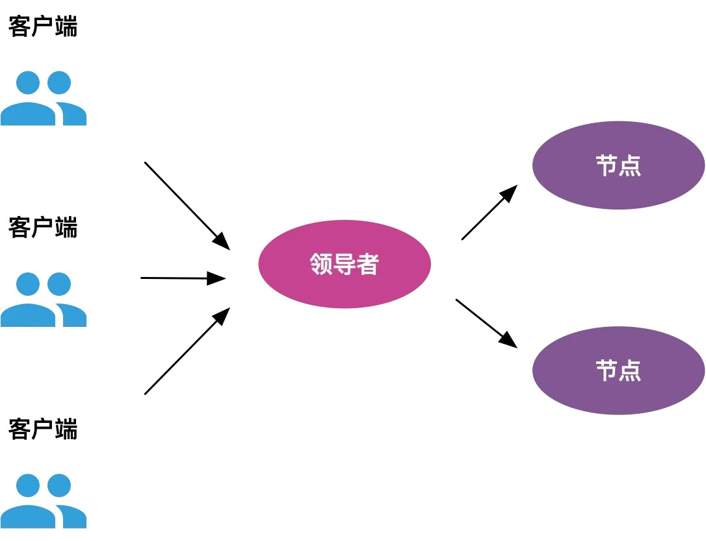

Lamport 没有说明如何选举领导者，需要在实现 Multi Paxos 算法的时候自行实现。这里我们略去如何选举领导者的算法，假设已经选举出领导者。

## 2. 优化 Basic Paxos 执行过程

准备阶段的意义，是发现接受者节点上已通过的提案的值。引入领导者后，只有领导者才可发送提议，因此，领导者的提案就已经是最新的了，不再需要通过准备阶段来发现之前被大多数节点通过的提案，领导者可以独立指定提议的值。

这样一来，准备阶段存在就没有意义了，领导者可以直接跳过准备阶段，直接进行接受阶段，减少了 RPC 通讯次数。

## 3. Chubby 的 Multi Paxos 实现

Google 分布式锁 Chubby 实现了 Multi Paxos 算法。Chubby 的 Multi Paxos 算法主要包括：

+ Chubby 引入主节点作为领导者，即主节点作为唯一提议者，不存在多个提议者同时提交提案的情况，也不存在提案冲突的情况。Chubby 通过执行 Basic Paxos 算法进行投票选举产生主节点
+ 在 Chubby 中，由于引入了主节点，因此，也去除了 Basic Paxos 的准备阶段
+ 在 Chubby 中，为实现强一致性，所有的读请求和写请求都由主节点来处理

1. Chubby 所有的写请求由主节点来处理

当主节点接收到客户端的写请求，作为提议者，将数据发送给所有节点，在大多数服务器接受了这个写请求后，给客户端响应写成功。

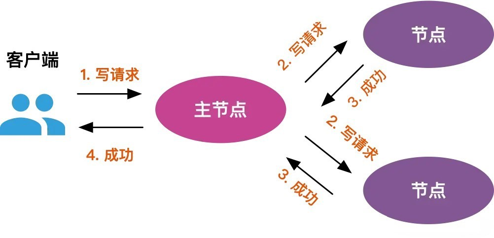

1. Chubby 所有的读请求由主节点来处理

当主节点接收到读请求，主节点只需要查询本地数据，然后返回给客户端。

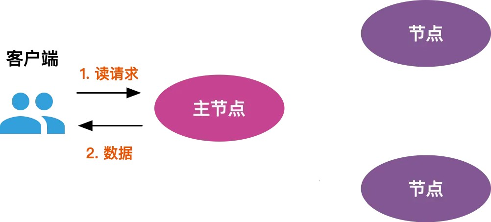

另外，需要指出的是，Basic Paxos 是经过证明的算法。Multi Paxos 是一种思想但缺乏实现算法所需的编程细节，因此，Multi Paxos 的算法实现，是建立在一个未经证明的基础之上。实现 Multi Paxos 算法，最大的挑战是如何证明它是正确的。
