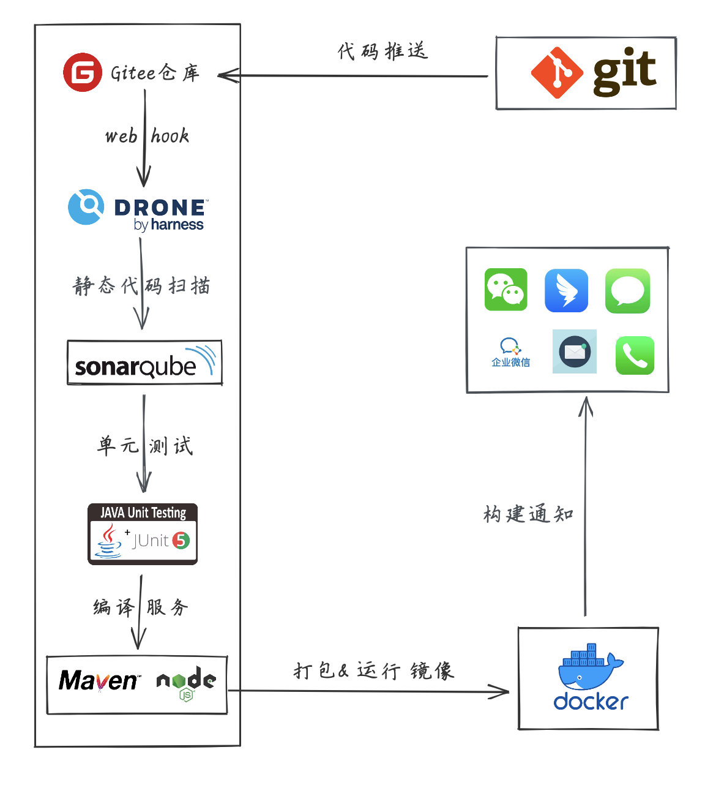
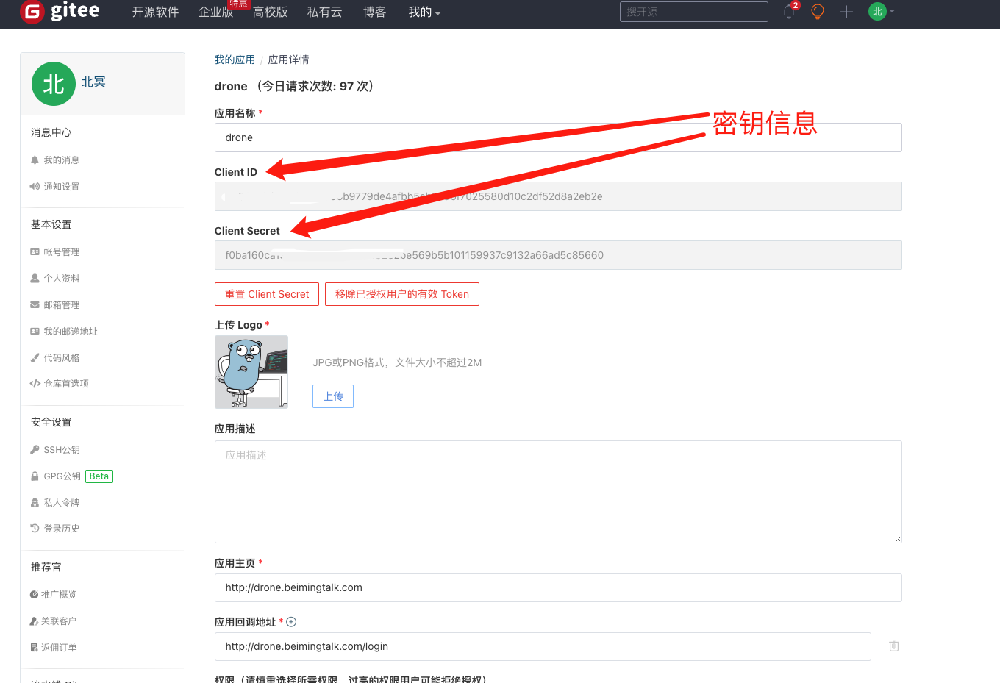
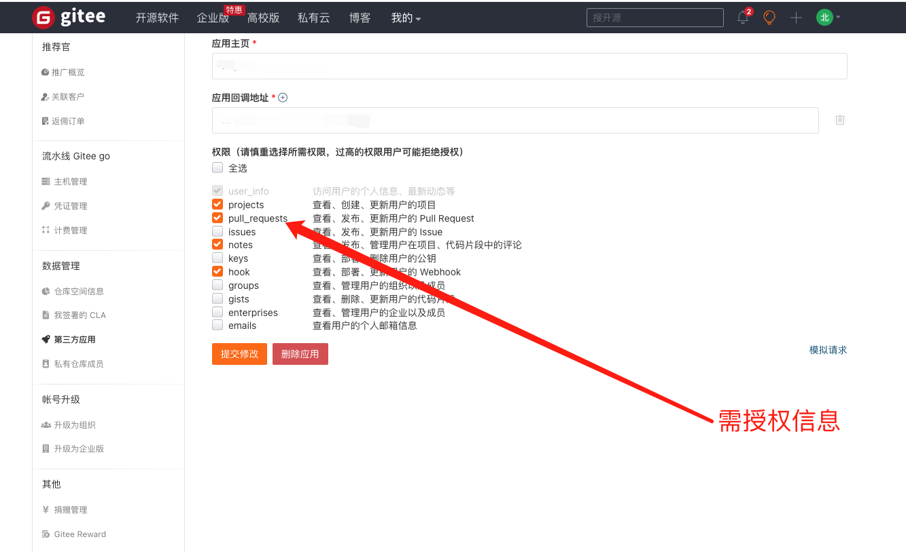
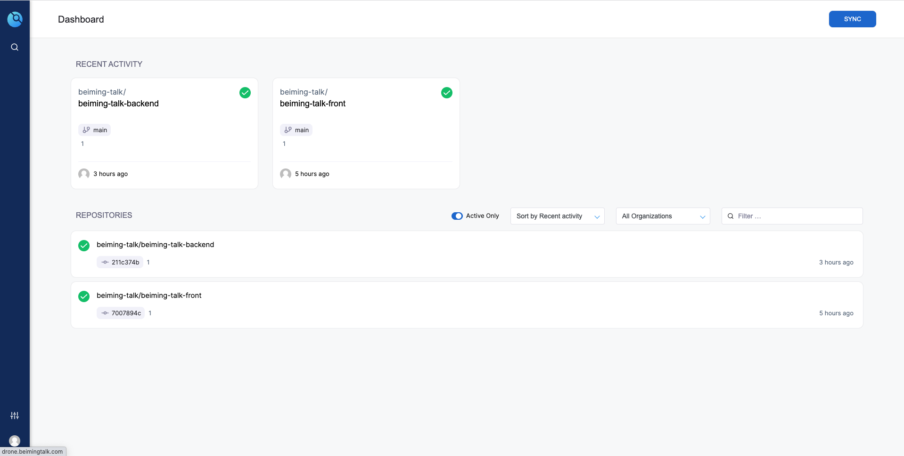

# 手把手带你搭建CI/CD工作流

## 什么是CI/CD?


持续集成（ContinousIntergration，CI）是在源代码变更后自动检测、拉取、构建和进行自动化测试的过程，属于开发人员的自动化流程。该解决方案可以解决在一次开发中有太多应用分支，从而导致相互冲突的问题。其基本思路是，自动化监测代码仓库的变化并拉取最新代码、编译构建和自动化测试。CI的触发方式可分为以下三种：


+ 轮询：按一定的时间间隔反复询问代码仓库是否发生了变更，若发生了变更则开启CI流程
+ 定时：定期从代码仓库拉去最新代码并进行构建与测试，不必关心是否有变更发生
+ 推送：当代码仓库发生变更时，通过推送的方式(如webhook)通知CI进行任务，这需要CI环境被代码仓库访问到。


持续部署（ContinousDelivery，CD）通常是指开发人员对应用的更改会自动进行错误测试，并上传到存储库（如 GitHub 或容器注册表），然后由运维团队将其部署到实时生产环境中。持续部署指的是自动将开发人员的更改从存储库发布到生产环境，它以持续交付为基础，实现了管道后续阶段的自动化。 CI/CD 既可能仅指持续集成和持续交付构成的关联环节，也可以指持续集成、持续交付和持续部署这三项构成的关联环节。


## 什么是Drone?


Drone 是一种基于容器技术的持续交付系统。Drone 使用简单的 YAML 配置文件（docker-compose 的超集）来定义和执行 Docker 容器中的 Pipelines。


Drone 与流行的源代码管理系统无缝集成，包括 GitHub、GitHub Enterprise、Bitbucket、Gitee、Gitlab等。


## 自动化流程





## 基础设施


+ gitee代码托管：[https://gitee.com](https://gitee.com)
+ drone持续交付系统: [https://drone.io](https://drone.io)
+ 服务器信息：`ubuntu`、`docker`、`docker-compose`


## 部署步骤


### 配置Gitee第三方授权








### 安装Drone


docker-compose文件配置如下：


```plain
version: '3'
services:
  drone-server:
    restart: always  ## 容器自动重启
    image: drone/drone:latest
    ports:
      - "20000:80"  ## 映射到宿主机的端口
    volumes:
      - ./drone_data:/var/lib/drone:rw
    environment:
      - DRONE_GITEE_CLIENT_ID=xxx  ## gitee中生成的CLIENT ID
      - DRONE_GITEE_CLIENT_SECRET=xxxx  ## gitee中生成的SECRET
      - DRONE_SERVER_HOST=192.168.0.2:20000  ## 端口需要和映射至宿主机的一致
      - DRONE_SERVER_PROTO=http
      - DRONE_RPC_SECRET=c64bab058885900124d31250b6780307  ## openssl rand -hex 16 自动生成
      - DRONE_USER_CREATE=username:beiming-talk,admin:true  ## gitee中的用户名
      - TZ=Asia/Shanghai
      #- DRONE_LOGS_DEBUG=true  ## 日志调试开关
      #- DRONE_LOGS_TRACE=true  ## 日志调试开关
      - DRONE_LOGS_TEXT=true
      - DRONE_LOGS_PRETTY=true
      - DRONE_LOGS_COLOR=true
  drone-runner-docker:
    restart: always  ## 容器自动重启
    image: drone/drone-runner-docker:latest
    ports:
      - "20001:3000"  ## 映射到宿主机的端口，用于提供web页面，显示任务执行情况，可不映射
    volumes:
      - /var/run/docker.sock:/var/run/docker.sock
    environment:
      - DRONE_RPC_PROTO=http
      - DRONE_RPC_HOST=drone-server
      - DRONE_RPC_SECRET=c64bab058885900124d31250b6780307  ## 与server服务中保持一致
      - DRONE_RUNNER_NAME=docker-worker
      - DRONE_RUNNER_CAPACITY=2
      - TZ=Asia/Shanghai 
      - DRONE_DEBUG=true
      #- DRONE_LOGS_DEBUG=true
      #- DRONE_LOGS_TRACE=true
      #- DRONE_UI_USERNAME=admin   ## runner的web页面用户信息
      #- DRONE_UI_PASSWORD=password 
    depends_on:
      - drone-server
```


## SpringBoot工程配置


+ 根目录下加入：`.drone.yml`配置文件：


```yaml
kind: pipeline
type: docker # 定义管道类型
name: 北冥 - 后端服务

# 声明宿主机 映射到 drone执行器的数据卷
volumes:
  - name: maven_cache # 数据卷名称
    host:
      path: /home/drone/cache/maven # 宿主机的绝对路径
  - name: run_script
    host:
      path: /opt/beiming-talk/backend
steps:
  - name: 编译文件
    image: maven:3.8.3-openjdk-17
    pull: if-not-exists # always never
    volumes: # 当前步骤使用(挂载)的卷轴
      - name: maven_cache # 数据卷名称
        path: /root/.m2 # 容器内的绝对路径
      - name: run_script
        path: /app/build
    commands:
      - mvn clean package
      - cp target/beiming-talk-backend-0.0.1-SNAPSHOT.jar /app/build/beiming-talk-backend-0.0.1-SNAPSHOT.jar
      - cp Dockerfile /app/build/Dockerfile
      - cp run.sh /app/build/run.sh
  - name: 部署
    image: appleboy/drone-ssh # SSH工具镜像
    settings:
      host: 172.17.0.1 # 远程连接地址
      username: root # 远程连接账号
      password: xxxxx
      port: 22 # 远程连接端口
      command_timeout: 5m # 远程执行命令超时时间
      script:
        - cd /opt/beiming-talk/backend # 进入宿主机构建目录
        - chmod -R 777 run.sh # 更改为可执行脚本
        - ./run.sh # 运行脚本打包应用镜像并运行

  - name: 构建通知
    image: plugins/webhook
    settings:
      urls: https://qyapi.weixin.qq.com/cgi-bin/webhook/send?key=xxxxxx
      content_type: application/json
      template: |
        {
          "msgtype": "markdown",
          "markdown": {
              "content": "{{#success build.status}}✅{{else}}❌{{/success}}**{{ repo.owner }}/{{ repo.name }}** (Build #{{build.number}})\n
                          >**构建结果**: {{ build.status }}
                          >**构建详情**: [点击查看]({{ build.link }})
                          >**代码分支**: {{ build.branch }}
                          >**提交标识**: {{ build.commit }}
                          >**提交发起**: {{ build.author }}
                          >**提交信息**: {{ build.message }}
        "
          }
        }
```


+ 增加run.sh脚本文件


```shell
#!/usr/bin/env bash
# 定义应用组名
group_name='turing'
# 定义应用名称
app_name='beiming-talk'
# 定义应用版本
app_version='latest'
# 定义应用环境
profile_active='prod'
echo '----copy jar----'
docker stop ${app_name}
echo '----stop container----'
docker rm ${app_name}
echo '----rm container----'
docker rmi ${group_name}/${app_name}:${app_version}
echo '----rm image----'
# 打包编译docker镜像
docker build -t ${group_name}/${app_name}:${app_version} .
echo '----build image----'
docker run -p 8080:8080 --name ${app_name} \
-e TZ="Asia/Shanghai" \
-v /etc/localtime:/etc/localtime \
-d ${group_name}/${app_name}:${app_version}
echo '----start container----'
```


+ 增加Dockerfile文件


```plain
FROM openjdk:17-oracle

ADD beiming-talk-backend-0.0.1-SNAPSHOT.jar beiming-talk-backend-0.0.1-SNAPSHOT.jar
ENTRYPOINT ["java", "-jar", "beiming-talk-backend-0.0.1-SNAPSHOT.jar"]
```


## 效果演示





