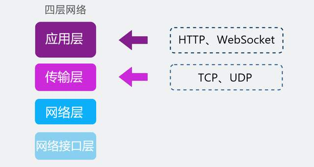
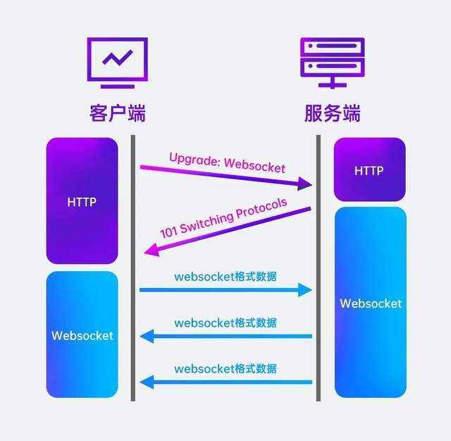
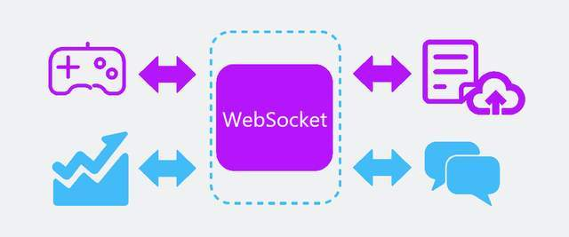
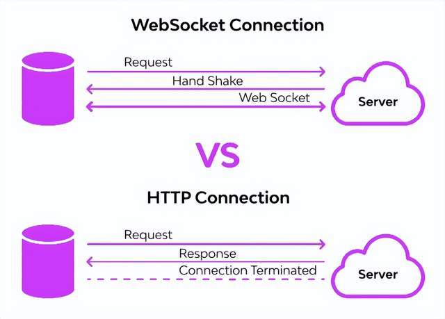
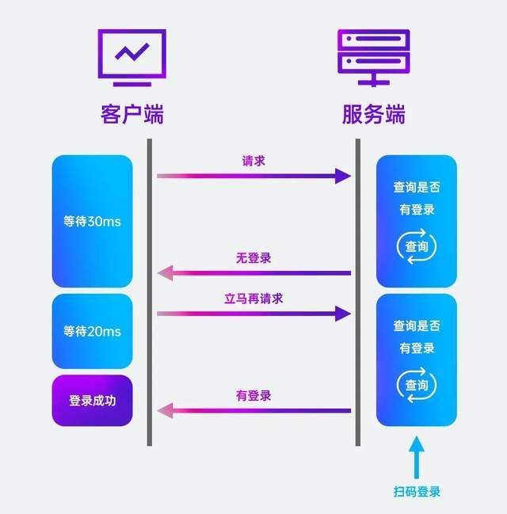

# 为什么有了HTTP，还需要WebSocket协议？

**HTTP**是基于TCP协议的，同一时间里，客户端和服务器只能有一方主动发数据，是半双工通信。

通常，打开某个网页，我们每点击一次网页上的某个选项，前端就会发送一次HTTP请求，网站返回一次HTTP响应。这种由客户端主动请求，服务器响应的方式满足大部分网页的功能场景。但这种情况下，服务器不会主动给客户端发消息。而类似网页游戏这样的场景，是需要客户端和服务器之间互相主动发大量数据的。

因此，我们需要一个基于TCP的新协议，即新的 **应用层协议WebSocket**。

## WebSocket是什么？
WebSocket 是一种用于在单个 TCP 连接上进行 **全双工通信 **的网络协议。它使用类似于 HTTP 的握手来建立连接，然后使用单独的持久连接来进行通信。这种方式使得 WebSocket 可以在浏览器和服务器之间进行实时通信，而不需要多次发送 HTTP 请求来获取数据。这意味着连接是持久的，它一直保持打开，直到有一方主动关闭连接。这使得 WebSocket 非常适合用于实时应用程序，因为它不需要不断地建立和关闭连接。

**WebSocket怎样建立连接？**

WebSocket 连接通常在客户端（例如浏览器）和服务器之间建立。客户端发送一个 HTTP 请求来建立连接，然后服务器返回一个确认消息，表示已建立连接。之后，客户端和服务器可以通过这个连接进行双向通信。客户端可以向服务器发送消息，服务器也可以向客户端发送消息。消息可以是任意的字节数组，并且可以使用任意的格式进行编码。

WebSocket 是一种必不可少的客户端—服务器通信工具，需要充分了解其实用性并避免使用场景才能从其最大潜力中获益。

## WebSocket的实际用途
最常见的用途是在实时应用程序开发中，它有助于在客户端持续显示数据。由于后端服务器不断发回此数据，WebSocket 允许在已打开的连接中不间断地推送或传输此数据，使此类数据传输更快，并利用了应用程序的性能。

聊天应用程序开发人员在一次性交换、发布、广播消息等操作中调用 WebSocket 。由于使用相同的 WebSocket 连接来发送或接收消息，因此通信变得简单、轻量、快捷。

在进行游戏应用程序开发的同时，服务器必须不间断地接收数据，而不要求刷新 UI。WebSocket在不影响游戏应用程序 UI 的情况下实现了这一目标。

从上述几个示例中，我们大概知道了在什么情况下不太适合使用，例如数据交互周期很长，甚至几小时一次的情况或只需要一次性处理数据时，不应采用 WebSocket协议。在这些情况下，使用 HTTP 协议是一个明智的选择。

由于 HTTP 和 WebSocket 都用于应用程序通信，因此人们常常感到困惑，很难从这两者中选择一个。

## WebSocket 与 HTTP 的选择
WebSocket 是一种框架双向协议。与此相反，HTTP 是一种单向协议，作用于 TCP 协议之上。由于WebSocket协议能够支持不间断的数据传输，因此主要用于实时应用程序开发。HTTP 是无状态的，用于开发RESTful和 SOAP 应用程序。SOAP 仍然可以使用 HTTP 来实现，但是 REST 被广泛传播和使用。

在 WebSocket 中，通信发生在两端，这使其成为更快的协议。在 HTTP 中，连接是在一端建立的，这使得它比 WebSocket 有点慢。WebSocket 使用统一的 TCP 连接，需要一方终止连接。在它发生之前，连接保持活动状态。HTTP 需要为单独的请求建立不同的连接。请求完成后，连接会自动断开。

现今对网络数据安全性也存在更多需求，WebSocket 连接使用的是标准的 TCP 连接，因此它可以在任何支持 TCP 的网络上使用。它使用的是 ws:// 和 wss:// 协议前缀，这些前缀可以与任何域名或 IP 地址结合使用。

WebSocket 连接是可以加密的，可以使用 TLS（Transport Layer Security，传输层安全）协议来保护数据的安全。这种加密连接使用的是 wss:// 协议前缀，与不加密的连接使用的 ws:// 协议前缀相区别。除此之外，WebSocket 还支持安全握手协议（Secure Handshake Protocol），这使得它可以在浏览器和服务器之间进行加密通信。总的来说，WebSocket 具有较高的安全性，可以保护数据的安全。

另外，需要注意的是，WebSocket不是基于HTTP的新协议，因为WebSocket只有在建立连接时才用到了HTTP，升级完成之后就跟HTTP不再有任何关系。

