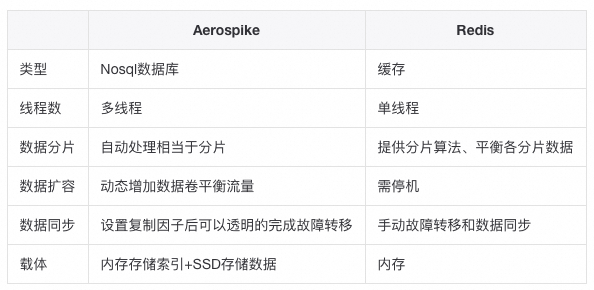
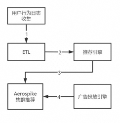
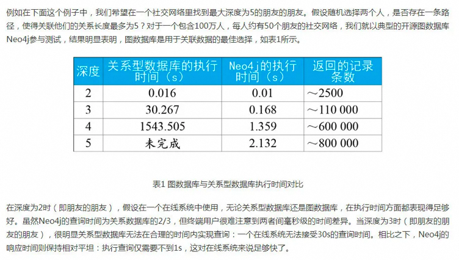
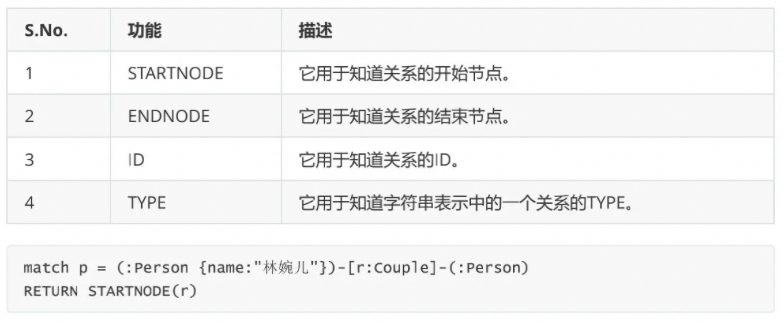
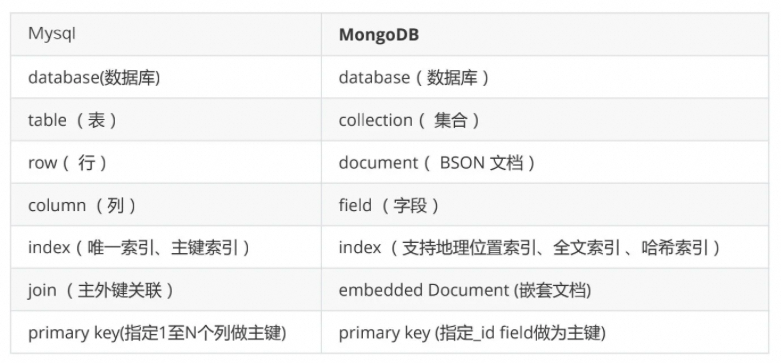
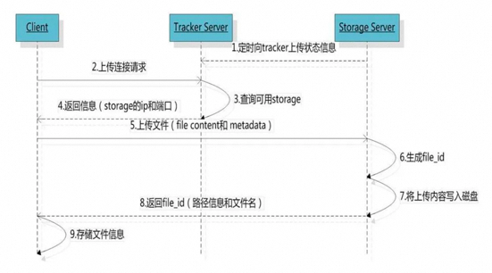
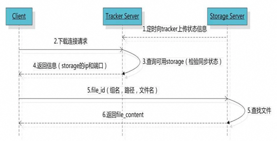
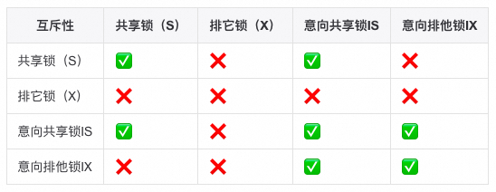
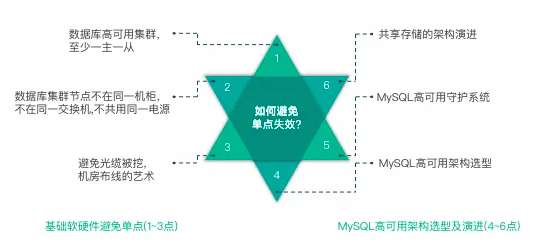

# MySQL篇

**<font style="color:rgb(255, 106, 0);">WhyMysql?</font>**

<font style="color:rgba(0, 0, 0, 0.9);">  
</font>

<font style="color:rgb(62, 62, 62);">NoSQL数据库四大家族      </font>

<font style="color:rgba(0, 0, 0, 0.9);"></font>

+ <font style="color:rgb(62, 62, 62);">列存储 Hbase</font>
+ <font style="color:rgb(62, 62, 62);">K-V存储 Redis</font>
+ <font style="color:rgb(62, 62, 62);">图像存储 Neo4j</font>
+ <font style="color:rgb(62, 62, 62);">文档存储 MongoDB</font>
+ <font style="color:rgb(62, 62, 62);">云存储OSS</font>

<font style="color:rgba(0, 0, 0, 0.9);">  
</font>

**<font style="color:rgb(255, 106, 0);">海量 Aerospike</font>**

<font style="color:rgba(0, 0, 0, 0.9);">  
</font>

<font style="color:rgb(62, 62, 62);">Aerospike（简称AS）是一个分布式，可扩展的键值存储的NoSQL数据库。T级别大数据高并发的结构化数据存储，采用混合架构，索引存储在内存中，而数据可存储在机械硬盘(HDD)或固态硬盘(SSD) 上，读写操作达微妙级，99%的响应可在1毫秒内实现。</font>

<font style="color:rgba(0, 0, 0, 0.9);">  
</font>



<font style="color:rgb(62, 62, 62);">Aerospike作为一个大容量的NoSql解决方案，适合对</font><font style="color:rgb(255, 106, 0);">容量要求比较大，QPS相对低</font><font style="color:rgb(62, 62, 62);">一些的场景，主要用在广告行业，</font><font style="color:rgb(255, 106, 0);">个性化推荐</font><font style="color:rgb(62, 62, 62);">厂告是建立在了和掌握消费者独特的偏好和习性的基础之上，对消费者的购买需求做出准确的预测或引导，在合适的位置、合适的时间，以合适的形式向消费者呈现与其需求高度吻合的广告，以此来促进用户的消费行为。</font>

<font style="color:rgba(0, 0, 0, 0.9);">  
</font>



<font style="color:rgb(62, 62, 62);">（ETL数据仓库技术）抽取（extract）、转换（transform）、加载（load）</font>

<font style="color:rgba(0, 0, 0, 0.9);">  
</font>

+ <font style="color:rgb(62, 62, 62);">用户行为日志收集系统收集日志之后推送到ETL做数据的清洗和转换</font>
+ <font style="color:rgb(62, 62, 62);">把ETL过后的数据发送到推荐引擎计算每个消费者的推荐结果，其中推荐逻辑包括规则和算法两部分</font>
+ <font style="color:rgb(62, 62, 62);">收集用户最近浏览、最长停留等特征，分析商品相似性、用户相似性、相似性等算法。</font>
+ <font style="color:rgb(62, 62, 62);">把推荐引擎的结果存入Aerospike集群中，并提供给广告投放引擎实时获取</font><font style="color:rgb(62, 62, 62);">分别通过HDFS和HBASE对日志进行离线和实时的分析，然后把用户画像的标签(tag : 程序猿、宅男...)结果存入高性能的Nosql数据库Aerospike中，同时把数据备份到异地数据中心。前端广告投放请求通过决策引擎（投放引擎）向用户画像数据库中读取相应的用户画像数据，然后根据竞价算法出价进行竞价。竞价成功之后就可以展现广告了。而在竞价成功之后，具体给用户展现什么样的广告，就是有上面说的个性化推荐广告来完成的。</font>


**<font style="color:rgb(255, 106, 0);">图谱Neo4j</font>**<font style="color:rgb(255, 106, 0);">  
</font>

<font style="color:rgba(0, 0, 0, 0.9);">  
</font>

<font style="color:rgb(127, 127, 127);">Neo4j是一个开源基于java开发的图形noSql数据库，它将结构化数据存储在图中而不是表中。它是一个嵌入式的、基于磁盘的、具备完全的事务特性的Java持久化引擎。程序数据是在一个面向对象的、灵活的网络结构下，而不是严格的表中，但具备完全的事务特性、企业级的数据库的所有好处。</font>

<font style="color:rgba(0, 0, 0, 0.9);">  
</font>

<font style="color:rgb(62, 62, 62);">一种基于图的数据结构，由节点(Node)和边(Edge)组成。其中节点即实体，由一个全局唯一的ID标示，边就是关系用于连接两个节点。通俗地讲，知识图谱就是把所有不同种类的信息，连接在一起而得到的一个关系网络。知识图谱提供了从“关系”的角度去分析问题的能力。</font>

<font style="color:rgba(0, 0, 0, 0.9);">  
</font>

<font style="color:rgb(62, 62, 62);">互联网、大数据的背景下，谷歌、百度、搜狗等搜索引擎纷纷基于该背景，创建自己的知识图Knowledge Graph、知心和知立方，主要用于改进搜索质量。</font>

<font style="color:rgba(0, 0, 0, 0.9);">  
</font>

<font style="color:rgb(62, 62, 62);">自己项目主要用作好友推荐，图数据库(Graph database)指的是以图数据结构的形式来存储和查询数据的数据库。关系图谱中，关系的组织形式采用的就是图结构，所以非常适合用图库进行存储。</font>

<font style="color:rgba(0, 0, 0, 0.9);">  
</font>



+ <font style="color:rgb(62, 62, 62);">优势总结:  
</font>
+ <font style="color:rgb(62, 62, 62);">性能上，使用cql查询，对长程关系的查询速度快</font>
+ <font style="color:rgb(62, 62, 62);">擅于发现隐藏的关系，例如通过判断图上两点之间有没有走的通的路径，就可以发现事物间的关联</font>



<font style="color:rgba(0, 0, 0, 0.9);">  
</font>

<font style="color:rgba(0, 0, 0, 0.9);">  
</font>

<font style="color:rgba(0, 0, 0, 0.9);">  
</font>

**<font style="color:rgb(255, 106, 0);">文档 MongoDB</font>**

<font style="color:rgba(0, 0, 0, 0.9);">  
</font>

<font style="color:rgb(127, 127, 127);">MongoDB 是一个基于分布式文件存储的数据库，是非关系数据库中功能最丰富、最像关系数据库的。在高负载的情况下，通过添加更多的节点，可以保证服务器性能。由 C++ 编写，可以为 WEB 应用提供可扩展、高性能、易部署的数据存储解决方案。</font>

<font style="color:rgba(0, 0, 0, 0.9);">  
</font>



**<font style="color:rgb(62, 62, 62);">什么是</font>****<font style="color:rgb(62, 62, 62);"> </font>****BSON**

<font style="color:rgba(0, 0, 0, 0.9);">  
</font>

<font style="color:rgb(127, 127, 127);">{key:value,key2:value2}和Json类似，是一种二进制形式的存储格式，支持内嵌的文档对象和数组对象，但是BSON有JSON没有的一些数据类型，比如 value包括字符串,double,Array,DateBSON可以做为网络数据交换的一种存储形式,它的优点是灵活性高，但它的缺点是空间利用率不是很理想。</font>

<font style="color:rgba(0, 0, 0, 0.9);">  
</font>

<font style="color:rgb(62, 62, 62);">BSON有三个特点：轻量性、可遍历性、高效性</font>

<font style="color:rgba(0, 0, 0, 0.9);">  
</font>

<font style="color:rgba(0, 0, 0, 0.9);">  
</font>

<font style="color:rgba(0, 0, 0, 0.9);">  
</font>

<font style="color:rgb(62, 62, 62);">优点：</font>

<font style="color:rgba(0, 0, 0, 0.9);">  
</font>

+ <font style="color:rgb(255, 106, 0);">文档结构的存储方式，能够更便捷的获取数据。</font><font style="color:rgb(62, 62, 62);">对于一个层级式的数据结构来说，使用扁平式的，表状的结构来查询保存数据非常的困难。</font>
+ <font style="color:rgb(255, 106, 0);">内置GridFS，支持大容量的存储。</font><font style="color:rgb(62, 62, 62);">GridFS是一个出色的分布式文件系统，支持海量的数据存储，满足对大数据集的快速范围查询。</font>
+ <font style="color:rgb(255, 106, 0);">性能优越</font><font style="color:rgb(62, 62, 62);">千万级别的文档对象，近10G的数据，对有索引的ID的查询 不会比mysql慢，而对非索引字段的查询，则是全面胜出。 mysql实际无法胜任大数据量下任意字段的查询，而mongodb的查询性能实在牛逼。写入性能同样很令人满意，同样写入百万级别的数据，mongodb基本10分钟以下可以解决。</font>

<font style="color:rgb(62, 62, 62);">缺点：</font>

<font style="color:rgba(0, 0, 0, 0.9);">  
</font>

+ <font style="color:rgb(62, 62, 62);">不支持事务</font>
+ <font style="color:rgb(62, 62, 62);">磁盘占用空间大</font>

<font style="color:rgb(62, 62, 62);">MySQL 8.0 版本</font>

<font style="color:rgb(62, 62, 62);">1. 性能：MySQL 8.0 的速度要比 MySQL 5.7 快 2 倍。</font>

<font style="color:rgb(62, 62, 62);">2. NoSQL：MySQL 从 5.7 版本开始提供 NoSQL 存储功能，在 8.0 版本中nosql得到了更大的改进。</font>

<font style="color:rgb(62, 62, 62);">3. 窗口函数：实现若干新的查询方式。窗口函数与 SUM()、COUNT() 这种集合函数类似，但它不会将多行查询结果合并为一行，而是将结果放回多行当中，即窗口函数不需要 GROUP BY。</font>

<font style="color:rgb(62, 62, 62);">4. 隐藏索引：在 MySQL 8.0 中，索引可以被“隐藏”和“显示”。当对索引进行隐藏时，它不会被查询优化器所使用。我们可以使用这个特性用于性能调试，例如我们先隐藏一个索引，然后观察其对数据库的影响。如果数据库性能有所下降，说明这个索引是有用的，然后将其“恢复显示”即可；如果数据库性能看不出变化，说明这个索引是多余的，可以考虑删掉。</font>

<font style="color:rgba(0, 0, 0, 0.9);">  
</font>

**<font style="color:rgb(255, 106, 0);">云存储</font>**

<font style="color:rgba(0, 0, 0, 0.9);">  
</font>


**<font style="color:rgb(62, 62, 62);">使用步骤</font>**

<font style="color:rgba(0, 0, 0, 0.9);">  
</font>

<font style="color:rgb(62, 62, 62);">1、开通服务</font>

<font style="color:rgb(62, 62, 62);">2、创建存储空间</font>

<font style="color:rgb(62, 62, 62);">3、上传文件、下载文件、删除文件</font>

<font style="color:rgb(62, 62, 62);">4、域名绑定、日志记录</font>

<font style="color:rgb(62, 62, 62);">5、根据开放接口进行鉴权访问</font>

<font style="color:rgba(0, 0, 0, 0.9);">  
</font>

**<font style="color:rgb(62, 62, 62);">功能</font>**

<font style="color:rgba(0, 0, 0, 0.9);">  
</font>

<font style="color:rgb(62, 62, 62);">图片编辑（裁剪、模糊、水印）  
</font>

<font style="color:rgba(0, 0, 0, 0.9);">  
</font>

**<font style="color:rgb(62, 62, 62);">视频截图</font>**

<font style="color:rgb(62, 62, 62);">音频转码、视频修复  
</font>

<font style="color:rgba(0, 0, 0, 0.9);">  
</font>

**CDN加速**

<font style="color:rgba(0, 0, 0, 0.9);">  
</font>

<font style="color:rgb(62, 62, 62);">对象存储OSS与阿里云CDN服务结合，可优化静态热点文件下载加速的场景（即同一地区大量用户同时下载同一个静态文件的场景）。可以将OSS的存储空间（Bucket）作为源站，利用阿里云CDN将源内容发布到边缘节点。当大量终端用户重复访问同一文件时，可以直接从边缘节点获取已缓存的数据，提高访问的响应速度。</font>

<font style="color:rgba(0, 0, 0, 0.9);">  
</font>

**<font style="color:rgb(255, 106, 0);">FastDFS</font>**

<font style="color:rgba(0, 0, 0, 0.9);">  
</font>

<font style="color:rgb(127, 127, 127);">开源的轻量级分布式文件系统。它对文件进行管理，功能包括：文件存储、文件同步、文件访问（文件上传、文件下载）等，解决了大容量存储和负载均衡的问题。使用FastDFS很容易搭建一套高性能的文件服务器集群提供文件上传、下载等服务。如相册网站、视频网站等。</font>

<font style="color:rgba(0, 0, 0, 0.9);">  
</font>

**<font style="color:rgb(62, 62, 62);">扩展能力: </font>**<font style="color:rgb(62, 62, 62);">支持水平扩展，可以动态扩容；</font>

<font style="color:rgba(0, 0, 0, 0.9);">  
</font>

**<font style="color:rgb(62, 62, 62);">高可用性: </font>**<font style="color:rgb(62, 62, 62);">一是整个文件系统的可用性，二是数据的完整和一致性；</font>

<font style="color:rgba(0, 0, 0, 0.9);">  
</font>

**<font style="color:rgb(62, 62, 62);">弹性存储: </font>**<font style="color:rgb(62, 62, 62);">可以根据业务需要灵活地增删存储池中的资源，而不需要中断系统运行。</font>

<font style="color:rgba(0, 0, 0, 0.9);">  
</font>


**<font style="color:rgb(62, 62, 62);">特性</font>**

<font style="color:rgba(0, 0, 0, 0.9);">  
</font>

+ <font style="color:rgb(62, 62, 62);">和流行的web server无缝衔接，FastDFS已提供apache和nginx扩展模块</font>
+ <font style="color:rgb(62, 62, 62);">文件ID由FastDFS生成，作为文件访问凭证，FastDFS不需要传统的name server</font>
+ <font style="color:rgb(62, 62, 62);">分组存储，灵活简洁、对等结构，不存在单点</font>
+ <font style="color:rgb(62, 62, 62);">文件不分块存储，上传的文件和OS文件系统中的文件一一对应</font>
+ <font style="color:rgb(62, 62, 62);">中、小文件均可以很好支持，支持海量小文件存储</font>
+ <font style="color:rgb(62, 62, 62);">支持相同内容的文件只保存一份，节约磁盘空间</font>
+ <font style="color:rgb(62, 62, 62);">支持多块磁盘，支持单盘数据恢复</font>
+ <font style="color:rgb(62, 62, 62);">支持在线扩容 支持主从文件</font>
+ <font style="color:rgb(62, 62, 62);">下载文件支持多线程方式，支持断点续传</font>

**<font style="color:rgb(62, 62, 62);">组成</font>**

<font style="color:rgba(0, 0, 0, 0.9);">  
</font>

+ <font style="color:rgb(255, 106, 0);">客户端（client）</font><font style="color:rgb(62, 62, 62);">通过专有接口，使用TCP/IP协议与跟踪器服务器或存储节点进行数据交互。</font>
+ <font style="color:rgb(255, 106, 0);">跟踪器（tracker）</font><font style="color:rgb(62, 62, 62);">Trackerserver作用是负载均衡和调度，通过Tracker server在文件上传时可以根据策略找到文件上传的地址。Tracker在访问上起负载均衡的作用。</font>
+ <font style="color:rgb(255, 106, 0);">存储节点（storage）</font><font style="color:rgb(62, 62, 62);">Storageserver作用是文件存储，客户端上传的文件最终存储在Storage服务器上，Storage server没有实现自己的文件系统而是利用操作系统的文件系统来管理文件。存储节点中的服务器均可以随时增加或下线而不会影响线上服务。</font>

**<font style="color:rgb(62, 62, 62);">上传</font>**

<font style="color:rgba(0, 0, 0, 0.9);">  
</font>



**<font style="color:rgb(62, 62, 62);">下载</font>**

<font style="color:rgba(0, 0, 0, 0.9);">  
</font>



**<font style="color:rgb(62, 62, 62);">断点续传</font>**

<font style="color:rgba(0, 0, 0, 0.9);">  
</font>

<font style="color:rgb(62, 62, 62);">续传涉及到的文件大小MD5不会改变。续传流程与文件上传类似，先定位到源storage，完成完整或部分上传，再通过binlog进行同group内server文件同步。</font>

<font style="color:rgba(0, 0, 0, 0.9);">  
</font>

**<font style="color:rgb(62, 62, 62);">配置优化</font>**

<font style="color:rgba(0, 0, 0, 0.9);">  
</font>

<font style="color:rgb(62, 62, 62);">配置文件：tracker.conf 和 storage.conf </font>

<font style="color:rgba(0, 0, 0, 0.9);">  
</font>

<font style="color:rgba(0, 0, 0, 0.9);">  
</font>

<font style="color:rgba(0, 0, 0, 0.9);">  
</font>

<font style="color:rgba(0, 0, 0, 0.9);">  
</font>

**<font style="color:rgb(62, 62, 62);">避免重复</font>**

<font style="color:rgba(0, 0, 0, 0.9);">  
</font>

<font style="color:rgb(62, 62, 62);">如何避免文件重复上传 解决方案 上传成功后计算文件对应的MD5然后存入MySQL,添加文件时把文件MD5和之前存入MYSQL中的存储的信息对比 。DigestUtils.md5DigestAsHex(bytes)。</font>

<font style="color:rgba(0, 0, 0, 0.9);">  
</font>

**<font style="color:rgb(255, 106, 0);">事务</font>**

<font style="color:rgba(0, 0, 0, 0.9);">  
</font>

**<font style="color:rgb(255, 106, 0);">1 事务4大特性</font>**

<font style="color:rgba(0, 0, 0, 0.9);">  
</font>

**<font style="color:rgb(62, 62, 62);">事务4大特性：</font>**<font style="color:rgb(62, 62, 62);">原子性、一致性、隔离性、持久性</font>

<font style="color:rgba(0, 0, 0, 0.9);">  
</font>

**<font style="color:rgb(62, 62, 62);">原⼦性： </font>**<font style="color:rgb(62, 62, 62);">事务是最⼩的执⾏单位，不允许分割。事务的原⼦性确保动作要么全部完成，要么全不执行</font>

<font style="color:rgba(0, 0, 0, 0.9);">  
</font>

**<font style="color:rgb(62, 62, 62);">一致性： </font>**<font style="color:rgb(62, 62, 62);">执⾏事务前后，数据保持⼀致，多个事务对同⼀个数据读取的结果是相同的；</font>

<font style="color:rgba(0, 0, 0, 0.9);">  
</font>

**<font style="color:rgb(62, 62, 62);">隔离性： </font>**<font style="color:rgb(62, 62, 62);">并发访问数据库时，⼀个⽤户的事务不被其他事务所⼲扰，各并发事务之间数据库是独⽴的；</font>

<font style="color:rgba(0, 0, 0, 0.9);">  
</font>

**<font style="color:rgb(62, 62, 62);">持久性： </font>**<font style="color:rgb(62, 62, 62);">⼀个事务被提交之后。它对数据库中数据的改变是持久的，即使数据库发⽣故障也不应该对其有任何影响。</font>

<font style="color:rgba(0, 0, 0, 0.9);">  
</font>

**<font style="color:rgb(62, 62, 62);">实现保证：</font>**<font style="color:rgb(62, 62, 62);">MySQL的存储引擎InnoDB使用重做日志保证一致性与持久性，回滚日志保证原子性，使用各种锁来保证隔离性。</font>

<font style="color:rgba(0, 0, 0, 0.9);">  
</font>

**<font style="color:rgb(255, 106, 0);">2 事务隔离级别</font>**

<font style="color:rgba(0, 0, 0, 0.9);">  
</font>

**<font style="color:rgb(62, 62, 62);">读未提交：</font>**<font style="color:rgb(62, 62, 62);">最低的隔离级别，允许读取尚未提交的数据变更，可能会导致脏读、幻读或不可重复读。</font>

<font style="color:rgba(0, 0, 0, 0.9);">  
</font>

<font style="color:rgb(62, 62, 62);">读已提交：允许读取并发事务已经提交的数据，可以阻⽌脏读，但是幻读或不可重复读仍有可能发⽣。</font>

<font style="color:rgba(0, 0, 0, 0.9);">  
</font>

**<font style="color:rgb(62, 62, 62);">可重复读：</font>**<font style="color:rgb(62, 62, 62);">同⼀字段的多次读取结果都是⼀致的，除⾮数据是被本身事务⾃⼰所修改，可以阻⽌脏读和不可重复读，会有幻读。</font>

<font style="color:rgba(0, 0, 0, 0.9);">  
</font>

**<font style="color:rgb(62, 62, 62);">串行化：</font>**<font style="color:rgb(62, 62, 62);">最⾼的隔离级别，完全服从ACID的隔离级别。所有的事务依次逐个执⾏，这样事务之间就完全不可能产⽣⼲扰。</font>

<font style="color:rgba(0, 0, 0, 0.9);">  
</font>


**<font style="color:rgb(255, 106, 0);">3 默认隔离级别-RR</font>**<font style="color:rgb(255, 106, 0);">  
</font>

<font style="color:rgba(0, 0, 0, 0.9);">  
</font>

**<font style="color:rgb(62, 62, 62);">默认隔离级别：</font>**<font style="color:rgb(62, 62, 62);">可重复读；</font>

<font style="color:rgba(0, 0, 0, 0.9);">  
</font>

<font style="color:rgb(62, 62, 62);">同⼀字段的多次读取结果都是⼀致的，除⾮数据是被本身事务⾃⼰所修改；</font>

<font style="color:rgba(0, 0, 0, 0.9);">  
</font>

<font style="color:rgb(62, 62, 62);">可重复读是有可能出现幻读的，如果要保证绝对的安全只能把隔离级别设置成SERIALIZABLE；这样所有事务都只能顺序执行，自然不会因为并发有什么影响了，但是性能会下降许多。</font>

<font style="color:rgba(0, 0, 0, 0.9);">  
</font>

<font style="color:rgb(62, 62, 62);">第二种方式，使用MVCC解决快照读幻读问题（如简单select），读取的不是最新的数据。维护一个字段作为version，这样可以控制到每次只能有一个人更新一个版本。</font>

<font style="color:rgba(0, 0, 0, 0.9);">  
</font>

<font style="color:rgba(0, 0, 0, 0.9);">  
</font>

<font style="color:rgba(0, 0, 0, 0.9);">  
</font>

<font style="color:rgb(62, 62, 62);">第三种方式，如果需要读最新的数据，可以通过GapLock+Next-KeyLock可以解决当前读幻读问题，</font>

<font style="color:rgba(0, 0, 0, 0.9);">  
</font>

<font style="color:rgba(0, 0, 0, 0.9);">  
</font>

<font style="color:rgba(0, 0, 0, 0.9);">  
</font>

**<font style="color:rgb(255, 106, 0);">4 RR和RC使用场景</font>**

<font style="color:rgba(0, 0, 0, 0.9);">  
</font>

<font style="color:rgb(62, 62, 62);">事务隔离级别RC(read commit)和RR（repeatable read）两种事务隔离级别基于多版本并发控制MVCC(multi-version concurrency control）来实现。</font>

<font style="color:rgba(0, 0, 0, 0.9);">  
</font>


**<font style="color:rgb(255, 106, 0);">5 行锁，表锁，意向锁</font>**<font style="color:rgb(255, 106, 0);">  
</font>

<font style="color:rgba(0, 0, 0, 0.9);">  
</font>

**<font style="color:rgb(62, 62, 62);">InnoDB⽀持⾏级锁(row-level locking)和表级锁,默认为⾏级锁</font>**

<font style="color:rgba(0, 0, 0, 0.9);">  
</font>

**<font style="color:rgb(62, 62, 62);">InnoDB按照不同的分类的锁：</font>**

<font style="color:rgba(0, 0, 0, 0.9);">  
</font>

<font style="color:rgb(62, 62, 62);">共享/排它锁(Shared and Exclusive Locks)：行级别锁</font>

<font style="color:rgba(0, 0, 0, 0.9);">  
</font>

<font style="color:rgb(62, 62, 62);">意向锁(Intention Locks)，表级别锁</font>

<font style="color:rgba(0, 0, 0, 0.9);">  
</font>

<font style="color:rgb(62, 62, 62);">间隙锁(Gap Locks)，锁定一个区间</font>

<font style="color:rgba(0, 0, 0, 0.9);">  
</font>

<font style="color:rgb(62, 62, 62);">记录锁(Record Locks)，锁定一个行记录</font>

<font style="color:rgba(0, 0, 0, 0.9);">  
</font>

**<font style="color:rgb(62, 62, 62);">表级锁（串行化）:</font>**<font style="color:rgb(62, 62, 62);">Mysql中锁定 粒度最大的一种锁，对当前操作的整张表加锁，实现简单 ，资源消耗也比较少，加锁快，不会出现死锁 。其锁定粒度最大，触发锁冲突的概率最高，并发度最低，MyISAM和 InnoDB引擎都支持表级锁。</font>

<font style="color:rgba(0, 0, 0, 0.9);">  
</font>

**<font style="color:rgb(62, 62, 62);">行级锁（RR、RC）:</font>**<font style="color:rgb(62, 62, 62);">Mysql中锁定 粒度最小 的一种锁，只针对当前操作的行进行加锁。 行级锁能大大减少数据库操作的冲突。其加锁粒度最小，并发度高，但加锁的开销也最大，加锁慢，会出现死锁。 InnoDB支持的行级锁，包括如下几种：</font>

<font style="color:rgba(0, 0, 0, 0.9);">  
</font>

**<font style="color:rgb(62, 62, 62);">记录锁（Record Lock）: </font>**<font style="color:rgb(62, 62, 62);">对索引项加锁，锁定符合条件的行。其他事务不能修改和删除加锁项；</font>

<font style="color:rgba(0, 0, 0, 0.9);">  
</font>

**<font style="color:rgb(62, 62, 62);">间隙锁（Gap Lock）: </font>**<font style="color:rgb(62, 62, 62);">对索引项之间的“间隙”加锁，锁定记录的范围，不包含索引项本身，其他事务不能在锁范围内插入数据。</font>

<font style="color:rgba(0, 0, 0, 0.9);">  
</font>

**<font style="color:rgb(62, 62, 62);">Next-key Lock：</font>**<font style="color:rgb(62, 62, 62);"> 锁定索引项本身和索引范围。即Record Lock和Gap Lock的结合。可解决幻读问题。</font>

<font style="color:rgba(0, 0, 0, 0.9);">  
</font>

<font style="color:rgb(62, 62, 62);">InnoDB 支持多粒度锁（multiple granularity locking），它允许行级锁与表级锁共存，而意向锁就是其中的一种表锁。</font>

<font style="color:rgba(0, 0, 0, 0.9);">  
</font>

**<font style="color:rgb(62, 62, 62);">共享锁</font>**<font style="color:rgb(62, 62, 62);">（ shared lock, S ）锁允许持有锁读取行的事务。加锁时将自己和子节点全加S锁，父节点直到表头全加IS锁</font>

<font style="color:rgba(0, 0, 0, 0.9);">  
</font>

**<font style="color:rgb(62, 62, 62);">排他锁</font>**<font style="color:rgb(62, 62, 62);">（ exclusive lock， X ）锁允许持有锁修改行的事务。 加锁时将自己和子节点全加X锁，父节点直到表头全加IX锁 </font>

<font style="color:rgba(0, 0, 0, 0.9);">  
</font>

**<font style="color:rgb(62, 62, 62);">意向共享锁</font>**<font style="color:rgb(62, 62, 62);">（intention shared lock, IS）：事务有意向对表中的某些行加共享锁（S锁）</font>

<font style="color:rgba(0, 0, 0, 0.9);">  
</font>

**<font style="color:rgb(62, 62, 62);">意向排他锁</font>**<font style="color:rgb(62, 62, 62);">（intention exclusive lock, IX）：事务有意向对表中的某些行加排他锁（X锁）</font>

<font style="color:rgba(0, 0, 0, 0.9);">  
</font>



**<font style="color:rgb(255, 106, 0);">6 MVCC多版本并发控制</font>**<font style="color:rgb(255, 106, 0);">  
</font>

<font style="color:rgba(0, 0, 0, 0.9);">  
</font>

<font style="color:rgb(62, 62, 62);">MVCC是一种多版本并发控制机制，通过事务的可见性看到自己预期的数据，能降低其系统开销。（RC和RR级别工作）</font>

<font style="color:rgba(0, 0, 0, 0.9);">  
</font>

<font style="color:rgb(62, 62, 62);">InnoDB的MVCC,是通过在每行记录后面保存系统版本号(可以理解为事务的ID)，每开始一个新的事务，系统版本号就会自动递增，事务开始时刻的系统版本号会作为事务的ID。这样可以确保事务读取的行，要么是在事务开始前已经存在的，要么是事务自身插入或者修改过的，防止幻读的产生。</font>

<font style="color:rgba(0, 0, 0, 0.9);">  
</font>

<font style="color:rgb(62, 62, 62);">1.MVCC手段只适用于Msyql隔离级别中的读已提交（Read committed）和可重复读（Repeatable Read）.</font>

<font style="color:rgb(62, 62, 62);">2.Read uncimmitted由于存在脏读，即能读到未提交事务的数据行，所以不适用MVCC.</font>

<font style="color:rgb(62, 62, 62);">3.简单的select快照度不会加锁，删改及select for update等需要当前读的场景会加锁</font>

<font style="color:rgba(0, 0, 0, 0.9);">  
</font>

<font style="color:rgb(62, 62, 62);">原因是MVCC的创建版本和删除版本只要在事务提交后才会产生。客观上，mysql使用的是乐观锁的一整实现方式，就是每行都有版本号，保存时根据版本号决定是否成功。Innodb的MVCC使用到的快照存储在Undo日志中，该日志通过回滚指针把一个数据行所有快照连接起来。</font>

<font style="color:rgba(0, 0, 0, 0.9);">  
</font>

**<font style="color:rgb(62, 62, 62);">版本链</font>**

<font style="color:rgba(0, 0, 0, 0.9);">  
</font>

<font style="color:rgb(62, 62, 62);">在InnoDB引擎表中，它的聚簇索引记录中有两个必要的隐藏列：</font>

<font style="color:rgba(0, 0, 0, 0.9);">  
</font>

**<font style="color:rgb(62, 62, 62);">trx_id</font>**

<font style="color:rgba(0, 0, 0, 0.9);">  
</font>

<font style="color:rgb(62, 62, 62);">这个id用来存储的每次对某条聚簇索引记录进行修改的时候的事务id。</font>

<font style="color:rgba(0, 0, 0, 0.9);">  
</font>

**<font style="color:rgb(62, 62, 62);">roll_pointer</font>**

<font style="color:rgba(0, 0, 0, 0.9);">  
</font>

<font style="color:rgb(62, 62, 62);">每次对哪条聚簇索引记录有修改的时候，都会把老版本写入undo日志中。这个roll_pointer就是存了一个指针，它指向这条聚簇索引记录的上一个版本的位置，通过它来获得上一个版本的记录信息。(注意插入操作的undo日志没有这个属性，因为它没有老版本)</font>

<font style="color:rgba(0, 0, 0, 0.9);">  
</font>

<font style="color:rgb(62, 62, 62);">每次修改都会在版本链中记录。SELECT可以去版本链中拿记录，这就实现了读-写，写-读的并发执行，提升了系统的性能。</font>

<font style="color:rgba(0, 0, 0, 0.9);">  
</font>

**<font style="color:rgb(255, 106, 0);">索引</font>**

<font style="color:rgba(0, 0, 0, 0.9);">  
</font>

**<font style="color:rgb(255, 106, 0);">1 Innodb和Myisam引擎</font>**

<font style="color:rgba(0, 0, 0, 0.9);">  
</font>

<font style="color:rgb(62, 62, 62);">Myisam：支持表锁，适合读密集的场景，不支持外键，不支持事务，索引与数据在不同的文件</font>

<font style="color:rgba(0, 0, 0, 0.9);">  
</font>

<font style="color:rgb(62, 62, 62);">Innodb：支持行、表锁，默认为行锁，适合并发场景，支持外键，支持事务，索引与数据同一文件</font>

<font style="color:rgba(0, 0, 0, 0.9);">  
</font>

**<font style="color:rgb(255, 106, 0);">2 哈希索引</font>**

<font style="color:rgba(0, 0, 0, 0.9);">  
</font>

<font style="color:rgb(62, 62, 62);">哈希索引用索引列的值计算该值的hashCode，然后在hashCode相应的位置存执该值所在行数据的物理位置，因为使用散列算法，因此访问速度非常快，但是一个值只能对应一个hashCode，而且是散列的分布方式，因此哈希索引不支持范围查找和排序的功能。</font>

<font style="color:rgba(0, 0, 0, 0.9);">  
</font>

**<font style="color:rgb(255, 106, 0);">3 B+树索引</font>**

<font style="color:rgba(0, 0, 0, 0.9);">  
</font>

<font style="color:rgb(62, 62, 62);">优点：</font>

<font style="color:rgba(0, 0, 0, 0.9);">  
</font>

<font style="color:rgb(62, 62, 62);">B+树的磁盘读写代价低，更少的查询次数，查询效率更加稳定，有利于对数据库的扫描</font>

<font style="color:rgba(0, 0, 0, 0.9);">  
</font>

<font style="color:rgb(62, 62, 62);">B+树是B树的升级版，B+树只有叶节点存放数据，其余节点用来索引。索引节点可以全部加入内存，增加查询效率，叶子节点可以做双向链表，从而</font><font style="color:rgb(255, 106, 0);">提高范围查找的效率，增加的索引的范围</font><font style="color:rgb(62, 62, 62);">。</font>

<font style="color:rgba(0, 0, 0, 0.9);">  
</font>

<font style="color:rgb(62, 62, 62);">在大规模数据存储的时候，红黑树往往出现由于</font><font style="color:rgb(255, 106, 0);">树的深度过大</font><font style="color:rgb(62, 62, 62);">而造成磁盘IO读写过于频繁，进而导致效率低下的情况。所以，只要我们通过某种较好的树结构减少树的结构尽量减少树的高度，B树与B+树可以有多个子女，从几十到上千，可以降低树的高度。</font>

<font style="color:rgba(0, 0, 0, 0.9);">  
</font>

<font style="color:rgb(255, 106, 0);">磁盘预读原理：</font><font style="color:rgb(62, 62, 62);">将一个节点的大小设为等于一个页，这样每个节点只需要一次I/O就可以完全载入。为了达到这个目的，在实际实现</font>B-Tree<font style="color:rgb(62, 62, 62);">还需要使用如下技巧：每次新建节点时，直接申请一个页的空间，这样就保证</font><font style="color:rgb(255, 106, 0);">一个节点物理上也存储在一个页里</font><font style="color:rgb(62, 62, 62);">，加之计算机存储分配都是按页对齐的，就实现了一个node只需一次I/O。</font>

<font style="color:rgba(0, 0, 0, 0.9);">  
</font>

**<font style="color:rgb(255, 106, 0);">4 创建索引</font>**

<font style="color:rgba(0, 0, 0, 0.9);">  
</font>

<font style="color:rgba(0, 0, 0, 0.9);">  
</font>

<font style="color:rgba(0, 0, 0, 0.9);">  
</font>

**<font style="color:rgb(255, 106, 0);">5 聚簇索引和非聚簇索引</font>**

<font style="color:rgba(0, 0, 0, 0.9);">  
</font>

**<font style="color:rgb(62, 62, 62);">聚簇索引：</font>**<font style="color:rgb(62, 62, 62);">将数据存储与索引放到了一块，索引结构的叶子节点保存了行数据（主键索引）</font>

<font style="color:rgba(0, 0, 0, 0.9);">  
</font>

**<font style="color:rgb(62, 62, 62);">非聚簇索引：</font>**<font style="color:rgb(62, 62, 62);">将数据与索引分开存储，索引结构的叶子节点指向了数据对应的位置（辅助索引）</font>

<font style="color:rgba(0, 0, 0, 0.9);">  
</font>

<font style="color:rgb(62, 62, 62);">聚簇索引的叶子节点就是数据节点，而非聚簇索引的叶子节点仍然是索引节点，只不过有指向对应数据块的指针。</font>

<font style="color:rgba(0, 0, 0, 0.9);">  
</font>

**<font style="color:rgb(255, 106, 0);">6 最左前缀问题</font>**

<font style="color:rgba(0, 0, 0, 0.9);">  
</font>

<font style="color:rgb(62, 62, 62);">最左前缀原则主要使用在联合索引中，联合索引的B+Tree是按照第一个关键字进行索引排列的。</font>

<font style="color:rgba(0, 0, 0, 0.9);">  
</font>

<font style="color:rgb(62, 62, 62);">联合索引的底层是一颗B+树，只不过联合索引的B+树节点中存储的是键值。由于构建一棵B+树只能根据一个值来确定索引关系，所以数据库依赖联合索引最左的字段来构建。</font>

<font style="color:rgba(0, 0, 0, 0.9);">  
</font>

<font style="color:rgb(62, 62, 62);">采用>、<等进行匹配都会导致后面的列无法走索引，因为通过以上方式匹配到的数据是不可知的。</font>

<font style="color:rgba(0, 0, 0, 0.9);">  
</font>

**<font style="color:rgb(255, 106, 0);">SQL 查询</font>**

<font style="color:rgba(0, 0, 0, 0.9);">  
</font>

**<font style="color:rgb(255, 106, 0);">1 SQL语句的执行过程</font>**

<font style="color:rgba(0, 0, 0, 0.9);">  
</font>

<font style="color:rgb(62, 62, 62);">查询语句：</font>

<font style="color:rgba(0, 0, 0, 0.9);">  
</font>

<font style="color:rgba(0, 0, 0, 0.9);">  
</font>

<font style="color:rgba(0, 0, 0, 0.9);">  
</font>


<font style="color:rgba(0, 0, 0, 0.9);">  
</font>

<font style="color:rgb(62, 62, 62);">结合上面的说明，我们分析下这个语句的执行流程：</font>

<font style="color:rgba(0, 0, 0, 0.9);">  
</font>

<font style="color:rgb(62, 62, 62);">①通过客户端/服务器通信协议与 MySQL 建立连接。并查询是否有权限</font>

<font style="color:rgb(62, 62, 62);">②Mysql8.0之前开看是否开启缓存，开启了 Query Cache 且命中完全相同的 SQL 语句，则将查询结果直接返回给客户端；</font>

<font style="color:rgb(62, 62, 62);">③由解析器进行语法语义解析，并生成解析树。如查询是select、表名tb_student、条件是id='1'</font>

<font style="color:rgb(62, 62, 62);">④查询优化器生成执行计划。根据索引看看是否可以优化</font>

<font style="color:rgb(62, 62, 62);">⑤查询执行引擎执行 SQL 语句，根据存储引擎类型，得到查询结果。若开启了 Query Cache，则缓存，否则直接返回。</font>

<font style="color:rgba(0, 0, 0, 0.9);">  
</font>

**<font style="color:rgb(255, 106, 0);">2 回表查询和覆盖索引</font>**

<font style="color:rgba(0, 0, 0, 0.9);">  
</font>

<font style="color:rgb(62, 62, 62);">普通索引（唯一索引+联合索引+全文索引）需要扫描两遍索引树</font>

<font style="color:rgba(0, 0, 0, 0.9);">  
</font>

<font style="color:rgb(62, 62, 62);">（1）先通过普通索引定位到主键值id=5；</font>

<font style="color:rgb(62, 62, 62);">（2）在通过聚集索引定位到行记录；</font>

<font style="color:rgba(0, 0, 0, 0.9);">  
</font>

<font style="color:rgb(62, 62, 62);">这就是所谓的回表查询，先定位主键值，再定位行记录，它的性能较扫一遍索引树更低。</font>

<font style="color:rgba(0, 0, 0, 0.9);">  
</font>

**<font style="color:rgb(62, 62, 62);">覆盖索引：</font>**<font style="color:rgb(62, 62, 62);">主键索引==聚簇索引==覆盖索引</font>

<font style="color:rgba(0, 0, 0, 0.9);">  
</font>

<font style="color:rgb(62, 62, 62);">如果where条件的列和返回的数据在一个索引中，那么不需要回查表，那么就叫覆盖索引。</font>

<font style="color:rgba(0, 0, 0, 0.9);">  
</font>

**<font style="color:rgb(62, 62, 62);">实现覆盖索引：</font>**<font style="color:rgb(62, 62, 62);">常见的方法是，将被查询的字段，建立到联合索引里去。</font>

<font style="color:rgba(0, 0, 0, 0.9);">  
</font>

**<font style="color:rgb(255, 106, 0);">3 Explain 及优化</font>**

<font style="color:rgba(0, 0, 0, 0.9);">  
</font>

<font style="color:rgb(62, 62, 62);">参考：https://www.jianshu.com/p/8fab76bbf448</font>

<font style="color:rgba(0, 0, 0, 0.9);">  
</font>

<font style="color:rgba(0, 0, 0, 0.9);">  
</font>

<font style="color:rgba(0, 0, 0, 0.9);">  
</font>

**<font style="color:rgb(62, 62, 62);">索引优化：</font>**

<font style="color:rgba(0, 0, 0, 0.9);">  
</font>

<font style="color:rgb(62, 62, 62);">①最左前缀索引：like只用于'string%'，语句中的=和in会动态调整顺序</font>

<font style="color:rgb(62, 62, 62);">②唯一索引：唯一键区分度在0.1以上</font>

<font style="color:rgb(62, 62, 62);">③无法使用索引：!= 、is null 、 or、>< 、（5.7以后根据数量自动判定）in 、not in</font>

<font style="color:rgb(62, 62, 62);">④联合索引：避免select * ，查询列使用覆盖索引</font>

<font style="color:rgba(0, 0, 0, 0.9);">  
</font>

<font style="color:rgba(0, 0, 0, 0.9);">  
</font>

<font style="color:rgba(0, 0, 0, 0.9);">  
</font>

**<font style="color:rgb(62, 62, 62);">语句优化：</font>**

<font style="color:rgba(0, 0, 0, 0.9);">  
</font>

<font style="color:rgb(62, 62, 62);">①char固定长度查询效率高，varchar第一个字节记录数据长度</font>

<font style="color:rgb(62, 62, 62);">②应该针对Explain中Rows增加索引</font>

<font style="color:rgb(62, 62, 62);">③group/order by字段均会涉及索引</font>

<font style="color:rgb(62, 62, 62);">④Limit中分页查询会随着start值增大而变缓慢，通过子查询+表连接解决</font>

<font style="color:rgba(0, 0, 0, 0.9);">  
</font>

<font style="color:rgba(0, 0, 0, 0.9);">  
</font>

<font style="color:rgba(0, 0, 0, 0.9);">  
</font>

<font style="color:rgb(62, 62, 62);">⑤count会进行全表扫描，如果估算可以使用explain</font>

<font style="color:rgb(62, 62, 62);">⑥delete删除表时会增加大量undo和redo日志， 确定删除可使用trancate</font>

<font style="color:rgba(0, 0, 0, 0.9);">  
</font>

**<font style="color:rgb(62, 62, 62);">表结构优化：</font>**

<font style="color:rgba(0, 0, 0, 0.9);">  
</font>

<font style="color:rgb(62, 62, 62);">①单库不超过200张表</font>

<font style="color:rgb(62, 62, 62);">②单表不超过500w数据</font>

<font style="color:rgb(62, 62, 62);">③单表不超过40列</font>

<font style="color:rgb(62, 62, 62);">④单表索引不超过5个</font>

<font style="color:rgba(0, 0, 0, 0.9);">  
</font>

**<font style="color:rgb(62, 62, 62);">数据库范式 ：</font>**

<font style="color:rgba(0, 0, 0, 0.9);">  
</font>

<font style="color:rgb(62, 62, 62);">①第一范式（</font>1NF<font style="color:rgb(62, 62, 62);">）列不可分割</font>

<font style="color:rgb(62, 62, 62);">②第二范式（</font>2NF<font style="color:rgb(62, 62, 62);">）属性完全依赖于主键 [ 消除部分子函数依赖 ]</font>

<font style="color:rgb(62, 62, 62);">③第三范式（3NF）属性不依赖于其它非主属性 [ 消除传递依赖 ]</font>

<font style="color:rgba(0, 0, 0, 0.9);">  
</font>

**<font style="color:rgb(62, 62, 62);">配置优化：</font>**

<font style="color:rgba(0, 0, 0, 0.9);">  
</font>

<font style="color:rgb(62, 62, 62);">配置连接数、禁用Swap、增加内存、升级SSD硬盘</font>

<font style="color:rgba(0, 0, 0, 0.9);">  
</font>

**<font style="color:rgb(255, 106, 0);">4 JOIN 查询</font>**

<font style="color:rgba(0, 0, 0, 0.9);">  
</font>


**<font style="color:rgb(62, 62, 62);">left join(左联接) </font>**<font style="color:rgb(62, 62, 62);">返回包括左表中的所有记录和右表中关联字段相等的记录 </font>

**<font style="color:rgb(62, 62, 62);">right join(右联接) </font>**<font style="color:rgb(62, 62, 62);">返回包括右表中的所有记录和左表中关联字段相等的记录</font>

**<font style="color:rgb(62, 62, 62);">inner join(等值连接) </font>**<font style="color:rgb(62, 62, 62);">只返回两个表中关联字段相等的行</font>

<font style="color:rgba(0, 0, 0, 0.9);">  
</font>

**<font style="color:rgb(255, 106, 0);">集群</font>**

<font style="color:rgba(0, 0, 0, 0.9);">  
</font>

**<font style="color:rgb(255, 106, 0);">1 主从复制过程</font>**

<font style="color:rgba(0, 0, 0, 0.9);">  
</font>

<font style="color:rgb(62, 62, 62);">MySQl主从复制：</font>

<font style="color:rgba(0, 0, 0, 0.9);">  
</font>

+ <font style="color:rgb(62, 62, 62);">原理：将主服务器的binlog日志复制到从服务器上执行一遍，达到主从数据的一致状态。</font>
+ <font style="color:rgb(62, 62, 62);">过程：从库开启一个I/O线程，向主库请求Binlog日志。主节点开启一个binlog dump线程，检查自己的二进制日志，并发送给从节点；从库将接收到的数据保存到中继日志（Relay log）中，另外开启一个SQL线程，把Relay中的操作在自身机器上执行一遍</font>
+ <font style="color:rgb(62, 62, 62);">优点：</font>
  + <font style="color:rgb(62, 62, 62);">作为备用数据库，并且不影响业务</font>
  + <font style="color:rgb(62, 62, 62);">可做读写分离，一个写库，一个或多个读库，在不同的服务器上，充分发挥服务器和数据库的性能，但要保证数据的一致性</font>

**<font style="color:rgb(62, 62, 62);">binlog记录格式：</font>**<font style="color:rgb(62, 62, 62);">statement、row、mixed</font>

<font style="color:rgba(0, 0, 0, 0.9);">  
</font>

<font style="color:rgb(62, 62, 62);">基于语句statement的复制、基于行row的复制、基于语句和行（mix）的复制。其中基于row的复制方式更能保证主从库数据的一致性，但日志量较大，在设置时考虑磁盘的空间问题。</font>

<font style="color:rgba(0, 0, 0, 0.9);">  
</font>

**<font style="color:rgb(255, 106, 0);">2 数据一致性问题</font>**

<font style="color:rgba(0, 0, 0, 0.9);">  
</font>

<font style="color:rgb(62, 62, 62);">"主从复制有延时"，这个延时期间读取从库，可能读到不一致的数据。</font>

<font style="color:rgba(0, 0, 0, 0.9);">  
</font>

**<font style="color:rgb(62, 62, 62);">缓存记录写key法：</font>**

<font style="color:rgba(0, 0, 0, 0.9);">  
</font>

<font style="color:rgb(62, 62, 62);">在cache里记录哪些记录发生过的写请求，来路由读主库还是读从库</font>

<font style="color:rgba(0, 0, 0, 0.9);">  
</font>

**<font style="color:rgb(62, 62, 62);">异步复制：</font>**

<font style="color:rgba(0, 0, 0, 0.9);">  
</font>

<font style="color:rgb(62, 62, 62);">在异步复制中，主库执行完操作后，写入binlog日志后，就返回客户端，这一动作就结束了，并不会验证从库有没有收到，完不完整，所以这样可能会造成数据的不一致。</font>

<font style="color:rgba(0, 0, 0, 0.9);">  
</font>

**<font style="color:rgb(62, 62, 62);">半同步复制：</font>**

<font style="color:rgba(0, 0, 0, 0.9);">  
</font>

<font style="color:rgb(62, 62, 62);">当主库每提交一个事务后，不会立即返回，而是等待其中一个从库接收到Binlog并成功写入Relay-log中才返回客户端，通过一份在主库的Binlog，另一份在其中一个从库的Relay-log，可以保证了数据的安全性和一致性。</font>

<font style="color:rgba(0, 0, 0, 0.9);">  
</font>

**<font style="color:rgb(62, 62, 62);">全同步复制：</font>**

<font style="color:rgba(0, 0, 0, 0.9);">  
</font>

<font style="color:rgb(62, 62, 62);">指当主库执行完一个事务，所有的从库都执行了该事务才返回给客户端。因为需要等待所有从库执行完该事务才能返回，所以全同步复制的性能必然会收到严重的影响。</font>

<font style="color:rgba(0, 0, 0, 0.9);">  
</font>

**<font style="color:rgb(255, 106, 0);">3 集群架构</font>**

<font style="color:rgba(0, 0, 0, 0.9);">  
</font>

<font style="color:rgb(255, 106, 0);">Keepalived + VIP + MySQL 主从/双主</font>

<font style="color:rgba(0, 0, 0, 0.9);">  
</font>

<font style="color:rgb(62, 62, 62);">当写节点 Master db1 出现故障时，由 MMM Monitor 或 Keepalived 触发切换脚本，将 VIP 漂移到可用的 Master db2 上。当出现网络抖动或网络分区时，MMM Monitor 会误判，严重时来回切换写 VIP 导致集群双写，当数据复制延迟时，应用程序会出现数据错乱或数据冲突的故障。有效避免单点失效的架构就是采用共享存储，单点故障切换可以通过分布式哨兵系统监控。</font>

<font style="color:rgba(0, 0, 0, 0.9);">  
</font>


**<font style="color:rgb(62, 62, 62);">架构选型：</font>**<font style="color:rgb(62, 62, 62);">MMM 集群 -> MHA集群 -> MHA+Arksentinel。</font>

<font style="color:rgba(0, 0, 0, 0.9);">  
</font>



**<font style="color:rgb(255, 106, 0);">4 故障转移和恢复</font>**<font style="color:rgb(255, 106, 0);">  
</font>

<font style="color:rgba(0, 0, 0, 0.9);">  
</font>

**<font style="color:rgb(62, 62, 62);">转移方式及恢复方法</font>**

<font style="color:rgba(0, 0, 0, 0.9);">  
</font>

<font style="color:rgba(0, 0, 0, 0.9);">  
</font>

<font style="color:rgb(255, 106, 0);">1. 虚拟IP或DNS服务 （Keepalived +VIP/DNS  和 MMM 架构）</font>

<font style="color:rgb(62, 62, 62);">问题：在虚拟 IP 运维过程中，刷新ARP过程中有时会出现一个 VIP 绑定在多台服务器同时提供连接的问题。这也是为什么要避免使用 Keepalived+VIP 和 MMM 架构的原因之一，因为它处理不了这类问题而导致集群多点写入。</font>

<font style="color:rgba(0, 0, 0, 0.9);">  
</font>

<font style="color:rgb(255, 106, 0);">2. 提升备库为主库（MHA、QMHA）</font>

<font style="color:rgba(0, 0, 0, 0.9);">  
</font>

<font style="color:rgb(62, 62, 62);">尝试将原 Master 设置 read_only 为 on，避免集群多点写入。借助 binlog server 保留 Master 的 Binlog；当出现数据延迟时，再提升 Slave 为新 Master 之前需要进行数据补齐，否则会丢失数据。</font>

<font style="color:rgba(0, 0, 0, 0.9);">  
</font>

**<font style="color:rgb(255, 106, 0);">面试题</font>**

<font style="color:rgba(0, 0, 0, 0.9);">  
</font>

**<font style="color:rgb(255, 106, 0);">分库分表</font>**

<font style="color:rgba(0, 0, 0, 0.9);">  
</font>

##### <font style="color:rgb(127, 127, 127);">如何进行分库分表</font>

<font style="color:rgb(127, 127, 127);">分表用户id进行分表，每个表控制在300万数据。</font>

<font style="color:rgba(0, 0, 0, 0.9);">  
</font>

<font style="color:rgb(62, 62, 62);">分库根据业务场景和地域分库，每个库并发不超过2000</font>

<font style="color:rgba(0, 0, 0, 0.9);">  
</font>

<font style="color:rgb(255, 106, 0);">Sharding-jdbc </font><font style="color:rgb(62, 62, 62);">这种 client 层方案的</font><font style="color:rgb(255, 106, 0);">优点在于不用部署，运维成本低，不需要代理层的二次转发请求，性能很高</font><font style="color:rgb(62, 62, 62);">，但是各个系统都需要</font><font style="color:rgb(255, 106, 0);">耦合</font><font style="color:rgb(62, 62, 62);"> Sharding-jdbc 的依赖，升级比较麻烦</font>

<font style="color:rgba(0, 0, 0, 0.9);">  
</font>

<font style="color:rgb(255, 106, 0);">Mycat </font><font style="color:rgb(62, 62, 62);">这种 proxy 层方案的</font><font style="color:rgb(255, 106, 0);">缺点在于需要部署</font><font style="color:rgb(62, 62, 62);">，自己运维一套中间件，运维成本高，但是</font><font style="color:rgb(255, 106, 0);">好处在于对于各个项目是透明的</font><font style="color:rgb(62, 62, 62);">，如果遇到升级之类的都是自己中间件那里搞就行了</font>

<font style="color:rgba(0, 0, 0, 0.9);">  
</font>

<font style="color:rgb(62, 62, 62);">水平拆分：一个表放到多个库，分担高并发，加快查询速度</font>

<font style="color:rgba(0, 0, 0, 0.9);">  
</font>

+ **<font style="color:rgb(62, 62, 62);">id</font>**<font style="color:rgb(62, 62, 62);">保证业务在关联多张表时可以在同一库上操作</font>
+ **<font style="color:rgb(62, 62, 62);">range</font>**<font style="color:rgb(62, 62, 62);">方便扩容和数据统计</font>
+ **<font style="color:rgb(62, 62, 62);">hash</font>**<font style="color:rgb(62, 62, 62);">可以使得数据更加平均</font>

**<font style="color:rgb(62, 62, 62);">垂直拆分：</font>**<font style="color:rgb(62, 62, 62);">一个表拆成多个表，可以将一些冷数据拆分到冗余库中</font>

<font style="color:rgb(127, 127, 127);">不是写瓶颈优先进行分表</font>

<font style="color:rgba(0, 0, 0, 0.9);">  
</font>

+ <font style="color:rgb(62, 62, 62);">分库数据间的数据无法再通过数据库直接查询了。会产生深分页的问题</font>
+ <font style="color:rgb(62, 62, 62);">分库越多，出现问题的可能性越大，维护成本也变得更高。</font>
+ <font style="color:rgb(62, 62, 62);">分库后无法保障跨库间事务，只能借助其他中间件实现最终一致性。</font>

<font style="color:rgb(62, 62, 62);">分库首先需考虑满足业务最核心的场景：</font>

<font style="color:rgba(0, 0, 0, 0.9);">  
</font>

<font style="color:rgb(62, 62, 62);">1 订单数据按</font><font style="color:rgb(255, 106, 0);">用户</font><font style="color:rgb(62, 62, 62);">分库，可以</font><font style="color:rgb(255, 106, 0);">提升用户的全流程体验</font>

<font style="color:rgb(62, 62, 62);">2 超级客户导致</font><font style="color:rgb(255, 106, 0);">数据倾斜</font><font style="color:rgb(62, 62, 62);">可以使用最细粒度唯一标识进行hash拆分</font>

<font style="color:rgb(62, 62, 62);">3 按照最细粒度如订单号拆分以后，数据库就无法进行单库排重了</font>

<font style="color:rgba(0, 0, 0, 0.9);">  
</font>

<font style="color:rgb(62, 62, 62);">三个问题：</font>

<font style="color:rgba(0, 0, 0, 0.9);">  
</font>

+ <font style="color:rgb(62, 62, 62);">富查询：采用分库分表之后，如何满足跨越分库的查询？使用ES的宽表</font><font style="color:rgb(62, 62, 62);">借助</font><font style="color:rgb(255, 106, 0);">分库网关+分库业务</font><font style="color:rgb(62, 62, 62);">虽然能够实现</font><font style="color:rgb(255, 106, 0);">多维度查询的能力</font><font style="color:rgb(62, 62, 62);">，但整体上性能不佳且对正常的写入请求有一定的影响。业界应对</font><font style="color:rgb(255, 106, 0);">多维度实时查询</font><font style="color:rgb(62, 62, 62);">的最常见方式便是借助 </font><font style="color:rgb(255, 106, 0);">ElasticSearch</font><font style="color:rgb(62, 62, 62);">；</font>
+ <font style="color:rgb(62, 62, 62);">数据倾斜：数据分库基础上再进行分表；</font>
+ <font style="color:rgb(62, 62, 62);">分布式事务：跨多库的修改及多个微服务间的写操作导致的分布式事务问题？</font>
+ <font style="color:rgb(62, 62, 62);">深分页问题：按游标查询，或者叫每次查询都带上上一次查询经过排序后的最大 ID；</font>

<font style="color:rgba(0, 0, 0, 0.9);">  
</font>

**<font style="color:rgb(255, 106, 0);">如何将老数据进行迁移</font>**

<font style="color:rgba(0, 0, 0, 0.9);">  
</font>

**<font style="color:rgb(62, 62, 62);">双写不中断迁移</font>**

<font style="color:rgba(0, 0, 0, 0.9);">  
</font>

+ <font style="color:rgb(62, 62, 62);">线上系统里所有写库的地方，增删改操作，</font><font style="color:rgb(255, 106, 0);">除了对老库增删改，都加上对新库的增删改</font><font style="color:rgb(62, 62, 62);">；</font>
+ <font style="color:rgb(62, 62, 62);">系统部署以后，还需要跑程序读老库数据写新库，写的时候需要判断updateTime；</font>
+ <font style="color:rgb(62, 62, 62);">循环执行，直至两个库的数据完全一致，最后重新部署分库分表的代码就行了；</font>

<font style="color:rgba(0, 0, 0, 0.9);">  
</font>

**<font style="color:rgb(255, 106, 0);">系统性能的评估及扩容</font>**

<font style="color:rgba(0, 0, 0, 0.9);">  
</font>

<font style="color:rgb(62, 62, 62);">和家亲目前有1亿用户：场景 10万写并发，100万读并发，60亿数据量</font>

<font style="color:rgba(0, 0, 0, 0.9);">  
</font>

<font style="color:rgb(62, 62, 62);">设计时考虑极限情况，32库*32表~64个表，一共1000 ~ 2000张表</font>

<font style="color:rgba(0, 0, 0, 0.9);">  
</font>

+ <font style="color:rgb(62, 62, 62);">支持3万的写并发，配合MQ实现每秒10万的写入速度</font>
+ <font style="color:rgb(62, 62, 62);">读写分离6万读并发，配合分布式缓存每秒100读并发</font>
+ <font style="color:rgb(62, 62, 62);">2000张表每张300万，可以最多写入60亿的数据</font>
+ <font style="color:rgb(62, 62, 62);">32张用户表，支撑亿级用户，后续最多也就扩容一次</font>

**<font style="color:rgb(62, 62, 62);">动态扩容的步骤</font>**

<font style="color:rgba(0, 0, 0, 0.9);">  
</font>

<font style="color:rgb(62, 62, 62);">1.推荐是 32 库 * 32 表，对于我们公司来说，可能几年都够了。</font>

<font style="color:rgb(62, 62, 62);">2.配置路由的规则，uid % 32 = 库，uid / 32 % 32 = 表</font>

<font style="color:rgb(62, 62, 62);">3.扩容的时候，申请增加更多的数据库服务器，呈倍数扩容</font>

<font style="color:rgb(62, 62, 62);">4.由 DBA 负责将原先数据库服务器的库，迁移到新的数据库服务器上去</font>

<font style="color:rgb(62, 62, 62);">5.修改一下配置，重新发布系统，上线，原先的路由规则变都不用变</font>

<font style="color:rgb(62, 62, 62);">6.直接可以基于 n 倍的数据库服务器的资源，继续进行线上系统的提供服务。</font>

<font style="color:rgba(0, 0, 0, 0.9);">  
</font>

**<font style="color:rgb(255, 106, 0);">如何生成自增的id主键</font>**

<font style="color:rgba(0, 0, 0, 0.9);">  
</font>

+ <font style="color:rgb(62, 62, 62);">使用redis可以</font>
+ <font style="color:rgb(62, 62, 62);">并发不高可以单独起一个</font><font style="color:rgb(255, 106, 0);">服务</font><font style="color:rgb(62, 62, 62);">，生成自增id</font>
+ <font style="color:rgb(62, 62, 62);">设置数据库</font><font style="color:rgb(255, 106, 0);">step</font><font style="color:rgb(62, 62, 62);">自增步长可以支撑水平伸缩</font>
+ <font style="color:rgb(62, 62, 62);">UUID适合文件名、编号，但是</font><font style="color:rgb(255, 106, 0);">不适合做主键</font>
+ <font style="color:rgb(255, 106, 0);">snowflake雪花算法</font><font style="color:rgb(62, 62, 62);">，综合了</font><font style="color:rgb(255, 106, 0);">41时间（ms）、10机器、12序列号</font><font style="color:rgb(62, 62, 62);">（ms内自增）</font>

<font style="color:rgb(62, 62, 62);">其中机器预留的10bit可以根据自己的业务场景配置。</font>

<font style="color:rgba(0, 0, 0, 0.9);">  
</font>

**<font style="color:rgb(255, 106, 0);">线上故障及优化</font>**

<font style="color:rgba(0, 0, 0, 0.9);">  
</font>

**<font style="color:rgb(255, 106, 0);">更新失败 | 主从同步延时</font>**

<font style="color:rgba(0, 0, 0, 0.9);">  
</font>

<font style="color:rgb(62, 62, 62);">以前线上确实处理过因为主从同步延时问题而导致的线上的 bug，属于小型的生产事故。</font>

<font style="color:rgba(0, 0, 0, 0.9);">  
</font>

<font style="color:rgb(62, 62, 62);">是这个么场景。有个同学是这样写代码逻辑的。先插入一条数据，再把它查出来，然后更新这条数据。在生产环境高峰期，写并发达到了 2000/s，这个时候，主从复制延时大概是在小几十毫秒。线上会发现，每天总有那么一些数据，我们期望更新一些重要的数据状态，但在高峰期时候却没更新。用户跟客服反馈，而客服就会反馈给我们。</font>

<font style="color:rgba(0, 0, 0, 0.9);">  
</font>

<font style="color:rgb(62, 62, 62);">我们通过 MySQL 命令：</font>

<font style="color:rgb(62, 62, 62);">  
</font>

<font style="color:rgba(0, 0, 0, 0.9);">  
</font>

<font style="color:rgba(0, 0, 0, 0.9);">  
</font>

<font style="color:rgb(62, 62, 62);">查看 Seconds_Behind_Master ，可以看到从库复制主库的数据落后了几 ms。</font>

<font style="color:rgba(0, 0, 0, 0.9);">  
</font>

<font style="color:rgb(62, 62, 62);">一般来说，如果主从延迟较为严重，有以下解决方案：</font>

<font style="color:rgba(0, 0, 0, 0.9);">  
</font>

+ <font style="color:rgb(62, 62, 62);">分库，拆分为多个主库，每个主库的写并发就减少了几倍，主从延迟可以忽略不计。</font>
+ <font style="color:rgb(62, 62, 62);">重写代码，写代码的同学，要慎重，插入数据时立马查询可能查不到。</font>
+ <font style="color:rgb(62, 62, 62);">如果确实是存在必须先插入，立马要求就查询到，然后立马就要反过来执行一些操作，对这个查询设置直连主库或者延迟查询。主从复制延迟一般不会超过50ms</font>

<font style="color:rgba(0, 0, 0, 0.9);">  
</font>

**<font style="color:rgb(255, 106, 0);">应用崩溃 | 分库分表优化</font>**

<font style="color:rgba(0, 0, 0, 0.9);">  
</font>

<font style="color:rgb(62, 62, 62);">我们有一个线上通行记录的表，由于数据量过大，进行了分库分表，当时分库分表初期经常产生一些问题。典型的就是通行记录查询中使用了深分页，通过一些工具如MAT、Jstack追踪到是由于sharding-jdbc内部引用造成的。</font>

<font style="color:rgba(0, 0, 0, 0.9);">  
</font>

<font style="color:rgb(62, 62, 62);">通行记录数据被存放在两个库中。如果没有提供切分键，查询语句就会被分发到所有的数据库中，比如查询语句是 limit 10、offset 1000，最终结果只需要返回 10 条记录，但是数据库中间件要完成这种计算，则需要 (1000+10)*2=2020 条记录来完成这个计算过程。如果 offset 的值过大，使用的内存就会暴涨。虽然 sharding-jdbc 使用归并算法进行了一些优化，但在实际场景中，深分页仍然引起了内存和性能问题。</font>

<font style="color:rgba(0, 0, 0, 0.9);">  
</font>

<font style="color:rgb(62, 62, 62);">这种在中间节点进行归并聚合的操作，在分布式框架中非常常见。比如在 ElasticSearch 中，就存在相似的数据获取逻辑，不加限制的深分页，同样会造成 ES 的内存问题。</font>

<font style="color:rgba(0, 0, 0, 0.9);">  
</font>

**<font style="color:rgb(62, 62, 62);">业界解决方案：</font>**

<font style="color:rgba(0, 0, 0, 0.9);">  
</font>

**<font style="color:rgb(62, 62, 62);">方法一：全局视野法</font>**

<font style="color:rgba(0, 0, 0, 0.9);">  
</font>

<font style="color:rgb(62, 62, 62);">（1）将order by time offset X limit Y，改写成order by time offset 0 limit X+Y</font>

<font style="color:rgb(62, 62, 62);">（2）服务层对得到的N*(X+Y)条数据进行内存排序，内存排序后再取偏移量X后的Y条记录</font>

<font style="color:rgba(0, 0, 0, 0.9);">  
</font>

<font style="color:rgb(62, 62, 62);">这种方法随着翻页的进行，性能越来越低。</font>

<font style="color:rgba(0, 0, 0, 0.9);">  
</font>

**<font style="color:rgb(62, 62, 62);">方法二：业务折衷法-禁止跳页查询</font>**

<font style="color:rgba(0, 0, 0, 0.9);">  
</font>

<font style="color:rgb(62, 62, 62);">（1）用正常的方法取得第一页数据，并得到第一页记录的time_max</font>

<font style="color:rgb(62, 62, 62);">（2）每次翻页，将order by time offset X limit Y，改写成order by time where time>$time_max limit Y</font>

<font style="color:rgba(0, 0, 0, 0.9);">  
</font>

<font style="color:rgb(62, 62, 62);">以保证每次只返回一页数据，性能为常量。</font>

<font style="color:rgba(0, 0, 0, 0.9);">  
</font>

**<font style="color:rgb(62, 62, 62);">方法三：业务折衷法-允许模糊数据</font>**

<font style="color:rgba(0, 0, 0, 0.9);">  
</font>

<font style="color:rgb(62, 62, 62);">（1）将order by time offset X limit Y，改写成order by time offset X/N limit Y/N</font>

<font style="color:rgba(0, 0, 0, 0.9);">  
</font>

**<font style="color:rgb(62, 62, 62);">方法四：二次查询法</font>**

<font style="color:rgba(0, 0, 0, 0.9);">  
</font>

<font style="color:rgb(62, 62, 62);">（2）将order by time offset X limit Y，改写成order by time offset X/N limit Y</font>

<font style="color:rgb(62, 62, 62);">（3）找到最小值time_min</font>

<font style="color:rgb(62, 62, 62);">（4）between二次查询，order by time between </font><font style="color:rgb(62, 62, 62);">t</font><font style="color:rgb(62, 62, 62);">i</font><font style="color:rgb(62, 62, 62);">m</font><font style="color:rgb(62, 62, 62);">e</font><font style="color:rgb(62, 62, 62);">m</font><font style="color:rgb(62, 62, 62);">i</font><font style="color:rgb(62, 62, 62);">n</font><font style="color:rgb(62, 62, 62);">a</font><font style="color:rgb(62, 62, 62);">n</font><font style="color:rgb(62, 62, 62);">d</font><font style="color:rgb(62, 62, 62);">time_i_max</font>

<font style="color:rgb(62, 62, 62);">（5）设置虚拟time_min，找到time_min在各个分库的offset，从而得到time_min在全局的offset</font>

<font style="color:rgb(62, 62, 62);">（6）得到了time_min在全局的offset，自然得到了全局的offset X limit Y</font>

<font style="color:rgba(0, 0, 0, 0.9);">  
</font>

**<font style="color:rgb(255, 106, 0);">查询异常 | SQL 调优</font>**

<font style="color:rgba(0, 0, 0, 0.9);">  
</font>

<font style="color:rgb(62, 62, 62);">分库分表前，有一段用用户名来查询某个用户的 SQL 语句：</font>

<font style="color:rgb(62, 62, 62);">  
</font>

<font style="color:rgb(62, 62, 62);">  
</font>

<font style="color:rgb(62, 62, 62);">为了达到动态拼接的效果，这句 SQL 语句被一位同事进行了如下修改。他的本意是，当 name 或者 community 传入为空的时候，动态去掉这些查询条件。这种写法，在 MyBaits 的配置文件中，也非常常见。大多数情况下，这种写法是没有问题的，因为结果集合是可以控制的。但随着系统的运行，用户表的记录越来越多，当传入的 name 和 community 全部为空时，悲剧的事情发生了:</font>

<font style="color:rgb(62, 62, 62);">  
</font>

<font style="color:rgb(62, 62, 62);">  
</font>

<font style="color:rgb(62, 62, 62);">数据库中的所有记录，都会被查询出来，载入到 JVM 的内存中。由于数据库记录实在太多，直接把内存给撑爆了。由于这种原因引起的内存溢出，发生的频率非常高，比如导入Excel文件时。</font>

<font style="color:rgba(0, 0, 0, 0.9);">  
</font>

<font style="color:rgb(62, 62, 62);">通常的解决方式是强行加入分页功能，或者对一些必填的参数进行校验</font>

<font style="color:rgba(0, 0, 0, 0.9);">  
</font>


**<font style="color:rgb(62, 62, 62);">Controller 层</font>**

<font style="color:rgba(0, 0, 0, 0.9);">  
</font>

<font style="color:rgb(62, 62, 62);">现在很多项目都采用前后端分离架构，所以 Controller 层的方法，一般使用 @ResponseBody 注解，把查询的结果，解析成 JSON 数据返回。这在数据集非常大的情况下，会占用很多内存资源。假如结果集在解析成 JSON 之前，占用的内存是 10MB，那么在解析过程中，有可能会使用 20M 或者更多的内存</font>

<font style="color:rgba(0, 0, 0, 0.9);">  
</font>

<font style="color:rgb(62, 62, 62);">因此，保持结果集的精简，是非常有必要的，这也是 DTO（Data Transfer Object）存在的必要。互联网环境不怕小结果集的高并发请求，却非常恐惧大结果集的耗时请求，这是其中一方面的原因。</font>

<font style="color:rgba(0, 0, 0, 0.9);">  
</font>

**<font style="color:rgb(62, 62, 62);">Service 层</font>**

<font style="color:rgba(0, 0, 0, 0.9);">  
</font>

<font style="color:rgb(62, 62, 62);">Service 层用于处理具体的业务，更加贴合业务的功能需求。一个 Service，可能会被多个 Controller 层所使用，也可能会使用多个 dao 结构的查询结果进行计算、拼装。</font>

<font style="color:rgb(62, 62, 62);">  
</font>

<font style="color:rgb(62, 62, 62);">  
</font>

<font style="color:rgb(62, 62, 62);">代码review中发现了定时炸弹，这种在数据量达到一定程度后，才会暴露问题。</font>

<font style="color:rgba(0, 0, 0, 0.9);">  
</font>

**<font style="color:rgb(62, 62, 62);">ORM 层</font>**

<font style="color:rgba(0, 0, 0, 0.9);">  
</font>

<font style="color:rgb(62, 62, 62);">比如使用Mybatis时，有一个批量导入服务，在 MyBatis 执行批量插入的时候，竟然产生了内存溢出，按道理这种插入操作是不会引起额外内存占用的，最后通过源码追踪到了问题。</font>

<font style="color:rgba(0, 0, 0, 0.9);">  
</font>

<font style="color:rgb(62, 62, 62);">这是因为 MyBatis 循环处理 batch 的时候，操作对象是数组，而我们在接口定义的时候，使用的是 List；当传入一个非常大的 List 时，它需要调用 List 的 toArray 方法将列表转换成数组（浅拷贝）；在最后的拼装阶段，又使用了 StringBuilder 来拼接最终的 SQL，所以实际使用的内存要比 List 多很多。</font>

<font style="color:rgba(0, 0, 0, 0.9);">  
</font>

<font style="color:rgb(62, 62, 62);">事实证明，不论是插入操作还是查询动作，只要涉及的数据集非常大，就容易出现问题。由于项目中众多框架的引入，想要分析这些具体的内存占用，就变得非常困难。所以保持小批量操作和结果集的干净，是一个非常好的习惯。</font>

```plain
// 查询三层级关系节点如下：with可以将前面查询结果作为后面查询条件match (na:Person)-[re]-(nb:Person) where na.name="林婉儿" WITH na,re,nb match (nb:Person)- [re2:Friends]->(nc:Person) return na,re,nb,re2,nc// 直接拼接关系节点查询match data=(na:Person{name:"范闲"})-[re]->(nb:Person)-[re2]->(nc:Person) return data// 使用深度运算符显然使用以上方式比较繁琐,可变数量的关系->节点可以使用-[:TYPE*minHops..maxHops]-。match data=(na:Person{name:"范闲"})-[*1..2]-(nb:Person) return data
```

```plain
/* 查询 find() 方法可以传入多个键(key)，每个键(key)以逗号隔开*/db.collection.find({key1:value1, key2:value2}).pretty()/* 更新 $set ：设置字段值 $unset :删除指定字段 $inc：对修改的值进行自增*/db.collection.update({where},{$set:{字段名:值}},{multi:true})/* 删除 justOne :如果设为true，只删除一个文档，默认false，删除所有匹配条件的文档*/db.collection.remove({where}, {justOne: <boolean>, writeConcern: <回执> } )
```

```plain
// FastDFS采用内存池的做法。 // v5.04对预分配采用增量方式，tracker一次预分配 1024个，storage一次预分配256个。 max_connections = 10240// 根据实际需要将 max_connections 设置为一个较大的数值，比如 10240 甚至更大。// 同时需要将一个进程允许打开的最大文件数调大vi /etc/security/limits.conf 重启系统生效 * soft nofile 65535 * hard nofile 65535
```

```plain
work_threads = 4 // 说明：为了避免CPU上下文切换的开销，以及不必要的资源消耗，不建议将本参数设置得过大。// 公式为： work_threads + (reader_threads + writer_threads) = CPU数
```

```plain
// 对于单盘挂载方式，磁盘读写线程分 别设置为 1即可 // 如果磁盘做了RAID，那么需要酌情加大读写线程数，这样才能最大程度地发挥磁盘性能disk_rw_separated：磁盘读写是否分离 disk_reader_threads：单个磁盘读线程数 disk_writer_threads：单个磁盘写线程数
```

```plain
select id from table_xx where id = ? and version = Vupdate id from table_xx where id = ? and version = V+1
```

```plain
select id from table_xx where id > 100 for update;select id from table_xx where id > 100 lock in share mode;
```

```plain
CREATE  [UNIQUE | FULLTEXT]  INDEX  索引名 ON  表名(字段名) [USING 索引方法]；说明：UNIQUE:可选。表示索引为唯一性索引。FULLTEXT:可选。表示索引为全文索引。INDEX和KEY:用于指定字段为索引，两者选择其中之一就可以了，作用是一样的。索引名:可选。给创建的索引取一个新名称。字段名1:指定索引对应的字段的名称，该字段必须是前面定义好的字段。注：索引方法默认使用B+TREE。
```

```plain
select * from student  A where A.age='18' and A.name='张三';
```

```plain
mysql> explain select * from staff;+----+-------------+-------+------+---------------+------+---------+------+------+-------+| id | select_type | table | type | possible_keys | key  | key_len | ref  | rows | Extra |+----+-------------+-------+------+---------------+------+---------+------+------+-------+|  1 | SIMPLE      | staff | ALL  | NULL          | 索引  | NULL    | NULL |    2 | NULL  |+----+-------------+-------+------+---------------+------+---------+------+------+-------+1 row in set
```

```plain
SELECT uid From user Where gid = 2 order by ctime asc limit 10ALTER TABLE user add index idx_gid_ctime_uid(gid,ctime,uid) #创建联合覆盖索引，避免回表查询
```

```plain
select * from mytbl order by id limit 100000,10  改进后的SQL语句如下：select * from mytbl where id >= ( select id from mytbl order by id limit 100000,1 ) limit 10select * from mytbl inner ori join (select id from mytbl order by id limit 100000,10) as tmp on tmp.id=ori.id;
```

```plain
show slave status
```

```plain
select * from user where name = "xxx" and community="other";
```

```plain
select * from user where 1=1
```

```plain
int getUserSize() {        List<User> users = dao.getAllUser();
```
