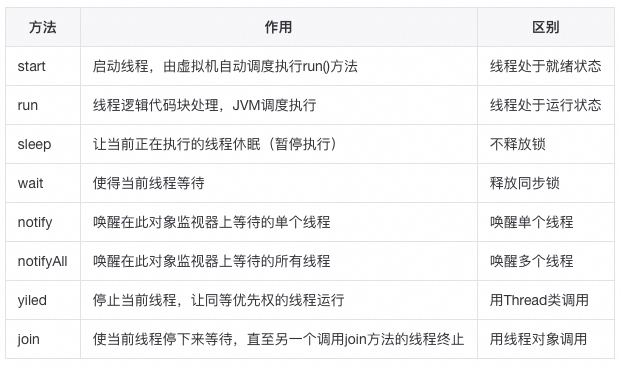
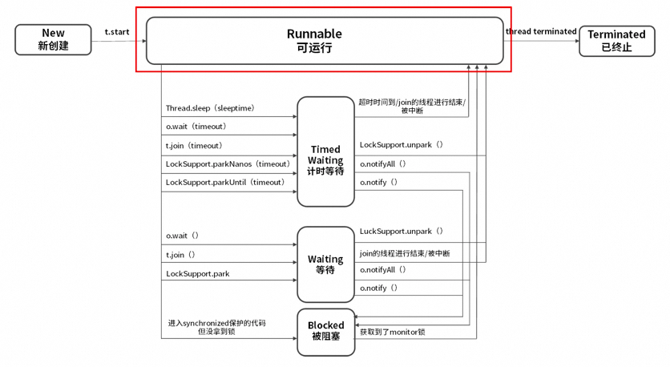
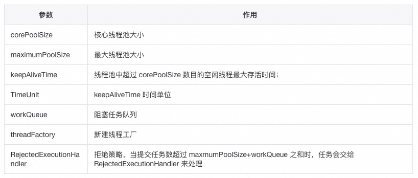
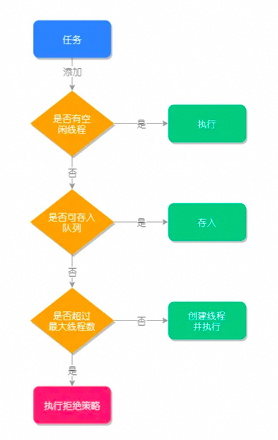
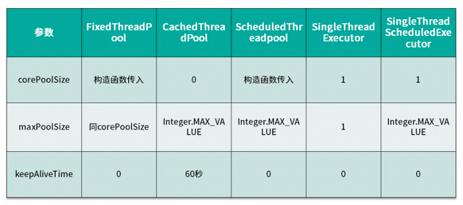
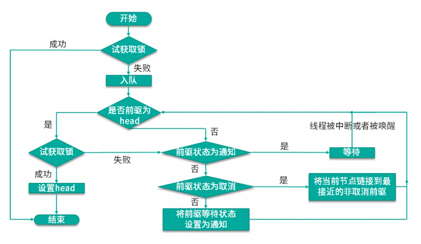
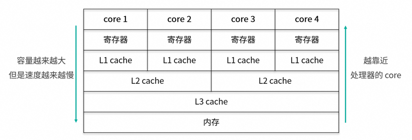

# 多线程篇

<font style="color:rgb(255, 129, 36);">线程调度</font>

<font style="color:rgb(62, 62, 62);">  
</font>

**<font style="color:rgb(62, 62, 62);">1、线程状态</font>**

<font style="color:rgb(62, 62, 62);">线程是cpu任务调度的最小执行单位，每个线程拥有自己独立的程序计数器、虚拟机栈、本地方法栈。</font>

**<font style="color:rgb(62, 62, 62);">线程状态：创建、就绪、运行、阻塞、死亡</font>**


<font style="color:rgb(62, 62, 62);">  
</font>

**<font style="color:rgb(62, 62, 62);">2、线程状态切换</font>**





**<font style="color:rgb(62, 62, 62);">3、阻塞唤醒过程</font>**

**<font style="color:rgb(62, 62, 62);">阻塞：</font>**

<font style="color:rgb(62, 62, 62);">这三个方法的调用都会使当前线程阻塞。该线程将会被放置到对该Object的请求等待队列中，然后让出当前对Object所拥有的所有的同步请求。线程会一直暂停所有线程调度，直到下面其中一种情况发生：</font>

<font style="color:rgb(62, 62, 62);">① 其他线程调用了该Object的notify方法，而该线程刚好是那个被唤醒的线程；</font>

<font style="color:rgb(62, 62, 62);">② 其他线程调用了该Object的notifyAll方法；</font>

**<font style="color:rgb(62, 62, 62);">唤醒：</font>**

<font style="color:rgb(62, 62, 62);">线程将会从等待队列中移除，重新成为可调度线程。它会与其他线程以常规的方式竞争对象同步请求。</font>**<font style="color:rgb(62, 62, 62);">一旦它重新获得对象的同步请求，所有之前的请求状态都会恢复，也就是线程调用wait的地方的状态。线程将会在之前调用wait的地方继续运行下去。</font>**

**<font style="color:rgb(62, 62, 62);">为什么要出现在同步代码块中：</font>**

<font style="color:rgb(62, 62, 62);">由于</font><font style="color:rgb(136, 136, 136);background-color:rgb(245, 245, 245);">wait()属于Object方法，调用之后会强制释放当前对象锁，所以在wait() </font><font style="color:rgb(62, 62, 62);">调用时必须拿到当前对象的监视器monitor对象。因此，wait()方法在同步方法/代码块中调用。</font>

<font style="color:rgb(62, 62, 62);">  
</font>

**<font style="color:rgb(62, 62, 62);">4、wait和sleep区别</font>**

+ <font style="color:rgb(62, 62, 62);">wait 方法必须在 synchronized 保护的代码中使用，而 sleep 方法并没有这个要求。</font>
+ <font style="color:rgb(62, 62, 62);">wait 方法会主动释放 monitor 锁，在同步代码中执行 sleep 方法时，并不会释放 monitor 锁。</font>
+ <font style="color:rgb(62, 62, 62);">wait 方法意味着永久等待，直到被中断或被唤醒才能恢复，不会主动恢复，sleep 方法中会定义一个时间，时间到期后会主动恢复。</font>
+ <font style="color:rgb(62, 62, 62);">wait/notify 是 Object 类的方法，而 sleep 是 Thread 类的方法。</font>

**<font style="color:rgb(62, 62, 62);">5、创建线程方式</font>**

<font style="color:rgb(255, 104, 39);">实现 Runnable 接口</font><font style="color:rgb(62, 62, 62);">（优先使用）</font>

```plain
public class RunnableThread implements Runnable {    @Override    public void run() {System.out.println('用实现Runnable接口实现线程');}}
```

<font style="color:rgb(255, 104, 39);">实现Callable接口</font><font style="color:rgb(62, 62, 62);">（有返回值可抛出异常）</font>

```plain
class CallableTask implements Callable<Integer> {    @Override    public Integer call() throws Exception { return new Random().nextInt();}}
```

<font style="color:rgb(255, 104, 39);">继承Thread类</font><font style="color:rgb(62, 62, 62);">（java不支持多继承）</font>

```plain
public class ExtendsThread extends Thread {    @Override    public void run() {System.out.println('用Thread类实现线程');}}
```

<font style="color:rgb(255, 104, 39);">使用线程池</font><font style="color:rgb(62, 62, 62);">（底层都是实现run方法）</font>

```plain
static class DefaultThreadFactory implements ThreadFactory {    DefaultThreadFactory() {        SecurityManager s = System.getSecurityManager();        group = (s != null) ? s.getThreadGroup() : Thread.currentThread().getThreadGroup();        namePrefix = "pool-" + poolNumber.getAndIncrement() +"-thread-";    }    public Thread newThread(Runnable r) {        Thread t = new Thread(group, r,namePrefix + threadNumber.getAndIncrement(),0);        if (t.isDaemon()) t.setDaemon(false);  //是否守护线程        if (t.getPriority() != Thread.NORM_PRIORITY) t.setPriority(Thread.NORM_PRIORITY); //线程优先级        return t;    }}
```

<font style="color:rgb(255, 129, 36);">线程池</font>

<font style="color:rgb(62, 62, 62);">优点：通过复用已创建的线程，</font>**<font style="color:rgb(62, 62, 62);">降低资源损耗</font>**<font style="color:rgb(62, 62, 62);">、线程可以直接处理队列中的任务</font>**<font style="color:rgb(62, 62, 62);">加快响应速度</font>**<font style="color:rgb(62, 62, 62);">、同时便于</font>**<font style="color:rgb(62, 62, 62);">统一监控和管理</font>**<font style="color:rgb(62, 62, 62);">。</font>

**<font style="color:rgb(62, 62, 62);">1、线程池构造函数</font>**

```plain
/*** 线程池构造函数7大参数*/public ThreadPoolExecutor(int corePoolSize,int maximumPoolSize,long keepAliveTime,    TimeUnit unit,BlockingQueue<Runnable> workQueue,ThreadFactory threadFactory,    RejectedExecutionHandler handler) {}
```

**<font style="color:rgb(62, 62, 62);">参数介绍：</font>**



**<font style="color:rgb(62, 62, 62);">2、线程处理任务过程</font>**



1. <font style="color:rgb(62, 62, 62);">当线程池小于corePoolSize，新提交任务将创建一个新线程执行任务，即使此时线程池中存在空闲线程。</font>
2. <font style="color:rgb(62, 62, 62);">当线程池达到corePoolSize时，新提交任务将被放入 workQueue 中，等待线程池中任务调度执行。</font>
3. <font style="color:rgb(62, 62, 62);">当workQueue已满，且 maximumPoolSize 大于 corePoolSize 时，新提交任务会创建新线程执行任务。</font>
4. <font style="color:rgb(62, 62, 62);">当提交任务数超过 maximumPoolSize 时，新提交任务由 RejectedExecutionHandler 处理。</font>
5. <font style="color:rgb(62, 62, 62);">当线程池中超过corePoolSize 线程，空闲时间达到 keepAliveTime 时，关闭空闲线程 。</font>

<font style="color:rgb(62, 62, 62);">  
</font>

**<font style="color:rgb(62, 62, 62);">3、线程拒绝策略</font>**

<font style="color:rgb(62, 62, 62);">线程池中的线程已经用完了，无法继续为新任务服务，同时，等待队列也已经排满了，再也塞不下新任务了。这时候我们就需要拒绝策略机制合理的处理这个问题。</font>

<font style="color:rgb(62, 62, 62);">JDK 内置的拒绝策略如下：</font>

**<font style="color:rgb(62, 62, 62);">AbortPolicy：</font>**<font style="color:rgb(62, 62, 62);">直接抛出异常，阻止系统正常运行。可以根据业务逻辑选择重试或者放弃提交等策略。</font>

**<font style="color:rgb(62, 62, 62);">CallerRunsPolicy ：</font>**<font style="color:rgb(62, 62, 62);">只要线程池未关闭，该策略直接在调用者线程中，运行当前被丢弃的任务。</font>

<font style="color:rgb(62, 62, 62);">不会造成任务丢失，同时减缓提交任务的速度，给执行任务缓冲时间。</font>

**<font style="color:rgb(62, 62, 62);">DiscardOldestPolicy ：</font>**<font style="color:rgb(62, 62, 62);">丢弃最老的一个请求，也就是即将被执行的任务，并尝试再次提交当前任务。</font>

**<font style="color:rgb(62, 62, 62);">DiscardPolicy ：</font>**<font style="color:rgb(62, 62, 62);">该策略默默地丢弃无法处理的任务，不予任何处理。如果允许任务丢失，这是最好的一种方案。</font>

**<font style="color:rgb(62, 62, 62);">4、Execuors类实现线程池</font>**


+ **<font style="color:rgb(62, 62, 62);">newSingleThreadExecutor()</font>**<font style="color:rgb(62, 62, 62);">：只有一个线程的线程池，任务是顺序执行，适用于一个一个任务执行的场景</font>
+ **<font style="color:rgb(62, 62, 62);">newCachedThreadPool()</font>**<font style="color:rgb(62, 62, 62);">：线程池里有很多线程需要同时执行，60s内复用，适用执行很多短期异步的小程序或者负载较轻的服务</font>
+ **<font style="color:rgb(62, 62, 62);">newFixedThreadPool()</font>**<font style="color:rgb(62, 62, 62);">：拥有固定线程数的线程池，如果没有任务执行，那么线程会一直等待，适用执行长期的任务。</font>
+ **<font style="color:rgb(62, 62, 62);">newScheduledThreadPool()</font>**<font style="color:rgb(62, 62, 62);">：用来调度即将执行的任务的线程池</font>
+ **<font style="color:rgb(62, 62, 62);">newWorkStealingPool()</font>**<font style="color:rgb(62, 62, 62);">：底层采用forkjoin的Deque，采用独立的任务队列可以减少竞争同时加快任务处理</font>



**<font style="color:rgb(62, 62, 62);">因为以上方式都存在弊端：</font>**

<font style="color:rgb(62, 62, 62);">FixedThreadPool 和 SingleThreadExecutor ：允许请求的</font>**<font style="color:rgb(62, 62, 62);">队列⻓度</font>**<font style="color:rgb(62, 62, 62);">为 Integer.MAX_VALUE，会导致OOM。</font>

<font style="color:rgb(62, 62, 62);">CachedThreadPool 和 ScheduledThreadPool ：允许创建的</font>**<font style="color:rgb(62, 62, 62);">线程数量</font>**<font style="color:rgb(62, 62, 62);">为 Integer.MAX_VALUE，会导致OOM。</font>

<font style="color:rgb(62, 62, 62);">手动创建的线程池底层使用的是ArrayBlockingQueue可以防止OOM。</font>

**<font style="color:rgb(62, 62, 62);">5、线程池大小设置</font>**

+ <font style="color:rgb(62, 62, 62);">CPU 密集型（n+1）</font>

<font style="color:rgb(62, 62, 62);">CPU 密集的意思是该任务需要大量的运算，而没有阻塞，CPU 一直全速运行。</font>

<font style="color:rgb(62, 62, 62);">CPU 密集型任务尽可能的少的线程数量，一般为 CPU 核数 + 1 个线程的线程池。</font>

+ <font style="color:rgb(62, 62, 62);">IO 密集型（2*n）</font>

<font style="color:rgb(62, 62, 62);">由于 IO 密集型任务线程并不是一直在执行任务，可以多分配一点线程数，如 CPU * 2 </font>

<font style="color:rgb(62, 62, 62);">也可以使用公式：CPU 核心数 *（1+平均等待时间/平均工作时间）。</font>

<font style="color:rgb(255, 129, 36);">线程安全</font>

**<font style="color:rgb(62, 62, 62);">1、乐观锁，CAS思想</font>**

**<font style="color:rgb(62, 62, 62);">java乐观锁机制：</font>**

<font style="color:rgb(62, 62, 62);">乐观锁体现的是悲观锁的反面。它是一种积极的思想，它总是认为数据是不会被修改的，所以是不会对数据上锁的。但是乐观锁在更新的时候会去判断数据是否被更新过。乐观锁的实现方案一般有两种（版本号机制和CAS）。乐观锁适用于</font>**<font style="color:rgb(62, 62, 62);">读多写少的场景，这样可以提高系统的并发量。</font>**<font style="color:rgb(62, 62, 62);">在Java中 </font>**<font style="color:rgb(62, 62, 62);">java.util.concurrent.atomic</font>**<font style="color:rgb(62, 62, 62);">下的原子变量类就是使用了乐观锁的一种实现方式CAS实现的。</font>

<font style="color:rgb(62, 62, 62);">乐观锁，大多是基于数据版本 (Version)记录机制实现。即为数据增加一个版本标识，在基于数据库表的版本解决方案中，一般是通过为数据库表增加一个 “version” 字段来 实现。读取出数据时，将此版本号一同读出，之后更新时，对此版本号加一。此时，将提 交数据的版本数据与数据库表对应记录的当前版本信息进行比对，如果提交的数据 版本号大于数据库表当前版本号，则予以更新，否则认为是过期数据。</font>

**<font style="color:rgb(62, 62, 62);">CAS思想：</font>**

<font style="color:rgb(62, 62, 62);">CAS就是compare and swap（</font>**<font style="color:rgb(62, 62, 62);">比较交换</font>**<font style="color:rgb(62, 62, 62);">），是一种很出名的无锁的算法，就是可以不使用锁机制实现线程间的同步。使用CAS线程是不会被阻塞的，所以又称为非阻塞同步。CAS算法涉及到三个操作：</font>

<font style="color:rgb(62, 62, 62);">需要读写内存值V；进行比较的值A；准备写入的值B</font>

<font style="color:rgb(62, 62, 62);">当且仅当V的值等于A的值等于V的值的时候，才用B的值去更新V的值，否则不会执行任何操作（比较和替换是一个原子操作-A和V比较，V和B替换），一般情况下是一个</font>**<font style="color:rgb(62, 62, 62);">自旋操作</font>**<font style="color:rgb(62, 62, 62);">，即</font>**<font style="color:rgb(62, 62, 62);">不断重试。</font>**

**<font style="color:rgb(62, 62, 62);">缺点：</font>**<font style="color:rgb(62, 62, 62);">https://www.zhihu.com/question/23281499/answer/854522984</font>

<font style="color:rgb(62, 62, 62);">ABA问题-知乎</font>

<font style="color:rgb(62, 62, 62);">高并发的情况下，很容易发生并发冲突，如果CAS一直失败，那么就会一直重试，浪费CPU资源</font>

**<font style="color:rgb(62, 62, 62);">原子性：</font>**

<font style="color:rgb(62, 62, 62);">功能限制CAS是能保证单个变量的操作是原子性的，在Java中要配合使用volatile关键字来保证线程的安全；当涉及到多个变量的时候CAS无能为力；除此之外CAS实现需要硬件层面的支持，在Java的普通用户中无法直接使用，只能</font>**<font style="color:rgb(62, 62, 62);">借助atomic包下的原子类实现</font>**<font style="color:rgb(62, 62, 62);">，灵活性受到了限制</font>

**<font style="color:rgb(62, 62, 62);">2、synchronized底层实现</font>**

**<font style="color:rgb(62, 62, 62);">使用方法：</font>**<font style="color:rgb(62, 62, 62);">主要的三种使⽤⽅式</font>

**<font style="color:rgb(62, 62, 62);">修饰实例⽅法:</font>**<font style="color:rgb(62, 62, 62);"> 作⽤于当前对象实例加锁，进⼊同步代码前要获得当前对象实例的锁</font>

**<font style="color:rgb(62, 62, 62);">修饰静态⽅法: </font>**<font style="color:rgb(62, 62, 62);">也就是给当前类加锁，会作⽤于类的所有对象实例，因为静态成员不属于任何⼀个实例对象，是类成员。</font>

**<font style="color:rgb(62, 62, 62);">修饰代码块: </font>**<font style="color:rgb(62, 62, 62);">指定加锁对象，对给定对象加锁，进⼊同步代码库前要获得给定对象的锁。</font>

**<font style="color:rgb(62, 62, 62);">总结：</font>**<font style="color:rgb(62, 62, 62);">synchronized锁住的资源只有两类：一个是</font>**<font style="color:rgb(62, 62, 62);">对象</font>**<font style="color:rgb(62, 62, 62);">，一个是</font>**<font style="color:rgb(62, 62, 62);">类</font>**<font style="color:rgb(62, 62, 62);">。</font>

**<font style="color:rgb(62, 62, 62);">底层实现：</font>**

<font style="color:rgb(62, 62, 62);">对象头是我们需要关注的重点，它是synchronized实现锁的基础，因为synchronized申请锁、上锁、释放锁都与对象头有关。对象头主要结构是由</font><font style="color:rgb(136, 136, 136);background-color:rgb(245, 245, 245);">Mark Word</font><font style="color:rgb(62, 62, 62);"> 组成，</font>**<font style="color:rgb(62, 62, 62);">其中</font>****<font style="color:rgb(136, 136, 136);background-color:rgb(245, 245, 245);">Mark Word</font>****<font style="color:rgb(62, 62, 62);">存储对象的hashCode、锁信息或分代年龄或GC标志等信息。</font>**

<font style="color:rgb(62, 62, 62);">锁也分不同状态，JDK6之前只有两个状态：无锁、有锁（重量级锁），而在JDK6之后对synchronized进行了优化，新增了两种状态，总共就是四个状态：</font>**<font style="color:rgb(62, 62, 62);">无锁状态、偏向锁、轻量级锁、重量级锁</font>**<font style="color:rgb(62, 62, 62);">，其中无锁就是一种状态了。锁的类型和状态在对象头Mark Word中都有记录，在申请锁、锁升级等过程中JVM都需要读取对象的</font><font style="color:rgb(136, 136, 136);background-color:rgb(245, 245, 245);">Mark Word</font><font style="color:rgb(62, 62, 62);">数据。</font>

<font style="color:rgb(62, 62, 62);">同步代码块是利用 monitorenter 和 monitorexit 指令实现的，而同步方法则是利用 flags 实现的。</font>

**<font style="color:rgb(62, 62, 62);">3、ReenTrantLock底层实现</font>**

<font style="color:rgb(62, 62, 62);">由于ReentrantLock是java.util.concurrent包下提供的一套互斥锁，相比Synchronized，ReentrantLock类提供了一些高级功能</font>

**<font style="color:rgb(62, 62, 62);">使用方法：</font>**

<font style="color:rgb(62, 62, 62);">基于API层面的互斥锁，需要lock()和unlock()方法配合try/finally语句块来完成</font>

**<font style="color:rgb(62, 62, 62);">底层实现：</font>**

<font style="color:rgb(62, 62, 62);">ReenTrantLock的实现是一种自旋锁，通过循环调用CAS操作来实现加锁。它的性能比较好也是因为避免了使线程进入内核态的阻塞状态。想尽办法避免线程进入内核的阻塞状态是我们去分析和理解锁设计的关键钥匙。</font>

**<font style="color:rgb(62, 62, 62);">和synchronized区别：</font>**

<font style="color:rgb(62, 62, 62);">1、</font>**<font style="color:rgb(62, 62, 62);">底层实现：</font>**<font style="color:rgb(62, 62, 62);">synchronized 是</font>**<font style="color:rgb(62, 62, 62);">JVM</font>**<font style="color:rgb(62, 62, 62);">层面的锁，是</font>**<font style="color:rgb(62, 62, 62);">Java关键字</font>**<font style="color:rgb(62, 62, 62);">，通过monitor对象来完成（monitorenter与monitorexit），ReentrantLock 是从jdk1.5以来（java.util.concurrent.locks.Lock）提供的</font>**<font style="color:rgb(62, 62, 62);">API层</font>****<font style="color:rgb(62, 62, 62);">面</font>**<font style="color:rgb(62, 62, 62);">的锁。</font>

<font style="color:rgb(62, 62, 62);">2、</font>**<font style="color:rgb(62, 62, 62);">实现原理</font>**<font style="color:rgb(62, 62, 62);">：</font>**<font style="color:rgb(62, 62, 62);">synchronized 的实现涉及到</font>**<font style="color:rgb(62, 62, 62);">锁的升级，</font>**<font style="color:rgb(62, 62, 62);">具体为无锁、偏向锁、自旋锁、向OS申请重量级锁</font>**<font style="color:rgb(62, 62, 62);">；</font>**<font style="color:rgb(62, 62, 62);">ReentrantLock实现则是通过利用CAS**（CompareAndSwap）</font>**<font style="color:rgb(62, 62, 62);">自旋机制保证线程操作的原子性和volatile保证数据可见性以实现锁的功能。</font>

<font style="color:rgb(62, 62, 62);">3、</font>**<font style="color:rgb(62, 62, 62);">是否可手动释放</font>**<font style="color:rgb(62, 62, 62);">：synchronized 不需要用户去手动释放锁，synchronized 代码执行完后系统会自动让线程释放对锁的占用；ReentrantLock则需要用户去手动释放锁，如果没有手动释放锁，就可能导致</font>**<font style="color:rgb(62, 62, 62);">死锁现象</font>**<font style="color:rgb(62, 62, 62);">。</font>

<font style="color:rgb(62, 62, 62);">4、</font>**<font style="color:rgb(62, 62, 62);">是否可中断</font>**<font style="color:rgb(62, 62, 62);">synchronized是不可中断类型的锁，除非加锁的代码中出现异常或正常执行完成；ReentrantLock则可以中断，可通过trylock(long timeout,TimeUnit unit)设置超时方法或者将lockInterruptibly()放到代码块中，调用interrupt方法进行中断。</font>

<font style="color:rgb(62, 62, 62);">5、</font>**<font style="color:rgb(62, 62, 62);">是否公平锁</font>**<font style="color:rgb(62, 62, 62);">synchronized为非公平锁 ReentrantLock则即可以选公平锁也可以选非公平锁，通过构造方法new ReentrantLock时传入boolean值进行选择，为空默认false非公平锁，true为公平锁,公平锁性能非常低。</font>

<font style="color:rgb(62, 62, 62);">  
</font>

**<font style="color:rgb(62, 62, 62);">4、公平锁和非公平锁区别</font>**

**<font style="color:rgb(62, 62, 62);">公平锁：</font>**

<font style="color:rgb(62, 62, 62);">公平锁自然是</font>**<font style="color:rgb(62, 62, 62);">遵循FIFO</font>**<font style="color:rgb(62, 62, 62);">（先进先出）原则的，先到的线程会优先获取资源，后到的会进行排队等待。</font>

**<font style="color:rgb(62, 62, 62);">优点：</font>**<font style="color:rgb(62, 62, 62);">所有的线程都能得到资源，不会饿死在队列中。适合大任务。</font>

**<font style="color:rgb(62, 62, 62);">缺点：</font>**<font style="color:rgb(62, 62, 62);">吞吐量会下降，队列里面除了第一个线程，其他的线程都会阻塞，cpu唤醒阻塞线程的开销大。</font>

**<font style="color:rgb(62, 62, 62);">非公平锁：</font>**

<font style="color:rgb(62, 62, 62);">多个线程去获取锁的时候，会直接去尝试获取，获取不到，再去进入等待队列，如果能获取到，就直接获取到锁。</font>

**<font style="color:rgb(62, 62, 62);">优点：</font>**<font style="color:rgb(62, 62, 62);">可以减少CPU唤醒线程的开销，整体的吞吐效率会高点，CPU也不必取唤醒所有线程，会减少唤起线程的数量。</font>

**<font style="color:rgb(62, 62, 62);">缺点：</font>**<font style="color:rgb(62, 62, 62);">你们可能也发现了，这样可能导致队列中间的线程一直获取不到锁或者长时间获取不到锁。</font>



**<font style="color:rgb(62, 62, 62);">公平锁效率低原因：</font>**

<font style="color:rgb(62, 62, 62);">公平锁要维护一个队列，后来的线程要加锁，即使锁空闲，也要先检查有没有其他线程在 wait，如果有自己要挂起，加到队列后面，然后唤醒队列最前面线程。这种情况下相比较非公平锁多了一次</font>**<font style="color:rgb(62, 62, 62);">挂起和唤醒</font>**<font style="color:rgb(62, 62, 62);">。</font>

**<font style="color:rgb(62, 62, 62);">线程切换的开销</font>**<font style="color:rgb(62, 62, 62);">，其实就是非公平锁效率高于公平锁的原因，因为</font>**<font style="color:rgb(62, 62, 62);">非公平锁减少了线程挂起的几率</font>**<font style="color:rgb(62, 62, 62);">，后来的线程有一定几率逃离被挂起的开销。</font>

**<font style="color:rgb(62, 62, 62);">5、使用层面锁优化</font>**

**<font style="color:rgb(62, 62, 62);">【1】减少锁的时间：</font>**<font style="color:rgb(62, 62, 62);">  
</font><font style="color:rgb(62, 62, 62);">不需要同步执行的代码，能不放在同步快里面执行就不要放在同步快内，可以让锁尽快释放；</font>

**<font style="color:rgb(62, 62, 62);">【2】减少锁的粒度：</font>**<font style="color:rgb(62, 62, 62);">  
</font><font style="color:rgb(62, 62, 62);">它的思想是将物理上的一个锁，拆成逻辑上的多个锁，增加并行度，从而降低锁竞争。它的思想也是用空间来换时间；java中很多数据结构都是采用这种方法提高并发操作的效率，比如：</font>

**<font style="color:rgb(62, 62, 62);">ConcurrentHashMap：</font>**

<font style="color:rgb(62, 62, 62);">java中的ConcurrentHashMap在jdk1.8之前的版本，使用一个Segment 数组：Segment< K,V >[] segments</font>

<font style="color:rgb(62, 62, 62);">Segment继承自ReenTrantLock，所以每个Segment是个可重入锁，每个Segment 有一个HashEntry< K,V >数组用来存放数据，put操作时，先确定往哪个Segment放数据，只需要锁定这个Segment，执行put，其它的Segment不会被锁定；所以数组中有多少个Segment就允许同一时刻多少个线程存放数据，这样增加了并发能力。</font>

**<font style="color:rgb(62, 62, 62);">【3】锁粗化：</font>**<font style="color:rgb(62, 62, 62);">  
</font><font style="color:rgb(62, 62, 62);">大部分情况下我们是要让锁的粒度最小化，锁的粗化则是要增大锁的粒度; </font>

<font style="color:rgb(62, 62, 62);">假如有一个循环，循环内的操作需要加锁，我们应该把锁放到循环外面，否则每次进出循环，都进出一次临界区，效率是非常差的；</font>

**<font style="color:rgb(62, 62, 62);">【4】使用读写锁：</font>**

<font style="color:rgb(62, 62, 62);">ReentrantReadWriteLock 是一个读写锁，读操作加读锁，可并发读，写操作使用写锁，只能单线程写；</font>

**<font style="color:rgb(62, 62, 62);">【5】使用CAS：</font>**

<font style="color:rgb(62, 62, 62);">如果需要同步的操作执行速度非常快，并且线程竞争并不激烈，这时候使用cas效率会更高，因为加锁会导致线程的上下文切换，如果上下文切换的耗时比同步操作本身更耗时，且线程对资源的竞争不激烈，使用volatiled+cas操作会是非常高效的选择；</font>

**<font style="color:rgb(62, 62, 62);">6、系统层面锁优化</font>**

**<font style="color:rgb(62, 62, 62);">自适应自旋锁：</font>**

<font style="color:rgb(62, 62, 62);">自旋锁可以避免等待竞争锁进入阻塞挂起状态被唤醒造成的</font>**<font style="color:rgb(62, 62, 62);">内核态和用户态之间的切换</font>**<font style="color:rgb(62, 62, 62);">的损耗，它们只需要等一等（自旋），但是如果锁被其他线程长时间占用，一直不释放CPU，死等会带来更多的性能开销；自旋次数默认值是10。</font>

<font style="color:rgb(62, 62, 62);">对上面自旋锁优化方式的进一步优化，它的自旋的次数不再固定，其自旋的次数由前一次在同一个锁上的</font>**<font style="color:rgb(62, 62, 62);">自旋时间及锁的拥有者的状态</font>**<font style="color:rgb(62, 62, 62);">来决定，这就解决了自旋锁带来的缺点。</font>

**<font style="color:rgb(62, 62, 62);">锁消除：</font>**

<font style="color:rgb(62, 62, 62);">锁削除是指虚拟机即时编译器在运行时，对一些代码上要求同步，但是被检测到不可能存在共享数据竞争的锁进行削除。Netty中无锁化设计pipeline中channelhandler会进行锁消除的优化。</font>

**<font style="color:rgb(62, 62, 62);">锁升级：</font>**

**<font style="color:rgb(62, 62, 62);">偏向锁：</font>**

<font style="color:rgb(62, 62, 62);">如果线程已经占有这个锁，当他在次试图去获取这个锁的时候，他会已最快的方式去拿到这个锁，而不需要在进行一些monitor操作，因为在大部分情况下是没有竞争的，所以使用偏向锁是可以提高性能的；</font>

**<font style="color:rgb(62, 62, 62);">轻量级锁：</font>**

<font style="color:rgb(62, 62, 62);">在竞争不激烈的情况下，通过CAS避免线程上下文切换，可以显著的提高性能。</font>

**<font style="color:rgb(62, 62, 62);">重量级锁：</font>**

<font style="color:rgb(62, 62, 62);">重量级锁的加锁、解锁过程造成的损耗是固定的，重量级锁适合于竞争激烈、高并发、同步块执行时间长的情况。</font>

**<font style="color:rgb(62, 62, 62);">7、ThreadLocal原理</font>**

**<font style="color:rgb(62, 62, 62);">ThreadLocal简介：</font>**

<font style="color:rgb(62, 62, 62);">通常情况下，我们创建的变量是可以被任何⼀个线程访问并修改的。如果想实现每⼀个线程都有⾃⼰的。</font>

<font style="color:rgb(62, 62, 62);">专属本地变量该如何解决呢？JDK中提供的 ThreadLocal 类正是为了解决这样的问题。类似操作系统中的TLAB。</font>

**<font style="color:rgb(62, 62, 62);">原理：</font>**

<font style="color:rgb(62, 62, 62);">首先 ThreadLocal 是一个泛型类，保证可以接受任何类型的对象。因为一个线程内可以存在多个 ThreadLocal 对象，所以其实是 ThreadLocal 内部维护了一个 Map ，是 ThreadLocal 实现的一个叫做 ThreadLocalMap 的静态内部类。</font>

<font style="color:rgb(62, 62, 62);">最终的变量是放在了当前线程的 </font><font style="color:rgb(136, 136, 136);background-color:rgb(245, 245, 245);">ThreadLocalMap</font><font style="color:rgb(62, 62, 62);"> 中，并不是存在 ThreadLocal 上，ThreadLocal 可以理解为只是ThreadLocalMap的封装，传递了变量值。</font>

<font style="color:rgb(62, 62, 62);">我们使用的 get()、set() 方法其实都是调用了这个ThreadLocalMap类对应的 get()、set() 方法。例如下面的 。</font>

**<font style="color:rgb(62, 62, 62);">如何使用：</font>**

<font style="color:rgb(62, 62, 62);">1）存储用户Session</font>

```plain
private static final ThreadLocal threadSession = new ThreadLocal();
```

<font style="color:rgb(62, 62, 62);">2）解决线程安全的问题</font>

```plain
private static ThreadLocal<SimpleDateFormat> format1 = new ThreadLocal<SimpleDateFormat>()
```

**<font style="color:rgb(62, 62, 62);">ThreadLocal内存泄漏的场景</font>**

<font style="color:rgb(62, 62, 62);">实际上 ThreadLocalMap 中使用的 key 为 ThreadLocal 的弱引用，⽽ value 是强引⽤。弱引用的特点是，如果这个对象持有弱引用，那么在下一次垃圾回收的时候必然会被清理掉。</font>

<font style="color:rgb(62, 62, 62);">所以如果 ThreadLocal 没有被外部强引用的情况下，在垃圾回收的时候会被清理掉的，这样一来 ThreadLocalMap中使用这个 ThreadLocal 的 key 也会被清理掉。但是，value 是强引用，不会被清理，这样一来就会出现 key 为 null 的 value。假如我们不做任何措施的话，value 永远⽆法被GC 回收，如果线程长时间不被销毁，可能会产⽣内存泄露。</font>


<font style="color:rgb(62, 62, 62);">ThreadLocalMap实现中已经考虑了这种情况，在调用 set()、get()、remove() 方法的时候，会清理掉 key 为 null 的记录。如果说会出现内存泄漏，那只有在出现了 key 为 null 的记录后，没有手动调用 remove() 方法，并且之后也不再调用 get()、set()、remove() 方法的情况下。因此使⽤完ThreadLocal ⽅法后，</font>**<font style="color:rgb(62, 62, 62);">最好⼿动调⽤ remove() ⽅法。</font>**

**<font style="color:rgb(62, 62, 62);">8、HashMap线程安全</font>**

**<font style="color:rgb(62, 62, 62);">死循环造成 CPU 100%</font>**

<font style="color:rgb(62, 62, 62);">HashMap 有可能会发生死循环并且造成 CPU 100% ，这种情况发生最主要的原因就是在</font>**<font style="color:rgb(62, 62, 62);">扩容</font>**<font style="color:rgb(62, 62, 62);">的时候，也就是内部</font>**<font style="color:rgb(62, 62, 62);">新建新的 HashMap</font>**<font style="color:rgb(62, 62, 62);"> 的时候，扩容的逻辑会</font>**<font style="color:rgb(62, 62, 62);">反转散列桶中的节点顺序</font>**<font style="color:rgb(62, 62, 62);">，当有多个线程同时进行扩容的时候，由于 HashMap 并非线程安全的，所以如果</font>**<font style="color:rgb(62, 62, 62);">两个线程同时反转的话，便可能形成一个循环</font>**<font style="color:rgb(62, 62, 62);">，并且这种循环是链表的循环，相当于 A 节点指向 B 节点，B 节点又指回到 A 节点，这样一来，在下一次想要获取该 key 所对应的 value 的时候，便会在遍历链表的时候发生永远无法遍历结束的情况，也就发生 CPU 100% 的情况。</font>

<font style="color:rgb(62, 62, 62);">所以综上所述，HashMap 是线程不安全的，在多线程使用场景中推荐使用线程安全同时性能比较好的 ConcurrentHashMap。</font>

**<font style="color:rgb(62, 62, 62);">9、String不可变原因</font>**

1. <font style="color:rgb(62, 62, 62);">可以使用</font>**<font style="color:rgb(62, 62, 62);">字符串常量池</font>**<font style="color:rgb(62, 62, 62);">，多次创建同样的字符串会指向同一个内存地址；</font>
2. <font style="color:rgb(62, 62, 62);">可以很方便地用作</font>**<font style="color:rgb(62, 62, 62);"> HashMap 的 key</font>**<font style="color:rgb(62, 62, 62);">。通常建议把不可变对象作为 HashMap的 key；</font>
3. <font style="color:rgb(62, 62, 62);">hashCode生成后就不会改变，使用时无需重新计算；</font>
4. <font style="color:rgb(62, 62, 62);">线程安全，因为具备不变性的对象一定是线程安全的；</font>

<font style="color:rgb(255, 129, 36);">内存模型</font>

<font style="color:rgb(62, 62, 62);">Java 内存模型（Java Memory Model，JMM）就是一种符合内存模型规范的，屏蔽了各种硬件和操作系统的访问差异的，保证了 Java 程序在各种平台下对内存的访问都能保证效果一致的机制及规范。</font>



<font style="color:rgb(62, 62, 62);">JMM 是一种规范，是解决由于多线程通过共享内存进行通信时，存在的本地内存数据不一致、编译器会对代码指令重排序、处理器会对代码乱序执行等带来的问题。目的是保证并发编程场景中的原子性、可见性和有序性。</font>

**<font style="color:rgb(62, 62, 62);">原子性：</font>**

<font style="color:rgb(62, 62, 62);">在 Java 中，为了保证原子性，提供了两个高级的字节码指令 Monitorenter 和 Monitorexit。这两个字节码，在 Java 中对应的关键字就是 Synchronized。因此，在 Java 中可以使用 Synchronized 来保证方法和代码块内的操作是原子性的。</font>

**<font style="color:rgb(62, 62, 62);">可见性：</font>**

<font style="color:rgb(62, 62, 62);">Java 中的 Volatile 关键字修饰的变量在被修改后可以立即同步到主内存。被其修饰的变量在每次使用之前都从主内存刷新。因此，可以使用 Volatile 来保证多线程操作时变量的可见性。除了 Volatile，Java 中的 Synchronized 和 Final 两个关键字也可以实现可见性。只不过实现方式不同</font>

**<font style="color:rgb(62, 62, 62);">有序性：</font>**

<font style="color:rgb(62, 62, 62);">在 Java 中，可以使用 Synchronized 和 Volatile 来保证多线程之间操作的有序性。区别：Volatile 禁止指令重排。Synchronized 保证同一时刻只允许一条线程操作。</font>

**<font style="color:rgb(62, 62, 62);">1、volatile底层实现</font>**

**<font style="color:rgb(62, 62, 62);">作用：</font>**

<font style="color:rgb(62, 62, 62);">保证数据的“可见性”：被volatile修饰的变量能够保证每个线程能够获取该变量的最新值，从而避免出现数据脏读的现象。</font>

<font style="color:rgb(62, 62, 62);">禁止指令重排：在多线程操作情况下，指令重排会导致计算结果不一致。</font>

**<font style="color:rgb(62, 62, 62);">底层实现：</font>**

<font style="color:rgb(62, 62, 62);">“观察加入volatile关键字和没有加入volatile关键字时所生成的汇编代码发现，加入volatile关键字时，会多出一个lock前缀指令”</font>

<font style="color:rgb(62, 62, 62);">lock前缀指令实际上相当于一个</font>**<font style="color:rgb(62, 62, 62);">内存屏障</font>**<font style="color:rgb(62, 62, 62);">（也成内存栅栏），内存屏障会提供3个功能：</font>

<font style="color:rgb(62, 62, 62);">1）它确保指令重排序时不会把其后面的指令排到内存屏障之前的位置，也不会把前面的指令排到内存屏障的后面；</font>

<font style="color:rgb(62, 62, 62);">2）它会强制将对缓存的修改操作立即写入主存；</font>

<font style="color:rgb(62, 62, 62);">3）如果是写操作，它会导致其他CPU中对应的缓存行无效。</font>

**<font style="color:rgb(62, 62, 62);">单例模式中volatile的作用：</font>**

<font style="color:rgb(62, 62, 62);">防止代码读取到instance不为null时，instance引用的对象有可能还没有完成初始化。</font>

```plain
class Singleton{    private volatile static Singleton instance = null;   //禁止指令重排    private Singleton() {             }    public static Singleton getInstance() {        if(instance==null) { //减少加锁的损耗            synchronized (Singleton.class) {                if(instance==null) //确认是否初始化完成                    instance = new Singleton();            }        }        return instance;    }}
```

**<font style="color:rgb(62, 62, 62);">2、AQS思想</font>**

<font style="color:rgb(62, 62, 62);">AQS的全称为（AbstractQueuedSynchronizer）抽象的队列式的同步器，是⼀个⽤来构建锁和同步器的框架，使⽤AQS能简单且⾼效地构造出应⽤⼴泛的⼤量的同步器，如：基于AQS实现的lock, CountDownLatch、CyclicBarrier、Semaphore需解决的问题：</font>

```plain
状态的原子性管理线程的阻塞与解除阻塞队列的管理
```

<font style="color:rgb(62, 62, 62);">AQS核⼼思想是，如果被请求的共享资源空闲，则将当前请求资源的线程设置为有效的⼯作线程，并且将共享资源设置为锁定状态。如果被请求的共享资源被占⽤，那么就需要⼀套线程阻塞等待以及被唤醒时锁分配的机制，这个机制AQS是⽤</font>**<font style="color:rgb(62, 62, 62);">CLH（虚拟的双向队列）</font>**<font style="color:rgb(62, 62, 62);">队列锁实现的，即将暂时获取不到锁的线程加⼊到队列中。</font>

**<font style="color:rgb(62, 62, 62);">lock：</font>**

<font style="color:rgb(62, 62, 62);">是一种可重入锁，除了能完成 synchronized 所能完成的所有工作外，还提供了诸如可响应中断锁、可轮询锁请求、定时锁等避免多线程死锁的方法。默认为非公平锁，但可以初始化为公平锁；通过方法 lock()与 unlock()来进行加锁与解锁操作；</font>

**<font style="color:rgb(62, 62, 62);">CountDownLatch：</font>**

<font style="color:rgb(62, 62, 62);">通过计数法（倒计时器），让一些线程堵塞直到另一个线程完成一系列操作后才被唤醒；该⼯具通常⽤来控制线程等待，它可以让某⼀个线程等待直到倒计时结束，再开始执⾏。具体可以使用countDownLatch.await()来等待结果。多用于多线程信息汇总。</font>

**<font style="color:rgb(62, 62, 62);">CompletableFuture：</font>**

<font style="color:rgb(62, 62, 62);">通过设置参数，可以完成CountDownLatch同样的多平台响应问题，但是可以针对其中部分返回结果做更加灵活的展示。</font>

**<font style="color:rgb(62, 62, 62);">CyclicBarrier：</font>**

<font style="color:rgb(62, 62, 62);">字面意思是可循环(Cyclic)使用的屏障（Barrier）。他要做的事情是，让一组线程到达一个屏障（也可以叫同步点）时被阻塞，直到最后一个线程到达屏障时，屏障才会开门，所有被屏障拦截的线程才会继续干活，线程进入屏障通过CyclicBarrier的await()方法。可以用于批量发送消息队列信息、异步限流。</font>

**<font style="color:rgb(62, 62, 62);">Semaphore：</font>**

<font style="color:rgb(62, 62, 62);">信号量主要用于两个目的，一个是用于多个共享资源的互斥作用，另一个用于并发线程数的控制。SpringHystrix限流的思想</font>

**<font style="color:rgb(62, 62, 62);">3、happens-before</font>**

<font style="color:rgb(62, 62, 62);">用来描述和可见性相关问题：如果第一个操作 happens-before 第二个操作，那么我们就说第一个操作对于第二个操作是可见的</font>

<font style="color:rgb(62, 62, 62);">常见的happens-before：volatile 、锁、线程生命周期。</font>

**<font style="color:rgb(62, 62, 62);">能用AI写的代码，不允许程序员手写？！你怎么看？</font>**

<font style="color:rgba(0, 0, 0, 0.9);">  
</font>

<font style="color:rgb(62, 62, 62);">以Copilot、通义灵码等为代表的AI智能编码助手成为越来越多开发者的必备工具，补全/续写代码、写单元测试、debug的功能不在话下，本期我们来聊聊你在使用AI编码助手过程中的感受和评价：</font>

<font style="color:rgb(62, 62, 62);">  
</font><font style="color:rgb(62, 62, 62);">1.你认为 AI 编码助手真的能提效吗？</font>

<font style="color:rgb(62, 62, 62);">2.个别公司要求能用AI写代码，不允许程序员手写，如果要手写，必须注释说明AI写不了这段代码的原因，你怎么看？</font>

<font style="color:rgb(62, 62, 62);">3.你最常用和喜欢通义灵码编码助手哪些功能？分享一些你在使用过程中发现的小技巧。</font>

<font style="color:rgb(62, 62, 62);">👇</font><font style="color:rgb(62, 62, 62);">欢迎点击”阅读原文“发表你的看法</font>

<font style="color:rgba(0, 0, 0, 0.9);">  
</font>
