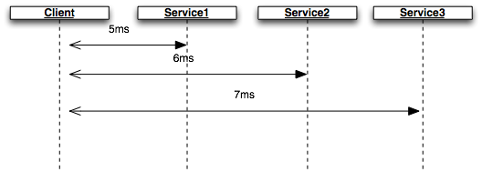
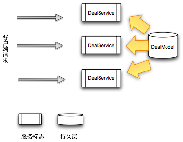
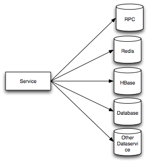
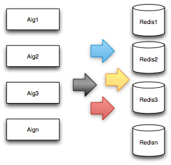

# 美团内部性能优化实践

**本次分享内容**

第一部分是介绍，包括采用模式方式讲解的优点，所采用案例的说明，以及四大设计原则；

第二部分介绍三种典型的“性能恶化模式”，阐述导致系统性能恶化，服务可用性降低的典型场景以及形成恶化循环的过程；

第三部分是重点，阐述典型的七种“性能优化模式”，这些模式或者可以使服务远离“恶化模式”，或者直接对服务性能进行优化；

最后一部分进行总结，并对未来可能出现的新模式进行展望。

## 一. 摘要

性能优化涉及面很广。一般而言，性能优化指降低响应时间和提高系统吞吐量两个方面，但在流量高峰时候，性能问题往往会表现为服务可用性下降，所以性能优化也可以包括提高服务可用性。在某些情况下，降低响应时间、提高系统吞吐量和提高服务可用性三者相互矛盾，不可兼得。

例如：增加缓存可以降低平均响应时间，但是处理线程数量会因为缓存过大而有所限制，从而降低系统吞吐量；为了提高服务可用性，对异常请求重复调用是一个常用的做法，但是这会提高响应时间并降低系统吞吐量。

对于很多像美团这样的公司，它们的系统会面临如下三个挑战：

1. 日益增长的用户数量

2. 日渐复杂的业务

3. 急剧膨胀的数据

这些挑战对于性能优化而言表现为：在保持和降低系统TP95响应时间（指的是将一段时间内的请求响应时间从低到高排序，高于95%请求响应时间的下确界）的前提下，不断提高系统吞吐量，提升流量高峰时期的服务可用性。这种场景下，三者的目标和改进方法取得了比较好的一致。本节课主要目标是为类似的场景提供优化方案，确保系统在流量高峰时期的快速响应和高可用。

## 二. 介绍

### 模式讲解方式

关于性能优化的文章和图书已有很多，但就我所知，还没有采用模式的方式去讲解的。借鉴《设计模式》（*“Design Patterns-Elements of Reusable Object-Oriented Software”*）对设计模式的阐述方式，首先为每一种性能优化模式取一个贴切的名字，便于快速理解和深刻记忆，接着讲解该模式的动机和原理，然后结合在美团的具体工作案例进行深度剖析，最后总结采用该模式的优点以及需要付出的代价。简而言之，采用“命名–>原理和动机–>具体案例–>缺点和优点”的四阶段方式进行性能优化模式讲解。与其他方式相比，采用模式进行讲解有两个方面的优点：一方面，大家不仅仅能够掌握优化手段，而且能够了解采用该手段进行性能优化的场景以及所需付出的代价，这有利于全面理解和灵活应用；另一方面，模式解决的是特定应用场景下的一类问题，所以应用场景描述贯穿于模式讲解之中。如此，即使读者对原理不太了解，只要碰到的问题符合某个特定模式的应用场景（这往往比理解原理要简单），就可以采用对应的手段进行优化，进一步促进读者对模式的理解和掌握。

### 案例说明

所有案例都来自于美团的真实项目。出于两方面的考虑，做了一定的简化和抽象：

一方面，系统可以优化的问题众多，而一个特定的模式只能解决几类问题，所以在案例分析过程中会突出与模式相关的问题；

另一方面，任何一类问题都需要多维度数据去描述，而应用性能优化模式的前提是多维度数据的组合值超过了某个临界点，但是精确定义每个维度数值的临界点是一件很难的事情，更别说多维度数据组合之后临界点。因此有必要对案例做一些简化，确保相关取值范围得到满足。基于以上以及其他原因，所给出的解决方案只是可行性方案，并不保证其是所碰到问题的最佳解决方案。

案例涉及的所有项目都是基于Java语言开发的，严格地讲，所有模式适用的场景是基于Java语言搭建的服务。从另外一方面讲，Java和C++的主要区别在于垃圾回收机制，所以，除去和垃圾回收机制紧密相关的模式之外，所描述的模式也适用于采用C++语言搭建的服务。对于基于其他语言开发的服务，在阅读以及实践的过程中需要考虑语言之间的差别。

### 四大设计原则

必须说明，本文中各种模式所要解决的问题之所以会出现，部分是因为工程师运用了某些深层次的设计原则。有些设计原则看上去和优秀的设计理念相悖，模式所解决的问题似乎完全可以避免，但是它们却被广泛使用。“存在即合理”，世界上没有完美的设计方案，任何方案都是一系列设计原则的妥协结果，所以主要关注点是解决所碰到的问题而不是如何绕过这些设计原则。下面对文中重要的设计原则进行详细阐述，在后面需要运用该原则时将不再解释。

#### 最小可用原则

最小可用原则（快速接入原则）有两个关注点：

1. 强调快速接入，快速完成

2. 实现核心功能可用

这是一个被普遍运用的原则，其目标是缩短测试周期，增加试错机会，避免过度设计。为了快速接入就必须最大限度地利用已有的解决方案或系统。从另外一个角度讲，一个解决方案或系统只要能够满足基本需求，就满足最小可用原则的应用需求。过度强调快速接入原则会导致重构风险的增加，原则上讲，基于该原则去设计系统需要为重构做好准备。

#### 2.经济原则

经济原则关注的是成本问题，看起来很像最小可用原则，但是它们之间关注点不同。最小可用原则的目标是通过降低开发周期，快速接入而实现风险可控，而快速接入并不意味着成本降低，有时候为了实现快速接入可能需要付出巨大的成本。软件项目的生命周期包括：预研、设计、开发、测试、运行、维护等阶段。最小可用原则主要运用在预研阶段，而经济原则可以运用在整个软件生命周期里，也可以只关注某一个或者几个阶段。例如：运行时经济原则需要考虑的系统成本包括单次请求的CPU、内存、网络、磁盘消耗等；设计阶段的经济原则要求避免过度设计；开发阶段的经济原则可能关注代码复用，工程师资源复用等。

#### 3.代码复用原则

代码复用原则分为两个层次：

第一个层次使用已有的解决方案或调用已存在的共享库（Shared Library），也称为方案复用；

第二个层次是直接在现有的代码库中开发，也称之为共用代码库。

方案复用是一个非常实用主义的原则，它的出发点就是最大限度地利用手头已有的解决方案，即使这个方案并不好。方案的形式可以是共享库，也可以是已存在的服务。方案复用的例子参见避免蚊子大炮模式的具体案例。用搜索引擎服务来解决查找附近商家的问题是一个性能很差的方案，但仍被很多工程师使用。方案复用原则的一个显著优点就是提高生产效率，例如：Java之所以能够得到如此广泛应用，原因之一就是有大量可以重复利用的开源库。实际上“Write once, run anywhere”是Java语言最核心的设计理念之一。基于Java语言开发的代码库因此得以在不同硬件平台、不同操作系统上更广泛地使用。

共用代码库要求在同一套代码库中完成所有功能开发。采用这个原则，代码库中的所有功能编译时可见，新功能代码可以无边界的调用老代码。另外，原代码库已存在的各种运行、编译、测试、配置环境可复用。主要有两个方面地好处：

1. 充分利用代码库中已有的基础设施，快速接入新业务；

2. 直接调用原代码中的基础功能或原語，避免网络或进程间调用开销，性能更佳。共用代码库的例子参见垂直分割模式的具体案例。

从设计的角度上讲，方案复用类似于微服务架构（Microservice Architecture，有些观点认为这是一种形式的SOA），而共用代码库和Monolithic Architecture很接近。总的来说，微服务倾向于面向接口编程，要求设计出可重用性的组件（Library或Service），通过分层组织各层组件来实现良好的架构。与之相对应，Monolith Architecture则希望尽可能在一套代码库中开发，通过直接调用代码中的基础功能或原語而实现性能的优化和快速迭代。使用Monolith Architecture有很大的争议，被认为不符合“设计模式”的理念。参考文献[4]，Monolithic Design主要的缺点包括：

1. 缺乏美感；

2. 很难重构；

3. 过早优化（参见文献[6]*Optimize judiciously*）;

4. 不可重用；

5. 限制眼界。

微服务架构是很多互联网公司的主流架构，典型的运用公司包括Amazon、美团等。Monolithic Architecture也有其忠实的粉丝，例如：Tripadvisor的全球网站就共用一套代码库；基于性能的考虑，Linux最终选择的也是Monolithic kernel的模式。

#### 4.奥卡姆剃刀原则

系统设计以及代码编写要遵循奥卡姆剃刀原则：Entities should not be multiplied unnecessarily。

一般而言，一个系统的代码量会随着其功能增加而变多。系统的健壮性有时候也需要通过编写异常处理代码来实现。异常考虑越周全，异常处理代码量越大。但是随着代码量的增大，引入Bug的概率也就越大，系统也就越不健壮。从另外一个角度来讲，异常流程处理代码也要考虑健壮性问题，这就形成了无限循环。所以在系统设计和代码编写过程中，奥卡姆剃刀原则要求：一个功能模块如非必要，就不要；一段代码如非必写，就不写。

奥卡姆剃刀原则和最小可用原则有所区别。最小可用原则主要运用于产品MVP阶段，本文所指的奥卡姆剃刀原则主要指系统设计和代码编写两个方面，这是完全不同的两个概念。MVP包含系统设计和代码编写，但同时，系统设计和代码编写也可以发生在成熟系统的迭代阶段。

### 三种性能恶化模式

在讲解性能优化模式之前，有必要先探讨一下性能恶化模式，因为：

1. 很多性能优化模式的目标之一就是避免系统进入性能恶化模式；
2. 不同性能优化模式可能是避免同一种性能恶化模式；
3. 同一种性能优化模式可能在不同阶段避免不同的性能恶化模式。

在此统一阐述性能恶化模式，避免下文重复解释。为了便于读者清晰识别恶化模式和优化模式，恶化模式采用“XXX反模式”的方式进行命名。

#### 1.长请求拥塞反模式（High Latency Invocating AntiPattern）

这是一种单次请求时延变长而导致系统性能恶化甚至崩溃的恶化模式。对于多线程服务，大量请求时间变长会使线程堆积、内存使用增加，最终可能会通过如下三种方式之一恶化系统性能：

1. 线程数目变多导致线程之间CPU资源使用冲突，反过来进一步延长了单次请求时间； 

2. 线程数量增多以及线程中缓存变大，内存消耗随之剧增，对于基于Java语言的服务而言，又会更频繁地full GC，反过来单次请求时间会变得更长； 

3. 内存使用增多，会使操作系统内存不足，必须使用Swap，可能导致服务彻底崩溃。

典型恶化流程图如下图：

长请求拥塞反模式所导致的性能恶化现象非常普遍，所以识别该模式非常重要。典型的场景如下：某复杂业务系统依赖于多个服务，其中某个服务的响应时间变长，随之系统整体响应时间变长，进而出现CPU、内存、Swap报警。系统进入长请求拥塞反模式的典型标识包括：被依赖服务可用性变低、响应时间变长、服务的某段计算逻辑时间变长等。

#### 2.多次请求杠杆反模式（Levered Multilayer Invocating AntiPattern）

客户端一次用户点击行为往往会触发多次服务端请求，这是一次请求杠杆；每个服务端请求进而触发多个更底层服务的请求，这是第二次请求杠杆。每一层请求可能导致一次请求杠杆，请求层级越多，杠杆效应就越大。在多次请求杠杆反模式下运行的分布式系统，处于深层次的服务需要处理大量请求，容易会成为系统瓶颈。与此同时，大量请求也会给网络带来巨大压力，特别是对于单次请求数据量很大的情况，网络可能会成为系统彻底崩溃的导火索。典型恶化流程图如下图：

多次请求杠杆所导致的性能恶化现象非常常见，例如：对于美团推荐系统，一个用户列表请求会有多个算法参与，每个算法会召回多个列表单元（商家或者团购），每个列表单元有多种属性和特征，而这些属性和特征数据服务又分布在不同服务和机器上面，所以客户端的一次用户展现可能导致了成千上万的最底层服务调用。对于存在多次请求杠杆反模式的分布式系统，性能恶化与流量之间往往遵循指数曲线关系。这意味着，在平常流量下正常运行服务系统，在流量高峰时通过线性增加机器解决不了可用性问题。所以，识别并避免系统进入多次请求杠杆反模式对于提高系统可用性而言非常关键。

#### 3.反复缓存反模式（Recurrent Caching AntiPattern）

为了降低响应时间，系统往往在本地内存中缓存很多数据。缓存数据越多，命中率就越高，平均响应时间就越快。为了降低平均响应时间，有些开发者会不加限制地缓存各种数据，在正常流量情况下，系统响应时间和吞吐量都有很大改进。但是当流量高峰来临时，系统内存使用开始增多，触发了JVM进行full GC，进而导致大量缓存被释放（因为主流Java内存缓存都采用SoftReference和WeakReference所导致的），而大量请求又使得缓存被迅速填满，这就是反复缓存。反复缓存导致了频繁的full GC，而频繁full GC往往会导致系统性能急剧恶化。典型恶化流程图如下图：

反复缓存所导致性能恶化的原因是无节制地使用缓存。缓存使用的指导原则是：工程师们在使用缓存时必须全局考虑，精细规划，确保数据完全缓存的情况下，系统仍然不会频繁full GC。为了确保这一点，对于存在多种类型缓存以及系统流量变化很大的系统，设计者必须严格控制缓存大小，甚至废除缓存（这是典型为了提高流量高峰时可用性，而降低平均响应时间的一个例子）。反复缓存反模式往往发生在流量高峰时候，通过线性增加机器和提高机器内存可以大大减少系统崩溃的概率。

## 三. 七种性能优化模式

### 1.水平分割模式（Horizontal partitioning Pattern）

#### 原理和动机

典型的服务端运行流程包含四个环节：接收请求、获取数据、处理数据、返回结果。在一次请求中，获取数据和处理数据往往多次发生。在完全串行运行的系统里，一次请求总响应时间满足如下公式：

**一次请求总耗时=解析请求耗时 + ∑(获取数据耗时+处理数据耗时) + 组装返回结果耗时**

大部分耗时长的服务主要时间都花在中间两个环节，即获取数据和处理数据环节。对于非计算密集性的系统，主要耗时都用在获取数据上面。获取数据主要有三个来源：本地缓存，远程缓存或者数据库，远程服务。三者之中，进行远程数据库访问或远程服务调用相对耗时较长，特别是对于需要进行多次远程调用的系统，串行调用所带来的累加效应会极大地延长单次请求响应时间，这就增大了系统进入长请求拥塞反模式的概率。如果能够对不同的业务请求并行处理，请求总耗时就会大大降低。例如下图中，Client需要对三个服务进行调用，如果采用顺序调用模式，系统的响应时间为18ms，而采用并行调用只需要7ms。

水平分割模式首先将整个请求流程切分为必须相互依赖的多个Stage，而每个Stage包含相互独立的多种业务处理（包括计算和数据获取）。完成切分之后，水平分割模式串行处理多个Stage，但是在Stage内部并行处理。如此，一次请求总耗时等于各个Stage耗时总和，每个Stage所耗时间等于该Stage内部最长的业务处理时间。

水平分割模式有两个关键优化点：减少Stage数量和降低每个Stage耗时。为了减少Stage数量，需要对一个请求中不同业务之间的依赖关系进行深入分析并进行解耦，将能够并行处理的业务尽可能地放在同一个Stage中，最终将流程分解成无法独立运行的多个Stage。降低单个Stage耗时一般有两种思路：

1. 在Stage内部再尝试水平分割（即递归水平分割)

2. 对于一些可以放在任意Stage中进行并行处理的流程，将其放在耗时最长的Stage内部进行并行处理，避免耗时较短的Stage被拉长。

水平分割模式不仅可以降低系统平均响应时间，而且可以降低TP95响应时间（这两者有时候相互矛盾，不可兼得）。通过降低平均响应时间和TP95响应时间，水平分割模式往往能够大幅度提高系统吞吐量以及高峰时期系统可用性，并大大降低系统进入长请求拥塞反模式的概率。

#### 具体案例

我们的挑战来自为用户提供高性能的优质个性化列表服务，每一次列表服务请求会有多个算法参与，而每个算法基本上都采用“召回->特征获取->计算”的模式。 在进行性能优化之前，算法之间采用顺序执行的方式。伴随着算法工程师的持续迭代，算法数量越来越多，随之而来的结果就是客户端响应时间越来越长，系统很容易进入长请求拥塞反模式。曾经有一段时间，一旦流量高峰来临，出现整条服务链路的机器CPU、内存报警。在对系统进行分析之后，我们采取了如下三个优化措施，最终使得系统TP95时间降低了一半：

1. 算法之间并行计算；
2. 每个算法内部，多次特征获取进行了并行处理；
3. 在调度线程对工作线程进行调度的时候，耗时最长的线程最先调度，最后处理。

#### 缺点和优点

1. 对成熟系统进行水平切割，意味着对原系统的重大重构，工程师必须对业务和系统非常熟悉，所以要谨慎使用。水平切割主要有两方面的难点：
2. 并行计算将原本单一线程的工作分配给多线程处理，提高了系统的复杂度。而多线程所引入的安全问题让系统变得脆弱。与此同时，多线程程序测试很难，因此重构后系统很难与原系统在业务上保持一致。
3. 对于一开始就基于单线程处理模式编写的系统，有些流程在逻辑上能够并行处理，但是在代码层次上由于相互引用已经难以分解。所以并行重构意味着对共用代码进行重复撰写，增大系统的整体代码量，违背奥卡姆剃刀原则。

对于上面提到的第二点，举例如下：A和B是逻辑可以并行处理的两个流程，基于单线程设计的代码，假定处理完A后再处理B。在编写处理B逻辑代码时候，如果B需要的资源已经在处理A的过程中产生，工程师往往会直接使用A所产生的数据，A和B之间因此出现了紧耦合。并行化需要对它们之间的公共代码进行拆解，这往往需要引入新的抽象，更改原数据结构的可见域。

在如下两种情况，水平切割所带来的好处不明显：

1. 一个请求中每个处理流程需要获取和缓存的数据量很大，而不同流程之间存在大量共享的数据，但是请求之间数据共享却很少。在这种情况下，流程处理完之后，数据和缓存都会清空。采用顺序处理模式，数据可以被缓存在线程局部存储（ThreadLocal）中而减少重复获取数据的成本；如果采用水平切割的模式，在一次请求中，不同流程会多次获取并缓存的同一类型数据，对于内存原本就很紧张的系统，可能会导致频繁full GC，进入反复缓存反模式。
2. 某一个处理流程所需时间远远大于其他所有流程所需时间的总和。这种情况下，水平切割不能实质性地降低请求响应时间。

采用水平切割的模式可以降低系统的平均响应时间和TP95响应时间，以及流量高峰时系统崩溃的概率。虽然进行代码重构比较复杂，但是水平切割模式非常容易理解，只要熟悉系统的业务，识别出可以并行处理的流程，就能够进行水平切割。有时候，即使少量的并行化也可以显著提高整体性能。对于新系统而言，如果存在可预见的性能问题，把水平分割模式作为一个重要的设计理念将会大大地提高系统的可用性、降低系统的重构风险。总的来说，虽然存在一些具体实施的难点，水平分割模式是一个非常有效、容易识别和理解的模式。

### 2.垂直分割模式（Vertical partitioning Pattern）

#### 原理和动机

对于移动互联网节奏的公司，新需求往往是一波接一波。基于代码复用原则，工程师们往往会在一个系统实现大量相似却完全不相干的功能。伴随着功能的增强，系统实际上变得越来越脆弱。这种脆弱可能表现在系统响应时间变长、吞吐量降低或者可用性降低。导致系统脆弱原因主要来自两方面的冲突：资源使用冲突和可用性不一致冲突。

资源使用冲突是导致系统脆弱的一个重要原因。不同业务功能并存于同一个运行系统里面意味着资源共享，同时也意味着资源使用冲突。可能产生冲突的资源包括：CPU、内存、网络、I/O等。例如：一种业务功能，无论其调用量多么小，都有一些内存开销。对于存在大量缓存的业务功能，业务功能数量的增加会极大地提高内存消耗，从而增大系统进入反复缓存反模式的概率。对于CPU密集型业务，当产生冲突的时候，响应时间会变慢，从而增大了系统进入长请求拥塞反模式的可能性。

不加区别地将不同可用性要求的业务功能放入一个系统里，会导致系统整体可用性变低。当不同业务功能糅合在同一运行系统里面的时候，在运维和机器层面对不同业务的可用性、可靠性进行调配将会变得很困难。但是，在高峰流量导致系统濒临崩溃的时候，最有效的解决手段往往是运维，而最有效手段的失效也就意味着核心业务的可用性降低。

垂直分割思路就是将系统按照不同的业务功能进行分割，主要有两种分割模式：部署垂直分割和代码垂直分割。部署垂直分割主要是按照可用性要求将系统进行等价分类，不同可用性业务部署在不同机器上，高可用业务单独部署；代码垂直分割就是让不同业务系统不共享代码，彻底解决系统资源使用冲突问题。

#### 具体案例

我们的挑战来自于美团推荐系统，美团客户端的多个页面都有推荐列表。虽然不同的推荐产品需求来源不同，但是为了实现快速的接入，基于共用代码库原则，所有的推荐业务共享同一套推荐代码，同一套部署。在一段时间内，我们发现push推荐和首页“猜你喜欢推荐”的资源消耗巨大。特别是在push推荐的高峰时刻，CPU和内存频繁报警，系统不停地full GC，造成美团用户进入客户端时，首页出现大片空白。

在对系统进行分析之后，得出两个结论：

1. 首页“猜你喜欢”对用户体验影响更大，应该给予最高可用性保障，而push推荐给予较低可用性保障；
2. 首页“猜你喜欢”和push推荐都需要很大的本地缓存，有较大的内存使用冲突，并且响应时间都很长，有严重的CPU使用冲突。

因此我们采取了如下措施，一方面，解决了首页“猜你喜欢”的可用性低问题，减少了未来出现可用性问题的概率，最终将其TP95响应时间降低了40%；另一方面也提高了其他推荐产品的服务可用性和高峰吞吐量。

1. 将首页“猜你喜欢”推荐进行单独部署，而将push推荐和其他对系统资源要求不高的推荐部署在另一个集群上面；
2. 对于新承接的推荐业务，新建一套代码，避免影响首页推荐这种最高可用性的业务。

#### 缺点和优点

垂直分割主要的缺点主要有两个：

1. 增加了维护成本。一方面代码库数量增多提高了开发工程师的维护成本，另一方面，部署集群的变多会增加运维工程师的工作量；
2. 代码不共享所导致的重复编码工作。

解决重复编码工作问题的一个思路就是为不同的系统提供共享库（Shared Library），但是这种耦合反过来可能导致部署机器中引入未部署业务的开销。所以在共享库中要减少静态代码的初始化开销，并将类似缓存初始化等工作交给上层系统。总的来说，通过共享库的方式引入的开销可以得到控制。但是对于业务密集型的系统，由于业务往往是高度定制化的，共用一套代码库的好处是开发工程师可以采用Copy-on-write的模式进行开发，需要修改的时候随时拷贝并修改。共享库中应该存放不容易变化的代码，避免使用者频繁升级，所以并不适合这种场景。因此，对于业务密集型的系统，分代码所导致的重复编码量是需要权衡的一个因素。

垂直分割是一个非常简单而又有效的性能优化模式，特别适用于系统已经出现问题而又需要快速解决的场景。部署层次的分割既安全又有效。需要说明的是部署分割和简单意义上的加机器不是一回事，在大部分情况下，即使不增加机器，仅通过部署分割，系统整体吞吐量和可用性都有可能提升。所以就短期而言，这几乎是一个零成本方案。对于代码层次的分割，开发工程师需要在业务承接效率和系统可用性上面做一些折衷考虑。

### 3.恒变分离模式（Runtime 3NF Pattern）

#### 原理和动机

基于性能的设计要求变化的数据和不变的数据分开，这一点和基于面向对象的设计原则相悖。在面向对象的设计中，为了便于对一个对象有整体的把握，紧密相关的数据集合往往被组装进一个类，存储在一个数据库表，即使有部分数据冗余（关于面向对象与性能冲突的讨论网上有很多文章，本文不细讲）。很多系统的主要工作是处理变化的数据，如果变化的数据和不变的数据被紧密组装在一起，系统对变化数据的操作将引入额外的开销。而如果易变数据占总数据比例非常小，这种额外开销将会通过杠杆效应恶化系统性能。分离易变和恒定不变的数据在对象创建、内存管理、网络传输等方面都有助于性能提高。

恒变分离模式的原理非常类似与数据库设计中的第三范式（3NF）：第三范式主要解决的是静态存储中重复存储的问题，而恒变分离模式解决的是系统动态运行时候恒定数据重复创建、传输、存储和处理的问题。按照3NF，如果一个数据表的每一记录都依赖于一些非主属性集合，而这些非主属性集合大量重复出现，那么应该考虑对被依赖的非主属性集合定义一个新的实体（构建一个新的数据表），原数据库的记录依赖于新实体的ID。如此一来数据库重复存储数据量将大大降低。类似的，按照恒变分离模式，对于一个实体，如果系统处理的只是这个实体的少量变化属性，应该将不变的属性定义为一个新实体（运行时的另一个类，数据库中的另一个表），原来实体通过ID来引用新实体，那么原有实体在运行系统中的数据传输、创建、网络开销都会大大降低。

#### 案例分析

我们的挑战是提供一个高性能、高一致性要求的团购服务（DealService）。系统存在一些多次请求杠杆反模式问题，客户端一次请求会导致几十次DealService读取请求，每次获取上百个团购详情信息，服务端单机需要支持每秒万次级别的吞吐量。基于需求，系统大体框架设计如下：

每个DealService定期从持久层同步所有发生变化的deal信息，所有的deal信息保存在内存里面。在最初的设计里面，数据库只有一个数据表DealModelTable，程序里面也只有一个实体类DealModel。由于销量、价格、用户评价等信息的频发变化，为了达到高一致性要求，服务系统每分钟需要从数据库同步几万条记录。随着美团团购数量的增多和用户活跃度的增加，系统出现了三个问题：

1. 团购服务网卡频繁报警，由于这是高性能低延时服务，又导致了大量的客户端超时异常；
2. 频繁的full GC，这是由于每条数据库记录更新都会导致运行系统里面老的DealModel实体被销毁，新的DealModels实体被创建；
3. 数据库从库滞后主库，使得服务数据一致性降低，原因是数据库系统写数据量巨大。

在对系统进行分析之后，我们采用了如下措施，大大降低了网络传输的数据量，缓解了主从数据库同步压力，使得客户端的超时异常从高峰时候的9%降低到了小于0.01%（低于万分之一）：

1. 将DealModelTable中的销量、价格、用户评价等常变的信息单独构建一张数据表VariableDealModel；
2. 同时在代码中为销量、价格、用户评价等常变数据创建一个单独的类VariableDealModel；
3. DealService对两张表进行分别同步；
4. 如果DealModelTable的记录产生了更新，运行系统销毁老的DealModel实体并创建新的DealModel实体；
5. 如果只是VariableDealModel的记录产生了更新，只对VariableDealModel的属性进行更改。

#### 缺点和优点

采用恒变分离模式，主要有三个缺点：

1. 不符合面向对象的设计原则。原本概念上统一的实体被切分成多个实体，会给开发工程师带来一些理解上的困难，因此增加维护成本。进一步而言，这会增加引入额外Bug的概率（实际上面向对象之所以如此受欢迎的一个重要原因就是容易理解）。
2. 增加了类不变量（Class invariant）的维护难度。很多情况下，Class invariant是通过语言所提供的封装（Encapsulation）特性来维护的。当一个类变成多个类，Class invariant可能会被破坏。如果必须维护Class invariant，而这种Class invariant又发生在不同实体之间，那么往往是把不变的属性从不变实体移到易变的实体中去。
3. 一张数据库表变成多张，也会增加维护成本。

在如下两种场景下，恒变分离模式所带来的好处有限：

1. 易变数据导致的操作和传输并不频繁，不是系统主要操作；
2. 易变数据占整体数据的比例很高，杠杆效应不显著，通过恒变分离模式不能根本性地解决系统性能问题。

总的来说，恒变分离模式非常容易理解，其应用往往需要满足两个条件：易变数据占整体数据比例很低（比例越低，杠杆效应越大）和易变数据所导致的操作又是系统的主要操作。在该场景下，如果系统性能已经出现问题，牺牲一些可维护性就显得物有所值。

大部分系统都是由多种类型的数据构成，大多数数据类型的都包含易变、少变和不变的属性。盲目地进行恒变分离会导致系统的复杂度指数级别的增加，系统变得很难维护，所以系统设计者必须在高性能和高维护性之间找到一个平衡点。作者的建议是：对于复杂的业务系统，尽量按照面向对象的原则进行设计，只有在性能出现问题的时候才开始考虑恒变分离模式；而对于高性能，业务简单的基础数据服务，恒变分离模式应该是设计之初的一个重要原则。

### 4.数据局部性模式（Locality Pattern）

#### 原理和动机

数据局部性模式是多次请求杠杆反模式的针对性解决方案。在大数据和强调个性化服务的时代，一个服务消费几十种不同类型数据的现象非常常见，同时每一种类型的数据服务都有可能需要一个大的集群（多台机器）提供服务。这就意味着客户端的一次请求有可能会导致服务端成千上万次调用操作，很容易使系统进入多次请求杠杆反模式。在具体开发过程中，导致数据服务数量暴增的主要原因有两个：

1. 缓存滥用以及缺乏规划

2. 数据量太大以至于无法在一台机器上提供全量数据服务。

数据局部性模的核心思想是合理组织数据服务，减少服务调用次数。具体而言，可以从服务端和客户端两个方面进行优化。

服务端优化方案的手段是对服务进行重新规划。对于数据量太大以至于无法在一台机器上存储全量数据的场景，建议采用Bigtable或类似的解决方案提供数据服务。典型的Bigtable的实现包括Hbase、Google Cloud Bigtable等。实际上数据局部性是Bigtable的一个重要设计原则，其原理是通过Row key和Column key两个主键来对数据进行索引，并确保同一个Row key索引的所有数据都在一台服务器上面。通过这种数据组织方式，一次网络请求可以获取同一个Row key对应的多个Column key索引的数据。缺乏规划也是造成服务数量剧增的一个重要原因。很多通过统计和挖掘出来的特征数据往往是在漫长的时间里由不同team独立产生的。而对于每种类型数据，在其产生之初，由于不确定其实际效果以及生命周期，基于快速接入原则，服务提供者往往会用手头最容易实施的方案，例如采用Redis Cache（不加选择地使用缓存会导致缓存滥用）。数据服务之间缺乏联动以及缺乏标准接入规划流程就会导致数据服务数量膨胀。数据局部性原则对规划的要求，具体而言是指：

1. 数据由尽可能少的服务器来提供，

2. 经常被一起使用的数据尽可能放在同一台服务器上。

客户端优化有如下几个手段：

1. 本地缓存，对于一致性要求不高且缓存命中率较高的数据服务，本地缓存可以减少服务端调用次数；
2. 批处理，对于单机或者由等价的机器集群提供的数据服务，尽可能采用批处理方式，将多个请求合成在一个请求中；
3. 客户端Hash，对于需要通过Hash将请求分配到不同数据服务机器的服务，尽量在客户端进行Hash，对于落入同一等价集群的请求采用批处理方式进行调用。

#### 案例分析

我们的挑战来自于美团的推荐、个性化列表和个性化搜索服务。这些个性化系统需要获取各种用户、商家和团购信息。信息类型包括基本属性和统计属性。最初，不同属性数据由不同的服务提供，有些是RPC服务，有些是Redis服务，有些是HBase或者数据库，参见下图：

通常而言，客户端每个用户请求都会触发多个算法。一方面，每个算法都会召回几十甚至几百个团购或者商家ID，团购和商家基础属性被均匀地分配到几十台Redis里面（如下图），产生了大量的Redis请求，极端情况下，一次客户端请求所触发的团购基础数据请求就超过了上千次；另一方面，用户特征属性信息有十几种，每种属性也由单独的服务提供，服务端网络调用次数暴增。在一段时间里，很多系统都进入了多次请求杠杆反模式，Redis服务器的网卡经常被打死，多次进行扩容，提高线程池线程数量，丝毫没有改善。

在对系统进行分析之后，按照数据局部性模式的原则，我们采用了如下手段，彻底解决了系统多次请求杠杆反模式的问题：

1. 采用大内存服务器存储所有的团购和商家基础信息，每个算法只要一次网络请求就可以获取所有的信息；
2. 服务端采用多线程方式提供服务，避免了Redis单一线程模式下单个请求慢所带来的连锁效应；
3. 借鉴类似Bigtable的数据组织方式，将用户的多种特征采用两个维度（用户维度和特征类型）进行索引，确保同一用户的信息只存放在一台机器上面，减少网络调用数量。

#### 缺点和优点

数据局部性模式并不适用于系统初级阶段。在初级阶段，最小可用原则往往是主要设计原则之一，出于两方面的考虑：

一方面，在初级阶段，很难预测所要提供服务的数据是否有效而且能够长期使用，以及未来的调用量；

另一方面，在初级阶段，工程师可能无法预测最终的调用模式，而不同的调用模式会导致数据局部性方案的设计不同。对于已经大量使用的数据服务，采用数据局部性模式进行重构必然要改变老的调用模式，这一方面会引入新的Bug，另一方面也意味着巨大的工作量。需要特别强调的是，数据处于系统的最底层，对于结构复杂而又重要的数据，重构所带来可靠性、一致性和工作量都是需要权衡的因素。对于请求量比较小的数据服务，即使一次请求会触发严重的请求杠杆效应，但是如果原始触发请求数量在可预见的时间内没有明显变多的迹象，进行数据服务重构可能得不偿失。

数据局部性模式能够解决多次请求杠杆反模式所导致的问题，但它并非大数据的产物，CPU、编译器的设计理念里早就融入了该模式，所以很容易被工程师理解。虽然过度设计在系统初级阶段是一个要尽量避免的事情，但是理解和掌握数据局部性模式对于设计出一个可扩展、可重用的系统有很大帮助。很多成熟的系统因为多次请求杠杆反模式而导致系统频繁崩溃，理解数据局部性模式的原则有助于提高工程师分析解决问题的能力，而在确认了系统存在请求杠杆问题后，数据局部性原则是一件非常锐利的武器。

### 5.避免蚊子大炮模式（Avoiding Over-generalized Solution Pattern）

#### 原理和动机

“用大炮打蚊子”本来是大材小用的意思，但是细致想一想，用大炮打蚊子，成功率不高。对于开发工程师而言，一方面为了快速承接业务，按照方案复用原则，总是尽可能地利用现有系统，这使得系统功能越来越强大；另一方面，提高系统的通用性或可重用性也是工程师们在设计系统的一个重要目标。随着这两个过程的相互独立演化，采用通用方案解决特定问题的现象随处可见，形象地说，这就像大炮打蚊子。大炮成本很高，蚊子的数量众多，最终的结局往往是蚊子战胜了大炮。

“避免蚊子大炮模式”是经济原则在运行时系统的运用，它要求采用最节省资源（CPU、内存等）的方法来解决所面临的问题，资源浪费会带来未来潜在的风险。工程师接到一个需求的时候，需要思考的不仅仅是如何复用现有的系统，减少开发时间，还需要考虑现有系统为处理每个新需求访问所需运行时成本，以及新需求的预期访问量。否则，不加辨别地利用现有系统，不仅仅增大了重构风险，还有可能交叉影响，对现有系统所支持的服务造成影响。从另外一个角度讲，工程师在构建一个可重用系统的时候，要明确其所不能解决和不建议解决的问题，而对于不建议解决的问题，在文档中标明潜在的风险。

#### 案例分析

我们的挑战是为移动用户寻找其所在位置附近的商家信息。美团有非常完善的搜索系统，也有资深的搜索工程师，所以一个系统需要查找附近的商家的时候，往往第一方案就是调用搜索服务。但是在美团，太多的服务有基于LBS的查询需求，导致搜索请求量直线上升，这本来不属于搜索的主营业务，在一段时间里面反倒成了搜索的最多请求来源。而搜索引擎在如何从几十万商家里面找最近的几百商家方面的性能非常差，因此一段时间里，搜索服务频繁报警。不仅仅搜索服务可用性受到了影响，所有依赖于LBS的服务的可用性都大大降低。

在对系统分析之后，我们认为更适合解决最短直线距离的算法应该是k-d tree，在快速实现了基于k-d tree的LBS Search解决方案之后，我们用4台服务器轻松解决了30多台搜索服务器无法解决的问题，平均响应时间从高峰时的100ms降低到300ns，性能取得了几百倍的提高。

#### 缺点和优点

避免蚊子大炮模式的问题和数据局部性模式类似，都与最小可用原则相冲突。在系统设计初级阶段，寻求最优方案往往意味着过度设计，整个项目在时间和成本变得不可控，而为每个问题去找最优秀的解决方案是不现实的奢求。最优化原则的要求是全面的，不仅仅要考虑的运行时资源，还需要考虑工程师资源和时间成本等，而这些点往往相互矛盾。在如下情况下，避免蚊子大炮模式所带来的好处有限：在可预见的未来，某个业务请求量非常小，这时候花大量精力去找最优技术方案效果不明显。

在设计阶段，避免蚊子大炮模式是一个需要工程师去权衡的选择，需要在开发成本和系统运行成本之间保持一个平衡点。当很多功能融入到一个通用系统里而出现性能问题的时候，要拆分出来每一个功能点所造成的影响也不是件轻易的事情，所以采用分开部署而共用代码库的原则可以快速定位问题，然后有针对性地解决“蚊子大炮”问题。总的来说，在设计阶段，避免蚊子大炮模式是工程师们进行分析和设计的一个重要准则，工程师可以暂时不解决潜在的问题，但是一定要清楚潜在的危害。构建可重用系统或方案，一定要明确其所不能解决和不建议解决的问题，避免过度使用。

### 6.实时离线分离模式（Sandbox Pattern）

#### 原理和动机

本模式的极端要求是：离线服务永远不要调用实时服务。该模式比较简单也容易理解，但是，严格地讲它不是一种系统设计模式，而是一种管理规范。离线服务和在线服务从可用性、可靠性、一致性的要求上完全不同。原则上，工程师在编写离线服务代码的时候，应该遵循的就是离线服务编程规范，按照在线服务编程规范要求，成本就会大大提高，不符合经济原则；从另外一方面讲，按照离线服务的需求去写在线服务代码，可用性、可靠性、一致性等往往得不到满足。

具体而言，实时离线分离模式建议如下几种规范：

1. 如果离线程序需要访问在线服务，应该给离线程序单独部署一套服务；
2. 类似于MapReduce的云端多进程离线程序禁止直接访问在线服务；
3. 分布式系统永远不要直接写传统的DBMS。

#### 案例分析

因为违反实时离线分离模式而导致的事故非常常见。有一次，因为一个离线程序频繁的向Tair集群写数据，每一次写10M数据，使得整个Tair集群宕机。另一次，因为Storm系统直接写MySQL数据库导致数据库连接数耗尽，从而使在线系统无法连接数据库。

#### 缺点和优点

为了实现实时在线分离，可能需要为在线环境和离线环境单独部署，维护多套环境所带来运维成本是工程师需要考虑的问题。另一方面，在线环境的数据在离线环境中可能很难获取，这也是很多离线系统直接访问在线系统的原因。但是，遵从实时离线分离模式是一个非常重要的安全管理准则，任何违背这个准则的行为都意味着系统性安全漏洞，都会增大线上故障概率。

### 7.降级模式（Degradation Pattern）

#### 原理和动机

降级模式是系统性能保障的最后一道防线。理论上讲，不存在绝对没有漏洞的系统，或者说，最好的安全措施就是为处于崩溃状态的系统提供预案。从系统性能优化的角度来讲，不管系统设计地多么完善，总会有一些意料之外的情况会导致系统性能恶化，最终可能导致崩溃，所以对于要求高可用性的服务，在系统设计之初，就必须做好降级设计。根据作者的经验，良好的降级方案应该包含如下措施：

1. 在设计阶段，确定系统的开始恶化数值指标（例如：响应时间，内存使用量）；
2. 当系统开始恶化时，需要第一时间报警；
3. 在收到报警后，或者人工手动控制系统进入降级状态，或者编写一个智能程序让系统自动降级；
4. 区分系统所依赖服务的必要性，一般分为：必要服务和可选服务。必要服务在降级状态下需要提供一个快速返回结果的权宜方案（缓存是常见的一种方案），而对于可选服务，在降级时系统果断不调用；
5. 在系统远离恶化情况时，需要人工恢复，或者智能程序自动升级。

典型的降级策略有三种：流量降级、效果降级和功能性降级。流量降级是指当通过主动拒绝处理部分流量的方式让系统正常服务未降级的流量，这会造成部分用户服务不可用；效果降级表现为服务质量的降级，即在流量高峰时期用相对低质量、低延时的服务来替换高质量、高延时的服务，保障所有用户的服务可用性；功能性降级也表现为服务质量的降级，指的是通过减少功能的方式来提高用户的服务可用性。效果降级和功能性降级比较接近，效果降级强调的是主功能服务质量的下降，功能性降级更多强调的是辅助性功能的缺失。做一个类比如下：计划将100个工程师从北京送到夏威夷度假，但是预算不够。采用流量降级策略，只有50工程师做头等舱去了夏威夷度假，其余工程师继续编写程序（这可不好）；效果降级策略下，100个工程师都坐经济舱去夏威夷；采用功能性降级策略，100个工程师都坐头等舱去夏威夷，但是飞机上不提供食品和饮料。

#### 案例分析

我们的系统大量使用了智能降级程序。在系统恶化的时候，智能降级程序自动降级部分流量，当系统恢复的时候，智能降级程序自动升级为正常状态。在采用智能降级程序之前，因为系统降级问题，整体系统不可用的情况偶尔发生。采用智能降级程序之后，基本上没有因为性能问题而导致的系统整体不可用。我们的智能降级程序的主要判定策略是服务响应时间，如果出现大量长时间的响应异常或超时异常，系统就会走降级流程，如果异常数量变少，系统就会自动恢复。

#### 缺点和优点

为了使系统具备降级功能，需要撰写大量的代码，而降级代码往往比正常业务代码更难写，更容易出错，所以并不符合奥卡姆剃刀原则。在确定使用降级模式的前提下，工程师需要权衡这三种降级策略的利弊。大多数面向C端的系统倾向于采用效果降级和功能性降级策略，但是有些功能性模块（比如下单功能）是不能进行效果和功能性降级的，只能采用流量降级策略。对于不能接受降级后果的系统，必须要通过其他方式来提高系统的可用性。

总的来说，降级模式是一种设计安全准则，任何高可用性要求的服务，必须要按照降级模式的准则去设计。对于违背这条设计原则的系统，或早或晚，系统总会因为某些问题导致崩溃而降低可用性。不过，降级模式并非不需要成本，也不符合最小可用原则，所以对于处于MVP阶段的系统，或者对于可用性要求不高的系统，降级模式并非必须采纳的原则。

### 其他性能优化建议

对于无法采用系统性的模式方式讲解的性能优化手段，给出一些总结性的建议： 

1. 删除无用代码有时候可以解决性能问题，例如：有些代码已经不再被调用但是可能被初始化，甚至占有大量内存；有些代码虽然在调用但是对于业务而言已经无用，这种调用占用CPU资源。

 2. 避免跨机房调用，跨机房调用经常成为系统的性能瓶颈，特别是那些伪batch调用（在使用者看起来是一次性调用，但是内部实现采用的是顺序单个调用模式）对系统性能影响往往非常巨大 。

## 四. 总结

Christopher Alexander曾说过：”Each pattern describes a problem which occurs over and over again in our environment, and then describes the core of the solution to that problem, in such a way that you can use this solution a million times over, without ever doing it the same way twice” 。 尽管Christopher Alexander指的是建筑模式，软件设计模式适用，基于同样的原因，性能优化模式也适用。每个性能优化模式描述的都是工程师们日常工作中经常出现的问题，一个性能优化模式可以解决确定场景下的某一类型的问题。所以要理解一个性能优化模式不仅仅要了解性能模式的所能解决的问题以及解决手段，还需要清楚该问题所发生的场景和需要付出的代价。

最后，本文所描述的性能优化模式只是作者的工作经验总结，都是为了解决由以下三种情况所造成的性能问题：

1. 日益增长的用户数量

2. 日渐复杂的业务

3. 急剧膨胀的数据，但是这些远非该领域里面的所有模式。

对于文章中提到的其他性能优化建议，以及现在和将来可能碰到的性能问题，作者还会不断抽象，在未来总结出更多的模式。性能问题涉及领域非常广泛，而模式是一个非常好的讲解性能问题以及解决方案的方式，作者有理由相信，无论是在作者所从事的工作领域里面还是在其他的领域里面，新的性能优化模式会不断涌现。希望通过本文的讲述，对碰到同样问题的工程师们有所帮助，同时也抛砖引玉，期待出现更多的基于模式方式讲解性能优化的观点
